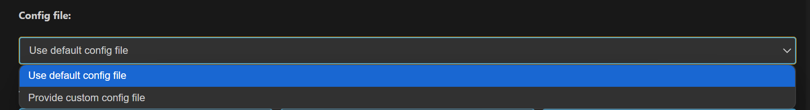

Extension Installation
======================

**Pre-requisites:**

1. Before using the extension, ensure the latest version of vscode is
   installed and code command is available in your terminal:

2. Windows/Linux: Add the path to VS Code’s bin folder to your system’s
   PATH environment variable.

3. macOS: Open the Command Palette in VS Code, search for “Shell
   Command: Install 'code' command in PATH”, and run it.

4. Verify: In your terminal, run code --version to confirm it’s working.

5. Supported platforms:

   a. Windows systems with x64-based architecture.

   b. Linux systems (Ubuntu 22.04 and above) with x86_64 architecture.

   c. Linux systems (Ubuntu 22.04 and above) with aarch64 architecture.

   d. Mac systems with x86_64 architecture.

   e. Mac systems with ARM64 architecture.

Steps to install the extension package
--------------------------------------

1. Use Astra_MCU_SDK_vscode_extension-1.1 extension VSIX file from the
   Release package: *<parent directory>/tools/*

..

   |image0|

Figure Path to extension package

2. Install the VSIX file in VS Code terminal using the following
   command, 

*code --install-extension path/to/VSIX file*

3. The installed extension will be displayed on the left side of VS Code
   extension (activity bar, where we can find the Synaptics extension).

|image1|

Figure Synaptics Extension icon

4. After installing the extension, the homepage opens showing its
   details. The extension version can also be verified from this tab.

|image2|

Figure Synaptics extension homepage

Steps to uninstall old package and reinstall updated one
--------------------------------------------------------

1. Remove the currently imported SDK from the workspace using the
   “Remove from workspace” option.

..

   |image3|

Figure Remove from Workspace

2. Uninstall the current extension using the “Uninstall” button.

..

   |image|

Figure Uninstall button

3. Close any active Webview or reload the window.

4. Install the new extension VSIX package by following the steps
   outlined in `Steps to install the extension
   package <#steps-to-install-the-extension-package>`__.

5. Install or reinstall the required tools (as per the Release Notes if
   any) and then import the SDK into the workspace.

Install Tools
=============

**Purpose:** To check and install the necessary tools for docker setup,
image flashing and debugging.

|image5|

Figure Install Tools

Tools checking
--------------

**Steps:**

1. This view will check if the necessary tools are already installed in
   well-known installation locations.

2. Tools checking is performed when the tab is opened for the first
   time. Subsequently, users can manually check the tool status by
   clicking the “Check tool status” button. A progress loader will be
   displayed to show the percentage of tools checking progress.

**Note:** On Linux and macOS, jq is required to read and write the
settings.json file. If it's not installed, a terminal will open to
install it, and you'll be prompted to enter your system password. Once
installed, the extension will continue checking tool status
automatically.

|image6|

Figure jq install terminal

**Result:**

1. If a tool is missing or its version does not match the required
   version, an exclamation mark (⚠️) will be displayed, and the
   installation checkbox will be automatically selected.

2. If a tool is already installed with the correct version, a green
   checkmark (|image7|) will appear, and the installation checkbox will
   remain unselected.

..

   |image8|

Figure Tools Checking

Tools installation
------------------

**Steps:**

1. After the tools check, you can select a directory to install the
   selected tools, or use the default installation path:

   a. Windows: C:/Users/<username>/SRSDK_Build_tools

   b. Linux/macOS: /home/<username>/SRSDK_Build_tools

2. Click “Install” to install the selected tools. This action will run
   the installation script in the “Install Script Terminal”, where you
   can view the logs. A loader will be displayed at the bottom to
   indicate the tools installation progress.

3. For installing AC6 compiler, click on “View Installation Steps”
   button and follow the steps. Refer figure for the installation steps
   for AC6 compiler.

**Note:**

-  The AC6 compiler is not available on macOS, so native AC6 builds are
   not supported. However, the extension enables AC6 builds on macOS by
   using the Linux archives. Detailed instructions are provided in the
   AC6 Compiler Installation Steps (see Figure 9).

-  On Linux and macOS, you’ll be prompted to enter your password in the
   ‘Install Script Terminal’ to proceed with the installation.

-  Docker Daemon installation is also included in the list of tools to
   be installed.

..

   |image9|

Figure Steps to install AC6 compiler

Docker Installation
-------------------

   The Astra SRSDK vscode Extension 1.1.0 is upgraded to use Docker
   for Build and image generation process. The following steps provides
   a comprehensive guide to install docker and start docker desktop. The
   tool installation feature of the Astra SRSDK vscode extension
   includes installation for docker.

   You may install Latest version of Docker in either of the following
   ways:

-  Using the built-in tool installer provided with the Astra SRSDK
   vscode extension, or

-  Directly from the official Docker documentation:
   https://docs.docker.com/

..

   Platform Requirements:

+-----------------+------------------------+------------------------+
|    **Platform** |    **Installation      |    **Notes**           |
|                 |    Requirement**       |                        |
+=================+========================+========================+
|    Windows      |    Docker Desktop      |    Shows Subscription  |
|                 |    (GUI)               |    Service Agreement   |
|                 |                        |    on first launch.    |
|                 |                        |    Requires elevated   |
|                 |                        |    privileges if       |
|                 |                        |    auto-install fails. |
+-----------------+------------------------+------------------------+
|    macOS        |    Docker Desktop      |    Same as Windows –   |
|                 |    (GUI)               |    accept terms and    |
|                 |                        |    optionally sign in. |
+-----------------+------------------------+------------------------+
|    Linux        |    Docker Engine (CLI  |    Runs as a           |
|                 |    only)               |    background service  |
|                 |                        |    automatically after |
|                 |                        |    install.            |
+-----------------+------------------------+------------------------+

..

   **General Notes:**

-  After installation, ensure the Docker engine is running before
   building with the SDK extension.

-  On Windows/macOS, Docker Desktop may prompt for sign-in (optional).

-  On Linux, no GUI is needed; the service runs automatically.

..

   **Installation via vscode Extension**

1. Open the Astra_MCU_SDK_vscode_extension.

2. | Go to the Install Tools tab → Select Docker Daemon Tool.
   | |image10|

Figure Select Docker Daemon tool

3. If Docker is not installed, the extension will prompt you. Click
   Install.

..

   |image11|

Figure Click Install button

4. Once complete, Docker Desktop (Windows/macOS) or Docker Engine
   (Linux) will start.

..

   |image12|

Figure Docker Subscription Service Agreement

|image13|

Figure Login into docker account

   |image14|

Figure Starting Docker Engine

   |image15|

Figure Docker Desktop Dashboard

Troubleshooting (Docker + Astra SRSDK VSCode Extension)
---------------------------------------------------------

   While installing and running Docker via the Astra SRSDK VSCode
   Extension, some issues may occur depending on system permissions and
   platform restrictions. The following points cover known issues and
   their resolutions.

   Windows

-  Installer blocked by admin policies

   -  Symptom: Selecting *Docker Daemon Tool → Install* downloads Docker
      Desktop, but the installer does not launch.

   -  Cause: Organization policies block direct execution of installers.

   -  Resolution:

      -  Navigate to the download folder and locate Docker Desktop
         Installer.exe.

      -  Right-click → Show more options → Run with elevated privileges.

      -  Accept the terms and conditions, skip login if prompted.

      -  Once Docker Desktop starts, the extension will detect it and
         mark the tool status as Installed.

-  Extension shows “Please start Docker engine” even after manual
   install

   -  Symptom: Docker Desktop is installed and running, but the
      extension does not detect it.

   -  Resolution: Close and reopen VSCode. The extension will refresh
      its tool detection and start the image build.

..

   Linux

-  Docker installed, but extension shows “Please start Docker engine”

   -  Symptom: Running docker info gives a permission denied error on
      /var/run/docker.sock.

   -  Cause: The current user is not yet recognized as part of the
      docker group.

   -  Resolution:

      -  Verify group membership: groups $USER.

      -  If docker is listed but still failing, reboot the system so
         group changes take effect.

      -  After reboot, rerun docker info to confirm.

..

   macOS

-  Full Disk Access required

   -  Symptom: Docker Desktop or VSCode fails to start containers or
      access mounted paths.

   -  Resolution:

      -  Open System Settings → Privacy & Security → Full Disk Access.

      -  Enable Full Disk Access for both Visual Studio Code and Docker
         Desktop.

      -  Restart both apps and retry the operation.

**General Notes:**

   In environments with strict IT restrictions (admin blocks,
   policy-enforced executables), the automated installation may fail. In
   such cases, use the manual installation method and then restart
   VSCode for the extension to detect Docker correctly.

**Result:**

1. The selected tools will be installed into the specified folder and
   the toolpaths will be stored in temporary settings.json file. This
   will be used to configure the workspace environment when an Astra MCU
   SDK is imported.

2. After installation, the tools checking will automatically run to
   update the status of tools.

..

   |image16|

Figure Tools Installation

Source Code Checkout
====================

**Purpose:** This option is to enable users to check out the Astra MCU
SDK from either local or remote (from GitLab).

|image17|

Figure Import SDK

**Steps:**

1. Click on the “Import SDK” button under the IMPORT SDK view. 

2. This will open the web view to import SDKs both from local and remote
   repositories. 

3. | **Local Import:** Under “LOCAL” tab, click on the “BROWSE” button
     and select the Astra SRSDK to import. This action will import the
     Astra SRSDK and add it to the workspace.
   | |image18|

Figure Import SDK from local

4. | **Remote Import:** Under the “REMOTE” tab, click on “CLONE REPO”,
     paste the repository URL to clone and then select the
     folder/location to clone into. GitLab needs proper SSH key setup.
     Cloning large repositories will take time. After cloning, the
     repository will be imported and added to the workspace in the
     “Imported Repos”.
   | |image19|

Figure Import SDK from remote

5. Once the Astra SRSDK is added to the workspace, tool paths will be
   set in the settings.json. If settings.json doesn't exist, it will be
   created; if it does, it will be modified accordingly.

**Note:** The settings.json, which is updated during tools installation,
is used to configure workspace-specific settings such as paths and
environment variables needed for proper Astra SRSDK integration and
development.

Imported Repos
==============

**Purpose:** Provides a quick interface for managing the imported Astra
MCU SDK and offers essential actions.

|image20|

Figure Imported Repos

**Options:**

1. **Refresh:** Will reload the current workspace.

2. **Build or Clean SDK:** Provides an interface to select necessary
   options and trigger a build or clean of the Astra SRSDK, with the
   build process executed inside Docker container.

3. **View in Explorer:** To open the current Astra SRSDK in explorer.

4. **Remove from Workspace:** To remove the currently imported Astra MCU
   SDK from the workspace.

**Note:** Currently, only one Astra SRSDK can be imported at a time.
Importing multiple SDKs in same workspace is not supported yet.

Docker Setup
------------

**Purpose:** To setup docker and run container.

1. Install Docker Desktop and ensure the Docker engine is running.

2. After installation, click Refresh in the VS Code extension to start
   the Docker setup (this step is required only once).

3. The extension will check for an existing Docker image.

4. If none is found, it will build one using the provided Dockerfile
   (image build is a one-time process).

|image21|

Figure Docker Image Build

5. On subsequent uses, only the container will run — the image will not
   be rebuilt unless required.

6. Once the container starts, the SDK’s root directory will be mounted
   into it.

7. When the container is running, you’ll see a notification: "Docker
   setup is ready".

..

   **Note:**

-  By default, Docker Desktop installs WSL 2 and a Linux distribution
      (like Ubuntu) during setup if it’s missing.

Build Functionality
-------------------

| **Purpose:** To build the project with selected application and
  configurations.
| **Prerequisite:** Ensure the Docker engine is running, and the
  container is up (status: **"Docker setup is ready"**).

|image22|

Figure Build Webview

**Steps:**

1. Once the required Astra SRSDK is imported, within Imported Repos
   column, click on “Build or Clean SDK”. This will open the build
   Webview. Make sure the imported folder is correct, typically the one
   containing the Makefile.

2. Select appropriate build configurations. The currently supported
   configurations are as follows:

   a. **Project Type:** sr110_cm55_fw, sr110_b0_bootloader, tflite_micro

   b. **Build Type:** Release, Debug, UnitestDebug

   c. **Board:** sr110_rdk

   d. **Board Revision:** Rev A, Rev B, Rev C

   e. **Compiler:** AC6 and GCC

3. Use a Release build when the binary is intended to be flashed onto
   the device. A Debug build generates an .axf/.elf file with debug
   symbols, making it suitable for debugging purposes. Choose the
   UnitestDebug build option to generate an .axf/.elf file that can be
   used for running Unity tests.

4. According to the selected “Project Type”, the specific applications
   will be populated in the “Applications” dropdown. Initially the “Edit
   configs” and “Build” buttons will be disabled. Once a proper
   Application is selected and applied from the dropdown, these buttons
   will be enabled.

5. When AC6 is selected as the compiler, a prompt will appear requesting
   the AC6 License query value. Enter the value and click OK to set the
   license and begin the AC6 build.

..

   | License Query Format:
   | ARMLM_ONDEMAND_ACTIVATION=<LICENSE_KEY>@http://<SERVER_ADDRESS>:<PORT>

|image23|

Figure AC6 compiler dialog box

6. | **Application:** Select the application to be loaded from the
     dropdown.
   | |image24|

Figure Application dropdown

7. | **Edit Configs:** The edit configs button will open the menuconfig
     layout in the terminal. Users can set the appropriate
     configurations using this menu.
   | |image25|

Figure Edit Config view

a. | Once the configs are edited and saved to .config, users have the
     option to save their custom defconfig. A prompt for saving the
     custom defconfig will appear like shown in below figure.
   | |image26|

Figure Prompt to save custom defconfig

b. Then users need to enter a filename under which the defconfig should
   be saved. Once given, the custom defconfig will be saved to *<parent
   directory>/examples/configs* folder.

|image27|

Figure Save defconfig dialog box

c. To change board revisions, after selecting the necessary application,
   click “Edit Configs” > select “SRSDK BUILD CONFIGURATION” > select
   “Board” > select “RDK Revisions” and choose appropriate revision and
   save the configuration.

|image28|

Figure Board revision selection

8. Once the necessary configs are set, click the **Build** button. The
   build will run inside the Docker container, with all output logs
   displayed in the terminal in real time.

..

   |image29|

Figure Build log in terminal

**Result:**

1. The generated axf/elf files can be found at */Astra_MCU_SDK/out/*
   directory. Upon a successful Release build, the AXF/ELF file path is
   automatically populated in the **IMAGE GENERATOR** tab. Similarly,
   after a successful Debug build, the file path is automatically
   populated in the **DEBUG PROBES** tab.

..

   **Clean the SDK:** Similarly, the Astra SRSDK can be cleaned by
   clicking the “Clean” button. The logs will be displayed in the
   terminal.

   |image30|

Figure Clean SDK logs

Image Generation
================

**Purpose:** This window will enable users to convert the axf/elf file
generated after the build process to be converted into binary files and
will aid in model bin conversion.

|image31|

Figure Image Generator

Image Conversion – Basic Configurations
---------------------------------------

**Steps:**

1. Click on the “Image Generator” button. It will open a web view for
   Image Generation.

2. In the web view, already the Release build file path will be
   pre-populated (if already built for Release option). Also, the user
   can select a custom axf/elf file for converting using the “Browse”
   button.

3. The necessary options need to be selected for converting axf or elf
   to bin.

4. Default options for converting axf/elf to bin – select Flash Image or
   Host Image checkbox and select Secured Image checkbox.

   a. Host Image – The binary which will be flashed to the RAM memory of
      the chip.

   b. Flash Image – The binary which will be flashed to the Flash memory
      of the chip.

   c. Secure – select this checkbox if the chip in use is secured;
      otherwise, leave it unchecked.

5. Users can also specifically select the “Flash Type” (default is
   GD25LE128) and “Flash Frequency” (default is 67) values from the
   dropdown once the Flash checkbox is selected.

6. For generating both Host and Flash images, select both Host and Flash
   Image checkboxes.

|image32|

Figure Image Conversion options

Image Conversion – Advanced Configurations
------------------------------------------

**Steps:**

1. Select the “Advanced Configurations” checkbox to reveal the advanced
   selections. Here users can select custom SPK and APBL file paths
   using the respective “Browse” buttons.

2. **Model Bin Conversion:** This option enables the conversion of vela
   model file into binary file. Select the Vela model binary using the
   “Browse” button and choose “Secure” according to the model.

3. **Edit JSON file:** Enables users to open and edit the JSON files.

4. Once the options are selected, click on the ‘Run Image Generator’
   button. This will start the conversion process, and the conversion
   logs will be shown in the Output window.

..

   |image33|

Figure Image Conversion - Advanced Configurations

**Result:**

1. The converted bin file path will be populated to Image Flashing
      Webview.

2. Once the conversion is completed, the conversion logs and binary
      files will be present in the following location
      *C:\Users\<username>\Bin_Location* for Windows and in
      *home/<username>/Bin_Location* for Linux and macOS.

..

   **NOTE:**

-  The above steps — tool installation, SDK build, and BIN conversion —
   can be performed in an SSH remote setup or WSL environment. Further
   steps beyond this (Image flashing, debugging and Video Streamer) are
   not supported in remote setup.

-  After selecting the required options, click the **Run Image
   Generator** button to start the image generation process inside the
   Docker container. Live logs will be displayed in the terminal.

Image Flashing
==============

**Purpose:** The image flashing web view can be used to load the image
onto the device either in ROM mode or FW mode

|image34|

Figure Image Flashing

**Pre-requisites:**

-  Install Python and necessary packages using the “SRSDK Tools
   Installer” tab to ensure proper working of flashing.

-  Ensure that the UART and the target device are properly connected to
   the system prior to starting flashing.

Flashing the image in ROM/FW mode
---------------------------------

|image35|

Figure Image Flashing - Service Type

**Steps:**

1. Make sure the device connections are properly established.

2. To load the binary into the RAM (using UART connection), select
   Service type as “ROM” and Select Command as “Load an Image from
   Binary File”.

3. To flash the image into Flash memory (using UART connection), select
   Service type as “ROM” and Select Command as “Burn File to Flash”.

4. To flash the image into Flash memory using CDC (FW update –
   application chip), select Service type as “FW” and Select Command as
   “Burn File to Flash”.

5. To update the DAP firmware, select “Advanced Options” → FW Update
   (Debug IC) in *Service Type*, choose the DAP chip COM port, and click
   Proceed in the confirmation dialog to flash the DAP-built binary to
   the Debug IC.

|image36|

Figure FW Update (Debug IC) - Warning pop up

6. The connected COM ports will be listed under the “COM Port” dropdown.

..

   **Note (Linux):**

-  UART devices connected via USB will appear as /dev/ttyUSB0,
   /dev/ttyUSB1 etc. Use these for flashing in ROM mode (UART-to-USB
   connection).

-  The available CDC will appear as /dev/ttyACM0, /dev/ttyACM1 etc. Use
   these for flashing in FW mode (FW update).

..

   **Note (macOS):**

-  UART devices connected via USB will appear as /dev/cu.usbserial-xxxx
   (e.g., /dev/cu.usbserial-DQ015QCI). Use these for flashing in ROM
   mode (UART-to-USB connection).

-  The available CDC will appear as as /dev/cu.usbmodemxx_xx (e.g.,
   /dev/cu.usbmodem01_00_00_001). Use these for flashing in FW mode (FW
   update).

7.  Select the appropriate Baudrate.

8.  The binary file path will be already populated either as dropdown
    (if both Host and Flash images were converted) or as file path text
    box (if either Host or Flash alone is converted). If user wants to
    select a custom file for flashing, they can choose the binary file
    path using the “Browse” button.

9.  While flashing the model binary file, please enter the sector offset
    address from which the model should start flashing at.

10. Click on “Execute”, the image loading will start, and the logs will
    be redirected in the output console.

..

   |image37|

Figure Image Flashing logs redirected to Output

**Result:** After flashing, the COM port will be disconnected, and the
new CDC will be detected. Logs of the loaded use case can be visualized
using the Serial Monitor tab. Select the appropriate COM port and click
“Start Monitoring”.

Flashing image using SWD/JTAG
-----------------------------

**Purpose:** This window allows users to flash the binary on to the
device using JLink/DAP.

|image38|

Figure Image Flashing using SWD/JTAG

**Steps:**

1. Select Service Type as “SWD/JTAG” in the Image Flashing Webview.

2. Select the Adapter Driver.

3. The flash binary file path will be pre-populated (if already flash
   binary is converted) or users can select the custom binary file using
   the “Browse” button.

4. When updating the use case, choose “Full Flash Erase” and click
   “Flash Execute” to erase the entire flash, ensuring a clean binary
   update.

5. After performing a full flash erase, deselect the checkbox and click
   “Flash Execute”. This will launch OpenOCD and GDB in separate
   terminals, establish a connection, erase the necessary memory, and
   flash the binary. Progress and script logs will appear in the Output
   window, while flashing logs will be shown in the OpenOCD terminal.

**Result:** Once flashing is completed, the telnet connection will be
dropped. Press reset on the device.

**Steps to flash model binary using SWD/JTAG:**

|image39|

Figure Model binary flashing using DAP

1. Do full flash erase - select the “Full flash erase” checkbox and
   click Flash execute to perform a complete flash erase.

2. Load the usecase vga binary file.

3. Load the model binary file - Select the “Model Binary” checkbox. A
   text box will appear to enter the flash offset—enter 0x629000. Browse
   and select the model binary, then click Flash Execute.

4. After flashing both usecase and model bins, click application chip
   reset. CDC will be detected.

**Notes:**

-  Users can load the use case binary independently or update the model
   binary (for the same use case).

-  However, if plan to change both the usecase and model bins, it’s
   recommended to perform a full flash erase beforehand.

-  If the CDC is not detected after flashing, try performing a full
   flash erase and reloading the binaries.

-  Since the binaries are flashed using OpenOCD commands, a sector erase
   is performed for the binary size before flashing. As a result, the
   flashing process takes a bit more time.

Debugging using GDB in Extension
================================

**Purpose:** This feature enables the user to debug the Astra SRSDK
using OpenOCD and GDB at the backend, aided by C/C++ extension to start
the debug session.

|image40|

Figure Debug Probe Interface

Download and Reset Program
--------------------------

**Pre-requisites:**

1. Install the following extensions using the “SRSDK Tools Installer”
   tab.

-  C/C++ IntelliSense, debugging, and code browsing extension in VS
   Code.

-  MemoryView extension to view the memory map while debugging.

-  Serial Monitor extension for viewing logs while debugging.

-  Memory Inspector CDT extension by Eclipse IDE.

1. Import an Astra SRSDK before debugging.

2. Ensure that Debug probe and the target device are properly connected
   to the system prior to starting debug.

**Steps:**

1. Click on the “Debug Probe Interface” button in DEBUG PROBES view.
   This will open the debugger Webview. 

..

   |image41|

Figure Debug Probe Interface Webview

2. After the Debug Probe Interface opens, use the browse button to
   select the path to the axf/elf file. Ensure that the file chosen is
   built with the ‘debug’ build type. If debug axf/elf was already built
   successfully using the extension, the file path will be automatically
   populated to the AXF/ELF Filepath.

3. | Select the necessary configurations (use the default configs:
     Transport select – SWD, Adapter Driver – JLink/CMSIS DAP, Adapter
     speed – 1000 KHz). 
   | **Note:** Adapter speed adjustment is supported with J-Link during
     debugging, but not yet fully functional with DAP.

4. | Users can either opt to use the default config file or can use
     custom config file for debugging. Select the appropriate options in
     the dropdown.
   | **Note:** The default config files are available at *<parent
     directory>/tools/openocd/configs/* folder for reference.

..

   |image42|

Figure Config File Selection

5. | After selecting the configs, hit “Download & Reset Program” button,
     you can see the status in the terminal window. This will start
     running OpenOCD in one terminal and start GDB debug session in
     another terminal.
   | **Note:** If debugging fails to start and you see messages like
     “Unable to start debugging,” try resetting the DAP chip and attempt
     again.

6. Once connection is established, the debugger will stop at main.

..

   |image43|

Figure Debugger paused at main

7. | Once the debugger is paused, users can view the variables, call
     stack, registers and the breakpoints in the side panel as shown in
     the below picture.
   | |image44|

Figure Debugger - Side panel options

Global Variables
~~~~~~~~~~~~~~~~

**Purpose:** Since the C/C++ extension used to start the GDB session
doesn’t support populating Global variables as they show the Local
variables, users can view a list of Global Variables along with its
values using this feature.

**Steps:**

1. While a debug session is active, right-click on the code space to
   view more options, click on “Show Global Variables”.

..

   |image45|

Figure Show Global Variables button

2. This will open a side panel which will list all the Global variables,
   their address, type and respective values. When this panel is open,
   it will get refreshed to fetch the latest values whenever the
   debugger is paused, either manually or while hitting a breakpoint.

..

   |image46|

Figure Global Variables Panel

Debug Toolbar
~~~~~~~~~~~~~

Once a debug session is started, the debug toolbar will appear at the
top of the window and will contain the buttons for basic debug
operations.

|image47|

Figure Debug Toolbar

-  **Reset Options:**

+---------------------------+-----------------------------------------+
|    **Option**             |    **Description**                      |
+===========================+=========================================+
| Reset and Break at Symbol | Used during debugging when user needs   |
|                           | to reset the program and pause          |
|                           | execution at a particular symbol. The   |
|                           | user can enter the desired symbol in    |
|                           | the text box (refer Figure 48), press   |
|                           | enter and then click the Reset and      |
|                           | Break at Symbol icon.                   |
+---------------------------+-----------------------------------------+
| Reset and Halt            | Resets the program, starts a new debug  |
|                           | session, and immediately halts          |
|                           | execution at Reset_Handler.             |
+---------------------------+-----------------------------------------+
| Reset and Run             | Resets the program, starts a new debug  |
|                           | session, and runs it without any halts  |
|                           | or breaks.                              |
+---------------------------+-----------------------------------------+

..

|image48|

Figure Symbol to Break at option

-  **Other Options:**

   -  **Continue/Pause** - to continue or pause the execution while
      debugging. In Linux and MAC, as pausing the debug session was not
      working, users can click on custom pause button added to this
      panel to pause the execution.

|image49|

Figure Custom pause button for Linux and MAC

-  **Step Over** – executes the current line of code without entering
   any function calls.

-  **Step Into** – Executes the current line and, if a function is
   called, enters the definition for step-by-step debugging.

-  **Step Out** – Continues execution until the current function
   returns, then pauses at the calling location.

-  **Restart** - To restart the currently running debug session, with
      the previously used entry point. For example, if user has started
      a debug session with 'X' as entry point, ­­­­­­restart will end
      the current session and start a new session and stop at same entry
      point.

-  **Stop** – to stop the current debug session.

Memory Inspection and Manipulation
~~~~~~~~~~~~~~~~~~~~~~~~~~~~~~~~~~

1. When debugging, users can inspect the raw contents of memory
   associated with a variable by following these steps:

   a. While debugger is paused, click on the “View Binary Data” button
      adjacent to the variable.

   b. This action opens a memory view tab which will show the memory
      contents in hexadecimal bytes, ASCII-decoded text and address
      offsets.

|image50|

Figure View Binary Data button

   |image51|

Figure Memory View

2. To view and edit memory in a particular address, right-click on the
   code space and select “Open Memory Viewer”. This will open two panels
   side by side.

..

   |image52|

Figure Open Memory Viewer button

   |image53|

Figure Memory Edit and Fill panel

3. “Memory” tab on the left side supports the listed features:

   a. Multiple memory formats – hovering over any byte displays multiple
      representations of the selected byte.

   b. Periodic refresh – When enabled, automatically refreshes memory
      data.

   c. Configurable memory display – customize memory views with options
      for columns, grouping and formats.

..

   |image54|

Figure Memory display in multiple formats

4. Whereas the customized memory panel at the right supports memory
   editing and memory filling capabilities.

   a. **Memory edit** – this allows the user to modify a specific memory
      address.

      i.  Enter the target memory address and the byte value to be
          written, and then click “Edit”.

      ii. This will write the specific value to the address. To verify
          this, users can check by enabling the “Periodic Refresh”
          option.

   b. **Memory Fill** – this allows filling a memory block with specific
      fill value.

      i.   Start Address: Beginning address of the memory region to
           start filling.

      ii.  Size: Total number of bytes to fill.

      iii. Fill value: The value (in hex) to repeatedly write into
           memory.

      iv.  Width: Number of bytes written per step (1, 2, 3 or 4).

**Note:**

Always choose a fill value that fits within the selected width. If it’s
smaller, the extension will safely pad it with zeros. For example:

-  If width is set to 1 byte, you can enter values like 0xFF but values
   larger than one byte is not allowed.

-  If the fill value is shorter that the selected width, it will be
   automatically padded with zeros to match the width. Example: Fill
   value: 0xFF and Width: 4 bytes, the memory will be filed as:
   0x000000FF.

Disassembly Viewer
~~~~~~~~~~~~~~~~~~

**Purpose:** The Disassembly View displays low-level machine
instructions alongside their corresponding memory addresses and decode
operations.

   **Steps:**

1. Right-click on the code space and select “Open Advanced Disassembly
   Viewer” during an active debug session.

..

   |image55|

Figure Open Advanced Disassembly Viewer button

2. The basic disassembly view at the left will display the disassembly
   and facilitates setting breakpoint at a specific address.

3. The custom disassembly panel at the right adds navigation controls:

-  Address Input: To jump directly to a specific address to view its
   corresponding instruction.

-  Go to PC: Instantly scrolls to the current Program Counter, helping
   track the instruction currently being executed.

-  Go Back: Navigates to the previously viewed disassembly address.

-  Go Forward: Returns to the next address in the history.

|image56|

Figure Advanced Disassembly Panel

Logging
~~~~~~~

-  Steps to redirect logs to the OpenOCD terminal while debugging:

   -  Click on “Edit Configs” button to open the menuconfig interface in
      Build SDK panel, select COMPONENTS CONFIGURATION -> Utilities ->
      LOGGER_DEFAULT_INTERFACE and set LOGGER_IF_CONSOLE or
      LOGGER_IF_UART_1_CONSOLE.

   -  Save this config and then build for Debug build type.

|image57|

Figure Viewing logs in OpenOCD terminal

-  Steps to view the logs using DAP logger port while debugging:

   -  Ensure that Serial Monitor extension is installed.

   -  Once the debug session has started, in Serial Monitor tab, select
      the DAP logger port and click “Start Monitoring”.

|image58|

Figure Viewing logs in Serial Monitor

Attach to Running Program
-------------------------

-  Follow the steps illustrated in `Download and Reset
   Program <#download-and-reset-program>`__ for selecting the
   configurations and then you can click on “Attach to Running Program”.
   This option will attach to the already loaded and running binary in
   the device, enabling you to pause and inspect the memory and program
   flow.

-  If you pause the debugger, you can view the variables, call stack,
   disassembly view and registers by selecting the appropriate options.

|image59|

Figure Attach to Running Program

Attach and Halt Program
-----------------------

-  Follow the instructions outlined in the `Download and Reset
   Program <#download-and-reset-program>`__ section to select the
   appropriate configurations. Then, click on "Attach and Halt Program"
   to attach to the already running binary on the device. This option
   will attach and pause execution, enabling you to inspect memory and
   analyse the program flow.

-  If you pause the debugger, you can view the variables, call stack,
   disassembly view and registers by selecting the appropriate options.

|image60|

Figure Attach and Halt Program

Video Streamer
==============

**Purpose:** The Video Streamer option is used to stream the video
output of frames while the usecase is being executed.

|image61|

Figure Video Streamer

**Pre-requisites:**

-  Install Python and necessary packages using the “SRSDK Tools
   Installer” tab to ensure proper working of video streamer.

-  Ensure that the usecase binary to be tested is flashed onto the
   device and the target device is properly connected to the system
   prior to starting video streamer.

|image62|

Figure Video Streamer Webview

**Steps for Vision Usecases:**

1. **Source Options:**

   a. **RGB:** If checked, frames will be displayed in RGB format, or it
      will be displayed as gray frames.

   b. **Demosaic:** Facilitates the configuration of required demosaic
      type from the dropdown.

2. **Overlay options:** The display of FPS and Resolution can be
   customized in this tab. When enabled, FPS and Resolution will appear
   on the frame.

3. **Recording options:**

   a. **Record Frames:** If enabled, raw frames and overlayed frames
      will be saved.

   b. **Record Video:** If enabled, the frames will be saved as video.

   c. **Recording FPS:** You can vary the FPS in which the video should
      be saved using the Recording FPS option.

   d. These recordings can be found at:

      i.  For windows: C:/Users/<username>/video_stream_output

      ii. For Linux and macOS: /home/<username>/video_stream_output

4. **Usecase Dynamic Commands:**

   a. Select the appropriate options from the dropdown. Once the usecase
      binary is properly flashed to the device, CDC ports will be listed
      in COM Port dropdown. Select the CDC port, select the usecase ID,
      and click “Create Use Case”.

   b. Custom build commands can be entered in the textbox and click
      “Send command”.

5. Once the usecase is created, click “Start Use Case” button. This will
   start the usecase and the Video Stream will be shown as a pop up.

6. Click on “Stop Use Case” button to stop the video stream and click on
   “Resume Use Case” button to resume the video stream.

|image63|

Figure Video Streamer for Person Detection

**Doorbell Usecase:**

The Doorbell use case is an auto-run application that does not require
create or start use case commands. It integrates the UC_JPEG_PREROLL and
IMAGE_STITCHING use cases to detect a person and capture, then display,
raw and high-resolution images upon detection. For detailed information,
refer to `Doorbell User
Guide <../examples/vision_examples/uc_jpeg_preroll/README.md>`__.

**Steps for Doorbell Usecase:**

1. Open the 'LOGGER' tab located in the lower panel of VS Code.

2. From the dropdown menu, select the logger port, choose the
   appropriate baud rate, and click 'Connect'.

..

   |image64|

Figure Logger tab

3. Now press Application chip RESET. Once the use case starts running,
   logs will appear in the logger window. If there is a detection when
   the device wakes up, the video stream will be triggered
   automatically.

4. The recorded frames and video will be saved at,

   a. For Windows: C:/Users/<username>/video_stream_output

   b. For Linux and macOS: /home/<username>/video_stream_output

5. You can save the logs as a text file using the 'Save logs as TXT'
   button and clear the logs using the ‘Clear logs’ button.

6. **Wakeup Triggers**

-  **Timer (CONFIG_WAKEUP_TRIGGER = 1):**

   -  Device wakes up every 10 seconds

-  **GPIO (CONFIG_WAKEUP_TRIGGER = 2):**

   -  Keep one end of the jumper cable connected to GND

   -  Wait at least 10 seconds after the device enters hibernation, then
      connect the other end of the jumper to the UART0 RX pin to trigger
      the wake-up

..

   |image65|

Figure Doorbell usecase video stream

**Steps for Autorun Usecases:**

1. Select the usecase from the “UC ID” dropdown and click “Connect Image
   Source” button.

2. This will display the video stream of the usecase which started
   running.

|image66|

Figure Connect Image Source button

.. |image2| image:: ./media/image3.png
   :width: 5.75658in
   :height: 3.28056in

.. |image8| image:: ./media/image9.png
   :width: 6.26806in
   :height: 4.25625in

.. |image17| image:: ./media/image18.png
   :width: 3.89514in
   :height: 1.13313in

.. |image22| image:: ./media/image22.png
   :width: 6.31042in
   :height: 3.44583in

.. |image43| image:: ./media/image43.png
   :width: 6.20411in
   :height: 3.87117in

.. |image56| image:: ./media/image56.png
   :width: 6.26806in
   :height: 3.61944in

.. |image62| image:: ./media/image62.png
   :width: 6.26806in
   :height: 2.48889in

