# Astra MCU SDK - VS CODE EXTENSION USERGUIDE

## TABLE OF CONTENTS

- [Supported SoCs](#supported-socs)
- [Extension Installation](#extension-installation)
    - [Steps to install the extension package](#steps-to-install-the-extension-package)
    - [Steps to uninstall old package and reinstall updated one](#steps-to-uninstall-old-package-and-reinstall-updated-one)
- [Install Tools](#install-tools)
    - [Tools checking](#tools-checking)
    - [Tools installation](#tools-installation)
- [Source Code Checkout](#source-code-checkout)
- [Import SDK](#import-sdk)
- [Imported Example](#imported-example)
    - [Build and Deploy](#build-and-deploy)
- [Logger](#logger)
- [Memory Analyzer](#memory-analyzer)

## Supported SoCs
<a id="supported-socs"></a>

This extension supports multiple SoC families. The core workflows (installation, tools, SDK import, logging, and memory analysis) are common across all devices.

For SoC-specific features such as build configurations, image generation, flashing, and debugging, refer to the appropriate platform-specific guide:

- **SR110**: See [VS CODE EXTENSION USERGUIDE for SR110](./SR110/Astra_MCU_SDK_VSCode_Extension_User_Guide_SR110.md)
- **SL2610**: See [VS CODE EXTENSION USERGUIDE for SL2610](./SL2610/Astra_MCU_SDK_VSCode_Extension_User_Guide_SL2610.md)

Throughout this guide, sections marked with 🔧 indicate SoC-specific functionality—consult your device's platform guide for detailed instructions.

## Extension Installation
<a id="extension-installation"></a>

**Pre-requisites:**

1.  Before using the extension, ensure the latest version of Visual
    Studio Code is installed and code command is available in your
    terminal:

2.  Windows/Linux: Add the path to VS Code's bin folder to your system's
    PATH environment variable.

3.  macOS: Open the Command Palette in VS Code, search for "Shell
    Command: Install \'code\' command in PATH", and run it.

4.  Verify: In your terminal, run code \--version to confirm it's
    working.

5.  Supported platforms:

    a.  Windows systems with x64-based architecture.

    b.  Linux systems (Ubuntu 22.04 and above) with x86_64 architecture.

    c.  Linux systems (Ubuntu 22.04 and above) with aarch64
        architecture.

    d.  Mac systems with x86_64 architecture.

    e.  Mac systems with ARM64 architecture.

### Steps to install the extension package

1.  Use Astra_MCU_SDK_vscode_extension-1.3.0 extension VSIX file from
    the Release package: *\<parent directory\>/tools/\**

    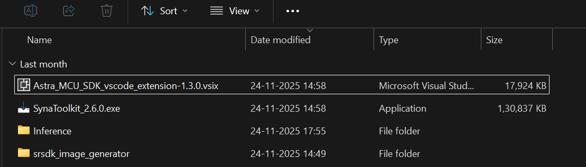

2.  Install the VSIX file in VS Code terminal using the following
    command, 
    ```
    code --install-extension path/to/VSIX file
    ```

3.  The installed extension will be displayed on the left side of VS
    Code extension (activity bar, where we can find the Synaptics
    extension).

    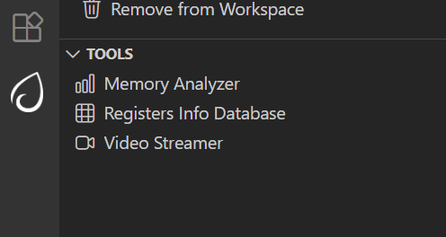

4.  After installing the extension, the homepage opens showing its
    details. The extension version can also be verified from this tab.

    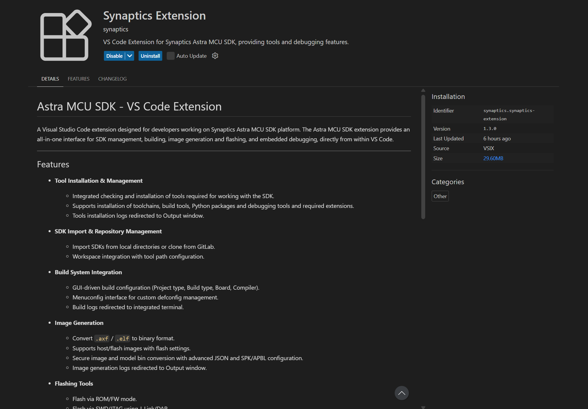


### Steps to uninstall old package and reinstall updated one

1.  Remove the currently imported Example directory from the workspace using the
    "Remove from workspace" option.

    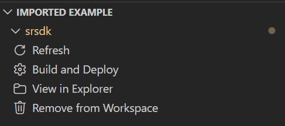

2.  Uninstall the current extension using the "Uninstall" button.

    

3.  Close any active Webview or reload the window.

4.  Install the new extension VSIX package by following the steps
    outlined in [Steps to install the extension
    package](#steps-to-install-the-extension-package).

5.  Install or reinstall the required tools (as per the Release Notes if
    any) and then import the SDK into the workspace.

## Install Tools
<a id="install-tools"></a>

**Purpose:** To check and install the necessary tools for build, image
flashing and debugging.


### Tools checking

**Steps:**

1.  This view will check if the necessary tools are already installed in
    well-known installation locations.

2.  Tools checking is performed when the tab is opened for the first
    time. Subsequently, users can manually check the tool status by
    clicking the "Check tool status" button. A progress loader will be
    displayed to show the percentage of tools checking progress.

**Note:** On Linux and macOS, jq is required to read and write the
settings.json file. If it\'s not installed, a terminal will open to
install it, and you\'ll be prompted to enter your system password. Once
installed, the extension will continue checking tool status
automatically.

**Note:** If you are updating from a older version of the extension please reinstall the required tools (as per the Release Notes if any) using the extension.

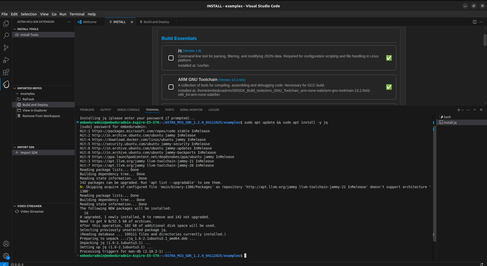

**Result:**

1.  If a tool is missing, its version does not match or a migration warning, an exclamation mark (⚠️) will be displayed, and the
    installation checkbox will be automatically selected.

2.  If a tool is already installed with the correct version, a green
    checkmark
    (✅) will appear, and the installation
    checkbox will remain unselected.

    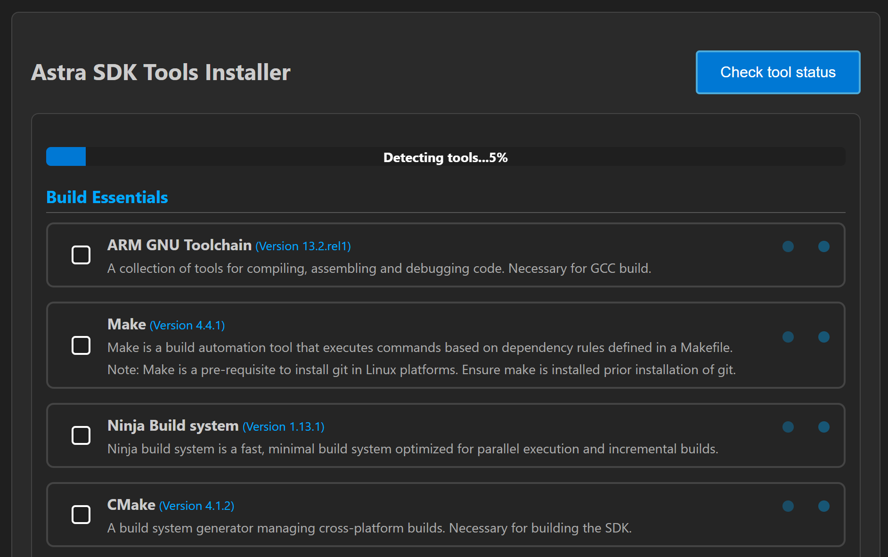

### Tools installation

**Steps:**

1.  After the tools check, you can select a directory to install the
    selected tools, or use the default installation path:

    a.  Windows: C:/Users/\<username\>/SRSDK_Build_tools

    b.  Linux/macOS: /home/\<username\>/SRSDK_Build_tools

2.  Click "Install" to install the selected tools. This action will run
    the installation script in the "Install Script Terminal", where you
    can view the logs. A loader will be displayed at the bottom to
    indicate the tools installation progress.

**Note:**

- On Linux and macOS, you'll be prompted to enter your password in the
  'Install Script Terminal' to proceed with the installation.

    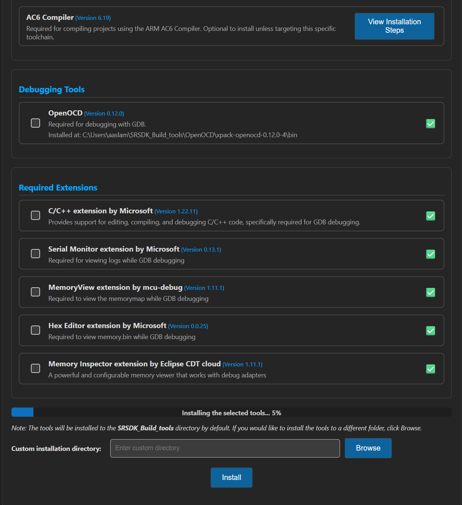

**Note for Installing AC6:**

- Due to licensing constraints, the Astra MCU SDK VS Code Extension does not support the direct installation of the ARM Compiler 6 toolchain. Users are required to perform a manual setup to enable full build functionality. Please refer to the `AC6 Installation stpes` in tools installer webview for the necessary installation steps.

    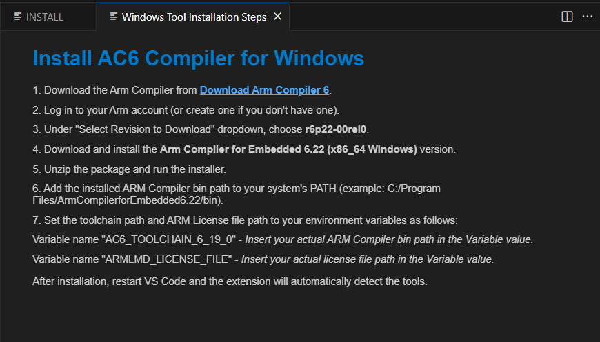


## Source Code Checkout
<a id="source-code-checkout"></a>

**Purpose:** This option is to enable users to check out the Astra MCU
SDK's example directory from either local or remote (from GitLab).

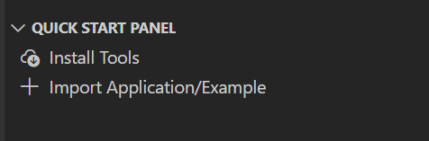

**Steps:**

1.  Click on the "Import Application/Examples" button under the `Quick Start Panel` view. 

2.  This will open the web view to import SDKs example folder both from local and remote repositories. 

3.  **Local Import:** Under "LOCAL" tab, click on the "BROWSE" button
    and select the Astra MCU SDK's example directory to import. This action will import the
    Astra MCU SDK and add it to the workspace.
    
    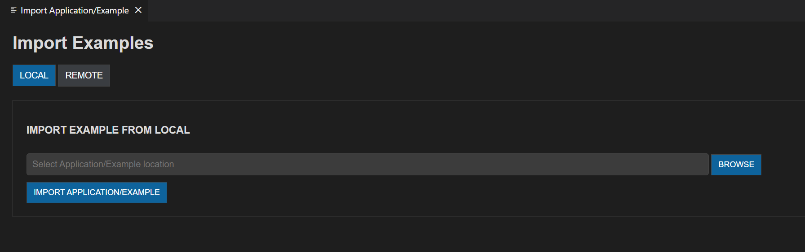

4.  **Remote Import:** Under the "REMOTE" tab, click on "CLONE REPO",
    paste the repository URL to clone and then select the
    folder/location to clone into. GitLab needs proper SSH key setup.
    Cloning large repositories will take time. After cloning, the
    repository will be imported and added to the workspace in the
    "Imported Example".\
    \
    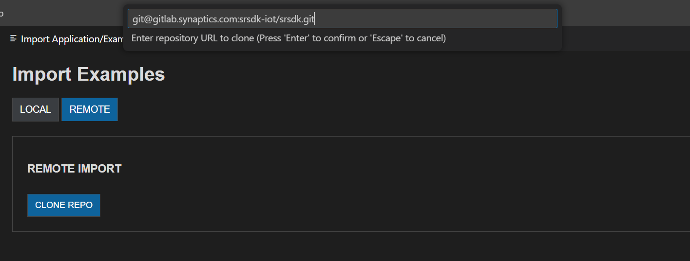

5.  Once the Astra MCU SDK is added to the workspace, tool paths will be
    set in the settings.json. If settings.json doesn\'t exist, it will
    be created; if it does, it will be modified accordingly.

> **Note:** The settings.json, which is updated during tools installation, is used to configure workspace-specific settings such as paths and environment variables needed for proper Astra MCU SDK integration and development.

## Import SDK
<a id="import-sdk"></a>

**Purpose:**

The Import SDK action is used to set the workspace `SRSDK_DIR` to the Astra MCU SDK root. It does not perform repository cloning or import example/application source code — those actions are handled by the `Import Application/Examples` (Source Code Checkout) flow. The `SRSDK_DIR` setting lets the extension locate tools, SDK packages, and the top-level SDK layout for build, image conversion and flashing workflows.

**What it does**

- Writes or updates the workspace `settings.json` entry (for example `SRSDK_DIR`) so other extension panels can find the SDK automatically.

**Steps — Set SRSDK_DIR**

1. Open the Import SDK view from the Synaptics extension sidebar. (Which will be visible after importing an example directory.)

    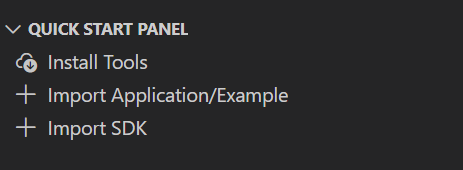

2. Click `BROWSE` and choose the Astra MCU SDK root directory.
    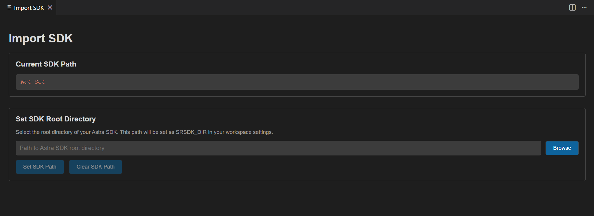

3. Confirm the selection. The extension validates the folder and updates the workspace `settings.json` with `SRSDK_DIR` pointing to the chosen path.

    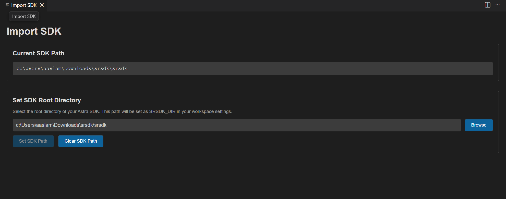
4. Verify the `Build & Deploy` panels detect the SDK path; if they do, the Build configuration workflows will use it automatically else a user would not be able to select the build configuration section in build and deploy.

    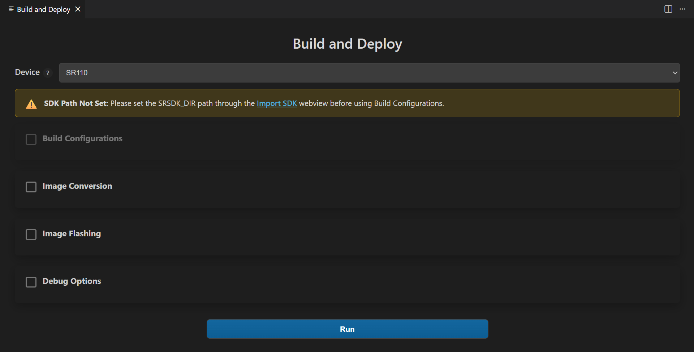

## Imported Example
<a id="imported-example"></a>

**Purpose:** Provides a quick interface for managing the imported Astra
MCU SDK's example folder and offers essential actions.

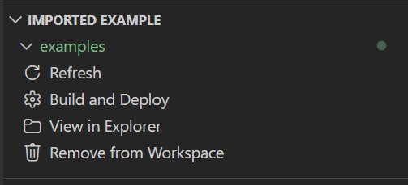

**Options:**

1.  **Refresh:** Will reload the current workspace.

2.  **Build and Deploy:** Provides a combined interface for building and
    flashing the image onto the device and for debugging.

3.  **View in Explorer:** To open the current folder in explorer.

4.  **Remove from Workspace:** To remove the currently imported folder from the workspace.

**Note:** Currently, only one Astra MCU SDK can be imported at a time.
Importing multiple repos in same workspace is not supported yet. In
Windows, the suggested path length of the imported SDK folder should not
exceed 100 characters.

### Build and Deploy
<a id="build-and-deploy"></a>

**Purpose:** Provides a unified environment to build, image generation,
flashing and debugging.

**Steps:**

1.  Once the required Astra MCU SDK is imported, within Imported Repos
    column, click on "Build and Deploy". This will open the Build and
    Deploy Webview. Make sure you have imported the "examples" directory
    for building the custom applications.

2.  Once you import the examples directory and open the Build and Deploy if you have not set the SRSDK_DIR through the `Import SDK` view you will not be able to build any application so please make sure you import the SDK if you want to continue with the build configuration step.

**Workflow Description:** The Build and Deploy webview is a unified
interface for multiple operations. Users can perform either one
operation at a time or combination of operations.

🔧 **SoC-Specific Build & Deploy Workflows:**

For detailed instructions on building, flashing, debugging, and other platform-specific features, refer to your SoC's platform guide:

- **SR110 users**: See [VS CODE EXTENSION USERGUIDE for SR110](./SR110/Astra_MCU_SDK_VSCode_Extension_User_Guide_SR110.md#build-configurations-sr110)
- **SL2610 users**: See [VS CODE EXTENSION USERGUIDE for SL2610](./SL2610/Astra_MCU_SDK_VSCode_Extension_User_Guide_SL2610.md#build-configurations-sl2610)

**Common Workflow Principles:**

**Integrated workflow:** This unified webview is used to manage SDK
build, binary conversion, image flashing and debugging from a single
interface. This provides users with two modes of operation:

a.  **Unified workflow --** Users can configure all required options and
    execute the full workflow in one step. This will build the SDK,
    generate the binary, and flash it onto the device.

b.  **Isolated workflow --** Users can perform individual steps
    independently, such as building only the .axf/.elf, generating a
    binary, flashing an existing binary or debugging.

## Logger
<a id="logger"></a>

The ASTRA MCU Extension has a built in LOGGER tab to connect to the logger port and visualize the logs.

1. The logger utility is available in the default bottom panel of VS Code denoted as **LOGGER**.
2. Connect the logger port (UART/DAP logger), select the COM Port from the dropdown and click *Connect*. The logs will be displayed in the display area as shown below.
   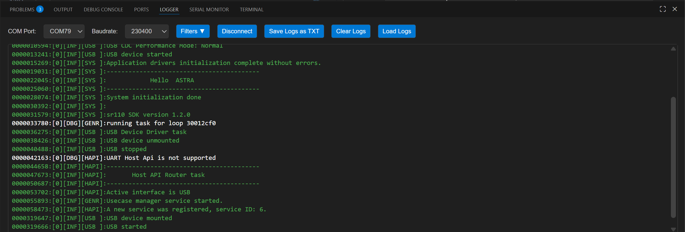
3. The logger now has utilities to save the ongoing log session and also load previously saved log files (which are in either .txt/.log format).
4. The logs are also color coded with respect to their log level, which would enhance the ease of use for the user.

- Green - LOG_LEVEL_INFO
- Red - LOG_LEVEL_ERROR
- Yellow - LOG_LEVEL_WARN
- White - LOG_LEVEL_DEBUG

5. Apart from this there is also a utility to filter out the logs based on the above mentioned log levels for easy filtering of relevant logs.

## Memory Analyzer
<a id="memory-analyzer"></a>

**Purpose:**

The Memory Analyzer parses linker `.map` files and produces both summary and per-object analyses to help you understand flash and RAM usage. It is useful to find large symbols, inspect function-level code sizes, and generate reports for optimization.

**What the analyzer reports:**

- **Total code size (flash):** Sum of `.text` and related read-only sections.
- **Total RW data (initialized RAM):** Sum of `.data` sizes.
- **Total ZI data (uninitialized RAM / .bss):** Sum of `.bss` sizes.
- **Total RAM usage:** RW + ZI.
- **Top consumers chart:** Visual top-10 object files by total size (code + RW + ZI).
- **Memory breakdown:** Section-level view (Code, Const/ROData, RW, ZI) with simple Stack/Heap estimates shown in the UI.
- **Detailed object analysis:** Per-object cards showing `codeSize`, `rwDataSize`, `ziDataSize`, total size, and a list of discovered functions with individual sizes.

**Pre-requisites:**

- A linker `.map` file from a build (common location: `examples/out/`).

**Supported compilers & parsing behaviour:**

- The analyzer understands GCC-style , AC6-style or LLVM-style map file layouts and exposes a `Compiler` selector (GCC/AC6/LLVM) in the UI. If the parser cannot find expected sections, the extension shows a warning and displays sample fallback data to demonstrate the UI.

**How to use the UI:**

1. Open the *Memory Analyzer* panel from the Synaptics extension sidebar.
2. Drag & drop a `.map` file into the upload area or use `Browse` to choose the file.
    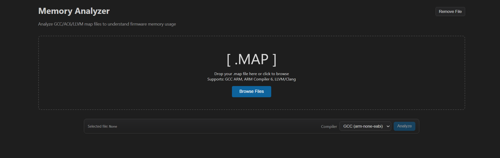
3. Select the compiler type in the dropdown (GCC/AC6/LLVM) and click `Analyze Memory`.
4. Wait for the loader; once complete the Memory Summary and Detailed Object Analysis panels appear.
    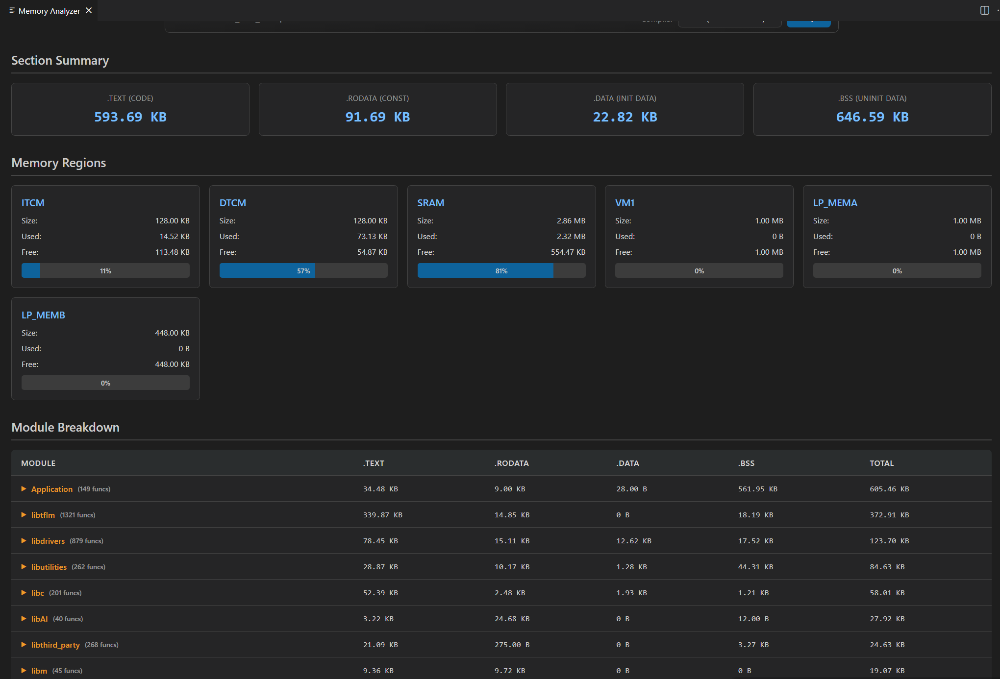
5. Use the search box to filter objects/functions, change `Sort by` to reorder, and use pagination controls to navigate large result sets.

