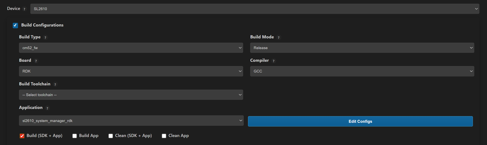
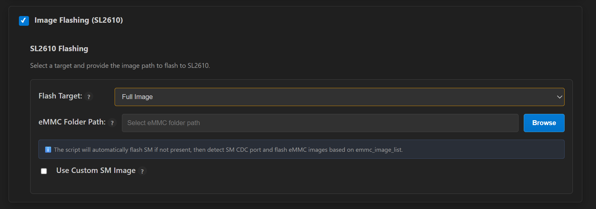

# Astra MCU SDK - VS CODE EXTENSION USERGUIDE for SL2610

# TABLE OF CONTENTS

- [Overview](#overview)
- [Build Configurations SL2610](#build-configurations-sl2610)
- [Image Generation SL2610](#image-generation-sl2610)
- [Image Flashing SL2610](#image-flashing-sl2610)

# Overview
<a id="overview"></a>

This document describes SL2610-specific build, Image generation and flashing workflows. Bebugging through the VS Code extension are not currently supported. 

**Prerequisite**: Complete the common setup steps in the [Main User Guide](../Astra_MCU_SDK_VSCode_Extension_User_Guide.md) before proceeding with SL2610-specific workflows.

For common features such as extension installation, tools installation, SDK import, logging, and memory analysis, refer to the [Main User Guide](../Astra_MCU_SDK_VSCode_Extension_User_Guide.md).

# Build Configurations SL2610
<a id="build-configurations-sl2610"></a>

**Purpose:** Build SL2610 firmware (cm52) and provide SL-specific image generation/flashing controls.

**Key options (UI):**
- **Project:** select `SL2610` from the global Project selector (value `sl2610`).
- **Board:** `RDK` (`sl2610_rdk`) or `PEK` (`sl2610_pek`).
- **Project / Build Type:** `sl2610_cm52_fw` (shown as `cm52_fw`).
- **Build Mode:** only `Release` is available for SL2610.
- **Compiler:** `GCC`.
- **Toolchain:** populated by the extension via `requestToolchains` and selectable in the Toolchain dropdown.

**Steps:**
1. Set the workspace `SRSDK_DIR` via the Import SDK view so the Build UI can detect the SDK.
2. Open the Build & Deploy webview and set `Project` → `SL2610`.
3. Select the desired `Board` (RDK or PEK) and confirm `Project` shows `cm52_fw`.
4. Choose `Release` and an available `Toolchain` if needed.
5. Enable the Build Configurations toggle and click `Run` to build.

**Notes:**
- The Build Configurations section is disabled until a valid `SRSDK_DIR` is set; use the Import SDK panel to set it.
- SL2610 builds only support Release mode from the extension UI — use local toolchains or scripts for custom debug workflows.
- Custom defconfig handling is the same as described in the SR110 Build Configurations section.



# Image Generation SL2610

Purpose: This option will enable users to convert the MCU executables generated after the build process into sub-Images.

**\
Working Modes:**

- **Unified working:** You can select Build Configurations and Image
  Generation which will build the application and then convert the
  MCU executable into sysmgr.subimg.gz. After build, the release executable file path will
  be populated to the Image Generation panel automatically.

- **Isolated working:** You can select Image Generation panel alone,
  choose a custom MCU executable file and select the necessary options. This
  will just convert the selected file into sub-image.

  

**Steps:**

1.  Click on the "Image Generation" panel.

2.  In the file path, already the Release build file path will be
    pre-populated (if already built for Release option). Also, the user
    can select a custom MCU executable file for converting using the "Browse"
    button.

3.  Click Run to convert the MCU executable to sub-image.

**Result**

The resultant sub-image will be generated in `out/sl2610_cm52_fw/release/sysmgr.subimg.gz`.

>Note: Image Generation feature for SL2610 is available only on Linux platforms.

# Image Flashing SL2610

**Pre-requisite:**
To access the CDC ports for flashing, run:
```
sudo usermod -a -G dialout $USER
```

Then log out and log back in (or restart the computer) for the group changes to take effect

There are two supported methods of image flashing. 
1. Yocto Based Flashing - https://synaptics-astra.github.io/doc/v/latest/linux/index.html

2. VS Code Based Flashing

## VS Code Based Flashing for SL2610

<a id="image-flashing-sl2610"></a>

Choose the target as `M52 Image` or `Full Image` in the `Flash Target` dropdown.
>The **M52 Image** option corresponds to System Manager Sub-Image.
>The **Full Image** option correspomds to eMMC Imaege.

**M52 Image flashing requirements:**
- Provide the sysmgr subimg file path in the Image flashing panel.
- To select a custom sysmgr subimg use the `Browse` option to select the file.
>Note: If the workflow is in `unified mode` the generated sysmgr subimg after image generation will get populated to image flashing panel automatically.


**Full Image flashing requirements:**
- Provide the eMMC folder path that contains `emmc_part_list` and `emmc_image_list`. The extension uses these files to determine partitions and image order for flashing.
- Optionally enable "Use Custom SM Image" to override the default SM image (use with caution).



**How to run (quick):**
1. In Build & Deploy set `Project` → `SL2610` and enable the SL2610 flashing toggle.
2. For Image Flashing (Full Image) provide the eMMC folder path.
3. Click `Run` — the extension will validate inputs and start the SL2610-specific workflow.

**Safety & notes:**
- If SM CDC is not detected, the Image flashing flow will auto-flash a default SM image; changing defaults can break flashing — only provide custom SM images when you know the required versions.

