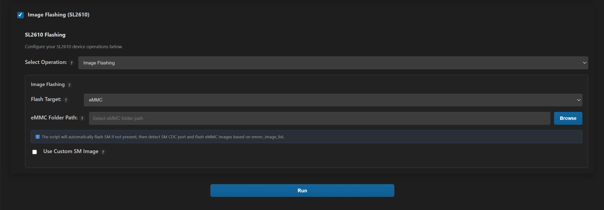

# SL2610 Platform Guide

This guide provides **SL2610**-specific technical details that supplement the main Astra MCU SDK documentation.

It is intended to be referenced by other guides (such as the [Astra MCU SDK User Guide](../Astra_MCU_SDK_User_Guide.md), [Build System Guide](../Astra_MCU_SDK_Build_System.md), and [VS Code Extension guide](../Astra_MCU_SDK_VSCode_Extension_User_Guide.md)) whenever SL2610-specific behavior, constraints, or workflows need to be described.

Scope clarification

This document is not a primary or authoritative guide
It does not override other Astra MCU SDK documents
It serves as a detailed reference for SL2610 platform-specific topics
Primary user workflows and concepts remain documented in: - [Astra MCU SDK User Guide](../Astra_MCU_SDK_User_Guide.md) - [Build System Guide](../Astra_MCU_SDK_Build_System.md) - [VS Code Extension guide](../Astra_MCU_SDK_VSCode_Extension_User_Guide.md)

Those documents may refer to specific sections of this guide for additional SL2610 detail.

---

## Contents
- [Platform Overview](#platform-overview)
- [Hardware Setup](#hardware-setup)
- [Quick Start (VS Code)](#quick-start-vs-code)
- [Quick Start (Native CLI)](#quick-start-native-cli)
- [Image Generation](#image-generation-2)
- [Image Flashing](#image-flashing)
- [Running Applications](#running-applications)
- [Debugging](#debugging)

---

## Platform Overview

### SL2610 Specifications

**Processor:** - Arm Cortex-M52 CPU

**Memory:** - eMMC storage for boot images and filesystem

**Supported Development Kits:** - **SL2610_RDK** (Astra Machina Micro SL Series)

---

## Hardware Setup

> **Important:**
> The official and up-to-date hardware documentation is maintained at: https://synaptics-astra.github.io/doc/v/latest/ </br>
> That documentation takes precedence over the content in this section. This section is provided only as a convenience reference.

---

### SL2610 RDK

<figure>

<figcaption><b>Figure 1.</b> SL2610 RDK Board</figcaption>
</figure>

---

### Connection Steps

#### 1. Power Connection

- Connect a **5V USB Type-C power adapter** to the **PWR IN** connector
- Ensure the power adapter can supply sufficient current (recommended: 2A or higher)
- Power LED should illuminate when connected

#### 2. Data Connection

- Connect the **USB 2.0 OTG port** to your host machine using a USB-C cable
- This connection is used for:
  - eMMC flashing
  - System Manager image installation

#### 3. UART Logging Connection

For console output and debugging logs, connect a USB-to-UART adapter:

| Signal | Board Pin | Description | Notes |
|--------|-----------|-------------|-------|
| UART TX | Pin 8 | `SM_UART0_TX` | Board transmit → Host receive |
| UART RX | Pin 28 | `SM_UART0_RX` | Board receive → Host transmit |
| GND | Pin 6 | Ground | Common ground reference |

**UART Settings:**
- **Baud rate**: 115200
- **Data bits**: 8
- **Parity**: None
- **Stop bits**: 1
- **Flow control**: None

---

**Connection diagram:**
```
Host USB-UART Adapter          SL2610 RDK
┌─────────────┐               ┌──────────┐
│     RX      │ ←───────────── │  Pin 8   │ (TX)
│     TX      │ ───────────→   │  Pin 28  │ (RX)
│     GND     │ ←────────────→ │  Pin 6   │ (GND)
└─────────────┘               └──────────┘
```
---

### Verify Hardware Setup

1. **Check power LED** is illuminated
2. **Verify USB 2.0 OTG connection** shows up on host:
   - Windows: Check Device Manager
   - Linux: `lsusb` should show USB device
   - macOS: System Information → USB
3. **Test UART connection** using serial terminal:
   - Open serial monitor (115200 baud, 8N1)
   - Reset board
   - Should see bootloader or system messages

---

## Quick Start (VS Code)

This section summarizes the **SL2610**-specific flow when using the VS Code extension.

### Build MCU Executable

1. Import SDK and examples
2. Select Project: SL2610, Build Type: cm52_fw
3. Enable Build (SDK + App)
4. Run build

### Output
```
examples/out/sl2610_cm52_fw/release/sl2610_cm52_fw.elf
```

### Image Generation

Binary-to-image generation is handled via Yocto.
Refer to [Image Generation](#image-generation-2) section.

### Flashing

VS Code supports: - Updating MCU-specific binary (SM image) and  Flashing full SL2610 eMMC image

Refer to [Image Flashing](#image-flashing) section.

---

## Quick Start (Native CLI)

### Build MCU Executable

```
cd <sdk-root>/examples
export SRSDK_DIR=<sdk-root>
make cm52_sl2610_system_manager_defconfig BOARD=SL2610_RDK BUILD=SRSDK
```

### Image Generation
Follow the **Yocto-based image generation** in Image Generation section.
refer [Image Generation](#image-generation-2)

### Flashing
Refer flashing section [Image Flashing](#image-flashing)

---

## Image Generation

SL2610 uses a **Yocto-integrated, multi-stage image generation workflow.**

**Step 1: Build MCU Executable (Astra MCU SDK)**

```
#Build System Manager for SL2610_RDK
cd examples
make sl2610_system_manager_rdk_defconfig BOARD=SL2610_RDK BUILD=SRSDK

#Build Bootloader for SL2610_RDK
cd <sdk_root>
make cm55_sr110_bootloader_defconfig BOARD=SL2610_RDK
make build

#Generate MCU Binaries
cd examples
make imagegen
```
**Step 2: Copy MCU Binary into Yocto Build Tree**

copy the generated binary to Yocto build repository: 

```
build-sl261<X>/tmp/work/sl261<X>-poky-linux/synasdk-preboot/<GIT>/release/boot/mcu/cm52/image/chip/klamath/klamath_rdk/
```
Example:

```
build-sl2619/tmp/work/sl2619-poky-linux/synasdk-preboot/0.9.0+git/release/boot/mcu/cm52/image/chip/klamath/klamath_rdk/
```

**Step 3: Build Astra Image via Yocto**

Build an Image using Yocto - https://synaptics-astra.github.io/doc/v/latest/yocto.html

---

## Image Flashing

Image flashing can be done with either VScode EXtension/Native CLI Tools, or the direct method with yocto SDK.

### Prerequisites

1. **Hardware Connections**
   - 5V USB-C power to PWR_IN
   - USB 2.0 OTG connected to host
   - UART connected for monitoring (optional but recommended)

2. **Software Requirements**
   - Python 3.13 environment activated
   - eMMC image generated (see [Image Generation](#image-generation))
   - Flashing tools from Syna-Release SDK or Astra SDK

3. **System Manager Sub-Image**
   - Required for initial board setup
   - Automatically handled by flashing tool if missing

### Flashing via VS Code Extension

**Hardware requirements:**
- **Power**: Connect 5V USB-C power adapter to PWR_IN
- **Data**: Connect USB 2.0 OTG port to host machine

>The flashing behavior is controlled by the eMMC image list, which determines which sub-images are programmed to eMMC.

**Flash Operation:**

1. In the extension, navigate to **Image Flashing**

2. Set Flashing Target to `eMMC` 

3. Select the `eMMC` image folder path

3. Start the flash operation

   <figure>
   
   </figure>


### Image Flashing via Native CLI

Flashing can be performed via Native CLI with the following commands using USB Boot Tool.
**Tool path:** - `tools/usb_boot_python_tool/USB_BOOT_TOOL/usb_boot_tool.py`

```
python usb_boot_tool.py --op run-sm --sm sysmgr.subimg
python usb_boot_tool.py --op emmc --img-dir eMMCimg
```

#### **Arguments Description**

| Argument    | Description                                                            |
| ----------- | ---------------------------------------------------------------------- |
| `--op`      | Operation to perform. Supported values: `run-acore`, `run-sm`, `emmc`. |
| `--sm`      | Path to the System Manager image (`sysmgr.subimg`).                    |
| `--img-dir` | Path to the directory containing eMMC images (`eMMCimg`).              |

### Direct Flashing

For direct flashing procedures, refer: https://synaptics-astra.github.io/doc/v/latest/hw/sl2600.html

#### Important

For MCU-specific updates, the eMMC image list must be restricted to the System Manager sub-images.

Modify the following file to include only the required entries:
```
eMMCimg/emmc_image_list
```

Configure the list with only the following sub-images:
```
preboot.subimg.gz,b1
preboot.subimg.gz,b2
sysmgr.subimg.gz,sd6
sysmgr.subimg.gz,sd8
```
This configuration limits flashing to the MCU-relevant components.

By default, the eMMC image list includes all sub-images generated as part of the full Yocto build.

To flash the complete eMMC image:

- Leave the eMMC image list unchanged
- Proceed directly with flashing

---

## Running Applications

### System Manager Handling

**Automatic Detection:**

The flashing tool checks for System Manager (SM) image presence:

```
Checking for System Manager image...
  ✓ SM image found: proceeding with eMMC flash
    or
  ✗ SM image not found: installing default SM image first
```

**Manual SM Image Installation (if needed):**
```bash
python tools/sl2610_flash/sm_flash.py \
  --image tools/sl2610_flash/default_sm_image.bin \
  --port /dev/ttyUSB0
```

### Verification

**Monitor UART during flashing:**
```bash
# Open serial console
screen /dev/ttyUSB0 115200

# Or use minicom
minicom -D /dev/ttyUSB0 -b 115200
```

**Expected output:**
```
[FLASH] Starting eMMC programming...
[FLASH] Erasing sectors...
[FLASH] Writing image... 0% ... 50% ... 100%
[FLASH] Verifying... OK
[FLASH] Programming complete
```

**Post-flash verification:**
1. Power cycle the board
2. Monitor boot messages on UART:
   ```
   [BOOT] SL2610 System Manager v1.0
   [BOOT] Loading application from eMMC...
   [APP]  Application initialized
   [APP]  System ready
   ```

---

## Debugging

> **⚠️ Hardware Debugging Not Available:** The SL2610 platform does not support hardware debugging. UART logging is used.

---

## Detailed Setup Guides

For step-by-step instructions on environment setup, tool installation, and flashing procedures, please refer to the specific guides below:

* **VS Code Workflow:** [Astra MCU SDK VSCode User Guide](../Astra_MCU_SDK_VSCode_Extension_User_Guide.md)
* **Command Line Workflow:** [Astra MCU SDK User Guide](../Astra_MCU_SDK_User_Guide.md)

---

**Document Version:** 3.0
**Last Updated:** January 2026  
**Supported Platforms:** SL2619_RDK (Astra Machina Micro SL Series)
