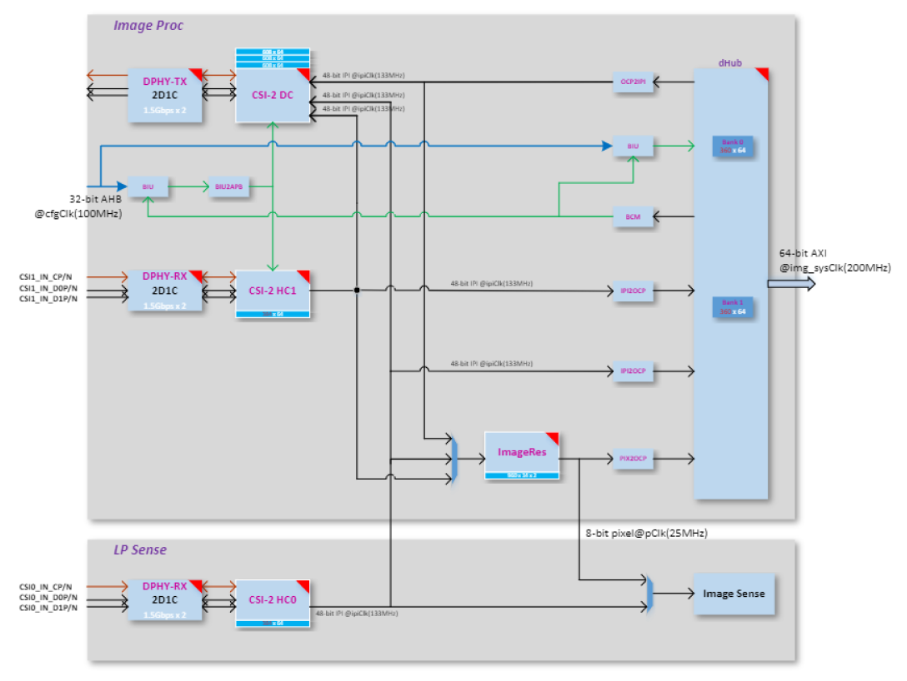

# Astra MCU SDK MIPI Sensor Integration Guide

## Introduction

This document provides an overview of Image sensor integration to the Astra MCU SDK. 

Figure 1-1 depicts the high-level block diagram of SR100 CSI controllers connected to Image Proc / Image Sense path. The top block depicts different blocks within Image Proc, second block depicts CSI host controller feeding Image Sense pipeline. The capabilities of Image proc / Image Sense block play a key role in choosing the sensor. For more details on these blocks consult the device Technical Reference Manual (TRM).

> Note: This document applies only to the Astra SR100 device. The capabilities, configurations, and integration steps described here are specific to the SR100 platform.

<figure style="text-align: center;">
  
  <figcaption><b>Figure 1-1 </b> ImageProc-high level block diagram</figcaption>
</figure>

## SR100 Capability

### CSI Host controller

- Max number of lanes per CSI host = 2 
- Max data lane rate = 1500 Mbps per lane 
- Pixel bit depth = 8 or 10 bits. 
- Raw bayer / Monochrome/ RGB / YUV.

###  ImageProc

- Operating clock = 133 MHz

### LP Sense

- Operating clock = 25 MHz

### Sensor Clock

- SR100 Clock Out = 24 or 19.2 MHz 

## Sensor Capability

To port the camera sensor, the following parameters must be checked and compared against CSI & LP Sense capability:

1. MIPI Clock Mode: continuous or non-continuous mode.
2. Num of lanes.
3. Pixel Depth.
4. Frame Rate.
5. Frame width and height (include blanks).
   Or
   Width and Height (without blanks).
6. Sensor clock frequency.
7. MIPI clock rate.

**MIPI Clock Calculation**

```
PixelRate = FrameWidth * FrameHeight * fps

MIPI Bandwidth = PixelRate * Bits_per_pixel

Datarate per lane = MIPI Bandwidth/number_of_lanes

MIPIClkRate (differential) = Datarate_per_lane/2
```

**Sensor Settings provided by Vendor**

```
FrameWidth=2560

FrameHeight=2250

FrameRate = 30

PixelDepth = 10

PixelRate = 172.80000

MipiClkRate = 432.00000

Datarate per lane = 172.8*10/2 = 864Mhz
```

## Sensor Integration

### Settings Selection

Based on the comparison below, pick up the appropriate settings from sensor vendor.

1. Compare Sensor’s MIPI Lane clock, lane, and bit depth capability against SR100 CSI host controller capability.
2. Check Sensor input clock’s requirement.
3. Sensor’s pixel rate must be lower than LP Sense clock (25Mhz) when CSI Host controller connected to LP sense path
4. Sensor’s MIPI Clock (MIPI Clock *2) must be less than or equal to 1500 Mbps per lane when CSI host controller connected to Image Proc path.

### Sensor Addition

Follow the below steps to add a new sensor to Astra MCU SDK.
1. Add sensor register settings folder to off_chip_components/img_sensors
    - Add sensor register file with different sensor resolution/MIPI clock-based settings array provided by sensor vendor.
    - Expose sensor specific array or function prototype.
2. Enter Sensor index.
    - Add sensor index (one for passthrough and another for sensing) to sensors_types_e enumeration in `off_chip_components/img_sensors common/img_Sensor_common.h`
    - Add sensor related array and functions to “entry_table_setting” array.
3. Create a “CMakeLists.txt”, add the new sensor files for compilation. Include the new sensor directory in off_chip_components/img_sensors/`CMakeLists.txt` using “add_subdirectory(<sensor>)”.

### Sample Application

The Person Classification Sample Application captures images from the sensor using a low-resolution configuration and performs real-time classification using a lightweight ML model. It configures the  Image Processing Pipeline (IMGP) for memory-based capture (sensing mode) and supports multiple sensor variants such as OV5647 and OV02C. The application highlights the following capabilities: 

1. Low-resolution sensing (e.g., 480x270)
2. Sensor frequency and lane control per use-case.
3. Flexible pixel format and interface settings (BAYER8/BAYER10, 48-bit/16-bit).
4. Capture modes: single frame (hardware-controlled).

#### Configuration

To enable and customize the person classification use case, configure the sample application with the appropriate sensor and image pipeline parameters.

##### 1. Sensor Configuration:

A structure of type image_proc_configure_t is initialized with relevant sensor and image processing 
parameters:
    `image_proc_configure_t config_rx;`

***This structure includes:***
```
typedef struct image_prop_s
{
    int32_t timing;       // 0: camera timing, 1: controller timing
    int32_t interface;    // 0: 48-bit, 1: 16-bit
    int32_t virt_ch;      // Virtual channel (0 - 3)
    int32_t auto_flush;   // Auto flush enable
    int32_t fmt;          // Pixel format (e.g., BAYER8, BAYER10)
    int32_t width;        // Horizontal resolution (HRES_MAX)
    int32_t height;       // Vertical resolution (VRES_MAX)
    int32_t lanes;        // MIPI CSI-2 data lanes
    int32_t dphy_freq;    // MIPI D-PHY frequency (in kHz)
} image_prop_t;
```

***Example setup for OV5647 sensor:***
```
    config_rx.image_prop.fmt = COLOR_FMT_BAYER10;
    config_rx.image_prop.width = 480;
    config_rx.image_prop.height = 270;
    config_rx.image_prop.lanes = 2;
    config_rx.image_prop.dphy_freq = 280000;
```

***Example setup for OV02C sensor:***
```
    config_rx.image_prop.fmt = COLOR_FMT_BAYER8;
    config_rx.image_prop.width = 480;
    config_rx.image_prop.height = 270; 
    config_rx.image_prop.lanes = 1;
    config_rx.image_prop.dphy_freq = 160000;
```

##### 2. Capture Behavior:

***Set the capture behavior for the use case***
```
config_rx.capture_behave.skip_frame_num = 0;
config_rx.capture_behave.capture_frame_mode = SINGLE_CAPTURE_HW;
config_rx.capture_behave.capture_frame_interval = 0;
config_rx.capture_behave.hblank = 0;
```

This ensures that only a single frame is captured per invocation, useful for person detection with low power consumption.

##### 3. Image Data Path: 

The data path used is:

`IMG_PROC_PATH_CSI2HOST0_TO_DH`

This configures the system to route sensor data from CSI2 Host-0 to DHUB (memory), ideal for sensing and processing with the CPU or an NPU.

##### 4. Buffer Management and Capture Trigger:

Configure the image processing pipeline and trigger capture using the specified data path.
```
image_proc_datapath_select(handle_rx, IMG_PROC_PATH_CSI2HOST0_TO_DH, (uint32_t)image_frame, image_frame_size, &config_rx ); 
image_proc_start_capture(*handle_rx, ready_cb);
```

## SW Flow

### Tips

- When the sensor operates in continuous clock mode, it sends a stop state signal only once i.e. before starts streaming. In such a case, MIPI data path must be started before sensor streaming because MIPI DPHY relies on stop state signal to trigger the internal calibration.
- When the sensor operates in non-continuous clock mode, it sends a stop state signal at the end of frame data packets. In such case, MIPI data path can be started after or before sensor streaming.