# Astra MCU SDK - VS CODE EXTENSION USERGUIDE for SR110

# TABLE OF CONTENTS

- [Overview](#overview)
- [Build Configurations SR110](#build-configurations-sr110)
- [Image Generation SR110](#image-generation-sr110)
    - [Image Conversion SR110 - Basic Configurations](#image-conversion-sr110-basic-configurations)
    - [Image Conversion - Advanced Configurations](#image-conversion---advanced-configurations)
- [Image Flashing SR110](#image-flashing-sr110)
    - [Flashing the image in ROM/FW mode](#flashing-the-image-in-romfw-mode)
    - [Flashing image using SWD/JTAG](#flashing-image-using-swdjtag)
- [Debugging using GDB in Extension for SR110](#debugging-using-gdb-in-extension-for-sr110)
    - [Download and Reset Program](#download-and-reset-program)
        - [Global Variables](#global-variables)
        - [Debug Toolbar](#debug-toolbar)
        - [Memory Inspection and Manipulation](#memory-inspection-and-manipulation)
        - [Disassembly Viewer](#disassembly-viewer)
        - [Logging](#logging)
    - [Attach to Running Program](#attach-to-running-program)
    - [Attach and Halt Program](#attach-and-halt-program)
- [Video Streamer](#video-streamer)
- [Register Info Data Base](#register-info-data-base)

# Overview

This document covers SR110-specific features including build configurations, image generation, flashing, debugging, and video streaming. 

**Prerequisite**: Complete the common setup steps in the [Main User Guide](../Astra_MCU_SDK_VSCode_Extension_User_Guide.md) before proceeding with SR110-specific workflows.

For common features such as extension installation, tools installation, SDK import, logging, and memory analysis, refer to the [Main User Guide](../Astra_MCU_SDK_VSCode_Extension_User_Guide.md).

# Build Configurations SR110

**Purpose:** To build the project with selected application and
configurations.

**Working Modes:**

- **Unified working:** For release build type, you can select Build
  Configurations along with Image Conversion and Image Flashing for
  integrated workflow. For debug build type you can select Build
  Configurations along with Debug Options.

- **Isolated working:** You can select the Build Configurations option
  alone to just build the selected application.

**Build Options:**

The SDK currently includes core libraries, drivers, and build tools for
SR110 SoC development. This architecture enables applications to be
managed independently from the Astra MCU SDK core, with each example
being built separately.

1.  **Build (SDK + App):** This checkbox is intended to build and
    install the SDK with configurations specific to selected Application
    and compiles the example application.

2.  **Build App:** This checkbox is intended for recurrent builds using
    pre-built packages.

**Steps:**

1.  Select appropriate build configurations. The currently supported
    configurations are as follows:

    a.  **Device:** SR110

    b.  **Build Type:** cm55_fw

    c.  **Build Mode:** Release, Debug, UnitestDebug

    d.  **Board:** Astra Machina Micro

    e.  **Board Revision:** Rev A, Rev B, Rev C, Rev E

    f.  **Compiler:** AC6/GCC/LLVM

2.  Use a Release build when the binary is intended to be flashed onto
    the device. A Debug build generates an .axf/.elf file with debug
    symbols, making it suitable for debugging purposes. Choose the
    UnitestDebug build option to generate an .axf/.elf file that can be
    used for running Unity tests.

3.  According to the selected "Project Type", the specific applications
    will be populated in the "Applications" dropdown. 

4.  **Application:** Select the application to be loaded from the
    dropdown.

    **Note:** Select "unity_test" application only when the Build Type is set to "UnitestDebug".

    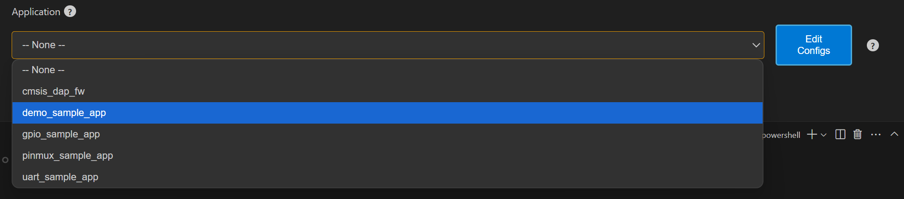

5.  The edit configs button will open the menuconfig layout in the
    terminal. Users can set the appropriate configurations using this
    menu.

    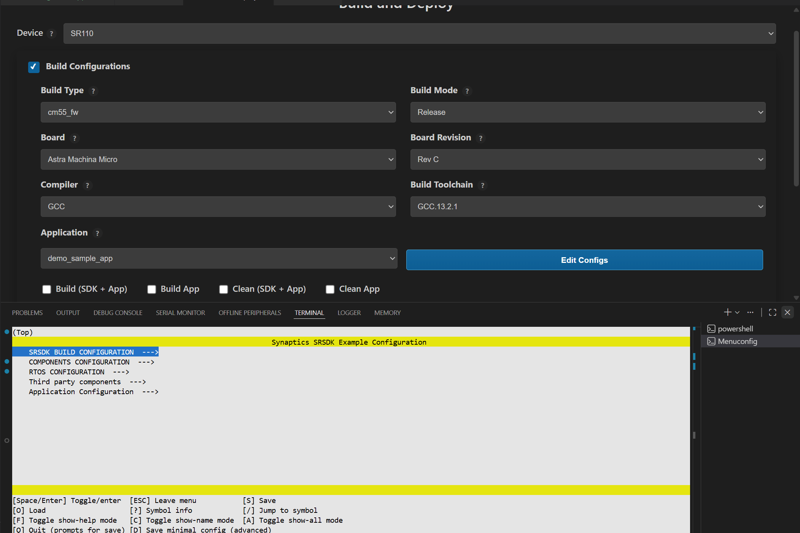

a.  Once the configs are edited and saved to .config, users have the
    option to save their custom defconfig. A prompt for saving the
    custom defconfig will appear like shown in below figure.\
    \
    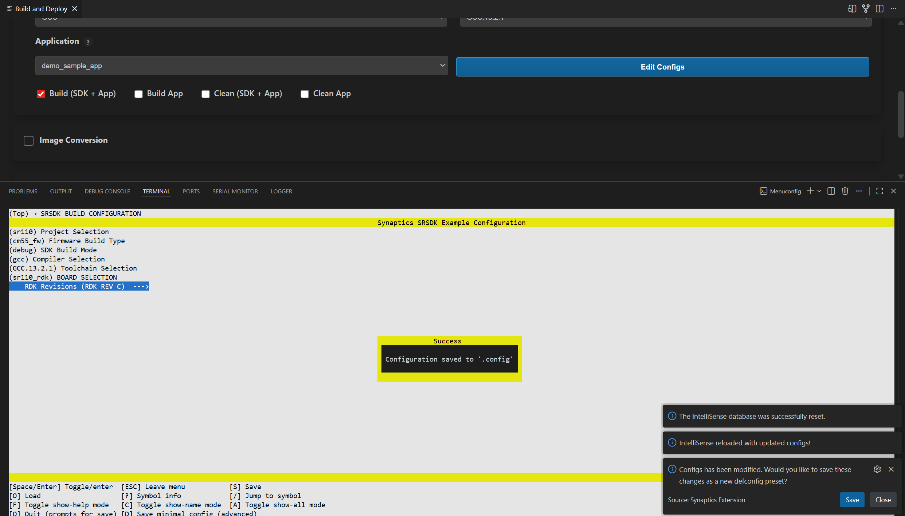

b.  Then users need to enter a filename under which the defconfig should
    be saved. Once given, the custom defconfig will be saved to
    *[/configs]{.mark}* folder.

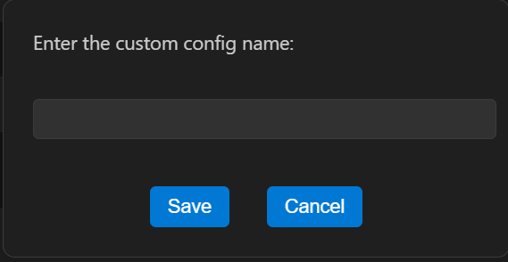

c.  To change board revisions, after selecting the necessary
    application, click "Edit Configs" \> select "SRSDK BUILD
    CONFIGURATION" \> select "Board" \> select "sr110_rdk" \> select
    "RDK Revisions" and choose appropriate revision and save the
    configuration.

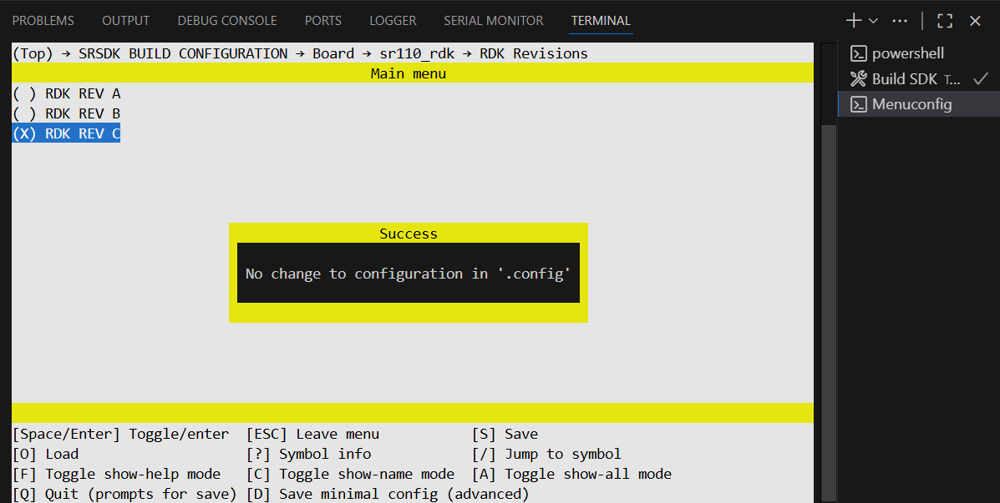

6.  Once the necessary configs are set, select the build option. You can
    choose either of the below combinations:

    a.  Build (SDK + App) -- to install and build the application along
        with the SDK.

    b.  Build App -- this is for recurrent build.

    c.  Clean (SDK + App) -- this will clean the build directory along
        with installed SDK package.

    d.  Clean App -- this will clean the build directory.

    e.  Build (SDK + App) and Clean (SDK + App) -- this will first clean
        the SDK and then proceeds with building the SDK and application.

    f.  Build App and Clean App -- this will first clean the SDK and
        then do a recurrent build.

7.  **Note:**

    a.  Once the Application is selected and configs are changed, these
        changes will be written to .config file. Users can confirm this
        with the notification ".config updated successfully".\
        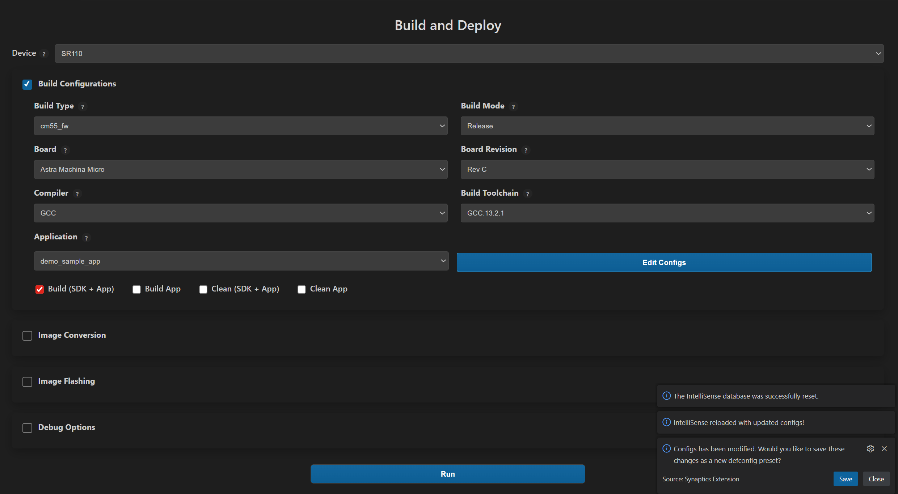

b.  After building unity test application, do a clean before building
    other applications to avoid linker errors.

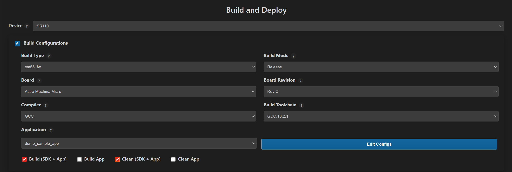

**Result:**

1.  The generated axf/elf files can be found at
    *[/Astra_MCU_SDK/examples/out/]{.mark}* directory. Upon a successful
    Release build, the AXF/ELF file path is automatically populated in
    the **Image Conversion** panel. Similarly, after a successful Debug
    build, the file path is automatically populated in the **Debug
    Options** panel.

> **Clean the SDK:** Similarly, the Astra MCU SDK can be cleaned by
> selecting the "Clean" checkbox and clicking "Run" button. The logs
> will be displayed in the terminal.

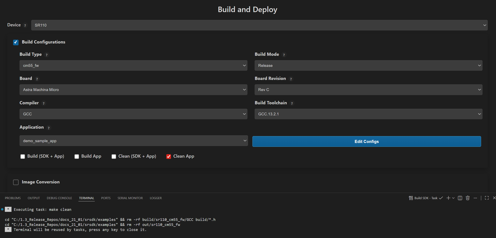

# Image Generation SR110

**Purpose:** This option will enable users to convert the axf/elf file
generated after the build process into binary files and
will aid in model bin conversion.

**\
Working Modes:**

- **Unified working:** You can select Build Configurations and Image
  Conversion which will build the application and then convert the
  .elf/.axf into .bin. After build, the release .axf/.elf file path will
  be populated to the Image Conversion panel automatically.

- **Isolated working:** You can select Image Conversion panel alone,
  choose a custom .elf/.axf file and select the necessary options. This
  will just convert the selected file into binary file.

    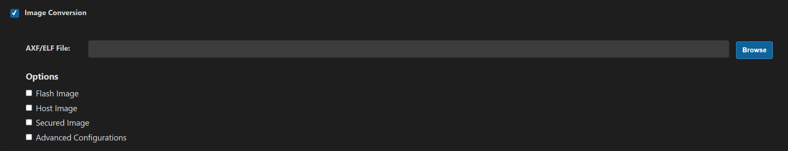

## Image Conversion SR110 - Basic Configurations

**Steps:**

1.  Click on the "Image Conversion" panel.

2.  In the file path, already the Release build file path will be
    pre-populated (if already built for Release option). Also, the user
    can select a custom axf/elf file for converting using the "Browse"
    button.

3.  The necessary options need to be selected for converting axf or elf
    to bin.

4.  Default options for converting axf/elf to bin -- select Flash Image
    or Host Image checkbox and select Secured Image checkbox.

    a.  Host Image -- The binary which will be flashed to the RAM memory
        of the chip.

    b.  Flash Image -- The binary which will be flashed to the Flash
        memory of the chip.

    c.  Secure -- select this checkbox if the chip in use is secured;
        otherwise, leave it unchecked.

5.  Users can also specifically select the "Flash Type" (default is
    GD25LE128) and "Flash Frequency" (default is 67) values from the
    dropdown once the Flash checkbox is selected.

6.  For generating both Host and Flash images, select both Host and
    Flash Image checkboxes.

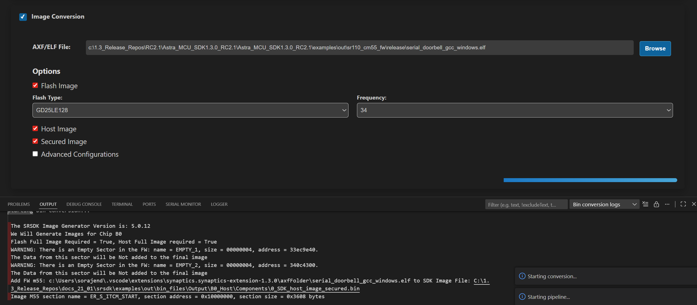

## Image Conversion SR110 - Advanced Configurations

**Steps:**

1.  Select the "Advanced Configurations" checkbox to reveal the advanced
    selections. Here users can select custom SPK and APBL file paths
    using the respective "Browse" buttons.

2.  **Model Bin Conversion:** This option enables the conversion of vela
    model file into binary file. Select the Vela model binary using the
    "Browse" button and choose "Secure" according to the model.

3.  **Edit JSON file:** Enables users to open and edit the JSON files.

4.  Once the options are selected, click on the 'Run' button. This will
    start the conversion process, and the conversion logs will be shown
    in the Output window.

    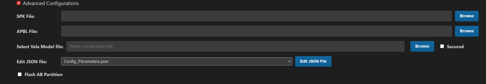

**Result:**

1.  The converted bin file path will be populated to Image Flashing
    Webview.

2.  Once the conversion is completed, the conversion logs and binary
    files will be present in the *[/out/bin_files]{.mark}* directory.

> **NOTE:**

- The above steps --- tool installation, SDK build, and BIN conversion
  --- can be performed in an SSH remote setup or WSL environment.
  Further steps beyond this (Image flashing, debugging and Video
  Streamer) are not supported in remote setup.

- After selecting the required options, click the **Run** button to
  start the image generation process. Live logs will be displayed in the
  terminal.

# Image Flashing SR110

**Purpose:** The image flashing option is used to load the image onto
the device either in ROM mode or FW mode

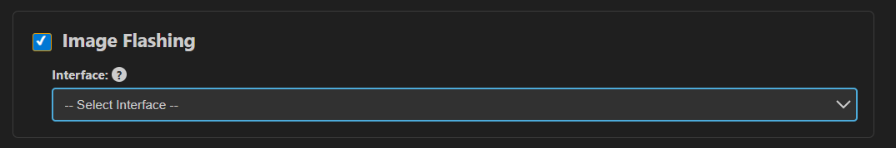

**Pre-requisites:**

- Install Python and necessary packages using the "Astra SDK Tools
  Installer" tab to ensure proper working of flashing.

- Ensure that the UART and the target device are properly connected to
  the system prior to starting flashing.

**Working Modes:**

- **Unified working:** You can select Build Configurations, Image
  Conversion along with Image Flashing. This will build the application,
  convert the .elf/.axf into .bin and load the binary onto the device.

- **Isolated working:** You can select Image Flashing panel alone,
  choose a custom binary file and select the necessary options. This
  will just flash the selected bin file onto the device.

- **Selecting the flash mode:**

  - If the CDC port is already available, you can flash the device using
    FW Update (Application Chip).

  - If the CDC port is not detected, use the SWD/JTAG mode for flashing.

  - For USB sample applications, flashing should be done using SWD/JTAG
    mode.

## Flashing the image in ROM/FW mode 

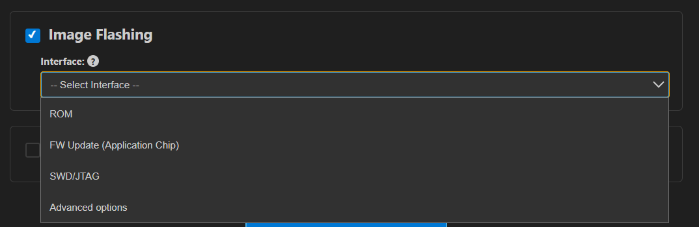

**Steps:**

1.  Make sure the device connections are properly established.

2.  To load the binary into the RAM (using UART connection), select
    Service type as "ROM" and Select Command as "Load an Image from
    Binary File".

3.  To flash the image into Flash memory (using UART connection), select
    Service type as "ROM" and Select Command as "Burn File to Flash".

4.  To flash the image into Flash memory using CDC (FW update --
    application chip), select Service type as "FW" and Select Command as
    "Burn File to Flash".

5.  To update the DAP firmware, select "Advanced Options" → FW Update
    (Debug IC) in *Service Type*, choose the DAP chip COM port, and
    click Proceed in the confirmation dialog to flash the DAP-built
    binary to the Debug IC.

    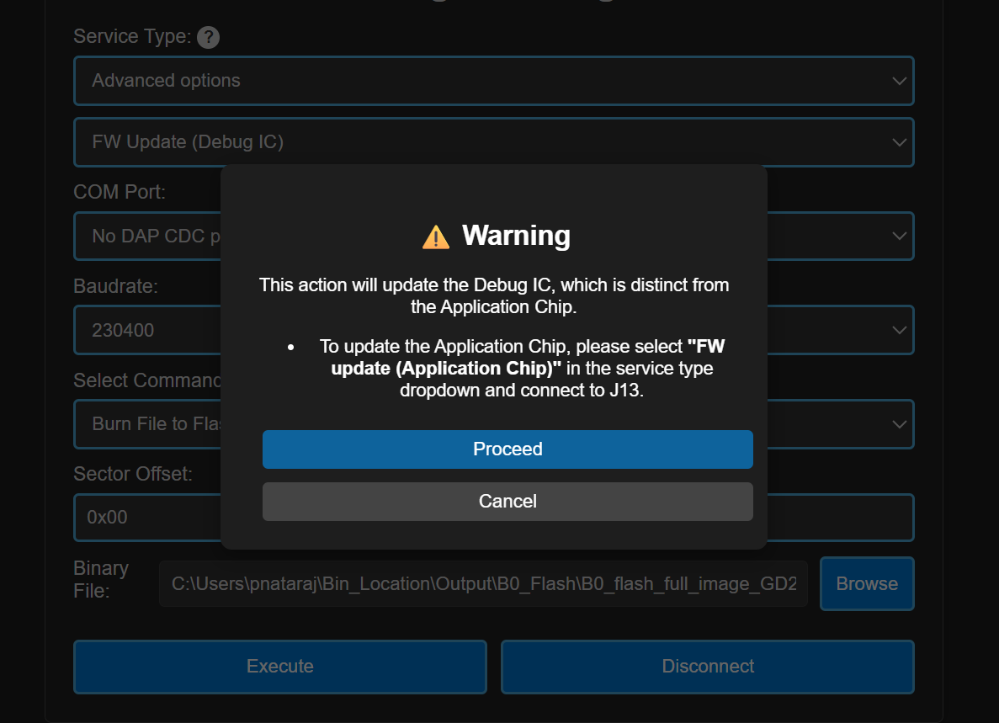

6.  The connected COM ports will be listed under the "COM Port"
    dropdown.

> **Note (Linux):**

- UART devices connected via USB will appear as /dev/ttyUSB0,
  /dev/ttyUSB1 etc. Use these for flashing in ROM mode (UART-to-USB
  connection).

- The available CDC will appear as /dev/ttyACM0, /dev/ttyACM1 etc. Use
  these for flashing in FW mode (FW update).

> **Note (macOS):**

- UART devices connected via USB will appear as /dev/cu.usbserial-xxxx
  (e.g., /dev/cu.usbserial-DQ015QCI). Use these for flashing in ROM mode
  (UART-to-USB connection).

- The available CDC will appear as as /dev/cu.usbmodemxx_xx (e.g.,
  /dev/cu.usbmodem01_00_00_001). Use these for flashing in FW mode (FW
  update).

7.  Select the appropriate Baudrate.

8.  The binary file path will be already populated either as dropdown
    (if both Host and Flash images were converted) or as file path text
    box (if either Host or Flash alone is converted). If user wants to
    select a custom file for flashing, they can choose the binary file
    path using the "Browse" button.

9.  **Model binary flashing:**

    - For VGA usecases, first flash the pre-generated model binary
      (e.g., person_detection_flash(448x640).bin) and then proceed to
      flash the generated usecase binary.

    - For VGA usecases, the model bin file will be located at
      *[/examples/SR110_RDK/vision_examples/\<usecase_folder\>/models]{.mark}*

    - While flashing the model binary file, please enter the sector
      offset address from which the model should start flashing at.
      Default flash sector address to flash the model bin is 0x629000.

10. Click on "Run", the image loading will start, and the logs will be
    redirected in the output console.

    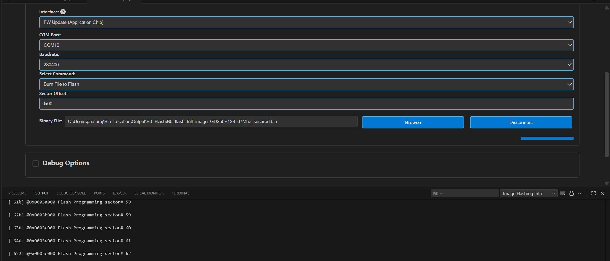

**Result:** After flashing, the COM port will be disconnected, and the
new CDC will be detected. Logs of the loaded use case can be visualized
using the Serial Monitor tab. Select the appropriate COM port and click
"Start Monitoring".

**Note*:* An option to provided to perform full flash erase using ROM mode.

## Flashing image using SWD/JTAG

**Purpose:** This option allows users to flash the binary on to the
device using JLink/DAP.

**Pre-requisite:** Before starting the flashing process, ensure that no
**OpenOCD** or **GDB** sessions are open in any background process. If
these sessions are already running, the new OpenOCD instance may fail to
connect properly.

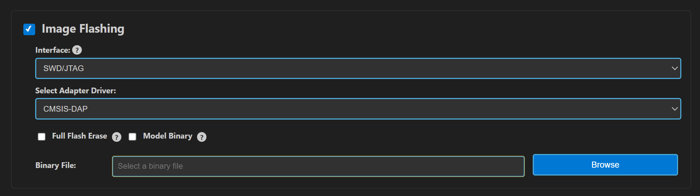

**Steps:**

1.  Select the Interface as "SWD/JTAG" in the Image Flashing panel.

2.  Select the Adapter Driver.

3.  The flash binary file path will be pre-populated (if already flash
    binary is converted) or users can select the custom binary file
    using the "Browse" button.

4.  **Full Flash Erase:** To execute a full flash erase, enable the
    "Full Flash Erase" checkbox and click "Run". This will erase the
    entire flash memory, preparing the device for a clean binary update.

    a.  When the Full Flash Erase option is enabled and no binary file
        is selected, only a full flash erase will be performed.

    b.  When full flash erase checkbox is checked and a binary file is
        selected, the script will first do a full flash erase and
        continue to load the binary.

    c.  When full flash erase checkbox is not selected, and bin file
        path is chosen, a sector erase will be done according to the
        binary size, and the bin file will be flashed.

5.  After selecting the usecase binary file to be flashed, click "Run".
    This will launch OpenOCD and GDB in separate terminals, establish a
    connection, erase the necessary memory, and flash the binary.

6.  Progress and script logs will appear in the Output window, while
    flashing logs will be shown in the OpenOCD terminal.

**Result:** Once flashing is completed, the telnet connection will be
dropped. Press reset on the device.

**Steps to flash model binary using SWD/JTAG:\**

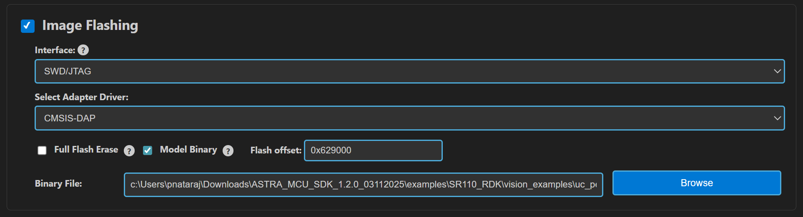

1.  Load the model binary file - Select the "Model Binary" checkbox. A
    text box will appear to enter the flash offset - enter the start
    address to load the model binary, for example - 0x629000.

2.  Browse and select the model binary, then click Run.

3.  After flashing both usecase and model bins, click application chip
    reset. CDC will be detected.

**Notes:**

- If the CDC is not detected after flashing, try performing a full flash
  erase and reloading the binaries.

- Since the binaries are flashed using OpenOCD commands, a sector erase
  is performed for the binary size before flashing. As a result, the
  flashing process takes a bit more time.

# Debugging using GDB in Extension for SR110

## Download and Reset Program

**Pre-requisites:**

1.  Install the following extensions using the "Astra SDK Tools Installer"
    tab.

- C/C++ IntelliSense, debugging, and code browsing extension in VS Code.

- MemoryView extension to view the memory map while debugging.

- Serial Monitor extension for viewing logs while debugging.

- Memory Inspector CDT extension by Eclipse IDE.

1.  Import an Astra MCU SDK before debugging.

2.  Ensure that Debug probe and the target device are properly connected
    to the system prior to starting debug.

**Steps:**

1.  In the Build and Deploy webview, select "Debug Options" panel. This
    will reveal the debug configurations.

2.  To execute the build and debugging processes in a single workflow,
    open **Build Configurations**, choose **Debug** or **UnitTestDebug**
    under **BuildType**, and enable **Debug Options**. This setup will
    first build the application using the selected build type and
    automatically start the debugger once the build is complete.

    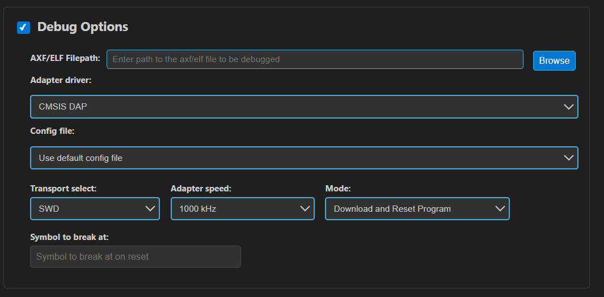

3.  In the Dubug Options, use the browse button to select the path to
    the axf/elf file. Ensure that the file chosen is built with the
    'debug' build type. If debug axf/elf was already built successfully
    using the extension, the file path will be automatically populated
    to the AXF/ELF Filepath.

4.  Select the necessary configurations (use the default configs:
    Transport select -- SWD, Adapter Driver -- JLink/CMSIS DAP, Adapter
    speed -- 1000 KHz). \
    **Note:** Adapter speed adjustment is supported with J-Link during
    debugging, but not yet fully functional with DAP.

5.  Users can either opt to use the default config file or can use
    custom config file for debugging. Select the appropriate options in
    the dropdown.\
    **Note:** The default config files are available at *[\<parent
    directory\>/tools/openocd/configs/]{.mark}* folder for reference.

    

6.  After configuring the settings, choose the desired **debug mode**
    from the **Mode** dropdown. You can select **Download and Reset
    Program**, **Attach to Running Program**, or **Attach and Halt
    Program**. For standard debugging, choose **Download and Reset
    Program**.

    

7.  After selecting the necessary configs, click **Run**. This will
    start debugger, and you can see the status in the terminal
    window. This will start running OpenOCD in one terminal and start
    GDB debug session in another terminal.\
    **Note:** If debugging fails to start and you see messages like
    "Unable to start debugging," try resetting the DAP chip and attempt
    again.

8.  Once connection is established, the debugger will stop at main.

    

9.  Once the debugger is paused, users can view the variables, call
    stack, registers and the breakpoints in the side panel as shown in
    the below picture.\
    

### Global Variables

**Purpose:** Since the C/C++ extension used to start the GDB session
doesn't support populating Global variables as they show the Local
variables, users can view a list of Global Variables along with its
values using this feature.

**Steps:**

1.  While a debug session is active, right-click on the code space to
    view more options, click on "Show Global Variables".

    

2.  This will open a side panel which will list all the Global
    variables, their address, type and respective values. When this
    panel is open, it will get refreshed to fetch the latest values
    whenever the debugger is paused, either manually or while hitting a
    breakpoint.

    

### Debug Toolbar

Once a debug session is started, the debug toolbar will appear at the
top of the window and will contain the buttons for basic debug
operations.

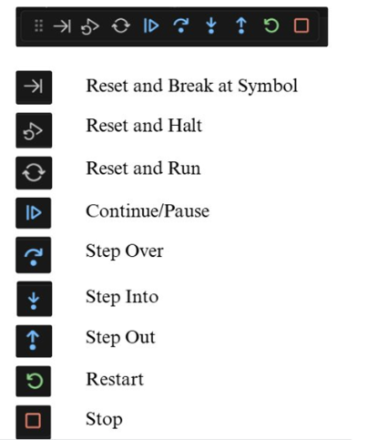

- **Reset Options:**

| **Option**              | **Description**                                                                 |
|-------------------------|---------------------------------------------------------------------------------|
| **Reset and Break at Symbol** | Used during debugging when user needs to reset the program and pause execution at a particular symbol. The user can enter the desired symbol in the text box (refer Figure 48), press enter and then click the Reset and Break at Symbol icon. |
| **Reset and Halt**      | Resets the program, starts a new debug session, and immediately halts execution at Reset_Handler. |
| **Reset and Run**       | Resets the program, starts a new debug session, and runs it without any halts or breaks. |

---
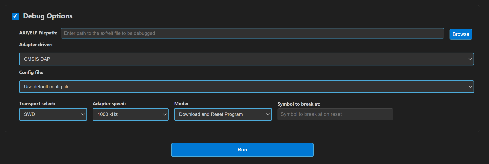

- **Other Options:**

  - **Continue/Pause** - to continue or pause the execution while
    debugging. In Linux and MAC, as pausing the debug session was not
    working, users can click on custom pause button added to this panel
    to pause the execution.

    

- **Step Over** -- executes the current line of code without entering
  any function calls.

- **Step Into** -- Executes the current line and, if a function is
  called, enters the definition for step-by-step debugging.

- **Step Out** -- Continues execution until the current function
  returns, then pauses at the calling location.

- **Restart** - To restart the currently running debug session, with the
  previously used entry point. For example, if user has started a debug
  session with \'X\' as entry point, restart will end the current
  session and start a new session and stop at same entry point.

- **Stop** -- to stop the current debug session.

### Memory Inspection and Manipulation

1.  When debugging, users can inspect the raw contents of memory
    associated with a variable by following these steps:

    a.  This action opens a memory view tab which will show the memory
        contents in hexadecimal bytes, ASCII-decoded text and address
        offsets.

    

    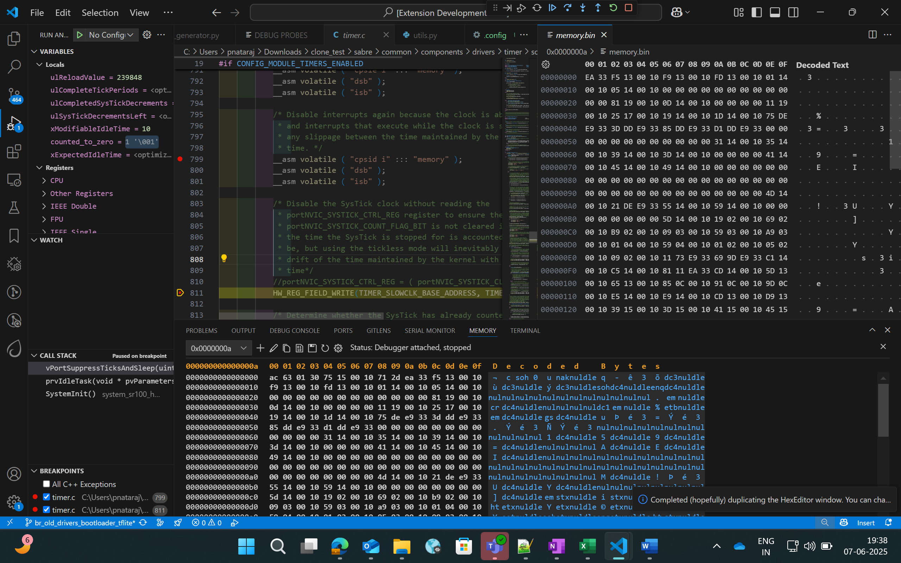

2.  To view and edit memory in a particular address, right-click on the
    code space and select "Open Memory Viewer". This will open two
    panels side by side.

    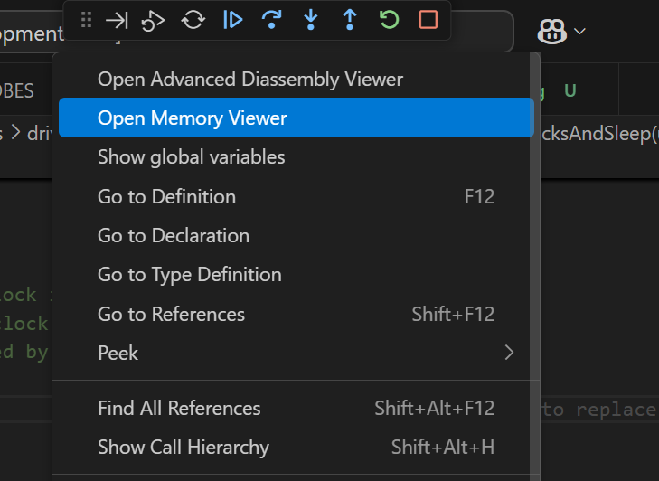

    

3.  "Memory" tab on the left side supports the listed features:

    a.  Multiple memory formats -- hovering over any byte displays
        multiple representations of the selected byte.

    b.  Periodic refresh -- When enabled, automatically refreshes memory
        data.

    c.  Configurable memory display -- customize memory views with
        options for columns, grouping and formats.

    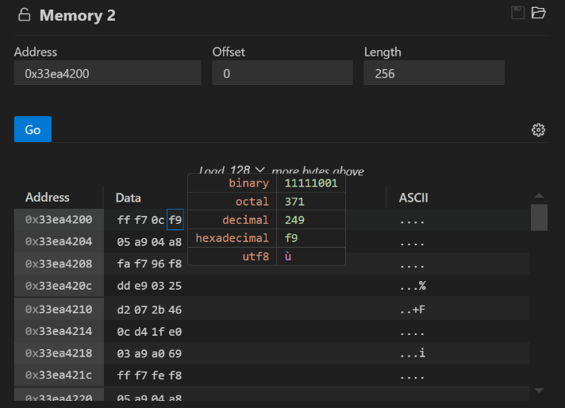

4.  Whereas the customized memory panel at the right supports memory
    editing and memory filling capabilities.

    a.  **Memory edit** -- this allows the user to modify a specific
        memory address.

        i.  Enter the target memory address and the byte value to be
            written, and then click "Edit".

        ii. This will write the specific value to the address. To verify
            this, users can check by enabling the "Periodic Refresh"
            option.

    b.  **Memory Fill** -- this allows filling a memory block with
        specific fill value.

        i.  Start Address: Beginning address of the memory region to
            start filling.

        ii. Size: Total number of bytes to fill.

        iii. Fill value: The value (in hex) to repeatedly write into
             memory.

        iv. Width: Number of bytes written per step (1, 2, 3 or 4).

**Note:**

Always choose a fill value that fits within the selected width. If it's
smaller, the extension will safely pad it with zeros. For example:

- If width is set to 1 byte, you can enter values like 0xFF but values
  larger than one byte is not allowed.

- If the fill value is shorter that the selected width, it will be
  automatically padded with zeros to match the width. Example: Fill
  value: 0xFF and Width: 4 bytes, the memory will be filed as:
  0x000000FF.

### Disassembly Viewer

**Purpose:** The Disassembly View displays low-level machine
instructions alongside their corresponding memory addresses and decode
operations.

> **Steps:**

1.  Right-click on the code space and select "Open Advanced Disassembly
    Viewer" during an active debug session.

    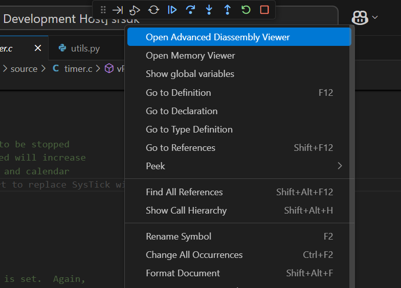

2.  The basic disassembly view at the left will display the disassembly
    and facilitates setting breakpoint at a specific address.

3.  The custom disassembly panel at the right adds navigation controls:

- Address Input: To jump directly to a specific address to view its
  corresponding instruction.

- Go to PC: Instantly scrolls to the current Program Counter, helping
  track the instruction currently being executed.

- Go Back: Navigates to the previously viewed disassembly address.

- Go Forward: Returns to the next address in the history.

    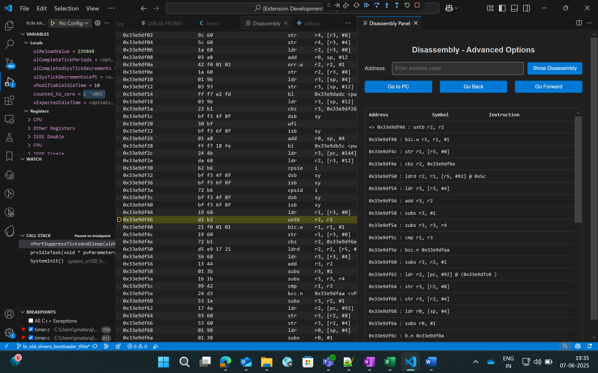

### Logging

- Steps to redirect logs to the OpenOCD terminal while debugging:

  - Click on "Edit Configs" button to open the menuconfig interface in
    Build SDK panel, select COMPONENTS CONFIGURATION -\> Utilities -\>
    LOGGER_DEFAULT_INTERFACE and set LOGGER_IF_CONSOLE or
    LOGGER_IF_UART_1_CONSOLE.

  - Save this config and then build for Debug build type.

    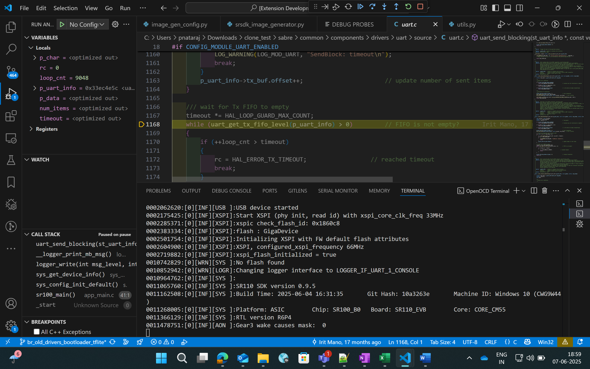

- Steps to view the logs using DAP logger port while debugging:

  - Ensure that Serial Monitor extension is installed.

  - Once the debug session has started, in Serial Monitor tab, select
    the DAP logger port and click "Start Monitoring".

    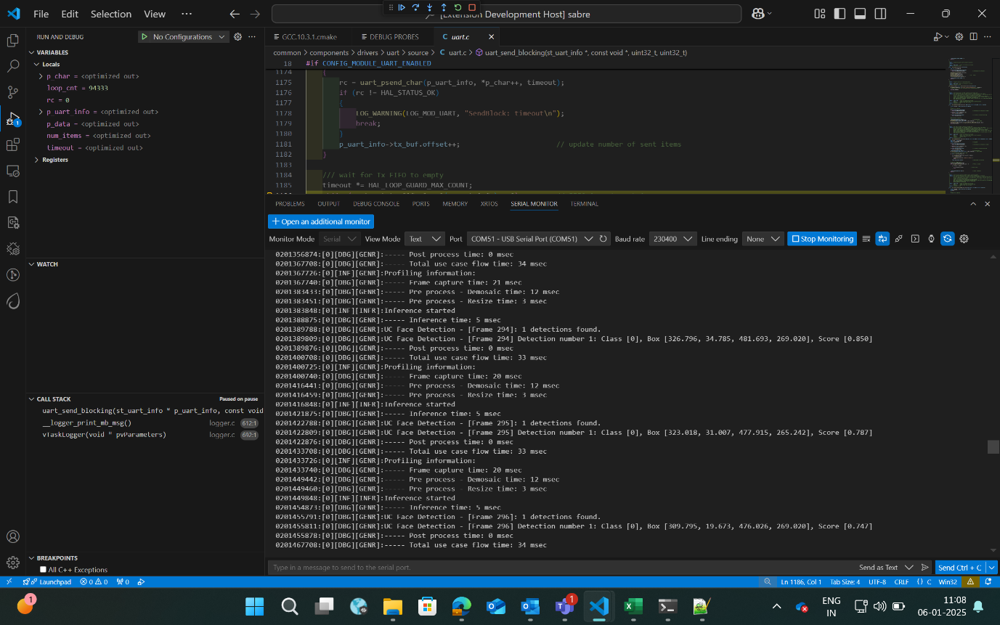

## Attach to Running Program

- Follow the steps illustrated in [Download and Reset
  Program](#download-and-reset-program) for selecting the configurations
  and then you can select "Attach to Running Program" as debug mode.
  This option will attach to the already loaded and running binary in
  the device, enabling you to pause and inspect the memory and program
  flow.

- If you pause the debugger, you can view the variables, call stack,
  disassembly view and registers by selecting the appropriate options.

    

## Attach and Halt Program

- Follow the instructions outlined in the [Download and Reset
  Program](#download-and-reset-program) section to select the
  appropriate configurations. Then, click on "Attach and Halt Program"
  to attach to the already running binary on the device. This option
  will attach and pause execution, enabling you to inspect memory and
  analyse the program flow.

- If you pause the debugger, you can view the variables, call stack,
  disassembly view and registers by selecting the appropriate options.

# Video Streamer

**Purpose:** The Video Streamer option is used to stream the video
output of frames while the usecase is being executed.

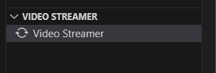

**Pre-requisites:**

- Install Python and necessary packages using the "AStra SDK Tools
  Installer" tab to ensure proper working of video streamer.

- Ensure that the usecase binary to be tested is flashed onto the device
  and the target device is properly connected to the system prior to
  starting video streamer.

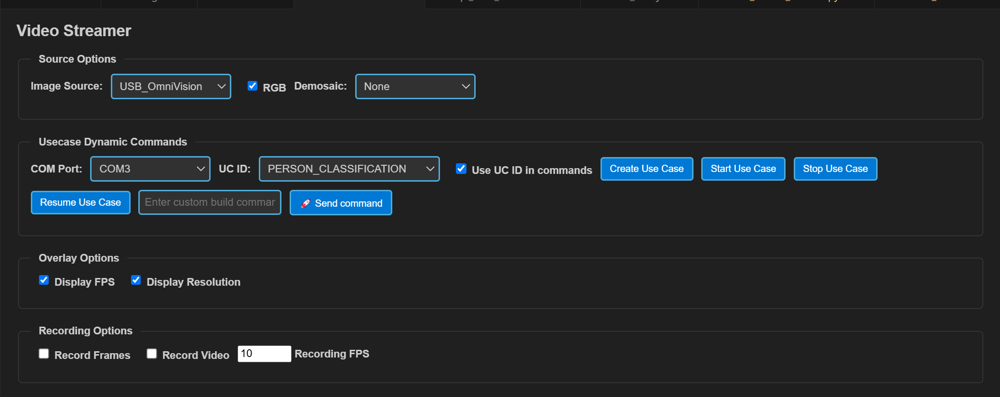

**Steps for Vision Usecases:**

1.  **Source Options:**

    a.  **RGB:** If checked, frames will be displayed in RGB format, or
        it will be displayed as gray frames.

    b.  **Demosaic:** Facilitates the configuration of required demosaic
        type from the dropdown.

2.  **Overlay options:** The display of FPS and Resolution can be
    customized in this tab. When enabled, FPS and Resolution will appear
    on the frame.

3.  **Recording options:**

    a.  **Record Frames:** If enabled, raw frames and overlayed frames
        will be saved.

    b.  **Record Video:** If enabled, the frames will be saved as video.

    c.  **Recording FPS:** You can vary the FPS in which the video
        should be saved using the Recording FPS option.

    d.  These recordings can be found at:

        i.  For windows: C:/Users/\<username\>/video_stream_output

        ii. For Linux and macOS: /home/\<username\>/video_stream_output

4.  **Usecase Dynamic Commands:**

    a.  Select the appropriate options from the dropdown. Once the
        usecase binary is properly flashed to the device, CDC ports will
        be listed in COM Port dropdown. Select the CDC port, select the
        usecase ID, and click "Create Use Case".

    b.  Custom build commands can be entered in the textbox and click
        "Send command".

5.  Once the usecase is created, click "Start Use Case" button. This
    will start the usecase and the Video Stream will be shown as a pop
    up.

6.  Click on "Stop Use Case" button to stop the video stream and click
    on "Resume Use Case" button to resume the video stream.

7.  To properly shutdown the Video streamer, follow these steps:

    a.  Click the "Stop Use Case" button.

    b.  Close the Video Streamer window.

    c.  Press Reset and then try starting the usecase again.

8.  Recovery steps if the Streamer freezes or encounters issues:

    a.  If the Video stream window pops up but is blank:

        i.  Close the blank Video streamer window.

        ii. Click "Stop Use Case" \> Press Reset.

    b.  If no Video stream window appears:

        i.  Hit Reset

        ii. A blank Video stream window will appear, close it.

        iii. Click "Stop Use Case" button \> Hit Reset

        iv. Then try starting the usecase again.

9. **Video Streamer for Hand Gesture Detection**

    *Steps to use:*
    1. Select the usecase from the "UC ID" dropdown as Hand Gesture Detection and click on the create use case and start use case.
    2. You can see the usecase run in the Smart TV gestuer control mode by default, and you can switch the visualization modes ( 720p, 320x320 or Text only)
    3. Hand gesture detection also supports additional exposure and gain controls which are provided as sliders, where one can use them to adjust the gain and exposure of the video stream to improve the detection accuracy.
    4. Please make sure you reinstall python again if you are switching from a pervious version of the extension to run this usecase as this uses new python pip modules for enhanced utility.

> **Note:** Selecting "Create Use Case" and then "Start Use Case" is
> sufficient for running non-auto run usecases, "Connect Image Source"
> is meant for auto-run usecases only.

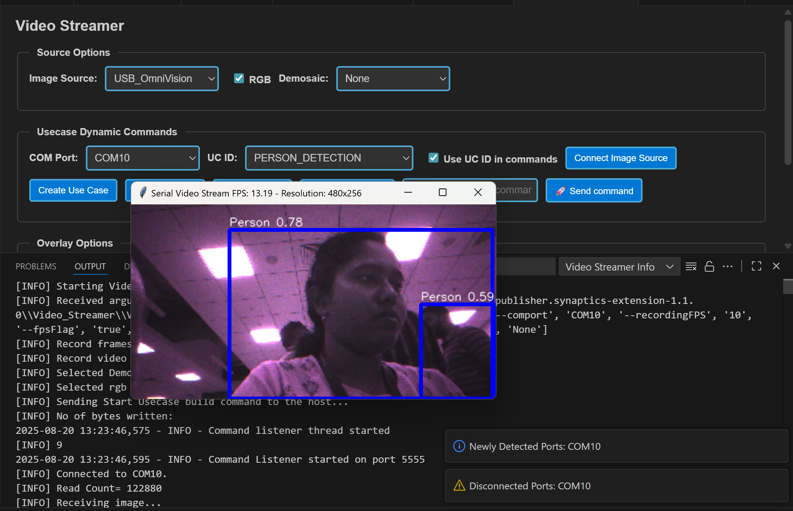

**Doorbell Usecase:**

1. The Doorbell use case is an auto-run application that does not require
create or start use case commands. It integrates the UC_JPEG_PREROLL and
IMAGE_STITCHING use cases to detect a person and capture, then display,
raw and high-resolution images upon detection. For detailed information,
refer to [Doorbell User Guide](../../examples/SR110_RDK/vision_examples/uc_jpeg_preroll/README.md).

**Steps for Doorbell Usecase:**

1.  Open the \'LOGGER\' tab located in the lower panel of VS Code.

2.  From the dropdown menu, select the logger port, choose the
    appropriate baud rate, and click \'Connect\'.

    

3.  Now press Application chip RESET. Once the use case starts running,
    logs will appear in the logger window. If there is a detection when
    the device wakes up, the video stream will be triggered
    automatically.

4.  The recorded frames and video will be saved at,

    a.  For Windows: C:/Users/\<username\>/video_stream_output

    b.  For Linux and macOS: /home/\<username\>/video_stream_output

5.  You can save the logs as a text file using the \'Save logs as TXT\'
    button and clear the logs using the 'Clear logs' button.

6.  **Wakeup Triggers**

- **Timer (CONFIG_WAKEUP_TRIGGER = 1):**

  - Device wakes up every 10 seconds

- **GPIO (CONFIG_WAKEUP_TRIGGER = 2):**

  - Keep one end of the jumper cable connected to GND

  - Wait at least 10 seconds after the device enters hibernation, then
    connect the other end of the jumper to the UART0 RX pin to trigger
    the wake-up

    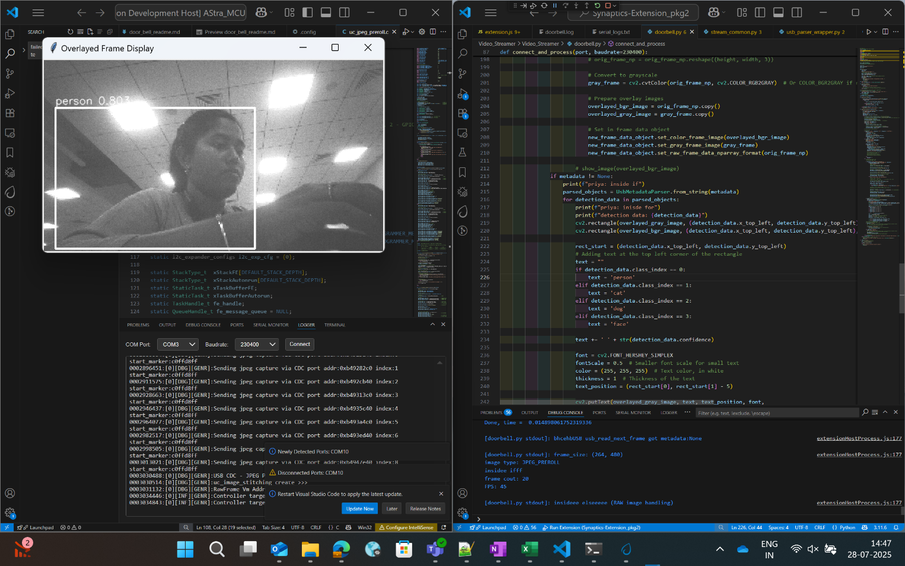

**Steps for Autorun Usecases:**

1.  Select the usecase from the "UC ID" dropdown and click "Connect
    Image Source" button.

2.  This will display the video stream of the usecase which started
    running.

    

# Register Info Data Base

**Purpose:**

The Register Info Data Base view provides a searchable database of SoC/peripheral registers, descriptions, bitfields, and addresses to help developers quickly look up register definitions while debugging or developing firmware.

**Steps to use:**

1. Open the *Register Info Data Base* view from the Synaptics extension sidebar.
2. Use the search box to find registers by name, address, or description.

**What the Register Info DB provides:**

- Searchable registers with: register name, address, size, reset value, description, and bitfield breakdown.
- Bitfield details showing bit ranges, access type (R/W), and short notes on usage.
- Quick-copy buttons to copy an address or register name for pasting into the Memory Viewer or debugger watches.
- Export the current search result to CSV for offline reference.

**Detailed steps & tips:**

1. Open the *Register Info Data Base* panel in the Synaptics sidebar.
2. Type a search term: full register name (`GPIO_CTRL`), partial name (`GPIO`), address (`0x40100000`) or a description keyword (`enable`, `irq`).
3. Use filters to limit results by peripheral, access type (R, W, RW), or address range.

