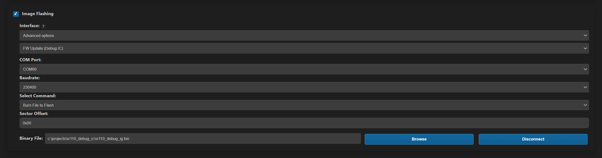
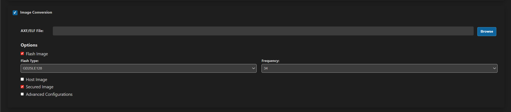
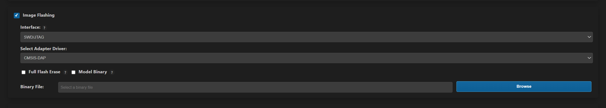
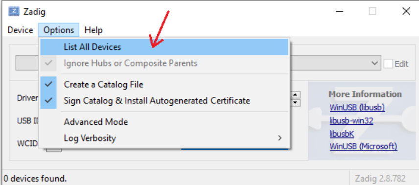
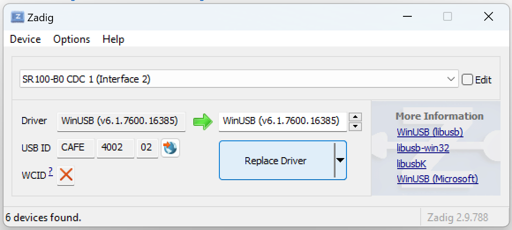

# SR110 Platform Guide

This guide provides **SR110**-specific technical details that supplement the main Astra MCU SDK documentation.

It is intended to be referenced by other guides (such as the [Astra MCU SDK User Guide](../Astra_MCU_SDK_User_Guide.md), [Build System Guide](../Astra_MCU_SDK_Build_System.md), and [VS Code Extension guide](../Astra_MCU_SDK_VSCode_Extension_User_Guide.md)) whenever SR110-specific behavior, constraints, or workflows need to be described..

Scope clarification

This document is not a primary or authoritative guide
It does not override other Astra MCU SDK documents
It serves as a detailed reference for SR110 platform-specific topics
Primary user workflows and concepts remain documented in: - [Astra MCU SDK User Guide](../Astra_MCU_SDK_User_Guide.md) - [Build System Guide](../Astra_MCU_SDK_Build_System.md) - [VS Code Extension guide](../Astra_MCU_SDK_VSCode_Extension_User_Guide.md)

Those documents may refer to specific sections of this guide for additional SR110 detail.

---

## Contents
- [Platform Overview](#platform-overview)
- [Hardware Setup](#hardware-setup)
- [Quick Start VSCode](#quick-start-vs-code)
- [Quick Start Native CLI](#quick-start-native-cli)
- [Image Generation](#image-generation-2)
- [Image Flashing](#image-flashing)
- [Running Applications](#running-applications)
- [Debugging](#debugging)

---

## Platform Overview

### SR110 Specifications

**Processor:** - Arm Cortex-M55 CPU

**Memory:** - External Flash (GD25LE128 and others supported)

**Supported Development Kits:** - **SR110_RDK** (Astra Machina Micro SR Series - Rev B/C/E)

---

## Hardware Setup

### Astra Machina Micro (SR110 RDK)

<figure>

<figcaption><b>Figure 1.</b> SR110 RDK Board</figcaption>
</figure>

### Connection Steps

1. **Power and Debug Connection**
   - Connect **Debug IC USB (J14)** to your host PC
   - This single connection provides:
     - Board power
     - Debug interface (CMSIS-DAP)
     - Serial console (CDC COM port)

2. **Verify Default Configuration**
   - Confirm all jumpers and switches are in default positions
   - See board manual for jumper settings if needed

3. **Identify COM Ports**
   - **Windows**: Two COM ports will appear in Device Manager
     - One for firmware updates (Debug IC FW)
     - One for application serial console
   - **Linux**: Ports appear as `/dev/ttyACM0`, `/dev/ttyACM1`
   - **macOS**: Ports appear as `/dev/tty.usbmodem*`

### Debug IC Firmware Update (Recommended)

Updating the Debug IC firmware ensures optimal compatibility and stability.

**Via VS Code Extension:**

1. Open Synaptics extension → IMPORTED REPOS → Build and Deploy → Image Flashing
2. Under Interface, choose **Advanced Options** → "FW Update (Debug IC)"
3. Select the Debug IC COM port
   - Windows: Try both COM ports if one fails
   - Linux: Usually `/dev/ttyACM0` or `/dev/ttyACM1`
4. Browse to `tools/Debug_IC_FW/Debug_IC_FW.bin`
5. Click **Run** and confirm the warning dialog
6. Wait for completion, then unplug and replug the USB cable

<figure>

<figcaption><b>Figure 2.</b> Debug IC Firmware Update in VS Code</figcaption>
</figure>

---

## Quick Start (VS Code)

This section summarizes the **SR110**-specific flow when using the VS Code extension.

### Build MCU Binary

1. Import SDK and examples
2. Select Project: SR110, Build Type: cm55_fw
3. Enable Build (SDK + App)
4. Run build

### Output
```
examples/out/sr110_cm55_fw/release/sr110_cm55_fw.elf
```
### Image Generation
Refer to [Image Generation](#image-generation-2) section.

### Flashing
Refer to [Image Flashing](#image-flashing) section.

---

## Quick Start (Native CLI)

### Build MCU Binary

```
cd <sdk-root>/examples
export SRSDK_DIR=<sdk-root>
make cm55_demo_sample_app_defconfig BOARD=SR110_RDK BUILD=SRSDK
```

### Image Generation
Refer to [Image Generation](#image-generation-2) section.

### Flashing
Refer to [Image Flashing](#image-flashing) section.

---

## Image Generation

After building the application, the generated .elf/.axf executable must be converted into a downloadable .bin image for flashing or host-based download.

### Image Generation via VScode Extension

1. Go to **Build and Deploy** → **Image Conversion**
2. Set:
- **Image Type**: `Flash Image`
- **Flash Type**: `GD25LE128`
- **Image Security**: `Secured Image`
3. Verify the auto-populated AXF/ELF path
4. Click **Run**
   <figure> 
    
   </figure>

### Image Generation via Native CLI

Use the following commands to generate Flash and Host images from your build output.
Tool: `tools/srsdk_image_generator/srsdk_image_generator.py`.

**Activate Python environment first:**
```bash
# Linux/macOS
source ~/.sdk_venv/bin/activate

# Windows PowerShell
C:\Users\<Username>\.sdk_venv\Scripts\Activate.ps1
```

#### Generate Flash Binary

```bash
cd to <sdk-root/tools/srsdk_image_generator> directory, populate relative path to bin/axf/elf files in below command and run:
python srsdk_image_generator.py \
    -B0 \
    -flash_image \
    -sdk_secured \
    -spk "<relative_path_to_spk_bin>" \
    -apbl "<relative_path_to_apbl_axf>" \
    -m55_image "<relative_path_to_m55_elf>" \
    -model "<model_name_or_empty>" \
    -flash_type "<flash_part_number>" \
    -flash_freq "<flash_frequency_mhz>"
```

#### Generate Host Binary

```bash
cd to <sdk-root/tools/srsdk_image_generator> directory, give relative path to bin/axf/elf files in below command and run:
python srsdk_image_generator.py \
    -B0 \
    -host_image \
    -sdk_secured \
    -spk "<relative_path_to_spk_bin>" \
    -apbl "<relative_path_to_apbl_axf>" \
    -m55_image "<relative_path_to_m55_elf>"
```

---

#### **Arguments Description**

| Argument       | Description                                                      | Default Value                                                                           |
| -------------- | ---------------------------------------------------------------- | --------------------------------------------------------------------------------------- |
| `-B0`          | Target chip revision                                             | B0                                                                                      |
| `-flash_image` | Generate flash image (used for programming the external flash)   | —                                                                                       |
| `-host_image`  | Generate host image (used for USB/UART download)                 | —                                                                                       |
| `-sdk_secured` | Use secured SDK flow                                             | Enabled by default                                                                      |
| `-spk`         | Path to secure provisioning key `.bin` file (SPK)                | `tools/srsdk_image_generator/B0_Input_examples/spk_rc3_0_secure_otpk_0605.bin`          |
| `-apbl`        | Path to AP Bootloader `.axf` file                                | `tools/srsdk_image_generator/B0_Input_examples/sr100_b0_bootloader_ver_0x012F_ASIC.axf` |
| `-m55_image`   | Path to the generated application `.elf` / `.axf` from SDK build | Generated by SDK build flow (e.g., `out/<project>/<type>/*.elf`)                        |
| `-model`       | Optional model name to be added to image metadata                |                                                                            |
| `-flash_type`  | External flash part number                                       | `GD25LE128` *(Supported: GD25LE128, W25Q128, MX25U128)*                                 |
| `-flash_freq`  | SPI clock frequency for external flash (MHz)                     | `67` *(Supported: 34, 67, 100, 134)*          


---

**Output:** Flash image at `examples/out/bin_files/Output/B0_Flash/B0_flash_full_image_GD25LE128_67Mhz_secured.bin`

## Image Flashing

### Image Flashing via VScode Extension

1. Go to **Build and Deploy** → **Image Flashing**

2. Set:
   - **Interface**: `SWD/JTAG`
   - **Adapter**: `CMSIS-DAP`
   - **Image File**: The `.bin` generated in Step 6 (auto-populated)

3. Click **Run**

   <figure>
   
   </figure>

### Image Flashing via Native CLI

Use OpenOCD to program the generated flash image into external flash over SWD (CMSIS‑DAP or J‑Link).

Prerequisites
- Install OpenOCD and add exe to the environment variable `path`.
- Requires Python 3.13 , `pexpect` and `telnetlib`.
- And connect the board via the Debug IC (CMSIS‑DAP, J14) or a J‑Link.

**Step 1: Start OpenOCD server**
```bash
# CMSIS-DAP
cd <sdk-root>
openocd -f tools/openocd/configs/cmsis-dap.cfg -f tools/openocd/configs/target.cfg

# Or J-Link
cd <sdk-root>
openocd -f tools/openocd/configs/jlink.cfg -f tools/openocd/configs/target.cfg
```

**Step 2: Flash image (in separate terminal)**
```bash
cd <sdk-root>
python tools/openocd/scripts/openocd_flash.py \
  examples/out/bin_files/Output/B0_Flash/B0_flash_full_image_GD25LE128_67Mhz_secured.bin \
  0x0 \
  0x0 \
  1
```
Arguments
- `<image_flash.bin>`: path to the generated full flash image
- `<file_offset>`: usually `0x0`
- `<flash_offset>`: usually `0x0` (start of external flash)
- `<full_flash_erase>`: `1` to erase required region before flashing (`0` to skip)

**Step 3: Reset board**
- Unplug and replug USB cable, or press the reset button
- Application should start and print logs on the serial console

Notes
- Python version: the helper script uses Python's telnetlib. Use Python 3.12 or earlier (Python 3.13 removed telnetlib).
- Ensure OpenOCD is running (telnet on port 4444). Adapter config must match your hardware.
- On Linux, you may need udev rules or run with appropriate permissions for HID/USB devices.

---

## Running Applications

### Serial Console

**Connection settings:**
- **Baud rate**: 115200
- **Data bits**: 8
- **Parity**: None
- **Stop bits**: 1
- **Flow control**: None

**Port selection:**
- Use the **non-FW-update COM port**
- Windows: Check Device Manager → Ports (COM & LPT)
- Linux: `/dev/ttyACM0` or `/dev/ttyACM1`
- macOS: `/dev/tty.usbmodem*`

**Serial monitor tools:**
- PuTTY (Windows)
- screen (Linux/macOS): `screen /dev/ttyACM1 115200`
- minicom (Linux)
- VS Code Serial Monitor extension

### USB CDC Image Streaming

Some applications (e.g., vision pipelines) stream image data over USB CDC.

**Hardware setup:**
- Connect **second USB port (J13)** for streaming
- Keep Debug IC USB (J14) connected for power and console

**Windows driver setup:**

1. Download **Zadig** from https://zadig.akeo.ie/
2. Run `zadig-2.8.exe`
3. From **Options** menu, select **"List All Devices"**

   <figure>
   
   </figure>

4. In the device dropdown, select **"SR 100-B0 CDC 1"**

   <figure>
   
   </figure>

5. Choose **"WinUSB"** as the driver and click **"Replace Driver"**

   <figure>
   
   </figure>

6. Reconnect the board and verify streaming communication

**Application-specific instructions:**

See the README file in each example application directory for:
- Expected output format
- Streaming protocols
- Host-side receiver scripts
- Verification procedures

---

## Debugging

The SR110 platform provides full hardware debugging support through CMSIS-DAP or J-Link adapters.

### Debug via VS Code Extension

**Prerequisites:**
- Application built with Debug configuration
- Board connected via Debug IC USB (J14)

**Steps:**

1. In the Synaptics extension, navigate to **Debug Options**

2. **Select Application**
   - Browse to your `.elf` file: `examples/out/sr110_cm55_fw/debug/sr110_cm55_fw.elf`

3. **Choose Debug Adapter**
   - Select **CMSIS-DAP** (for onboard Debug IC)
   - Or select **J-Link** (if external J-Link connected)

4. **Start Debugging**
   - Click **Download & Reset Program**
   - VS Code will:
     - Flash the program to the board
     - Reset the CPU
     - Stop at the entry point or first breakpoint

5. **Use Debug Controls**
   - Set breakpoints in source code
   - Step through code (F10 = step over, F11 = step into)
   - Inspect variables in the Variables pane
   - View registers in the Debug Console
   - Examine call stack

### Debug via Command Line (GDB + OpenOCD)

**Step 1: Start OpenOCD**
```bash
cd <sdk-root>
openocd -f tools/openocd/configs/cmsis-dap.cfg -f tools/openocd/configs/target.cfg
```

**Step 2: Launch GDB (separate terminal)**
```bash
arm-none-eabi-gdb examples/out/sr110_cm55_fw/debug/sr110_cm55_fw.elf

# Connect to OpenOCD
(gdb) target extended-remote localhost:3333

# Load program
(gdb) load

# Reset and halt
(gdb) monitor reset halt

# Set breakpoint
(gdb) break main

# Continue
(gdb) continue
```

**Common GDB commands:**
```
break <function>    - Set breakpoint
continue            - Resume execution
next                - Step over
step                - Step into
print <var>         - Print variable
info registers      - Show all registers
backtrace           - Show call stack
quit                - Exit GDB
```

### Debug Configurations

**Debug build flags:**
- Optimization: `-Og` (optimize for debugging)
- Debug info: `-g3` (maximum debug information)
- No inlining: better step-through experience

**Building for debug:**
```bash
cd <sdk-root>/examples
make cm55_demo_sample_app_defconfig BOARD=SR110_RDK BUILD=SRSDK
# Select Debug build type in menuconfig or use EDIT=1
make build BOARD=SR110_RDK
```

### Debugging TFLite Applications

When debugging applications using TensorFlow Lite:

1. Build TFLite in Debug mode first:
   ```bash
   cd <sdk-root>
   make cm55_tflite_micro_defconfig BOARD=SR110_RDK
   # Ensure Debug configuration selected
   make build
   ```

2. Build your application in Debug mode:
   ```bash
   cd <sdk-root>/examples
   make <app_defconfig> BOARD=SR110_RDK BUILD=SRSDK
   make build BOARD=SR110_RDK
   ```

3. Debug symbols will be available for both TFLite and application code

---

## Detailed setup Guides

For step-by-step instructions on environment setup, tool installation, and flashing procedures, please refer to the specific guides below:

* **VS Code Workflow:** [Astra MCU SDK VSCode User Guide](../Astra_MCU_SDK_VSCode_Extension_User_Guide.md)
* **Command Line Workflow:** [Astra MCU SDK User Guide](../Astra_MCU_SDK_User_Guide.md)

---

**Document Version:** 3.0
**Last Updated:** January 2026  
**Supported Platforms:** SR110_RDK (Astra Machina Micro SR series Rev B/C/E)