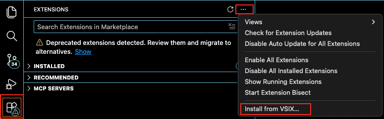
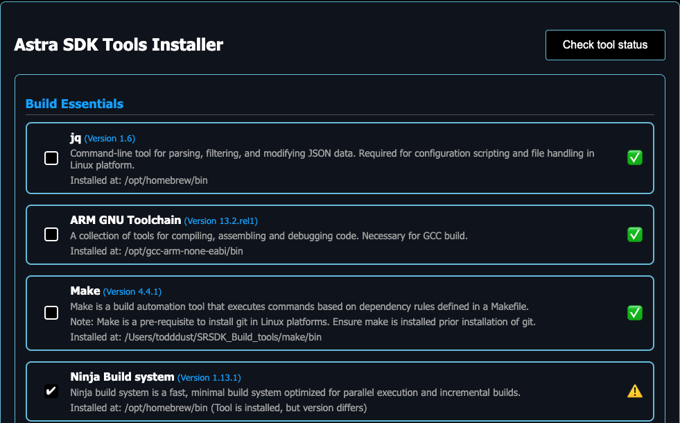
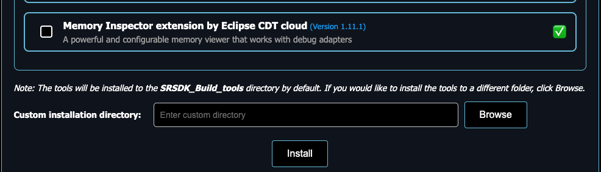
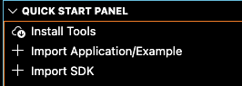

# Setup and Install SDK using VS Code

This guide provides a concise, end-to-end setup for the Astra MCU SDK in VS Code. For more detailed
information, see [VS Code Extension User Guide](./Astra_MCU_SDK_VSCode_Extension_User_Guide.md).

Throughout this guide, `<sdk-root>` refers to the directory where you extracted or cloned the SDK.

## Table of Contents
- [Prerequisites](#prerequisites)
- [Install the Synaptics VS Code Extension](#install-the-synaptics-vs-code-extension)
- [Install Tools](#install-tools)
- [Linux USB/serial permissions (recommended)](#linux-usbserial-permissions-recommended)
- [Import Application/Example and Set SRSDK_DIR](#import-applicationexample-and-set-srsdk_dir)
- [Build and Flash (VS Code)](#build-and-flash-vs-code)
- [Troubleshooting Tips](#troubleshooting-tips)

## Prerequisites

- Supported host OS: Windows x64, Linux x86_64 or aarch64 (Ubuntu 22.04), macOS x86_64 or ARM64.
    - **Note:** For SL2610 development, only Linux hosts are supported (WSL with Ubuntu 22.04 is supported). See [Astra MCU SDK - WSL User Guide](./Astra_MCU_SDK_WSL_User_Guide.md).
    - Windows users: it is highly recommended to run VS Code and the Synaptics extension within WSL2. See the [VS Code WSL guide](https://code.visualstudio.com/docs/remote/wsl) for details.
- Visual Studio Code installed ([download](https://code.visualstudio.com/download)). 

## Get the SDK

- Extract or clone the SDK to a local directory (for example, `<sdk-root>`).
- Keep the SDK path short on Windows to avoid path length issues.

## Install the Synaptics VS Code Extension

1. Click the Extensions icon on the side bar, click the three dots at the top right of the extensions window, and select **Install from VSIX...**

2. Locate the VSIX package in `<sdk-root>/tools/` (for example, `<sdk-root>/tools/Astra_MCU_SDK_vscode_extension-<version>.vsix`), and click **Install**.

3. Confirm the Synaptics extension appears in the VS Code activity bar, usually on the left pane.

    
4. **Close and then reopen VS Code.**

## Install Tools

1. Open the Synaptics extension sidebar and select **Install Tools**.

    
2. The tool check runs automatically when the panel opens; you can also click **Check tool status** to re-run it.
    - **Note:** On Linux and macOS, check the VS Code terminal; it may ask you to enter your password to install tools required for the tool check.
3. Review any missing tools. Missing tools are flagged with a warning icon and are pre-selected for installation.

     
4. Click **Install** and monitor progress in the Install Script Terminal. During installation your OS may prompt for confirmation/approval on some installation steps.

    
    Default Install locations:
   - Windows: `C:/Users/<username>/SRSDK_Build_tools`
   - Linux: `/home/<username>/SRSDK_Build_tools`
   - macOS: `/Users/<username>/SRSDK_Build_tools`
5. **When installation finishes, close VS Code and reopen.**

Note:
- Arm Compiler 6 (AC6) requires manual installation due to licensing constraints. Follow the steps provided in the tool.

## Linux USB/serial permissions (recommended)

On Linux, add your user to the `dialout` group so the flashing tools can access USB CDC/UART devices:

```bash
sudo usermod -aG dialout $USER
```

Log out and log back in (or reboot) for the group change to take effect.

## Import Application/Example and Set SRSDK_DIR

1. In the Synaptics sidebar, choose **Import Application/Example**.

    
2. Import from local (select the SDK `<sdk-root>/examples/` folder).
3. After importing examples, open **Import SDK** and set `SRSDK_DIR` to `<sdk-root>` (not the `<sdk-root>/examples/` folder).
    - **Note:** The **Import SDK** button appears after you import the examples. 

This updates the workspace `settings.json` so build, image conversion, and flashing can locate the SDK.

## Build and Flash (VS Code)

SoC-specific build and flash flows:
- SR110 Build and Flash with VS Code: [SR110 Build and Flash with VS Code](./SR110/SR110_Build_and_Flash_with_VSCode.md)
- SL2610 Build and Flash with VS Code: [SL2610 Build and Flash with VS Code](./SL2610/SL2610_Build_and_Flash_with_VSCode.md)

## Troubleshooting Tips

- Only one SDK can be imported per VS Code workspace.
- On Windows, keep the SDK path short to avoid path length issues.
- If Build and Deploy is disabled, re-check `SRSDK_DIR` in **Import SDK**.
- Examples can only be built from the SDK `<sdk-root>/examples/` directory; import it via **Import Application/Example**.
- **Problem:** Build and Deploy button is disabled or grayed out.  
  **Cause:** Examples directory not imported or `SRSDK_DIR` not set.  
  **Solution:**  
  1. Verify you imported the `<sdk-root>/examples/` folder (not the SDK root).  
  2. Use **Import SDK** to set `SRSDK_DIR`.  
  3. Refresh the workspace (close and reopen VS Code).
