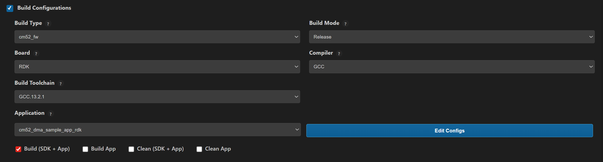

# DMA Sample Application

## Description

This DMA sample application demonstrates advanced DMA usage including 1D memory transfers, linked descriptor chains, and software-triggered transfers. It highlights DMA channel management, pause/resume control, interrupt-driven completion handling, cache maintenance, and data integrity validation under FreeRTOS.

## Build Instructions

### Prerequisites
- [GCC build environment setup](../../../../docs/build_env)
- [Astra MCU SDK VS Code Extension installed and configured](../../../../docs/Astra_MCU_SDK_VSCode_Extension_User_Guide.md)

### Configuration and Build Steps

### 1. Using Astra MCU SDK VS Code extension
   - Navigate to **IMPORTED REPOS** → **Build and Deploy** in the Astra MCU SDK VS Code Extension.
   - Select the **Build Configurations** checkbox, then select the necessary options.
   - Select **cm52_dma_sample_app_rdk** in the **Application** dropdown. This will apply the defconfig.
   - Select the appropriate build and clean options from the checkboxes. Then click **Run**. This will build the SDK generating the required `.elf` or `.axf` files for deployment using the installed package.

   For detailed steps refer to the [Astra MCU SDK VS Code Extension Userguide](../../../../docs/Astra_MCU_SDK_VSCode_Extension_User_Guide.md).

   

### 2. Native build in the terminal
1. **Select the default configuration of the bootloader and build**
   This will apply the defconfig, generating the required `.elf` or `.axf` files for deployment using the installed package.
   The bootloader should be built from SRSDK root directory by running the below command.
   ```bash
   make sl2610_bootloader_rdk_defconfig BOARD=SR2610_RDK
   make
   ```

2. **Select Default Configuration and build sdk + example**
   This will apply the defconfig, then build and install the SDK package, generating the required `.elf` or `.axf` files for deployment using the installed package.
   ```bash
   make cm52_dma_sample_app_defconfig BOARD=SR2610_RDK BUILD=SRSDK
   ```

3. **Rebuild the Application using pre-built package**
   The build process will produce the necessary .elf or .axf files for deployment with the installed package.
   ```bash
   make cm52_dma_sample_app_defconfig BOARD=SR2610_RDK or make
   ```
   **Note:** We need to have the pre-built Astra MCU SDK package before triggering the example alone build.

## Deployment and Execution

### Generate Binary Files

- Generate firmware binaries as follows:
   - Export the SRSDK directory path.
   ```bash
   export SRSDK_DIR="path/to/sdk"
   ```
   - Navigate to the **examples** directory.
   ```bash
   cd /path/to/examples
   ```
   - Execute the following command to generate binaries.
   ```bash
   make imagegen
   ```
   - Copy the generated binaries
      - sl2610_bootloader_extras.bin
      - sl2610_bootloader_output.bin
      - sl2610_cm52_fw_extras.bin
      - sl2610_cm52_fw_output.bin
   to the VSSDK directory.

### Generate System Sub Image
   - For build steps of sysmgr sub-image in VSSDK folder refer to the [VSSDK BUILD STEPS](../../../../docs/SL2610/SL2610_Platform_Guide.md#image-generation-2).


### Loading Image to the target

#### Flash MCU Binary

To Flash the MCU Binary to target refer [SL2610 Platform Guide - MCU-Only Image Flashing](../../../../docs/SL2610/SL2610_Platform_Guide.md#image-flashing)

#### Download MCU Binary to RAM

To Download MCU Binary to RAM [SL2610 Platform Guide - Image Download](../../../../docs/SL2610/SL2610_Platform_Guide.md#image-flashing)

### Running the Application

- After successfully flashing the image, make the required hardware connections on the SL2610_RDK.
   - Hardware Setup
      - Power the device by connecting a power adapter to the PWR slot on the board.

   - UART connection:
      - Connect the UART interface card:
         - TX, RX, and GND pins of the UART adapter
         - To RX, TX (Pin 28), and GND pins on the device
      - Open MobaXterm (or equivalent) and select a serial connection to view application logs.

- Click the reset button in the device to make the application run.
