# Hand Gesture Detection ML Application

## Description

The Hand Gesture Detection application is a ML-based computer vision solution designed to perform real-time gesture recognition with hand detection, single hand tracking and hand-key point estimation. This demo detects hands in every frame, tracks one hand across frames, identifies 1 key point (at the centre) for each hand location and identifies 10 distinct hand gestures (One, Two, Three, Four, Palm, Thumbs Up, Thumbs Down, Pinch, Fist and Other). Supports only HD resolution.

## Build Instructions

### Prerequisites
- [GCC/AC6/LLVM build environment setup](../../../../docs/build_env)
- [Astra MCU SDK VS Code Extension installed and configured](../../../../docs/Astra_MCU_SDK_VSCode_Extension_User_Guide.md)
- [SynaToolkit installed and configured](../../../../docs/SR110/Synatoolkit_User_Guide.md)

### Hardware Requirements
- Sensor Adapter (included with the Astra Machina Micro kit)
- OV5647 Camera Sensor

### Configuration and Build Steps

### 1. Using Astra MCU SDK VS Code extension
   - Navigate to **IMPORTED REPOS** → **Build and Deploy** in the Astra MCU SDK VSCode Extension.
   - Select the **Build Configurations** checkbox, then select the necessary options.
   - Select **hand_gesture_detection** in the **Application** dropdown. This will apply the defconfig.
   - Select the appropriate build and clean options from the checkboxes. Then click **Run**. This will build the SDK generating the required `.elf` or `.axf` files for deployment using the installed package.

   For detailed steps refer to the [Astra MCU SDK VS Code Extension Userguide](../../../../docs/Astra_MCU_SDK_VSCode_Extension_User_Guide.md).

   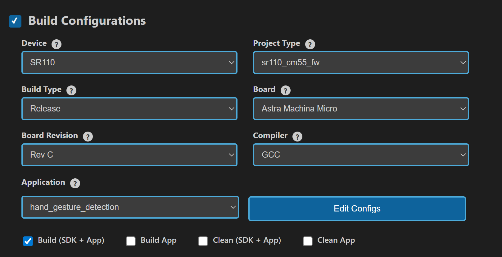

### 2. Native build in the terminal
1. **Select Default Configuration and build sdk + example**
   This will apply the defconfig, then build and install the SDK package, generating the required `.elf` or `.axf` files for deployment using the installed package.
   ```bash
   make cm55_hand_gesture_detection_defconfig BOARD=SR110_RDK BUILD=SRSDK
   ```

2. **Rebuild the Application using pre-built package**
   The build process will produce the necessary .elf or .axf files for deployment with the installed package.
   ```bash
   make cm55_hand_gesture_detection_defconfig BOARD=SR110_RDK or make
   ```
   **Note:** We need to have the pre-built SRSDK package before triggering the example alone build.

## Deployment and Execution

### Setup and Flashing

   1. **Open the Astra MCU SDK VSCode Extension and connect to the Debug IC USB port on the Astra Machina Micro Kit.**
      For detailed steps refer to the [Astra MCU SDK User Guide](../../../../docs/Astra_MCU_SDK_User_Guide.md).

   2. **Generate Binary Files**
      - FW Binary generation
         - Navigate to **IMPORTED REPOS** → **Build and Deploy** in Astra MCU SDK VSCode Extension.
         - Select the **Image Conversion** option, browse and select the required .axf or .elf file. If the usecase is built using the VS Code extension, the file path will be automatically populated.
         - Open **Advanced Configurations**, navigate to Edit JSON File, and select NVM_data.json.
         - Click Edit JSON File to open and modify the contents.
         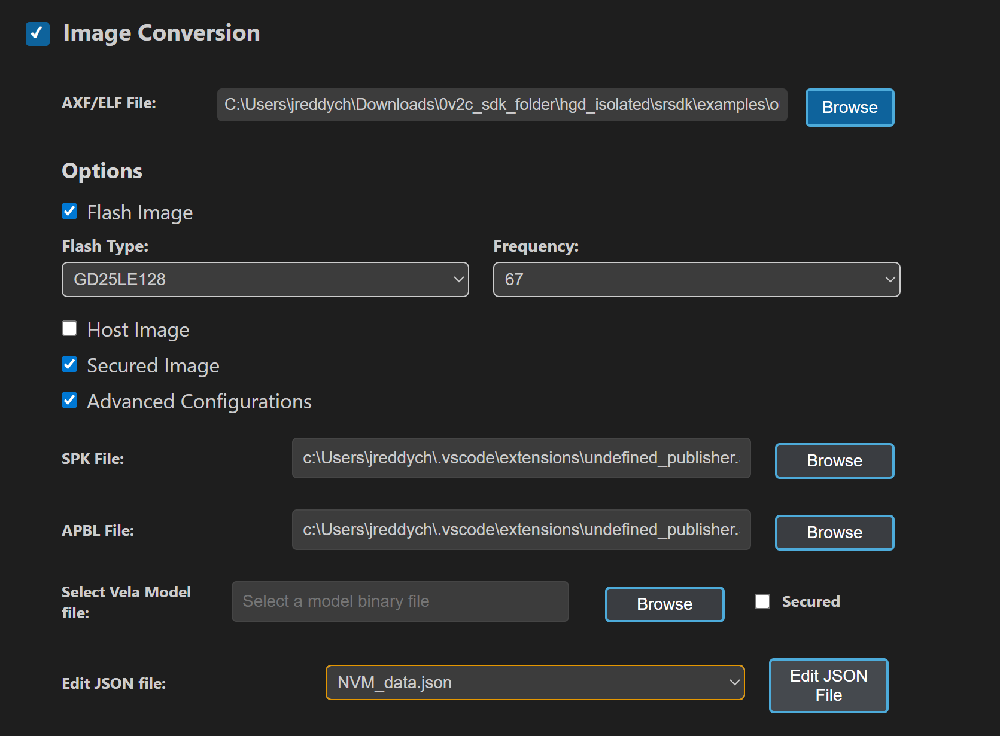
         - In NVM_data.json file set **image_offset_Model_A_offset** to **00607000** and set **image_offset_Model_B_offset** to **00737000**.
         
         - Click **Run** to create the binary files.
         - Refer to [Astra MCU SDK VSCode Extension User Guide](../../../../docs/Astra_MCU_SDK_VSCode_Extension_User_Guide.md) for more detailed instructions.
      - Model Binary generation (to place the Model in Flash)
         - To generate `.bin` file for TFLite models, please refer to the [Vela compilation guide](../../../../docs/Astra_MCU_SDK_vela_compilation_tflite_model.md).

   3. **Flash the Application**
      - To flash the application:
         * Select the **Image Flashing** option in the **Build and Deploy** view in the Astra MCU SDK VSCode Extension.
         * Select **SWD/JTAG** as the Interface.
         * Choose the respective image bins and click **Run**.
   
      - Flash the pre-generated model binary: `hand_gesture_detection_flash(1280x704).bin`. Due to memory constraints, need to burn the Model weights to Flash. 
         - Location: `examples/SR110_RDK/vision_examples/uc_hand_gesture_detection/models/`
         - Flash address: `0x607000`
         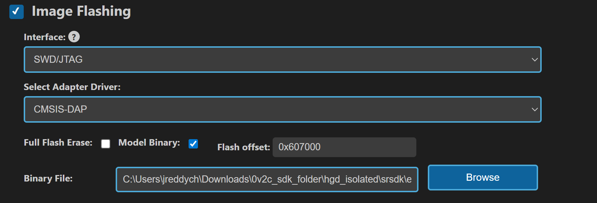

      - Flash the pre-generated model binary: `hand_gesture_detection_flash(320x320).bin`. Due to memory constraints, need to burn the Model weights to Flash and during runtime the model weights will be loaded into SRAM. 
         - Location: `examples/SR110_RDK/vision_examples/uc_hand_gesture_detection/models/`
         - Flash address: `0x737000`
         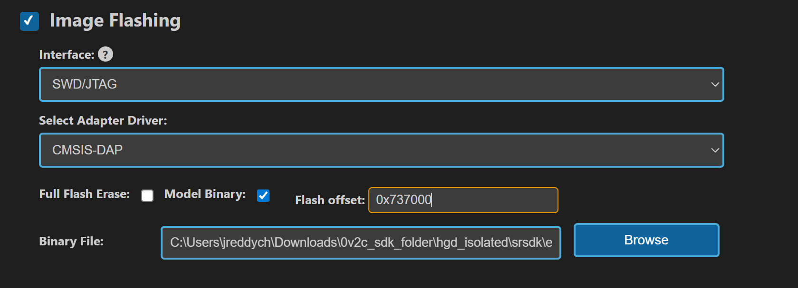

      - **Calculation Note:** Flash address is determined by the sum of the `host_image` size and the `image_offset_SDK_image_B_offset` (parameter, which is defined within `NVM_data.json`). It's crucial that the resulting address is aligned to a sector boundary (a multiple of 4096 bytes).This calculated resulting address should then be assigned to the `image_offset_Model_A_offset` macro in your `NVM_data.json` file.
      - Flash the generated `B0_flash_full_image_GD25LE128_67Mhz_secured.bin`
      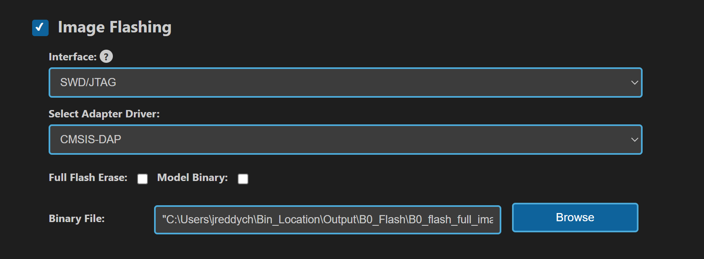
      > Note: By default, flashing a binary performs a sector erase based on the binary size. To erase the entire flash memory, enable the **Full Flash Erase** checkbox. When this option is selected along with a binary file, the tool first performs a full flash erase before flashing the binary. If the checkbox is selected without specifying a binary, only a full flash erase operation will be executed.

      Refer to the [Astra MCU SDK VSCode Extension User Guide](../../../../docs/Astra_MCU_SDK_VSCode_Extension_User_Guide.md) for detailed instructions on flashing.

   4. **Device Reset**
      Reset the target device after flashing is complete.

### Note:

The placement of the model (in **SRAM** or **FLASH**) is determined by its memory requirements. Models that exceed the available **SRAM** capacity, considering factors like their weights and the necessary **tensor arena** for inference, will be stored in **FLASH**.

### Running the Application

1. **Open SynaToolkit_2.6.0**

2. **Before running the application, make sure to connect a USB cable to the Application SR110 USB port on the Astra Machina Micro board and then press the reset button**
   - Connect to the newly enumerated COM port  
   - For logging output, connect to DAP logger port  

   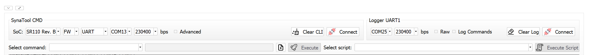

3. **The example logs will then appear in the logger window.**  

   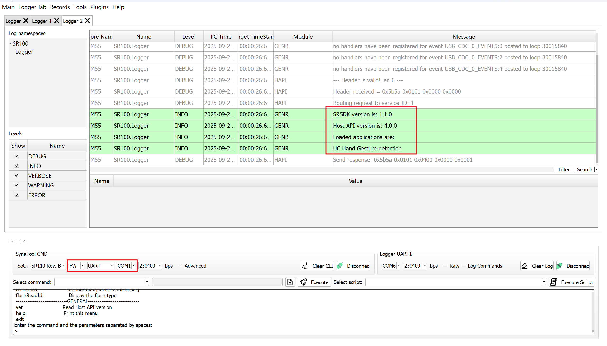

4. **Next, navigate to Tools → Video Streamer in SynaToolkit to run the application.**  

   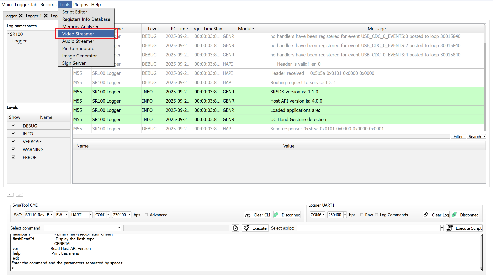

5. **Video Streamer**  
   - Configure the following settings:  
     - **UC ID**: HAND_GESTURE_DETECTION
     - **RGB Demosaic**: BayerGBRG

   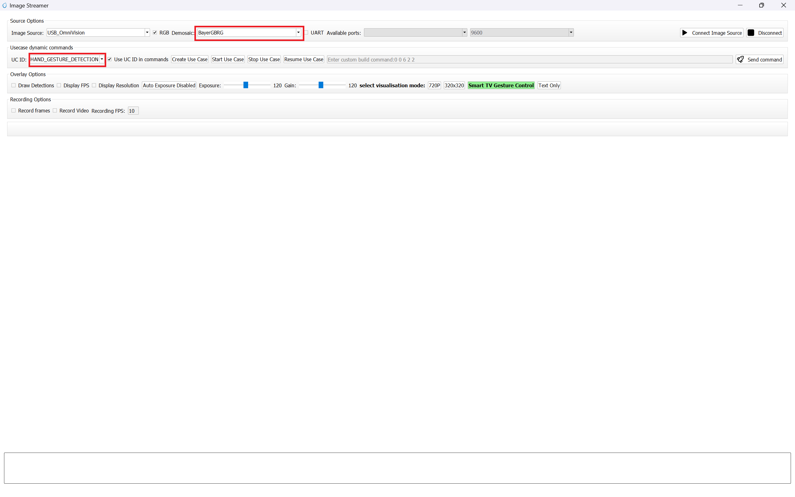

   - Click **Create Usecase**  
   - Connect the image source  
   - Click **Start Usecase** to begin real-time hand gesture detection 

   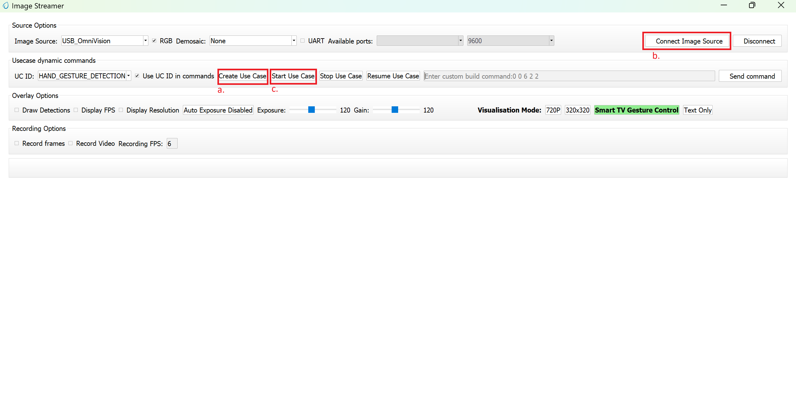

6. **After starting the use case, Hand gesture detection will begin streaming video as shown below.**
   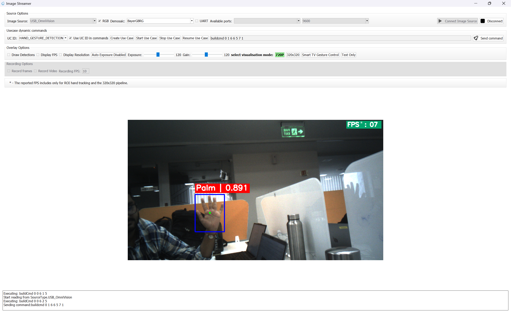