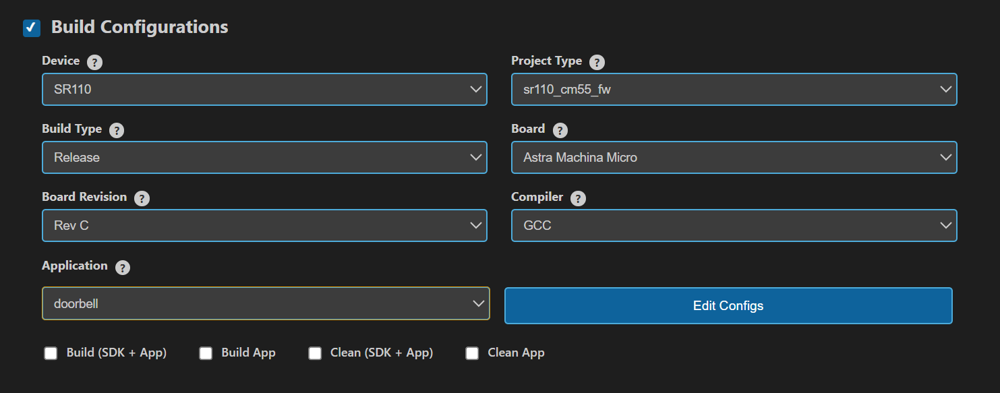
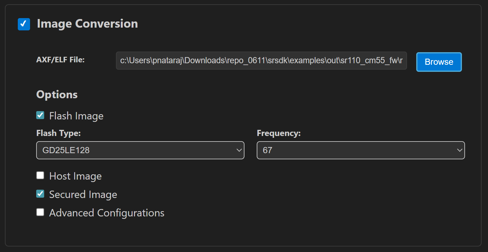
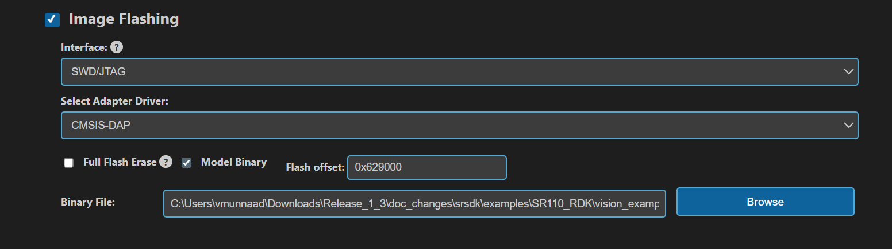
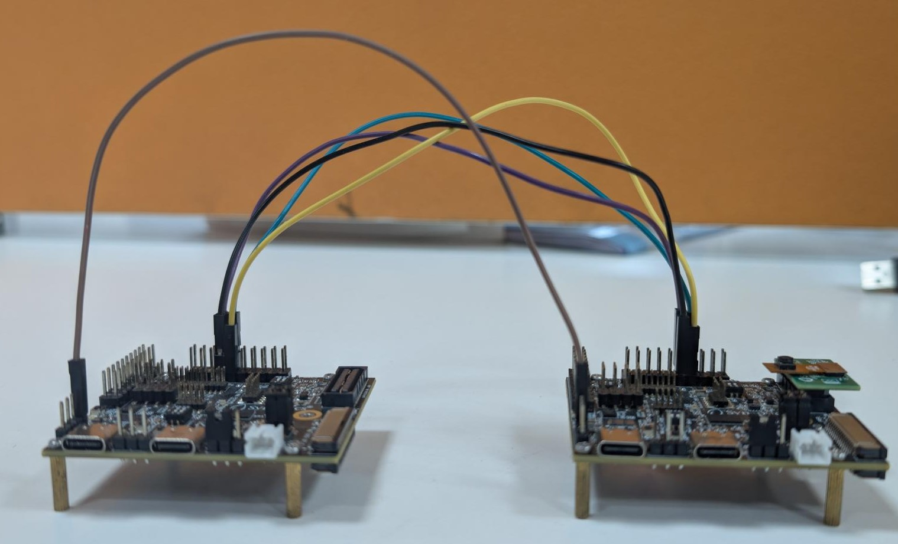
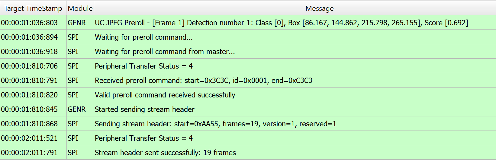
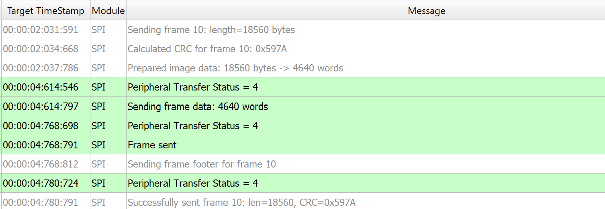
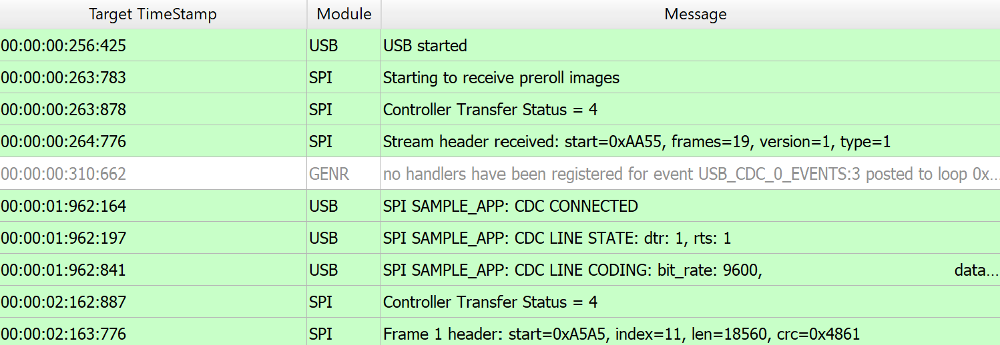
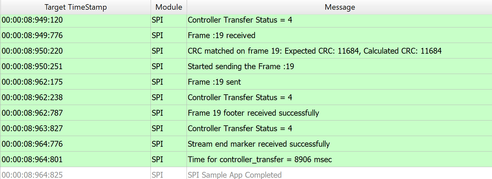

# Doorbell ML Application

## 1. Overview

The **Doorbell sample application** integrates the `UC_JPEG_PREROLL` and `IMAGE_STITCHING` use cases to detect a person within the camera’s field of view and capture high-resolution Full HD (FHD) images upon detection.

### 1.1 Image Delivery Options

Captured images can be delivered in two ways:

| Delivery Mode         | Description                                                                                   | Tools for Visualization                     |
|-----------------------|-----------------------------------------------------------------------------------------------|---------------------------------------------|
| USB CDC (to Host PC)  | Sends images via USB CDC to a host PC.                                                        |  VS Code Extension              |
| SPI to Controller     | Sends images over SPI to another Astra Machina Eval Kit acting as a controller; receives frames for logging. | Logger |

---

## 2. Build Instructions

### 2.1 Prerequisites

- [Astra MCU SDK VS Code Extension](../../../../docs/Astra_MCU_SDK_VSCode_Extension_User_Guide.md)

### 2.2 Build Options

| Method           | Steps                                                                                           | Notes                                           |
|------------------|-------------------------------------------------------------------------------------------------|-------------------------------------------------|
| VS Code Extension| Import SDK → Build or Clean SDK in “Imported Repos” → select configs (Application, Board, Compiler) → Build | GUI workflow; logs appear in VS Code terminal. |
| Native CLI       | Run `make cm55_doorbell_defconfig BOARD=SR110_RDK BUILD=SRSDK`                                        | Suitable for native builds                     |

### Configuration and Build Steps

**Note:** **Configure WAKEUP_TRIGGER**
   Navigate to: `uc_jpeg_preroll.c` change to CONFIG_WAKEUP_TRIGGER set to 2 for (GPIO-based wakeup)

### 1. Using Astra MCU SDK VS Code extension

   - Navigate to **IMPORTED REPOS** → **Build and Deploy** in the Astra MCU SDK VS Code Extension.
   - Select the **Build Configurations** checkbox, then select the necessary options.
   - Select **doorbell** in the **Application** dropdown. This will apply the defconfig.
   - Select the appropriate build and clean options from the checkboxes. Then click **Run**. This will build the SDK generating the required `.elf` or `.axf` files for deployment using the installed package.

   For detailed steps refer to the [Astra MCU SDK VS Code Extension Userguide](../../../../docs/Astra_MCU_SDK_VSCode_Extension_User_Guide.md).

   

### 2. Native build in the terminal

2. **Select Default Configuration and Build SDK + Example**
   This will apply the defconfig, then build and install the SDK package, generating the required `.elf` or `.axf` files for deployment.
   ```bash
   make cm55_doorbell_defconfig BOARD=SR110_RDK BUILD=SRSDK
   ```
   This configuration uses CONFIG_WAKEUP_TRIGGER set to 1 (Timer-based wakeup).

3. **Rebuild the Application using pre-built package**
   The build process will produce the necessary `.elf` or `.axf` files for deployment with the installed package.
   ```bash
   make cm55_doorbell_defconfig BOARD=SR110_RDK or make
   ```

## 3. Deployment and Execution

### 3.1 Setup and Flashing

1. **Open the Astra MCU SDK VSCode Extension and connect to the Debug IC USB port on the Astra Machina Micro Kit.**
   For detailed steps refer to the [Astra MCU SDK User Guide](../../../../docs/Astra_MCU_SDK_User_Guide.md).

2. **Generate Binary Files**
   - FW Binary generation
      - Navigate to **IMPORTED REPOS** → **Build and Deploy** in Astra MCU SDK VSCode Extension.
      - Select the **Image Conversion** option, browse and select the required .axf or .elf file. If the usecase is built using the VS Code extension, the file path will be automatically populated.

      
      - Click **Run** to create the binary files.
      - Refer to [Astra MCU SDK VSCode Extension User Guide](../../../../docs/Astra_MCU_SDK_VSCode_Extension_User_Guide.md) for more detailed instructions.
   - Model Binary generation (to place the Model in Flash)
      - To generate `.bin` file for TFLite models, please refer to the [Vela compilation guide](../../../../docs/Astra_MCU_SDK_vela_compilation_tflite_model.md).

3. **Flash the Application**

   - To flash the application:
      * Select the **Image Flashing** option in the **Build and Deploy** view in the Astra MCU SDK VSCode Extension.
      * Select **SWD/JTAG** as the Interface.
      * Choose the respective image bins and click **Run**.

   * Flash the pre-generated model binary: `door_bell_flash(384x512).bin`. Due to memory constraints, need to burn the Model weights to Flash.
     - Location: `examples/SR110_RDK/vision_examples/uc_jpeg_preroll/models/`
     - Flash address: `0x629000`
     - **Calculation Note:**
         The flash address is determined by adding the `host_image` size and the `image_offset_SDK_image_B_offset` parameter (defined in `NVM_data.json`).
         Ensure the resulting address is aligned to a sector boundary (a multiple of 4096 bytes).
         This calculated address should then be assigned to the `image_offset_Model_A_offset` macro in your `NVM_data.json` file.

     

      > Note: By default, flashing a binary performs a sector erase based on the binary size. To erase the entire flash memory, enable the **Full Flash Erase** checkbox. When this option is selected along with a binary file, the tool first performs a full flash erase before flashing the binary. If the checkbox is selected without specifying a binary, only a full flash erase operation will be executed.

   Refer to the [Astra MCU SDK VSCode Extension User Guide](../../../../docs/Astra_MCU_SDK_VSCode_Extension_User_Guide.md) for detailed instructions on flashing. 

### Note:

The placement of the model (in **SRAM** or **FLASH**) is determined by its memory requirements. Models that exceed the available **SRAM** capacity, considering factors like their weights and the necessary **tensor arena** for inference, will be stored in **FLASH**.

## 4. Running the Application

### 4.1 Options

| Method           | Steps                                                                 |
|------------------|-----------------------------------------------------------------------|
| **VS Code Extension**| Open `LOGGER` tab → Select port & baud → Connect                 |

💡 You can find detailed setup and usage instructions in the **Astra MCU SDK VSCode Extension User Guide**.

#### Initial Setup

- Press `RSTN` button on `SR110_RDK`.

#### Operation Flow

- On detection → frame is streamed → device enters hibernation.

---

### 4.2 Wakeup Triggers

| Trigger | Config                     | Behavior                                           |
|---------|----------------------------|----------------------------------------------------|
| Timer   | `CONFIG_WAKEUP_TRIGGER=1`  | Device wakes every 10 seconds.                    |
| GPIO    | `CONFIG_WAKEUP_TRIGGER=2`  | Jumper from GND → UART0 RX after 10s of hibernation. |

## 5. SPI Pre-roll Use Case

### 5.1 Overview
The SPI Pre-roll feature enables UC_JPEG_PREROLL to capture JPEG pre-roll frames and stream
them to a **controller (receiver)** over **SPI**.

- **Peripheral (Sender)**: The device that's flashed with **UC_JPEG_PREROLL** acts as the **SPI Peripheral device**, that captures frames, packages them with headers/footers, and transmits them via SPI.
- **Controller (Receiver)**: The device that's flashed with **SPI_SAMPLE_APP** acts as the **SPI Controller device**, that requests pre-roll frames, and validates CRC.

This mechanism ensures that when detection is triggered, the system can send pre-roll images that occurred **before** the detection event.

The SPI Pre-roll transfer follows a protocol as described in [SPI Pre-roll Protocol](spi_preroll_protocol.md)

## 5.2 Configurations

### 5.2.1 Peripheral (Sender) Configurations

Run the Doorbell defconfig to apply the default settings for the doorbell use case. Enable SPI module by enabling **MODULE_SPI_ENABLED** and build the image. With the settings, the device will operate as the SPI pre-roll Peripheral (Sender).

```makefile
make cm55_doorbell_defconfig BOARD=SR110_RDK BUILD=SRSDK EDIT=1 #Enable SPI and LOGGER_IF_UART_0
```
**Remember** enable LOGGER_IF_UART_0 before building the peripheral image with **LOGGER_IF_UART_0** in the menuconfig.

### 5.2.2 Controller (Receiver) Configurations

Run the SPI Sample App defconfig to apply the default settings for the SPI Sample application.
Enable **SPI_PREROLL_TRANSFER** in `spi_sample_app.c` and **SPI_DOUBLE_BOARD_MODE**
in `spi_sample_app.h` and build the image.
With these settings, the device will operate as the SPI pre-roll Controller (Receiver).

```makefile
make cm55_spi_sample_app_defconfig BOARD=SR110_RDK BUILD=SRSDK
make
```

## 5.3 Hardware Setup

The following are the pins that are used for SPI Communication,

### 5.3.1 Controller Pins

1. Pin 11 - SPI_MSTR_CLK (GPIO_22)
2. Pin 12 - SPI_MSTR_CS (GPIO_21)
3. Pin 13 - SPI_MSTR_MISO (GPIO_24)
4. Pin 14 - SPI_MSTR_MOSI (GPIO_23)

### 5.3.2 Peripheral Pins

1. Pin 7 - SPI_SLV_CLK (GPIO_6)
2. pin 8 - SPI_SLC_CS (GPIO_8)
3. pin 9 - SPI_SLV_MISO (GPIO_7)
4. pin 10 - SPI_SLV_MOSI (GPIO_9)

### 5.3.3 Connections

1. Pin 11 (SPI_MSTR_CLK) →  Pin 7 (SPI_SLV_CLK)
2. Pin 12 (SPI_MSTR_CS) →  Pin 8 (SPI_SLV_CS)
3. Pin 13 (SPI_MSTR_MISO) →  Pin 9 (SPI_SLV_MISO)
4. Pin 14 (SPI_MSTR_MOSI) →  Pin 10 (SPI_SLV_MOSI)

**Remember**, The logs will be seen via UART 0. Enable UART 0 log via menuconfig. It is recommended to have the DAP SR110 not powered up because of SPI pin conflict in RDK.

## 5.3.4 Connection Images

   
   

## 5.4 Test Procedure

The test can begin once the images are built, flashed onto the respective devices, and the hardware setup is completed. The pins described above represent the required SPI connections. In addition, the Ground lines of both boards must be connected to ensure a stable link. Failure to do so may result in corrupted or invalid data.

### 5.4.1 Peripheral (Sender) Steps

Before flashing the Peripheral image, the model binary must first be loaded at address **0x629000**.
Once the model is loaded, flash the Peripheral image and reset the device.
On reset, the device enters hibernation and capture pre-roll images. Once the device wakes up from hibernation and if detection events are seen, It will initiate the SPI Peripheral Transfer to stream the captured pre-roll images.




### 5.4.2 Controller (Receiver) Steps

Flash the Controller image, but reset the controller device only after the peripheral wakes up
from hibernation and begins the peripheral transfer.
This ensures that the peripheral is ready to accept the pre-roll request and related commands
from the controller.

   
   

## 5.6 Expected Results

Controller initiates the transfer by sending a pre-roll request header. Peripheral responds with the stream header, all pre-roll JPEG frames, and the stream end marker over SPI.
Controller successfully receives and validates each frame, including headers, CRC, and footers. We can confirm successful reception of pre-roll frames with logs.
