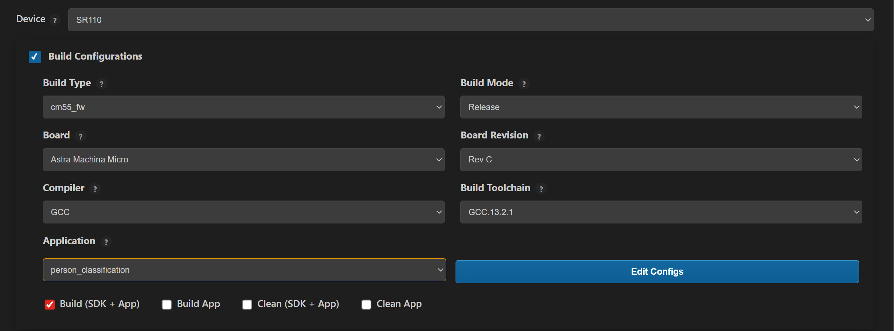
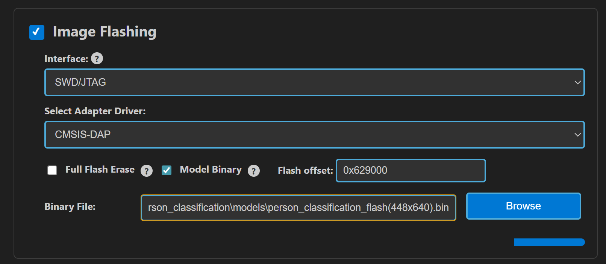
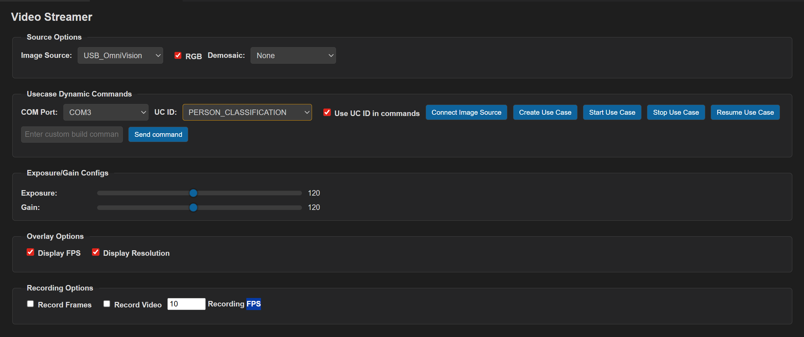
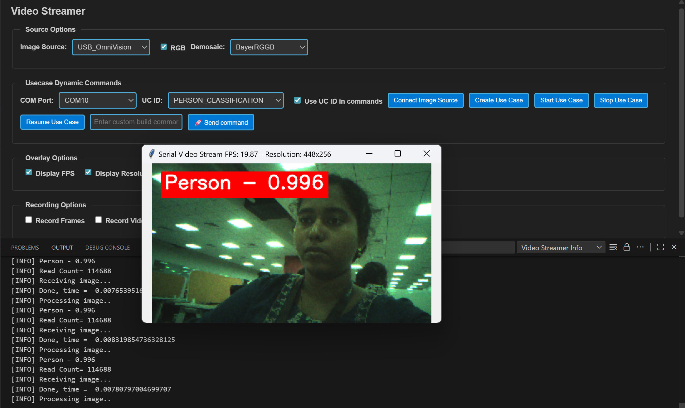

# Person Classification ML Application

## Description

The Person Classification application is a machine learning-powered computer vision solution designed to perform real-time object detection and classification. The application analyzes input from camera feeds and intelligently categorizes detected objects into two distinct classes: person and non-person. This binary classification system enables accurate identification and tracking of human presence within the camera's field of view. This example supports both WQVGA(480x270) and VGA(640x480) resolutions.

## Build Instructions

### Prerequisites
- [GCC/AC6/LLVM build environment setup](../../../../docs/build_env/)
- [Astra MCU SDK VS Code Extension installed and configured](../../../../docs/Astra_MCU_SDK_VSCode_Extension_User_Guide.md)

### Configuration and Build Steps

### 1. Using Astra MCU SDK VS Code extension
   - Navigate to **IMPORTED REPOS** → **Build and Deploy** in the Astra MCU SDK VSCode Extension.
   - Select the **Build Configurations** checkbox, then select the necessary options.
   - Select **person_classification** in the **Application** dropdown. This will apply the defconfig.
   - Select the appropriate build and clean options from the checkboxes. Then click **Run**. This will build the SDK generating the required `.elf` or `.axf` files for deployment using the installed package.

   For detailed steps refer to the [Astra MCU SDK VS Code Extension Userguide](../../../../docs/Astra_MCU_SDK_VSCode_Extension_User_Guide.md).

   

### 2. Native build in the terminal
1. **Select Default Configuration and build sdk + example**
   This will apply the defconfig, then build and install the SDK package, generating the required `.elf` or `.axf` files for deployment using the installed package.
   ```bash
   make cm55_person_classification_defconfig BOARD=SR110_RDK BUILD=SRSDK
   ```
   This configuration uses WQVGA resolution by default.

2. **Edit default configs and build sdk + example**

   >💡Tip: Run `make cm55_person_classification_defconfig BOARD=SR110_RDK BUILD=SRSDK EDIT=1` to modify the configuration via a GUI and proceed with build.

   | Configuration | Menu Navigation | Action |
   |---------------|-----------------|---------|
   | **VGA Resolution** | `COMPONENTS CONFIGURATION → Off Chip Components → Display Resolution` | Change to `VGA(640x480)` |
   | **WQVGA in LP Sense** | `COMPONENTS CONFIGURATION → Drivers` | Enable `MODULE_LP_SENSE_ENABLED` |
   | **Static Image** | `COMPONENTS CONFIGURATION → Off Chip Components` | Disable `MODULE_IMAGE_SENSOR_ENABLED` |

3. **Rebuild the Application using pre-built package**
   The build process will produce the necessary .elf or .axf files for deployment with the installed package.
   ```bash
   make cm55_person_classification_defconfig BOARD=SR110_RDK or make
   ```
   **Note:** We need to have the pre-built Astra MCU SDK package before triggering the example alone build.

## Deployment and Execution

### Setup and Flashing

1. **Open the Astra MCU SDK VSCode Extension and connect to the Debug IC USB port on the Astra Machina Micro Kit.**
   For detailed steps refer to the [Astra MCU SDK User Guide](../../../../docs/Astra_MCU_SDK_User_Guide.md).

2. **Generate Binary Files**
   - FW Binary generation
      - Navigate to **IMPORTED REPOS** → **Build and Deploy** in Astra MCU SDK VSCode Extension.
      - Select the **Image Conversion** option, browse and select the required .axf or .elf file. If the usecase is built using the VS Code extension, the file path will be automatically populated.

      
      - Click **Run** to create the binary files.
      - Refer to [Astra MCU SDK VSCode Extension User Guide](../../../../docs/Astra_MCU_SDK_VSCode_Extension_User_Guide.md) for more detailed instructions.
   - Model Binary generation (to place the Model in Flash)
      - To generate `.bin` file for TFLite models, please refer to the [Vela compilation guide](../../../../docs/Astra_MCU_SDK_vela_compilation_tflite_model.md).

3. **Flash the Application**

   To flash the application:

   * Select the **Image Flashing** option in the **Build and Deploy** view in the Astra MCU SDK VSCode Extension.
   * Select **SWD/JTAG** as the Interface.
   * Choose the respective image bins and click **Run**.

   

   **For WQVGA resolution:**
   - Flash the generated `B0_flash_full_image_GD25LE128_67Mhz_secured.bin` file directly to the device.

   > Note: Model weights is placed in SRAM.

   **For VGA resolution:**

   - For VGA resolution, flash the **model binary first**, and then proceed to flash the **generated use case binary**.

   - **Steps:**
   1. Flash the pre-generated model binary: `person_classification_flash(448x640).bin`.
      Due to memory constraints, the model weights need to be stored in Flash.
      Browse and select this binary from the location: `examples/vision_examples/uc_person_classification/models/`
      Select the **Model Binary** checkbox and enter the specified flash address in the **"Flash Offset"** field and start flashing.
      - **Flash address:** `0x629000`
      - **Calculation Note:**
         The flash address is determined by adding the `host_image` size and the `image_offset_SDK_image_B_offset` parameter (defined in `NVM_data.json`).
         Ensure the resulting address is aligned to a sector boundary (a multiple of 4096 bytes).
         This calculated address should then be assigned to the `image_offset_Model_A_offset` macro in your `NVM_data.json` file.

      
   2. Flash the generated `B0_flash_full_image_GD25LE128_67Mhz_secured.bin` file.

   > Note: By default, flashing a binary performs a sector erase based on the binary size. To erase the entire flash memory, enable the **Full Flash Erase** checkbox. When this option is selected along with a binary file, the tool first performs a full flash erase before flashing the binary. If the checkbox is selected without specifying a binary, only a full flash erase operation will be executed.

   Refer to the [Astra MCU SDK VSCode Extension User Guide](../../../../docs/Astra_MCU_SDK_VSCode_Extension_User_Guide.md) for detailed instructions on flashing.

4. **Device Reset**

   Reset the target device after flashing process is complete.

### Note:

The placement of the model (in **SRAM** or **FLASH**) is determined by its memory requirements. Models that exceed the available **SRAM** capacity, considering factors like their weights and the necessary **tensor arena** for inference, will be stored in **FLASH**.

### Running the Application using VS Code extension

1. After successfully flashing the usecase and model binaries, click on **Video Streamer** option in the side panel. This will open the Video Streamer webview.

   

2. Before running the application, make sure to connect a USB cable to the Application SR110 USB port on the Astra Machina Micro board and then press the reset button
   - Select the newly enumerated COM port in the dropdown.
   - For logging output, click on **SERIAL MONITOR** and connect to the DAP logger port.

3. Select **PERSON_CLASSIFICATION** from the **UC ID** dropdown. Select **RGB Demosaic**: BayerRGGB

   

4. Click **Create Use Case** button. Then click the **Start Use Case** button. A python window will be opened and video stream will be displayed as shown below. Logs can be viewed through the Serial Monitor

   

5. **Autorun usecases:** If the usecase is built with autorun enabled, after flashing the binary and completing step 3 (selecting the usecase from the **UC ID** dropdown), click on the **Connect Image Source** button. This will open the video stream pop-up.
