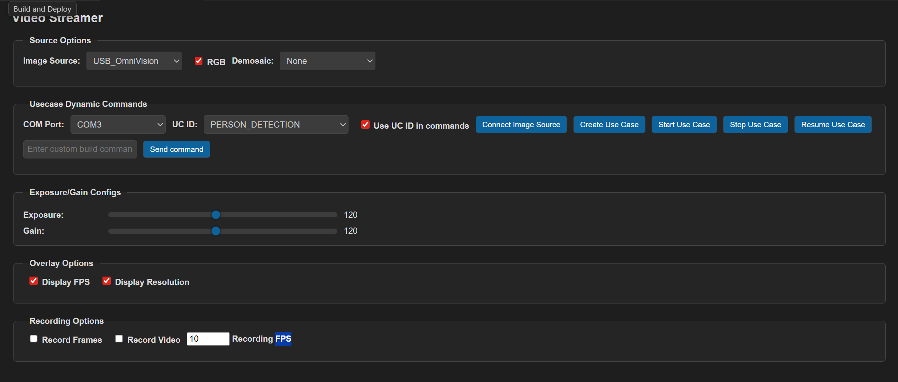
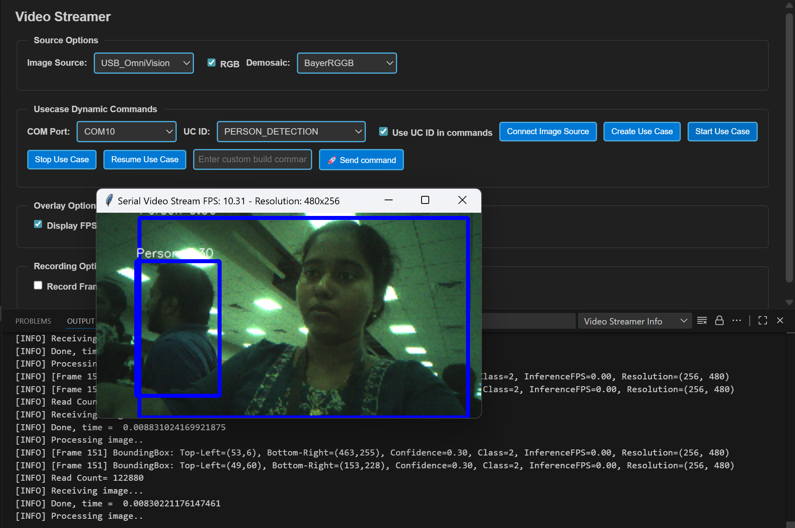

# Person Detection ML Application

## Description

The UC Person Detection application is designed to identify and locate persons within its field of view. It leverages object detection techniques to generate bounding boxes around detected individuals and assigns confidence scores to indicate the reliability of each detection. The output includes the precise location of each person in the image along with a confidence value, enabling accurate and efficient person recognition for various embedded vision applications. This example supports both WQVGA(480x270) and VGA(640x480) resolutions.

## Prerequisites
- Choose **one** setup path:
  - **CLI**: [Setup and Install SDK using CLI](../../../../docs/Setup_and_Install_SDK_using_CLI.md)
  - **VS Code**: [Setup and Install SDK using VS Code](../../../../docs/Setup_and_Install_SDK_using_VSCode.md)

## Building and Flashing the Example using VS Code

Use the VS Code flow described in the SR110 guide and the VS Code Extension guide:
- [SR110 Build and Flash with VS Code](../../../../docs/SR110/SR110_Build_and_Flash_with_VSCode.md)
- [Astra MCU SDK VS Code Extension User Guide](../../../../docs/Astra_MCU_SDK_VSCode_Extension_User_Guide.md)

**Build (VS Code):**
1. Open **Build and Deploy** → **Build Configurations**.
2. Select **person_detection** in the **Application** dropdown.
3. If you need **VGA (640x480)**, click **Edit Configs** (Menuconfig) in the Build and Deploy view, then set  
   `COMPONENTS CONFIGURATION → Off Chip Components → Display Resolution` to **VGA**.
4. Optional configuration changes in Menuconfig:
   - **WQVGA in LP Sense**: `COMPONENTS CONFIGURATION → Drivers` → enable `MODULE_LP_SENSE_ENABLED`
   - **Static Image**: `COMPONENTS CONFIGURATION → Off Chip Components` → disable `MODULE_IMAGE_SENSOR_ENABLED`
4. Build with **Build (SDK + App)** for the first build, or **Build App** for rebuilds.

**Flash (VS Code):**
1. Use **Image Conversion** to generate the flash image.
2. Use **Image Flashing** (SWD/JTAG) to flash the firmware image.
3. **VGA use case:** flash the **model binary first**, then flash the **use case image**.  
   In **Image Flashing**, check **Model Binary** and set **Flash Offset** to `0x629000`, then flash the model file.  
   After that, flash the firmware image normally.

---

## Building and Flashing the Example using CLI

Use the CLI flow described in the SR110 guide:
- [SR110 Build and Flash with CLI](../../../../docs/SR110/SR110_Build_and_Flash_with_CLI.md)

**Build (CLI):**
1. From `<sdk-root>/examples`, build the example:
   ```bash
   cd <sdk-root>/examples
   export SRSDK_DIR=<sdk-root>
   make cm55_person_detection_defconfig BOARD=SR110_RDK BUILD=SRSDK
   ```
2. If you need **VGA (640x480)**, open Kconfig and set  
   `COMPONENTS CONFIGURATION → Off Chip Components → Display Resolution` to **VGA**:
   ```bash
   make cm55_person_detection_defconfig BOARD=SR110_RDK BUILD=SRSDK EDIT=1
   ```
3. Optional configuration changes in Menuconfig:
   - **WQVGA in LP Sense**: `COMPONENTS CONFIGURATION → Drivers` → enable `MODULE_LP_SENSE_ENABLED`
   - **Static Image**: `COMPONENTS CONFIGURATION → Off Chip Components` → disable `MODULE_IMAGE_SENSOR_ENABLED`

**Flash (CLI):**
1. Generate the flash image with the SRSDK image generator.
2. Flash the image with `flash_xspi_tcl.py` as described in the SR110 CLI guide.
3. **VGA use case:** flash the **model binary first** at offset `0x629000`, then flash the **use case image**.

---

## Running the Application using VS Code Extension

> **Windows note:** Ensure the USB drivers are installed for streaming. See the Zadig steps in  
> [SR110 Build and Flash with VS Code](../../../../docs/SR110/SR110_Build_and_Flash_with_VSCode.md#usb-cdc-image-streaming-windows).

1. In VS Code, open **Video Streamer** from the Synaptics sidebar.

   

2. For logging output, click **SERIAL MONITOR** and connect to the **DAP logger** port on J14.
   - To identify the logger COM port only plug in J14 first 
   - The logger port is not guaranteed to be consistent across OSes. As a starting point:
     - **Windows:** try the lower‑numbered J14 COM port first.
     - **Linux/macOS:** try the higher‑numbered J14 port first.
   - If you don’t see logs after a reset, switch to the other J14 port.
3. In the Video Streamer dropdown, select the **J13** COM port.
   - Plug in **J13** and press **RESET** on the board.
   - **Windows:** select the newly enumerated COM port.
   - **Linux/macOS:** select the lower‑numbered COM port of the two newly enumerated ports.
4. Select **PERSON_DETECTION** from the **UC ID** dropdown and set **RGB Demosaic** to **BayerRGGB**.

   

5. Click **Create Use Case**, then **Start Use Case**. A Python window opens and the video stream appears.

   

6. **Autorun use cases:** If autorun is enabled, after step 5 click **Connect Image Source** to open the video stream pop-up.

## Adapting Pipeline for Custom Object Detection Models

This person detection pipeline can be adapted to work with custom object detection models. However, certain validation steps and potential modifications are required to ensure compatibility.

### Prerequisites for Model Compatibility

Before adapting this pipeline for another object detection model, you must verify the following:

#### 1. Model Format Requirements
- Your object detection model should be in `.tflite` format
- The model should produce similar output tensor structure (bounding boxes, confidence scores)

#### 2. Vela Compiler Compatibility Check

**Step 1: Analyze Original Model**
1. Load your `object_detection_model.tflite` file in [Netron](https://netron.app/)
2. Document the output tensors:
   - Tensor names
   - Tensor identifiers/indexes
   - Quantization parameters (scale and offset values)
   - Tensor dimensions

**Step 2: Compile with Vela**
1. Pass your model through the Vela compiler to generate `model_vela.bin` or `model_vela.tflite`
2. Analyze the Vela-compiled model in Netron using the same steps as above

**Step 3: Compare Outputs**
Compare the following between original and Vela-compiled models:
- **Output tensor indexes/identifiers**: Verify if they remain in the same order
- **Quantization parameters**: Check if scale and offset values are preserved
- **Tensor dimensions**: Ensure dimensions match your expected output format

### Pipeline Adaptation Process

#### Case 1: No Changes Required
If the Vela compilation preserves:
- ✅ Output tensor indexes in the same order
- ✅ Same quantization scale and offset values

**Result**: You can proceed with the existing pipeline without modifications.

#### Case 2: Modifications Required
If the Vela compilation changes:
- ❌ Output tensor index order
- ❌ Quantization parameters

**Required Actions**: Modify the pipeline code as described below.

### Code Modifications

If your model's output tensor indexes change after Vela compilation, you need to update the tensor parameter assignments in `uc_person_detection.c`:

#### Location: `detection_post_process` function

**Original Code:**
```c
g_box1_params = &g_all_tens_params[0];
g_box2_params = &g_all_tens_params[1];
g_cls_params  = &g_all_tens_params[2];
```

**Modified Code:**
Update the array indexes according to your Vela-compiled model's output tensor identifiers:
```c
// Example: If your model_vela output has different tensor order
g_box1_params = &g_all_tens_params[X];  // Replace X with actual index from Netron
g_box2_params = &g_all_tens_params[Y];  // Replace Y with actual index from Netron
g_cls_params  = &g_all_tens_params[Z];  // Replace Z with actual index from Netron
```
