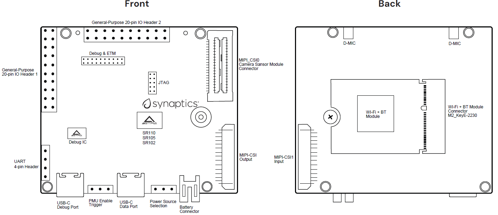
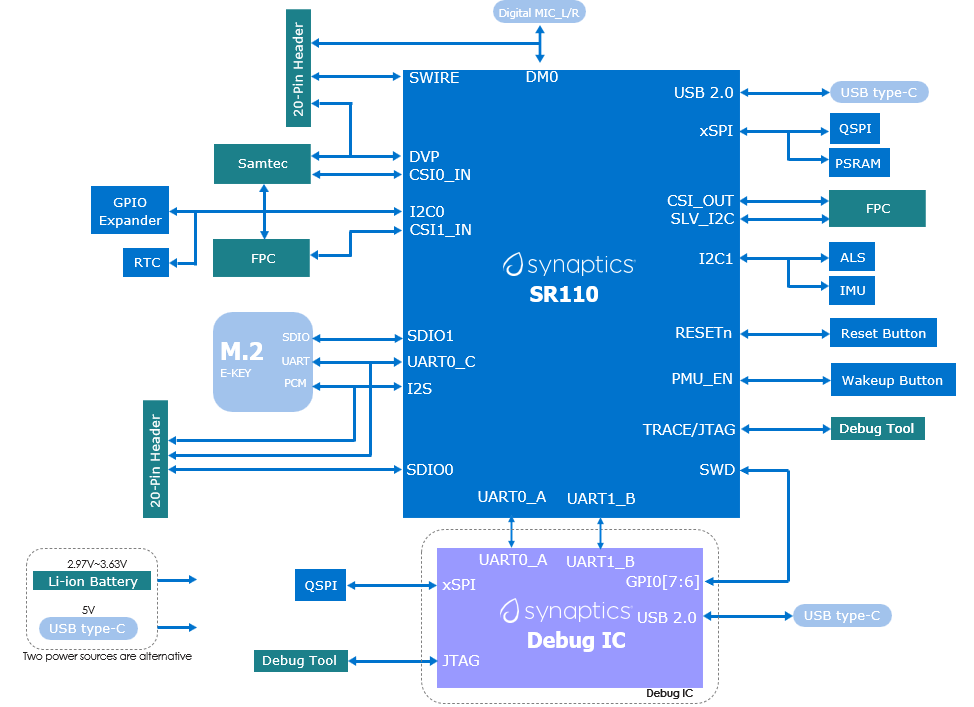
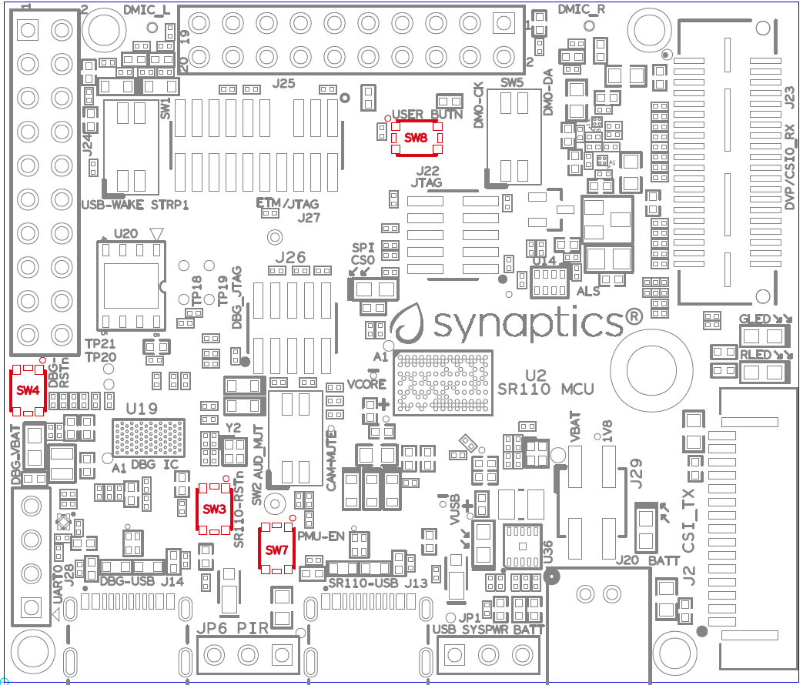
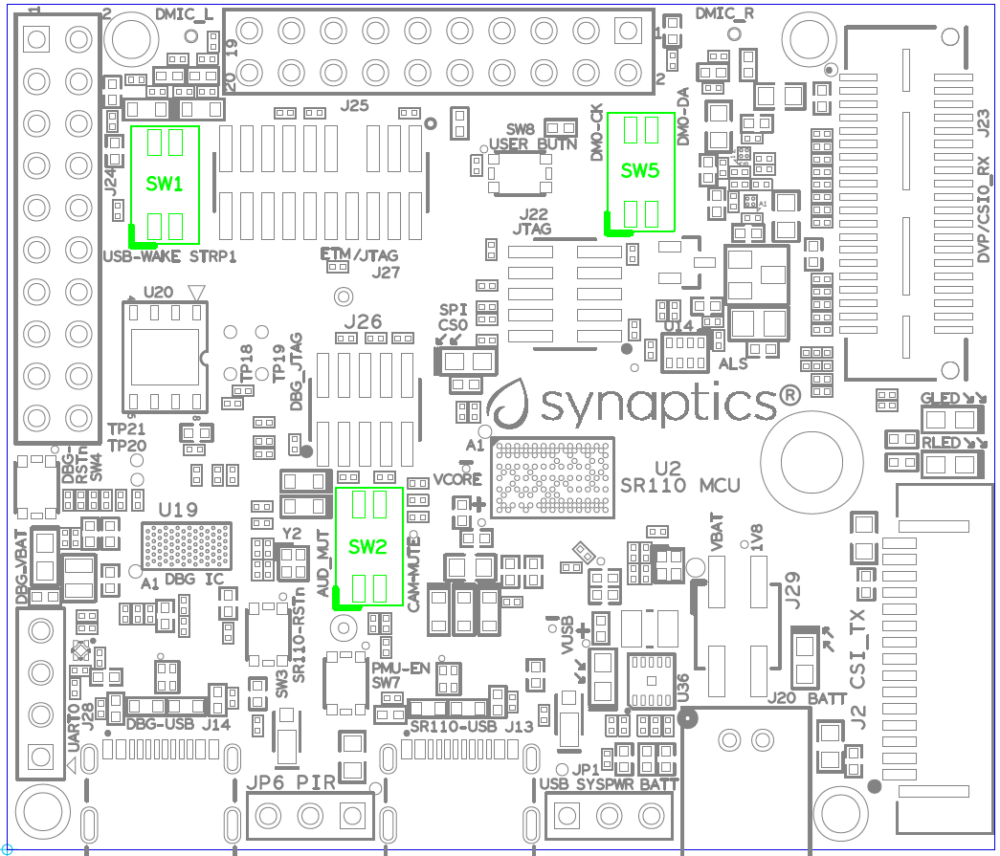
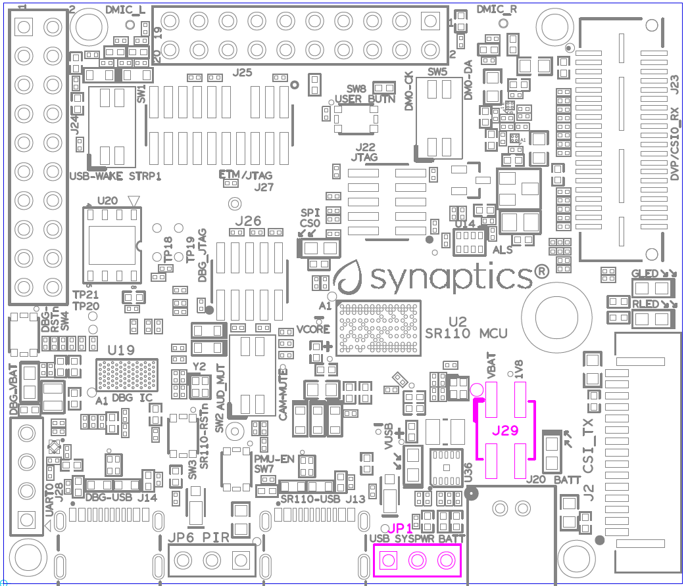
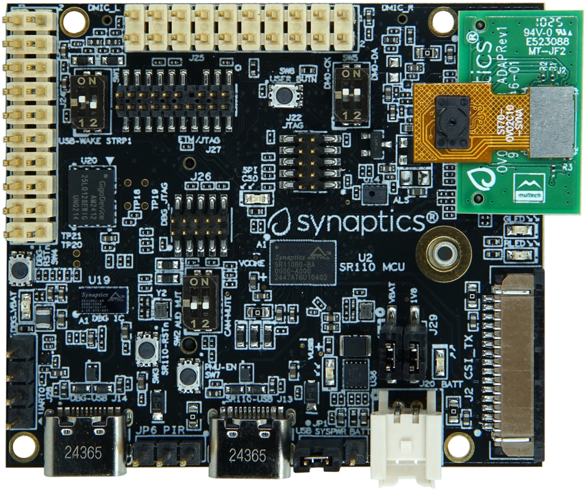
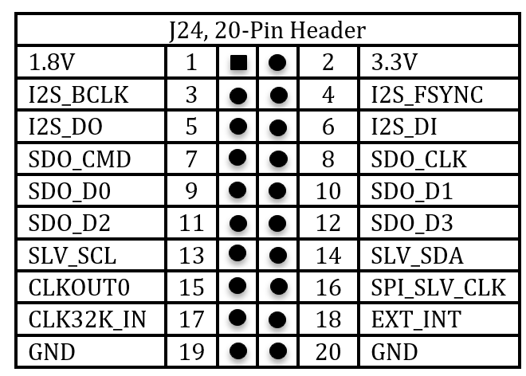
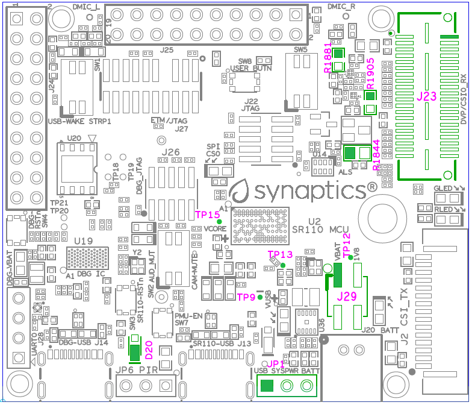

|image0|

| Astra™ Machina Micro SR100 Series Evaluation Platform Kit Rev C and
  later -
| User Guide

Astra Machina Micro SR110 Series Evaluation Platform Kit RevC
=============================================================

Introduction
------------

The Synaptics Astra™ SR100 Series of AI MCUs is designed to deliver
high-performance, AI-Native, multimodal compute to consumer, enterprise,
and industrial Internet of Things (IoT) workloads. Based on Arm®
Cortex®-M55 cores with Helium™ technology and Arm Ethos™-U55 neural
network processors (NPU), the MCUs feature multiple tiers of
operation—performance, efficiency, low-power (LP) sensing, and always-on
(AON)—that algorithmically deliver intelligence at every power level, to
enable a new class of context-aware IoT devices. The AI-Native SR100
Series supports a rich set of peripherals and accelerators, including
dual MIPI camera interfaces, image processing with encode and pre-roll,
motion and voice activity detection engines, and industry-standard
security. These features make it well-suited for streaming vision and
audio processing applications at the IoT device edge.

The SR100 Series is a high-performance, ultra-low power, and small
footprint Audio and Vision AI processor family.

Scope
-----

This user guide describes the hardware configuration and functional
details for the Astra Machina Micro SR100 Series Rev C and later
Evaluation Platform Kit, and supported daughter cards, along with the
bring-up sequence.

Definition of Board Components
------------------------------

-  **Astra Machina Micro SR100 Series**: Combined system with Micro
   Development Kit and supported daughter cards.

-  **Micro Evaluation Platform Kit:** Processor subsystem module with
   key components including SR110, QSPI, PSRAM and various standard
   hardware interfaces, buttons, headers, and power-in.

-  **Daughter card**: Add-on boards for supporting various features such
   as connectivity, debug, images sensors and other flexible I/O
   options.

Astra Machina Micro Evaluation Platform Overview
------------------------------------------------

This section covers system features, block diagrams, and board views of
the Astra Machina Micro SR100 Series platform.

|image1|

Figure 1. Dimensions: W x H = 59.55 mm x 51 mm

Features
~~~~~~~~

The Astra Machina Micro SR100 Series Evaluation Platform Kit includes
the following components:

-  Main components on Machina Micro:

-  Synaptics SR110 (122-FCCSP) Audio & Vision AI processor

-  Debug IC: Synaptics SR100 (84-WCCSP)

-  Storage: 128 Mbit QSPI NOR Flash

-  PSRAM: 64 Mbit HyperRAM\ :sup:`™` x8, 200 MHz

-  PMIC: Buck-Boost DC/DC for SR110 VBAT

-  Highly sensitive ambient light sensor: TCS34303

-  3-axis accelerometer: MC3479

-  M.2 E-key 2230 receptacle: Supports SDIO, UART, and PCM for Wi-Fi/BT
   modules

-  2 × USB 2.0 Type-C™ ports: One for SR110 Audio & Vision processor,
   other for Debug IC. Both provide system power.

-  Push buttons for system reset, wake-up, and user control

-  Slide switches for bootstraps, mute control, and power enable

-  Daughter card interface options:

-  2 × MIPI CSI-2® 2-lane RX interfaces (1.5 Gb/s max bandwidth): CSI0
   on Samtec™ connector (shared with DVP), CSI1 on 15-pin FPC connector

-  1 × MIPI CSI-2® TX interface (1.5 Gb/s max bandwidth) on 15-pin FPC
   connector

-  SWD JTAG

-  2 × 20-pin headers with GPIOs are for additional application

-  4-pin header for UART debugging

-  3-pin header for PIR

-  System power supply:

-  USB Type-C

-  2-pin, 2.0 mm pitch header for 1-cell Li-ion battery

-  3-pin header for system power source selection

SR110 System Block Diagram
~~~~~~~~~~~~~~~~~~~~~~~~~~

|image2|

Figure 2. SR110 system block diagram

Top View of Astra Machina Micro SR110
~~~~~~~~~~~~~~~~~~~~~~~~~~~~~~~~~~~~~

|image3|

Figure 3. Headers, Connectors, Chips (Top view)

|image4|

Figure 4. LEDs, Pushbuttons, Switches (Top view)

Bottom View of Astra Machina Micro SR110
~~~~~~~~~~~~~~~~~~~~~~~~~~~~~~~~~~~~~~~~

|image5|

Figure 5. Connectors, Chips (Bottom view)

Astra Machina Board Control/Status & System I/O
===============================================

This section covers boot-up procedures, LED status indicators, buttons,
connectors, and pin-strap settings.

Bootup Mode
-----------

The Astra Machina Micro SR110 supports two bootup modes. **ROM mode**,
SR110 receives program code from external host over host interface
(UART, I2C Slave, SPI Slave), and **normal application mode**, which
boots directly from the onboard QSPI flash.

-  **ROM mode:** Set **STRAP1** to **High** by closing switch of
   SW1-2,3. Then, power up the system and press the **PMU_EN** button,
   SW7 if SW1-1,4 is open position. Otherwise, pressing SW7 is not
   required.

-  **Normal mode:** Set **STRAP1** to **Low**, then power up the system
   and press the **PMU_EN** button, SW7 if SW1-1,4 is open position.
   Otherwise, pressing SW7 is not required.

The strap settings are listed in Table 1.

Table 1. SM pin-strap and boot-up settings on the board

+----------+------------+--------------+--------------+--------------+
| Pad Name | Strap Name | Setting      | Resistor     | Description  |
|          |            | Value        | Stuffing     |              |
|          |            |              |              | Rpu = OnChip |
|          |            |              | + stuffed    | Pull-up      |
|          |            |              |              |              |
|          |            |              | - removed    | Rpd = OnChip |
|          |            |              |              | Pull-down    |
+==========+============+==============+==============+==============+
| I2S_DO   | STRAP0     | —            | —            | Straps for   |
|          |            |              |              | PLL          |
|          |            |              |              | frequency    |
|          |            |              |              | (If          |
|          |            |              |              | TEST_N=1)    |
+----------+------------+--------------+--------------+--------------+
|          |            | 0\*          | -R5          | 0: 200 MHz   |
+----------+------------+--------------+--------------+--------------+
|          |            | 1            | +R5          | 1: 24 MHz    |
+----------+------------+--------------+--------------+--------------+
| SD0_CLK  | STRAP1     | —            | —            | Straps for   |
|          |            |              |              | booting up   |
|          |            |              |              | mode (If     |
|          |            |              |              | TEST_N=1)    |
+----------+------------+--------------+--------------+--------------+
|          |            | 0\*          | SW1, pin2    | 0: boot from |
|          |            |              | OFF          | QSPI         |
+----------+------------+--------------+--------------+--------------+
|          |            | 1            | SW1, pin2 ON | 1: boot from |
|          |            |              |              | external     |
|          |            |              |              | host         |
+----------+------------+--------------+--------------+--------------+

-  Indicates the default value.

LEDs
----

LED locations
~~~~~~~~~~~~~

Figure 6 shows the LED locations on Astra Machina Micro.

|A white circuit board with green and blue symbols AI-generated content
may be incorrect.|

Figure 6. LED locations (Top View)

LED definitions
~~~~~~~~~~~~~~~

Table 2. LED definitions on the board

+-----+-------+------------------------------------------------------+
| LED | Color | LED Functions                                        |
+=====+=======+======================================================+
| D1  | RED   | User definable Red LED.                              |
+-----+-------+------------------------------------------------------+
| D2  | Green | User definable Green LED.                            |
+-----+-------+------------------------------------------------------+
| D30 | BLUE  | light up when main SR110\_USB and whole system are   |
|     |       | both powered.                                        |
+-----+-------+------------------------------------------------------+
| D31 | Green | light up when Li-ion battery is plugged-in and whole |
|     |       | system are both powered.                             |
+-----+-------+------------------------------------------------------+
| D32 | RED   | light up when Debug IC USB is powered.               |
+-----+-------+------------------------------------------------------+
| D33 | Green | Flash during QSPI (SPI\_CS0) access.                 |
+-----+-------+------------------------------------------------------+

Hardware Manual Button Settings
-------------------------------

Table 3. Hardware push button settings definitions on the board

+------------------+------------------+---------+------------------+
| Switch Block     | Type             | Setting | Function         |
+==================+==================+=========+==================+
| SW3 (RESET       | Momentary        | Push    | Main SR110 Reset |
| SR110)           | Push-button      |         | Key asserted     |
+------------------+------------------+---------+------------------+
|                  |                  | Release | Key de-asserted  |
+------------------+------------------+---------+------------------+
| SW4 (RESET Debug | Momentary        | Push    | Debug IC Reset   |
| IC)              | Push-button      |         | Key asserted     |
+------------------+------------------+---------+------------------+
|                  |                  | Release | Key de-asserted  |
+------------------+------------------+---------+------------------+
| SW7 (PMU_EN)     | Momentary        | Push    | Enable main      |
|                  | Push-button      |         | SR110            |
+------------------+------------------+---------+------------------+
|                  |                  | Release | Key de-asserted  |
+------------------+------------------+---------+------------------+
| SW8 (User        | Momentary        | Push    | User push button |
| Button)          | Push-button      |         | (active low)     |
+------------------+------------------+---------+------------------+
|                  |                  | Release | Key de-asserted  |
+------------------+------------------+---------+------------------+

|A white circuit board with red symbols AI-generated content may be
incorrect.|

Figure 7. Locations of push buttons on Machina Micro board

Hardware Manual Slide Switch Settings
-------------------------------------

Table 4. Hardware manual slide switch settings definitions on Machina
Micro board

+--------------+-------+---------------------+---------------------+
| Switch Block | Pin # | Function            | Description         |
+==============+=======+=====================+=====================+
| SW1          | 1     | USB wake up main    | OFF: Disconnect USB |
|              |       | SR110               | PWR to PMU_EN       |
|              |       |                     | (Default)           |
|              |       |                     |                     |
|              |       |                     | ON: Enable USB PWR  |
|              |       |                     | to PMU_EN           |
+--------------+-------+---------------------+---------------------+
|              | 2     | Main SR110 STRAP1   | OFF: Boot from QSPI |
|              |       |                     | (Default)           |
|              |       |                     |                     |
|              |       |                     | ON: Boot from       |
|              |       |                     | external Host       |
+--------------+-------+---------------------+---------------------+
| SW2          | 1     | Camera Mute         | OFF: De-mute Camera |
|              |       |                     | (Default)           |
|              |       |                     |                     |
|              |       |                     | ON: Mute Camera     |
+--------------+-------+---------------------+---------------------+
|              | 2     | Audio Mute          | OFF: De-mute Audio  |
|              |       |                     | (Default)           |
|              |       |                     |                     |
|              |       |                     | ON: Mute Audio      |
+--------------+-------+---------------------+---------------------+
| SW5          | 1     | DMIC Data           | OFF: Cut-off DMIC   |
|              |       |                     | data from MCU       |
|              |       |                     | (Default)           |
|              |       |                     |                     |
|              |       |                     | ON: Link up DMIC    |
|              |       |                     | data with MCU       |
+--------------+-------+---------------------+---------------------+
|              | 2     | DMIC Clock          | OFF: Cut-off DMIC   |
|              |       |                     | clock from MCU      |
|              |       |                     | (Default)           |
|              |       |                     |                     |
|              |       |                     | ON: Link up DMIC    |
|              |       |                     | clock with MCU      |
+--------------+-------+---------------------+---------------------+

|A white circuit board with green squares AI-generated content may be
incorrect.|

Figure 8. Slide switch locations on Machina Micro board

Hardware Jumper Settings
------------------------

This section outlines the board’s hardware jumper settings.

Table 5. Hardware jumper settings definitions on the board

+---------+--------------+--------------+--------------+--------------+
| Ref Des | Type         | Function     | C            | Description  |
|         |              |              | onfiguration |              |
+=========+==============+==============+==============+==============+
| JP1     | 3x1, pitch   | System power | 1-2          | System power |
|         | 2.54mm       | source       |              | is from USB  |
|         | header       | selection    |              | Connector.   |
|         |              |              |              | (Default)    |
+---------+--------------+--------------+--------------+--------------+
|         |              |              | 2-3          | System power |
|         |              |              |              | is from      |
|         |              |              |              | Battery.     |
+---------+--------------+--------------+--------------+--------------+
| J29     | 2x2, pitch   | Power source | 1-2          | Supply power |
|         | 2.54mm       | Jumpers      |              | to SR110     |
|         | header       |              |              | VBAT         |
|         |              |              |              | (Default)    |
+---------+--------------+--------------+--------------+--------------+
|         |              |              | 3-4          | Supply       |
|         |              |              |              | Internal     |
|         |              |              |              | 1.8V LDO to  |
|         |              |              |              | source SR110 |
|         |              |              |              | 1V8 supply   |
|         |              |              |              | rail         |
|         |              |              |              | (Default)    |
+---------+--------------+--------------+--------------+--------------+

Figure 9 shows the Header locations on the board.

|A white circuit board with black text AI-generated content may be
incorrect.|

Figure 9. Jumper Locations (Top View)

SR110 Machina Micro Platform Connectors
---------------------------------------

This section shows the connector locations on the board.

Connector locations on the Top Side
~~~~~~~~~~~~~~~~~~~~~~~~~~~~~~~~~~~

|A white circuit board with blue lines and red text AI-generated content
may be incorrect.|

Figure 10. Connector Locations (Top Side)

Connector Locations on the Bottom Side
~~~~~~~~~~~~~~~~~~~~~~~~~~~~~~~~~~~~~~

|A white circuit board with blue lines AI-generated content may be
incorrect.|

Figure 11. Connector Locations (Bottom Side)

Connector Definitions – Astra Machina Micro Platform
~~~~~~~~~~~~~~~~~~~~~~~~~~~~~~~~~~~~~~~~~~~~~~~~~~~~

Table 6. Connector definitions

+----------+------------------+------------------+------------------+
| Main     | Connecting       | Function         | Remarks          |
|          | Boards/Devices   |                  |                  |
| Ref Des  | (Ref Des if any) |                  |                  |
+==========+==================+==================+==================+
| J2       | CSI receiver     | CSI output       | 2 lane CSI       |
|          | module           |                  | output to FCC    |
|          |                  |                  | connector.       |
+----------+------------------+------------------+------------------+
| J4       | M.2 2230 D/C     | SDIO, PCM and    | 1x1/2x2          |
|          |                  | UART             | WiFi/Bluetooth   |
|          |                  |                  | card via SDIO    |
|          |                  |                  | and UART/PCM.    |
+----------+------------------+------------------+------------------+
| JP6      | PIR module       | PIR              | For PIR input    |
|          |                  |                  | trigger.         |
+----------+------------------+------------------+------------------+
| J13      | USB type-C Host  | USB2.0 device,   | Main SR110       |
|          |                  | 5V power supply  | USB2.0 device    |
|          |                  |                  | mode and system  |
|          |                  |                  | 5V input.        |
+----------+------------------+------------------+------------------+
| J14      | USB type-C Host  | USB2.0 device,   | Debug IC USB2.0  |
|          |                  | 5V power supply  | device mode and  |
|          |                  | and Debug Port   | system 5V input. |
+----------+------------------+------------------+------------------+
| J20      | Li-ion Battery   | Battery power    | Pitch 2.0mm      |
|          |                  |                  | header for 1     |
|          |                  |                  | cell Li-ion      |
|          |                  |                  | Battery.         |
+----------+------------------+------------------+------------------+
| J21      | Camera module    | CSI1_RX          | Raspberry-pi     |
|          |                  |                  | compatible       |
|          |                  |                  | 2-lanes CSI      |
|          |                  |                  | input.           |
+----------+------------------+------------------+------------------+
| J22      | Off board        | SWD JTAG         | Connector for    |
|          | debugger connect |                  | off board        |
|          |                  |                  | debugger such as |
|          |                  |                  | JLink for SR110  |
+----------+------------------+------------------+------------------+
| J23      | Camera modules   | CSI0_RX and DVP  | 2-lanes CSI      |
|          |                  |                  | input and 8bit   |
|          |                  |                  | DVP input        |
+----------+------------------+------------------+------------------+
| J24, J25 | 20 pin headers   | General-purpose  | I2S, I2C, SPI,   |
|          |                  | I/O pins         | SDIO, UART,      |
|          |                  | interface        | GPIOs, SPI, CIU, |
|          |                  |                  | SWIRE            |
+----------+------------------+------------------+------------------+
| J26      | Off board        | SWD JTAG         | Connector for    |
|          | debugger connect |                  | off board        |
|          |                  |                  | debugger such as |
|          |                  |                  | Jlink for Debug  |
|          |                  |                  | IC.              |
+----------+------------------+------------------+------------------+
| J27      | Off board Trace  | SR110 debug +    | JTAG and         |
|          | Module           | ETM              | Embedded Trace   |
|          |                  |                  | Macrocell (ETM)  |
|          |                  |                  | TRACECLK and     |
|          |                  |                  | TRACEDATA(n)     |
|          |                  |                  | signals.         |
+----------+------------------+------------------+------------------+
| J28      | UART             | UART0            | Shared UART0     |
|          |                  |                  | from main SR110  |
|          |                  |                  | MCU and Debug    |
|          |                  |                  | IC.              |
+----------+------------------+------------------+------------------+
| J29      | Power Sources    | Power Source     | Apply 3.3V to    |
|          |                  | Jumpers          | VBAT and use     |
|          |                  |                  | internal 1.8V    |
|          |                  |                  | LDO to supply    |
|          |                  |                  | 1.8V input rail  |
|          |                  |                  | of the SR110     |
+----------+------------------+------------------+------------------+

Stuffing Options for SR110 Machina Micro Platform Power Measurement
-------------------------------------------------------------------

There are 0-ohm serial resisters on power rails that can be replaced
with power meter for power measurement.

For power rail details, see Table 7. Check the corresponding power
consumption, see Figure 12 and Figure 13 for the probe position.

Table 7. Stuffing options for power rails.

+----------------+----------------+----------------+----------------+
| Power Rail     | Description    | Stuffing       | Implementation |
| Name           |                | Option         |                |
+================+================+================+================+
| VBAT           | 3.3V power for | JP29 #1-2      | Replace jumper |
|                | SR110\_VBAT.   |                | with power     |
|                |                |                | meter          |
+----------------+----------------+----------------+----------------+
| 1.8V Supply    | Internal 1.8V  | JP29 #3-4      | Replace jumper |
| Rail           | LDO to supply  |                | with power     |
|                | 1.8V input     |                | meter          |
|                | rail of the    |                |                |
|                | SR110          |                |                |
+----------------+----------------+----------------+----------------+
| SR110\_VDDIO1P8| 1.8V power     | R6             | Replace R6     |
|                | that SR110     |                | with power     |
|                | VDDIO needs.   |                | meter.         |
+----------------+----------------+----------------+----------------+
| VDD_CORE       | 0.8V power     | R8             | Replace R8     |
|                | that SR110     |                | with power     |
|                | Core needs.    |                | meter.         |
+----------------+----------------+----------------+----------------+
| V_DMIC         | 1.8V power     | R1950          | Replace R1950  |
|                | that DMICs     |                | with power     |
|                | need           |                | meter.         |
+----------------+----------------+----------------+----------------+
| VDDA           | Analog power   | R9             | Replace R9     |
|                | that SR110     |                | with power     |
|                | needs.         |                | meter.         |
+----------------+----------------+----------------+----------------+
| SYS_3V3_DVP    | 3.3V power     | R1904          | Replace R1904  |
|                | supply to      |                | with power     |
|                | Camera module  |                | meter.         |
|                | on J23.        |                |                |
+----------------+----------------+----------------+----------------+
| SYS_1V8_CSI\_  | 1.8V power     | R1907          | Replace R1907  |
| OUT            | supply to CSI  |                | with power     |
|                | transmitter on |                | meter.         |
|                | J2.            |                |                |
+----------------+----------------+----------------+----------------+
| SYS_3V3_CSI1   | 3.3V power     | R1906          | Replace R1906  |
|                | supply to      |                | with power     |
|                | Camera module  |                | meter.         |
|                | on J21.        |                |                |
+----------------+----------------+----------------+----------------+
| PWR_M2-KEYE\_  | System power   | R1852          | Replace R1852  |
| 3V3            | (4.8V~2.8V)    |                | with power     |
|                | supply to WiFi |                | meter.         |
|                | module on J4   |                |                |
+----------------+----------------+----------------+----------------+
| SYS_1V8_JTAG   | 1.8V power     | R1861          | Replace R1861  |
|                | supply to JTAG |                | with power     |
|                | debug.         |                | meter.         |
+----------------+----------------+----------------+----------------+
| DBG_SYS_1V8    | 1.8V power     | R177           | Replace R177   |
|                | that Debug IC  |                | with power     |
|                | sus-system     |                | meter.         |
|                | needs.         |                |                |
+----------------+----------------+----------------+----------------+
| SYS_PWR_SRC    | Total power    | JP1 #1-2       | If system      |
|                | (4.8V~2.8V)    |                | power comes    |
|                | that main      |                | from USB,      |
|                | SR110 system   |                | attach two     |
|                | needs.         |                | probes of      |
|                |                |                | power meter to |
|                |                |                | JP1#1 and #2.  |
+----------------+----------------+----------------+----------------+
|                |                | JP1 #2-3       | If system      |
|                |                |                | power comes    |
|                |                |                | from Battery,  |
|                |                |                | attach two     |
|                |                |                | probes of      |
|                |                |                | power meter to |
|                |                |                | JP1#2 and #3.  |
+----------------+----------------+----------------+----------------+
| SR110\_VDDH_USB| 1.8V power for | R1858          | Replace R1858  |
|                | SR110 USB      |                | with power     |
|                |                |                | meter          |
+----------------+----------------+----------------+----------------+
| QSPI\_1V8      | 1.8V power for | R1947          | Replace R1947  |
|                | QSPI           |                | with power     |
|                |                |                | meter          |
+----------------+----------------+----------------+----------------+
| PWR_M2-KEYE\_  | 1.8V VIO Power | R1975          | Replace R1975  |
| VIO            | to M2          |                | with power     |
|                |                |                | meter.         |
+----------------+----------------+----------------+----------------+

|A white circuit board with red and blue symbols AI-generated content
may be incorrect.|

Figure 12. Probe points (Top side)

|A white circuit board with red squares AI-generated content may be
incorrect.|

Figure 13. Probe points (Bottom side)

Daughter Cards
==============

A set of daughter cards supplements (not included) the Astra Machina
system with a range of extensible and configurable functionalities
including Wi-Fi and Bluetooth connectivity, debug options and general
purpose I/O. Details of currently supported daughter cards are described
in this section.

Debug Board 
-----------

Different kinds of debug interfaces are routed out for users to
communicate with the SR110 system. The 20-pin SR110 debug + ETM header,
J27 can be used to access the Embedded Trace Macrocell (ETM) TRACECLK
and TRACEDATA(n) signals. The four TRACEDATA signals provide a
high-speed data path for capturing instructions.

J22, 10-pin SWD JTAG header, allows connection to a 10-pin ARM debug
connector for the debugging application SR110.

Users may communicate with SR110 over UART on a PC host by using a UART
to USB cable commonly available. For a list of qualified parts, see the
Astra Machina webpage.

https://synacsm.atlassian.net/jira/servicedesk/projects/CASE/knowledge/articles/39780364?spaceKey=ASDKB

| As an option, the debug board also provides such bridging function
  based on the Silicon Labs CP2102. A virtual COM port driver is
  required, and can be downloaded from the following link and installed
  on the host PC:
| https://www.silabs.com/products/development-tools/software/usb-to-uart-bridge-vcp-drivers

UART on the Machina Micro board and the PC host USB are digitally
isolated, with no direct conductive path, eliminating ground loop and
back-drive issues when either is powered down.

USB device port is also available for PC host to communicate directly
though type-C to type-A cable.

Figure 14 shows debug board connectivity facilitating UART and JTAG
communications.

#. UART to USB adaptors/modules mentioned in the Knowledge base support
   only TTL 3.3V UART signals. UART signals of SR110 Machina Micro
   Platform are 1.8V CMOS. CP2102 and CH340G are not compatible with
   SR110 Machina Micro.

|image14|

Figure 14. Debug board connectivity for UART and JTAG

Onboard Debug and Programming Interface via Debug IC, SR100 (SWD + UART)
------------------------------------------------------------------------

The **Astra Machina Micro platform** incorporates a flexible and robust
debug architecture that offers an onboard option to program and debug
the **SR110 SoC** using **Serial Wire Debug (SWD)**. This is achieved
through the inclusion of a dedicated debug IC, specifically the
**SR100**, which serves as a bridge between external PCs and the SR110.
The SR100 acts as a USB to SWD bridge, with the PC connected over USB,
and the SR110 connected via SWD. This emulates the behavior of widely
used debug probes such as the **SEGGER J-Link**. 

By leveraging this built-in debugging path, the system enables seamless
access to the SR110’s core and peripheral registers for firmware
development, bring-up, and system-level debugging—without the need for
external debug hardware connections directly to the SoC. 

In addition to acting as a USB to SWD bridge the debug SR100 also acts
as a USB to UART bridge. The firmware on the SR100 uses the USB CDC
class to emulate two com ports. After connecting a PC to the debug SR100
USB (J14), two com ports enumerate on the PC. The first com port is for
UART0, and the second for UART1. 

UART0 can be used to program the SR110 when STRAP1 is set to ROM mode.
When STRAP1 is not in ROM mode UART0 can also be used to communicate
with the Host API running on SR110, if the FW configures UART0 for the
Host API communication interface.  UART1 can be used to capture logs
from the SR110. 

|image15|

Figure 15. DAP Block Diagram

Table 8. Serial Wire Debug (TCK/TMS) Signal Paths: Debug IC ↔ SR110

==== ================= ====== ==========
SWD  Debug IC          SR110  J22 Header
==== ================= ====== ==========
TCK  U19-H12 (GPIO[6]) U2-C17 J22-4
TMS  U19-K12 (GPIO[7]) U2-B18 J22-2
RSTn U19-H6 (GPIO[27]) U2-J1  —
==== ================= ====== ==========

M.2 Card
--------

An M.2 E-Key socket J4 is provided for a variety of modules in the M.2
form factor. Typical applicable modules support Wi-Fi/BT devices with
SDIO interfaces.

Available module:

-  Ampak AP12611_M2P with SYN43711 1x1 WiFi6E/BT5.3 1x1 over SDIO on M.2
   adaptor (not included).

|image16|

Figure 16. WiFi module plugged in M.2 slot

Camera Module
-------------

Two camera interfaces DVP and CSI0 (not included) are both routed out to
J23, that allowed developer to switch their own camera module which has
the matched pin sequence. Machina Micro Evaluation Platform can do
person detection with the default attached camera module OV02C10, which
is mounted on the platform through a small Samtec daughter card. Please
take care about the connecter pin definition between module and daughter
card, daughter card pin #24 should connect to module’s pin #12, instead
of pin #1 to pin #1.

|image17|

Figure 17. Camera daughter card with module OV02C10 on Machina Micro
board

|A close-up of a green circuit board Description automatically
generated|

Figure 18. Connector between Camera daughter card and module OV02C10

General Purpose 20-pin Header
-----------------------------

Two general-purpose **20-pin GPIO headers** with a **0.1-inch (2.54 mm)
pin pitch** are located on the **left** and **top** edges of the Machina
Micro board. All general-purpose I/O pins operate at **1.8V** and can be
configured in software to support a variety of **alternate functions**.

For detailed configuration options, refer to the *SR100 Series
Datasheet*.

|A table with black dots and numbers AI-generated content may be
incorrect.|

Figure 19. General Purpose J24, 20-Pin Header with Signal Mapping

|A table with black dots AI-generated content may be incorrect.|

Figure 20. General Purpose J25, 20-Pin Header with Signal Mapping

Pin Demuxing for Standard Interface Configuration
-------------------------------------------------

This section covers pin-demuxing configuration for the Machina Micro
SR110 board.

Table 9. Pin Multiplexer Modes

+----------+----------+----------+----------+----------+----------+
| Ball     | NetNames | R        | Function | Pin      | Notes    |
| Name     |          | eference |          | Mul      |          |
|          |          | Des      |          | tiplexer |          |
|          |          | tination |          | Mode\*   |          |
+==========+==========+==========+==========+==========+==========+
|          |          |          |          |          |          |
+----------+----------+----------+----------+----------+----------+
| AU       | SR110\_AU| SW2-1,4  | Audio    | ALT 0    | Mute     |
| DIO_MUTE | DIO_MUTE |          | Mute     | (GPIO);  |          |
|          |          |          |          | Any      |          |
+----------+----------+----------+----------+----------+----------+
| CAM      | SR110\_  | SW2-2,3  | Camera   | ALT 0    |          |
| ERA_MUTE | CAMERA\_ |          | Mute     | (GPIO);  |          |
|          | MUTE     |          |          | Any      |          |
+----------+----------+----------+----------+----------+----------+
| CIU_D3   | SR110\_  | J23-31   | DVP      | ALT 1    | —        |
|          | GPIO10.  |          | Co       |          |          |
|          | CIU_D3   |          | nnector, |          |          |
|          |          |          | D3       |          |          |
+----------+----------+----------+----------+----------+----------+
|          |          | J25-2    | 20 Pin   | ALT 0    | —        |
|          |          |          | Header   | (GPIO);  |          |
|          |          |          |          | Any      |          |
+----------+----------+----------+----------+----------+----------+
| CIU_D6   | SR110    | J23-17   | DVP      | ALT 1    | Cannot   |
|          | _GPIO13. |          | Co       |          | simult   |
|          | CIU_D6.D |          | nnector, |          | aneously |
|          | M0_CLK_B |          | D6       |          | operate  |
|          |          |          |          |          | DVP,     |
|          |          |          |          |          | DMIC,    |
|          |          |          |          |          | and      |
|          |          |          |          |          | UART1    |
|          |          |          |          |          | Logger.  |
|          |          |          |          |          | Only one |
|          |          |          |          |          | can run  |
|          |          |          |          |          | at a     |
|          |          |          |          |          | time     |
+----------+----------+----------+----------+----------+----------+
|          |          | SW5-1,4  | Connect  | ALT 2    |          |
|          |          |          | DMIC CLK |          |          |
+----------+----------+----------+----------+----------+----------+
|          |          | J25-17   | 20 Pin   | ALT 0    |          |
|          |          |          | Header   | (GPIO);  |          |
|          |          |          |          | Any      |          |
+----------+----------+----------+----------+----------+----------+
|          |          | U19-H8   | Logger   | ALT 3    |          |
|          |          |          | UART TX  |          |          |
|          |          |          | to Debug |          |          |
|          |          |          | IC       |          |          |
+----------+----------+----------+----------+----------+----------+
| CIU_D7   | SR110\_  | J23-15   | DVP      | ALT 1    | Cannot   |
|          | GPIO14.C |          | Co       |          | simult   |
|          | IU_D7.DM |          | nnector, |          | aneously |
|          | 0_DATA_B |          | D7       |          | operate  |
|          |          |          |          |          | DVP,     |
|          |          |          |          |          | DMIC,    |
|          |          |          |          |          | and      |
|          |          |          |          |          | UART1    |
|          |          |          |          |          | Logger.  |
|          |          |          |          |          | Only one |
|          |          |          |          |          | can run  |
|          |          |          |          |          | at a     |
|          |          |          |          |          | time     |
+----------+----------+----------+----------+----------+----------+
|          |          | SW5-2,3  | Connect  | ALT 2    |          |
|          |          |          | DMIC     |          |          |
|          |          |          | DATA     |          |          |
+----------+----------+----------+----------+----------+----------+
|          |          | JP25-18  | 20 Pin   | ALT 0    |          |
|          |          |          | Header   | (GPIO);  |          |
|          |          |          |          | Any      |          |
+----------+----------+----------+----------+----------+----------+
|          |          | U19-G9   | Logger   | ALT 3    |          |
|          |          |          | UART RX  |          |          |
|          |          |          | to Debug |          |          |
|          |          |          | IC       |          |          |
+----------+----------+----------+----------+----------+----------+
| C        | SR110\_G | J23-35   | DVP      | ALT 1    | Cannot   |
| IU_VSYNC | PIO4.CIU |          | Co       |          | simult   |
|          | _VSYNC_A |          | nnector, |          | aneously |
|          |          |          | VSYNC    |          | operate  |
|          |          |          |          |          | DVP and  |
|          |          |          |          |          | M.2 UART |
|          |          |          |          |          | (BT/BLE) |
+----------+----------+----------+----------+----------+----------+
|          |          | J25-5    | 20 Pin   | ALT 0    |          |
|          |          |          | Header   | (GPIO);  |          |
|          |          |          |          | Any      |          |
+----------+----------+----------+----------+----------+----------+
|          |          | J4-34    | M.2      | ALT 3    |          |
|          |          |          | UART_CTS |          |          |
|          |          |          | (BT/BLE) |          |          |
+----------+----------+----------+----------+----------+----------+
|          |          | J23-40   | DVP      | ALT 1    | Not      |
|          |          |          | Co       |          | p        |
|          |          |          | nnector, |          | opulated |
|          |          |          | VSYNC    |          | by       |
|          |          |          |          |          | default  |
+----------+----------+----------+----------+----------+----------+
| C        | SR110    | J24-17   | 20 Pin   | ALT 0    | —        |
| LK32K_IN | _GPIO40. |          | Header   | (GPIO);  |          |
|          | CLK32KIN |          |          | Any      |          |
+----------+----------+----------+----------+----------+----------+
| CLKOUT0  | SR11     | J23-7    | DVP      | ALT 1    | —        |
|          | 0_GPIO41 |          | Co       |          |          |
|          | .CLKOUT0 |          | nnector, |          |          |
|          |          |          | Clock    |          |          |
+----------+----------+----------+----------+----------+----------+
|          |          | J24-15   | 20 Pin   | ALT 0    | —        |
|          |          |          | Header   | (GPIO);  |          |
|          |          |          |          | Any      |          |
+----------+----------+----------+----------+----------+----------+
| CS       | SR110\_CS| J2-8     | —        | —        | CSI_OUT  |
| I_OUT_CN | I_OUT_CN |          |          |          |          |
+----------+----------+----------+----------+----------+----------+
| CS       | SR110\_CS| J2-9     | —        | —        |          |
| I_OUT_CP | I_OUT_CP |          |          |          |          |
+----------+----------+----------+----------+----------+----------+
| CSI      | S        | J2-2     | —        | —        |          |
| _OUT_D0N | R110_CSI |          |          |          |          |
|          | _OUT_D0N |          |          |          |          |
+----------+----------+----------+----------+----------+----------+
| CSI      | S        | J2-3     | —        | —        |          |
| _OUT_D0P | R110_CSI |          |          |          |          |
|          | _OUT_D0P |          |          |          |          |
+----------+----------+----------+----------+----------+----------+
| CSI      | S        | J2-5     | —        | —        |          |
| _OUT_D1N | R110_CSI |          |          |          |          |
|          | _OUT_D1N |          |          |          |          |
+----------+----------+----------+----------+----------+----------+
| CSI      | S        | J2-6     | —        | —        |          |
| _OUT_D1P | R110_CSI |          |          |          |          |
|          | _OUT_D1P |          |          |          |          |
+----------+----------+----------+----------+----------+----------+
| CS       | SR110\_CS| J23-22   | —        | —        | CSI0_IN  |
| I0_IN_CN | I0_IN_CN |          |          |          |          |
+----------+----------+----------+----------+----------+----------+
| CS       | SR110\_CS| J23-20   | —        | —        |          |
| I0_IN_CP | I0_IN_CP |          |          |          |          |
+----------+----------+----------+----------+----------+----------+
| CSI      | S        | J23-16   | —        | —        |          |
| 0_IN_D0N | R110_CSI |          |          |          |          |
|          | 0_IN_D0N |          |          |          |          |
+----------+----------+----------+----------+----------+----------+
| CSI      | S        | J23-14   | —        | —        |          |
| 0_IN_D0P | R110_CSI |          |          |          |          |
|          | 0_IN_D0P |          |          |          |          |
+----------+----------+----------+----------+----------+----------+
| CSI      | S        | J23-28   | —        | —        |          |
| 0_IN_D1N | R110_CSI |          |          |          |          |
|          | 0_IN_D1N |          |          |          |          |
+----------+----------+----------+----------+----------+----------+
| CSI      | S        | J23-26   | —        | —        |          |
| 0_IN_D1P | R110_CSI |          |          |          |          |
|          | 0_IN_D1P |          |          |          |          |
+----------+----------+----------+----------+----------+----------+
| CS       | SR110\_CS| J21-8    | —        | —        | CSI1_IN  |
| I1_IN_CN | I1_IN_CN |          |          |          |          |
+----------+----------+----------+----------+----------+----------+
| CS       | SR110\_CS| J21-9    | —        | —        |          |
| I1_IN_CP | I1_IN_CP |          |          |          |          |
+----------+----------+----------+----------+----------+----------+
| CSI      | S        | J21-2    | —        | —        |          |
| 1_IN_D0N | R110_CSI |          |          |          |          |
|          | 1_IN_D0N |          |          |          |          |
+----------+----------+----------+----------+----------+----------+
| CSI      | S        | J21-3    | —        | —        |          |
| 1_IN_D0P | R110_CSI |          |          |          |          |
|          | 1_IN_D0P |          |          |          |          |
+----------+----------+----------+----------+----------+----------+
| CSI      | S        | J21-5    | —        | —        |          |
| 1_IN_D1N | R110_CSI |          |          |          |          |
|          | 1_IN_D1N |          |          |          |          |
+----------+----------+----------+----------+----------+----------+
| CSI      | S        | J21-6    | —        | —        |          |
| 1_IN_D1P | R110_CSI |          |          |          |          |
|          | 1_IN_D1P |          |          |          |          |
+----------+----------+----------+----------+----------+----------+
| GPIO5    | SR       | J25-5    | 20 Pin   | ALT 2    | Cannot   |
|          | 110_JTAG |          | Header   |          | simult   |
|          | _TRSTN_A |          |          |          | aneously |
|          | .CIU_HSY |          |          |          | operate  |
|          | NC.GPIO5 |          |          |          | DVP and  |
|          |          |          |          |          | M.2 UART |
|          |          |          |          |          | (BT/BLE) |
|          |          |          |          |          | Cannot   |
|          |          |          |          |          | run JTAG |
|          |          |          |          |          | with DVP |
|          |          |          |          |          | or       |
|          |          |          |          |          | M.2UART  |
+----------+----------+----------+----------+----------+----------+
|          |          | J23-37   | DVP      | ALT 1    |          |
|          |          |          | Co       |          |          |
|          |          |          | nnector, |          |          |
|          |          |          | HSYNC    |          |          |
+----------+----------+----------+----------+----------+----------+
|          |          | J4-36    | M.2      | ALT 3    |          |
|          |          |          | UART_RTS |          |          |
|          |          |          | (BT/BLE) |          |          |
+----------+----------+----------+----------+----------+----------+
|          |          | J22-10   | JTAG     | ATL 0    |          |
|          |          |          | TRST     |          |          |
+----------+----------+----------+----------+----------+----------+
|          |          |          | TRST     |          |          |
+----------+----------+----------+----------+----------+----------+
| GPIO6    | SR       | J25-7    | 20 Pin   | ALT 0    |  —       |
|          | 110_GPIO |          | Header   | (GPIO);  |          |
|          | 6.CIU_BC |          |          | Any      |          |
|          | LK.SPI\_S|          |          |          |          |
|          | LV_CLK_B |          |          |          |          |
+----------+----------+----------+----------+----------+----------+
|          |          | J23-38   | DVP      | ALT 1    |  —       |
|          |          |          | Co       |          |          |
|          |          |          | nnector, |          |          |
|          |          |          | BCLK     |          |          |
+----------+----------+----------+----------+----------+----------+
|          |          | J23-14   | OV2C\_   | ALT2     | Not      |
|          |          |          | D0p/SCLK |          | p        |
|          |          |          |          |          | opulated |
|          |          |          |          |          | by       |
|          |          |          |          |          | default  |
+----------+----------+----------+----------+----------+----------+
| GPIO7    | S        | J25-10   | 20 Pin   | ALT 0    |  —       |
|          | R110_GPI |          | Header   | (GPIO);  |          |
|          | O7.CIU_D |          |          | Any      |          |
|          | 0.SPI\_SL|          |          |          |          |
|          | V_MOSI_B |          |          |          |          |
+----------+----------+----------+----------+----------+----------+
|          |          | J23-39   | DVP      | ALT 1    |  —       |
|          |          |          | Co       |          |          |
|          |          |          | nnector, |          |          |
|          |          |          | D0       |          |          |
+----------+----------+----------+----------+----------+----------+
|          |          | J23-16   | OV2C\_   | ALT 2    | Not      |
|          |          |          | D0n/SDAT |          | p        |
|          |          |          |          |          | opulated |
|          |          |          |          |          | by       |
|          |          |          |          |          | default  |
+----------+----------+----------+----------+----------+----------+
| GPIO8    | SR       | J23-40   | DVP      | ALT 1    | DVP      |
|          | 110_JTAG |          | Co       |          | cannot   |
|          | _TDI_A.C |          | nnector, |          | run      |
|          | IU_D1.GP |          | D1       |          | while    |
|          | IO8\.SPI\|          |          |          | JTAG is  |
|          | SLV_CS_B |          |          |          | active   |
+----------+----------+----------+----------+----------+----------+
|          |          | J25-8    | 20 Pin   | ALT 2    |          |
|          |          |          | Header   |          |          |
+----------+----------+----------+----------+----------+----------+
|          |          | J22-10   | JTAG_TDI | ALT 0    |          |
|          |          |          |          | (GPIO);  |          |
|          |          |          |          | Any      |          |
+----------+----------+----------+----------+----------+----------+
| GPIO9    | SR11     | J23-33   | DVP      | ALT 1    | DVP      |
|          | 0_JTAG_T |          | Co       |          | cannot   |
|          | DO_A.CIU |          | nnector, |          | run      |
|          | _D2.GPIO |          | D2       |          | while    |
|          | 9.SPI\_SL|          |          |          | JTAG is  |
|          | V_MISO_B |          |          |          | active   |
+----------+----------+----------+----------+----------+----------+
|          |          | J22-6    | JTAG_TDO | ALT 0    |          |
+----------+----------+----------+----------+----------+----------+
|          |          | J25-9    | 20 Pin   | ALT 2    |          |
|          |          |          | Header   | (GPIO);  |          |
|          |          |          |          | Any      |          |
+----------+----------+----------+----------+----------+----------+
| I2C      | SR1      | J2-14    | I2C      | ALT 1    | M.2 UART |
| _SLV_SCL | 10_GPIO4 |          | Slave    |          | and RPI  |
| I2C      | 5.I2C_PM |          | over RPI |          | C        |
| _PMU_SCL | U_SCL.UA |          | c        |          | onnector |
| I3C      | RT0_TX_C |          | onnector |          | I2C      |
| _SLV_SCL |          |          |          |          | Slave    |
|          |          |          |          |          | cannot   |
|          |          |          |          |          | operate  |
|          |          |          |          |          | simult   |
|          |          |          |          |          | aneously |
+----------+----------+----------+----------+----------+----------+
|          |          | J4-32    | M.2 UART | ALT 2    |          |
|          |          |          | RX       |          |          |
|          |          |          | (BT/BLE) |          |          |
+----------+----------+----------+----------+----------+----------+
|          |          | J24-13   | 20 Pin   | ALT 0    |          |
|          |          |          | Header   | (GPIO);  |          |
|          |          |          |          | Any      |          |
+----------+----------+----------+----------+----------+----------+
| I2C      | SR1      | J2-15    | I2C      | ALT 1    | M.2 UART |
| _SLV_SDA | 10_GPIO4 |          | Slave    |          | and RPI  |
| I2C      | 4.I2C_PM |          | over RPI |          | C        |
| _PMU_SCL | U_SDA.UA |          | c        |          | onnector |
| I3C      | RT0_RX_C |          | onnector |          | I2C      |
| _SLV_SCL |          |          |          |          | Slave    |
|          |          |          |          |          | cannot   |
|          |          |          |          |          | operate  |
|          |          |          |          |          | simult   |
|          |          |          |          |          | aneously |
+----------+----------+----------+----------+----------+----------+
|          |          | J4-22    | M.2 UART | ALT 2    |          |
|          |          |          | RX       |          |          |
|          |          |          | (BT/BLE) |          |          |
+----------+----------+----------+----------+----------+----------+
|          |          | J24-14   | 20 Pin   | ALT 0    |          |
|          |          |          | Header   | (GPIO);  |          |
|          |          |          |          | Any      |          |
+----------+----------+----------+----------+----------+----------+
| I2S_BCLK | SR110    | J27-20   | Trace    | ALT 2    | I2S and  |
|          | _GPIO17. |          | Data     |          | Trace    |
|          | I2S_BCLK |          |          |          | cannot   |
|          |          |          |          |          | operate  |
|          |          |          |          |          | simult   |
|          |          |          |          |          | aneously |
+----------+----------+----------+----------+----------+----------+
|          |          | J4-8     | I2S to   | ALT 1    |          |
|          |          |          | M.2      |          |          |
+----------+----------+----------+----------+----------+----------+
|          |          | J24-3    | 20 Pin   | ALT 0    |          |
|          |          |          | Header   | (GPIO);  |          |
|          |          |          |          | Any      |          |
+----------+----------+----------+----------+----------+----------+
| I2S_DI   | SR1      | J4-14    | I2S to   | ALT 1    | I2S and  |
|          | 10_GPIO2 |          | M.2      |          | Trace    |
|          | 0.I2S_DI |          |          |          | cannot   |
|          |          |          |          |          | operate  |
|          |          |          |          |          | simult   |
|          |          |          |          |          | aneously |
+----------+----------+----------+----------+----------+----------+
|          |          | J27-14   | Trace    | ALT 2    |          |
|          |          |          | Data     |          |          |
+----------+----------+----------+----------+----------+----------+
|          |          | J24-24   | 20 Pin   | ALT 0    |          |
|          |          |          | Header   | (GPIO);  |          |
|          |          |          |          | Any      |          |
+----------+----------+----------+----------+----------+----------+
| I2S_D0   | SR1      | J4-14    | I2S to   | ALT 1    | I2S and  |
|          | 10_GPIO1 |          | M.2      |          | Trace    |
|          | 9.I2S_DO |          |          |          | cannot   |
|          |          |          |          |          | operate  |
|          |          |          |          |          | simult   |
|          |          |          |          |          | aneously |
+----------+----------+----------+----------+----------+----------+
|          |          | J27-16   | Trace    | ALT 2    |          |
|          |          |          | Data     |          |          |
+----------+----------+----------+----------+----------+----------+
|          |          | J24-5    | 20 Pin   | ALT 0    |          |
|          |          |          | Header   | (GPIO);  |          |
|          |          |          |          | Any      |          |
+----------+----------+----------+----------+----------+----------+
| I        | SR110\_  | J4-10    | I2S to   | ALT 1    | I2S and  |
| 2S_FSYNC | GPIO18.I |          | M.2      |          | Trace    |
|          | 2S_FSYNC |          |          |          | cannot   |
|          |          |          |          |          | operate  |
|          |          |          |          |          | simult   |
|          |          |          |          |          | aneously |
+----------+----------+----------+----------+----------+----------+
|          |          | J27-18   | Trace    | ALT 2    |          |
|          |          |          | Data     |          |          |
+----------+----------+----------+----------+----------+----------+
|          |          | J24-4    | 20 Pin   | ALT 0    |          |
|          |          |          | Header   | (GPIO);  |          |
|          |          |          |          | Any      |          |
+----------+----------+----------+----------+----------+----------+
| I2C      | SR110\_GP| U7-3     | Level    | ALT 1    |  —       |
| 0_MS_SCL | IO15.I2C |          | Tr       |          |          |
|          | 0_MS_SCL |          | anslator |          |          |
|          |          |          | control  |          |          |
|          |          |          | of       |          |          |
|          |          |          | camera   |          |          |
|          |          |          | c        |          |          |
|          |          |          | onnected |          |          |
|          |          |          | via RPI  |          |          |
|          |          |          | c        |          |          |
|          |          |          | onnector |          |          |
+----------+----------+----------+----------+----------+----------+
|          |          | J23-13   | DVP      | ALT 1    |  —       |
|          |          |          | co       |          |          |
|          |          |          | nnector, |          |          |
|          |          |          | I2C      |          |          |
|          |          |          | camera   |          |          |
|          |          |          | control  |          |          |
+----------+----------+----------+----------+----------+----------+
|          |          | U16-19   | Port     | ALT 1    |  —       |
|          |          |          | Expander |          |          |
+----------+----------+----------+----------+----------+----------+
|          |          | U14-3    | ALS      | ALT 1    | Not      |
|          |          |          |          |          | p        |
|          |          |          |          |          | opulated |
|          |          |          |          |          | by       |
|          |          |          |          |          | default  |
+----------+----------+----------+----------+----------+----------+
|          |          | U31-1    | IMU      | ALT 1    | OV2C\_   |
|          |          |          |          |          | D0p/SCLK |
+----------+----------+----------+----------+----------+----------+
|          |          | U26.2    | RTC      | ALT 1    |  —       |
+----------+----------+----------+----------+----------+----------+
|          |          | J25-3    | 20 Pin   | ALT 0    |  —       |
|          |          |          | Header   | (GPIO);  |          |
|          |          |          |          | Any      |          |
+----------+----------+----------+----------+----------+----------+
|          |          | SW5-1,4  | Connect  | ALT3     | —        |
|          |          |          | DMIC CLK |          |          |
+----------+----------+----------+----------+----------+----------+
| I2C      | SR110\_GP| U7-4     | Level    | ALT 1    |  —       |
| 0_MS_SDA | IO16.I2C |          | Tr       |          |          |
|          | 0_MS_SDA |          | anslator |          |          |
|          |          |          | control  |          |          |
|          |          |          | of       |          |          |
|          |          |          | camera   |          |          |
|          |          |          | c        |          |          |
|          |          |          | onnected |          |          |
|          |          |          | via RPI  |          |          |
|          |          |          | c        |          |          |
|          |          |          | onnector |          |          |
+----------+----------+----------+----------+----------+----------+
|          |          | J23-11   | DVP      | ALT 1    |  —       |
|          |          |          | co       |          |          |
|          |          |          | nnector, |          |          |
|          |          |          | I2C      |          |          |
|          |          |          | camera   |          |          |
|          |          |          | control  |          |          |
+----------+----------+----------+----------+----------+----------+
|          |          | U16-20   | Port     | ALT 1    |  —       |
|          |          |          | Expander |          |          |
+----------+----------+----------+----------+----------+----------+
|          |          | U14-2    | ALS      | ALT 1    | Not      |
|          |          |          |          |          | p        |
|          |          |          |          |          | opulated |
|          |          |          |          |          | by       |
|          |          |          |          |          | default  |
+----------+----------+----------+----------+----------+----------+
|          |          | U31-4    | IMU      | ALT 1    | Not      |
|          |          |          |          |          | p        |
|          |          |          |          |          | opulated |
|          |          |          |          |          | by       |
|          |          |          |          |          | default  |
+----------+----------+----------+----------+----------+----------+
|          |          | U26.3    | RTC      | ALT 1    |  —       |
+----------+----------+----------+----------+----------+----------+
|          |          | J25-4    | 20 Pin   | ALT 0    |  —       |
|          |          |          | Header   | (GPIO);  |          |
|          |          |          |          | Any      |          |
+----------+----------+----------+----------+----------+----------+
|          |          | SW5-2,3  | Connect  | ALT3     | —        |
|          |          |          | DMIC     |          |          |
|          |          |          | DATA     |          |          |
+----------+----------+----------+----------+----------+----------+
| JTAG_TCK | SR110    | J22-4    | Debug    | ALT 0    |  —       |
|          | _GPIO31. |          | Header   | (GPIO);  |          |
|          | JTAG_TCK |          |          | Any      |          |
+----------+----------+----------+----------+----------+----------+
|          |          | U19-H12  | SWD to   | ALT 0    |  —       |
|          |          |          | Debug IC | (GPIO);  |          |
|          |          |          |          | Any      |          |
+----------+----------+----------+----------+----------+----------+
| JTAG_TMS | SR110    | J22-2    | Debug    | ALT 0    |  —       |
|          | _GPIO32. |          | Header   | (GPIO);  |          |
|          | JTAG_TMS |          |          | Any      |          |
+----------+----------+----------+----------+----------+----------+
|          |          | U19-K12  | SWD to   | ALT 0    |  —       |
|          |          |          | Debug IC | (GPIO);  |          |
|          |          |          |          | Any      |          |
+----------+----------+----------+----------+----------+----------+
| PMU_EN   | SR11     | SW1-1,4  | -        | -        | If on    |
|          | 0_PMU_EN |          |          |          | PMU_EN   |
|          |          |          |          |          | will go  |
|          |          |          |          |          | high     |
|          |          |          |          |          | when USB |
|          |          |          |          |          | is       |
|          |          |          |          |          | c        |
|          |          |          |          |          | onnected |
+----------+----------+----------+----------+----------+----------+
| RESET_N  | SR       | U16-24   | Port     | ALT 0    |          |
|          | 110_RSTn |          | Expander | (GPIO);  |          |
|          |          |          |          | Any      |          |
+----------+----------+----------+----------+----------+----------+
|          |          | J22-7    | Debug    | ALT 0    | Not      |
|          |          |          | Header   | (GPIO);  | p        |
|          |          |          |          | Any      | opulated |
|          |          |          |          |          | by       |
|          |          |          |          |          | default  |
+----------+----------+----------+----------+----------+----------+
|          |          | U19-H6   | Debug IC | ALT 0    |          |
|          |          |          |          | (GPIO);  |          |
|          |          |          |          | Any      |          |
+----------+----------+----------+----------+----------+----------+
| SD0_CLK  | SR11     | SW1-2,3  | Strap 1  | STRAP 1  | Change   |
|          | 0_GPIO26 |          |          |          | pro      |
|          | .SD0_CLK |          |          |          | gramming |
|          |          |          |          |          | mode     |
+----------+----------+----------+----------+----------+----------+
|          |          | J27-12   | Trace    | ALT 3    |  —       |
|          |          |          | Data     |          |          |
+----------+----------+----------+----------+----------+----------+
|          |          | J24-8    | 20 Pin   | ALT 0    |  —       |
|          |          |          | Header   | (GPIO);  |          |
|          |          |          |          | Any      |          |
+----------+----------+----------+----------+----------+----------+
| SD0_CMD  | SR11     | J24-7    | 20 Pin   | ALT 0    |  —       |
|          | 0_GPIO25 |          | Header   | (GPIO);  |          |
|          | .SD0_CMD |          |          | Any      |          |
+----------+----------+----------+----------+----------+----------+
|          |          | J4-54    | M2-      | ALT 0    | —        |
|          |          |          | KEYE_W_D | (GPIO);  |          |
|          |          |          | ISABLE2n | Any      |          |
+----------+----------+----------+----------+----------+----------+
| SD0_D0   | SR1      | J24-9    | 20 Pin   | ALT 0    |  —       |
|          | 10_GPIO2 |          | Header   | (GPIO);  |          |
|          | 7.SD0_D0 |          |          | Any      |          |
+----------+----------+----------+----------+----------+----------+
| SD0_D1   | SR1      | J24-10   | 20 Pin   | ALT 0    |  —       |
|          | 10_GPIO2 |          | Header   | (GPIO);  |          |
|          | 8.SD0_D1 |          |          | Any      |          |
+----------+----------+----------+----------+----------+----------+
| SD0_D2   | SR1      | J24-11   | 20 Pin   | ALT 0    |  —       |
|          | 10_GPIO2 |          | Header   | (GPIO);  |          |
|          | 9.SD0_D2 |          |          | Any      |          |
|          | .DM1_CLK |          |          |          |          |
+----------+----------+----------+----------+----------+----------+
| SD0_D3   | SR11     | J24-12   | 20 Pin   | ALT 0    |  —       |
|          | 0_GPIO30 |          | Header   | (GPIO);  |          |
|          | .SD0_D3. |          |          | Any      |          |
|          | DM1_DATA |          |          |          |          |
+----------+----------+----------+----------+----------+----------+
| SD1_CLK  | R11      | J4-9     | M.2 SDIO | ALT 1    |  —       |
|          | 0_GPIO35 |          |          |          |          |
|          | .SD1_CLK |          |          |          |          |
+----------+----------+----------+----------+----------+----------+
| SD1_CMD  | SR11     | J4-11    | M.2 SDIO | ALT 1    |  —       |
|          | 0_GPIO34 |          |          |          |          |
|          | .SD1_CMD |          |          |          |          |
+----------+----------+----------+----------+----------+----------+
| SD1_D0   | SR1      | J4-13    | M.2 SDIO | ALT 1    |  —       |
|          | 10_GPIO3 |          |          |          |          |
|          | 6.SD1_D0 |          |          |          |          |
+----------+----------+----------+----------+----------+----------+
| SD1_D1   | SR1      | J4-15    | M.2 SDIO | ALT 1    |  —       |
|          | 10_GPIO3 |          |          |          |          |
|          | 6.SD1_D1 |          |          |          |          |
+----------+----------+----------+----------+----------+----------+
| SD1_D2   | SR1      | J4-17    | M.2 SDIO | ALT 1    |  —       |
|          | 10_GPIO3 |          |          |          |          |
|          | 6.SD1_D2 |          |          |          |          |
+----------+----------+----------+----------+----------+----------+
| SD1_D3   | SR1      | J4-19    | M.2 SDIO | ALT 1    |  —       |
|          | 10_GPIO3 |          |          |          |          |
|          | 6.SD1_D3 |          |          |          |          |
+----------+----------+----------+----------+----------+----------+
| SPI\_    | SR110\_GP| J23-19   | DVP      | ALT 3    |  —       |
| MSTR_CLK | IO22.SPI |          | Co       |          |          |
|          | _MSTR_CL |          | nnector, |          |          |
|          | K.CIU_D5 |          | D5       |          |          |
+----------+----------+----------+----------+----------+----------+
|          |          | J25-11   | 20 Pin   | ALT 0    |  —       |
|          |          |          | Header   | (GPIO);  |          |
|          |          |          |          | Any      |          |
+----------+----------+----------+----------+----------+----------+
| SPI      | SR110\_G | J2512    | DVP      | ALT 3    |  —       |
| _MSTR_CS | PIO21.SP |          | Co       |          |          |
|          | I_MSTR_C |          | nnector, |          |          |
|          | S.CIU_D4 |          | D4       |          |          |
+----------+----------+----------+----------+----------+----------+
|          |          | J23-23   | 20 Pin   | ALT 0    |  —       |
|          |          |          | Header   | (GPIO);  |          |
|          |          |          |          | Any      |          |
+----------+----------+----------+----------+----------+----------+
| SPI\_M   | SR110\_G | U14-2    | ALS      | ALT 3    |  —       |
| STR_MISO | PIO24.SP | (T       | Sensor   |          |          |
|          | I_MSTR_M | CS34303) | I2C      |          |          |
|          | ISO.I2C1 |          |          |          |          |
|          | _MS_SDA. |          |          |          |          |
|          | UART1_RX |          |          |          |          |
+----------+----------+----------+----------+----------+----------+
|          |          | U31-4    | IMU I2C  | ALT 3    |  —       |
|          |          | (MC3479) |          |          |          |
+----------+----------+----------+----------+----------+----------+
|          |          | J23-11   | DVP      | ALT 3    | Not      |
|          |          |          | co       |          | p        |
|          |          |          | nnector, |          | opulated |
|          |          |          | I2C      |          | by       |
|          |          |          | camera   |          | default  |
|          |          |          | control  |          |          |
+----------+----------+----------+----------+----------+----------+
|          |          | J25-13   | 20 Pin   | ALT 0    |  —       |
|          |          |          | Header   | (GPIO);  |          |
|          |          |          |          | Any      |          |
+----------+----------+----------+----------+----------+----------+
| SPI\_M   | SR110\_G | U14-3    | ALS      | ALT 3    |  —       |
| STR_MOSI | PIO23.SP | (T       | Sensor   |          |          |
|          | I_MSTR_M | CS34303) | I2C      |          |          |
|          | OSI.I2C1 |          |          |          |          |
|          | _MS_SCL. |          |          |          |          |
|          | UART1_TX |          |          |          |          |
+----------+----------+----------+----------+----------+----------+
|          |          | U31-1    | IMU I2C  | ALT 3    |  —       |
|          |          | (MC3479) |          |          |          |
+----------+----------+----------+----------+----------+----------+
|          |          | J25-14   | 20 Pin   | ALT 0    |  —       |
|          |          |          | Header   | (GPIO);  |          |
|          |          |          |          | Any      |          |
+----------+----------+----------+----------+----------+----------+
| SPI      | SR110\_  | SYS_PW   | System   | ALT 5    |  —       |
| _SLV_CLK | AON_GPO1 | R_MOS_EN | Power    |          |          |
|          |          | (R1865)  | Enable   |          |          |
+----------+----------+----------+----------+----------+----------+
|          |          | J24-16   | 20 Pin   | ALT 0    |  —       |
|          |          |          | Header   | (GPIO);  |          |
|          |          |          |          | Any      |          |
+----------+----------+----------+----------+----------+----------+
| SP       | SR11     | U16-22(P | Port     | ALT 0    |  —       |
| I_SLV_CS | 0_GPIO3. | I4IOE5V6 | Expander | (GPIO);  |          |
|          | AON_GPI1 | 416ZDEX) | Int      | Any      |          |
+----------+----------+----------+----------+----------+----------+
| SPI\_    | SR11     | J28-2    | UART     | ALT 1    | ROM      |
| SLV_MISO | 0_GPIO0. |          | Header   |          | Pro      |
|          | UART0_TX |          |          |          | gramming |
|          | _A.TESTn |          |          |          |          |
+----------+----------+----------+----------+----------+----------+
|          |          | U19-C9   | Debug IC | ALT 1    | UART     |
|          |          |          |          |          | connect  |
|          |          |          |          |          | to Debug |
|          |          |          |          |          | IC       |
+----------+----------+----------+----------+----------+----------+
| SPI\_    | SR110\_  | J28-3    | UART     | ALT 1    | ROM      |
| SLV_MOSI | GPIO1.UA |          | Header   |          | Pro      |
|          | RT0_RX_A |          |          |          | gramming |
+----------+----------+----------+----------+----------+----------+
|          |          | R12      | 4.7k     | ALT 1    | —        |
|          |          |          | Pull-Up  |          |          |
|          |          |          | to 1.8V  |          |          |
+----------+----------+----------+----------+----------+----------+
|          |          | U19-B10  | Debug IC | ALT 1    | UART     |
|          |          |          |          |          | connect  |
|          |          |          |          |          | to Debug |
|          |          |          |          |          | IC       |
+----------+----------+----------+----------+----------+----------+
| S        | SR110\_  | J23-10   | DVP      | ALT 3    | —        |
| WIRE_CLK | GPIO42.S |          | C        |          |          |
|          | WIRE_CLK |          | onnector |          |          |
+----------+----------+----------+----------+----------+----------+
|          |          | J25-15   | 20 Pin   | ALT 0    | —        |
|          |          |          | Header   | (GPIO);  |          |
|          |          |          |          | Any      |          |
+----------+----------+----------+----------+----------+----------+
|          |          | U7-3     | I2C1\_   | ALT 3    | —        |
|          |          | (PCA     | MS_SDL_B |          |          |
|          |          | 9306JKZ) |          |          |          |
+----------+----------+----------+----------+----------+----------+
|          |          | U31-1    | I2C1\_   | ALT 3    | —        |
|          |          | (MC3479) | MS_SDL_B |          |          |
+----------+----------+----------+----------+----------+----------+
|          |          | U14-3    | I2C1\_   | ALT 3    | —        |
|          |          | (T       | MS_SDL_B |          |          |
|          |          | CS34303) |          |          |          |
+----------+----------+----------+----------+----------+----------+
|          |          | U16-19   | I2C1\_   | ALT 3    | —        |
|          |          | (P       | MS_SDL_B |          |          |
|          |          | I4IOE5V6 |          |          |          |
|          |          | 416ZDEX) |          |          |          |
+----------+----------+----------+----------+----------+----------+
|          |          | J23-13   | DVP      | ALT 3    | —        |
|          |          |          | C        |          |          |
|          |          |          | onnector |          |          |
+----------+----------+----------+----------+----------+----------+
| SW       | SR110\_G | J4-54    | DVP      | ALT 3    | —        |
| IRE_DATA | PIO43.SW |          | C        |          |          |
|          | IRE_DATA |          | onnector |          |          |
+----------+----------+----------+----------+----------+----------+
|          |          | J25-16   | 20 Pin   | ALT 0    | —        |
|          |          |          | Header   | (GPIO);  |          |
|          |          |          |          | Any      |          |
+----------+----------+----------+----------+----------+----------+
|          |          | U7-4     | I2C1\_   | ALT 3    | —        |
|          |          | (PCA     | MS_SDA_B |          |          |
|          |          | 9306JKZ) |          |          |          |
+----------+----------+----------+----------+----------+----------+
|          |          | U31-4    | I2C1\_   | ALT 3    | —        |
|          |          | (MC3479) | MS_SDA_B |          |          |
+----------+----------+----------+----------+----------+----------+
|          |          | U14-2    | I2C1\_   | ALT 3    | —        |
|          |          | (T       | MS_SDA_B |          |          |
|          |          | CS34303) |          |          |          |
+----------+----------+----------+----------+----------+----------+
|          |          | U16-20   | I2C1\_   | ALT 3    | —        |
|          |          | (P       | MS_SDA_B |          |          |
|          |          | I4IOE5V6 |          |          |          |
|          |          | 416ZDEX) |          |          |          |
+----------+----------+----------+----------+----------+----------+
|          |          | J23-11   | DVP      | ALT 3    | —        |
|          |          |          | C        |          |          |
|          |          |          | onnector |          |          |
+----------+----------+----------+----------+----------+----------+
| U        | SR110\_U  | J13 (USB| —        | —        | —        |
| SB_HS_DN | SB_HS_DN | Conn)    |          |          |          |
+----------+----------+----------+----------+----------+----------+
| U        | SR110\_U  | J13 (USB| —        | —        | —        |
| SB_HS_DP | SB_HS_DP | Conn)    |          |          |          |
+----------+----------+----------+----------+----------+----------+
| VBAT     | SR11     | JP29-1   | —        | —        | —        |
|          | 0_VBAT_0 |          |          |          |          |
+----------+----------+----------+----------+----------+----------+
|          |          | SW7      | —        | —        | —        |
|          |          | (Push    |          |          |          |
|          |          | Button:  |          |          |          |
|          |          | PMU EN)  |          |          |          |
+----------+----------+----------+----------+----------+----------+
| VDDH_USB | SR110\_   | U28-1   | —        | —        | —        |
|          | VDDH_USB |          |          |          |          |
+----------+----------+----------+----------+----------+----------+
|          |          | SW1-1,2  | —        | —        | —        |
|          |          | (        |          |          |          |
|          |          | PMU_EN)  |          |          |          |
+----------+----------+----------+----------+----------+----------+
| XSPI\_CLK | SR110\_   | U4-    | —        | —        | Not      |
|          | xSPI\_CLK | B2(W956D|          |          | stuff by |
|          |          | 8MBYA5I) |          |          | default  |
+----------+----------+----------+----------+----------+----------+
|          |          | U5-6     | —        | —        | —        |
|          |          | (GD25LQ1 |          |          |          |
|          |          | 28EWIGR) |          |          |          |
+----------+----------+----------+----------+----------+----------+
| X        | SR110\_x | U4-      | —        | —        | Not      |
| SPI\_CLKN| SPI\_CLKn| B1(W956D |          |          | p        |
|          |          | 8MBYA5I) |          |          | opulated |
|          |          |          |          |          | by       |
|          |          |          |          |          | default  |
+----------+----------+----------+----------+----------+----------+
| X        | SR110\_x | U5-1     | —        | —        | —        |
| SPI\_CS0N| SPI\_CS0n| (GD25LQ1 |          |          |          |
|          |          | 28EWIGR) |          |          |          |
+----------+----------+----------+----------+----------+----------+
| X        | SR110\_x | U4(W956D | —        | —        | Not      |
| SPI\_CS1N| SPI\_CS1n| 8MBYA5I) |          |          | p        |
|          |          |          |          |          | opulated |
|          |          |          |          |          | by       |
|          |          |          |          |          | default  |
+----------+----------+----------+----------+----------+----------+
| XS       | SR110    | U5-5     | —        | —        | —        |
| PI_DATA0 | _xSPI\_D0| (GD25LQ1 |          |          |          |
|          |          | 28EWIGR) |          |          |          |
+----------+----------+----------+----------+----------+----------+
|          |          | U4-D3    | —        | —        | Not      |
|          |          | (W956D   |          |          | p        |
|          |          | 8MBYA5I) |          |          | opulated |
|          |          |          |          |          | by       |
|          |          |          |          |          | default  |
+----------+----------+----------+----------+----------+----------+
| XS       | SR110    | U5-2     | —        | —        | —        |
| PI_DATA1 | _xSPI\_D1| (GD25LQ1 |          |          |          |
|          |          | 28EWIGR) |          |          |          |
+----------+----------+----------+----------+----------+----------+
|          |          | U4-D2    | —        | —        | Not      |
|          |          | (W956D   |          |          | p        |
|          |          | 8MBYA5I) |          |          | opulated |
|          |          |          |          |          | by       |
|          |          |          |          |          | default  |
+----------+----------+----------+----------+----------+----------+
| XS       | SR110    | U5-3     | —        | —        | —        |
| PI_DATA2 | _xSPI\_D2| (GD25LQ1 |          |          |          |
|          |          | 28EWIGR) |          |          |          |
+----------+----------+----------+----------+----------+----------+
|          |          | U4-C4    | —        | —        | Not      |
|          |          | (W956D   |          |          | p        |
|          |          | 8MBYA5I) |          |          | opulated |
|          |          |          |          |          | by       |
|          |          |          |          |          | default  |
+----------+----------+----------+----------+----------+----------+
| XS       | SR110    | U5-7     | —        | —        | —        |
| PI_DATA3 | _xSPI\_D3| (GD25LQ1 |          |          |          |
|          |          | 28EWIGR) |          |          |          |
+----------+----------+----------+----------+----------+----------+
|          |          | U4-D4    | —        | —        | Not      |
|          |          | (W956D   |          |          | p        |
|          |          | 8MBYA5I) |          |          | opulated |
|          |          |          |          |          | by       |
|          |          |          |          |          | default  |
+----------+----------+----------+----------+----------+----------+
| XS       | SR110    | U4(W956D | —        | —        | External |
| PI_DATA4 | _xSPI\_D4| 8MBYA5I) |          |          | xSPI,    |
|          |          |          |          |          | HyperRAM |
|          |          |          |          |          |          |
|          |          |          |          |          | Rev B:   |
|          |          |          |          |          | Av       |
|          |          |          |          |          | ailable. |
|          |          |          |          |          |          |
|          |          |          |          |          | Rev C:   |
|          |          |          |          |          | DNS      |
|          |          |          |          |          | (Desing  |
|          |          |          |          |          | not      |
|          |          |          |          |          | Stuff)   |
+----------+----------+----------+----------+----------+----------+
| XS       | SR11     |          | —        | —        |          |
| PI_DATA5 | 0_xSPI\_D|          |          |          |          |
+----------+----------+----------+----------+----------+----------+
| XS       | SR110    |          | —        | —        |          |
| PI_DATA6 | _xSPI\_D6|          |          |          |          |
+----------+----------+----------+----------+----------+----------+
| XS       | SR110    |          | —        | —        |          |
| PI_DATA7 | _xSPI\_D7|          |          |          |          |
+----------+----------+----------+----------+----------+----------+
| XSPI\_DQS| SR110\_  |          | —        | —        |          |
|          | xSPI\_DQS|          |          |          |          |
+----------+----------+----------+----------+----------+----------+

GPIO Expanders Over I2C
-----------------------

Due to the considerable number of functionalities covered by Machina
Micro SR110 platform, most of the SR110 digital pins that have GPIO/GPO
pin-demux options are used for other functions. As such, GPIO expanders
are used extensively to supplement system control purposes.

Table 10. GPIO expanders usage

+----------+----------+---------+----------+----------+----------+
| Expander | I2C#     | Voltage | D        | Function | GPIO     |
|          |          |         | irection |          | S        |
| GPIO/GPO |          |         |          |          | ignaling |
+==========+==========+=========+==========+==========+==========+
| GPIO0_0  | I2C0     | 1.8V    | OUT      | User     | 0: OFF   |
|          | (0x20)   |         |          | d        |          |
|          |          |         |          | efinable |          |
|          |          |         |          | Green    |          |
|          |          |         |          | LED      |          |
+----------+----------+---------+----------+----------+----------+
|          |          |         |          |          | 1: ON    |
+----------+----------+---------+----------+----------+----------+
| GPIO0_1  | I2C0     | 1.8V    | OUT      | User     | 0: OFF   |
|          | (0x20)   |         |          | d        |          |
|          |          |         |          | efinable |          |
|          |          |         |          | Red LED  |          |
+----------+----------+---------+----------+----------+----------+
|          |          |         |          |          | 1: ON    |
+----------+----------+---------+----------+----------+----------+
| GPIO0_2  | I2C0     | 1.8V    | OUT      | PWR      | 0: Power |
|          | (0x20)   |         |          | _ON_CSI1 | ON CSI1  |
+----------+----------+---------+----------+----------+----------+
|          |          |         |          |          | 1: Power |
|          |          |         |          |          | OFF      |
+----------+----------+---------+----------+----------+----------+
| GPIO0_3  | I2C0     | 1.8V    | IN/OUT   | GPIO for | 0:       |
|          | (0x20)   |         |          | CSI1     | reserved |
+----------+----------+---------+----------+----------+----------+
|          |          |         |          |          | 1:       |
|          |          |         |          |          | reserved |
+----------+----------+---------+----------+----------+----------+
| GPIO0_4  | I2C0     | 1.8V    | IN       | In       | 0:       |
|          | (0x20)   |         |          | terrupt1 | i        |
|          |          |         |          | (sample  | nterrupt |
|          |          |         |          | +        | occur    |
|          |          |         |          | motion)  |          |
|          |          |         |          | from IMU |          |
+----------+----------+---------+----------+----------+----------+
|          |          |         |          |          | 1: no    |
|          |          |         |          |          | i        |
|          |          |         |          |          | nterrupt |
+----------+----------+---------+----------+----------+----------+
| GPIO0_5  | I2C0     | 1.8V    | IN       | In       | 0:       |
|          | (0x20)   |         |          | terrupt2 | i        |
|          |          |         |          | (FIFO)   | nterrupt |
|          |          |         |          | from IMU | occur    |
+----------+----------+---------+----------+----------+----------+
|          |          |         |          |          | 1: no    |
|          |          |         |          |          | i        |
|          |          |         |          |          | nterrupt |
+----------+----------+---------+----------+----------+----------+
| GPIO0_6  | I2C0     | 1.8V    | IN       | I        | 0:       |
|          | (0x20)   |         |          | nterrupt | i        |
|          |          |         |          | from ALS | nterrupt |
|          |          |         |          |          | occur    |
+----------+----------+---------+----------+----------+----------+
|          |          |         |          |          | 1: no    |
|          |          |         |          |          | i        |
|          |          |         |          |          | nterrupt |
+----------+----------+---------+----------+----------+----------+
| GPIO0_7  | I2C0     | 1.8V    | OUT      | Power    | 0: power |
|          | (0x20)   |         |          | down     | down     |
|          |          |         |          | WiFi     |          |
+----------+----------+---------+----------+----------+----------+
|          |          |         |          |          | 1: power |
|          |          |         |          |          | up       |
+----------+----------+---------+----------+----------+----------+
| GPIO1_0  | I2C0     | 1.8V    | OUT      | enable   | 0:       |
|          | (0x20)   |         |          | system   | disable  |
|          |          |         |          | 3.3V LDO |          |
+----------+----------+---------+----------+----------+----------+
|          |          |         |          |          | 1:       |
|          |          |         |          |          | enable   |
+----------+----------+---------+----------+----------+----------+
| GPIO1_1  | I2C0     | 1.8V    | OUT      | enable   | 0:       |
|          | (0x20)   |         |          | system   | disable  |
|          |          |         |          | 2.8V LDO |          |
+----------+----------+---------+----------+----------+----------+
|          |          |         |          |          | 1:       |
|          |          |         |          |          | enable   |
+----------+----------+---------+----------+----------+----------+
| GPIO1_2  | I2C0     | 1.8V    | OUT      | Reset    | 0:       |
|          | (0x20)   |         |          | PSRAM    | trigger  |
|          |          |         |          |          | reset    |
+----------+----------+---------+----------+----------+----------+
|          |          |         |          |          | 1:       |
|          |          |         |          |          | release  |
|          |          |         |          |          | reset    |
+----------+----------+---------+----------+----------+----------+
| GPIO1_3  | I2C0     | 1.8V    | OUT      | User     | 0:       |
|          | (0x20)   |         |          | d        | assert   |
|          |          |         |          | efinable |          |
|          |          |         |          | button   |          |
+----------+----------+---------+----------+----------+----------+
|          |          |         |          |          | 1:       |
|          |          |         |          |          | d        |
|          |          |         |          |          | e-assert |
+----------+----------+---------+----------+----------+----------+
| GPIO1_4  | I2C0     | 1.8V    | OUT      | Power ON | 0: Power |
|          | (0x20)   |         |          | CSI out  | OFF      |
+----------+----------+---------+----------+----------+----------+
|          |          |         |          |          | 1: Power |
|          |          |         |          |          | ON       |
+----------+----------+---------+----------+----------+----------+
| GPIO1_5  | I2C0     | 1.8V    | OUT      | Power ON | 0: power |
|          | (0x20)   |         |          | DVP      | down DVP |
+----------+----------+---------+----------+----------+----------+
|          |          |         |          |          | 1: power |
|          |          |         |          |          | up DVP   |
+----------+----------+---------+----------+----------+----------+
| GPIO1_6  | I2C0     | 1.8V    | IN       | Wake up  | 0:       |
|          | (0x20)   |         |          | from     | wake-up  |
|          |          |         |          | WiFi/BT  | trigger  |
+----------+----------+---------+----------+----------+----------+
|          |          |         |          |          | 1: no    |
|          |          |         |          |          | trigger  |
+----------+----------+---------+----------+----------+----------+
| GPIO1_7  | I2C0     | 1.8V    | OUT      | Host     | 0:       |
|          | (0x20)   |         |          | wake up  | wake-up  |
|          |          |         |          | BT       | trigger  |
+----------+----------+---------+----------+----------+----------+
|          |          |         |          |          | 1: no    |
|          |          |         |          |          | trigger  |
+----------+----------+---------+----------+----------+----------+

I2C Bus
-------

This section describes the Astra Machina’s usage of the I\ :sup:`2`\ C
bus, the equivalence of SR110’s Two Wire Serial Interface (TWSI) bus.

Table 11. I2C bus descriptions

+----------+----------+----------+---------+----------+----------+
| I2C/TWSI | Device   | Part     | Ref Des | Target   | Location |
| Bus      |          | Number   |         | Address  |          |
|          |          |          |         |          |          |
|          |          |          |         | (7-bit)  |          |
+==========+==========+==========+=========+==========+==========+
| I2C1     | IC GPIO  | PI4IOE5V | U16     | 0x20     | SR110    |
|          | Expander | 6416ZDEX |         |          | Platform |
|          | I2C      |          |         |          |          |
|          | 8-Bit    |          |         |          |          |
+----------+----------+----------+---------+----------+----------+
|          | CSI0     | Not      | J23     | 0xXX     |          |
|          | control  | ap       |         |          |          |
|          |          | plicable |         |          |          |
+----------+----------+----------+---------+----------+----------+
|          | CSI1     | Not      | J21     | 0xXX     |          |
|          | control  | ap       |         |          |          |
|          |          | plicable |         |          |          |
+----------+----------+----------+---------+----------+----------+
|          | RTC IC   | BU987    | U26     | 0x32     |          |
|          |          | 3NUX-TTR |         |          |          |
+----------+----------+----------+---------+----------+----------+
|          | IMU      | MC3479   | U31     | 0x4C     |          |
|          | sensor   |          |         |          |          |
|          | IC       |          |         |          |          |
+----------+----------+----------+---------+----------+----------+
|          | ALS      | TCS34303 | U14     | 0x39     |          |
|          | sensor   |          |         |          |          |
|          | IC       |          |         |          |          |
+----------+----------+----------+---------+----------+----------+
| I2C0     | External | Not      | J25     | 0xXX     |          |
|          | device   | ap       |         |          |          |
|          | connects | plicable |         |          |          |
|          | to       |          |         |          |          |
|          | 20-pin   |          |         |          |          |
|          | Header   |          |         |          |          |
+----------+----------+----------+---------+----------+----------+

Bringing Up the SR100 Series Evaluation Platform
================================================

Connecting External Components and Performing Hardware Testing
--------------------------------------------------------------

Perform the following steps to connect the external components to the
SR100 Series Evaluation Platform:

1. Connect J13 and PC through a USB type-C cable.

2. Add a jumper cap to short JP1 pin 1-2.

3. Make sure two jumper caps are put on J29 to short pin1-2, another to
   short pin3-4.

If there is no short issue, power up the system and check voltages as
shown in Figure 21 and Table 12, the LED status is shown in Table 2.

|A white circuit board with green and pink text AI-generated content may
be incorrect.|

Figure 21. Short and voltage check points

Table 12. Short and voltage check points using any test point for ground

========== ======= ================= =============
Ref Des    Form    Signal            Voltage
========== ======= ================= =============
TP9        SMD pad SR110\_VDDH_USB    3.3V +/- 2%
                                     
                                     [3.234,3.366]
TP12       SMD pad SR110\_1V8_IN      1.8V +/- 2%
                                     
                                     [1.764,1.836]
TP13       SMD pad SR110\_VDDIO1P8    1.8V +/- 2%
                                     
                                     [1.764,1.836]
TP15       SMD pad SR110\_VDD_CORE    0.8V +/- 2%
                                     
                                     [0.784,0.816]
J29 pad1   DIP pad SR110\_VBAT_0      3.3V +/- 2%
                                     
                                     [3.234,3.366]
D20 pad1   SMD pad USBC_PWR          4.5V~5.2V
JP1 pad 3  DIP pad BATT_PWR          2.8V~4.2V
R1844 pad1 SMD pad SYS_PWR_SRC       2.8V~5V
R1881 pad1 SMD pad SYS_3V3           3.3V +/- 2%
                                     
                                     [3.234,3.366]
R1905 pad2 SMD pad SYS_1V8           1.8V +/- 2%
                                     
                                     [1.764,1.836]
J23 pad2   SMD pad SYS_2V8           2.8V +/- 2%
                                     
                                     [2.744,2.856]
========== ======= ================= =============

References
==========

The following document is applicable to the SR110 Machina Micro:

-  | *Astra™ Machina Micro SR100 Series Evaluation Platform Kit Rev B -
     User Guide*
   | (PN: 511-001445-01)

-  | *Astra™ Machina Micro SR100 Series Evaluation Platform Kit Rev C
     and later - User Guide*
   | (PN: 511-001445-02)

-  *SR100 Series High-Performance Context-Aware AI MCUs Datasheet* (PN:
   505-001430-01)

.. _section-1:

.. |image0| image:: ./media/image2.png
   :width: 2.5in
   :height: 0.45in

.. |image3| image:: ./media/image5.png
   :width: 6.5in
   :height: 3.68472in
.. |image4| image:: ./media/image6.png
   :width: 6.5in
   :height: 3.69028in
.. |image5| image:: ./media/image7.png
   :width: 6.5in
   :height: 3.775in
.. |A white circuit board with green and blue symbols AI-generated content may be incorrect.| image:: ./media/image8.png
   :width: 5.11667in
   :height: 4.3847in

.. |A white circuit board with blue lines and red text AI-generated content may be incorrect.| image:: ./media/image12.png
   :width: 5.94167in
   :height: 5.07581in
.. |A white circuit board with blue lines AI-generated content may be incorrect.| image:: ./media/image13.png
   :width: 5.925in
   :height: 5.07233in
.. |A white circuit board with red and blue symbols AI-generated content may be incorrect.| image:: ./media/image14.png
   :width: 6.5in
   :height: 5.57222in
.. |A white circuit board with red squares AI-generated content may be incorrect.| image:: ./media/image15.png
   :width: 6.5in
   :height: 5.56319in
.. |image14| image:: ./media/image16.png
   :width: 6.5in
   :height: 2.62361in
.. |image15| image:: ./media/image19.png
   :width: 6.5in
   :height: 2.97569in
.. |image16| image:: ./media/image20.png
   :width: 4.66667in
   :height: 4.11111in

.. |A close-up of a green circuit board Description automatically generated| image:: ./media/image22.jpg
   :width: 3.88364in
   :height: 2.1194in

.. |A table with black dots AI-generated content may be incorrect.| image:: ./media/image24.png
   :width: 3.2006in
   :height: 2.58949in

