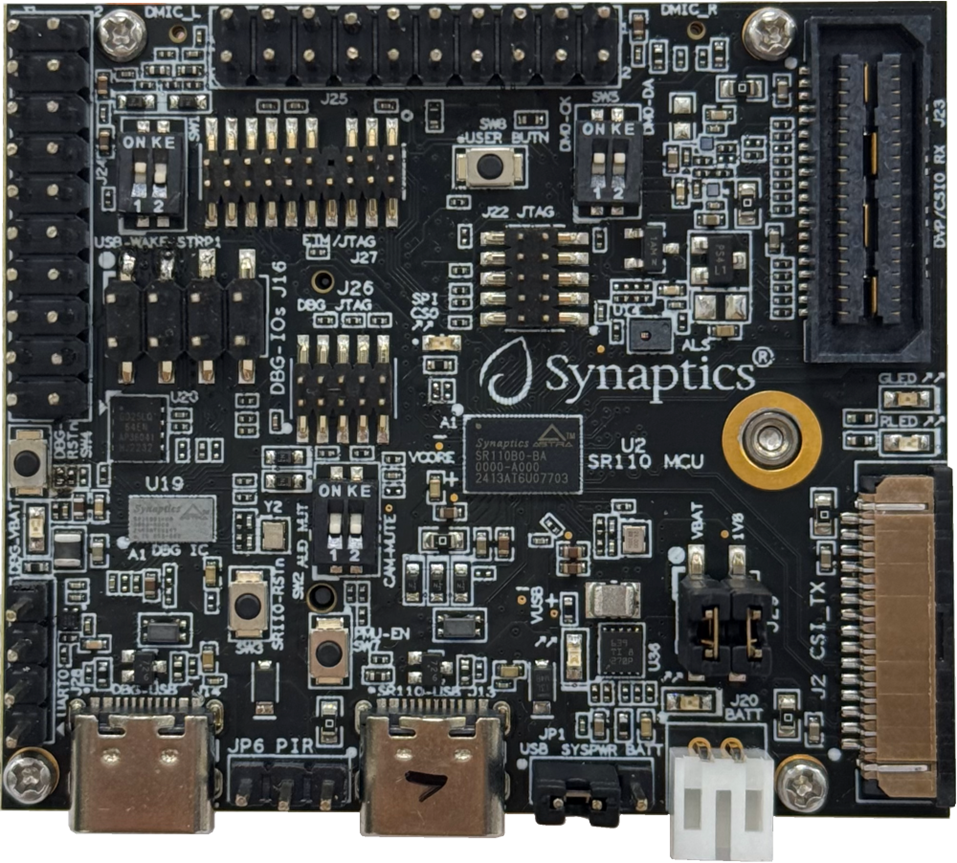
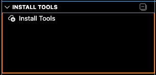
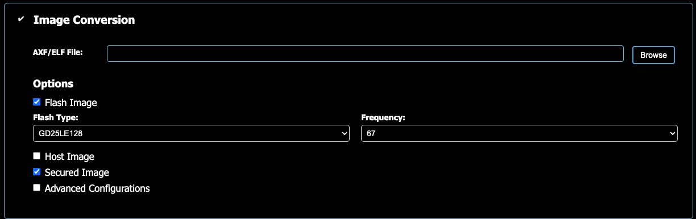
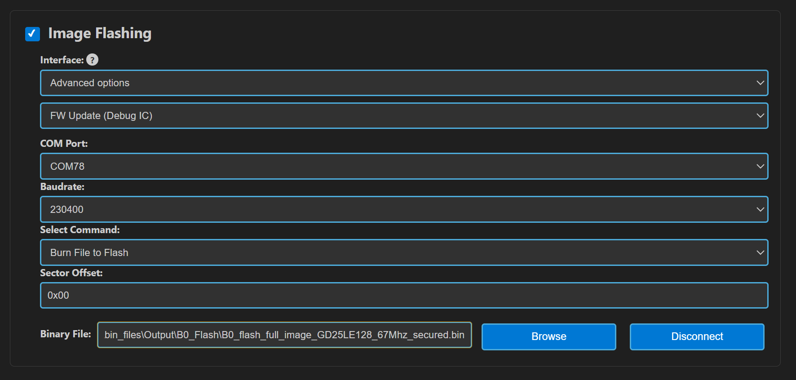
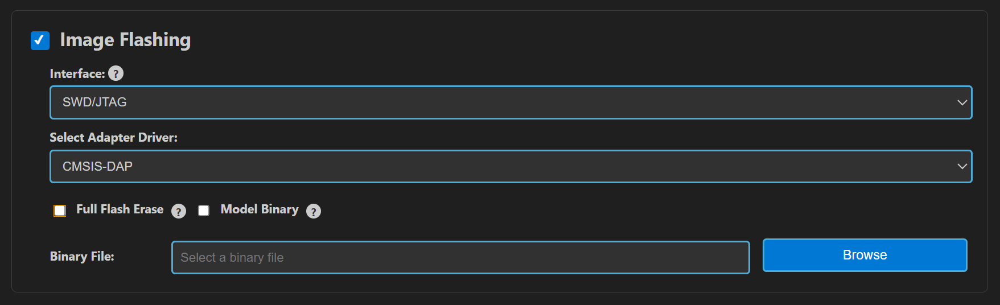

# Astra MCU SDK Quick Start Guide

The Astra MCU SDK is a comprehensive software development kit tailored
to harness the exceptional capabilities of the Synaptics SR series of MCUs. The
Astra MCU SDK is designed to cater to the Vision and AI capabilities of
the Astra SR MCU.

To facilitate a seamless development journey, the Astra MCU SDK includes
the following key components:

- Optimized libraries and frameworks specifically tuned for the SR
  series hardware accelerators.

- Sample Applications - Demonstrations real-world use cases such as
  vision-based low power AI.

- Documentation and Tutorials - Detailed resources guiding developers
  from initial setup to advanced optimization techniques.

- VSCode Extension

## Prerequisites

- Windows or Linux or macOS

- VS Code (Installed and on system Path)

- Astra Machina Micro Kit

## Hardware Setup

1.  Unbox the Astra Machina Micro Kit and visually inspect it for damage.

2.  Ensure that all switches and jumpers are set to their default settings. Refer to the Astra Machina Micro Reference Manual for details.

3.  Connect the Debug IC USB port (J14) to your host PC using the supplied USB cable. In the figure below, this is the bottom left USB connector
    
	
	<figure>
    <figcaption><b>Figure 1.</b> SR110 RDK Board</figcaption>
    </figure>

## Install VS Code Extension

1.  In VS Code open a new terminal window. Type the following command

> &gt; code --install-extension &lt;path to extension&gt;.vsix

 Note the extension is located in the SDK here tools/Astra_MCU_SDK_vscode_extension-1.2.3.vsix

2.  Close and Reopen VS Code.

## Install Required Tools

1.  Click on the Synaptics Extension icon
	
    

2.  Navigate to Install Tools:

    

3.  Follow the prompts to install all required tools for use with the
    SDK. Note that during install the system may prompt you to approve
    installation of some tools, so pay attention during this time.

## Import Examples

1.  Within the Synaptics Extension go to Import SDK and choose the

	
	
## Build Example Application

1.  In the Synaptics Extension navigate to IMPORTED REPOS section and select
    Build and Deploy.

2.  The first time you do this the tool will prompt you to supply the
    root directory of the Astra MCU SDK. Browse to the root of the
    Astra MCU SDK, one level above the examples folder

3.  Click the Build Configurations checkbox and select

    - SR110

    - sr110\_cm55\_fw

    - Debug

    - Astra Machina Micro

    - Rev C

    - GCC

    - demo\_sample\_app.

    - Build (SDK + App) (Check box)

4.  Press Run (scroll to bottom of dialog)

    

## Create bin File for Flashing

Once your application has been built a .elf file will be created. This
needs to be converted into a .bin file to load onto the onboard flash on
the Astra Machina Micro board.

1.  In the Synaptics Extension navigate to IMPORTED REPOS section and select
    Build and Deploy. Click on the Image Conversion checkbox

2.  The .elf file created when you built the example app should be
    automatically populated. If not click browse and navigate to the
    .elf file which is in the /out/sr110_cm55_fw/debug folder in the
    examples directory

3.  Select Flash Image and Flash Type of GD25LE128, and select Secured
    Image

4.  Scroll down to bottom and press Run

    

## Update Debug IC Firmware

The Astra Machina Micro board comes with an onboard Debug IC. The FW for
this debug IC could be out of date so it is best to update it.

1.  In the Synaptics Extension navigate to IMPORTED REPOS section and select
    Build and Deploy. Click on the Image Flashing Checkbox

2.  Select Advanced Options in the Interface dropdown. And then select "FW Update (Debug IC)"

3.  Select COM Port. When you plugged USB into the Astra Machina Micro
    Debug IC USB Port (J14) two COM Ports appeared. Select one of them to try
    first, if it fails then try the other.
    > Note: In linux the available CDC will appear as /dev/ttyACM0, /dev/ttyACM1 etc. Use these for flashing in FW mode (FW update).

4.  Browse to the location of the .bin for the debug IC which is in
    tools/Debug\_IC\_FW/Debug\_IC\_FW.bin

5.  Scroll down and press Run. A warning pop up will appear to confirm the action, click Proceed to update the Debug IC.

6.  Once flashing is complete unplug and replug the USB cable

    

## Flash Application Image

1.  From the Image Flashing dialog select Interface as SWD/JTAG

2.  Select Adapter Driver as CMSIS-DAP

3.  Navigate to the example .bin file you previously created. This is located
    in the examles directory /out/bin_files/Output/B0_Flash/B0_flash_full_image_GD25LE128_67Mhz_secured.bin

4.  Scroll Down and Press Run

    

## Run Application

1.  After programming finishes un-plug and re-plug the USB cable into
    the Debug IC USB connector

2.  Open a terminal application such as the Serial Monitor in VSCode or
    Tera Term

3.  Select the COM port that wasn’t the Debug IC FW update port and connect to it

4.  You should now see the demo printing out info:

	0119215263:[0][INFO][SYS]:Task vTaskDemo1

	0119715263:[0][INFO][SYS]:Task vTaskDemo1

	0120115263:[0][INF][SYS]:Task vTaskDemo2

	0120215263:[0][INF][SYS]:Task vTaskDemo1

	0120715263:[0][INF][SYS]:Task vTaskDemo1

	0121115263:[0][INF][SYS]:Task vTaskDemo2

## Debug Application

If you want, you can debug the application as well

1.  In the Synaptics Extension select Debug Options.

2.  Select the .elf for your application (if not already selected)

3.  Choose CMSIS DAP as the adapter driver

4.  Press Download & Reset Program

A debug session is started and the application halts at the start of
main
    

## Running Vision AI Applications

The first part walked you through how to setup your system and run a
simple demo application. Now it is time to run a vision AI example.

Follow the steps from above except this time choose something like
uc\_person\_detection. Follow the same steps to build and flash.

Once the image is flashed plug another USB cable into the 2nd
USB port(J13) on the Astra Machina Micro board.

Go to the README.md file for the chosen Vision AI use case and follow
the directions under the heading “Running the Application.”

### Updating Drivers on Windows

This step is important to enable image streaming on windows, you
are required to configure comport with “Zadig”.

1.  Download the Zadig USB driver from the following link:
    https://zadig.akeo.ie/

2.  Open zadig-2.8.exe

3.  In the “Options” tab choose “List All Devices”

    

4.  In the drop-down list choose “SR 100-B0 CDC 1”

    

5.  Click on “Replace Driver”

    

