Getting Started SR110
=====================

Introduction 
============

   The Astra SRSDK is a comprehensive software development kit tailored
   to harness the exceptional capabilities of the SR series of MCUs. The
   Astra SRSDK is designed to cater to the Vision and AI capabilities of
   the Astra SR MCU.

   To facilitate a seamless development journey, the Astra SRSDK
   includes the following key components:

-  Optimized libraries and frameworks specifically tuned for the SR
   series hardware accelerators.

-  Sample Applications - Demonstrations real-world use cases such as
   vision-based low power AI.

-  Documentation and Tutorials - Detailed resources guiding developers
   from initial setup to advanced optimization techniques.

Prerequisites
=============

-  Windows, Linux, or MacOS

-  VS Code

-  Astra Machina Micro Kit

Hardware Setup
==============

1. Unbox the Astra Machina Micro Kit and visually inspect it for damage.

2. Ensure that all switches and jumpers are set to their default
   settings. Refer to the Astra Machina Micro Reference Manual for
   details.

3. Connect the Debug IC USB port (J14) to your host PC using the
   supplied USB cable. In the figure below, this is the bottom left
   connector.

|image2|

 

4. Wait a few seconds for the Debug IC to enumerate for the first time
   (up to 15 seconds).

5. The Debug IC enumerates as two USB Serial Devices (CDC) (COM numbers
   may vary, e.g., COM48 and COM49 in the example below). One COM port
   is for updating the Debug IC FW and the other COM port is for
   capturing logs from the SR110. Note the Debug IC also enumerates as
   CMSIS-DAP device, this allows for programming and debugging of the
   SR110.

|image3|

6. If the Debug IC doesn't enumerate as two USB Serial Devices, but
   instead as two unknown USB devices then USB serial drivers need to be
   installed on your PC. It is recommended to use the FTDI VCP drivers:
   https://ftdichip.com/drivers/vcp-drivers/

7. Note if no USB shows up after plugging in J14 to see "How to Program
   Debug IC.pdf"

Install VS Code Extension
=========================

1. In VS Code Open a new terminal window. Navigate to the installed SDK
   and type the following command:

> code -–install-extension
tools/Astra_MCU_SDK_vscode_extension-1.2.2.vsix

2. After installing the extension, it is recommended to close and reopen
   VS Code.

Install Required Tools
======================

1. Click on the Synaptics Extension icon

|image4|

2. Navigate to Install Tools:

|image5|

 

3. Follow the prompts to install all required tools for use with the
   SDK. Note that during install the system may prompt you to approve
   installation of some tools, so pay attention during this time.

Import the SDK
==============

1. Within the Synaptics Extension go to Import SDK and chose the
   top-level folder for the SDK which you installed on your system.

..

   |image6|

Build Sample Application
========================

1. In the Synaptics Extension navigate to Imported Repos and select
   Build or clean SDK.

2. Choose:

   -  sr110_cm55_fw

   -  Release

   -  sr110_rdk

   -  GCC

   -  demo_sample_app.

3. Press Build

|image7|

Create bin File for Flashing
============================

Once your application has been built an .elf file will be created. This
needs to be converted into a .bin file to load onto the onboard flash on
the Astra Machina Micro board.

1. In the Synaptics Extension navigate to AXF/ELF to BIN and select Bin
   Conversion

2. The .elf file created when you built the demo app should be
   automatically populated. If not click browse and navigate to the .elf
   file which located here: out/sr110_cm55_fw/release/sr110_cm55_fw.elf

3. Select Flash Image and Flash Type of GD25LE128, and select Secured
   Image

4. Press Run Image Generator

|image8|

Flash Application Image
=======================

1. From the Image Flashing dialog select Service Type of SWD/JTAG

2. Select Adapter Driver as CMSIS-DAP

3. Navigate to the .bin file you previously created. This is typically
   stored in the user directory in a folder called Bin_Location.

4. Press Flash Execute

|image9|

Run Application
===============

1. After programming finishes un-plug and re-plug the USB cable into the
   Debug IC USB connector

2. Open a terminal application such as the Serial Monitor in VSCode or
   Tera Term

3. Try both COM ports until you see prints similar to the below

4. You should now see the demo printing out info:

0119215263:[0][INFO][SYS]:Task vTaskDemo1

0119715263:[0][INFO][SYS]:Task vTaskDemo1

0120115263:[0][INF][SYS]:Task vTaskDemo2

0120215263:[0][INF][SYS]:Task vTaskDemo1

0120715263:[0][INF][SYS]:Task vTaskDemo1

0121115263:[0][INF][SYS]:Task vTaskDemo2

Debug Application
=================

If you want, you can debug the application as well.

1. In the Synaptics Extension go to Debug Probes and Debug Probe
   Interface

2. Select the .elf for your application (if not already selected)

3. Choose CMSIS DAP as the adapter driver

4. Press Download & Reset Program

5. For better debug experience, it is recommended to build in Debug
   mode, not Release mode.

A debug session is started and the application halts at the start of
main

|image10|

Running Vision AI Applications
==============================

The first part walked you through how to setup your system and run a
simple demo application. Now it is time to run a vision AI example.

Follow the steps from above except this time choose something like
*uc_person_detection*. Follow the same steps to build and flash.

Once the image is flashed plug another USB cable into the
2\ :sup:`nd` USB port (J13) on the Astra Machina Micro board.

Updating Drivers
================

This step is important to enable image presentation via SynaToolkit, you
are required to configure comport with “Zadig”.

1. Download the Zadig USB driver from the following
   link: https://zadig.akeo.ie/

2. Open zadig-2.8.exe

3. In the “Options” tab choose “List All Devices”

|image11|

4. In the drop-down list choose “SR 100-B0 CDC 1”

|image12|

5. Click on “Replace Driver”

|image13|

Installing SynaTool Kit
=======================

Located in the tools directory is a SynaToolKit_x.y.z.exe. If you are a
windows user install this tool.

Running Vision AI in SynaTool kit
=================================

Go to the *README.md* file for the chosen Vision AI use case and follow
the directions under the heading “Running the Application.”

Copyright

Copyright © 2024 Synaptics Incorporated. All Rights Reserved.

Trademarks

Synaptics; the Synaptics logo; are trademarks or registered trademarks
of Synaptics Incorporated in the United States and/or other countries.
All other trademarks are the property of their respective owners.

Notice

This document contains information that is proprietary to Synaptics
Incorporated (“Synaptics”). The holder of this document shall treat all
information contained herein as confidential, shall use the information
only for its intended purpose, and shall not duplicate, disclose, or
disseminate any of this information in any manner unless Synaptics has
otherwise provided express, written permission.

Use of the materials may require a license of intellectual property from
a third party or from Synaptics. This document conveys no express or
implied licenses to any intellectual property rights belonging to
Synaptics or any other party. Synaptics may, from time to time and at
its sole option, update the information contained in this document
without notice.

INFORMATION CONTAINED IN THIS DOCUMENT IS PROVIDED "AS-IS,” AND
SYNAPTICS HEREBY DISCLAIMS ALL EXPRESS OR IMPLIED

WARRANTIES, INCLUDING BUT NOT LIMITED TO ANY IMPLIED WARRANTIES OF
MERCHANTABILITY AND FITNESS FOR A PARTICULAR

PURPOSE, AND ANY WARRANTIES OF NON-INFRINGEMENT OF ANY INTELLECTUAL
PROPERTY RIGHTS. IN NO EVENT SHALL SYNAPTICS BE

LIABLE FOR ANY DIRECT, INDIRECT, INCIDENTAL, SPECIAL, PUNITIVE, OR
CONSEQUENTIAL DAMAGES ARISING OUT OF OR IN CONNECTION

WITH THE USE OF THE INFORMATION CONTAINED IN THIS DOCUMENT, HOWEVER
CAUSED AND BASED ON ANY THEORY OF LIABILITY,

WHETHER IN AN ACTION OF CONTRACT, NEGLIGENCE OR OTHER TORTIOUS ACTION,
AND EVEN IF SYNAPTICS WAS ADVISED OF THE POSSIBILITY OF SUCH DAMAGE. IF
A TRIBUNAL OF COMPETENT JURISDICTION DOES NOT PERMIT THE DISCLAIMER OF
DIRECT DAMAGES OR ANY OTHER DAMAGES, SYNAPTICS’ TOTAL CUMULATIVE
LIABILITY TO ANY PARTY SHALL NOT EXCEED ONE HUNDRED U.S. DOLLARS.

Ordering Information

For ordering information and a complete list of Synaptics' products,
contact your Synaptics sales representative. Visit our website at
www.synaptics.com to locate the Synaptics office nearest you.

Contact Us

Visit our website a\ `t www.synaptics.com
t <http://www.synaptics.com/>`__\ o locate the Synaptics office nearest
you.

   |image14|

.. |image1| image:: ./media/image3.jpg
   :width: 2.49875in
   :height: 0.55972in
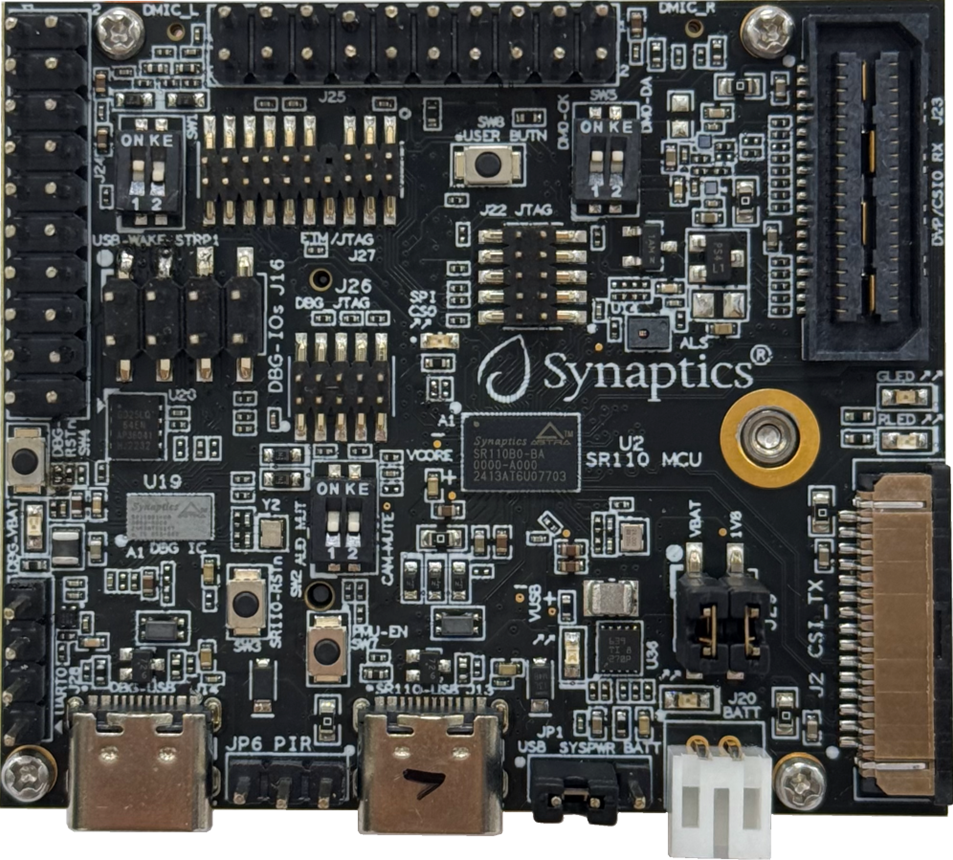
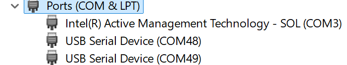
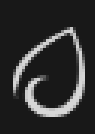
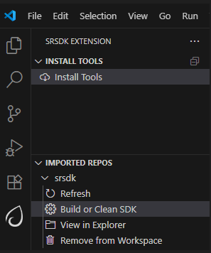
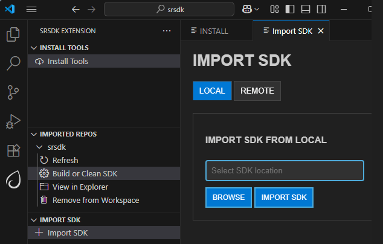
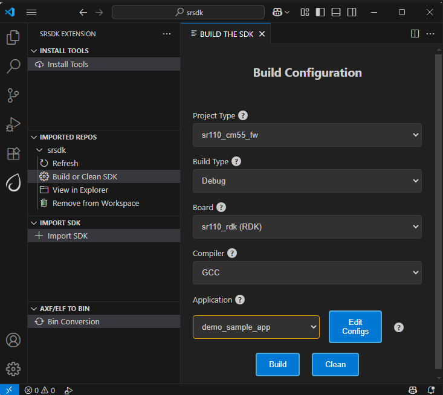
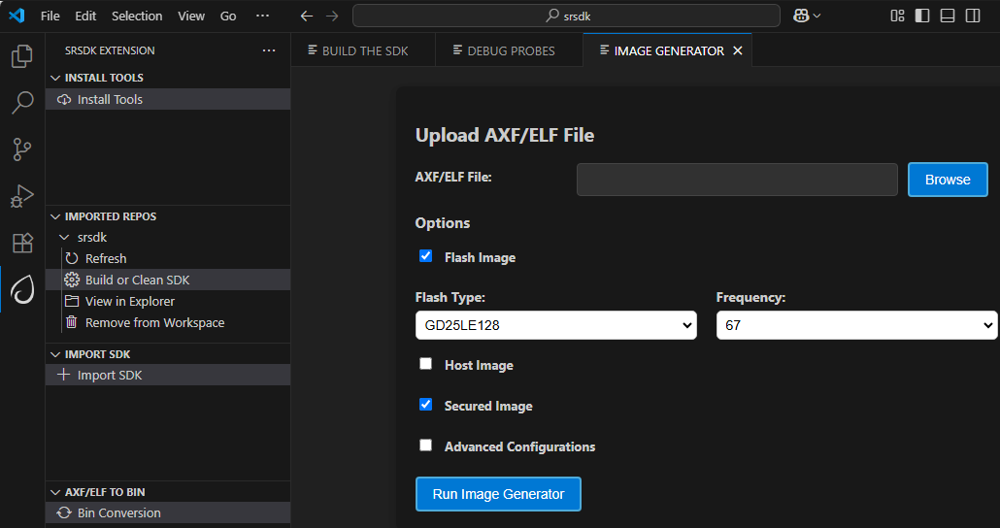
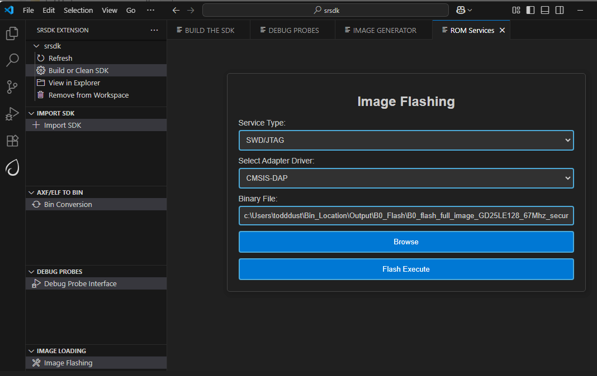
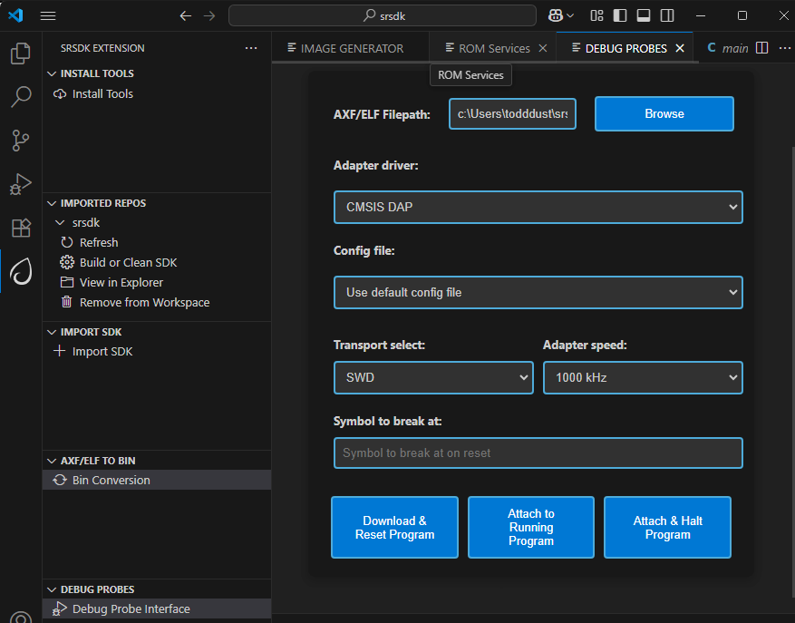
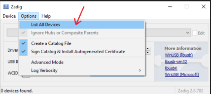
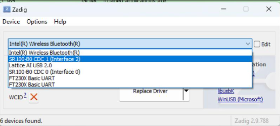
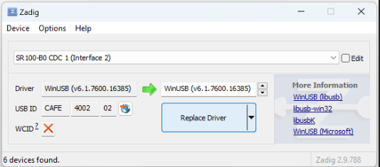
.. |image14| image:: ./media/image3.jpg
   :width: 2.5in
   :height: 0.57292in
