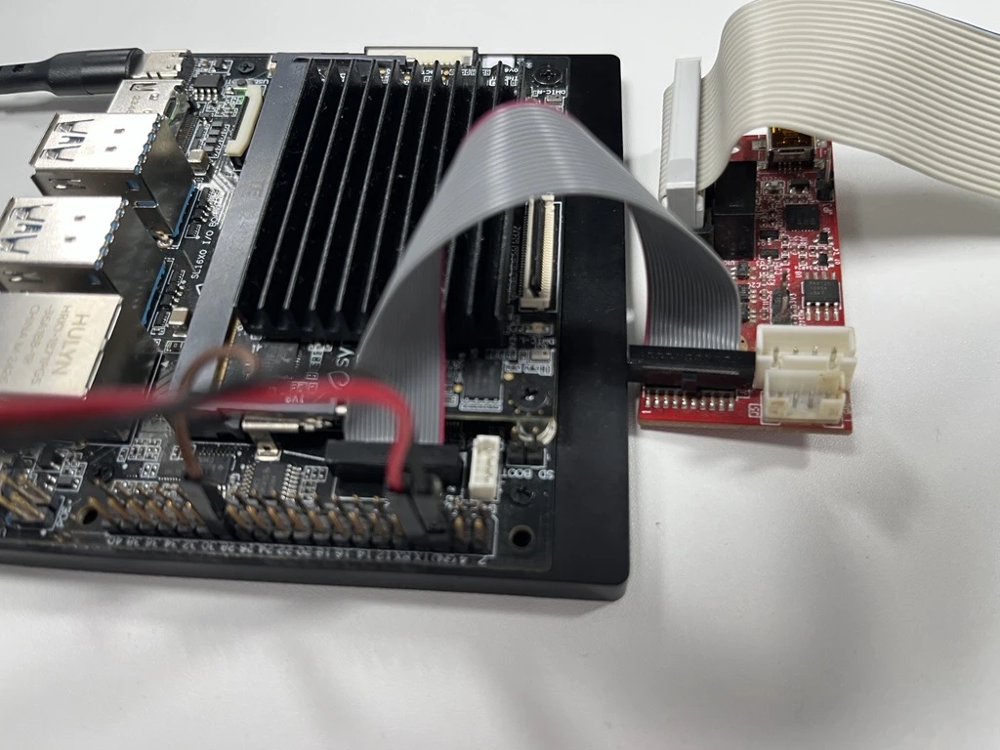
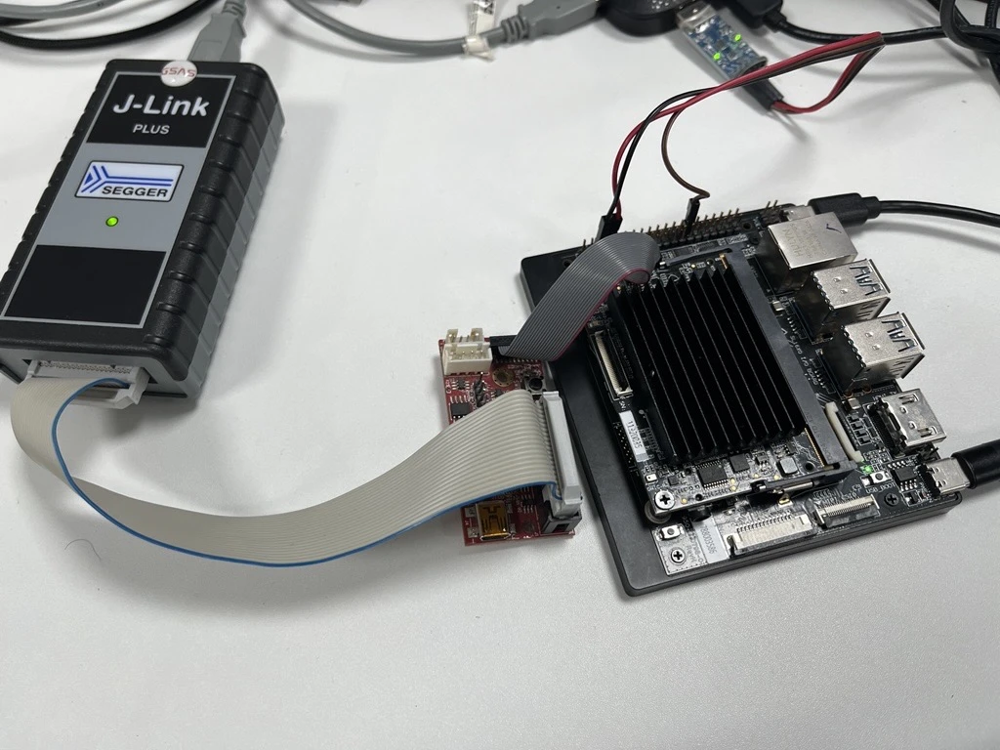

# Astra MCU SDK Reference

This document is a comprehensive reference for the Astra MCU SDK. It describes the SDK structure, build and configuration model, project layout, image generation, flashing tools, and common troubleshooting. It is not a quick start guide and focuses on SDK internals and CLI workflows.

Throughout this guide, `<sdk-root>` refers to the folder where you extracted or cloned the SDK (for example, `C:\Users\<YourName>\ASTRA_MCU_SDK_x.x.x\`).

## Table of Contents

- [Scope and Audience](#scope-and-audience)
- [Supported Platforms and Boards](#supported-platforms-and-boards)
- [Host Requirements](#host-requirements)
- [Environment Variables and Toolchain Selection](#environment-variables-and-toolchain-selection)
- [SDK Repository Layout](#sdk-repository-layout)
- [Project Structure and Module Organization](#project-structure-and-module-organization)
- [Build System Overview](#build-system-overview)
- [CMake Build Details](#cmake-build-details)
- [Configuration Model (Kconfig)](#configuration-model-kconfig)
- [Build Workflows](#build-workflows)
- [Build Outputs and Artifacts](#build-outputs-and-artifacts)
- [Image Generation](#image-generation)
- [Flashing](#flashing)
- [Debugging](#debugging)
- [Where to Run Commands](#where-to-run-commands)
- [Applications (Modify or Create)](#applications-modify-or-create)
- [Command Reference](#command-reference)
- [Troubleshooting](#troubleshooting)
- [Related References](#related-references)

## Scope and Audience

Use this reference if you need to:
- Understand how the SDK is organized and built.
- Configure SDK or application features.
- Build SDK packages and applications with the CLI.
- Generate images and flash devices.
- Troubleshoot build, image generation, or flashing issues.

Before using this reference, complete the setup and installation steps:
- CLI setup: [Setup and Install SDK using CLI](./Astra_MCU_SDK_Setup_and_Install_CLI.md)

## Supported Platforms and Boards

### Boards
- **Astra Machina Micro SR110 (SR110_RDK)** 
- **Astra Machina SL2610 (SL2610_RDK)** 

### Platform Differences (at a glance)
| Feature | SR110 | SL2610 |
| --- | --- | --- |
| MCU core | Cortex-M55 | Cortex-M52 |
| NPU | Ethos-U55 | None |
| Flash media | External XSPI | eMMC and on-board xSPI NOR (via USB boot tool) |
| Image generation | SRSDK image generator | Image generator + USB boot tool |
| Debug | OpenOCD + probe | Not supported in this SDK flow |
| Toolchains | GCC, AC6, LLVM | GCC, AC6 |

### Platform Guides
- SR110 platform and hardware: [SR110 Platform Guide](./SR110/SR110_platform_Guide.md)
- SL2610 platform and hardware: [SL2610 Platform Guide](./SL2610/SL2610_Platform_Guide.md)

## Host Requirements

### Supported Host OS
- Windows (x64)
- Linux (Ubuntu 22.04)
- macOS (Apple Silicon & Intel)

### Required Tools
| Tool | Version Guidance | Notes |
| --- | --- | --- |
| CMake | 4.1.2 | Build system generator |
| Ninja | 1.13.1 | Build executor |
| Python | 3.13.x | Required for configuration tools and image generation |
| OpenOCD | Host package or xPack | Required for SR110 flashing |

### Toolchains
- **GCC 13.2.1** (all platforms)
- **Arm Compiler 6.19** (AC6)
- **LLVM Clang 21.x** (SR110 only; requires GCC sysroot)

Use only **one toolchain per build**. Do not mix toolchains across SDK and application builds.

## Environment Setup 
Use these for host setup and tool installation:
- [Setup and Install SDK using CLI](./Astra_MCU_SDK_Setup_and_Install_CLI.md)
- [Build environment guides](./build_env/index.rst) (OS + toolchain specific guides)


## SDK Repository Layout

Top-level directories:
- `arch/` CPU architecture support
- `board/` Board-specific support files
- `bootloader/` Bootloader sources
- `configs/` SDK defconfigs (bootloader, tflite, default package)
- `drivers/` Hardware drivers
- `examples/` Sample applications and example build system
- `kconfig/` SDK-level configuration entry
- `os/` RTOS support (FreeRTOS and related)
- `soc/` SoC-specific sources
- `tools/` Build, image, flashing, and utility tools
- `utilities/` Common utilities
- `third_party/` External dependencies

### Examples Layout (in-tree)
```
examples/
|-- README.md                    # Examples overview and build guidance
|-- audio_examples/              # Audio examples
|   `-- <example>/               # Example application
|-- driver_examples/             # Driver examples
|   |-- <example>/               # Example application
|   |   |-- configs/             # Application defconfigs
|   |   |-- hw/<BOARD>/          # Board-specific init files
|   |   |-- CMakeLists.txt       # Application CMake entry
|   |   |-- Makefile             # Application build wrapper
|   |   |-- kconfig              # Application config options
|   |   |-- src.cmake            # Application source list
|   |   `-- <sources>            # Application source files
|-- inference_examples/          # Inference examples
|   `-- <example>/               # Example application
|-- sample_demo_app/             # Standalone demo application
|-- system_manager/              # Standalone system manager application
|-- usb_examples/                # USB examples
|   `-- <example>/               # Example application
`-- vision_examples/             # Vision examples
    `-- <example>/               # Example application
```

Out-of-tree custom applications are supported. Point `SRSDK_DIR` to the SDK root and keep your application repo separate.

The current in-tree examples are organized by functional category. Within each application, the `configs/` directory holds that app's defconfigs for all supported boards, while the `hw/<BOARD>/` directory contains board-specific hardware setup needed by that app, such as pinmux, UART, and logger mux configuration.

## Project Structure and Module Organization

The SDK is organized as functional modules. Each module typically contains its own `CMakeLists.txt` and, when configurable, a `Kconfig` file. The root `CMakeLists.txt` includes major subsystems, and each subsystem adds its sources and include paths.

### Root-Level Build Entry
- `CMakeLists.txt` in the SDK root drives inclusion of core subsystems (bootloader, firmware, tflite, drivers, OS).
- `tools/cmake/flags.cmake` centralizes compiler flags and warnings.
- `tools/cmake/` contains SDK CMake modules and shared example-build helper modules.

### Module-Level Structure
- Each module uses `target_sources()` to add sources and `target_include_directories()` to expose headers.
- Modules can be conditionally included based on Kconfig selections.

### Kconfig Hierarchy
- Top-level `kconfig` sources module Kconfig files (e.g., `drivers/Kconfig`, `soc/*/Kconfig`).
- Selecting options in Kconfig controls which modules and features are built.

### Where to Look for Specific Pieces
- **SoC configuration**: `soc/`
- **Board configuration**: `board/`
- **Drivers**: `drivers/`
- **OS abstraction**: `os/`
- **Bootloader**: `bootloader/`
- **TFLite Micro**: `AI/` and `third_party/`
- **Tools and scripts**: `tools/`
- **App/Example inclusion logic**: category-level files such as `examples/inference_examples/CMakeLists.txt` and per-app files such as `examples/<example_type>/<app>/CMakeLists.txt`

## Build System Overview

The SDK supports two primary build entry points:
- **SDK root (`<sdk-root>`)**: build the SDK package, bootloader, or TFLite Micro libraries.
- **Application folder (`<sdk-root>/examples/<example_type>/<app>` or `examples/<app>`)**: build an individual application, either app-only or combined SDK + app.

Out-of-tree builds are supported: keep your custom application in a separate folder and set `SRSDK_DIR` to the SDK root.

The build system is layered:
- **Make**: orchestration and entry points (`Makefile` in the SDK root and in each application directory under `examples/`).
- **Kconfig**: configuration UI and `.config` generation.
- **CMake**: build generation.
- **Ninja**: actual compilation and linking.

### Key Build Concepts
- **Defconfig**: Minimal config snapshot. Applied to produce `.config`.
- **.config**: Full configuration file, used to generate `config.h` and build flags.
- **config.h**: Generated header consumed by C/C++ sources.
- **SDK package**: Installed libraries and headers used by application builds.
- **SDK package installation**: Produces a reusable SDK package (headers, libraries, toolchain CMake files, and `config.h`) that application builds link against.

## CMake Build Details

This section describes the CMake flow at a practical level.

### SDK Root CMake (core SDK builds)
- Reads `build/config.h` to load `CONFIG_*` settings (generated from Kconfig).
- Uses those settings to select linker scripts and build flags.
- Builds the SDK libraries and packages them for reuse.
- Exports a CMake package under `install/<BOARD>/<BUILD_TYPE>/lib/cmake/SynapticsSDK/`.

### Examples CMake (application builds)
- Builds app targets named `${CONFIG_PROJECT}_${CONFIG_BUILD_TYPE}` (for example `sr110_cm55_fw`).
- `BUILD=SRSDK` builds the SDK package and the app together.
- `BUILD=EXAMPLE` uses the app-local SDK install under that application's `install/` directory. This requires that the application's SDK package has already been created at least once, typically by an earlier combined SDK+app build.
- `BUILD=EXAMPLE USE_PREINSTALLED_SDK=1` uses the SDK package already installed under `SRSDK_DIR/install/<BOARD>/<BUILD_TYPE>/`, typically created earlier from the SDK root for the selected board and build type.
- Some applications need SDK dependencies beyond what is included in the default installed SDK package. In that case, the build system automatically falls back to building an app-specific SDK package locally and then builds the application against that package.
- Example apps are included when their `kconfig` symbol is enabled.
- `USE_APP_CACHE=ON` (default) uses a small per‑app cache of SDK headers/libs for faster rebuilds.

## Configuration Model (Kconfig)

### Where Configuration Lives
- **SDK defconfigs**: `configs/<BOARD>/*_defconfig`
- **Application defconfigs**: `examples/**/configs/*_defconfig`

### Configuration Flow
1. Apply a defconfig to generate `.config`.
2. (Optional) Modify using `menuconfig`.
3. Build generates `config.h` and uses it for compilation.

The Makefiles use Python helpers under `tools/scripts/kconfig/`:
- `defconfig.py` applies defconfigs.
- `menuconfig.py` launches the interactive menu.
- `genconfig.py` generates `config.h`.
- `savedefconfig.py` writes a minimal defconfig.

### Key Defconfig Fields
Common fields you will see in defconfigs:
- `CONFIG_PROJECT`: Project family (e.g., `sr110`, `sl2610`).
- `CONFIG_BUILD_TYPE`: Target type (e.g., `cm55_fw`, `cm52_fw`, `bootloader`, `tflite_micro`).
- `CONFIG_COMPILER`: Compiler selection (`gcc`, `ac6`, `llvm`).
- `CONFIG_TOOLCHAIN` : Toolchain selection (`GCC.13.2.1`, `AC6.6.18.0`, `LLVM`)
- `CONFIG_BOARD`: Board name (e.g., `sr110_rdk`, `sl2610_rdk`).
- `CONFIG_BOARD_REV`: Board revision (when applicable).
- `CONFIG_CPU_LIST`: CPUs included in a multi-CPU board build (for example `CM55 CM4`).
- `CONFIG_BUILD_LIST`: Multi-CPU build entries processed by `make astrasdk` (for example `cm55_fw cm55_bootloader_fw cm4_fw`).

These values drive the build directory structure and output names.
`CONFIG_COMPILER` must match the active toolchain environment variables; use the same compiler for SDK and app builds.
If `CONFIG_BUILD_LIST` is defined in the active SDK defconfig, the SDK root build runs in multi-CPU mode and builds each listed firmware entry in sequence.

### Build Modes
`CONFIG_BUILD_MODE` controls optimization and output directories:
- `release`: optimized output, minimal logging.
- `debug`: debug symbols and extra logging.

Build modes map to output folders: `release/` or `debug/`.

Note: Build types used in defconfigs are `cm55_fw`, `cm52_fw`, `bootloader`, and `tflite_micro`.

## Build Workflows

### SDK Root Builds (from `<sdk-root>`)
Use SDK root for bootloader, TFLite Micro, or SDK package builds.

1. Apply a defconfig:
```
make default_config BOARD=<BOARD>
```

2. Build the currently selected SDK target:
```
make astrasdk
```

3. For bootloader or TFLite Micro builds, apply the corresponding defconfig and then run:
```
make <bootloader_defconfig> BOARD=<BOARD>
make astrasdk

make <tflite_defconfig> BOARD=<BOARD>
make astrasdk
```

### Multi-CPU SDK Workflow
Use this SDK-root flow when one board build must produce firmware for more than one CPU. The main difference from a single-CPU SDK build is that you apply a board-level main defconfig that defines the CPU list and the firmware entries to build.

For the current SR110 multi-CPU flow:
```
cd <sdk-root>
make sr110_rdk_main_defconfig BOARD=SR110_RDK
make astrasdk
```

The main defconfig lives under `configs/<BOARD>/` and defines the overall build plan. Example:
```makefile
CONFIG_PROJECT="sr110"
CONFIG_BOARD="sr110_rdk"
CONFIG_CPU_LIST="CM55 CM4"
CONFIG_BUILD_LIST="cm55_fw cm55_bootloader_fw cm55_tflite_micro_fw cm4_fw"
CONFIG_BUILD_MODE="release"
```

How the workflow runs:
1. `make sr110_rdk_main_defconfig BOARD=SR110_RDK` selects the board-level multi-CPU build definition.
2. `make astrasdk` reads `CONFIG_BUILD_LIST` and treats each entry as a separate SDK build target.
3. For each entry, the build system merges the main defconfig with the matching CPU-specific defconfig from `configs/<BOARD>/`, generates `build/config.h`, and runs CMake + Ninja for that target.
4. Installable entries produce reusable SDK package outputs that later application builds can link against.

Common `CONFIG_BUILD_LIST` entry patterns:

| Entry Pattern | Meaning | Installed by `make astrasdk` |
| --- | --- | --- |
| `<cpu>_fw` | Standard firmware | Yes |
| `<cpu>_secure_fw` | TrustZone secure firmware | Yes |
| `<cpu>_nonsecure_fw` | TrustZone non-secure firmware | Yes |
| `<cpu>_bootloader_fw` | Bootloader packaged in SDK-install flow | Yes |
| `<cpu>_downloader_fw` | Downloader packaged in SDK-install flow | Yes |
| `<cpu>_bootloader` | Bootloader-only build output | No |
| `<cpu>_downloader` | Downloader-only build output | No |
| `<cpu>_tflite_micro_fw` | TFLite Micro build flow | No |

Defconfig naming follows the entry type. Examples:
- `cm55_fw` expects `sr110_cm55_fw_defconfig`
- `cm55_bootloader_fw` expects `sr110_cm55_bootloader_fw_defconfig`
- `cm55_tflite_micro_fw` expects `sr110_cm55_tflite_micro_defconfig`
- `cm4_fw` expects `sr110_cm4_fw_defconfig`

This layout also supports master-slave CPU designs. In those cases, keep shared resource ownership such as clock and pinmux on the master CPU and use the slave CPU defconfig to enable only the modules and drivers that CPU actually needs.

After the SDK multi-CPU build completes, application builds remain per application and per target CPU. Build each application from its own directory using the app defconfig for the CPU you want, and reuse the installed SDK package with `BUILD=EXAMPLE` or `USE_PREINSTALLED_SDK=1` as needed.

### Application Builds (from an application directory under `examples/`)
Use an individual application directory such as `<sdk-root>/examples/<example_type>/<app>` or `<sdk-root>/examples/<app>` to build that application.

The `configs/` directory contains the defconfigs supported by that application.

**Path tips:** Use absolute paths for `SRSDK_DIR` and toolchain variables. On Windows, use escaped backslashes or forward slashes.

#### Combined SDK + App build
```
export SRSDK_DIR=<sdk-root>
make <app_defconfig> BUILD=SRSDK
```

#### App-only build (uses installed SDK package)
```
export SRSDK_DIR=<sdk-root>
make build
```

### BUILD Mode (Application only)
- `BUILD=EXAMPLE` (default): build the app only using the app-local SDK package under that application's `install/` directory. This package must already exist from an earlier SDK+app build.
- `BUILD=SRSDK`: build SDK package and the app in one flow (requires `SRSDK_DIR`).
- `BUILD=NONE`: apply defconfig only (no build).

**When to use:**
- Use **BUILD=SRSDK** for the first build, after SDK source changes, or when switching toolchains.
- Use **BUILD=EXAMPLE** for faster iteration when only app code changes and the application's local SDK package already exists.

### Custom Tools Override for Application Builds
By default, application builds use the SDK's shared tools from:

```text
<sdk-root>/tools/
```

The application build wrapper resolves this as:
- `TOOLS_DIR=$(SRSDK_DIR)/tools` when `USE_CUSTOM_TOOLS=0` (default)
- `TOOLS_DIR=<app-dir>/tools` when `USE_CUSTOM_TOOLS=1`

Use this when an application repository needs to carry its own copy of the application build helpers instead of using the SDK copy.

Example:
```bash
cd <sdk-root>/examples/<example_type>/<app>
export SRSDK_DIR=<sdk-root>
make <app_defconfig> BUILD=SRSDK USE_CUSTOM_TOOLS=1
```

The same override can also be used with other app-side flows such as:
```bash
make <app_defconfig> BUILD=NONE USE_CUSTOM_TOOLS=1
make build USE_CUSTOM_TOOLS=1
make imagegen USE_CUSTOM_TOOLS=1
```

#### What `USE_CUSTOM_TOOLS=1` changes
The application wrapper and app CMake look for these helper paths under `<app-dir>/tools/` instead of `<sdk-root>/tools/`:

- `cmake/ParseConfigHeader.cmake`
- `cmake/example_config_setup.cmake`
- `cmake/case_handler.cmake`
- `cmake/example_target_detector.cmake`
- `cmake/toolchain.cmake`
- `cmake/example_flags.cmake`
- `cmake/get_git_info.cmake`
- `cmake/example_build_config.cmake`
- `cmake/toolchain_setup.cmake`
- `cmake/example_linker_setup.cmake`
- `scripts/kconfig/defconfig.py`
- `scripts/kconfig/menuconfig.py`
- `scripts/kconfig/genconfig.py`
- `scripts/kconfig/savedefconfig.py`
- `scripts/sdk_rebuild.py`
- `image_gen/image_generator.py`
- `scripts/image/build_preboot_mcu.py`
- `scripts/image/build_preboot_mcu_wsl.py`

If you keep custom tools inside the application repository, preserve the same directory layout and filenames so the existing application `Makefile` and `CMakeLists.txt` continue to work unchanged.

Note:
- `SRSDK_DIR` is still required even when `USE_CUSTOM_TOOLS=1`.
- The application wrapper itself is still included from `$(SRSDK_DIR)/tools/make/example_app.mk`.
- During `BUILD=SRSDK`, the compiler toolchain file `${CONFIG_TOOLCHAIN}.cmake` is still included from `$(SRSDK_DIR)/tools/cmake/`.
- During `BUILD=EXAMPLE`, the toolchain file is loaded from the selected installed SDK package under `install/<BOARD>/<BUILD_TYPE>/tools/cmake/`.

### Build Multiple Applications with One SDK Package
If you want to build several applications against the same SDK package, first build and install the SDK from the SDK root, then build each application with `BUILD=EXAMPLE USE_PREINSTALLED_SDK=1`.

```
cd <sdk-root>
export SRSDK_DIR=<sdk-root>
make default_config BOARD=<BOARD>
make astrasdk

cd <sdk-root>/examples/<example_type>/<app1>
make <app1>_defconfig BUILD=EXAMPLE USE_PREINSTALLED_SDK=1

cd <sdk-root>/examples/<example_type>/<app2>
make <app2>_defconfig BUILD=EXAMPLE USE_PREINSTALLED_SDK=1
```

This reuses the SDK package from `SRSDK_DIR/install/<BOARD>/<BUILD_TYPE>/`. If that package does not include the SDK pieces required by a specific application, the build system automatically creates an app-local SDK package for that application and continues the build.

### Create a Custom Defconfig (Application)
1. Start from an existing defconfig:
   ```
   make <app>_defconfig BUILD=NONE
   ```
2. Open the configuration UI:
   ```
   make menuconfig
   ```
3. Save your new defconfig under `configs/` (for example `my_custom_app_defconfig`).
   ```
   make savedefconfig OUT=my_custom_app
   ```
   This writes `configs/my_custom_app_defconfig` in the current application directory.

The new defconfig can then be used like any other:
```
make my_custom_app_defconfig BUILD=SRSDK
```

## Build Outputs and Artifacts

### SDK Root Outputs
- `build/` contains build artifacts and `config.h` (CMake build tree is `build/<project>/<compiler>/`).
- `out/<target>/<mode>/` contains SDK root binaries:
  - GCC/LLVM: `<target>.elf` and `<target>.bin`
  - AC6: `<target>.axf` and `<target>.bin`
- `prebuilt/<PROJECT>/tflite_micro/<mode>/` contains TFLM libs when building `tflite_micro`.

For multi-CPU SDK builds, you get one output target per `CONFIG_BUILD_LIST` entry, for example `out/sr110_cm55_fw/release/` and `out/sr110_cm4_fw/release/`.

### Application Outputs
- `<app-dir>/out/<target>/<mode>/` contains application binaries.
  - GCC/LLVM: `<target>.elf` and `<target>.bin`
  - AC6: `<target>.axf` and `<target>.bin`
- `<app-dir>/build/<project>/<compiler>/` contains the application CMake build tree.
- `<app-dir>/build/<project>/<compiler>/srsdk_build/.cache/` is the app-local SDK cache (auto-managed; refreshed when SDK content changes). Disable with `USE_APP_CACHE=OFF` if needed.
- `<app-dir>/install/<BOARD>/<BUILD_TYPE>/` contains the app-local installed SDK package:
  - `include/` SDK headers
  - `lib/` SDK libraries
  - `config.h`
  - `tools/cmake/` SDK CMake toolchain modules used by the app build

The installed package also provides CMake package files under:

- App-local install, generated during `BUILD=SRSDK` for an application:
```
<app-dir>/install/<BOARD>/<BUILD_TYPE>/lib/cmake/SynapticsSDK/
```

- SDK-root install, generated from `<sdk-root>` after `make default_config BOARD=<BOARD>` and `make astrasdk`:
```
<sdk-root>/install/<BOARD>/<BUILD_TYPE>/lib/cmake/SynapticsSDK/
```

### Generated Config Headers
- `build/config.h` in SDK root: generated from SDK `.config`.
- `build/config.h` in an application directory: generated from that application's `.config` and used for the application build.

Target naming:
- `<target>` is `${CONFIG_PROJECT}_${CONFIG_BUILD_TYPE}` (for example `sr110_cm55_fw` or `sl2610_cm52_fw`).
- `<mode>` is `release` or `debug`, based on `CONFIG_BUILD_MODE`.

## Image Generation

### SR110 Image Generation (SRSDK Image Generator)
**Tool:** `tools/srsdk_image_generator/srsdk_image_generator.py`

**Required:** Python 3.13 venv active and `tools/srsdk_image_generator/requirements.txt` installed.

**Typical command (from `<sdk-root>/tools/srsdk_image_generator`):**
```
cd <sdk-root>/tools/srsdk_image_generator
python srsdk_image_generator.py \
  -B0 \
  -flash_image \
  -sdk_secured \
  -spk "<sdk-root>/tools/srsdk_image_generator/Inputs/spk_rc4_1_0_secure_otpk.bin" \
  -apbl "<sdk-root>/tools/srsdk_image_generator/Inputs/sr100_b0_bootloader_ver_0x012F_ASIC.axf" \
  -m55_image "<sdk-root>/examples/<example_type>/<app>/out/sr110_cm55_fw/release/sr110_cm55_fw.elf" \
  -flash_type "GD25LE128" \
  -flash_freq "67"
```

**Output (example):**
```
<sdk-root>/tools/srsdk_image_generator/Output/B0_Flash/B0_flash_full_image_GD25LE128_67Mhz_secured.bin
```

Key flags:
- `-flash_image` or `-host_image`: choose flash or host image output.
- `-sdk_secured` / `-sdk_non_secured`: SDK security mode.
- `-model_secured` / `-model_non_secured`: model security mode.
- `-spk`, `-apbl`, `-m55_image`: required inputs for SR110.
- `-flash_type`, `-flash_freq`: flash configuration (types: `GD25LE128`, `W25Q128`, `MX25U128`; frequencies: `34`, `67`, `100`, `134` MHz).
- `-m4_image`, `-npu_c_image`, `-model`: additional payloads for multi-core or model flows.
- `-single_slot`: generate a single-slot image layout.
- `-json_attr` / `-parse_attr`: use JSON-based flash attributes.
- `-Q4`: flash 4-bit support (1/0).

### SL2610 Image Generation (Image Generator)
**Tool:** `tools/image_gen/image_generator.py`

**Required:** Python 3.13 venv active.

**Note:** SL2610 image generation is not supported on native Windows.
Windows users should use WSL for image generation.
In the WSL environment, install required tools such as Python, `make`, and the Arm GNU toolchain.
You can use the VS Code extension's Tools Installer from WSL, or follow
[Linux Environment guide](./build_env/Astra_MCU_SDK_Linux_env_with_gcc.md) for CLI setup.

**Recommended entry:**
```
cd <sdk-root>/examples/<app-dir>
make imagegen
```

This runs a two-step pipeline:
- `tools/image_gen/image_generator.py` to generate raw images using `tools/image_gen/inp.json`.
- `tools/scripts/image/build_preboot_mcu.py` to package sub-images for USB boot and eMMC workflows.

Final outputs:
- `<app-dir>/out/image/eMMCimg/sysmgr.subimg.gz`
- `<app-dir>/out/image/eMMCimg/`
- `<app-dir>/out/image/XSPIimg/spi.bin` — xSPI NOR flash image (when xSPI boot source is selected)
- `<app-dir>/out/image/USBimg/`

Intermediate outputs from image generation:
- `<app-dir>/out/nexus_bin/`
- `<app-dir>/out/nexus_loadable/`

If you need to change inputs, update `tools/image_gen/inp.json`. Paths in this file are relative to the application's `out/` directory.
The preboot packaging step uses signing keys under `tools/signingKeys/<soc>/` and SPK assets for USB boot images.

If you see permission errors on Linux/macOS:
```
cd <sdk-root>
chmod +x tools/scripts/image/bin/gen*
```

## Flashing

### SR110 (OpenOCD Flash Script)
**Tool:** `tools/openocd/scripts/flash_xspi_tcl.py`
OpenOCD config files live under `tools/openocd/configs/`. For SR110, `sr110_m55.cfg` is the standard config.

**Example (from `<sdk-root>`):**
```
cd <sdk-root>
python tools/openocd/scripts/flash_xspi_tcl.py \
  --cfg_path tools/openocd/configs/sr110_m55.cfg \
  --image tools/srsdk_image_generator/Output/B0_Flash/B0_flash_full_image_GD25LE128_67Mhz_secured.bin \
  --erase-all
```

Key options:
- `--cfg_path` (required): OpenOCD config file
- `--image`: Binary image to program
- `--erase-all`: Full chip erase
- `--verify-only`: Verify contents without programming
- `--probe`: Select probe (default `cmsis-dap`, use `jlink` for J-Link)
- `--openocd`: Path to OpenOCD binary
- `--flash-offset`: Flash offset for programming
- `--file-offset`: Offset into image file
- `--erase-only`: Erase only, no programming
- `--log-level`: DEBUG/INFO/WARN/ERROR
- `--tcl_port`, `--tcl_host`: OpenOCD TCL interface settings
- Use `--probe jlink` (or `--probe cmsis-dap`) to select the adapter driver.

### SL2610 (USB Boot Tool)
**Tool:** `tools/usb_boot_python_tool/USB_BOOT_TOOL/usb_boot_tool.py`

**Required:** Python 3.13 venv active and `pyserial` installed.

**Enter USB boot mode first:**
- Press and hold **USB_BOOT**, then press **RESET**.
- Release **RESET**, then release **USB_BOOT**.

**Run System Manager (from `<sdk-root>/tools/usb_boot_python_tool/USB_BOOT_TOOL`):**
```
cd <sdk-root>/tools/usb_boot_python_tool/USB_BOOT_TOOL
python usb_boot_tool.py --op run-sm \
  --sm <sdk-root>/examples/<example_type>/<app>/out/image/eMMCimg/sysmgr.subimg.gz \
  --spk <sdk-root>/examples/<example_type>/<app>/out/image/USBimg/spk.bin \
  --keys <sdk-root>/examples/<example_type>/<app>/out/image/USBimg/key.bin \
  --m52bl <sdk-root>/examples/<example_type>/<app>/out/image/USBimg/m52bl.bin
```

**Full eMMC flashing:**
```
python usb_boot_tool.py --op emmc --img-dir <path-to-eMMCimg>
```

**xSPI NOR flashing:**

Programs the xSPI NOR flash image (`spi.bin`) generated under `out/image/XSPIimg/`. `--keys`, `--spk`, `--m52bl`, and `--sm` default to the files bundled next to `usb_boot_tool.py`; override only what you need.

```
python usb_boot_tool.py --op xspi-sm \
  --spi-img <sdk-root>/examples/<example_type>/<app>/out/image/XSPIimg/spi.bin
```

Additional xSPI utilities (SM must be running): `--op xspi-jedec-id`, `--op xspi-chip-erase`, and `--op xspi-read --read-size <bytes> [--read-offset <addr>] [--read-out <file>]`.

Notes:
- `--op emmc` requires a Yocto-generated `eMMCimg` folder with `emmc_part_list` and `emmc_image_list`.
- `--op xspi-sm` requires `spi.bin` from `out/image/XSPIimg/` (built by `make imagegen` when the xSPI boot source is selected — see [tools/image_gen/README.md](../tools/image_gen/README.md)).
- If `run-sm` fails because SM CDC is already running, power-cycle the board and retry.

## Where to Run Commands

Use the table below to choose the correct working directory.

| Command or Task | Run From | Notes |
| --- | --- | --- |
| `make default_config BOARD=<BOARD>` | `<sdk-root>` | Applies SDK default defconfig |
| `make <bootloader_defconfig> BOARD=<BOARD>` | `<sdk-root>` | Apply SDK bootloader defconfig, then run `make astrasdk` |
| `make <tflite_defconfig> BOARD=<BOARD>` | `<sdk-root>` | Apply SDK TFLite Micro defconfig, then run `make astrasdk` |
| `make astrasdk` | `<sdk-root>` | Builds the currently selected SDK target |
| `make <app_defconfig> BUILD=SRSDK` | `<sdk-root>/examples/<example_type>/<app>` or `<sdk-root>/examples/<app>` | Combined SDK + app build |
| `make build` | `<sdk-root>/examples/<example_type>/<app>` or `<sdk-root>/examples/<app>` | App-only build (requires `SRSDK_DIR`) |
| `make imagegen` | `<sdk-root>/examples/<example_type>/<app>` or `<sdk-root>/examples/<app>` | Application image generation pipeline |
| `srsdk_image_generator.py` | `<sdk-root>/tools/srsdk_image_generator` | SR110 image generation |
| `flash_xspi_tcl.py` | `<sdk-root>/tools/openocd/scripts` | SR110 flashing (OpenOCD) |
| `usb_boot_tool.py` | `<sdk-root>/tools/usb_boot_python_tool/USB_BOOT_TOOL` | SL2610 USB boot flashing (eMMC and xSPI) |

## Debugging

### SL2610 - Manual Debug Steps (using OpenOCD and GDB)

This section outlines a manual, step-by-step workflow to load the bootloader and connect a debugger for the SL2610 device.

- For debugging steps using the VS Code extension, see [Astra MCU SDK VSCode Extension User Guide](./Astra_MCU_SDK_VSCode_Extension_User_Guide.md).


### Prerequisites

- OpenOCD installed and available in `PATH`
- ARM GNU toolchain installed and available in `PATH`
- SL2610 board with a J-Link connection

### J-Link Connection





#### 1) Build the Bootloader

From the `<sdk-root>` folder, build the bootloader as outlined in [Build Workflows](#build-workflows). After a successful build, you should see:

- Output file: `sl2610_bootloader.elf`
- Location: `out/sl2610_bootloader/release`

#### 2) Build a Sample App + Generate Image

Build any sample app in **release** mode, then run `make imagegen`. Detailed steps for image generation is outlined in [SL2610 Image Generation (Image Generator)](#sl2610-image-generation-image-generator)

On completion, you should get:

- `m52bl.bin` at `out/image/USBimg/m52bl.bin`

Copy the full path to `m52bl.bin` for the next step.

#### 3) Run USB Boot Tool

Change directory to the USB boot tool folder:

```powershell
cd .\tools\usb_boot_python_tool\USB_BOOT_TOOL\
```

Make sure:

- The device is connected
- The device is in USB boot mode (long press USB boot button, press reset, then release)

#### 4) Load SPK + Bootloader

Run the USB boot tool command:

```powershell
python usb_boot_tool.py --op run-spk --spk spk.bin --m52bl <paste the m52bl.bin path>
```

Expected output example:

```
Auto-detecting VID:0x06CB, PID:0x019E serial port...
Syna USB CDC port detected: COM88
 ✔  key.bin UPLOADED (0.18s @ 0.15MB/s)
 ✔  spk.bin UPLOADED (0.18s @ 0.12MB/s)
 ✔  m52bl.bin UPLOADED (0.11s @ 0.78MB/s)
```

#### 5) Start OpenOCD

Open another terminal and run:

```powershell
openocd -f tools/openocd/configs/Klamath_Jlink.cfg
```

Expected output example:

```
xPack Open On-Chip Debugger 0.12.0+dev-01685-gb9224c0c0-dirty (2024-08-02-19:51)
Licensed under GNU GPL v2
For bug reports, read
        http://openocd.org/doc/doxygen/bugs.html
Info : Listening on port 6666 for tcl connections
Info : Listening on port 4444 for telnet connections
Warn : Failed to retrieve serial number: LIBUSB_ERROR_TIMEOUT
Info : J-Link V12 compiled Feb 20 2025 16:24:27
Info : Hardware version: 12.00
Info : VTarget = 1.799 V
Info : clock speed 1000 kHz
Info : JTAG tap: nexus.m52 tap/device found: 0x4ba06477 (mfg: 0x23b (ARM Ltd), part: 0xba06, ver: 0x4)
Info : JTAG tap: soc.ca55 tap/device found: 0x4ba06477 (mfg: 0x23b (ARM Ltd), part: 0xba06, ver: 0x4)
Info : [m52] Cortex-M52 r0p2 processor detected
Info : [m52] target has 8 breakpoints, 8 watchpoints
Info : [m52] Examination succeed
Info : [m52] starting gdb server on 3333
Info : Listening on port 3333 for gdb connections
```

#### 6) Connect with GDB

Once you see the “Listening on port 3333” log, open another terminal and run:

```powershell
arm-none-eabi-gdb
```

Then run the following command inside GDB:

```
target extended-remote: 3333
file <path_to_debug_elf_file>
monitor reset init
monitor halt
load
set breakpoint auto-hw on
monitor arm semihosting enable
hbreak main
continue
step
```

*Note:* Keep the OpenOCD terminal running while you use GDB. If GDB fails to connect, confirm OpenOCD is still listening on port 3333.

## Applications (Modify or Create)

### Modify an existing app
- Update sources under `examples/<example_type>/<app>/` or `examples/<app>/`.
- If you change configuration options, re-run the app defconfig and rebuild:
```
cd <sdk-root>/examples/<example_type>/<app>
export SRSDK_DIR=<sdk-root>
make <app>_defconfig
```

### Create a new app (minimal checklist)
1. Create `examples/<example_type>/<app>/` or `examples/<app>/` for the new application.
2. Add your application sources and headers.
3. Add `kconfig` with a `config` symbol for the application.
4. Add `configs/<app>_defconfig` entries for the supported board and build combinations.
5. Add `hw/<BOARD>/hw_init.c` and `hw_init.h` if the application needs board-specific hardware setup such as pinmux, UART, logger muxing, or peripheral initialization.
6. Add `CMakeLists.txt`, `Makefile`, and `src.cmake` following an existing application as a reference.
7. Build from the application directory:
```
cd <sdk-root>/examples/<example_type>/<app>
export SRSDK_DIR=<sdk-root>
make <app>_defconfig BUILD=SRSDK
make <app>_defconfig
```

Minimal `kconfig`:
```
config <APP_SYMBOL>
    bool "Enable <app>"
    default y
```

Minimal `CMakeLists.txt` (pattern used by current applications):
```cmake
cmake_minimum_required(VERSION 3.22)

if(DEFINED ENV{SRSDK_DIR})
    file(TO_CMAKE_PATH "$ENV{SRSDK_DIR}" SRSDK_DIR)
else()
    message(FATAL_ERROR "SRSDK_DIR is not set")
endif()

include(${TOOLS_DIR}/cmake/ParseConfigHeader.cmake)
include(${TOOLS_DIR}/cmake/example_config_setup.cmake)
setup_configs()

include(${TOOLS_DIR}/cmake/case_handler.cmake)
include(${TOOLS_DIR}/cmake/example_target_detector.cmake)
detect_target_config()

set(TARGET ${CONFIG_PROJECT}_${CONFIG_BUILD_TYPE})
string(TOUPPER ${CONFIG_BOARD} CONFIG_BOARD_UPPER)

include(${TOOLS_DIR}/cmake/toolchain.cmake)
include(${TOOLS_DIR}/cmake/example_flags.cmake)
include(${TOOLS_DIR}/cmake/example_build_config.cmake)
include(${TOOLS_DIR}/cmake/toolchain_setup.cmake)
setup_toolchain(${CONFIG_COMPILER})

if(${BUILD} STREQUAL "SRSDK")
    project(srsdk_lib LANGUAGES ASM C CXX)
    add_subdirectory("${SRSDK_DIR}" "${CMAKE_BINARY_DIR}/srsdk_build")
else()
    project(${TARGET} LANGUAGES ASM C CXX)

    find_package(SynapticsSDK 1.0 REQUIRED CONFIG
        PATHS "${INSTALL_ROOT}"
        NO_DEFAULT_PATH
    )

    include(${TOOLS_DIR}/cmake/example_linker_setup.cmake)
    setup_example_linker_scripts(${CONFIG_PROJECT} ${CONFIG_SYNA_CORE})

    add_executable(${TARGET})
    include(${CMAKE_SOURCE_DIR}/src.cmake)
endif()
```

Minimal `src.cmake`:
```cmake
if(${BUILD} STREQUAL "EXAMPLE")
    target_sources(${TARGET} PRIVATE
        ${CMAKE_CURRENT_LIST_DIR}/<app>.c
        ${CMAKE_CURRENT_LIST_DIR}/main.c
        # Add hw_init.c when the app needs board-specific hardware setup
        ${CMAKE_CURRENT_LIST_DIR}/hw/${CONFIG_BOARD_UPPER}/hw_init.c
    )

    target_include_directories(${TARGET} PUBLIC
        ${CMAKE_CURRENT_LIST_DIR}
        # Add the board-specific include path when hw_init.h is used
        ${CMAKE_CURRENT_LIST_DIR}/hw/${CONFIG_BOARD_UPPER}
    )
else()
    target_include_directories(sdk_includes INTERFACE
        $<BUILD_INTERFACE:${CMAKE_CURRENT_LIST_DIR}/hw/${CONFIG_BOARD_UPPER}>
    )
endif()
```

Notes:
- Follow the defconfig naming pattern used by existing applications for each supported board and core.
- Add `hw/<BOARD>/` for board-specific hardware setup such as pinmux, UART, or logger mux configuration.

Common mistakes:
- **Defconfig not found**: confirm the file exists under the application's `configs/` directory and that `BOARD` matches the selected defconfig.
- **App not built**: ensure `CONFIG_<APP_SYMBOL>=y` is set in the app defconfig.
- **App directory incomplete**: ensure the app folder has `kconfig`, `CMakeLists.txt`, `Makefile`, and `src.cmake`.
- **Missing sources**: ensure `src.cmake` and `CMakeLists.txt` include all required source files.
- **Wrong output target**: check `CONFIG_PROJECT` and `CONFIG_BUILD_TYPE`.

## Command Reference

### SDK Root (`<sdk-root>`)

| Command | Purpose | Result |
| --- | --- | --- |
| `make help` | Show available targets | Prints target list |
| `make list_defconfigs BOARD=<BOARD>` | List SDK defconfigs | Console list |
| `make default_config BOARD=<BOARD>` | Apply default SDK defconfig | `.config` updated |
| `make <name>_defconfig BOARD=<BOARD>` | Apply specific SDK defconfig | `.config` updated |
| `make menuconfig BOARD=<BOARD>` | Edit SDK config | `.config` updated |
| `make genconfig` | Generate `build/config.h` | `build/config.h` created |
| `make astrasdk` | Build the currently selected SDK target | Use after `make default_config BOARD=<BOARD>` or `make <name>_defconfig BOARD=<BOARD>`; no additional `BOARD=` is needed when starting the build |
| `make savedefconfig OUT=name BOARD=<BOARD>` | Save minimal SDK defconfig | `configs/<BOARD>/name_defconfig` |
| `make clean` | Remove build artifacts | `build/` cleaned |
| `make cpp_check` | Run cppcheck | Console output |

### Application Directory (`<sdk-root>/examples/<example_type>/<app>` or `<sdk-root>/examples/<app>`)

| Command | Purpose | Result |
| --- | --- | --- |
| `make help` | Show available targets | Prints target list |
| `make list_defconfigs` | List application defconfigs | Console list |
| `make default_config` | Apply the first defconfig in `configs/` without building | `.config` updated |
| `make <app>_defconfig BUILD=NONE` | Apply an application defconfig only | `.config` updated |
| `make <app>_defconfig BUILD=SRSDK` | Build app-local SDK package and the application | SDK installed under the app and app built |
| `make <app>_defconfig` | Apply defconfig and build the application with `BUILD=EXAMPLE` | App built using the selected SDK package flow |
| `make build` | Build the application using the current `.config` | App binary updated in `out/` |
| `make menuconfig` | Edit application configuration | `.config` updated |
| `make genconfig` | Generate application `build/config.h` | `build/config.h` created |
| `make imagegen` | Generate application images | Image outputs created under the application directory |
| `make savedefconfig OUT=name` | Save minimal defconfig | `configs/name_defconfig` |
| `make clean` | Remove application build outputs | `build/` and `out/` cleaned |
| `make clean_package` | Remove the app-local installed SDK package | `install/<BOARD>/` removed |
| `make all` | Alias for `clean_package` | App-local SDK package removed |

Notes:
- Application-side commands are run from the individual application directory, not from the `examples/` root.
- The selected defconfig provides `CONFIG_BOARD`, so `BOARD=` is not normally needed for application-side builds.
- `build_sdk`, `build_advanced`, and `build_all` are internal helper targets typically invoked through the defconfig flow.
- `BUILD=NONE` can be used to apply a defconfig without building.
- `USE_CUSTOM_TOOLS=1` switches application helper lookup from `SRSDK_DIR/tools/` to `<app-dir>/tools/`.

### Python Tools

| Tool | Location | Purpose |
| --- | --- | --- |
| `srsdk_image_generator.py` | `tools/srsdk_image_generator/` | SR110 image generation |
| `image_generator.py` | `tools/image_gen/` | SL2610 image generation |
| `build_preboot_mcu.py` | `tools/scripts/image/` | SL2610 sub-image packaging |
| `flash_xspi_tcl.py` | `tools/openocd/scripts/` | SR110 flashing (OpenOCD) |
| `usb_boot_tool.py` | `tools/usb_boot_python_tool/USB_BOOT_TOOL/` | SL2610 USB boot flashing |
| `tools/scripts/kconfig/*` | `tools/scripts/kconfig/` | Defconfig/menuconfig/genconfig helpers |

### Tools Overview (Non-VS Code)
- `tools/openocd/`: OpenOCD configs and flashing scripts for SR110.
- `tools/usb_boot_python_tool/`: USB boot flashing tool for SL2610.
- `tools/image_gen/`: SL2610 image generator and `inp.json` configuration.
- `tools/srsdk_image_generator/`: SR110 image generator and input examples.
- `tools/Inference/`: Model conversion and inference helpers (see its README).
- `tools/JLink_Scripts/`: J-Link scripts for debugging/programming.
- `tools/Debug_IC_FW/`: Debug firmware support assets.
- `tools/signingKeys/`: Signing keys used by SL2610 preboot packaging.
- `tools/SPK/`: SPK assets used by secure image flows.

Note: Some tools have their own dependency requirements (for example `tools/Inference/`). Follow the tool-specific README when using them.

## Troubleshooting

### Build and Configuration Issues
- **`SRSDK_DIR` not set (application build fails)**
  - Fix: `export SRSDK_DIR=<sdk-root>` before running application-side builds such as `BUILD=SRSDK`, `BUILD=EXAMPLE`, or `menuconfig`.

- **Build and Deploy button disabled in VS Code**
  - Cause: An application/example directory is not imported or `SRSDK_DIR` is not set.
  - Fix: import the application/example, set `SRSDK_DIR` via **Import SDK**, then refresh the workspace (close and reopen VS Code).

- **App-only build fails because SDK package is missing**
  - Fix: for app-local builds, run the application's combined build once with `make <app>_defconfig BUILD=SRSDK`. If you want to use a preinstalled SDK package, build it first from `<sdk-root>` using `make default_config BOARD=<BOARD>` followed by `make astrasdk`.

- **Toolchain not found**
  - Fix: ensure the correct toolchain env variable is set and the toolchain is on PATH.
  - Example: `GCC_TOOLCHAIN_13_2_1=/opt/gcc-arm-none-eabi/bin`.

- **LLVM build fails due to missing sysroot**
  - Fix: set `GCC_TOOLCHAIN_ROOT` to the GCC toolchain root.

- **`menuconfig` fails on Linux**
  - Fix: install `libncurses5-dev` and related packages per the Linux build_env guide.

- **`defconfig` not found**
  - Fix: verify the defconfig file exists under the current application's `configs/` directory and that you are running the command from the correct application directory.

- **Custom tools override fails because helper scripts or CMake modules are missing**
  - Fix: when using `USE_CUSTOM_TOOLS=1`, make sure the application repository contains the expected `tools/` layout and filenames under `tools/cmake/`, `tools/scripts/kconfig/`, `tools/scripts/`, and `tools/image_gen/`.

- **Multi-CPU SDK build stops because one entry is missing a defconfig**
  - Fix: check the active main defconfig under `configs/<BOARD>/` and confirm every `CONFIG_BUILD_LIST` entry has a matching CPU-specific defconfig in the same board config directory.

- **`config.h` missing or stale**
  - Fix: run `make genconfig` from the SDK root or from the application directory, depending on what you are building, or rerun the build to regenerate `build/config.h`.

- **TFLite Micro library not found**
  - Fix: ensure `prebuilt/<PROJECT>/tflite_micro/<mode>/` contains the library, or apply the appropriate TFLite Micro defconfig and rebuild from `<sdk-root>` using `make astrasdk`.
  - If NPU is enabled, TFLM library is required.

### Python / Image Generation Issues
- **Python version mismatch**
  - Fix: activate the SDK virtual environment and verify `python --version` is 3.13.x.

- **Missing Python packages**
  - Fix: `pip install -r tools/srsdk_image_generator/requirements.txt`.

- **Imagegen permission errors (Linux/macOS)**
  - Fix: `chmod +x tools/scripts/image/bin/gen*`.

### Flashing Issues
- **OpenOCD not found**
  - Fix: install OpenOCD and ensure it is in PATH.

- **OpenOCD cannot connect to target**
  - Fix: check cable, power, and probe selection (`--probe cmsis-dap` or `--probe jlink`).

- **WSL USB device not visible**
  - Fix: follow the [Astra MCU SDK - WSL User Guide](./Astra_MCU_SDK_WSL_User_Guide.md) for USB pass-through.

- **SL2610 USB boot fails**
  - Fix: re-enter USB boot mode (USB_BOOT + RESET), then retry.

### Build Output Issues
- **App builds but image generation fails**
  - Fix: confirm output `.elf` exists under the application's `out/` directory and update image generator input paths.

- **App/Example build does not pick up new SDK headers/libs**
  - Fix: clean the app cache (`rm -rf <app-dir>/build/<target>/<compiler>/srsdk_build/.cache`) or disable it by configuring with `USE_APP_CACHE=OFF`.

- **Link errors from mixed toolchains**
  - Fix: ensure SDK and app are both built with the same compiler (GCC, AC6, or LLVM).

## Related References

- CLI setup: [Setup and Install SDK using CLI](./Astra_MCU_SDK_Setup_and_Install_CLI.md)
- SR110 build and flash: [SR110 Build and Flash with CLI](./SR110/SR110_Build_and_Flash_with_CLI.md)
- SL2610 build and flash: [SL2610 Build and Flash with CLI](./SL2610/SL2610_Build_and_Flash_with_CLI.md)
