# Astra MCU SDK - VS Code Extension User Guide

This guide provides instructions for using the Astra MCU SDK VS Code Extension to develop, build, and flash projects for various Synaptics SoCs. It covers everything from initial environment setup and tool installation to advanced debugging and video streaming workflows.

Throughout this guide, `<sdk-root>` refers to the directory where you extracted or cloned the SDK.

## Table of Contents

- [Supported SoCs](#supported-socs)
- [Prerequisites](#prerequisites)
- [Install the Synaptics VS Code Extension](#install-the-synaptics-vs-code-extension)
  - [Uninstall old package and reinstall](#uninstall-old-package-and-reinstall)
- [Install Tools](#install-tools)
  - [Tools checking](#tools-checking)
  - [Tools installation](#tools-installation)
- [Linux USB/serial permissions (recommended)](#linux-usbserial-permissions-recommended)
- [Standalone Image Flashing (No SDK Import Required)](#standalone-image-flashing)
- [Import SDK and Project](#import-sdk-and-project)
- [Imported Projects](#imported-projects)
  - [Build and Deploy](#build-and-deploy)
- [Logger](#logger)
- [Memory Analyzer](#memory-analyzer)
- [Debugging UI](#debugging-ui)
- [Video Streamer](#video-streamer)
- [Register Info Data Base](#register-info-data-base)

## Supported SoCs

This extension supports multiple SoC families. The core workflows (installation, tools, SDK import, logging, and memory analysis) are common across all devices.

For SoC-specific features such as build configurations, image generation, flashing, and debugging, refer to the appropriate platform-specific guide:

- **SR110**: See [SR110 Build and Flash with VS Code](./SR110/SR110_Build_and_Flash_with_VSCode.md)
- **SL2610**: See [SL2610 Build and Flash with VS Code](./SL2610/SL2610_Build_and_Flash_with_VSCode.md)

Throughout this guide, sections marked with 🔧 indicate SoC-specific functionality—consult your device's platform guide for detailed instructions.

## Prerequisites

- Supported host OS: Windows x64, Linux x86_64 or aarch64 (Ubuntu 22.04), macOS x86_64 or ARM64.
    - **Note:** For SL2610 development only Linux hosts are supported (WSL with Ubuntu 22.04 is supported). See [Astra MCU SDK - WSL User Guide](./Astra_MCU_SDK_WSL_User_Guide.md).
    - Windows users can now use WSL2 (Ubuntu 22.04) for a full Linux-native development experience. WSL is fully supported for Flashing and Video Streamer using integrated usbipd support. See the VS Code WSL guide and the [Astra MCU SDK - WSL User Guide](./Astra_MCU_SDK_WSL_User_Guide.md).
- Visual Studio Code installed.

## Install the Synaptics VS Code Extension

1. Click the Extensions icon on the side bar, click the three dots at the top right of the extensions window, and select **Install from VSIX...**
   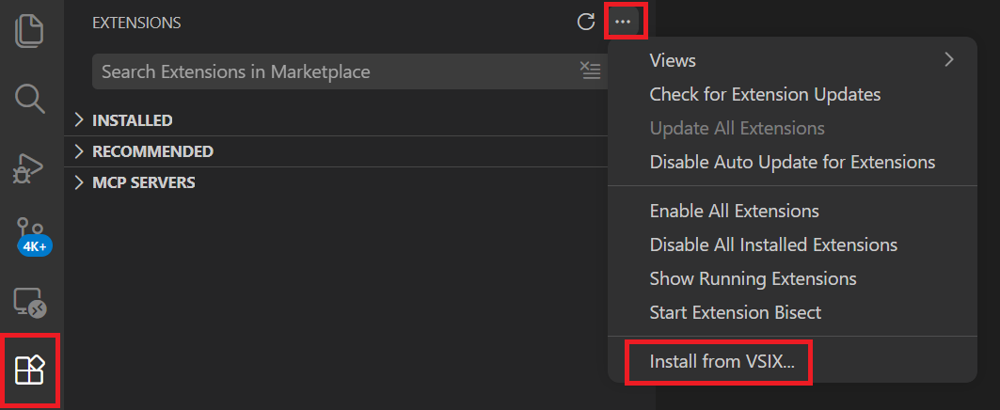
2. Locate the VSIX package in `tools/` (for example, `Astra_MCU_SDK_vscode_extension-<version>.vsix`), and click **Install**.
3. Confirm the Synaptics extension appears in the VS Code activity bar.

   

4. **Close and then reopen VS Code.**

### Uninstall old package and reinstall

1. Remove the currently imported Project directory from the workspace using the **Remove from workspace** option.

   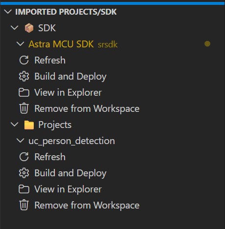
   
2. Uninstall the current extension using the **Uninstall** button.

   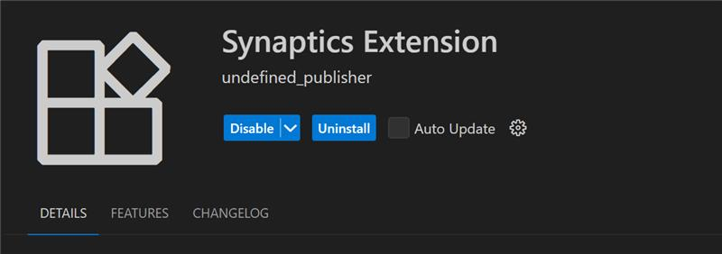
3. Close any active Webview or reload the window.
4. Install the new extension VSIX package using the steps above.

## Install Tools
<a id="install-tools"></a>

**Purpose:** Check and install the necessary tools for build, image generation, flashing, and debugging.

   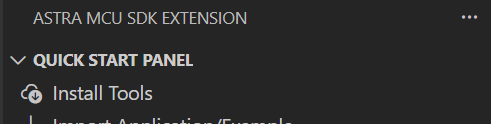 

### Tools checking

**Steps:**

1. Open the Synaptics extension sidebar and select **Install Tools**.
2. The tool check runs automatically when the panel opens.
3. You can click **Check tool status** to re-run it at any time. A loader shows progress.

**Note:** On Linux and macOS, `jq` is required to read and write `settings.json`. If it is not installed, a terminal will open and prompt for your password. Once installed, the tool check continues automatically.

**Note:** If you are updating from a older version of the extension please reinstall the required tools 

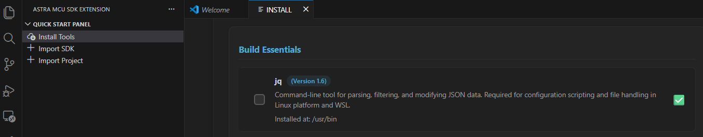

**Result:**

1.  If a tool is missing, its version does not match or a migration warning, an exclamation mark (⚠️) will be displayed, and the
    installation checkbox will be automatically selected.

2.  If a tool is already installed with the correct version, a green
    checkmark
    (✅) will appear, and the installation
    checkbox will remain unselected.

    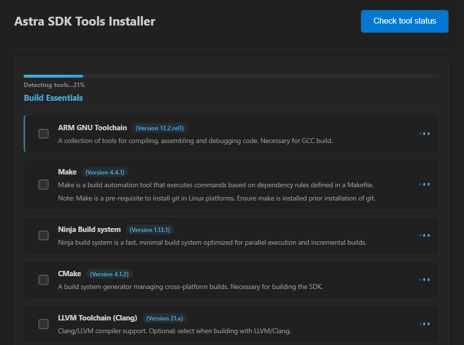

### Tools installation

**Steps:**

1. After the tools check, choose an install directory or use the default:
   - Windows: `C:/Users/<username>/SRSDK_Build_tools`
   - Linux: `/home/<username>/SRSDK_Build_tools`
   - macOS: `/Users/<username>/SRSDK_Build_tools`
2. Click **Install**. The install script runs in the **Install Script Terminal** with progress shown in the UI.

**Note:**

- On Linux and macOS, you will be prompted for your password in the **Install Script Terminal**.


**Note for AC6:**

- Arm Compiler 6 requires manual installation due to licensing constraints. Follow the steps shown in the Tools Installer webview.
    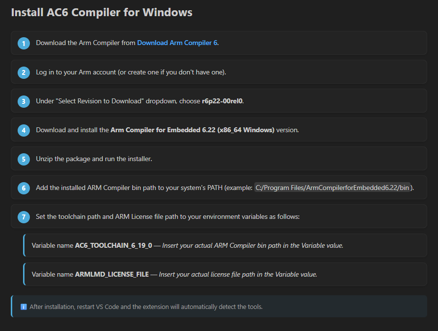

**Note for WSL Users:**
- Ensure you check the USBIPD-WIN box in the tool list to enable device passthrough for flashing video streaming and debugging.

    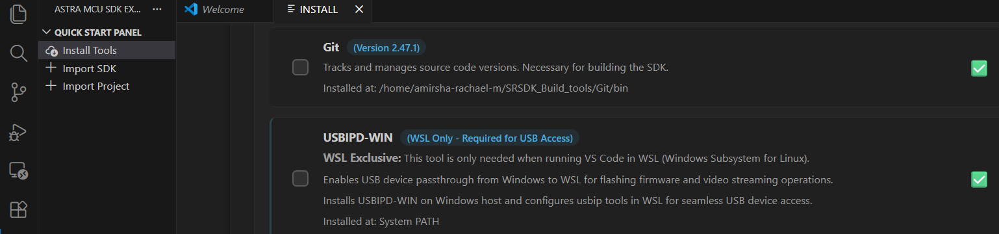

**Manual download fallback (if tool download fails):**

If a tool download fails in the **Install Script Terminal** (for example due to restricted network, proxy, or CDN access), use this fallback:

1. Run **Install** once and note the failed installer filename shown in terminal output.
2. Download the same installer manually from the official vendor website.
3. Copy the downloaded file to the extension temporary tools folder.
   - Windows example: `%USERPROFILE%/SRSDK_Build_tools/temp`
   - Linux/macOS example: `<home>/SRSDK_Build_tools/temp`
4. Run **Install** again from the tools installer page.
5. If the local file name matches the expected package, the installer uses the local file and continues installation.

**Note:** This workaround is especially useful on restricted networks where automated script downloads may be blocked.

**After installation:** Close and reopen VS Code.

**VS Code extensions installed by the tools installer:**
- C/C++ (Microsoft) for IntelliSense and debugging
- Serial Monitor
- MemoryView
- Memory Inspector CDT


## Linux USB/serial permissions (recommended)

On Linux, add your user to the `dialout` group so the flashing tools can access USB CDC/UART devices:

```bash
sudo usermod -aG dialout $USER
```

Log out and log back in (or reboot) for the group change to take effect.

## Standalone Image Flashing (No SDK Import Required)
<a id="standalone-image-flashing"></a>

**Purpose:** Flash a prebuilt image (`.bin`/`.img`) directly to the target SoC without importing the SDK into the workspace.

**Prerequisite:** Complete **Install Tools** first. This feature depends on the required flashing tools (for example OpenOCD and Python environment).

1. In the Synaptics sidebar, open **TOOLS** and click **Image Flashing**.

   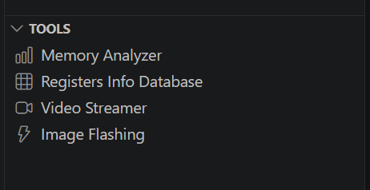

2. In the **Image Flashing** page (shown as **STANDALONE MODE**), verify the tool status indicators are ready.

   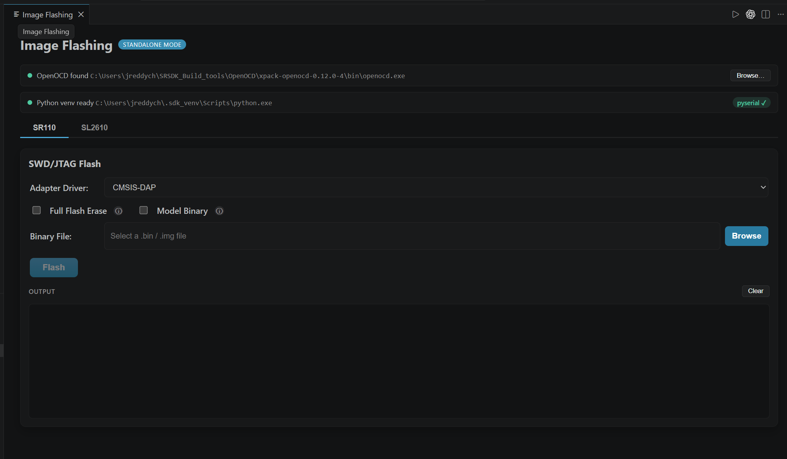

3. Select your SoC tab (**SR110** or **SL2610**) and configure the flashing options.
4. Browse and select the prebuilt image file (`.bin`/`.img`), then click **Flash**.

**Note:** This standalone flow is intended for flashing an existing image only; SDK import is not required for this operation.


## Import SDK and Project
<a id="import-sdk-and-project"></a>

**Purpose:** Configure the workspace by setting the SDK path `<sdk-root>`and importing specific project folders, either from a local folder or by cloning a repo. In this version, you can now manage the SDK and multiple projects within the same workspace.

   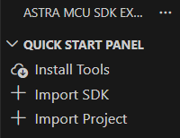

### 1. Import SDK
<a id="import-sdk"></a>
Purpose: The Import SDK action adds the SDK to your workspace and configures the SRSDK_DIR path in settings.json. If you only need to update the path without importing the physical folder, simply select the checkbox to set the SRSDK_DIR only.

**Steps:**

1. Open the **Import SDK** view from the `Quick Start Panel` in the Synaptics sidebar.

2. **Local Import:** Under the **LOCAL** tab, click **BROWSE SDK FOLDER** and select your `<sdk-root>` directory.

   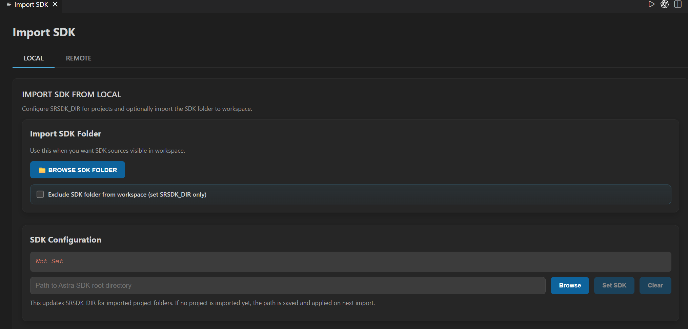

   *Note: If you do not want to import the SDK root into the workspace, select the checkbox to set the SRSDK_DIR only.*

   - If you want to clear the already set SRSDK_DIR path, click the **Clear** button.

3. **Remote Import:** Under the **REMOTE** tab, click **CLONE REPO**, paste the SDK repository URL, and select the local folder to clone into. 
   * **Note:** GitLab requires proper SSH key setup.

4. Confirm the selection. The extension updates `settings.json` and enables the **Build and Deploy** panels.

### 2. Import Project
<a id="import-project"></a>

**Purpose:** Import specific project source code into the workspace. You can now import individual projects separately rather than importing the entire examples directory.

**Steps:**

1. Click **Import Project** under the `Quick Start Panel` view.

2. **Local Import:** Click **BROWSE** and select the folder you wish to work on:
   * **Projects:** Navigate to a specific sub-folder (e.g., `<sdk-root>/examples/vision_examples/uc_person_detection`).

3. **Remote Import:** Use the **REMOTE** tab to clone a specific project repository directly into your workspace.

4. Confirm the selection. The project will appear in the **Imported Projects** view.

   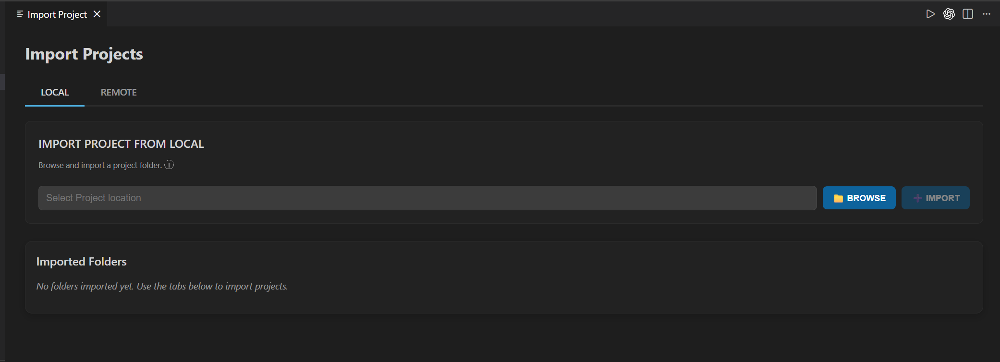

---

## Imported Projects
<a id="imported-Project"></a>

**Purpose:** Provides a quick interface for managing all projects currently imported into your VS Code workspace.

**Options:**

1. **Refresh**: Reloads the current workspace.
2. **Build and Deploy**: Opens the unified interface for the selected project.
3. **View in Explorer**: Opens the project folder in the VS Code file explorer.
4. **Remove from Workspace**: Removes the selected project from the current workspace.

   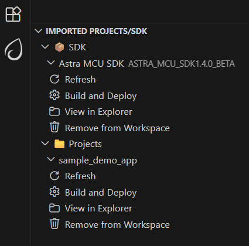

**Note:** Version 1.4 now supports importing multiple projects in the same workspace. On Windows, the suggested path length of the imported SDK folder should not exceed 100 characters to avoid build issues.

### Build and Deploy
<a id="build-and-deploy"></a>

**Purpose:** Provides a unified environment for building, image generation, flashing, and debugging.

**Steps:**

1. Once the required SDK and Project are imported, click **Build and Deploy** in the `Imported Projects` column.

   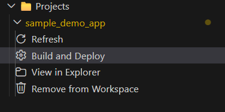

2. **Project Selection**: If multiple projects are in the workspace, ensure the correct one is selected in the dropdown menu within the Build and Deploy webview.

3. **Configuration**: Select your **Build Configuration** (e.g., Release/Debug), **Board**, and **Compiler**.

   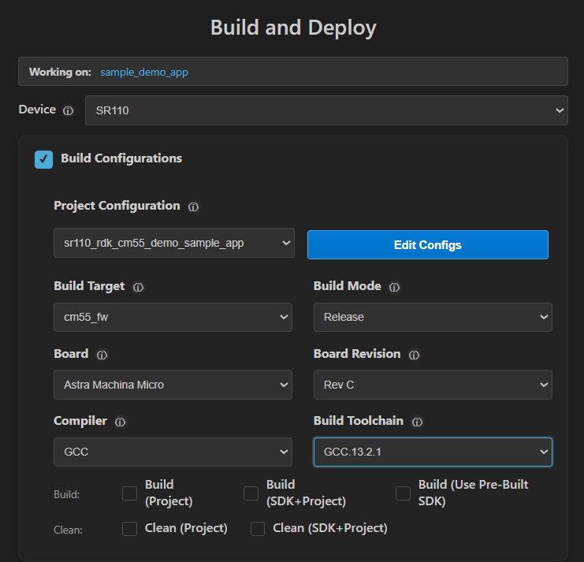

   * *Note*: If Build configurations are disabled, verify that `SRSDK_DIR` was set correctly through the **Import SDK** view.
**Workflow Description:** The Build and Deploy webview is a unified
interface for multiple operations. Users can perform either one
operation at a time or combination of operations.

**Project Build Options**

When building a project, the extension provides four distinct methods to handle SDK dependencies. Selecting the correct option ensures efficient build times and proper management of build artifacts.

   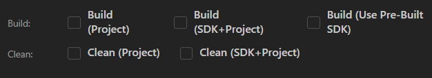

| Option | What it does | When to use it |
| :--- | :--- | :--- |
| **SDK Build (default_package)** | Generates the core foundation (compiler CMakes and basic packages) in `<sdk-root>/examples/install`. | **First-time setup:** Use this to generate the required base package before building projects. |
| **Build (SDK+Project)** | Builds the SDK components required by the app based on the app configuration, installs them into the app-local install folder, and then builds the project using that generated install package. | **First-time app build:** Use this when building an app for the first time and the required SDK components have not yet been generated for that app. |
| **Build (Project)** | Performs a local build using artifacts generated specifically for the active project. | **Development:** Use this when making changes to project-specific code and you require a fresh, isolated build. |
| **Build (Use Pre-built SDK)** | Links the project to the common install root available in `<sdk-root>/examples/install`. | **Efficiency:** Use this to share a common SDK package across multiple apps, saving time and avoiding redundant builds. |

---

🔧 **SoC-Specific Build & Deploy Workflows:**

For detailed instructions on building, flashing, debugging, and other platform-specific features, refer to your SoC's platform guide:

- **SR110 users**: See [SR110 Build and Flash with VS Code](./SR110/SR110_Build_and_Flash_with_VSCode.md#build-configurations-sr110)
- **SL2610 users**: See [SL2610 Build and Flash with VS Code](./SL2610/SL2610_Build_and_Flash_with_VSCode.md#build-configurations-sl2610)

**Common Workflow Principles:**

**Integrated workflow:** This unified webview is used to manage SDK
build, binary conversion, image flashing and debugging from a single
interface. This provides users with two modes of operation:

a.  **Unified workflow --** Users can configure all required options and
    execute the full workflow in one step. This will build the SDK,
    generate the binary, and flash it onto the device.

b.  **Isolated workflow --** Users can perform individual steps
    independently, such as building only the .axf/.elf, generating a
    binary, flashing an existing binary or debugging.

**Panels you will see (common layout):**
- **Build Configurations** (select project, build type/mode, board, compiler, toolchain, and app).
- **Image Generation** and **Image Flashing** (when supported on your SoC).
- **Debug Options** (SR110 only).

The exact options within each panel are SoC-specific; follow the platform build-and-flash guides for details.

---

## Logger
<a id="logger"></a>

The ASTRA MCU Extension has a built in LOGGER tab to connect to the logger port and visualize the logs.

1. The logger utility is available in the default bottom panel of VS Code denoted as **LOGGER**.
2. Connect the logger port (UART/DAP logger), select the COM Port from the dropdown and click *Connect*. The logs will be displayed in the display area as shown below.
   
3. The logger now has utilities to save the ongoing log session and also load previously saved log files (which are in either .txt/.log format).
4. The logs are also color coded with respect to their log level, which would enhance the ease of use for the user.

- Green - LOG_LEVEL_INFO
- Red - LOG_LEVEL_ERROR
- Yellow - LOG_LEVEL_WARN
- White - LOG_LEVEL_DEBUG

5. Apart from this there is also a utility to filter out the logs based on the above mentioned log levels for easy filtering of relevant logs.

## Memory Analyzer
<a id="memory-analyzer"></a>

**Purpose:**

The Memory Analyzer parses linker `.map` files and produces both summary and per-object analyses to help you understand flash and RAM usage. It is useful to find large symbols, inspect function-level code sizes, and generate reports for optimization.

**What the analyzer reports:**

- **Total code size (flash):** Sum of `.text` and related read-only sections.
- **Total RW data (initialized RAM):** Sum of `.data` sizes.
- **Total ZI data (uninitialized RAM / .bss):** Sum of `.bss` sizes.
- **Total RAM usage:** RW + ZI.
- **Top consumers chart:** Visual top-10 object files by total size (code + RW + ZI).
- **Memory breakdown:** Section-level view (Code, Const/ROData, RW, ZI) with simple Stack/Heap estimates shown in the UI.
- **Detailed object analysis:** Per-object cards showing `codeSize`, `rwDataSize`, `ziDataSize`, total size, and a list of discovered functions with individual sizes.

**Pre-requisites:**

- A linker `.map` file from a build (common location: `examples/build/<target>/<compiler>/<target>.map`).

**Supported compilers & parsing behaviour:**

- The analyzer understands GCC-style , AC6-style or LLVM-style map file layouts and exposes a `Compiler` selector (GCC/AC6/LLVM) in the UI. If the parser cannot find expected sections, the extension shows a warning and displays sample fallback data to demonstrate the UI.

**How to use the UI:**

1. Open the *Memory Analyzer* panel from the Synaptics extension sidebar.
2. Drag & drop a `.map` file into the upload area or use `Browse` to choose the file.
    
3. Select the compiler type in the dropdown (GCC/AC6/LLVM) and click `Analyze Memory`.
4. Wait for the loader; once complete the Memory Summary and Detailed Object Analysis panels appear.
    
5. Use the search box to filter objects/functions, change `Sort by` to reorder, and use pagination controls to navigate large result sets.

## Debugging UI
<a id="debugging-ui"></a>


This section covers generic debugging UI features available in the extension. For step-by-step setup and build/flash prerequisites, see
-  [SR110 Build and Flash with VS Code](./SR110/SR110_Build_and_Flash_with_VSCode.md#debugging-sr110).
- [SL2610 Build and Flash with VS Code](./SL2610/SL2610_Build_and_Flash_with_VSCode.md#debugging-sl2610) 

### Download and Reset Program

**Pre-requisites:**

1. Install the following extensions using the "Astra SDK Tools Installer" tab:
   - C/C++ IntelliSense, debugging, and code browsing extension in VS Code.
   - MemoryView extension to view the memory map while debugging.
   - Serial Monitor extension for viewing logs while debugging.
   - Memory Inspector CDT extension by Eclipse IDE.

2. Import an Astra MCU SDK before debugging.
3. Ensure the debug probe and the target device are properly connected.

**Steps:**

1. In the Build and Deploy webview, select the **Debug Options** panel.
2. For a unified workflow, open **Build Configurations**, choose **Debug** under **BuildType**, and enable **Debug Options**.

   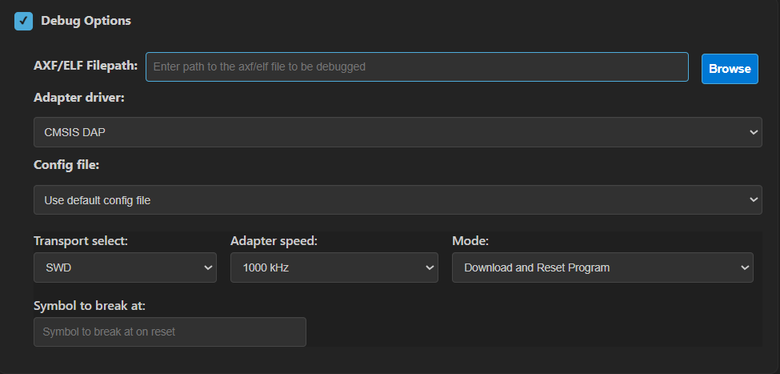

3. In **Debug Options**, select the AXF/ELF path (auto-populated if a debug build completed).
4. Choose the probe, transport, and speed settings appropriate for your setup.
5. Choose a default or custom config file. Default config files are under `tools/openocd/configs/`.

   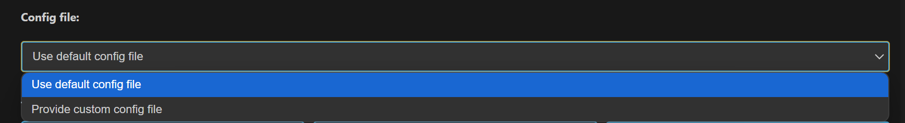

6. Select a debug mode: **Download and Reset Program**, **Attach to Running Program**, or **Attach and Halt Program**.

   

7. Click **Run** to start debugging. OpenOCD and GDB will start in separate terminals.

8. Once connected, the debugger pauses at `main`.

   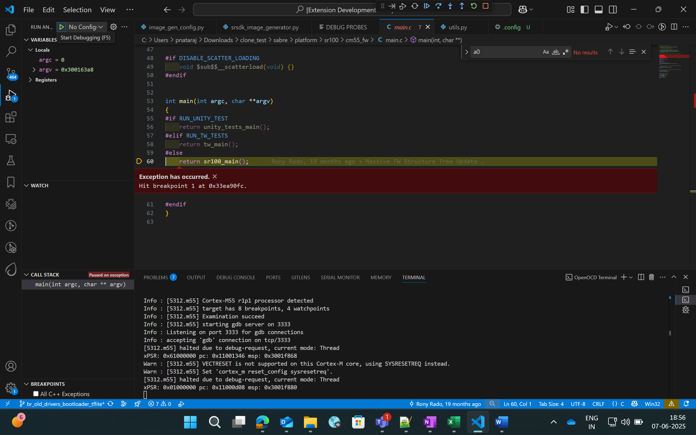

9. Use the Debug sidebar to view variables, call stack, registers, and breakpoints.

   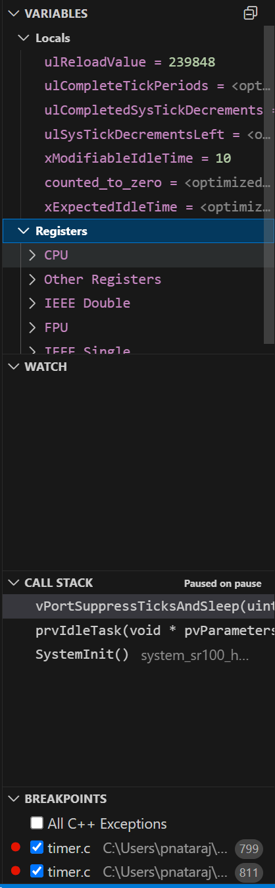

### Global Variables

**Purpose:** View global variables and values in a dedicated panel.

**Steps:**

1. Right-click in the editor and select **Show Global Variables**.

   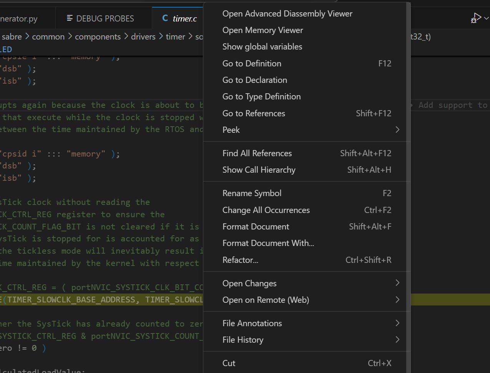

2. The panel lists global variables, addresses, types, and values. It refreshes when the debugger pauses.

   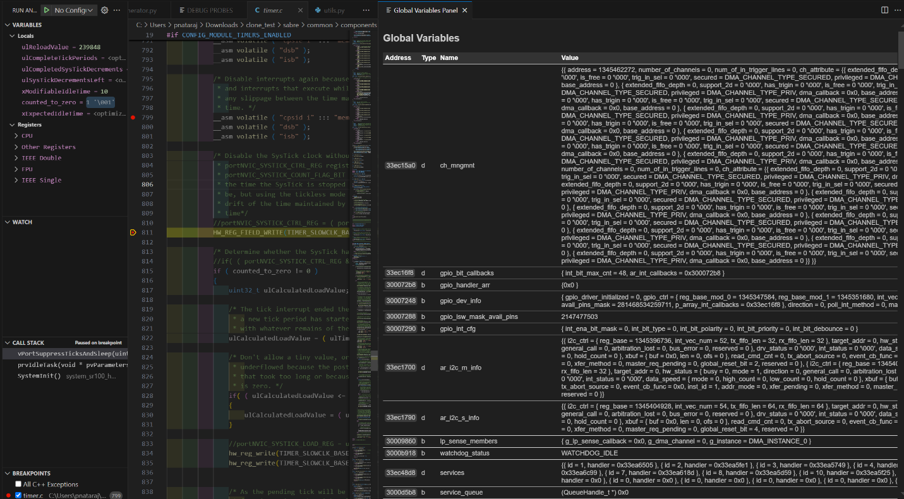

### Debug Toolbar

Once a debug session starts, the toolbar provides common controls.


**Reset options:**

| **Option** | **Description** |
|-----------|-----------------|
| **Reset and Break at Symbol** | Reset and stop at a specific symbol you enter. |
| **Reset and Halt** | Reset and halt at `Reset_Handler`. |
| **Reset and Run** | Reset and run without stopping. |

**Other options:**

- **Continue/Pause**: Continue or pause execution. On Linux/macOS, use the custom pause button if needed.

  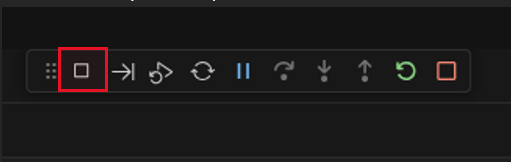

- **Step Over**, **Step Into**, **Step Out**
- **Restart**: Restart debug session at the same entry point.
- **Stop**: End the debug session.

### Memory Inspection and Manipulation

1. Right-click a variable and select **View Binary Data** to open a memory view.

   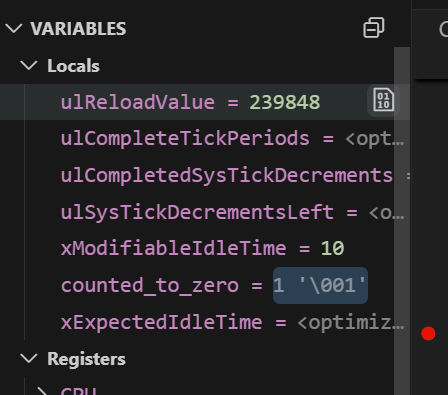

   

2. Right-click in the editor and select **Open Memory Viewer** for a split view with edit/fill controls.

   

   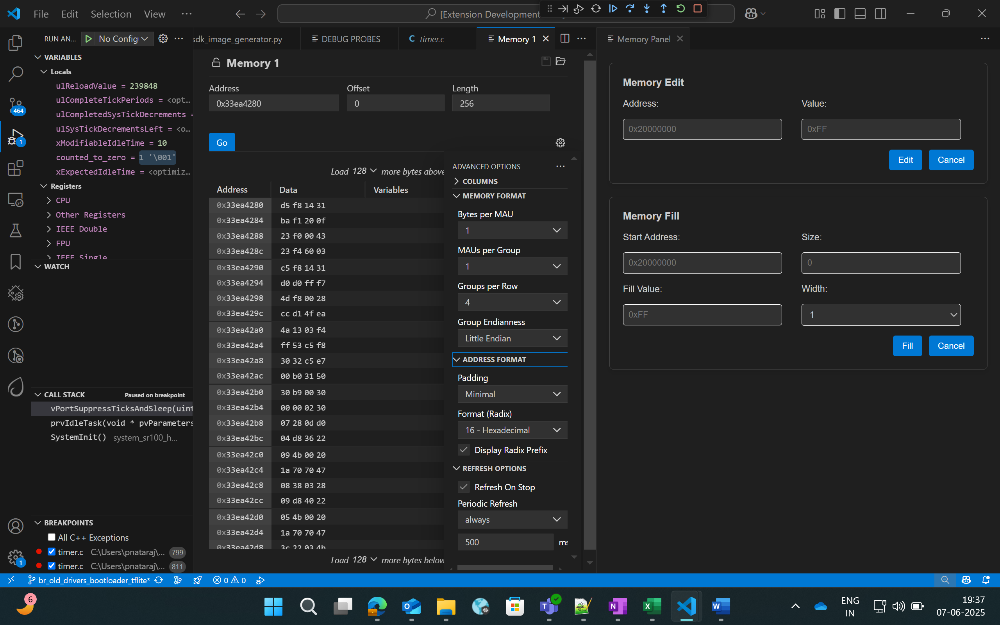

3. The left panel supports multiple formats, periodic refresh, and configurable display.

   

4. The right panel supports **Memory Edit** and **Memory Fill** operations.

**Note:** The fill value must fit the selected width. If shorter, it is padded with zeros.

### Disassembly Viewer

**Purpose:** View disassembly with navigation tools.

1. Right-click in the editor and select **Open Advanced Disassembly Viewer**.

   

2. Use the advanced panel to jump to addresses, go to PC, or navigate history.

   

### Logging (while debugging)

- To redirect logs to the OpenOCD terminal:
  - **Edit Configs** → **COMPONENTS CONFIGURATION** → **Utilities** → **LOGGER_DEFAULT_INTERFACE**.
  - Select `LOGGER_IF_CONSOLE` or `LOGGER_IF_UART_1_CONSOLE`, save, and rebuild in Debug mode.

  

- To view logs via DAP logger port:
  - Ensure Serial Monitor extension is installed.
  - Start a debug session, select the DAP logger port in Serial Monitor, and click **Start Monitoring**.

  

### Attach to Running Program

Follow the configuration steps above, then select **Attach to Running Program** as the debug mode. This attaches to an already running binary and allows pause/inspect.

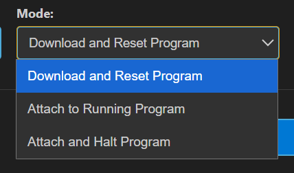

### Attach and Halt Program

Follow the configuration steps above, then select **Attach and Halt Program** to attach and pause immediately.


## Video Streamer
<a id="video-streamer"></a>

🔧 **SR110 only**

**Purpose:** Stream video output frames while a vision use case is running.

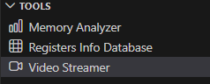

**Pre-requisites:**
- Install Python and required packages via the Astra SDK Tools Installer.
- Flash the vision use case binary and ensure the device is connected.

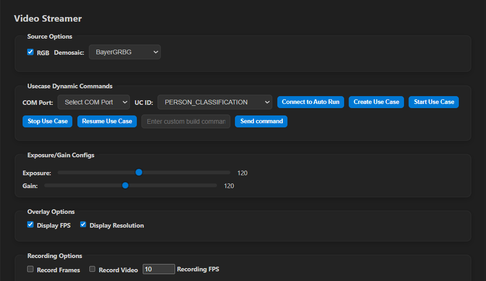

**Steps for vision use cases:**

1. **Source options:**
   - **RGB**: display frames in RGB (unchecked = grayscale).
   - **Demosaic**: select demosaic type from the dropdown.

2. **Overlay options:** Toggle FPS and Resolution overlays.

3. **Recording options:**
   - **Record Frames**: save raw and overlayed frames.
   - **Record Video**: save frames as video.
   - **Recording FPS**: control saved video frame rate.
   - Output location:
     - Windows: `C:/Users/<username>/video_stream_output`
     - Linux: `/home/<username>/video_stream_output`
     - macOS: `/Users/<username>/video_stream_output`

4. **Usecase Dynamic Commands:**
   - Select the CDC port, choose **UC ID**, and click **Create Use Case**.
   - Use **Send command** for custom commands if needed.

5. Click **Start Use Case** to begin streaming (video pops up).
6. Use **Stop Use Case** to stop; **Resume Use Case** to restart.

**Recovery if streamer freezes:**
- Close the video window, click **Stop Use Case**, press **Reset**, and try again.

**Hand Gesture Detection use case:**
1. Select **Hand Gesture Detection** in UC ID, then **Create Use Case** and **Start Use Case**.
2. Switch visualization modes (720p, 320x320, Text only).
3. Adjust exposure/gain sliders as needed.
4. If upgrading from older extension versions, reinstall Python packages (new modules are used).

**Face ID + Hand Gesture Detection use case:**
- Users can now select the combined **Face ID + Hand Gesture** use case from the UC ID dropdown. This allows for concurrent detection and visualization of both faces and gestures.

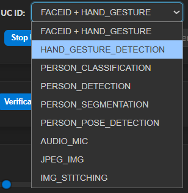

> **Note:** For non-auto-run use cases, **Create Use Case** + **Start Use Case** is sufficient. **Connect Image Source** is for auto-run use cases.


**Doorbell use case (auto-run):**
- Does not require **Create** or **Start Use Case**.
- Open **LOGGER** tab, select the logger port, and click **Connect**.
  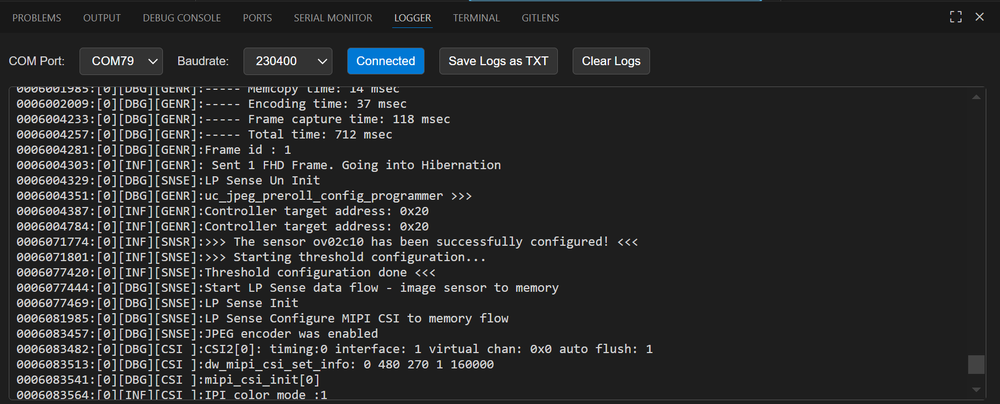
- Press **Application chip RESET** to start streaming.
- Output location:
  - Windows: `C:/Users/<username>/video_stream_output`
  - Linux: `/home/<username>/video_stream_output`
  - macOS: `/Users/<username>/video_stream_output`

**Wakeup triggers:**
- **Timer (CONFIG_WAKEUP_TRIGGER = 1):** wakes every 10 seconds.
- **GPIO (CONFIG_WAKEUP_TRIGGER = 2):** connect GND, wait 10 seconds after hibernation, then connect UART0 RX to trigger wake-up.


**Auto-run use cases:**
1. Select UC ID and click **Connect Image Source**.
2. The video stream appears automatically.

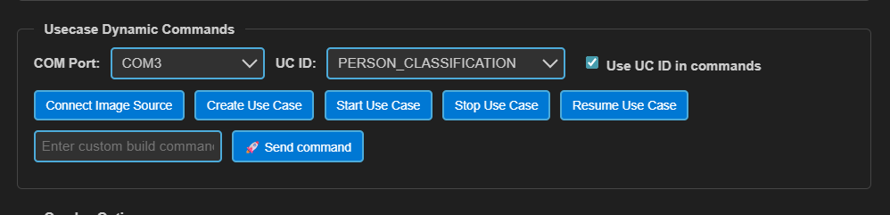

## Register Info Data Base
<a id="register-info-data-base"></a>

🔧 **SR110 only**

The Register Info Data Base view provides a searchable database of SoC/peripheral registers, bitfields, and addresses for quick reference.

**Steps to use:**
1. Open the **Register Info Data Base** view from the Synaptics extension sidebar.
2. Use the search box to find registers by name, address, or description.

**What it provides:**
- Register name, address, size, reset value, description, and bitfield breakdown.
- Bitfield details (bit ranges, access type, and notes).
- Quick-copy buttons to copy addresses or register names.
- Export current search results to CSV.

**Tips:**
1. Search by full name (`GPIO_CTRL`), partial name (`GPIO`), address (`0x40100000`), or description keyword (`enable`, `irq`).
2. Use filters to limit results by peripheral, access type (R/W/RW), or address range.

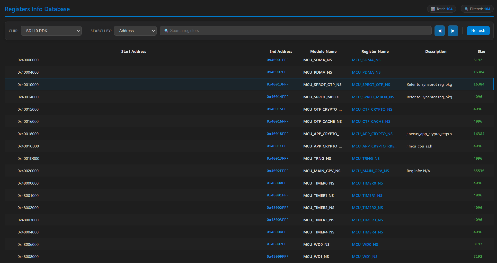

---
