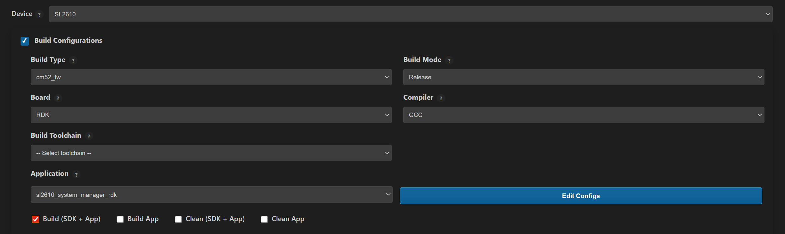
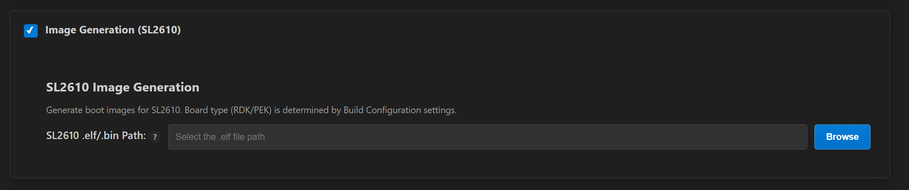

# SL2610 Build and Flash with VS Code

This document provides concise, VS Code-only steps to build, generate images, and flash SL2610 applications. For common extension features (installation, tools, SDK import, logging, memory analysis), see [Astra MCU SDK VS Code Extension User Guide](../Astra_MCU_SDK_VSCode_Extension_User_Guide.md).

Throughout this guide, `<sdk-root>` refers to the directory where you extracted or cloned the SDK.

## Table of Contents
- [Prerequisites](#prerequisites)
- [Build and Deploy Flow](#build-and-deploy-flow)
- [Environment Setup](#environment-setup)
- [Build Configurations (SL2610)](#build-configurations-sl2610)
- [Image Generation (SL2610)](#image-generation-sl2610)
- [Image Flashing (SL2610)](#image-flashing-sl2610)
  - [VS Code-Based Flashing](#vs-code-based-flashing)
- [Debugging (SL2610)](#debugging-sl2610)
- [Running Examples](#running-examples)

## Prerequisites

- Development on SL2610 requires Linux. Windows users should run VS Code in Ubuntu 22.04 via WSL; see [Astra MCU SDK - WSL User Guide](../Astra_MCU_SDK_WSL_User_Guide.md). macOS support is planned for a future release.
- SL2610 RDK connected with 5V USB-C power (PWR_IN) and USB 2.0 OTG to the host.
- Ensure hardware connections are set up per the [SL2610 Platform Guide](./SL2610_Platform_Guide.md).
- VS Code extension and tools installed. See [Setup and Install SDK using VS Code](../Astra_MCU_SDK_Setup_and_Install_VsCode.md).

## Build and Deploy Flow
The **Build and Deploy** view allows running each step one at a time or sequentially.

If you check **Build Configurations**, **Image Generation (SL2610)**, and **Image Flashing (SL2610)**, all three operations run sequentially. Each step automatically fills in required information for the next step, such as the .elf file or sub-image path.

You may also run each step one at a time if desired.

The steps do not run until the **Run** button at the bottom of the view is pressed.

## Environment Setup
1. Ensure the current working directory is the `<sdk-root>/examples` folder. Select this via the **Import Application/Example** view.
2. Set the workspace `SRSDK_DIR` to `<sdk-root>` via the **Import SDK** view so the Build UI can detect the SDK.
3. Open the **Build and Deploy** view in the Synaptics extension and set `Device` → `SL2610`.

## Build Configurations (SL2610)
<a id="build-configurations-sl2610"></a>

**Purpose:** Generate .elf for SL2610 CM52 firmware.

**Steps:**
1. Set **Build Toolchain** to `GCC.13.2.1`
2. Select desired **Application** from dropdown
3. Enable the desired Build and Clean checkboxes
- **Build (SDK + App)** builds and installs the SDK and builds the application. 
- **Build App** builds the application only and relies on previously installed SDK.

**Notes:**
- SL2610 builds only support Release mode from the extension UI.



## Image Generation (SL2610)

**Purpose:** Convert MCU executables (.elf) into System Manager sub-images.



**Steps:**
1. Build the bootloader from `<sdk-root>`:
   ```bash
   make sl2610_bootloader_rdk_defconfig BOARD=SL2610_RDK
   make build
   ```
2. Check **Image Generation (SL2610)**.
3. Confirm the pre-populated Release build path or use **Browse** to select a custom MCU executable.
   **Note** This will be automatically populated after the build completes.

**Result:**
The sub-image is generated at `out/sl2610_cm52_fw/release/sysmgr.subimg.gz`.

> Note: Image Generation for SL2610 is available only on Linux platforms.

## Image Flashing (SL2610)

Two supported methods:
1. Yocto-based flashing: [Astra Yocto Linux docs](https://synaptics-astra.github.io/doc/v/latest/linux/index.html)
2. VS Code-based flashing (recommended for SL2610 development)

### VS Code-Based Flashing

Before flashing, press and hold the **USB_BOOT** button, then press and release **RESET**.

If you are running WSL, please consult the [Astra MCU SDK - WSL User Guide](../Astra_MCU_SDK_WSL_User_Guide.md) to ensure USB ports are properly handled.

1. Check **Image Flashing (SL2610)**.

Choose the target as **M52 Image** or **Full Image** in the **Flash Target** dropdown.
- **M52 Image** = System Manager sub-image
- **Full Image** = eMMC image

**M52 Image requirements:**
- Provide the sysmgr sub-image path in the Image Flashing panel.
- Use **Browse** to select a custom sysmgr sub-image which can be found here: `out/sl2610_cm52_fw/release/sysmgr.subimg.gz`
- **Note** this will be automatically populated after image generation. 


**Full Image requirements:**
- Provide the eMMC folder path that contains `emmc_part_list` and `emmc_image_list`. The extension uses these files to determine partitions and image order for flashing.

## Debugging (SL2610)

Debugging is not yet supported in the VS Code extension for SL2610.

## Running Examples

For instructions on how to run a specific example, see that example's README.
