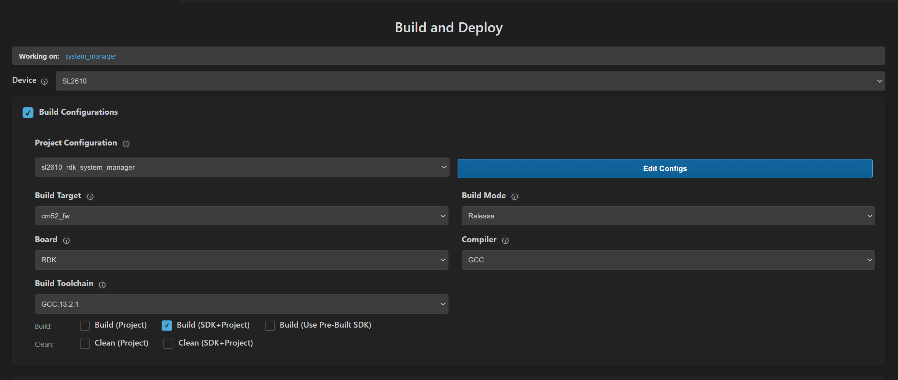
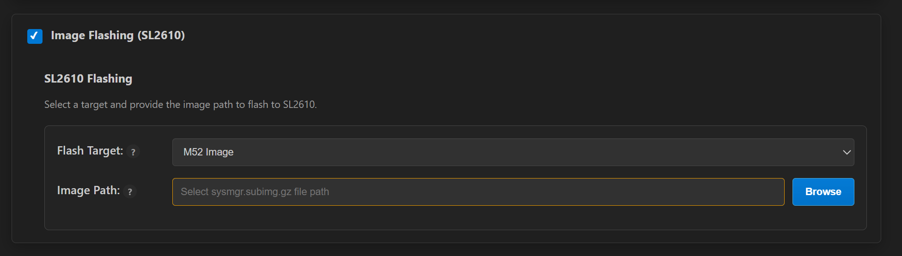

# SL2610 Build and Flash with VS Code

This document provides concise, VS Code-only steps to build, generate images, and flash SL2610 applications. For common extension features (installation, tools, SDK import, logging, memory analysis), see [Astra MCU SDK VS Code Extension User Guide](../Astra_MCU_SDK_VSCode_Extension_User_Guide.md).

Throughout this guide, `<sdk-root>` refers to the directory where you extracted or cloned the SDK.

## Table of Contents
- [Prerequisites](#prerequisites)
- [Build and Deploy Flow](#build-and-deploy-flow)
- [Environment Setup](#environment-setup)
- [Build Configurations (SL2610)](#build-configurations-sl2610)
- [Image Generation (SL2610)](#image-generation-sl2610)
- [Image Flashing (SL2610)](#image-flashing-sl2610)
  - [VS Code-Based Flashing](#vs-code-based-flashing)
- [Debugging (SL2610)](#debugging-sl2610)
- [Running Examples](#running-examples)

## Prerequisites

- Development on SL2610 requires Linux. Windows users should run VS Code in Ubuntu 22.04 via WSL; see [Astra MCU SDK - WSL User Guide](../Astra_MCU_SDK_WSL_User_Guide.md). macOS support is planned for a future release.
- SL2610 RDK connected with 5V USB-C power (PWR_IN) and USB 2.0 OTG to the host.
- Ensure hardware connections are set up per the [SL2610 Platform Guide](./SL2610_Platform_Guide.md).
- VS Code extension and tools installed. See [Setup and Install SDK using VS Code](../Astra_MCU_SDK_Setup_and_Install_VsCode.md).

## Build and Deploy Flow
The **Build and Deploy** view allows running each step one at a time or sequentially.

If you check **Build Configurations**, **Image Generation (SL2610)**, and **Image Flashing (SL2610)**, all three operations run sequentially. Each step automatically fills in required information for the next step, such as the .elf file or sub-image path.

You may also run each step one at a time if desired.

The steps do not run until the **Run** button at the bottom of the view is pressed.

## Environment Setup
1. Import the SDK root and set workspace `SRSDK_DIR` to `<sdk-root>` via the **Import SDK** view.
2. Import the project you want to build via the **Import Project** view.
3. Open **Build and Deploy** from the **Imported Projects** view and set `Device` -> `SL2610`.
4. If multiple projects are imported, select the correct project in the **Build and Deploy** project dropdown.

## Build Configurations (SL2610)

**Purpose:** Generate .elf for SL2610 CM52 firmware.

**Steps:**
1. Check the **Build Configurations** checkbox.
2. If multiple projects are imported, select the correct project in the **Build and Deploy** project dropdown.
3. Set **Build Configuration** to `Release`.
4. Select the target **Board** and **Compiler**.
5. Set **Build Toolchain** to `GCC.13.2.1` when the field is available.
6. Select the desired **Application** from the dropdown.
7. Choose the appropriate build option:

| Option | What it does | When to use it |
| :--- | :--- | :--- |
| **SDK Build (default_package)** | Generates the shared SDK foundation in `<sdk-root>/install`. | Use this first to prepare the common SDK package required by project builds. |
| **Build (SDK+Project)** | Builds the SDK components required by the app based on the app configuration, installs them into the app-local install folder, and then builds the example using that generated install package. | Use this when building an app for the first time and the required SDK components have not yet been generated for that app. |
| **Build (Project)** | Builds the active SL2610 project using project-local artifacts. | Use this during normal development when you want a fresh build for the selected project. |
| **Build (Use Pre-built SDK)** | Builds the active SL2610 project against the common install root in `<sdk-root>/install`. | Use this to reuse an existing SDK package and avoid rebuilding shared components. |

**Notes:**
- SL2610 builds only support `Release` mode from the extension UI.
- If **Build Configurations** is disabled, verify that `SRSDK_DIR` is set correctly through the **Import SDK** view.

**Result:**
- Build outputs are generated under the project's `out/sl2610_cm52_fw/release/` directory, for example `out/sl2610_cm52_fw/release/sl2610_cm52_fw.elf`.

## Image Generation (SL2610)

**Purpose:** Convert MCU executables (.elf) into System Manager sub-images.

**Bootloader prerequisite:**
Before generating an SL2610 image, build the `SL2610_RDK` bootloader once from the imported SDK folder in VS Code:

1. Open **Build and Deploy** for the imported SDK folder.
2. Set `Device` -> `SL2610`.
3. In **Build Configurations**, select:
   - **Build Target** -> `bootloader`
   - **Build Configuration** -> `Release`
   - **Board** -> `SL2610_RDK`
   - **Compiler** and **Build Toolchain** as required by your environment
   - A matching `SL2610_RDK` bootloader defconfig, for example `sl2610_bootloader_rdk_defconfig`
4. Enable **Build** and click **Run**.

**Bootloader result:**
- The bootloader build generates `out/sl2610_bootloader/release/sl2610_bootloader.elf` under the SDK root.
- This bootloader artifact is required by the SL2610 image-packaging flow.

**Steps:**
1. Open **Build and Deploy** for the imported SL2610 application project.
2. Check **Image Generation (SL2610)**.
3. Use the **Build and Deploy** workflow to generate the image together with **Build Configurations**, or run **Build Configurations** once before image generation so the Release `.elf` is available.
4. Confirm the pre-populated Release build path or use **Browse** to select a custom MCU executable.
   **Note:** This path is automatically populated after the build completes.
5. Click **Run**. The extension uses the previously built `SL2610_RDK` bootloader together with the application `.elf` to package the SL2610 image outputs.

**Result:**
- The System Manager sub-image is generated under `out/image/eMMCimg/sysmgr.subimg.gz`.
- Additional image-packaging outputs are generated under `out/image/eMMCimg/` and `out/image/usb_boot/`.

> Note: Image Generation for SL2610 is available only on Linux platforms.

## Image Flashing (SL2610)

Two supported methods:
1. Yocto-based flashing: [Astra Yocto Linux docs](https://synaptics-astra.github.io/doc/v/latest/linux/index.html)
2. VS Code-based flashing (recommended for SL2610 development)

### VS Code-Based Flashing

Before flashing, press and hold the **USB_BOOT** button, then press and release **RESET**.

If you are running WSL, please consult the [Astra MCU SDK - WSL User Guide](../Astra_MCU_SDK_WSL_User_Guide.md) to ensure USB ports are properly handled.

1. Check **Image Flashing (SL2610)**.

Choose the target as **M52 Image** or **Full Image** in the **Flash Target** dropdown.
- **M52 Image** = System Manager sub-image
- **Full Image** = eMMC image

**M52 Image requirements:**
- Provide the sysmgr sub-image path in the Image Flashing panel.
- Use **Browse** to select a custom sysmgr sub-image, typically found at `out/image/eMMCimg/sysmgr.subimg.gz`
- **Note** this will be automatically populated after image generation. 

**Full Image requirements:**
- Provide the eMMC folder path that contains `emmc_part_list` and `emmc_image_list`. The extension uses these files to determine partitions and image order for flashing.

## Debugging (SL2610)

Debugging is not yet supported in the VS Code extension for SL2610.

## Running Examples

For instructions on how to run a specific example, see that example's README.
