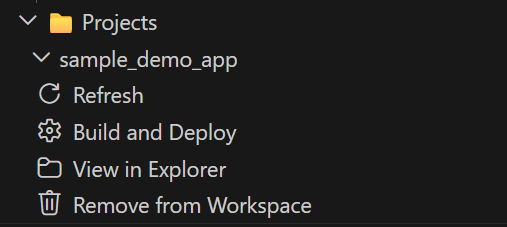
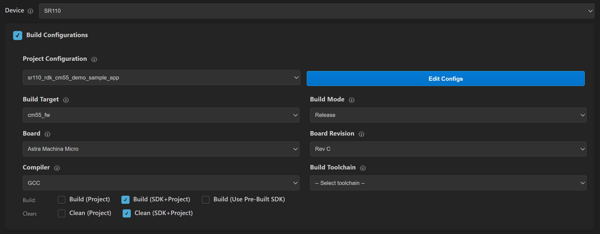
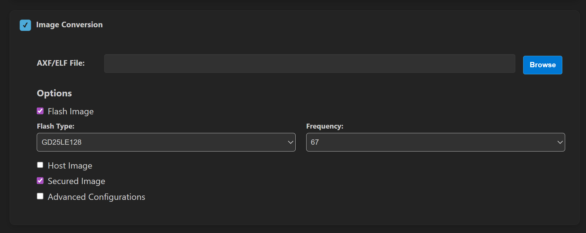
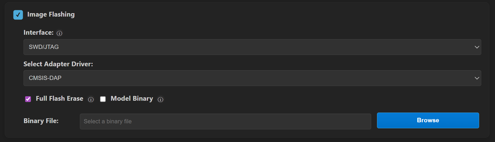
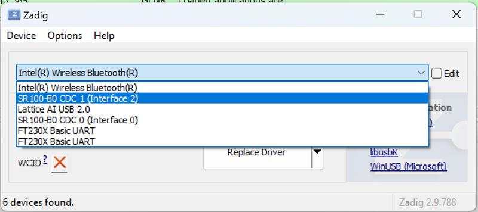

# SR110 Build and Flash with VS Code

This document provides concise, VS Code-only steps to build, convert images, flash, and debug SR110 applications. For common extension features (installation, tools, SDK import, logging, memory analysis), see [Astra MCU SDK VS Code Extension User Guide](../Astra_MCU_SDK_VSCode_Extension_User_Guide.md).

Throughout this guide, `<sdk-root>` refers to the directory where you extracted or cloned the SDK.

## Table of Contents
- [Prerequisites](#prerequisites)
- [Build and Deploy Flow](#build-and-deploy-flow)
- [Environment Setup](#environment-setup)
- [Build Configurations (SR110)](#build-configurations-sr110)
- [Image Conversion (SR110)](#image-conversion-sr110)
- [Image Flashing (SR110)](#image-flashing-sr110)
  - [SWD/JTAG (recommended for first use)](#swdjtag-recommended-for-first-use)
  - [ROM](#rom)
  - [FW mode (UART/CDC)](#fw-mode-uartcdc)
  - [Advanced options](#advanced-options)
- [Debugging (SR110)](#debugging-sr110)
- [Running Examples](#running-examples)
- [USB CDC Image Streaming (Windows)](#usb-cdc-image-streaming-windows)

## Prerequisites
- Astra Machina Micro connected per the [SR110 Platform Guide](./SR110_platform_Guide.md).
- VS Code extension and tools installed. See [Setup and Install SDK using VS Code](../Astra_MCU_SDK_Setup_and_Install_VsCode.md).

## Build and Deploy Flow
The **Build and Deploy** view allows running each step one at a time or sequentially.

If you check **Build Configurations**, **Image Conversion**, and **Image Flashing**, all three operations run sequentially. Each step automatically fills in required information for the next step, such as the .elf/.axf file or .bin file.

You may also run each step one at a time if desired.

The steps do not run until the **Run** button at the bottom of the view is pressed.

## Environment Setup
1. Import the SDK root and set workspace `SRSDK_DIR` to `<sdk-root>` via the **Import SDK** view.
2. Import the project you want to build via the **Import Project** view.
3. Open **Build and Deploy** from the **Imported Projects** view and set `Device` -> `SR110`.
4. If multiple projects are imported, select the correct project in the **Build and Deploy** project dropdown.

## Build Configurations (SR110)

**Purpose:** Generate .elf/.axf for SR110 firmware (cm55).

**Steps:**
1. Check the **Build Configurations** checkbox.
2. If multiple projects are imported, select the correct project in the **Build and Deploy** project dropdown.
3. Select the desired **Build Configuration**:
   - **Release** for flashing
   - **Debug** for GDB debugging
4. Select the target **Board** and **Board Revision**.
   - **Board Revision** is printed on the bottom of Astra Machina Micro.
5. Choose the desired **Compiler** and **Build Toolchain**.
6. Select the application from the **Application** dropdown.
7. Choose the appropriate build option:

| Option | What it does | When to use it |
| :--- | :--- | :--- |
| **SDK Build (default_package)** | Generates the shared SDK foundation in `<sdk-root>/install`. | Use this first to prepare the common SDK package required by project builds. |
| **Build (Project)** | Builds the active SR110 project using project-local artifacts. | Use this during normal development when you want a fresh build for the selected project. |
| **Build (Use Pre-built SDK)** | Builds the active SR110 project against the common install root in `<sdk-root>/install`. | Use this to reuse an existing SDK package and avoid rebuilding shared components. |

**Notes:**
- If **Build Configurations** is disabled, verify that `SRSDK_DIR` is set correctly through the **Import SDK** view.

**Result:**
- Build outputs are generated under the project's `out/sr110_<Build_Type>/<Build_Mode>/` directory.
- Example output: `out/sr110_cm55_fw/release/sr110_cm55_fw.elf`
- The executable extension depends on the selected compiler: `.elf` for GCC/LLVM and `.axf` for AC6.

## Image Conversion (SR110)

**Purpose:** Convert .axf/.elf outputs into flashable `.bin` images.

**Steps (basic):**
1. Check the **Image Conversion** checkbox.
2. The built .elf/.axf path is auto-populated after the build completes. 
3. Select **Flash Image**
4. Select **Secured**
5. For flash images, choose **Flash Type** (default `GD25LE128`) and **Flash Frequency** (default `67`).
6. Click **Run** to convert.

**Optional (advanced):**
- Convert a model bin when needed by selecting the model file and its security setting.

**Result:**
- Converted binaries are written under `out/bin_files/Output/B0_Flash/B0_flash_full_image_GD25LE128_67Mhz_secured.bin`

## Image Flashing (SR110)

1. Check the **Image Flashing** checkbox.

If you are running WSL, please consult the [Astra MCU SDK - WSL User Guide](../Astra_MCU_SDK_WSL_User_Guide.md) to ensure USB ports are properly handled.
### Interface

There are three methods to update the flash connected to the SR110 on the Astra Machina Micro development kit.

#### SWD/JTAG (recommended for first use)
The Debug IC on the Astra Machina Micro is a CMSIS-DAP device. There is an SWD connection between the Debug IC and the SR110 on the Astra Machina Micro. The CMSIS-DAP device translates USB commands on J14 to SWD commands. Via SWD the external flash can be programmed. 

**Steps:**
1. Ensure only J14 is connected
2. Open **Image Flashing** and select **Interface** → `SWD/JTAG`.
3. Select **Select Adapter Driver** → `CMSIS-DAP` (onboard Debug IC) or `J-Link`.
4. Enable **Full Flash Erase** if you need a clean flash.
5. Confirm the auto-populated **Binary File** or browse to a `.bin`.
6. Click **Run** to flash. 

**Model binaries (vision examples):**
If your application includes a model `.bin`, flash it using the **Model Binary** option and the offset specified by the example README (often `0x629000` for VGA use cases)

#### FW mode (UART/CDC)
This is the device firmware update (DFU) mechanism. For this method to work an image with the Host API and FW Update enabled must be running on the SR110. By default the communication protocol is USB CDC. This USB CDC enumerates on J13 of the Astra Machina Micro. 

1. Plug J13 into the Astra Machina Micro and press reset.
2. Open **Image Flashing** and select **Interface** → `FW Update (Application Chip)`.
3. Connect to the enumerated **CDC Port**.
4. Set **Select Command** to `Burn File to Flash`.
5. After flashing completes reset the SR110. 

**Note:** For FW update, ensure only J13 is plugged in during the update process.

#### ROM

The SR110 has a ROM boot mechanism. To enable ROM boot the boot strap must be set properly. 
1. On the Astra Machina Micro set SW1.2 in the "on" position, closer to the "KE" text on the switch. 
2. After setting the boot strap reset the SR110. 
3. Open **Image Flashing** and select **Interface** → `ROM`.
4. Connect an external USB to UART converter to J28. 
5. Select the **COM Port:** that matches your external USB to UART converter. 
6. After flashing is complete put SW1.2 back to off position and reset the SR110 to allow the code to run from external flash. 

#### Advanced options
**FW Update (Debug IC):**
This only needs to be run the first time you recieve the Astra Machina Micro or if the SDK ships with a new version. 
- In **Advanced Options**, select **FW Update (Debug IC)**.
- Choose the Debug IC COM port and select `tools/Debug_IC_FW/Debug_IC_FW.bin`
- Click **Run**, then unplug/replug the USB cable when finished.
- **Note:** When updating Debug IC FW, ensure only J14 USB is plugged in.

## Debugging (SR110)

**Steps:**
1. Build with **Debug**
2. Check the **Debug Options** and confirm the AXF/ELF path.
3. Select **Adapter driver** (`CMSIS-DAP` or `J-Link`) and keep **Use default config file** (or choose **Provide custom config file** to browse to a config).
4. Choose **Mode**:
   - **Download and Reset Program** (typical)
   - **Attach to Running Program**
   - **Attach and Halt Program**
5. Click **Run** to start the debugger.

## Running Examples

After flashing, reset the board and follow the example README for runtime instructions.

## USB CDC Image Streaming (Windows)

Some vision examples stream image data over USB CDC. On Windows, install the correct driver for the streaming port. These steps will only work once a Vision example has been flashed onto the SR110. After flashing the vison example into the SR110 ensure both J14 and J13 USB are plugged in and reset the board. 

**Hardware setup:**
- Connect **J13** for streaming
- Keep **J14** connected for power and console

**Driver setup (Zadig):**
1. Download **Zadig** from [https://zadig.akeo.ie/](https://zadig.akeo.ie/).
2. Run `zadig-2.8.exe`.
3. From **Options**, select **List All Devices**.

   

4. In the device dropdown, select **SR 100-B0 CDC 1**.

   

5. Choose **WinUSB** as the driver and click **Replace Driver**.

   

6. Reconnect the board and verify streaming in your example.