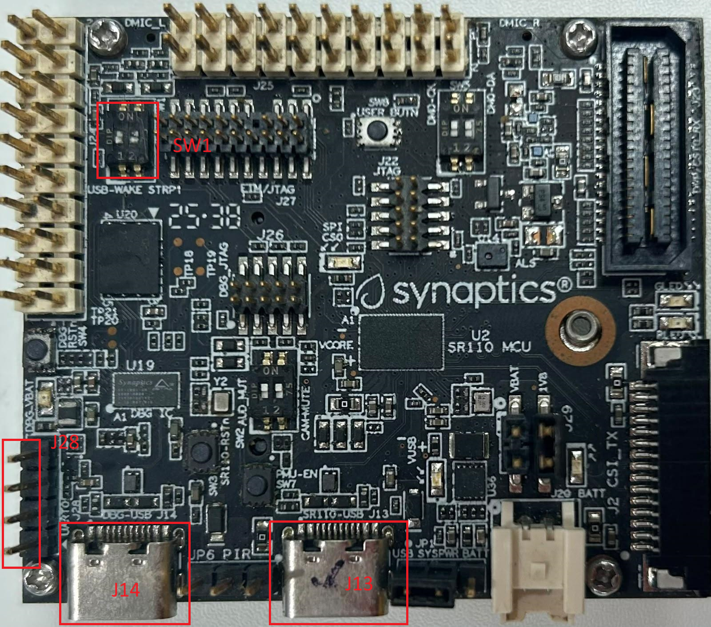

# SR110 Platform Guide

This document provides SR110-specific hardware setup and platform notes. For more detailed information on the Astra Machina Micro, see the [Astra Machina Micro User Guide](https://cp.synaptics.com/cognidox/download/NR-160034-MS-APPROVED.pdf).

For build, image conversion, flashing, and debugging workflows, use:

- [SR110 Build and Flash with CLI](./SR110_Build_and_Flash_with_CLI.md)
- [SR110 Build and Flash with VS Code](./SR110_Build_and_Flash_with_VSCode.md)

---

## Platform Overview

### SR110 Specifications

**Processor:** Arm Cortex-M55 CPU

**Memory:** External flash (e.g., GD25LE128)

**Supported Development Kits:** **SR110_RDK** (Astra Machina Micro SR Series - Rev B/C/E)

---

## Hardware Setup

### Astra Machina Micro (SR110 RDK)

<figure>

<figcaption><b>Figure 1.</b> SR110 RDK Board</figcaption>
</figure>

### Connection Steps

1. **Power and Debug Connection (J14)**
   - Connect **Debug IC USB (J14)** to your host.
   - J14 is the Debug IC **and** the onboard USB‑to‑serial bridge.
   - It enumerates as:
     - **USB‑HID (CMSIS‑DAP)** for SWD debug
     - **USB CDC #1**: USB‑to‑UART (UART1 on SR110) for console logs
     - **USB CDC #2**: Debug IC firmware update port

2. **Vision USB CDC streaming (J13)**
   - When a vision example is programmed, **J13** enumerates as **two USB CDC ports**:
     - One for **Host API control**
     - One for **image streaming**
   - **Windows:** a driver is required for the streaming port. See the Zadig steps in
     [SR110 Build and Flash with VS Code](./SR110_Build_and_Flash_with_VSCode.md#usb-cdc-image-streaming-windows).

3. **Verify Default Configuration**
   - Confirm jumpers and switches are in default positions (see the Astra Machina Micro User Guide).
   - **SW1.2 boot mode switch:**
     - Position **closer to “2”**: external flash boot (normal operation)
     - Position **closer to “KE”**: external host boot (typically UART via J28)

### Identify COM Ports

- **Windows:** Two COM ports appear in Device Manager (Debug IC FW + serial console).
- **Linux:** `/dev/ttyACM0`, `/dev/ttyACM1`
- **macOS:** `/dev/tty.usbmodem*`
> Note: Vision applications also add **two CDC ports on J13** for Host API + image streaming.

### Verify Hardware Setup

1. Confirm the board powers up when J14 is connected.
2. Verify the COM ports appear on the host.
3. Open a serial terminal (230400 baud, 8N1) and reset the board to see logs.

---

## References

- **VS Code workflows:** [Astra MCU SDK VS Code Extension User Guide](../Astra_MCU_SDK_VSCode_Extension_User_Guide.md)
- **CLI workflows:** [Astra MCU SDK User Guide](../Astra_MCU_SDK_User_Guide.md)

---

