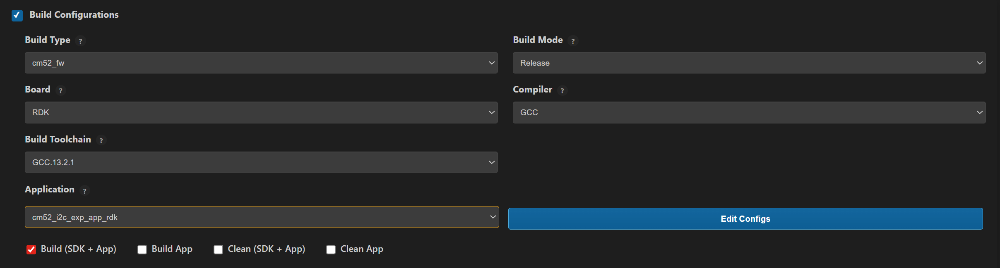

# I2C Expander Sample Application

## Description

This I2C expander sample application demonstrates GPIO output control using an external FXL6408 I2C-based GPIO expander. It runs a FreeRTOS task that periodically toggles a selected expander GPIO pin and logs the operation status for validation and debugging.

## Prerequisites
- Choose **one** setup path:
  - **CLI**: [Setup and Install SDK using CLI](../../../../docs/Astra_MCU_SDK_Setup_and_Install_CLI.md)
  - **VS Code**: [Setup and Install SDK using VS Code](../../../../docs/Astra_MCU_SDK_Setup_and_Install_VsCode.md)

## Building and Flashing the Example using VS Code

Use the VS Code flow described in the SL2610 guides and VS Code Extension guide:
- [SL2610 Platform Guide](../../../../docs/SL2610/SL2610_Platform_Guide.md)
- [Astra MCU SDK VS Code Extension User Guide](../../../../docs/Astra_MCU_SDK_VSCode_Extension_User_Guide.md)

**Build (VS Code):**
1. Open **Build and Deploy** -> **Build Configurations**.
2. Select `cm52_i2c_exp_app_rdk` in the **Application** dropdown.
3. Build with **Build (SDK + App)** for the first build, or **Build App** for rebuilds.



**Flash/Image Generation (VS Code):**
> **Note:** On Windows, use WSL for SL2610 image generation.

1. Build the SL2610 bootloader image.
2. Open **SL2610 Image Generation**, select the generated application ELF, and click **Run**.
   - This is equivalent to `make imagegen` and directly generates the system sub-image.
3. Flash/download the MCU image to target.
   - Refer: [SL2610 Platform Guide - Image Flashing](../../../../docs/SL2610/SL2610_Platform_Guide.md#image-flashing)

---

## Building and Flashing the Example using CLI

Use the CLI flow described in the SL2610 Platform Guide:
- [SL2610 Platform Guide](../../../../docs/SL2610/SL2610_Platform_Guide.md)

**Build (CLI):**
1. Build the SL2610 bootloader from SDK root:
   ```bash
   make sl2610_bootloader_rdk_defconfig BOARD=SL2610_RDK
   make
   ```
2. Build I2C expander sample app from `<sdk-root>/examples`:
   ```bash
   cd <sdk-root>/examples
   export SRSDK_DIR=<sdk-root>
   make cm52_i2c_exp_app_rdk_defconfig BOARD=SL2610_RDK BUILD=SRSDK
   ```

**Image Generation and Flash (CLI):**
> **Note:** On Windows, use WSL for SL2610 image generation.
> In WSL, ensure required tools are installed: Python, `make`, and Arm GNU toolchain.
> You can use the VS Code extension's Tools Installer in WSL, or follow
> [Linux Environment guide](../../../../docs/build_env/Astra_MCU_SDK_Linux_env_with_gcc.md) for CLI setup.

1. Build the SL2610 bootloader image.
2. Generate the system sub-image:
   ```bash
   cd <sdk-root>/examples
   export SRSDK_DIR=<sdk-root>
   make imagegen
   ```
3. Flash/download image to target.
   - Refer: [SL2610 Platform Guide - Image Flashing](../../../../docs/SL2610/SL2610_Platform_Guide.md#image-flashing)

---

## Running the Application using VS Code Extension

1. Power the board and press **RESET** after flashing.
2. For logging output, connect UART to the target and open a serial console (for example, MobaXterm).
3. I2C expander sample logs appear in the serial window.

**Expected Logs**

```
Init DDR4 @ 3200
DHL:v0p40 PT:v0p40 ID:0x21010000
USB MOUNTED
0000000000:[0][WRN][LOGR]:Changing logger interface to LOGGER_IF_UART_0
0000000000:[0][INF][SYS ]:M52:: Build Date 22-01-2026 Time 10:59:39 Commit unknown
0000000000:[0][INF][GENR]:I2C Expander GPIO Toggle Task Started
0000000005:[0][INF][GENR]:Controlling FXL6408 pin 5
0000000010:[0][INF][GENR]:FXL6408 pin 5 set to 0
0000001015:[0][INF][GENR]:FXL6408 pin 5 set to 1
0000002019:[0][INF][GENR]:FXL6408 pin 5 set to 0
0000003023:[0][INF][GENR]:FXL6408 pin 5 set to 1
0000004027:[0][INF][GENR]:FXL6408 pin 5 set to 0
0000005031:[0][INF][GENR]:FXL6408 pin 5 set to 1
0000006035:[0][INF][GENR]:FXL6408 pin 5 set to 0
0000007039:[0][INF][GENR]:FXL6408 pin 5 set to 1
0000008043:[0][INF][GENR]:FXL6408 pin 5 set to 0
0000009047:[0][INF][GENR]:FXL6408 pin 5 set to 1
0000010051:[0][INF][GENR]:FXL6408 pin 5 set to 0
0000011055:[0][INF][GENR]:FXL6408 pin 5 set to 1
0000012059:[0][INF][GENR]:FXL6408 pin 5 set to 0
0000013063:[0][INF][GENR]:FXL6408 pin 5 set to 1
0000014067:[0][INF][GENR]:FXL6408 pin 5 set to 0
0000015071:[0][INF][GENR]:FXL6408 pin 5 set to 1
0000016075:[0][INF][GENR]:FXL6408 pin 5 set to 0
```
