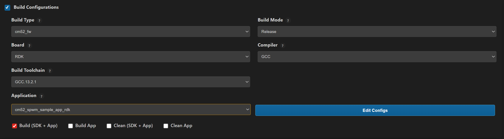
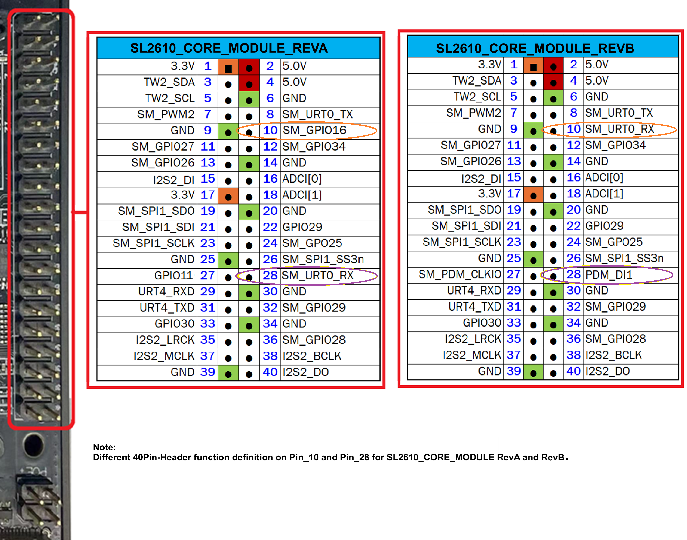
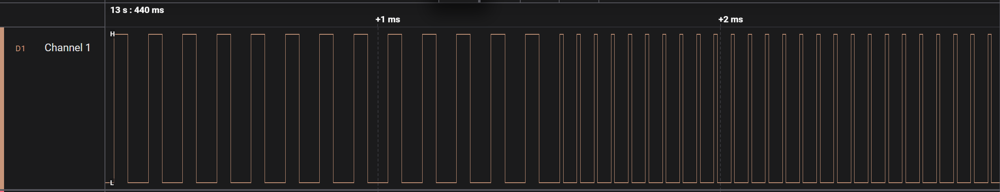
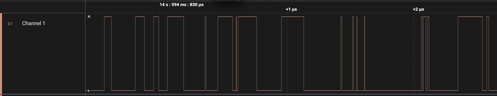
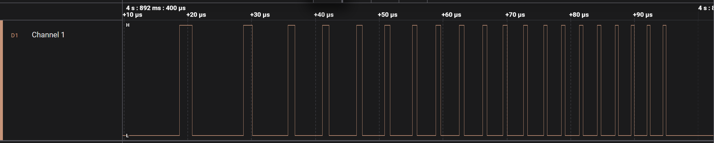

# SPWM Driver Application

## Description

The SPWM driver application provides a configurable PWM framework for generating precise and advanced pulse-width modulated waveforms. It supports multiple PWM operating modes such as Normal PWM, PWM with Dead-Time (PWM_DT), and Pseudo-Random PWM (PWM_PR). The driver enables accurate control of frequency, duty cycle, dead-time, trigger routing, interrupt generation, and descriptor-based burst operation.

The SPWM driver is intended for motor control, power electronics, and timing-critical embedded applications. It supports both continuous operation and descriptor-controlled burst generation, allowing waveform execution with minimal CPU intervention.

## Build Instructions

### Prerequisites
- [GCC build environment setup](../../../../docs/build_env/index.rst)
- [Astra MCU SDK VS Code Extension installed and configured](../../../../docs/Astra_MCU_SDK_VSCode_Extension_User_Guide.md)

### Configuration and Build Steps

### 1. Using Astra MCU SDK VS Code extension
   - Navigate to **IMPORTED REPOS** → **Build and Deploy** in the Astra MCU SDK VS Code Extension.
   - Select the **Build Configurations** checkbox, then select the necessary options.
   - Select **cm52_spwm_sample_app_rdk** in the **Application** dropdown. This will apply the defconfig.
   - Select the appropriate build and clean options from the checkboxes. Then click **Run**. This will build the SDK generating the required `.elf` or `.axf` files for deployment using the installed package.

   For detailed steps refer to the [Astra MCU SDK VS Code Extension Userguide](../../../../docs/Astra_MCU_SDK_VSCode_Extension_User_Guide.md).

   

### 2. Native build in the terminal

1. **Mode Selection (Header File Configuration)**
   In spwm_sample_app.h, select the required application mode by setting only one mode macro to 1 and keeping all others set to 0. When Descriptor Mode is required, enable it by setting ```SPWM_PWM_MODE_DESC``` to 1. Additional demo configurations become available only when this mode is enabled.
   ```bash
   #define SPWM_TIMER_MODE                     0
   #define SPWM_CAPTURE_MODE                   0
   #define SPWM_PWM_MODE                       0
   #define SPWM_PWM_DEADTIME_MODE              0
   #define SPWM_PWM_PSEUDO_RANDOM_MODE         0
   #define SPWM_PWM_MODE_DESC                  0

   /* DESCRIPTOR MODE CONFIGURATION */
   #if SPWM_PWM_MODE_DESC
      /* Demo selection - set ONE to 1, rest to 0 */
      #define SPWM_DEMO_440_480KHZ            0
      #define SPWM_DEMO_800_840KHZ            0
      #define SPWM_DEMO_100_400KHZ            0
      #define SPWM_DEMO_200_800KHZ            0
   #endif
   ```
   **Note:** Only one mode must be enabled at a time. Enabling multiple modes simultaneously may result in undefined behavior.


2. **Select the default configuration of the bootloader and build**
   This will apply the defconfig, generating the required `.elf` or `.axf` files for deployment using the installed package.
   The bootloader should be built from SRSDK root directory by running the below command.
   ```bash
   make sl2610_bootloader_rdk_defconfig BOARD=SL2610_RDK
   make
   ```

3. **Select Default Configuration and build sdk + example**
   This will apply the defconfig, then build and install the SDK package, generating the required `.elf` or `.axf` files for deployment using the installed package.
   ```bash
   make cm52_spwm_sample_app_defconfig BOARD=SL2610_RDK BUILD=SRSDK
   ```

4. **Rebuild the Application using pre-built package**
   The build process will produce the necessary .elf or .axf files for deployment with the installed package.
   ```bash
   make cm52_spwm_sample_app_defconfig BOARD=SL2610_RDK or make
   ```
   **Note:** We need to have the pre-built Astra MCU SDK package before triggering the example alone build.

## Deployment and Execution

### Generate Binary Files

- Generate firmware binaries as follows:
   - Export the SRSDK directory path.
   ```bash
   export SRSDK_DIR="path/to/sdk"
   ```
   - Navigate to the **examples** directory.
   ```bash
   cd /path/to/examples
   ```
   - Execute the following command to generate binaries.
   ```bash
   make imagegen
   ```
   - Copy the generated binaries
      - sl2610_bootloader_extras.bin
      - sl2610_bootloader_output.bin
      - sl2610_cm52_fw_extras.bin
      - sl2610_cm52_fw_output.bin
   to the VSSDK directory.

### Generate System Sub Image
   - For build steps of sysmgr sub-image in VSSDK folder refer to the [VSSDK BUILD STEPS](../../../../docs/SL2610/SL2610_Platform_Guide.md#image-generation-2).


### Loading Image to the target

#### Flash MCU Binary

To Flash the MCU Binary to target refer [SL2610 Platform Guide - MCU-Only Image Flashing](../../../../docs/SL2610/SL2610_Platform_Guide.md#image-flashing)

#### Download MCU Binary to RAM

To Download MCU Binary to RAM [SL2610 Platform Guide - Image Download](../../../../docs/SL2610/SL2610_Platform_Guide.md#image-flashing)

### Running the Application

- After successfully flashing the image, make the required hardware connections on the SL2610_RDK.
   - Hardware Setup
      - Power the device by connecting a power adapter to the PWR slot on the board.

   - UART connection:
      - Connect the UART interface card:
         - TX, RX, and GND pins of the UART adapter
         - To RX, TX (Pin 28), and GND pins on the device
      - Open MobaXterm (or equivalent) and select a serial connection to view application logs.

   - PWM Output Connections (Logic Analyzer)
      - Connect the Logic Analyzer ground wire to the GND pin (9th pin) of the RDK.
      - Connect the Logic Analyzer input wires to the 7th and/or 12th pins on the device.
         - Either pin can be used
         - Both pins may be used for PWM_DT (complementary output) mode

   

- Click the reset button in the device to make the application run.

### Sample applications logs and output

1. **Timer Application**
   - Console logs.
   ```bash
   0000000000:[0][INF]▒▒0▒J:SPWM Timer Mode Starts (group 0)
   0000000005:[0][INF]▒▒0▒J:CLKDIV[0] Setup: int_div=1 frac_div=0
   0000000011:[0][INF]▒▒0▒J:INTERRUPT Setup: group=0 intr=1
   0000000016:[0][INF]▒▒0▒J:[ISR] Callback triggered!
   0000000016:[0][INF]▒▒0▒J:[ISR] Group 0: CC0 match
   0000000016:[0][INF]▒▒0▒J:[ISR] Group 0: CC0 match
   0000000022:[0][INF]▒▒0▒J:CC0 interrupt received, counter=3034
   0000000028:[0][INF]▒▒0▒J:SPWM-Timer Sample App Completed (group 0)!
   ```

2. **Timer + Capture Application**
   - Console logs.
   ```bash
   0000000000:[0][INF]▒▒0▒K:SPWM Timer + Capture App Starts
   0000000005:[0][INF]▒▒0▒K:CLKDIV[0] Setup: int_div=1 frac_div=0
   0000000011:[0][INF]▒▒0▒K:INTERRUPT Setup: group=0 intr=1
   0000000016:[0][INF]▒▒0▒J:[ISR] Callback triggered!
   0000000016:[0][INF]▒▒0▒K:[ISR] Group 0: CC0 match
   0000000022:[0][INF]▒▒0▒K:Capture results: CC0=1108 CC1=1108
   0000000027:[0][INF]▒▒0▒K:Capture successful
   0000000031:[0][INF]▒▒0▒K:SPWM TIMER + CAPTURE Sample App Completed!
   ```

3. **PWM Sample Application**
   - Console logs.
   ```bash
   0000000000:[0][INF]▒▒0▒G:SPWM PWM-Demo Starts
   0000000004:[0][INF]▒▒0▒G:CLKDIV[0] Setup: int_div=1 frac_div=0
   0000000010:[0][INF]▒▒0▒G:SPWM Group 0 Enabled
   0000000014:[0][INF]▒▒0▒G:PWM started: Period=5000 CC0=1000
   0000000020:[0][INF]▒▒0▒G:Duty = 20.0%
   0000000023:[0][INF]▒▒0▒G:PWM Sample App Completed Successfully!
   ```

   

4. **PWM with Deadtime Application**
   - Console logs.
   ```bash
   0000000000:[0][INF]▒▒0▒G:PWM-DT App Starts
   0000000003:[0][INF]▒▒0▒G:CLKDIV[0] Setup: int_div=1 frac_div=0
   0000000010:[0][INF]▒▒0▒G:PWM-Deadtime Sample App Completed!
   ```

   

5. **PWM Pseudo Random Application**
   - Console logs.
   ```bash
   0000000000:[0][INF]▒▒0▒I:SPWM PWM Pseudo Random Mode Test Starts
   0000000005:[0][INF]▒▒0▒I:CLKDIV[0] Setup: int_div=1 frac_div=0
   0000000012:[0][INF]▒▒0▒I:INTERRUPT Setup: group=0 intr=1
   0000000017:[0][INF]▒▒0▒I:PWM Pseudo Random Mode Sample App Completed!
   ```

   

5. **PWM Ramp signal with descriptors Application**
   - Console logs.
   ```bash
   0000000000:[0][INF]▒▒0▒R:  Step 0: Period=999 CC0=200 Cycles=1 (f=100000 Hz, duty=20.00%, ~11.2µs)
   0000000008:[0][INF]▒▒0▒R:  Step 1: Period=699 CC0=140 Cycles=1 (f=142857 Hz, duty=20.00%, ~11.2µs)
   0000000017:[0][INF]▒▒0▒R:  Step 2: Period=537 CC0=107 Cycles=2 (f=185874 Hz, duty=19.89%, ~11.2µs)
   0000000026:[0][INF]▒▒0▒R:  Step 3: Period=436 CC0=87 Cycles=2 (f=228833 Hz, duty=19.91%, ~11.2µs)
   0000000035:[0][INF]▒▒0▒R:  Step 4: Period=367 CC0=73 Cycles=3 (f=271739 Hz, duty=19.84%, ~11.2µs)
   0000000044:[0][INF]▒▒0▒R:  Step 5: Period=317 CC0=63 Cycles=3 (f=314465 Hz, duty=19.81%, ~11.2µs)
   0000000053:[0][INF]▒▒0▒R:  Step 6: Period=279 CC0=56 Cycles=4 (f=357143 Hz, duty=20.00%, ~11.2µs)
   0000000062:[0][INF]▒▒0▒R:  Step 7: Period=249 CC0=50 Cycles=4 (f=400000 Hz, duty=20.00%, ~11.2µs)
   0000000071:[0][INF]▒▒0▒R:PWM ramp: 8 steps, 20 total cycles, ~90 µs burst, 58 descriptors
   0000000079:[0][INF]▒▒0▒R:CLKDIV[0] Setup: int_div=1 frac_div=0
   0000000085:[0][INF]▒▒0▒R:Initial config: ACTIVE=[Period=10 CC1=2] BUFFER=[Period=999 CC1=200]
   0000000093:[0][INF]▒▒0▒R:Building descriptor chain for configured burst time
   0000000100:[0][INF]▒▒0▒R:Descriptor chain built with 58 descriptors
   0000000107:[0][INF]▒▒0▒R:Descriptor 0 completed
   0000000108:[0][INF]▒▒0▒R:PWM-Ramp started with the configured frequency and duty cycle
   0000000116:[0][INF]▒▒0▒R:PWM-Ramp using Descriptor completed successfully!
   ```

   