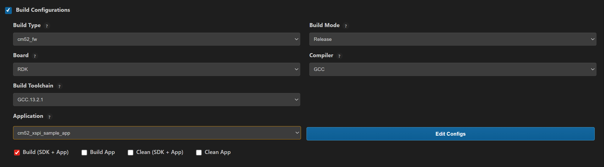

# XSPI Sample Application

## Description

This XSPI flash sample application demonstrates initialization, JEDEC ID detection, erase, read, and write operations on an external SPI-NOR flash device. It measures read/write throughput across different I/O widths and modes (SDR), while validating data integrity and logging performance results under FreeRTOS.

## Prerequisites
- Choose **one** setup path:
  - **CLI**: [Setup and Install SDK using CLI](../../../../docs/Astra_MCU_SDK_Setup_and_Install_CLI.md)
  - **VS Code**: [Setup and Install SDK using VS Code](../../../../docs/Astra_MCU_SDK_Setup_and_Install_VsCode.md)

## Building and Flashing the Example using VS Code

Use the VS Code flow described in the SL2610 guides and VS Code Extension guide:
- [SL2610 Platform Guide](../../../../docs/SL2610/SL2610_Platform_Guide.md)
- [Astra MCU SDK VS Code Extension User Guide](../../../../docs/Astra_MCU_SDK_VSCode_Extension_User_Guide.md)

**Build (VS Code):**
1. Open **Build and Deploy** -> **Build Configurations**.
2. Select `cm52_xspi_sample_app_rdk` in the **Application** dropdown.
3. Build with **Build (SDK + App)** for the first build, or **Build App** for rebuilds.



**Flash/Image Generation (VS Code):**
1. Build the SL2610 bootloader image.
2. Generate output binaries (equivalent of `make imagegen`) and collect:
   - `sl2610_bootloader_extras.bin`
   - `sl2610_bootloader_output.bin`
   - `sl2610_cm52_fw_extras.bin`
   - `sl2610_cm52_fw_output.bin`
3. Copy generated binaries to VSSDK.
4. Generate the system sub-image in VSSDK.
   - Refer: [SL2610 Platform Guide - Image Generation](../../../../docs/SL2610/SL2610_Platform_Guide.md#image-generation-2)
5. Flash/download the MCU image to target.
   - Refer: [SL2610 Platform Guide - Image Flashing](../../../../docs/SL2610/SL2610_Platform_Guide.md#image-flashing)

---

## Building and Flashing the Example using CLI

Use the CLI flow described in the SL2610 Platform Guide:
- [SL2610 Platform Guide](../../../../docs/SL2610/SL2610_Platform_Guide.md)

**Build (CLI):**
1. Build the SL2610 bootloader from SDK root:
   ```bash
   make sl2610_bootloader_rdk_defconfig BOARD=SL2610_RDK
   make
   ```
2. Build XSPI sample app from `<sdk-root>/examples`:
   ```bash
   cd <sdk-root>/examples
   export SRSDK_DIR=<sdk-root>
   make cm52_xspi_sample_app_defconfig BOARD=SL2610_RDK BUILD=SRSDK
   ```

**Image Generation and Flash (CLI):**
> **Note:** SL2610 image generation is not supported on native Windows.
> Use WSL for image generation.
> In WSL, ensure required tools are installed: Python, `make`, and Arm GNU toolchain.
> You can use the VS Code extension's Tools Installer in WSL, or follow
> [Linux Environment guide](../../../../docs/build_env/Astra_MCU_SDK_Linux_env_with_gcc.md) for CLI setup.

1. Generate binaries:
   ```bash
   cd <sdk-root>/examples
   export SRSDK_DIR=<sdk-root>
   make imagegen
   ```
2. Copy generated binaries to VSSDK:
   - `sl2610_bootloader_extras.bin`
   - `sl2610_bootloader_output.bin`
   - `sl2610_cm52_fw_extras.bin`
   - `sl2610_cm52_fw_output.bin`
3. Generate system sub-image in VSSDK.
   - Refer: [SL2610 Platform Guide - Image Generation](../../../../docs/SL2610/SL2610_Platform_Guide.md#image-generation-2)
4. Flash/download image to target.
   - Refer: [SL2610 Platform Guide - Image Flashing](../../../../docs/SL2610/SL2610_Platform_Guide.md#image-flashing)

---

## Running the Application using VS Code Extension

1. Power the board and press **RESET** after flashing.
2. For logging output, connect UART to the target and open a serial console (for example, MobaXterm).
3. XSPI sample logs appear in the serial window.

**Expected Logs**

```
# BL: MCU Init...
Init DDR4 @ 3200
DHL:v0p40 PT:v0p40 ID:0x21010000
USB MOUNTED
0000000000:[0][WRN][LOGR]:Changing logger interface to LOGGER_IF_UART_0
0000000000:[0][INF][SYS ]:Application drivers initialization complete without errors.
0000000000:[0][INF][SYS ]:sl2610 SDK version 1.3.0
0000000000:[0][INF][FLSH]:Starting XSPI Sample Application...
0000000005:[0][INF][FLSH]:Starting Flash Initialization Test...
0000000012:[0][INF][FLSH]:[FLASH] Init successful
0000000017:[0][INF][FLSH]:Flash Initialization Test Passed.
0000000022:[0][INF][FLSH]:Starting Read Device ID Test...
0000000027:[0][INF][FLSH]:[FLASH] JEDEC ID: 0x1860C8 (MFG=0xC8)
0000000033:[0][INF][FLSH]:Read Device ID Test Passed.
0000000038:[0][INF][FLSH]:Starting Read/Write Throughput Test...
0000000043:[0][INF][FLSH]:Flash RW throughput test started
0000000049:[0][INF][FLSH]:Testing throughput: IO=1-bit, Mode=SDR
0000000054:[0][INF][FLSH]:[FLASH] RW throughput test (IO=1-bit, Mode=SDR)
0000000061:[0][INF][FLSH]:Configuring XSPI instance 0 for DIRECT mode with IO=1, DTR=0
0000000069:[0][INF][FLSH]:flash_erase: addr=0x0, len=0x200
0000000074:[0][INF][XSPI]:Erase 4k @ 0x0
0000000108:[0][INF][FLSH]:[FLASH] Write: 512 bytes in 4 ms
0000000114:[0][INF][FLSH]:[FLASH] Read : 512 bytes in 1 ms
0000000119:[0][INF][FLSH]:[FLASH] RW throughput test passed
0000000124:[0][INF][FLSH]:Throughput test PASSED: IO=1-bit, Mode=SDR
0000000130:[0][INF][FLSH]:Testing throughput: IO=4-bit, Mode=SDR
0000000136:[0][INF][FLSH]:[FLASH] RW throughput test (IO=4-bit, Mode=SDR)
0000000143:[0][INF][FLSH]:Configuring XSPI instance 0 for DIRECT mode with IO=4, DTR=0
0000000151:[0][INF][FLSH]:flash_erase: addr=0x0, len=0x200
0000000156:[0][INF][XSPI]:Erase 4k @ 0x0
0000000188:[0][INF][FLSH]:[FLASH] Write: 512 bytes in 4 ms
0000000194:[0][INF][FLSH]:[FLASH] Read : 512 bytes in 1 ms
0000000199:[0][INF][FLSH]:[FLASH] RW throughput test passed
0000000204:[0][INF][FLSH]:Throughput test PASSED: IO=4-bit, Mode=SDR
0000000211:[0][INF][FLSH]:Flash RW throughput test completed, final status=0
0000000217:[0][INF][FLSH]:Read/Write Throughput Test Passed.
0000000223:[0][INF][FLSH]:All Flash Tests Completed Successfully.
0000000229:[0][INF][FLSH]:XSPI Sample Application Completed Successfully
```
