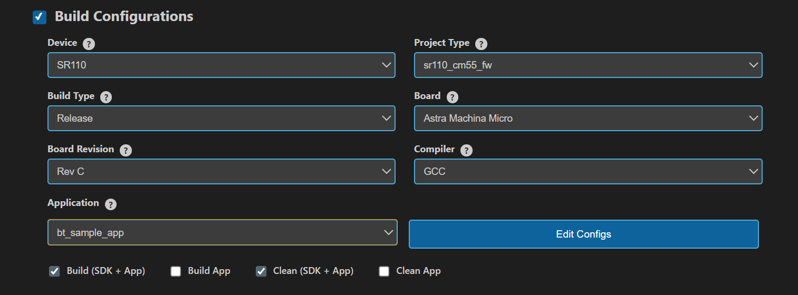
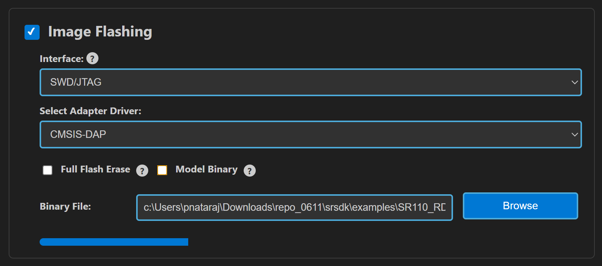
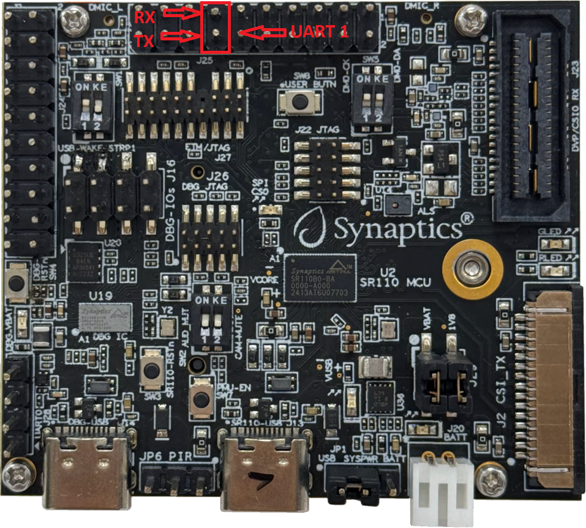
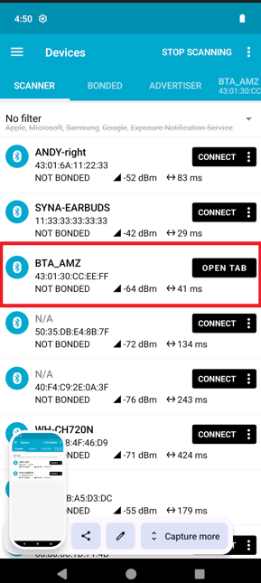
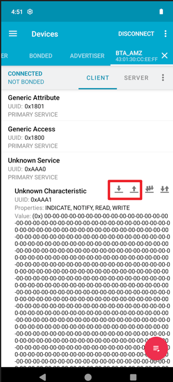

# Bluetooth Driver Sample Application

## Description

This guide provides step-by-step instructions for testing Bluetooth functionality on the Astra MCU SDK platform.

The BT sample application demonstrates Bluetooth Low Energy (BLE) functionality including:
- Bluetooth stack initialization
- GATT server operations
- BLE advertising
- Device discovery and connection
- GATT read/write operations

## Hardware Requirements
- Astra MCU SDK development board with BT capability
- Smartphone or tablet with BLE support
- USB cable for firmware flashing and console access

## Prerequisites

- [GCC/AC6/LLVM build environment setup](../../../../docs/build_env)
- [Astra MCU SDK VS Code Extension installed and configured](../../../../docs/Astra_MCU_SDK_VSCode_Extension_User_Guide.md)

### Software Requirements
- BLE scanner app on smartphone (recommended apps below)
- Serial terminal for console commands

### Recommended BLE Apps
- **Android**: nRF Connect for Mobile, BLE Scanner

### ⚠️ Important: Memory Configuration

Before building the application, you **must** increase the heap size to accommodate the Bluetooth stack requirements.

**Required Changes:**

1. **Update Linker Script** - `soc/SR110/cm55/config/sr110_cm55_hw_gcc_arm.ld`:
   ```ld
   __HEAP_MEM_SIZE = 0x00019000;  /* Increase to 100 KiB */
   ```

2. **Update Region Definitions** - `soc/SR110/cm55/include/region_defs.h`:
   ```c
   #define HEAP_MEM_SIZE             (0x00019000) /* 100 KiB */
   ```

> 💡  **Note**: The Bluetooth stack requires additional heap memory for proper operation. Without this configuration change, the application may fail to initialize or experience runtime issues.

## Building and Flashing the Example using VS Code and CLI

### Build (VS Code)
   - Navigate to **IMPORTED REPOS** → **Build and Deploy** in the Astra MCU SDK VS Code Extension.
   - Select the **Build Configurations** checkbox, then select the necessary options.
   - Select **bt_sample_app** in the **Application** dropdown. This will apply the defconfig.
   - Select the appropriate build and clean options from the checkboxes. Then click **Run**. This will build the SDK generating the required `.elf` or `.axf` files for deployment using the installed package.

   For detailed steps refer to the [Astra MCU SDK VS Code Extension Userguide](../../../../docs/Astra_MCU_SDK_VSCode_Extension_User_Guide.md) .

   

### Build (CLI)

1. **Select Default Configuration and build sdk + example**
   This will apply the defconfig, then build and install the SDK package, generating the required `.elf` or `.axf` files for deployment using the installed package.
   ```bash
   make cm55_bt_sample_app_defconfig BOARD=SR110_RDK BUILD=SRSDK
   ```

2. **Rebuild the Application using pre-built package**
   The build process will produce the necessary .elf or .axf files for deployment with the installed package.
   ```bash
   make cm55_bt_sample_app_defconfig BOARD=SR110_RDK or make
   ```
   **Note:** We need to have the pre-built Astra MCU SDK package before triggering the example alone build.

### Flash and Image Generation (VS Code)

1. **Open the Astra MCU SDK VSCode Extension and connect to the Debug IC USB port on the Astra Machina Micro Kit.**
   For detailed steps refer to the [Astra MCU SDK User Guide](../../../../docs/Astra_MCU_SDK_User_Guide.md) .
 
2. **Generate Binary Files**
   - FW Binary generation
      - Navigate to **IMPORTED REPOS** → **Build and Deploy** in Astra MCU SDK VSCode Extension.
      - Select the **Image Conversion** option, browse and select the required .axf or .elf file. If the usecase is built using the VS Code extension, the file path will be automatically populated.

      
      - Click **Run** to create the binary files.
      - Refer to [Astra MCU SDK VSCode Extension User Guide](../../../../docs/Astra_MCU_SDK_VSCode_Extension_User_Guide.md) for more detailed instructions.
   - Model Binary generation (to place the Model in Flash)
      - To generate `.bin` file for TFLite models, please refer to the [Vela compilation guide](../../../../docs/Astra_MCU_SDK_vela_compilation_tflite_model.md) .

3. **Flash the Application**

   To flash the application:

   * Select the **Image Flashing** option in the **Build and Deploy** view in the Astra MCU SDK VSCode Extension.
   * Select **SWD/JTAG** as the Interface.
   * Choose the respective image bins and click **Run**.

   

   Refer to the [Astra MCU SDK VSCode Extension User Guide](../../../../docs/Astra_MCU_SDK_VSCode_Extension_User_Guide.md) for detailed instructions on flashing.

4. **Device Reset**
   - Reset the target device

## Running the Application

1. **Identify the COM Port** Connect an external USB-to-UART adapter/dongle to your PC, then use the Device Manager to locate the assigned COM port.
   
	

2. **Open UART1 COMPORT in Teraterm** Using the COM port identified in Step 1, open TeraTerm (or any serial terminal) and connect through that port while attaching the USB-to-UART adapter to the UART1 pins as shown.

	

3. **Before running the application, make sure to connect a USB cable to the Application SR110 USB port on the Astra Machina Micro board and then press the reset button**

   - Connect to the newly enumerated COM port

4. **The BT sample application logs will then appear in the UART1 logger window.**

## Testing Procedure

Once the firmware has been built and flashed, you can verify BT functionality using the following steps:

### Step 1: Enable Bluetooth

1. Connect to the device console (UART1) via serial terminal using an external USB to UART adapter.
2. Execute the following command to enable the Bluetooth stack:

```bash
synabt enable
```
### Step 2: Start GATT Server

1. Start the GATT (Generic Attribute Profile) server:

```bash
synabt gatt_server_start
```

### Step 3: Start BLE Advertising

1. Begin BLE advertising to make the device discoverable:

```bash
synabt ble_start_adv
```

### Step 4: Device Discovery and Connection

1. **On your smartphone:**
   - Open your BLE scanner app
   - Start scanning for BLE devices
   - Look for a device named **"BTA_Amz"**
   - Tap on the device to connect

   
   

### Step 5: GATT Operations Testing

Once connected, you can test GATT read/write operations:

#### Read Operations
1. In your BLE app, navigate to the GATT services
2. Select a readable characteristic
3. Perform a read operation
4. Verify data is received

#### Write Operations
1. Select a writable characteristic
2. Enter test data (e.g., "Hello BT")
3. Perform a write operation
4. Check console for received data confirmation

**Expected Logs**

**System Initialization:**
```log
0000000124:[0][DBG][GENR]:created task for loop 0x300111e0
0000002715:[0][DBG][GENR]:created event loop 0x300111e0
0000005173:[0][INF][USB ]:Creating CDC0
0000006948:[0][INF][USB ]:USB CDC 0 created
0000008892:[0][INF][USB ]:USB CDC 1 created
0000010845:[0][INF][USB ]:USB CDC Performance Mode: Normal
0000013503:[0][INF][USB ]:USB device started
0000015524:[0][INF][XSPI]:Start XSPI (phy init, read id) with xspi_core_clk_freq 33MHz
0000019491:[0][INF][XSPI]:xspic check_flash_id: 0x1860c8
0000022036:[0][INF][XSPI]:flash : GigaDevice
0000024062:[0][INF][XSPI]:MAGIC number found, initialized with attributes from flash
0000027848:[0][INF][XSPI]:XSPI, configured_xspi_frequency 66MHz
0000030710:[0][INF][XSPI]:xspi_flash_initialized = true
0000033261:[0][WRN][LOGR]:Changing logger interface to LOGGER_IF_UART_1_CONSOLE
0000036762:[0][INF][SYS ]:
0000037958:[0][INF][SYS ]:SR110 SDK version 1.1.0
0000040164:[0][INF][SYS ]:System clock rate = 400 MHz
0000042535:[0][INF][SYS ]:soc_base_clock (slow_clk) rate = 24 MHz
0000045429:[0][INF][SYS ]:SysTick is clocked by slow_timer (XTAL) at rate of 24 MHz
0000049105:[0][INF][SYS ]:------------------------------------------
0000052128:[0][INF][SYS ]:        Synaptics Bluetooth RTOS
0000055108:[0][INF][SYS ]:------------------------------------------
0000058145:[0][DBG][GENR]:running task for loop 0x300111e0
0000060736:[0][INF][USB ]:USB Device Driver task
0000062896:[0][INF][USB ]:USB device unmounted
0000064966:[0][INF][USB ]:USB stopped
0000066682:[0][DBG][HAPI]:UART0 initialized. Baudrate achieved: 230414
0000066711:[0][INF][HAPI]:------------------------------------------
0000066736:[0][INF][HAPI]:       Host API Router task
0000066761:[0][INF][HAPI]:------------------------------------------
0000066785:[0][INF][HAPI]:Active interface is USB
0000081166:[0][INF][HAPI]:A new service was registered, service ID: 11.
0000081192:[0][DBG][GENR]:FW UPDATE TASK (srv_id = 11)
0000086744:[0][INF][SYS ]:------------------------------------------
0000089771:[0][INF][SYS ]:            Hello  ASTRA
0000092799:[0][INF][SYS ]:------------------------------------------
0000095826:[0][INF][SYS ]:System initialization done
0000246205:[0][INF][USB ]:USB device mounted
0000246231:[0][INF][USB ]:USB started
0000270712:[0][DBG][GENR]:no handlers have been registered for event USB_CDC_0_EVENTS:3 posted to loop 0x300111e0
000000001.008:vTaskShell, 1028
```

**Command: `synabt enable`**
```log
000000009.908:recv cmd 13:synabt enable
000000009.908:[CLI][DEBUG] syna_bt_cli_tbl[0].handler called with argc=0, argv[2]=(null)

000000009.910:btapp_init free heap size:129192:free memory 0

000000009.913:Start Boot BT Stack

000000009.915:BTE_LoadGki

000000009.916:Starting UPIO initialization...
000000009.918:GPIO module initialized for port 0
000000009.920:Waiting for system boot completion before SWIRE_DATA reconfiguration...
000000011.924:GPIO 25 successfully configured for BT_REGON
000000011.924:GPIO 25 successfully configured for BT_REGON
000000012.026:UPIO initialization completed successfully
000000012.031:UPIO_Set type=4, pio=4, state=OFF
000000012.031:BT_REGON (GPIO25) set to 0
000000012.082:UPIO_Set type=4, pio=4, state=ON
000000012.082:BT_REGON (GPIO25) set to 1
000000012.133:UPIO_Restore_CTS_Setting: Not implemented
000000012.133:GKI_create_task:GKI Check task_id 1

000000012.134:GKI_create_task func=0x33ea4e05  id=1  name=gki_timer_task  stack=0x3000ded0  stackSize=1024

000000012.139:GKI_create_task[1:1]!!!!

000000012.151:BootEntry:BTE_CreateTasks

000000012.151:[BTE_CreateTasks]:BTU_CreateTasks

000000012.152:GKI_create_task:GKI Check task_id 3

000000012.154:GKI_create_task func=0x33ec7661  id=3  name=btu_task  stack=0x0  stackSize=16384

000000012.158:GKI_create_task[3:3]!!!!

000000012.160:[BTE_CreateTasks]:HCISU_CreateTasks

000000012.162:GKI_create_task:GKI Check task_id 5

000000012.164:GKI_create_task func=0x33ea34e5  id=5  name=hci_su_task  stack=0x0  stackSize=2048

000000012.169:GKI_create_task[5:5]!!!!

000000012.171:[BTE_CreateTasks]:BTTAPP_CreateTasks

000000012.173:GKI_create_task:GKI Check task_id 2

000000012.175:GKI_create_task func=0x33ea19c5  id=2  name=btapp_task  stack=0x0  stackSize=1024

000000012.179:GKI_create_task[2:2]!!!!

000000012.191:Initializing BT UART transport at 115200 baud
000000012.191:UART initialized: requested=115200, achieved=115207
000000012.193:BT UART transport initialized successfully
000000012.196:GKI_create_task:GKI Check task_id 6

000000012.198:GKI_create_task func=0x33ea5c8d  id=6  name=hci_uart_task  stack=0x0  stackSize=2048

000000012.205:GKI_create_task[6:6]!!!!

000000012.224:bte_post_reset, bte_patchram_has_dl:0

000000012.228:Reconfiguring UART baud rate to 3000000
000000012.228:Baud rate reconfigured: requested=3000000, achieved=3030303
000000012.231:bte_baud_update_cback status=0

000000017.757:Reconfiguring UART baud rate to 115200
000000017.757:Baud rate reconfigured: requested=115200, achieved=115207
000000017.764:Reconfiguring UART baud rate to 3000000
000000017.764:Baud rate reconfigured: requested=3000000, achieved=3030303
000000017.773:bte_post_reset, bte_patchram_has_dl:1

000000017.773:btapp_dm_post_reset

000000017.777:0017.777 [APPL  ] btapp_cfg_init: tBTAPP_CFG size:104

000000017.780:0017.780 [APPL  ] btapp_cfg_set_accept_auth_enable accept_auth_enable:0

000000017.783:0017.783 [APPL  ] Local Addr:43:01:30:cc:ee:ff

000000017.786:BT stack lib version: 1.0.1_AMAZON_FREERTOS_SR110-(ASTRA_MCU_SDK1.0:ead4343)

000000017.789:BT stack lib built at 15:19:44 Sep 17 2025

000000017.792:SYN4612A1_001.002.003.0020.0000_Generic_UART_37_4MHz_wlbga_REF_sLNA_iLNA_ANT0_secure_sign_btpatch, size:137165

000000017.798:BT controller name:4612A1_Generic_UART_37_4MHz_wlbga_REF_sLNA_iLNA_ANT0 [Baseline: 0020]

000000017.887:0017.887 [APPL  ] bta_dm_ctrl_features_rd_cmpl_cback  status = 0

000000017.896:0017.896 [APPL  ]  bta_sys_hw_btm_cback was called with parameter: 0

000000017.899:bte_dev_reset_cplt

000000017.899:0017.899 [APPL  ] bta_sys_sm_execute state:0, event:0x2

000000018.086:btapp_init stack bring-up success!

000000018.086:[btapp_startup]:btapp_init_device_db

000000018.087:BTA_BrcmInit!

000000018.089:0018.089 [APPL  ] BTA_BrcmInit

000000018.091:BTA_EnableBluetooth

000000018.095:0018.095 [APPL  ] bta_sys_sm_execute state:2, event:0x0

000000018.098:0018.098 [APPL  ] bta_dm_sys_hw_cback with event: 1

000000018.101:btapp_dm_security_cback  event 0

000000018.101:btapp_dm_init_continue privacy_enabled = 0

000000018.104:0018.104 [APPL  ] BTA_DmBleScatternetEnable: 1

000000018.107:0018.107 [APPL  ] Adding UUID=0x1200 into EIR

000000018.110:0018.110 [APPL  ] BTA is generating EIR

000000018.113:0018.113 [APPL  ] bta_dm_eir_update_uuid UUID bit mask=0x00000004 00000000

000000018.119:local bdaddr 43:01:30:cc:ee:ff

000000018.119:auth_req:4

000000018.122:btapp_init success!

000000018.122:btapp_init free heap size:35136

000000018.126:0018.126 [APPL  ] bta_sys_hw_api_enable for 0, active modules 0x0001

000000018.129:0018.129 [APPL  ] BTA is generating EIR

000000018.132:0018.132 [APPL  ] bta_brcm_evt_hdlr :0x0005

000000018.183:btapp_dm_security_cback  event 20

000000018.189:btapp_dm_security_cback  event 21
```

**Command: `synabt gatt_server_start`**
```log
000000027.724:recv cmd 24:synabt gatt_server_start
000000027.724:[CLI][DEBUG] syna_bt_cli_tbl[14].handler called with argc=0, argv[2]=(null)

000000027.727:0027.727 [APPL  ] BTA_DmSetBleAdvParam: 32, 64

000000027.732:0027.732 [APPL  ] bta_gatts_enable: num of handle range added=0

000000027.735:0027.735 [APPL  ] bta_gatts_co_srv_chg cmd=4

000000027.738:0027.738 [APPL  ] register application first_unuse rcb_idx = 0

000000027.741:btapp_gatts_cback event:0

000000027.744:GATTS registered...sif:3, status:0

000000027.747:0027.747 [APPL  ] create service rcb_idx = 0

000000027.747:btapp_gatts_cback event:7

000000027.750:btapp_gatts_cback BTA_GATTS_CREATE_EVT

000000027.753:0027.753 [APPL  ] bta_gatts_find_srvc_cb_by_srvc_id  service_id=40

000000027.756:0027.756 [APPL  ] bta_gatts_find_srvc_cb_by_srvc_id  found service cb index =0

000000027.762:btapp_gatts_cback event:9

000000027.762:btapp_gatts_cback BTA_GATTS_ADD_CHAR_EVT status:0, attr_id:42

000000027.765:0027.765 [APPL  ] bta_gatts_find_srvc_cb_by_srvc_id  service_id=40

000000027.771:0027.771 [APPL  ] bta_gatts_find_srvc_cb_by_srvc_id  found service cb index =0

000000027.774:btapp_gatts_cback event:10

000000027.777:btapp_gatts_cback BTA_GATTS_ADD_CHAR_DESCR_EVT status:0, attr_id:43

000000027.780:0027.780 [APPL  ] bta_gatts_find_srvc_cb_by_srvc_id  service_id=40

000000027.783:0027.783 [APPL  ] bta_gatts_find_srvc_cb_by_srvc_id  found service cb index =0

000000027.789:0027.789 [APPL  ] bta_gatts_start_service service_id= 40

000000027.792:btapp_gatts_cback event:12

000000027.795:btapp_gatts_cback BTA_GATTS_START_EVT
```

**Command: `synabt ble_start_adv`**
```log
000000025.830:recv cmd 20:synabt ble_start_adv
000000025.830:[CLI][DEBUG] syna_bt_cli_tbl[2].handler called with argc=0, argv[2]=(null)

000000025.833:0025.833 [APPL  ] BTA_DmSetBleAdvParam: 32, 64
```

**GATT Write Operation from Connected Device:**
```log
000000105.866:btapp_gatts_proc_write handle:42, len:8, offset:0, need_rsp:1, is_prep:0

000000105.872:Peer wrote content:   |hello!!!|

000000105.872:0105.872 [APPL  ] bta_gatts_send_rsp found p_rcb

000000105.875:btapp_gatts_cback event:24
```
