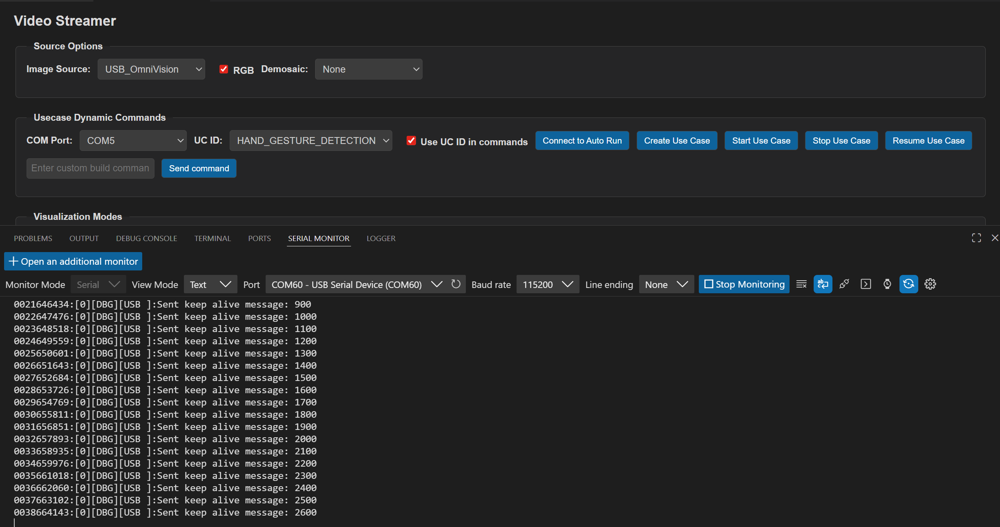

# USB CDC TX Counter Sample App

## Description

This sample application demonstrates USB CDC (virtual COM port) transmit functionality by periodically sending an incrementing keep-alive message while the USB connection is active.

## Prerequisites
- Choose **one** setup path:
  - **CLI**: [Setup and Install SDK using CLI](../../../../docs/Setup_and_Install_SDK_using_CLI.md)
  - **VS Code**: [Setup and Install SDK using VS Code](../../../../docs/Setup_and_Install_SDK_using_VSCode.md)

## Building and Flashing the Example using VS Code

Use the VS Code flow described in the SR110 guide and the VS Code Extension guide:
- [SR110 Build and Flash with VS Code](../../../../docs/SR110/SR110_Build_and_Flash_with_VSCode.md)
- [Astra MCU SDK VS Code Extension User Guide](../../../../docs/Astra_MCU_SDK_VSCode_Extension_User_Guide.md)

**Build (VS Code):**
1. Open **Build and Deploy** -> **Build Configurations**.
2. Select **usb_cdc_tx_counter_sample_app** in the **Application** dropdown.
3. Build with **Build (SDK + App)** for the first build, or **Build App** for rebuilds.

**Flash (VS Code):**
1. Use **Image Conversion** to generate the flash image.
2. Use **Image Flashing** (SWD/JTAG) to flash the firmware image.

---

## Building and Flashing the Example using CLI

Use the CLI flow described in the SR110 guide:
- [SR110 Build and Flash with CLI](../../../../docs/SR110/SR110_Build_and_Flash_with_CLI.md)

**Build (CLI):**
1. From `<sdk-root>/examples`, build the example:
   ```bash
   cd <sdk-root>/examples
   export SRSDK_DIR=<sdk-root>
   make cm55_usb_cdc_tx_counter_sample_app_defconfig BOARD=SR110_RDK BUILD=SRSDK
   ```

**Flash (CLI):**
1. Activate the SDK venv (required for image generation tools):
   ```bash
   # Linux/macOS
   source <sdk-root>/.venv/bin/activate
   # Windows PowerShell
   .\.venv\Scripts\Activate.ps1
   ```
2. Generate the flash image:
   ```bash
   cd <sdk-root>/tools/srsdk_image_generator
   python srsdk_image_generator.py \
     -B0 \
     -flash_image \
     -sdk_secured \
     -spk "<sdk-root>/tools/srsdk_image_generator/B0_Input_examples/spk_rc4_1_0_secure_otpk.bin" \
     -apbl "<sdk-root>/tools/srsdk_image_generator/B0_Input_examples/sr100_b0_bootloader_ver_0x012F_ASIC.axf" \
     -m55_image "<sdk-root>/examples/out/sr110_cm55_fw/release/sr110_cm55_fw.elf" \
     -flash_type "GD25LE128" \
     -flash_freq "67"
   ```
3. Flash the firmware image:
   ```bash
   cd <sdk-root>
   python tools/openocd/scripts/flash_xspi_tcl.py \
     --cfg_path tools/openocd/configs/sr110_m55.cfg \
     --image tools/srsdk_image_generator/Output/B0_Flash/B0_flash_full_image_GD25LE128_67Mhz_secured.bin \
     --erase-all
   ```

---

## Running the Application using VS Code Extension

1. In VS Code, open **Video Streamer** from the Synaptics sidebar.

   

2. Press **RESET** on the board after flashing.
3. For logging output, click **SERIAL MONITOR** and connect to the **DAP logger** port on J14.
   - To make it easier to identify, ensure **only J14** is plugged in (not J13).
   - The logger port is not guaranteed to be consistent across OSes. As a starting point:
     - **Windows:** try the lower-numbered J14 COM port first.
     - **Linux/macOS:** try the higher-numbered J14 port first.
   - If you do not see logs after a reset, switch to the other J14 port.
3. Select the USB CDC COM port on list of COM ports and select **Connect to Auto Run** to observe periodic keep-alive counter messages.

   

## Functionality

- Periodically transmits incrementing keep-alive messages over USB CDC.
- Useful for basic link validation and CDC transmit path testing.
