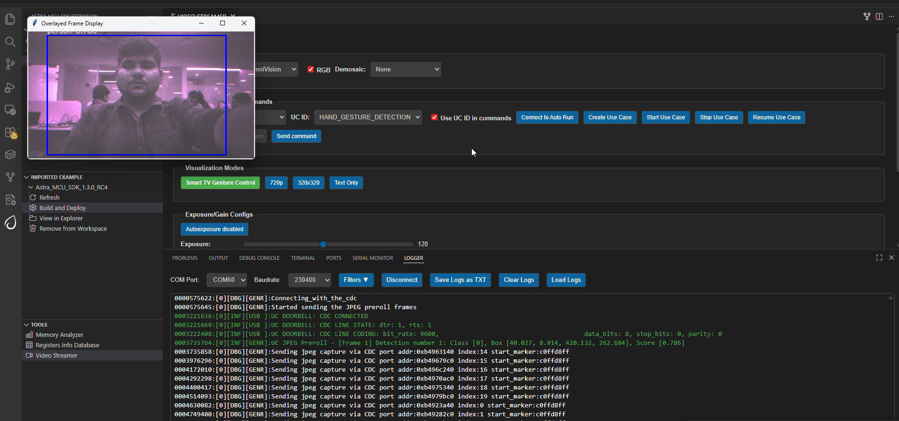
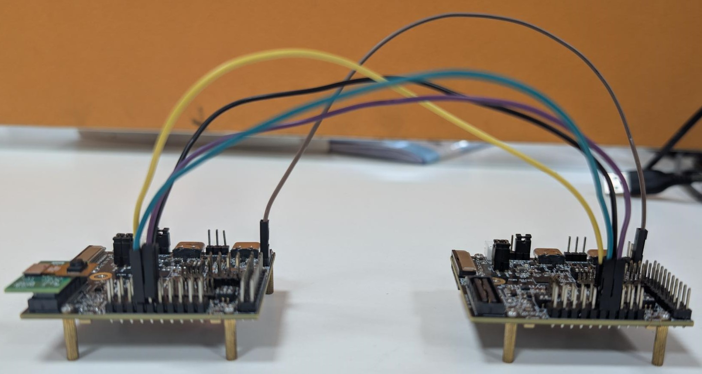
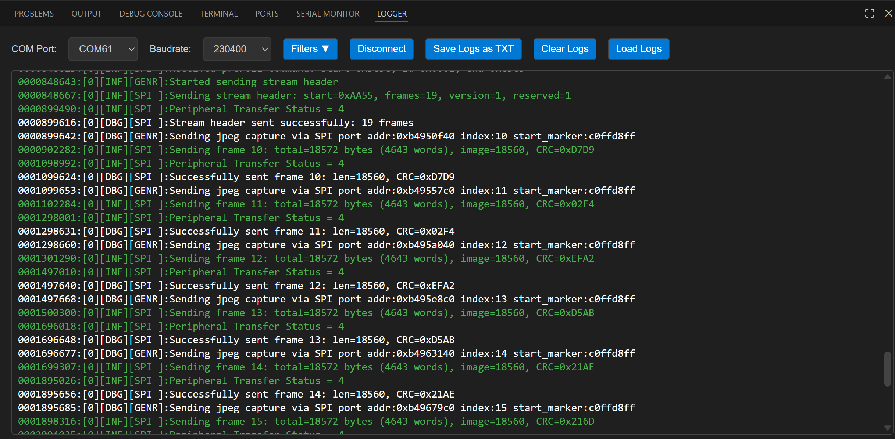
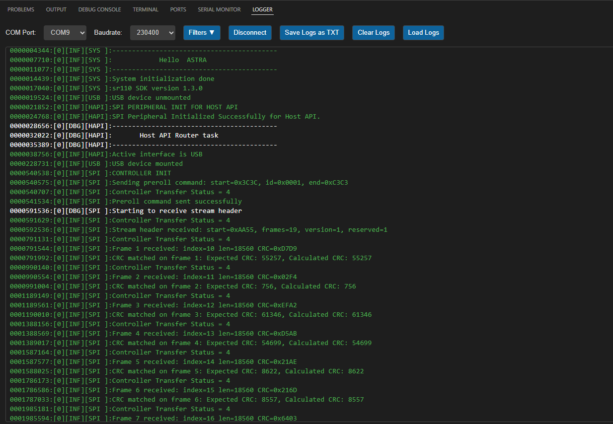

# Doorbell ML Application

## Description

The Doorbell sample application combines the `UC_JPEG_PREROLL` and `IMAGE_STITCHING` use cases to detect a person in the camera field of view and capture Full HD (FHD) images when detection occurs.

Captured images can be delivered in two modes:

| Delivery Mode | Description | Tools for Visualization |
|---|---|---|
| USB CDC (to Host PC) | Sends images via USB CDC to a host PC. | VS Code Extension |
| SPI to Controller | Sends images over SPI to another Astra Machina Micro acting as controller and receives frames for validation/logging. | Logger |

## Prerequisites

- Choose **one** setup path:
  - **CLI**: [Setup and Install SDK using CLI](../../../../docs/Astra_MCU_SDK_Setup_and_Install_CLI.md)
  - **VS Code**: [Setup and Install SDK using VS Code](../../../../docs/Astra_MCU_SDK_Setup_and_Install_VsCode.md)

## Building and Flashing the Example using VS Code

Use the VS Code flow described in the SR110 guide and the VS Code Extension guide:
- [SR110 Build and Flash with VS Code](../../../../docs/SR110/SR110_Build_and_Flash_with_VSCode.md)
- [Astra MCU SDK VS Code Extension User Guide](../../../../docs/Astra_MCU_SDK_VSCode_Extension_User_Guide.md)

**Build (VS Code):**
1. In VS Code Extension, go to **Build and Deploy** -> **Build Configurations**.
2. Select **doorbell** in the **Application** dropdown.
3. Configure wakeup mode in `uc_jpeg_preroll.c` using `CONFIG_WAKEUP_TRIGGER`:
   - `1` for timer-based wakeup
   - `2` for GPIO-based wakeup
4. Build with **Build (SDK + App)** for the first build, or **Build App** for rebuilds.

**Flash (VS Code):**
1. Use **Image Conversion** to generate firmware binary.
2. Generate model binary from TFLite, if needed:
   - [Vela compilation guide](../../../../docs/Astra_MCU_SDK_vela_compilation_tflite_model.md)
3. In **Image Flashing**, flash firmware image.
4. Flash model binary `door_bell_flash(384x512).bin` at offset `0x629000`.
   - Model location: `examples/SR110_RDK/vision_examples/uc_jpeg_preroll/models/`

> Note: By default, flashing a binary performs sector erase based on binary size. If **Full Flash Erase** is enabled, tool performs full erase before flashing.

---

## Building and Flashing the Example using CLI

Use the CLI flow described in the SR110 guide:
- [SR110 Build and Flash with CLI](../../../../docs/SR110/SR110_Build_and_Flash_with_CLI.md)

**Build (CLI):**
1. Build default configuration:
   ```bash
   cd <sdk-root>/examples
   export SRSDK_DIR=<sdk-root>
   make cm55_doorbell_defconfig BOARD=SR110_RDK BUILD=SRSDK
   ```
   Default configuration uses `CONFIG_WAKEUP_TRIGGER=1` (timer wakeup).
2. To modify config using menuconfig:
   ```bash
   make cm55_doorbell_defconfig BOARD=SR110_RDK BUILD=SRSDK EDIT=1
   ```

**Flash (CLI):**
1. Activate the SDK virtual environment:
   ```bash
   # Linux/macOS
   source <sdk-root>/.venv/bin/activate
   # Windows PowerShell
   .\.venv\Scripts\Activate.ps1
   ```
2. Generate flash image:
   ```bash
   cd <sdk-root>/tools/srsdk_image_generator
   python srsdk_image_generator.py \
     -B0 \
     -flash_image \
     -sdk_secured \
     -spk "<sdk-root>/tools/srsdk_image_generator/B0_Input_examples/spk_rc4_1_0_secure_otpk.bin" \
     -apbl "<sdk-root>/tools/srsdk_image_generator/B0_Input_examples/sr100_b0_bootloader_ver_0x012F_ASIC.axf" \
     -m55_image "<sdk-root>/examples/out/sr110_cm55_fw/release/sr110_cm55_fw.elf" \
     -flash_type "GD25LE128" \
     -flash_freq "67"
   ```
3. Flash firmware image:
   ```bash
   cd <sdk-root>
   python tools/openocd/scripts/flash_xspi_tcl.py \
     --cfg_path tools/openocd/configs/sr110_m55.cfg \
     --image tools/srsdk_image_generator/Output/B0_Flash/B0_flash_full_image_GD25LE128_67Mhz_secured.bin \
     --erase-all
   ```
4. Flash model binary at offset `0x629000`:
   ```bash
   cd <sdk-root>
   python tools/openocd/scripts/flash_xspi_tcl.py \
     --cfg_path tools/openocd/configs/sr110_m55.cfg \
     --image <path-to-door_bell_flash(384x512).bin> \
     --flash-offset 0x629000
   ```

---

## Running the Application using VS Code Extension

> **Windows note:** Ensure the USB drivers are installed for streaming. See the Zadig steps in  
> [SR110 Build and Flash with VS Code](../../../../docs/SR110/SR110_Build_and_Flash_with_VSCode.md#usb-cdc-image-streaming-windows).

1. In VS Code, open **Video Streamer** from the Synaptics sidebar.

   
2. For logging output, click **SERIAL MONITOR** and connect to the **DAP logger** port on J14.
   - To make it easier to identify, ensure **only J14** is plugged in (not J13).
   - The logger port is not guaranteed to be consistent across OSes. As a starting point:
     - **Windows:** try the lower-numbered J14 COM port first.
     - **Linux/macOS:** try the higher-numbered J14 port first.
   - If you do not see logs after a reset, switch to the other J14 port.
3. In the Video Streamer dropdown, select the **J13** COM port.
   - Plug in **J13** and press **RESET** on the board.
   - **Windows:** select the newly enumerated COM port.
   - **Linux/macOS:** select the lower-numbered COM port of the two newly enumerated ports.
4. Use the Video Streamer controls:

   a. Select the relevant use case from the **UC ID** dropdown.  
   b. Set **RGB Demosaic** to **BayerRGGB**.  
   c. Click **Create Use Case**.  
   d. Click **Start Use Case** (a Python window opens and the video stream appears).

   

5. **Autorun use cases:** If autorun is enabled, after step 4 click **Connect Image Source** to open the video stream pop-up.

## Wakeup Triggers

| Trigger | Config | Behavior |
|---|---|---|
| Timer | `CONFIG_WAKEUP_TRIGGER=1` | Device wakes every 10 seconds. |
| GPIO | `CONFIG_WAKEUP_TRIGGER=2` | Jumper from GND to UART0 RX after 10s of hibernation. |

## SPI Pre-roll Use Case

### Overview

The SPI Pre-roll feature enables `UC_JPEG_PREROLL` to capture JPEG pre-roll frames and stream them to a controller (receiver) over SPI.

- **Peripheral (Sender):** Device flashed with Doorbell use case. Captures frames, packages headers/footers, and transmits via SPI.
- **Controller (Receiver):** Device flashed with SPI sample app. Requests pre-roll frames and validates CRC.

Protocol details: [SPI Pre-roll Protocol](spi_preroll_protocol.md)

### Configurations

#### Peripheral (Sender)
Run doorbell defconfig, enable `MODULE_SPI_ENABLED`, and build.

```bash
make cm55_doorbell_defconfig BOARD=SR110_RDK BUILD=SRSDK EDIT=1
```

Enable `LOGGER_IF_UART_0` in menuconfig before building the peripheral image.

#### Controller (Receiver)
Run SPI sample defconfig. Enable `SPI_PREROLL_TRANSFER` in `spi_sample_app.c` and `SPI_DOUBLE_BOARD_MODE` in `spi_sample_app.h`, then build.

```bash
make cm55_spi_sample_app_defconfig BOARD=SR110_RDK BUILD=SRSDK
make
```

### Hardware Setup

#### Controller Pins
1. Pin 11 - SPI_MSTR_CLK (GPIO_22)
2. Pin 12 - SPI_MSTR_CS (GPIO_21)
3. Pin 13 - SPI_MSTR_MISO (GPIO_24)
4. Pin 14 - SPI_MSTR_MOSI (GPIO_23)

#### Peripheral Pins
1. Pin 7 - SPI_SLV_CLK (GPIO_6)
2. Pin 8 - SPI_SLV_CS (GPIO_8)
3. Pin 9 - SPI_SLV_MISO (GPIO_7)
4. Pin 10 - SPI_SLV_MOSI (GPIO_9)

#### Connections
1. Pin 11 (SPI_MSTR_CLK) -> Pin 7 (SPI_SLV_CLK)
2. Pin 12 (SPI_MSTR_CS) -> Pin 8 (SPI_SLV_CS)
3. Pin 13 (SPI_MSTR_MISO) -> Pin 9 (SPI_SLV_MISO)
4. Pin 14 (SPI_MSTR_MOSI) -> Pin 10 (SPI_SLV_MOSI)

Connect GND between both boards for stable transfer.

**Logger note:** Logs are via UART0. Enable UART0 logger in menuconfig. It is recommended to avoid powering DAP SR110 during SPI transfer due to pin conflict in RDK.




### Test Procedure

#### Peripheral (Sender) Steps
Before flashing peripheral image, flash model binary at `0x629000`.
After reset, device enters hibernation and captures pre-roll images. On wakeup and detection event, it starts SPI peripheral transfer.



#### Controller (Receiver) Steps
Flash controller image, then reset controller only after peripheral wakes and starts transfer.



### Expected Results
Controller sends pre-roll request header. Peripheral responds with stream header, all pre-roll JPEG frames, and stream end marker over SPI. Controller validates headers, CRC, and footers; logs confirm successful frame reception.

## Adapting Pipeline for Custom Object Detection Models

This person detection pipeline can be adapted to work with custom object detection models. However, certain validation steps and potential modifications are required to ensure compatibility.

### Prerequisites for Model Compatibility

Before adapting this pipeline for another object detection model, you must verify the following:

#### 1. Model Format Requirements
- Your object detection model should be in `.tflite` format
- The model should produce similar output tensor structure (bounding boxes, confidence scores)

#### 2. Vela Compiler Compatibility Check

**Step 1: Analyze Original Model**
1. Load your `object_detection_model.tflite` file in [Netron](https://netron.app/)
2. Document the output tensors:
   - Tensor names
   - Tensor identifiers/indexes
   - Quantization parameters (scale and offset values)
   - Tensor dimensions

**Step 2: Compile with Vela**
1. Pass your model through the Vela compiler to generate `model_vela.bin` or `model_vela.tflite`
2. Analyze the Vela-compiled model in Netron using the same steps as above

**Step 3: Compare Outputs**
Compare the following between original and Vela-compiled models:
- **Output tensor indexes/identifiers**: Verify if they remain in the same order
- **Quantization parameters**: Check if scale and offset values are preserved
- **Tensor dimensions**: Ensure dimensions match your expected output format

### Pipeline Adaptation Process

#### Case 1: No Changes Required
If the Vela compilation preserves:
- ✅ Output tensor indexes in the same order
- ✅ Same quantization scale and offset values

**Result**: You can proceed with the existing pipeline without modifications.

#### Case 2: Modifications Required
If the Vela compilation changes:
- ❌ Output tensor index order
- ❌ Quantization parameters

**Required Actions**: Modify the pipeline code as described below.

### Code Modifications

If your model's output tensor indexes change after Vela compilation, you need to update the tensor parameter assignments in `uc_person_detection.c`:

#### Location: `detection_post_process` function

**Original Code:**
```c
g_box1_params = &g_all_tens_params[0];
g_box2_params = &g_all_tens_params[1];
g_cls_params  = &g_all_tens_params[2];
```

**Modified Code:**
Update the array indexes according to your Vela-compiled model's output tensor identifiers:
```c
// Example: If your model_vela output has different tensor order
g_box1_params = &g_all_tens_params[X];  // Replace X with actual index from Netron
g_box2_params = &g_all_tens_params[Y];  // Replace Y with actual index from Netron
g_cls_params  = &g_all_tens_params[Z];  // Replace Z with actual index from Netron
```
