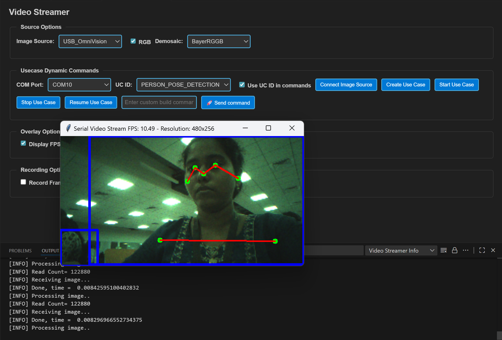

# Person Pose Detection ML Application

## Description

The UC Person Pose Detection application detects individuals in the camera's field of view by generating bounding boxes and identifying 17 keypoints for each person, corresponding to various body parts. Each keypoint is accompanied by a confidence score that indicates the reliability of the detection, enabling accurate estimation of the person's pose. This example supports both WQVGA (480x270) and VGA (640x480) resolutions.

## Prerequisites
- Choose **one** setup path:
  - **CLI**: [Setup and Install SDK using CLI](../../../../docs/Astra_MCU_SDK_Setup_and_Install_CLI.md)
  - **VS Code**: [Setup and Install SDK using VS Code](../../../../docs/Astra_MCU_SDK_Setup_and_Install_VsCode.md)

## Building and Flashing the Example using VS Code

Use the VS Code flow described in the SR110 guide and the VS Code Extension guide:
- [SR110 Build and Flash with VS Code](../../../../docs/SR110/SR110_Build_and_Flash_with_VSCode.md)
- [Astra MCU SDK VS Code Extension User Guide](../../../../docs/Astra_MCU_SDK_VSCode_Extension_User_Guide.md)

**Build (VS Code):**
1. Open **Build and Deploy** → **Build Configurations**.
2. Select **person_pose_detection** in the **Application** dropdown.
3. If you need **VGA (640x480)**, click **Edit Configs** (Menuconfig) in the Build and Deploy view, then set  
   `COMPONENTS CONFIGURATION → Off Chip Components → Display Resolution` to **VGA**.
4. Optional configuration changes in Menuconfig:
   - **WQVGA in LP Sense**: `COMPONENTS CONFIGURATION → Drivers` → enable `MODULE_LP_SENSE_ENABLED`
   - **Static Image**: `COMPONENTS CONFIGURATION → Off Chip Components` → disable `MODULE_IMAGE_SENSOR_ENABLED`
5. Build with **Build (SDK + App)** for the first build, or **Build App** for rebuilds.

**Flash (VS Code):**
1. Use **Image Conversion** to generate the flash image.
2. Use **Image Flashing** (SWD/JTAG) to flash the firmware image.
3. **VGA use case:** flash the **model binary second**, after the **use case image**.  
   In **Image Flashing**, check **Model Binary** and set **Flash Offset** to `0x629000`, then flash the model file.  
   After that, flash the firmware image normally.

---

## Building and Flashing the Example using CLI

Use the CLI flow described in the SR110 guide:
- [SR110 Build and Flash with CLI](../../../../docs/SR110/SR110_Build_and_Flash_with_CLI.md)

**Build (CLI):**
1. From `<sdk-root>/examples`, build the example:
   ```bash
   cd <sdk-root>/examples
   export SRSDK_DIR=<sdk-root>
   make cm55_person_pose_detection_defconfig BOARD=SR110_RDK BUILD=SRSDK
   ```
2. If you need **VGA (640x480)**, open Kconfig and set  
   `COMPONENTS CONFIGURATION → Off Chip Components → Display Resolution` to **VGA**:
   ```bash
   make cm55_person_pose_detection_defconfig BOARD=SR110_RDK BUILD=SRSDK EDIT=1
   ```
3. Optional configuration changes in Menuconfig:
   - **WQVGA in LP Sense**: `COMPONENTS CONFIGURATION → Drivers` → enable `MODULE_LP_SENSE_ENABLED`
   - **Static Image**: `COMPONENTS CONFIGURATION → Off Chip Components` → disable `MODULE_IMAGE_SENSOR_ENABLED`

**Flash (CLI):**
1. Activate the SDK venv (required for image generation tools):
   ```bash
   # Linux/macOS
   source <sdk-root>/.venv/bin/activate
   # Windows PowerShell
   .\.venv\Scripts\Activate.ps1
   ```
2. Generate the flash image:
   ```bash
   cd <sdk-root>/tools/srsdk_image_generator
   python srsdk_image_generator.py \
     -B0 \
     -flash_image \
     -sdk_secured \
     -spk "<sdk-root>/tools/srsdk_image_generator/B0_Input_examples/spk_rc4_1_0_secure_otpk.bin" \
     -apbl "<sdk-root>/tools/srsdk_image_generator/B0_Input_examples/sr100_b0_bootloader_ver_0x012F_ASIC.axf" \
     -m55_image "<sdk-root>/examples/out/sr110_cm55_fw/release/sr110_cm55_fw.elf" \
     -flash_type "GD25LE128" \
     -flash_freq "67"
   ```
3. Flash the image:
   ```bash
   cd <sdk-root>
   python tools/openocd/scripts/flash_xspi_tcl.py \
     --cfg_path tools/openocd/configs/sr110_m55.cfg \
     --image tools/srsdk_image_generator/Output/B0_Flash/B0_flash_full_image_GD25LE128_67Mhz_secured.bin \
     --erase-all
   ```
4. **VGA use case:** flash the model binary second at offset `0x629000`:
   ```bash
   cd <sdk-root>
   python tools/openocd/scripts/flash_xspi_tcl.py \
     --cfg_path tools/openocd/configs/sr110_m55.cfg \
     --image <path-to-model-bin> \
     --flash-offset 0x629000
   ```

---

## Running the Application using VS Code Extension

> **Windows note:** Ensure the USB drivers are installed for streaming. See the Zadig steps in  
> [SR110 Build and Flash with VS Code](../../../../docs/SR110/SR110_Build_and_Flash_with_VSCode.md#usb-cdc-image-streaming-windows).

1. In VS Code, open **Video Streamer** from the Synaptics sidebar.

   

2. For logging output, click **SERIAL MONITOR** and connect to the **DAP logger** port on J14.
   - To make it easier to identify, ensure **only J14** is plugged in (not J13).
   - The logger port is not guaranteed to be consistent across OSes. As a starting point:
     - **Windows:** try the lower‑numbered J14 COM port first.
     - **Linux/macOS:** try the higher‑numbered J14 port first.
   - If you don’t see logs after a reset, switch to the other J14 port.
3. In the Video Streamer dropdown, select the **J13** COM port.
   - Plug in **J13** and press **RESET** on the board.
   - **Windows:** select the newly enumerated COM port.
   - **Linux/macOS:** select the lower‑numbered COM port of the two newly enumerated ports.
4. Use the Video Streamer controls:

   a. Select **PERSON_POSE_DETECTION** from the **UC ID** dropdown.  
   b. Set **RGB Demosaic** to **BayerRGGB**.  
   c. Click **Create Use Case**.  
   d. Click **Start Use Case** (a Python window opens and the video stream appears).

   

5. **Autorun use cases:** If autorun is enabled, after step 4 click **Connect Image Source** to open the video stream pop-up.
