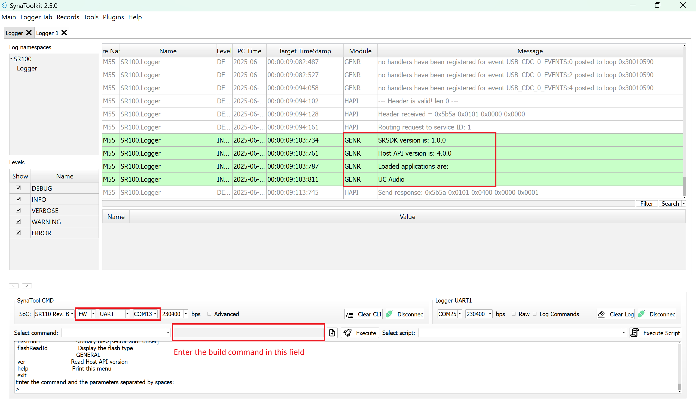
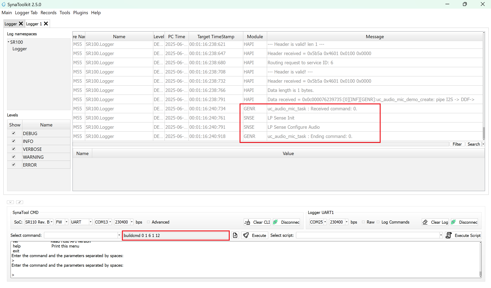
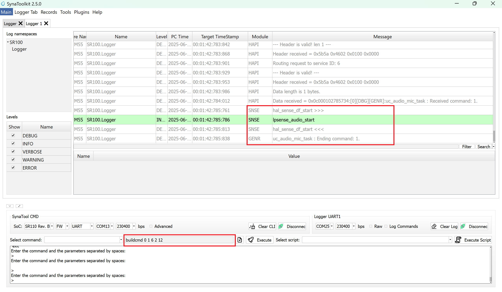
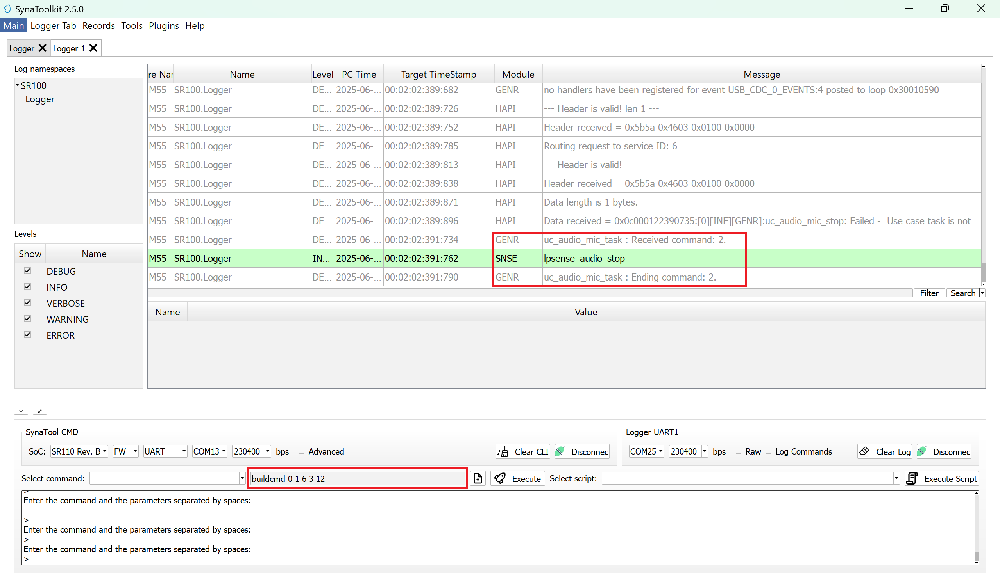
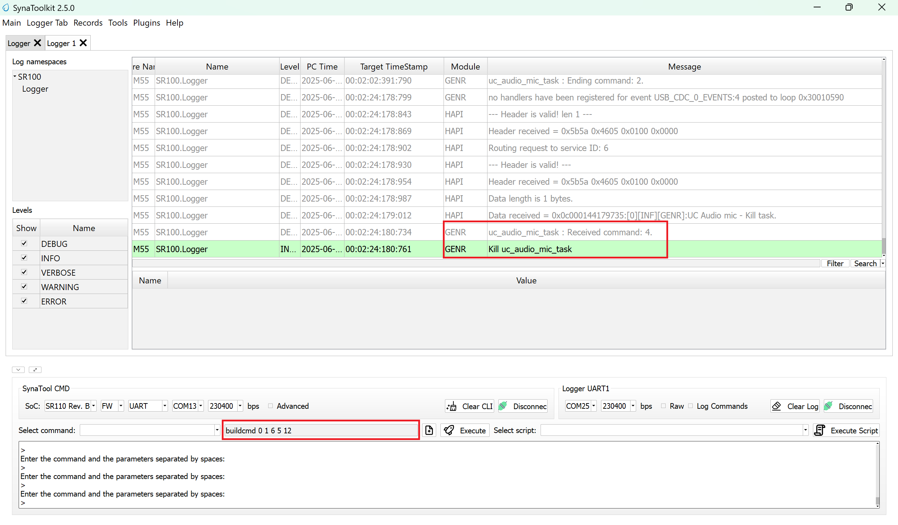

# AUDIO MIC Application

## Description

The UC_AUDIO_MIC use case demonstrates the seamless routing of audio data from the Microphone Digital Data Format (DDF) to both the I2S interface and LP_Sense memory. It serves as a reference implementation for validating audio data compatibility across interfaces and can be effectively utilized by following the build, run, and results guidelines provided.

The latest example structure uses a **common application source tree** with board-specific hardware setup kept under `hw/<BOARD>/`. For this app:
- Common application sources such as `main.c`, `uc_audio_mic.c`, and `uc_audio_mic.h` stay in the app root.
- Application defconfigs are stored under `configs/`.
- Board and hardware-specific setup is selected from `hw/<BOARD>/`, for example `hw/SR110_RDK/`.

The application can also be exported and built as a **standalone app repository**. In that flow, keep this app in its own directory, point `SRSDK_DIR` to the SDK root, and build from the app directory itself. For the full application workflow model, see [Astra MCU SDK User Guide](../../../docs/Astra_MCU_SDK_User_Guide.md).

## Supported Boards

This application supports:
- `SR110_RDK`

Select the defconfig that matches your target board, and the build system will pick the corresponding board-specific hardware setup from `hw/<BOARD>/`.

> Note: The audio use case involves getting DMIC input and converting it to PCM data in I2S format. Since the on-board doesn't have DAC, we need to interface the signals in 40 pin header(J25.3, J25.4, J25.5) with an external board that supports DAC, thereby achieving audio output at the speaker.

## Prerequisites
- Choose **one** setup path:
  - **CLI**: [Setup and Install SDK using CLI](../../../docs/Astra_MCU_SDK_Setup_and_Install_CLI.md)
  - **VS Code**: [Setup and Install SDK using VS Code](../../../docs/Astra_MCU_SDK_Setup_and_Install_VsCode.md)

## Test Case Selection

Before building, choose the testcase defconfig that matches both your target board and the transfer mode you want to validate.

You can:
- Select the required defconfig directly from the application's `configs/` directory.
- Run `make list_defconfigs` from the application directory to list all supported defconfigs.

**Available defconfigs:**
- `sr110_rdk_cm55_audio_mic_defconfig`


## Building and Flashing the Example using VS Code and CLI

Use the VS Code flow described in the SR110 guide and the VS Code Extension guide:
- [SR110 Build and Flash with VS Code](../../../docs/SR110/SR110_Build_and_Flash_with_VSCode.md)
- [Astra MCU SDK VS Code Extension User Guide](../../../docs/Astra_MCU_SDK_VSCode_Extension_User_Guide.md)

**Build (VS Code):**
1. Open **Build and Deploy** → **Build Configurations**.
2. Select **audio_mic** in the **Application** dropdown.
3. Build with **Build (SDK + App)** for the first build, or **Build App** for rebuilds.

**Build (CLI):**
1. Build from the application directory itself:
   ```bash
   cd <sdk-root>/examples/audio_examples/uc_audio_mic
   export SRSDK_DIR=<sdk-root>
   make <app_defconfig> BUILD=SRSDK
   ```
2. Rebuild the application using the pre-built package:
   ```bash
   cd <sdk-root>/examples/audio_examples/uc_audio_mic
   make build
   ```

## CLI build outputs

The build process will produce the necessary .elf or .axf files for deployment with the installed package.

**Flash and Image Generation (VS Code):**
1. Open the Astra MCU SDK VS Code Extension and connect to the Debug IC USB port on the Astra Machina Micro Kit.
   - Refer to the [Astra MCU SDK User Guide](../../../docs/Astra_MCU_SDK_User_Guide.md) for detailed setup steps.
2. Generate firmware binaries using **Build and Deploy** → **Image Conversion**.
   - Select the required `.axf` or `.elf` file. If the use case is built using the VS Code extension, the file path will be auto-populated.
3. Flash the application using **Build and Deploy** → **Image Flashing**.
   - Select **SWD/JTAG** as the interface.
   - Choose the respective image bins and click **Run**.

**Flash (CLI):**
1. Activate the SDK venv (required for image generation tools):
   ```bash
   # Linux/macOS
   source <sdk-root>/.venv/bin/activate
   # Windows PowerShell
   .\.venv\Scripts\Activate.ps1
   ```
2. Generate flash image:
   ```bash
   cd <sdk-root>/tools/srsdk_image_generator
   python srsdk_image_generator.py \
     -B0 \
     -flash_image \
     -sdk_secured \
     -spk "<sdk-root>/tools/srsdk_image_generator/Inputs/spk_rc4_1_0_secure_otpk.bin" \
     -apbl "<sdk-root>/tools/srsdk_image_generator/Inputs/sr100_b0_bootloader_ver_0x012F_ASIC.axf" \
     -m55_image "<sdk-root>/examples/audio_examples/uc_audio_mic/out/sr110_cm55_fw/release/sr110_cm55_fw.elf" \
     -flash_type "GD25LE128" \
     -flash_freq "67"
   ```
3. Flash the application:
   ```bash
   cd <sdk-root>
   python tools/openocd/scripts/flash_xspi_tcl.py \
     --cfg_path tools/openocd/configs/sr110_m55.cfg \
     --image tools/srsdk_image_generator/Output/B0_Flash/B0_flash_full_image_GD25LE128_67Mhz_secured.bin \
     --erase-all
   ```

### Running the Application

1. **Open SynaToolkit_2.6.0**

2. **Before running the application, make sure to connect a USB cable to the Application SR110 USB port on the Astra Machina Micro board and then press the reset button**
   - Connect to the newly enumerated COM port
   - For logging output, connect to DAP logger port

   

2. **Enter the build command and Execute**

   The following build commands can be used to create, start, stop, and kill the use case.

   • **buildcmd 0 1 6 1 12** – Create

   

   • **buildcmd 0 1 6 2 12** – Start

   

   • **buildcmd 0 1 6 3 12** – Stop

   

   • **buildcmd 0 1 6 5 12** – Kill

   
