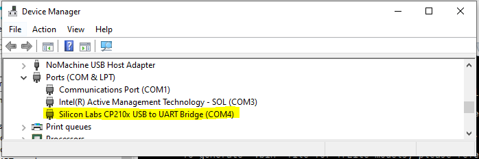

# Bluetooth Driver Sample Application

## Description

The Bluetooth Driver sample application demonstrates BLE communication and GATT server operations on the supported boards for this application. It performs comprehensive Bluetooth testing including stack initialization, GATT server setup, advertising, and client interaction validation to ensure reliable wireless communication.

The sample includes multiple Bluetooth operations:
- **Stack initialization:** Initialize Bluetooth stack from CLI with proper memory configuration.
- **GATT server setup:** Create and start GATT server with services and characteristics.
- **Advertising control:** Start BLE advertising for device discovery.
- **Client interaction:** Handle smartphone discovery, connection, and GATT read/write operations.
- **Shell integration:** Provide CLI commands for Bluetooth control through logger console.

During each run, the app logs initialization status, stack configuration, advertising state, and GATT operation results. This makes it easy for end users to confirm that Bluetooth setup and wireless operations are working as expected.

The latest example structure uses a **common application source tree** with board-specific hardware setup kept under `hw/<BOARD>/`. For this app:
- Common application sources such as `main.c`, `bt_sample_app.c`, and `bt_sample_app.h` stay in the app root.
- Application defconfigs are stored under `configs/`.
- Board and hardware-specific setup is selected from `hw/<BOARD>/`, for example `hw/SR110_RDK/`.

The application can also be exported and built as a **standalone app repository**. In that flow, keep this app in its own directory, point `SRSDK_DIR` to the SDK root, and build from the app directory itself. For the full application workflow model, see [Astra MCU SDK User Guide](../../../docs/Astra_MCU_SDK_User_Guide.md).

## Supported Boards

This application supports:
- `SR110_RDK`

Select the defconfig that matches your target board, and the build system will pick the corresponding board-specific hardware setup from `hw/<BOARD>/`.

## Hardware Requirements
- Astra Machina Micro Kit (SR110)
- 1x UART bridge adapter (for UART1 logger/CLI)
- Smartphone with BLE support
- USB cable for flashing/debug connection

## Prerequisites
- Choose **one** setup path:
  - **CLI**: [Setup and Install SDK using CLI](../../../docs/Astra_MCU_SDK_Setup_and_Install_CLI.md)
  - **VS Code**: [Setup and Install SDK using VS Code](../../../docs/Astra_MCU_SDK_Setup_and_Install_VsCode.md)
- Install a BLE scanner app on phone:
  - Android: nRF Connect for Mobile, BLE Scanner

## Test Case Selection

Before building, choose the testcase defconfig that matches your target board.

You can:
- Select the required defconfig directly from the application's `configs/` directory.
- Run `make list_defconfigs` from the application directory to list all supported defconfigs.

**Available defconfigs:**
- `sr110_rdk_cm55_bt_sample_app_defconfig`


## Memory Configuration (Important)

Before building BT sample app, increase heap size for Bluetooth stack.

1. Update linker script `soc/SR110/cm55/config/sr110_cm55_hw_gcc_arm.ld`:
   ```ld
   __HEAP_MEM_SIZE = 0x00019000;  /* 100 KiB */
   ```
2. Update `soc/SR110/cm55/include/region_defs.h`:
   ```c
   #define HEAP_MEM_SIZE             (0x00019000) /* 100 KiB */
   ```

If heap is not increased, BT stack init may fail or become unstable.

## Logger Interface Configuration

BT sample logs and CLI are expected on **UART1**.

- Ensure logger interface is UART1 (`CONFIG_LOGGER_IF_UART_1_CONSOLE=y` or UART1-equivalent option).
- `sr110_rdk_cm55_bt_sample_app_defconfig` already enables UART1 console logger by default.

## Wiring

### UART1 logger/CLI bridge
- Connect UART bridge to UART1 interface pins on SR110 board.
- Open serial terminal on the UART1 bridge COM port.

Reference image:
- 

## Building and Flashing the Example using VS Code

Use the VS Code flow described in the respective soc vscode guides and the VS Code Extension guide:
- [SR110 Build and Flash with VS Code](../../../docs/SR110/SR110_Build_and_Flash_with_VSCode.md)
- [Astra MCU SDK VS Code Extension User Guide](../../../docs/Astra_MCU_SDK_VSCode_Extension_User_Guide.md)

**Build (VS Code):**
1. Apply heap changes from **Memory Configuration (Important)**.
2. Open **Build and Deploy** -> **Build Configurations**.
3. Select the **bt_sample_app** project configuration in the **Project Configuration** dropdown.
4. Build with **Build (SDK+Project)** for the first build, or **Build (Project)** for rebuilds.

**Flash (VS Code):**
1. Use **Image Conversion** to generate the flash image.
2. Use **Image Flashing** (SWD/JTAG) to flash the firmware image.

---

## Building and Flashing the Example using CLI

Use the CLI flow described in the respective build guide:
- [SR110 Build and Flash with CLI](../../../docs/SR110/SR110_Build_and_Flash_with_CLI.md)
- [Astra MCU SDK User Guide](../../../docs/Astra_MCU_SDK_User_Guide.md)

**Build (CLI):**
1. Build from the application directory itself:
   ```bash
   cd <sdk-root>/examples/driver_examples/bt_sample_app
   export SRSDK_DIR=<sdk-root>
   make <app_defconfig> BUILD=SRSDK
   ```
2. For faster rebuilds when only app code changes, reuse the app-local installed SDK package:
   ```bash
   cd <sdk-root>/examples/driver_examples/bt_sample_app
   export SRSDK_DIR=<sdk-root>
   make build
   ```
3. If this app has been exported to its own repository, use the same commands from that exported app directory after setting `SRSDK_DIR` to the SDK root.

**Build outputs (CLI):**
- Application binary: `<app-dir>/out/<target>/release/<target>.elf`
- App-local SDK package: `<app-dir>/install/<BOARD>/<BUILD_TYPE>/`

**Flash (CLI):**

1. Activate the SDK venv (required for image generation tools):
   ```bash
   # Linux/macOS
   source <sdk-root>/.venv/bin/activate
   # Windows PowerShell
   .\.venv\Scripts\Activate.ps1
   ```
2. Generate the flash image:
   ```bash
   cd <sdk-root>/tools/srsdk_image_generator
   python srsdk_image_generator.py \
     -B0 \
     -flash_image \
     -sdk_secured \
     -spk "<sdk-root>/tools/srsdk_image_generator/Inputs/spk_rc4_1_0_secure_otpk.bin" \
     -apbl "<sdk-root>/tools/srsdk_image_generator/Inputs/sr100_b0_bootloader_ver_0x012F_ASIC.axf" \
     -m55_image "<sdk-root>/examples/driver_examples/bt_sample_app/out/sr110_cm55_fw/release/sr110_cm55_fw.elf" \
     -flash_type "GD25LE128" \
     -flash_freq "67"
   ```
3. Flash the firmware image:
   ```bash
   cd <sdk-root>
   python tools/openocd/scripts/flash_xspi_tcl.py \
     --cfg_path tools/openocd/configs/sr110_m55.cfg \
     --image tools/srsdk_image_generator/Output/B0_Flash/B0_flash_full_image_GD25LE128_67Mhz_secured.bin \
     --erase-all
   ```

---

## Running the Application using VS Code Extension

1. Press **RESET** on the board after flashing.
2. For logging output and CLI interaction, click **SERIAL MONITOR** and connect to the **UART1 bridge** port.
   - Use UART bridge adapter connected to UART1 for logger and CLI access
   - The logger port is not guaranteed to be consistent across OSes. As a starting point:
     - **Windows:** try the lower-numbered COM port first.
     - **Linux/macOS:** try the higher-numbered port first.
   - If you do not see logs after a reset, switch to the other port.
3. BT sample logs and CLI interface appear in the logger window, including stack initialization and GATT operation results.

### Running the Application

1. Identify the UART bridge COM port on your PC.
   - On Windows, check **Device Manager -> Ports (COM & LPT)** after plugging the USB-to-UART bridge.
   - Use that COM port in your serial terminal.
   - 
2. Connect UART bridge to UART1 and open a serial terminal.
3. Flash BT sample app image and press **RESET**.
4. Confirm boot logs appear on UART1 terminal.
5. Run below CLI commands in order:
   ```bash
   synabt enable
   synabt gatt_server_start
   synabt ble_start_adv
   ```
6. On phone BLE app, scan and connect to device **`BTA_Amz`**.

BLE app references:
- 
- 

## GATT Read/Write Check

After connection from phone app:
1. Open discovered GATT service/characteristic list.
2. Perform read on a readable characteristic.
3. Perform write (for example `Hello BT`) on writable characteristic.
4. Verify corresponding activity in UART1 logs.

## Expected Logs

**System Initialization:**
```log
0000000124:[0][DBG][GENR]:created task for loop 0x300111e0
0000002715:[0][DBG][GENR]:created event loop 0x300111e0
0000005173:[0][INF][USB ]:Creating CDC0
0000006948:[0][INF][USB ]:USB CDC 0 created
0000008892:[0][INF][USB ]:USB CDC 1 created
0000010845:[0][INF][USB ]:USB CDC Performance Mode: Normal
0000013503:[0][INF][USB ]:USB device started
0000015524:[0][INF][XSPI]:Start XSPI (phy init, read id) with xspi_core_clk_freq 33MHz
0000019491:[0][INF][XSPI]:xspic check_flash_id: 0x1860c8
0000022036:[0][INF][XSPI]:flash : GigaDevice
0000024062:[0][INF][XSPI]:MAGIC number found, initialized with attributes from flash
0000027848:[0][INF][XSPI]:XSPI, configured_xspi_frequency 66MHz
0000030710:[0][INF][XSPI]:xspi_flash_initialized = true
0000033261:[0][WRN][LOGR]:Changing logger interface to LOGGER_IF_UART_1_CONSOLE
0000036762:[0][INF][SYS ]:
0000037958:[0][INF][SYS ]:SR110 SDK version 1.1.0
0000040164:[0][INF][SYS ]:System clock rate = 400 MHz
0000042535:[0][INF][SYS ]:soc_base_clock (slow_clk) rate = 24 MHz
0000045429:[0][INF][SYS ]:SysTick is clocked by slow_timer (XTAL) at rate of 24 MHz
0000049105:[0][INF][SYS ]:------------------------------------------
0000052128:[0][INF][SYS ]:        Synaptics Bluetooth RTOS
0000055108:[0][INF][SYS ]:------------------------------------------
0000058145:[0][DBG][GENR]:running task for loop 0x300111e0
0000060736:[0][INF][USB ]:USB Device Driver task
0000062896:[0][INF][USB ]:USB device unmounted
0000064966:[0][INF][USB ]:USB stopped
0000066682:[0][DBG][HAPI]:UART0 initialized. Baudrate achieved: 230414
0000066711:[0][INF][HAPI]:------------------------------------------
0000066736:[0][INF][HAPI]:       Host API Router task
0000066761:[0][INF][HAPI]:------------------------------------------
0000066785:[0][INF][HAPI]:Active interface is USB
0000081166:[0][INF][HAPI]:A new service was registered, service ID: 11.
0000081192:[0][DBG][GENR]:FW UPDATE TASK (srv_id = 11)
0000086744:[0][INF][SYS ]:------------------------------------------
0000089771:[0][INF][SYS ]:            Hello  ASTRA
0000092799:[0][INF][SYS ]:------------------------------------------
0000095826:[0][INF][SYS ]:System initialization done
0000246205:[0][INF][USB ]:USB device mounted
0000246231:[0][INF][USB ]:USB started
0000270712:[0][DBG][GENR]:no handlers have been registered for event USB_CDC_0_EVENTS:3 posted to loop 0x300111e0
000000001.008:vTaskShell, 1028
```

**Command: `synabt enable`**
```log
000000009.908:recv cmd 13:synabt enable
000000009.908:[CLI][DEBUG] syna_bt_cli_tbl[0].handler called with argc=0, argv[2]=(null)

000000009.910:btapp_init free heap size:129192:free memory 0

000000009.913:Start Boot BT Stack

000000009.915:BTE_LoadGki

000000009.916:Starting UPIO initialization...
000000009.918:GPIO module initialized for port 0
000000009.920:Waiting for system boot completion before SWIRE_DATA reconfiguration...
000000011.924:GPIO 25 successfully configured for BT_REGON
000000011.924:GPIO 25 successfully configured for BT_REGON
000000012.026:UPIO initialization completed successfully
000000012.031:UPIO_Set type=4, pio=4, state=OFF
000000012.031:BT_REGON (GPIO25) set to 0
000000012.082:UPIO_Set type=4, pio=4, state=ON
000000012.082:BT_REGON (GPIO25) set to 1
000000012.133:UPIO_Restore_CTS_Setting: Not implemented
000000012.133:GKI_create_task:GKI Check task_id 1

000000012.134:GKI_create_task func=0x33ea4e05  id=1  name=gki_timer_task  stack=0x3000ded0  stackSize=1024

000000012.139:GKI_create_task[1:1]!!!!

000000012.151:BootEntry:BTE_CreateTasks

000000012.151:[BTE_CreateTasks]:BTU_CreateTasks

000000012.152:GKI_create_task:GKI Check task_id 3

000000012.154:GKI_create_task func=0x33ec7661  id=3  name=btu_task  stack=0x0  stackSize=16384

000000012.158:GKI_create_task[3:3]!!!!

000000012.160:[BTE_CreateTasks]:HCISU_CreateTasks

000000012.162:GKI_create_task:GKI Check task_id 5

000000012.164:GKI_create_task func=0x33ea34e5  id=5  name=hci_su_task  stack=0x0  stackSize=2048

000000012.169:GKI_create_task[5:5]!!!!

000000012.171:[BTE_CreateTasks]:BTTAPP_CreateTasks

000000012.173:GKI_create_task:GKI Check task_id 2

000000012.175:GKI_create_task func=0x33ea19c5  id=2  name=btapp_task  stack=0x0  stackSize=1024

000000012.179:GKI_create_task[2:2]!!!!

000000012.191:Initializing BT UART transport at 115200 baud
000000012.191:UART initialized: requested=115200, achieved=115207
000000012.193:BT UART transport initialized successfully
000000012.196:GKI_create_task:GKI Check task_id 6

000000012.198:GKI_create_task func=0x33ea5c8d  id=6  name=hci_uart_task  stack=0x0  stackSize=2048

000000012.205:GKI_create_task[6:6]!!!!

000000012.224:bte_post_reset, bte_patchram_has_dl:0

000000012.228:Reconfiguring UART baud rate to 3000000
000000012.228:Baud rate reconfigured: requested=3000000, achieved=3030303
000000012.231:bte_baud_update_cback status=0

000000017.757:Reconfiguring UART baud rate to 115200
000000017.757:Baud rate reconfigured: requested=115200, achieved=115207
000000017.764:Reconfiguring UART baud rate to 3000000
000000017.764:Baud rate reconfigured: requested=3000000, achieved=3030303
000000017.773:bte_post_reset, bte_patchram_has_dl:1

000000017.773:btapp_dm_post_reset

000000017.777:0017.777 [APPL  ] btapp_cfg_init: tBTAPP_CFG size:104

000000017.780:0017.780 [APPL  ] btapp_cfg_set_accept_auth_enable accept_auth_enable:0

000000017.783:0017.783 [APPL  ] Local Addr:43:01:30:cc:ee:ff

000000017.786:BT stack lib version: 1.0.1_AMAZON_FREERTOS_SR110-(ASTRA_MCU_SDK1.0:ead4343)

000000017.789:BT stack lib built at 15:19:44 Sep 17 2025

000000017.792:SYN4612A1_001.002.003.0020.0000_Generic_UART_37_4MHz_wlbga_REF_sLNA_iLNA_ANT0_secure_sign_btpatch, size:137165

000000017.798:BT controller name:4612A1_Generic_UART_37_4MHz_wlbga_REF_sLNA_iLNA_ANT0 [Baseline: 0020]

000000017.887:0017.887 [APPL  ] bta_dm_ctrl_features_rd_cmpl_cback  status = 0

000000017.896:0017.896 [APPL  ]  bta_sys_hw_btm_cback was called with parameter: 0

000000017.899:bte_dev_reset_cplt

000000017.899:0017.899 [APPL  ] bta_sys_sm_execute state:0, event:0x2

000000018.086:btapp_init stack bring-up success!

000000018.086:[btapp_startup]:btapp_init_device_db

000000018.087:BTA_BrcmInit!

000000018.089:0018.089 [APPL  ] BTA_BrcmInit

000000018.091:BTA_EnableBluetooth

000000018.095:0018.095 [APPL  ] bta_sys_sm_execute state:2, event:0x0

000000018.098:0018.098 [APPL  ] bta_dm_sys_hw_cback with event: 1

000000018.101:btapp_dm_security_cback  event 0

000000018.101:btapp_dm_init_continue privacy_enabled = 0

000000018.104:0018.104 [APPL  ] BTA_DmBleScatternetEnable: 1

000000018.107:0018.107 [APPL  ] Adding UUID=0x1200 into EIR

000000018.110:0018.110 [APPL  ] BTA is generating EIR

000000018.113:0018.113 [APPL  ] bta_dm_eir_update_uuid UUID bit mask=0x00000004 00000000

000000018.119:local bdaddr 43:01:30:cc:ee:ff

000000018.119:auth_req:4

000000018.122:btapp_init success!

000000018.122:btapp_init free heap size:35136

000000018.126:0018.126 [APPL  ] bta_sys_hw_api_enable for 0, active modules 0x0001

000000018.129:0018.129 [APPL  ] BTA is generating EIR

000000018.132:0018.132 [APPL  ] bta_brcm_evt_hdlr :0x0005

000000018.183:btapp_dm_security_cback  event 20

000000018.189:btapp_dm_security_cback  event 21
```

**Command: `synabt gatt_server_start`**
```log
000000027.724:recv cmd 24:synabt gatt_server_start
000000027.724:[CLI][DEBUG] syna_bt_cli_tbl[14].handler called with argc=0, argv[2]=(null)

000000027.727:0027.727 [APPL  ] BTA_DmSetBleAdvParam: 32, 64

000000027.732:0027.732 [APPL  ] bta_gatts_enable: num of handle range added=0

000000027.735:0027.735 [APPL  ] bta_gatts_co_srv_chg cmd=4

000000027.738:0027.738 [APPL  ] register application first_unuse rcb_idx = 0

000000027.741:btapp_gatts_cback event:0

000000027.744:GATTS registered...sif:3, status:0

000000027.747:0027.747 [APPL  ] create service rcb_idx = 0

000000027.747:btapp_gatts_cback event:7

000000027.750:btapp_gatts_cback BTA_GATTS_CREATE_EVT

000000027.753:0027.753 [APPL  ] bta_gatts_find_srvc_cb_by_srvc_id  service_id=40

000000027.756:0027.756 [APPL  ] bta_gatts_find_srvc_cb_by_srvc_id  found service cb index =0

000000027.762:btapp_gatts_cback event:9

000000027.762:btapp_gatts_cback BTA_GATTS_ADD_CHAR_EVT status:0, attr_id:42

000000027.765:0027.765 [APPL  ] bta_gatts_find_srvc_cb_by_srvc_id  service_id=40

000000027.771:0027.771 [APPL  ] bta_gatts_find_srvc_cb_by_srvc_id  found service cb index =0

000000027.774:btapp_gatts_cback event:10

000000027.777:btapp_gatts_cback BTA_GATTS_ADD_CHAR_DESCR_EVT status:0, attr_id:43

000000027.780:0027.780 [APPL  ] bta_gatts_find_srvc_cb_by_srvc_id  service_id=40

000000027.783:0027.783 [APPL  ] bta_gatts_find_srvc_cb_by_srvc_id  found service cb index =0

000000027.789:0027.789 [APPL  ] bta_gatts_start_service service_id= 40

000000027.792:btapp_gatts_cback event:12

000000027.795:btapp_gatts_cback BTA_GATTS_START_EVT
```

**Command: `synabt ble_start_adv`**
```log
000000025.830:recv cmd 20:synabt ble_start_adv
000000025.830:[CLI][DEBUG] syna_bt_cli_tbl[2].handler called with argc=0, argv[2]=(null)

000000025.833:0025.833 [APPL  ] BTA_DmSetBleAdvParam: 32, 64
```

**GATT Write Operation from Connected Device:**
```log
000000105.866:btapp_gatts_proc_write handle:42, len:8, offset:0, need_rsp:1, is_prep:0

000000105.872:Peer wrote content:   |hello!!!|

000000105.872:0105.872 [APPL  ] bta_gatts_send_rsp found p_rcb

000000105.875:btapp_gatts_cback event:24
```
