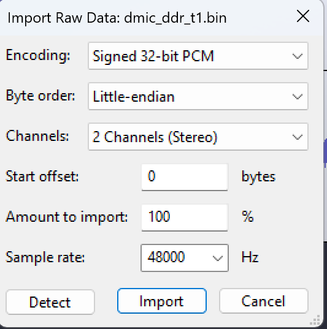

# DMIC PDM-RX Sample Application

## Description

The DMIC PDM-RX sample application demonstrates audio capture using the Digital Microphone (DMIC) interface on supported boards. It validates the end-to-end PDM receive path, including:

- DMIC clock and I/O configuration
- Channel configuration and gain/boost setup
- FIFO and DMA capture paths
- Captured PCM data verification

The sample supports multiple capture modes:

- **Blocking read**: FIFO-based synchronous capture
- **Non-blocking read**: Interrupt-driven FIFO capture
- **DMA-based capture**: Continuous capture through DMA
- **DMA non-blocking read**: Callback-driven DMA capture

During execution, the app logs initialization status, configuration details, and capture results so that bring-up and data-path issues are easier to diagnose.

The application follows the common source layout used by driver samples:

- Common sources: `main.c`, `dmic_sample_app.c`, `dmic_sample_app.h` (app root)
- Defconfigs: `configs/`
- Board-specific hardware setup: `hw/<BOARD>/` (for example `hw/SL2610_RDK/`)

The app can also be built as a standalone application repository by setting `SRSDK_DIR` to the SDK root.

## Supported Boards

This application supports:

- `SL2610_RDK`

## Prerequisites

Choose one setup path:

- **CLI**: [Setup and Install SDK using CLI](../../../docs/Astra_MCU_SDK_Setup_and_Install_CLI.md)
- **VS Code**: [Setup and Install SDK using VS Code](../../../docs/Astra_MCU_SDK_Setup_and_Install_VsCode.md)

## Test Case Selection

Before building, select the testcase defconfig for the capture mode you want to validate.

You can:

- Pick a defconfig from `configs/`
- Run:
  ```bash
  make list_defconfigs
  ```

**Available DMIC defconfigs (SL2610 RDK):**

- `sl2610_rdk_cm52_dmic_defconfig`: FIFO blocking read mode
- `sl2610_rdk_cm52_dmic_nonblocking_defconfig`: FIFO non-blocking mode
- `sl2610_rdk_cm52_dmic_dma_defconfig`: DMA blocking capture mode
- `sl2610_rdk_cm52_dmic_dma_nonblocking_defconfig`: DMA non-blocking capture mode

## Building and Flashing using VS Code

Use the VS Code flow in:

- [SL2610 Build and Flash with VS Code](../../../docs/SL2610/SL2610_Build_and_Flash_with_VSCode.md)
- [Astra MCU SDK VS Code Extension User Guide](../../../docs/Astra_MCU_SDK_VSCode_Extension_User_Guide.md)

**Build (VS Code):**

1. Open **Build and Deploy** -> **Build Configurations**.
2. Select **dmic_sample_app** in **Project Configuration**.
3. Select the required defconfig.
4. Build with **Build (SDK+Project)** for first build, or **Build (Project)** for incremental rebuilds.

**Flash (VS Code):**

1. Generate the image (`sysmgr.subimg.gz`) using the standard SL2610 image generation flow.
2. Open **Image Flashing (SL2610)**.
3. Select **Flash Target** as **M52 Image**.
4. Select generated image path.
5. Start flashing.

## Building and Flashing using CLI

Use:

- [SL2610 Build and Flash with CLI](../../../docs/SL2610/SL2610_Build_and_Flash_with_CLI.md)
- [Astra MCU SDK User Guide](../../../docs/Astra_MCU_SDK_User_Guide.md)

**Build (CLI):**

1. First build:
   ```bash
   cd <sdk-root>/examples/driver_examples/dmic_sample_app
   export SRSDK_DIR=<sdk-root>
   make <app_defconfig> BUILD=SRSDK
   ```
2. Rebuild after app-only changes:
   ```bash
   cd <sdk-root>/examples/driver_examples/dmic_sample_app
   export SRSDK_DIR=<sdk-root>
   make build
   ```

**Build outputs:**

- ELF: `<app-dir>/out/<target>/release/<target>.elf`
- App-local SDK package: `<app-dir>/install/<BOARD>/<BUILD_TYPE>/`

**Flash (CLI):**

1. Build bootloader image:
   ```bash
   cd <sdk-root>
   export SRSDK_DIR=<sdk-root>
   make <SL2610_Bootloader_defconfig> BOARD=<BOARD>
   make astrasdk
   ```
2. Generate system sub-image:
   ```bash
   cd <sdk-root>/examples/driver_examples/dmic_sample_app
   export SRSDK_DIR=<sdk-root>
   make imagegen
   ```
3. Flash image to target (see SL2610 CLI guide above).

## Running the Application

1. Press **RESET** after flashing.
2. Open Serial Monitor on UART logger port (115200, 8N1).

3. Verify logs for:
   - DMIC init/config success
   - Selected capture mode
   - Capture start/complete or error details

## Large Capture and Audio Export (JTAG + Memory Dump + Audacity)

The same image can be used for both capture methods:

- **JTAG capture**: dump full PCM buffer from memory
- **UART capture**: capture frame/sample logs from serial console (for users without JTAG).

Choose the method that matches your setup.

### 1) Method A: JTAG full-buffer capture

This is the recommended method when JTAG is available.

1. Flash/boot the default CI image and run the sample app until DMIC capture completes.

2. Boot the default image over USB:

```bash
python <path>/usb_boot_tool.py --op run-spk --spk tools/usb_boot_python_tool/USB_BOOT_TOOL/spk.bin --keys tools/usb_boot_python_tool/USB_BOOT_TOOL/key.bin --m52bl tools/usb_boot_python_tool/USB_BOOT_TOOL/m52bl.bin
```

3. Start OpenOCD:

```bash
openocd -f "tools/openocd/configs/Klamath_Jlink.cfg"
```

4. Connect with GDB in another terminal:

```bash
arm-none-eabi-gdb
```

Then run:

```gdb
target extended-remote:3333
```

Windows note:

- `arm-none-eabi-gdb` must be installed and available in `PATH` (for example from Arm GNU Toolchain).
- Build/setup reference: [Setup and Install SDK using CLI](../../../docs/Astra_MCU_SDK_Setup_and_Install_CLI.md) (Windows toolchain guides: [Windows + GCC](../../../docs/build_env/Astra_MCU_SDK_Windows_env_with_gcc.md), [Windows + ARM Compiler](../../../docs/build_env/Astra_MCU_SDK_Windows_env_with_ARM_Compiler.md), [Windows + LLVM Clang](../../../docs/build_env/Astra_MCU_SDK_Windows_env_with_LLVM_CLANG.md)).
- In `cmd`/PowerShell, verify with:
  ```bash
  arm-none-eabi-gdb --version
  ```
- If command is not found, add the toolchain `bin` folder to `PATH`, reopen terminal, and retry.

5. After capture completion, halt CPU in debugger and run:

```gdb
dump binary memory dmic.bin 0xBA100000 0xBA2D4C00
```

`dump binary memory <file> <start_addr> <end_addr>` uses address range, not size:

- Start address: `0xBA100000`
- End address (DMIC_CAPTURE_TOTAL_BYTES): `0xBA2D4C00`
- Dumped bytes: `0xBA2D4C00 - 0xBA100000 = 0x001D4C00`

Captured data buffer start symbol:

- `__img_buff_start`

### 2) Method B: UART frame/sample capture (No JTAG)

Use this method if JTAG is not available.

1. Flash/boot the same default CI binary.
2. Open serial monitor on UART logger port (`115200 8N1`).
3. Reset the board and wait for capture completion logs.
4. Collect UART output starting from:
   - `DMIC first 480 samples: index,raw32_hex`
   - Next lines are samples in `index,0xXXXXXXXX` format.

Notes:

- This UART path captures logged samples/frames, not a full memory binary dump.
- UART sample dump is disabled by default. Enable `CONFIG_APP_DMIC_UART_DUMP=y` to print samples.
- Default sample log count is `480` (`DMIC_PRINT_SAMPLE_COUNT` in `dmic_sample_app.c`) when UART sample dump is enabled.
- Increase `DMIC_PRINT_SAMPLE_COUNT` and rebuild if you need more UART samples.

#### Optional: Print buffer address range on UART/logger

If you want the runtime capture buffer address in UART logs, add a log in
`examples/driver_examples/dmic_sample_app/dmic_sample_app.c` after capture size is known:

```c
LOG_INFO(LOG_MOD_DMIC,
         "[APP][DMIC] capture buffer: start=%p end=%p bytes=%u\n",
         (void *)data_buff,
         (void *)(data_buff + DMIC_CAPTURE_TOTAL_BYTES),
         (unsigned int)DMIC_CAPTURE_TOTAL_BYTES);
```

Notes:

- `data_buff` maps to linker symbol `__img_buff_start`.
- On SL2610 CM52, `__img_buff_start` is defined in linker script (`soc/SL2610/cm52/config/sl2610_cm52_hw_gcc_arm.ld`) and is currently `0xBA100000`.

### 3) View the dump in Audacity (Import Raw Data)

1. Open Audacity -> **File** -> **Import** -> **Raw Data...**.
2. Select dumped file: `dmic.bin`.
3. In the import dialog, set:
   - Encoding: `Signed 32-bit PCM`
   - Byte order: `Little-endian`
   - Channels: `2 Channels (Stereo)`
   - Start offset: `0 bytes`
   - Amount to import: `100%`
   - Sample rate: `48000 Hz`
4. Click **Import**.

Reference screenshot:



### 4) Increase capture size

In `dmic_sample_app.c`, update capture constants as needed:

- `DMIC_CAPTURE_DURATION_SEC`
- `DMIC_CAPTURE_SAMPLE_RATE_HZ`
- `DMIC_CAPTURE_CHANNEL_COUNT`

Current capture buffer size in bytes is:

`DMIC_CAPTURE_TOTAL_BYTES = sample_rate * duration_sec * channels * sample_bytes`

In the current sample app configuration, each sample word is stored as 32-bit.

### 5) Tune capture level (volume/gain/boost) and filter settings

Use the sample-app knobs in `examples/driver_examples/dmic_sample_app/dmic_sample_app.c`:

- Per-channel gain:
  - `DMIC_CH0_GAIN_SETTING`
  - `DMIC_CH1_GAIN_SETTING`
- Per-channel boost:
  - `DMIC_CH0_BOOST_SETTING`
  - `DMIC_CH1_BOOST_SETTING`
- Channel/filter config:
  - `adc_cfg.enable_hpf`
  - `adc_cfg.hpf_cutoff_freq`
  - `adc_cfg.enable_low_power`
  - `adc_cfg.enable_ll_filter`

Current defaults are:

- Gain: `DMIC_GAIN_0DB` (both channels)
- Boost: `DMIC_BOOST_0DB` (both channels)
- HPF: disabled (`enable_hpf = false`)

Supported gain/boost enums are defined in `drivers/dmic/dmic.h`:

- Gain range: `DMIC_GAIN_NEG_3DB` to `DMIC_GAIN_POS_3DB`
- Boost range: `DMIC_BOOST_0DB`, `DMIC_BOOST_6DB`, `DMIC_BOOST_12DB`, `DMIC_BOOST_18DB`, `DMIC_BOOST_24DB`

Example (louder input with moderate headroom):

```c
#define DMIC_CH0_GAIN_SETTING   (DMIC_GAIN_POS_1DB)
#define DMIC_CH0_BOOST_SETTING  (DMIC_BOOST_6DB)
#define DMIC_CH1_GAIN_SETTING   (DMIC_GAIN_POS_1DB)
#define DMIC_CH1_BOOST_SETTING  (DMIC_BOOST_6DB)
```

Notes:

- Increase in small steps (for example +1 dB gain or +6 dB boost per iteration).
- If clipping/distortion appears in Audacity, reduce boost first, then gain.
- Boost applies large coarse steps; gain is finer control.

### 6) Tune sample rate / format for Audacity import

These app Kconfig options control capture format:

- `CONFIG_APP_DMIC_SAMPLE_RATE_HZ`
- `CONFIG_APP_DMIC_CAPTURE_CHANNEL_COUNT`
  - Use `1` for mono capture
  - Use `2` for stereo capture

After changing them, ensure Audacity import settings match exactly:

- Sample rate = `CONFIG_APP_DMIC_SAMPLE_RATE_HZ`
- Channels = `CONFIG_APP_DMIC_CAPTURE_CHANNEL_COUNT`
- Encoding = `Signed 32-bit PCM` (sample app fixed at 32-bit capture)

## Sample Output

### UART Dump Disabled (Capture Verification)

When `CONFIG_APP_DMIC_UART_DUMP=n`, UART sample lines are not printed. Capture is still valid, and full audio extraction can be done using JTAG memory dump.

```text
BL: MCU Init...
Init DDR4 @ 3200
DHL:v0p40 PT:v0p40 ID:0x21010000
Boot from eMMC Flash
SM image verified
0000000000:[0][INF][SYS ]:Application drivers initialization complete without errors.
0000000000:[0][INF][SYS ]:sl2610 SDK version 1.4.0
0000000000:[0][INF][SYS ]:M52:: Build Date 22-05-2026 Time 17:48:42 Commit 1670e3df
0000000000:[0][INF][GPIO]:Setting GPIO pin 37
0000000004:[0][INF][SYS ]:GPIO37 State : 1
0000000008:[0][INF][SM]:[APP][DMIC] init start: inst=0
0000000013:[0][INF][SM]:[APP][DMIC] init done
0000000017:[0][INF][SM]:[APP][DMIC] io cfg request: fs=48000 pdm_clk=3072000 phase=0 swap=0 pol_rev=0
0000000026:[0][INF][SM]:[APP][DMIC] io cfg done
0000000031:[0][INF][SM]:[APP][DMIC] ch0 cfg request: en=1 ll=0 lp=0 hpf=0 cutoff=0
0000000039:[0][INF][SM]:[APP][DMIC] ch0 cfg done
0000000043:[0][INF][SM]:[APP][DMIC] ch0 gain request: 6
0000000048:[0][INF][SM]:[APP][DMIC] ch0 boost request: 0
0000000054:[0][INF][SM]:[APP][DMIC] ch1 cfg request: en=1 ll=0 lp=0 hpf=0 cutoff=0
0000000061:[0][INF][SM]:[APP][DMIC] ch1 cfg done
0000000066:[0][INF][SM]:[APP][DMIC] ch1 gain request: 6
0000000071:[0][INF][SM]:[APP][DMIC] ch1 boost request: 0
0000000076:[0][INF][SM]:[APP][DMIC] dma path request: instance-level interleaved stream period_bytes=120000 ring_bytes=1920000 frame_bytes=8 addr=0xba100000 aligned_from=0xba100000
0000000092:[0][INF][SM]:[APP][DMIC] dma path cfg done
0000000103:[0][INF][SM]:[APP][DMIC] enable request
0000000108:[0][INF][SM]:[APP][DMIC] enable done
0000000112:[0][INF][SM]:[APP][DMIC] start request
0000000123:[0][INF][SM]:[APP][DMIC] settle delay after start: 50 ms
0000000179:[0][INF][SM]:[APP][DMIC] capture started
0000000179:[0][INF][SM]:[APP][DMIC] capture target: samples=480000 bytes=1920000 timeout_ms=6000
0000000179:[0][INF][SM]:[APP][DMIC] dma aligned buffer requirement: reserve at least 1920063 bytes
0000000179:[0][INF][SM]:[APP][DMIC][DMA-NB] read request: stereo interleaved dma target_samples=480000 bytes=1920000
0000005116:[0][INF][SM]:[APP][DMIC][DMA-NB] read done: interleaved words=480000 frames=240000 bytes=1920000
0000005116:[0][INF][SM]:[APP][DMIC] stop done
0000005116:[0][INF][SM]:DMIC samples captured: 480000
0000005116:[0][INF][SM]:[APP][DMIC] Uart Dump: Disabled
0000005116:[0][INF][SM]:DMIC PDM-Rx Sample App completed
```

### UART Dump Enabled (Sample Lines Printed)

When `CONFIG_APP_DMIC_UART_DUMP=y`, the app prints first `DMIC_PRINT_SAMPLE_COUNT`
captured samples in `index,raw32_hex` format.

```text
0000000000:[0][INF][SYS ]:Application drivers initialization complete without errors.
0000000000:[0][INF][SYS ]:sl2610 SDK version 1.4.0
0000000000:[0][INF][SYS ]:M52:: Build Date 23-05-2026 Time 01:23:05 Commit e2c8fd6a
0000000000:[0][INF][GPIO]:Setting GPIO pin 37
0000000004:[0][INF][SYS ]:GPIO37 State : 1
0000000008:[0][INF][SM]:[APP][DMIC] init start: inst=0
0000000013:[0][INF][SM]:[APP][DMIC] init done
0000000017:[0][INF][SM]:[APP][DMIC] io cfg request: fs=48000 pdm_clk=3072000 phase=0 swap=0 pol_rev=0
0000000026:[0][INF][SM]:[APP][DMIC] io cfg done
0000000031:[0][INF][SM]:[APP][DMIC] ch0 cfg request: en=1 ll=0 lp=0 hpf=0 cutoff=0
0000000038:[0][INF][SM]:[APP][DMIC] ch0 cfg done
0000000043:[0][INF][SM]:[APP][DMIC] ch0 gain request: 6
0000000048:[0][INF][SM]:[APP][DMIC] ch0 boost request: 0
0000000054:[0][INF][SM]:[APP][DMIC] ch1 cfg request: en=1 ll=0 lp=0 hpf=0 cutoff=0
0000000061:[0][INF][SM]:[APP][DMIC] ch1 cfg done
0000000066:[0][INF][SM]:[APP][DMIC] ch1 gain request: 6
0000000071:[0][INF][SM]:[APP][DMIC] ch1 boost request: 0
0000000076:[0][INF][SM]:[APP][DMIC] fifo ch0 request: en=1 threshold=6 afull=1 full=1 over=1
0000000084:[0][INF][SM]:[APP][DMIC] fifo ch0 cfg done
0000000089:[0][INF][SM]:[APP][DMIC] fifo ch1 request: en=1 threshold=6 afull=1 full=1 over=1
0000000098:[0][INF][SM]:[APP][DMIC] fifo ch1 cfg done
0000000103:[0][INF][SM]:[APP][DMIC] irq request: mask=0x00000007 (AFULL|FULL|OVER)
0000000110:[0][INF][SM]:[APP][DMIC] irq cfg done
0000000115:[0][INF][SM]:[APP][DMIC] enable request
0000000120:[0][INF][SM]:[APP][DMIC] enable done
0000000124:[0][INF][SM]:[APP][DMIC] start request
0000000129:[0][INF][SM]:[APP][DMIC] capture started
0000000134:[0][INF][SM]:[APP][DMIC] capture target: samples=480000 bytes=1920000 timeout_ms=6000
0000000142:[0][INF][SM]:[APP][DMIC][NB] read request: stereo interleaved fifo target_words=480000 ch0=1 ch1=1
0000005145:[0][INF][SM]:[APP][DMIC][NB] read done: interleaved words=480000 frames=240000 bytes=1920000
0000005145:[0][INF][SM]:[APP][DMIC] stop done
0000005145:[0][INF][SM]:DMIC samples captured: 480000
0000005145:[0][INF][SM]:[APP][DMIC] Uart Dump: Enabled
0000005145:[0][INF][SM]:DMIC first 480 samples: index,raw32_hex
0000005145:[0][INF][SM]:0,0x00000000
0000005165:[0][INF][SM]:1,0x00000000
0000005185:[0][INF][SM]:2,0xFFDB5D00
0000005205:[0][INF][SM]:3,0xFFE03200
0000005225:[0][INF][SM]:4,0xFAF05400
0000005245:[0][INF][SM]:5,0xFB528A00
0000005265:[0][INF][SM]:6,0xE322E200
0000005285:[0][INF][SM]:7,0xE434F600
0000005305:[0][INF][SM]:8,0xCE94BF00
0000005325:[0][INF][SM]:9,0xCEA8DD00
0000005345:[0][INF][SM]:10,0xD960EB00
0000005365:[0][INF][SM]:11,0xD8EF4800
0000005385:[0][INF][SM]:12,0xD4EF0900
0000005405:[0][INF][SM]:13,0xD55B7400
0000005425:[0][INF][SM]:14,0xD5910A00
0000005445:[0][INF][SM]:15,0xD5428C00
0000005465:[0][INF][SM]:16,0xD9C16A00
0000005485:[0][INF][SM]:17,0xDA070100
0000005505:[0][INF][SM]:18,0xD9E81D00
0000005525:[0][INF][SM]:19,0xD9CF5600
0000005545:[0][INF][SM]:20,0xE1009C00
0000005565:[0][INF][SM]:21,0xE129A100
0000005585:[0][INF][SM]:22,0xE1D5B100
0000005605:[0][INF][SM]:23,0xE1D5C300
0000005625:[0][INF][SM]:24,0xE8D10500
0000005645:[0][INF][SM]:25,0xE8E90400
0000005665:[0][INF][SM]:26,0xE9C95B00
0000005685:[0][INF][SM]:27,0xE9D4C400
0000005705:[0][INF][SM]:28,0xF00B3500
0000005725:[0][INF][SM]:29,0xF01A5300
0000005745:[0][INF][SM]:30,0xF1B48D00
0000005765:[0][INF][SM]:31,0xF1C82500
0000005785:[0][INF][SM]:32,0xF8461200
0000005805:[0][INF][SM]:33,0xF8562700
0000005825:[0][INF][SM]:34,0xFB61F500
0000005845:[0][INF][SM]:35,0xFB7A8800
0000005865:[0][INF][SM]:36,0x028F5D00
0000005885:[0][INF][SM]:37,0x02A12800
0000005905:[0][INF][SM]:38,0x06DF7400
0000005925:[0][INF][SM]:39,0x06FE2700
0000005945:[0][INF][SM]:40,0x0DE45000
0000005965:[0][INF][SM]:41,0x0DF29C00
0000005985:[0][INF][SM]:42,0x120C5E00
0000006005:[0][INF][SM]:43,0x1226E700
0000006025:[0][INF][SM]:44,0x17F45E00
0000006045:[0][INF][SM]:45,0x18002700
0000006065:[0][INF][SM]:46,0x1AFA2700
0000006085:[0][INF][SM]:47,0x1B0F4B00
0000006105:[0][INF][SM]:48,0x1F221B00
0000006125:[0][INF][SM]:49,0x1F27CD00
0000006145:[0][INF][SM]:50,0x21039800
0000006165:[0][INF][SM]:51,0x21120D00
0000006185:[0][INF][SM]:52,0x23F2ED00
0000006205:[0][INF][SM]:53,0x23F58A00
0000006225:[0][INF][SM]:54,0x24EB6D00
0000006245:[0][INF][SM]:55,0x24F5F300
0000006265:[0][INF][SM]:56,0x26AE7600
0000006285:[0][INF][SM]:57,0x26AE5F00
0000006305:[0][INF][SM]:58,0x2713A300
0000006325:[0][INF][SM]:59,0x27199E00
0000006345:[0][INF][SM]:60,0x27E20F00
0000006365:[0][INF][SM]:61,0x27DE4600
0000006385:[0][INF][SM]:62,0x2708A700
0000006405:[0][INF][SM]:63,0x2709CA00
0000006425:[0][INF][SM]:64,0x25DB0300
0000006445:[0][INF][SM]:65,0x25CDDA00
0000006465:[0][INF][SM]:66,0x22B0B100
0000006485:[0][INF][SM]:67,0x22A77E00
0000006505:[0][INF][SM]:68,0x1F995600
0000006525:[0][INF][SM]:69,0x1F885B00
0000006545:[0][INF][SM]:70,0x1BA3FB00
0000006565:[0][INF][SM]:71,0x1B978500
0000006585:[0][INF][SM]:72,0x185AA800
0000006605:[0][INF][SM]:73,0x1849E100
0000006625:[0][INF][SM]:74,0x14A98400
0000006645:[0][INF][SM]:75,0x149F6800
0000006665:[0][INF][SM]:76,0x116B1200
0000006685:[0][INF][SM]:77,0x11592A00
0000006705:[0][INF][SM]:78,0x0D47B800
0000006725:[0][INF][SM]:79,0x0D3A6800
0000006745:[0][INF][SM]:80,0x092A4800
0000006765:[0][INF][SM]:81,0x09148000
0000006785:[0][INF][SM]:82,0x03FB1A00
0000006805:[0][INF][SM]:83,0x03E90500
0000006825:[0][INF][SM]:84,0xFED42C00
0000006845:[0][INF][SM]:85,0xFEBC5100
0000006865:[0][INF][SM]:86,0xF90E7F00
0000006885:[0][INF][SM]:87,0xF8F8B900
0000006905:[0][INF][SM]:88,0xF3884C00
0000006925:[0][INF][SM]:89,0xF3708200
0000006945:[0][INF][SM]:90,0xEDFCF500
0000006965:[0][INF][SM]:91,0xEDE94A00
0000006985:[0][INF][SM]:92,0xE9365700
0000007005:[0][INF][SM]:93,0xE9229600
0000007025:[0][INF][SM]:94,0xE4B18C00
0000007045:[0][INF][SM]:95,0xE4A28C00
0000007065:[0][INF][SM]:96,0xE0FD8F00
0000007085:[0][INF][SM]:97,0xE0EE9B00
0000007105:[0][INF][SM]:98,0xDD8B1500
0000007125:[0][INF][SM]:99,0xDD7ED300
0000007145:[0][INF][SM]:100,0xDACB2D00
0000007165:[0][INF][SM]:101,0xDAC04000
0000007185:[0][INF][SM]:102,0xD8779500
0000007205:[0][INF][SM]:103,0xD86FCF00
0000007225:[0][INF][SM]:104,0xD6CA3C00
0000007245:[0][INF][SM]:105,0xD6C61A00
0000007265:[0][INF][SM]:106,0xD5B4F500
0000007285:[0][INF][SM]:107,0xD5B22900
0000007305:[0][INF][SM]:108,0xD563C400
0000007325:[0][INF][SM]:109,0xD5627600
0000007345:[0][INF][SM]:110,0xD6142800
0000007365:[0][INF][SM]:111,0xD61B0D00
0000007385:[0][INF][SM]:112,0xD7CFA000
0000007405:[0][INF][SM]:113,0xD7D69600
0000007425:[0][INF][SM]:114,0xDB093F00
0000007445:[0][INF][SM]:115,0xDB1A0100
0000007465:[0][INF][SM]:116,0xDEBC4300
0000007485:[0][INF][SM]:117,0xDECBFB00
0000007505:[0][INF][SM]:118,0xE2CFB700
0000007525:[0][INF][SM]:119,0xE2DF1F00
0000007545:[0][INF][SM]:120,0xE6C75F00
0000007565:[0][INF][SM]:121,0xE6D69B00
0000007585:[0][INF][SM]:122,0xEA8A4100
0000007605:[0][INF][SM]:123,0xEA992D00
0000007625:[0][INF][SM]:124,0xEE298600
0000007645:[0][INF][SM]:125,0xEE395400
0000007665:[0][INF][SM]:126,0xF229B300
0000007685:[0][INF][SM]:127,0xF239D400
0000007705:[0][INF][SM]:128,0x159A9F00
0000007725:[0][INF][SM]:129,0x15800100
0000007745:[0][INF][SM]:130,0x193B0E00
0000007765:[0][INF][SM]:131,0x19713500
0000007785:[0][INF][SM]:132,0x1CAD5500
0000007805:[0][INF][SM]:133,0x1C946E00
0000007825:[0][INF][SM]:134,0x1F0E2300
0000007845:[0][INF][SM]:135,0x1F373400
0000007865:[0][INF][SM]:136,0x215E7700
0000007885:[0][INF][SM]:137,0x2149F600
0000007905:[0][INF][SM]:138,0x22B74800
0000007925:[0][INF][SM]:139,0x22D7FA00
0000007945:[0][INF][SM]:140,0x243DA100
0000007965:[0][INF][SM]:141,0x24282000
0000007985:[0][INF][SM]:142,0x24EC3700
0000008005:[0][INF][SM]:143,0x25052B00
0000008025:[0][INF][SM]:144,0x253CDC00
0000008045:[0][INF][SM]:145,0x25273500
0000008065:[0][INF][SM]:146,0x248D8700
0000008085:[0][INF][SM]:147,0x249BEC00
0000008105:[0][INF][SM]:148,0x22EBB300
0000008125:[0][INF][SM]:149,0x22D0A800
0000008145:[0][INF][SM]:150,0x1FD04200
0000008165:[0][INF][SM]:151,0x1FD2D700
0000008185:[0][INF][SM]:152,0x1C882800
0000008205:[0][INF][SM]:153,0x1C6C7600
0000008225:[0][INF][SM]:154,0x18C98100
0000008245:[0][INF][SM]:155,0x18C68300
0000008265:[0][INF][SM]:156,0x15589400
0000008285:[0][INF][SM]:157,0x15404800
0000008305:[0][INF][SM]:158,0x11E9F300
0000008325:[0][INF][SM]:159,0x11E65700
0000008345:[0][INF][SM]:160,0x0E6A1D00
0000008365:[0][INF][SM]:161,0x0E512800
0000008385:[0][INF][SM]:162,0x0A7B2A00
0000008405:[0][INF][SM]:163,0x0A74F500
0000008425:[0][INF][SM]:164,0x06213400
0000008445:[0][INF][SM]:165,0x06046300
0000008465:[0][INF][SM]:166,0x017AE800
0000008485:[0][INF][SM]:167,0x0111A800
0000008505:[0][INF][SM]:168,0xFE13E200
0000008525:[0][INF][SM]:169,0xFB97AD00
0000008545:[0][INF][SM]:170,0xF85A8300
0000008565:[0][INF][SM]:171,0xF5F14B00
0000008585:[0][INF][SM]:172,0xEEF1DA00
0000008605:[0][INF][SM]:173,0xF060BB00
0000008625:[0][INF][SM]:174,0xEB916300
0000008645:[0][INF][SM]:175,0xEAFE3D00
0000008665:[0][INF][SM]:176,0xE6628200
0000008685:[0][INF][SM]:177,0xE6342300
0000008705:[0][INF][SM]:178,0xE19DEF00
0000008725:[0][INF][SM]:179,0xE1F61900
0000008745:[0][INF][SM]:180,0xDEC5BD00
0000008765:[0][INF][SM]:181,0xDE326900
0000008785:[0][INF][SM]:182,0xDA7BCC00
0000008805:[0][INF][SM]:183,0xDAFC5200
0000008825:[0][INF][SM]:184,0xD8DAC500
0000008845:[0][INF][SM]:185,0xD845A300
0000008865:[0][INF][SM]:186,0xD599DE00
0000008885:[0][INF][SM]:187,0xD615EB00
0000008905:[0][INF][SM]:188,0xD4FD2C00
0000008925:[0][INF][SM]:189,0xD47F8200
0000008945:[0][INF][SM]:190,0xD317B500
0000008965:[0][INF][SM]:191,0xD3831400
0000008985:[0][INF][SM]:192,0xD3BAC900
0000009005:[0][INF][SM]:193,0xD3588A00
0000009025:[0][INF][SM]:194,0xD3D8B100
0000009045:[0][INF][SM]:195,0xD436C100
0000009065:[0][INF][SM]:196,0xD693F300
0000009085:[0][INF][SM]:197,0xD650EE00
0000009105:[0][INF][SM]:198,0xD933A600
0000009125:[0][INF][SM]:199,0xD9886700
0000009145:[0][INF][SM]:200,0xDD9ADE00
0000009165:[0][INF][SM]:201,0xDD6A1D00
0000009185:[0][INF][SM]:202,0xE111C500
0000009205:[0][INF][SM]:203,0xE15B1B00
0000009225:[0][INF][SM]:204,0xE55DB700
0000009245:[0][INF][SM]:205,0xE5380400
0000009265:[0][INF][SM]:206,0xE8B00600
0000009285:[0][INF][SM]:207,0xE8EFCE00
0000009305:[0][INF][SM]:208,0xECB5AE00
0000009325:[0][INF][SM]:209,0xEC987E00
0000009345:[0][INF][SM]:210,0xF05CAF00
0000009365:[0][INF][SM]:211,0xF094F600
0000009385:[0][INF][SM]:212,0xF508E100
0000009405:[0][INF][SM]:213,0xF4F86A00
0000009425:[0][INF][SM]:214,0xF9E35300
0000009445:[0][INF][SM]:215,0xFA1A0900
0000009465:[0][INF][SM]:216,0xFFA1CC00
0000009485:[0][INF][SM]:217,0xFF9B1D00
0000009505:[0][INF][SM]:218,0x05372200
0000009525:[0][INF][SM]:219,0x05680400
0000009545:[0][INF][SM]:220,0x0B057400
0000009565:[0][INF][SM]:221,0x0B01E800
0000009585:[0][INF][SM]:222,0x10426700
0000009605:[0][INF][SM]:223,0x10703A00
0000009625:[0][INF][SM]:224,0x15231200
0000009645:[0][INF][SM]:225,0x151DF300
0000009665:[0][INF][SM]:226,0x18FC4B00
0000009685:[0][INF][SM]:227,0x191D7900
0000009705:[0][INF][SM]:228,0x1C3FD200
0000009725:[0][INF][SM]:229,0x1C3A5500
0000009745:[0][INF][SM]:230,0x1F37DA00
0000009765:[0][INF][SM]:231,0x1EFFE000
0000009785:[0][INF][SM]:232,0x236B6B00
0000009805:[0][INF][SM]:233,0x21231500
0000009825:[0][INF][SM]:234,0x25317400
0000009845:[0][INF][SM]:235,0x22C55400
0000009865:[0][INF][SM]:236,0x229FAE00
0000009885:[0][INF][SM]:237,0x240DB600
0000009905:[0][INF][SM]:238,0x25490800
0000009925:[0][INF][SM]:239,0x24F62700
0000009945:[0][INF][SM]:240,0x25680900
0000009965:[0][INF][SM]:241,0x25242100
0000009985:[0][INF][SM]:242,0x241C1200
0000010005:[0][INF][SM]:243,0x24A0F200
0000010025:[0][INF][SM]:244,0x23976300
0000010045:[0][INF][SM]:245,0x22EE2400
0000010065:[0][INF][SM]:246,0x1F789D00
0000010085:[0][INF][SM]:247,0x200AD600
0000010105:[0][INF][SM]:248,0x1D372000
0000010125:[0][INF][SM]:249,0x1C933000
0000010145:[0][INF][SM]:250,0x1873D400
0000010165:[0][INF][SM]:251,0x18EFD600
0000010185:[0][INF][SM]:252,0x15F1EC00
0000010205:[0][INF][SM]:253,0x15664F00
0000010225:[0][INF][SM]:254,0x11AFFE00
0000010245:[0][INF][SM]:255,0x12132A00
0000010265:[0][INF][SM]:256,0x0EEF2A00
0000010285:[0][INF][SM]:257,0x0E7B1F00
0000010305:[0][INF][SM]:258,0x0A70F700
0000010325:[0][INF][SM]:259,0x0ABBFA00
0000010345:[0][INF][SM]:260,0x06AD3700
0000010365:[0][INF][SM]:261,0x0648C100
0000010385:[0][INF][SM]:262,0x011B6100
0000010405:[0][INF][SM]:263,0x014E0300
0000010425:[0][INF][SM]:264,0xFC47B400
0000010445:[0][INF][SM]:265,0xFBF0E100
0000010465:[0][INF][SM]:266,0xF61F7100
0000010485:[0][INF][SM]:267,0xF644F900
0000010505:[0][INF][SM]:268,0xF100A000
0000010525:[0][INF][SM]:269,0xF0B39900
0000010545:[0][INF][SM]:270,0xEB480D00
0000010565:[0][INF][SM]:271,0xEB653F00
0000010585:[0][INF][SM]:272,0xE6D8EC00
0000010605:[0][INF][SM]:273,0xE69A6C00
0000010625:[0][INF][SM]:274,0xE21FEB00
0000010645:[0][INF][SM]:275,0xE2376D00
0000010665:[0][INF][SM]:276,0xDEC57900
0000010685:[0][INF][SM]:277,0xDE93F900
0000010705:[0][INF][SM]:278,0xDB18B300
0000010725:[0][INF][SM]:279,0xDB2CEB00
0000010745:[0][INF][SM]:280,0xD8B6AA00
0000010765:[0][INF][SM]:281,0xD88FE400
0000010785:[0][INF][SM]:282,0xD621CB00
0000010805:[0][INF][SM]:283,0xD6335700
0000010825:[0][INF][SM]:284,0xD4C2C900
0000010845:[0][INF][SM]:285,0xD4A55500
0000010865:[0][INF][SM]:286,0xD3769700
0000010885:[0][INF][SM]:287,0xD38A4500
0000010905:[0][INF][SM]:288,0xD35F3400
0000010925:[0][INF][SM]:289,0xD34B9A00
0000010945:[0][INF][SM]:290,0xD3D19D00
0000010965:[0][INF][SM]:291,0xD3E91A00
0000010985:[0][INF][SM]:292,0xD6379000
0000011005:[0][INF][SM]:293,0xD5F27E00
0000011025:[0][INF][SM]:294,0xDAF8A800
0000011045:[0][INF][SM]:295,0xD904DE00
0000011065:[0][INF][SM]:296,0xDF7EC600
0000011085:[0][INF][SM]:297,0xDCCBA800
0000011105:[0][INF][SM]:298,0xDF691900
0000011125:[0][INF][SM]:299,0xE0C8FB00
0000011145:[0][INF][SM]:300,0xE4BED300
0000011165:[0][INF][SM]:301,0xE4A97D00
0000011185:[0][INF][SM]:302,0xE8BCB800
0000011205:[0][INF][SM]:303,0xE861B000
0000011225:[0][INF][SM]:304,0xEB4CF000
0000011245:[0][INF][SM]:305,0xEBFAE200
0000011265:[0][INF][SM]:306,0xF08AF600
0000011285:[0][INF][SM]:307,0xEFF2E600
0000011305:[0][INF][SM]:308,0xF3A2DC00
0000011325:[0][INF][SM]:309,0xF456BA00
0000011345:[0][INF][SM]:310,0xF9E67400
0000011365:[0][INF][SM]:311,0xF9683900
0000011385:[0][INF][SM]:312,0xFE41A400
0000011405:[0][INF][SM]:313,0xFEDB9500
0000011425:[0][INF][SM]:314,0x050D7F00
0000011445:[0][INF][SM]:315,0x04B20300
0000011465:[0][INF][SM]:316,0x09C95300
0000011485:[0][INF][SM]:317,0x0A41CC00
0000011505:[0][INF][SM]:318,0x0FF51600
0000011525:[0][INF][SM]:319,0x0FB3B800
0000011545:[0][INF][SM]:320,0x141A0700
0000011565:[0][INF][SM]:321,0x14781600
0000011585:[0][INF][SM]:322,0x18A9DC00
0000011605:[0][INF][SM]:323,0x1873B500
0000011625:[0][INF][SM]:324,0x1B6C5800
0000011645:[0][INF][SM]:325,0x1BB42F00
0000011665:[0][INF][SM]:326,0x1EA5F300
0000011685:[0][INF][SM]:327,0x1E7C7D00
0000011705:[0][INF][SM]:328,0x206D9000
0000011725:[0][INF][SM]:329,0x20A2F500
0000011745:[0][INF][SM]:330,0x227EB300
0000011765:[0][INF][SM]:331,0x225AC400
0000011785:[0][INF][SM]:332,0x235EF400
0000011805:[0][INF][SM]:333,0x23889C00
0000011825:[0][INF][SM]:334,0x2495B600
0000011845:[0][INF][SM]:335,0x2476A900
0000011865:[0][INF][SM]:336,0x24BA3900
0000011885:[0][INF][SM]:337,0x24D98200
0000011905:[0][INF][SM]:338,0x246E4200
0000011925:[0][INF][SM]:339,0x244E1F00
0000011945:[0][INF][SM]:340,0x22B52A00
0000011965:[0][INF][SM]:341,0x22C44300
0000011985:[0][INF][SM]:342,0x2015A500
0000012005:[0][INF][SM]:343,0x1FF2C900
0000012025:[0][INF][SM]:344,0x1C815000
0000012045:[0][INF][SM]:345,0x1C87C400
0000012065:[0][INF][SM]:346,0x191A8F00
0000012085:[0][INF][SM]:347,0x18FB3000
0000012105:[0][INF][SM]:348,0x1578DE00
0000012125:[0][INF][SM]:349,0x157AEF00
0000012145:[0][INF][SM]:350,0x1238B900
0000012165:[0][INF][SM]:351,0x121BBD00
0000012185:[0][INF][SM]:352,0x0EAD0000
0000012205:[0][INF][SM]:353,0x0EAC8300
0000012225:[0][INF][SM]:354,0x0B00C500
0000012245:[0][INF][SM]:355,0x0AE3FE00
0000012265:[0][INF][SM]:356,0x06759E00
0000012285:[0][INF][SM]:357,0x066F0800
0000012305:[0][INF][SM]:358,0x01C2EC00
0000012325:[0][INF][SM]:359,0x01A3CF00
0000012345:[0][INF][SM]:360,0xFC4C5A00
0000012365:[0][INF][SM]:361,0xFC3DA500
0000012385:[0][INF][SM]:362,0xF6A62A00
0000012405:[0][INF][SM]:363,0xF6886300
0000012425:[0][INF][SM]:364,0xF10AF200
0000012445:[0][INF][SM]:365,0xF0FE1700
0000012465:[0][INF][SM]:366,0xEBC96600
0000012485:[0][INF][SM]:367,0xEBAD7300
0000012505:[0][INF][SM]:368,0xE6C17E00
0000012525:[0][INF][SM]:369,0xE6B4D300
0000012545:[0][INF][SM]:370,0xE279BE00
0000012565:[0][INF][SM]:371,0xE2633F00
0000012585:[0][INF][SM]:372,0xDEAF3A00
0000012605:[0][INF][SM]:373,0xDEA62400
0000012625:[0][INF][SM]:374,0xDB784900
0000012645:[0][INF][SM]:375,0xDB68FD00
0000012665:[0][INF][SM]:376,0xD8A46800
0000012685:[0][INF][SM]:377,0xD89F2000
0000012705:[0][INF][SM]:378,0xD6793100
0000012725:[0][INF][SM]:379,0xD66C9200
0000012745:[0][INF][SM]:380,0xD4C66400
0000012765:[0][INF][SM]:381,0xD4C4BF00
0000012785:[0][INF][SM]:382,0xD3C38600
0000012805:[0][INF][SM]:383,0xD3BC3200
0000012825:[0][INF][SM]:384,0xD35F1600
0000012845:[0][INF][SM]:385,0xD3638400
0000012865:[0][INF][SM]:386,0xD3FEC900
0000012885:[0][INF][SM]:387,0xD4008900
0000012905:[0][INF][SM]:388,0xD5E13800
0000012925:[0][INF][SM]:389,0xD5EE4F00
0000012945:[0][INF][SM]:390,0xD8F9DD00
0000012965:[0][INF][SM]:391,0xD9057400
0000012985:[0][INF][SM]:392,0xDC99DC00
0000013005:[0][INF][SM]:393,0xDCAB5200
0000013025:[0][INF][SM]:394,0xE0AAD900
0000013045:[0][INF][SM]:395,0xE0BA3E00
0000013065:[0][INF][SM]:396,0xE496C200
0000013085:[0][INF][SM]:397,0xE4A5ED00
0000013105:[0][INF][SM]:398,0xE83AEE00
0000013125:[0][INF][SM]:399,0xE8472700
0000013145:[0][INF][SM]:400,0xEBE33800
0000013165:[0][INF][SM]:401,0xEBF60B00
0000013185:[0][INF][SM]:402,0xEFF1B200
0000013205:[0][INF][SM]:403,0xF0737700
0000013225:[0][INF][SM]:404,0xF4374700
0000013245:[0][INF][SM]:405,0xF6D86D00
0000013265:[0][INF][SM]:406,0xF9396E00
0000013285:[0][INF][SM]:407,0xFB5D4B00
0000013305:[0][INF][SM]:408,0xFE9E2500
0000013325:[0][INF][SM]:409,0xFD137600
0000013345:[0][INF][SM]:410,0x04852E00
0000013365:[0][INF][SM]:411,0x055B2600
0000013385:[0][INF][SM]:412,0x0A1A6000
0000013405:[0][INF][SM]:413,0x0A0DE100
0000013425:[0][INF][SM]:414,0x0F911200
0000013445:[0][INF][SM]:415,0x0F971700
0000013465:[0][INF][SM]:416,0x1469F700
0000013485:[0][INF][SM]:417,0x16876F00
0000013505:[0][INF][SM]:418,0x1890AA00
0000013525:[0][INF][SM]:419,0x1B325600
0000013545:[0][INF][SM]:420,0x1BDFA200
0000013565:[0][INF][SM]:421,0x1B9BB900
0000013585:[0][INF][SM]:422,0x1E98CB00
0000013605:[0][INF][SM]:423,0x1DB9BF00
0000013625:[0][INF][SM]:424,0x20DD1C00
0000013645:[0][INF][SM]:425,0x222EA000
0000013665:[0][INF][SM]:426,0x22A1EB00
0000013685:[0][INF][SM]:427,0x215D6100
0000013705:[0][INF][SM]:428,0x23DC2600
0000013725:[0][INF][SM]:429,0x250B1900
0000013745:[0][INF][SM]:430,0x24D4B400
0000013765:[0][INF][SM]:431,0x23D39100
0000013785:[0][INF][SM]:432,0x253DBB00
0000013805:[0][INF][SM]:433,0x261BD300
0000013825:[0][INF][SM]:434,0x24D2B300
0000013845:[0][INF][SM]:435,0x24124300
0000013865:[0][INF][SM]:436,0x235FD100
0000013885:[0][INF][SM]:437,0x23F9F300
0000013905:[0][INF][SM]:438,0x20BFB100
0000013925:[0][INF][SM]:439,0x20286F00
0000013945:[0][INF][SM]:440,0x1D3FD200
0000013965:[0][INF][SM]:441,0x1DA88500
0000013985:[0][INF][SM]:442,0x19B81C00
0000014005:[0][INF][SM]:443,0x1941B800
0000014025:[0][INF][SM]:444,0x162BB500
0000014045:[0][INF][SM]:445,0x167A0500
0000014065:[0][INF][SM]:446,0x12CD2500
0000014085:[0][INF][SM]:447,0x126FD600
0000014105:[0][INF][SM]:448,0x0F59D100
0000014125:[0][INF][SM]:449,0x0F90BB00
0000014145:[0][INF][SM]:450,0x0B89B600
0000014165:[0][INF][SM]:451,0x0B3CA300
0000014185:[0][INF][SM]:452,0x0756E900
0000014205:[0][INF][SM]:453,0x077B4300
0000014225:[0][INF][SM]:454,0x0260CA00
0000014245:[0][INF][SM]:455,0x021AE500
0000014265:[0][INF][SM]:456,0xFD1E6E00
0000014285:[0][INF][SM]:457,0xFD35A700
0000014305:[0][INF][SM]:458,0xF767C200
0000014325:[0][INF][SM]:459,0xF7285400
0000014345:[0][INF][SM]:460,0xF1DC9D00
0000014365:[0][INF][SM]:461,0xF1E9C400
0000014385:[0][INF][SM]:462,0xEC6D6000
0000014405:[0][INF][SM]:463,0xEC39A100
0000014425:[0][INF][SM]:464,0xE77D7E00
0000014445:[0][INF][SM]:465,0xE7870900
0000014465:[0][INF][SM]:466,0xE309CC00
0000014485:[0][INF][SM]:467,0xE2E1D800
0000014505:[0][INF][SM]:468,0xDF2D6300
0000014525:[0][INF][SM]:469,0xDFE9DB00
0000014545:[0][INF][SM]:470,0xDBD77800
0000014565:[0][INF][SM]:471,0xDE94EA00
0000014585:[0][INF][SM]:472,0xD8FD2800
0000014605:[0][INF][SM]:473,0xDA61EF00
0000014625:[0][INF][SM]:474,0xD6B62100
0000014645:[0][INF][SM]:475,0xD4F88C00
0000014665:[0][INF][SM]:476,0xD4FC0300
0000014685:[0][INF][SM]:477,0xD6201800
0000014705:[0][INF][SM]:478,0xD3D0D500
0000014725:[0][INF][SM]:479,0xD3289500
0000014745:[0][INF][SM]:DMIC PDM-Rx Sample App completed
```
