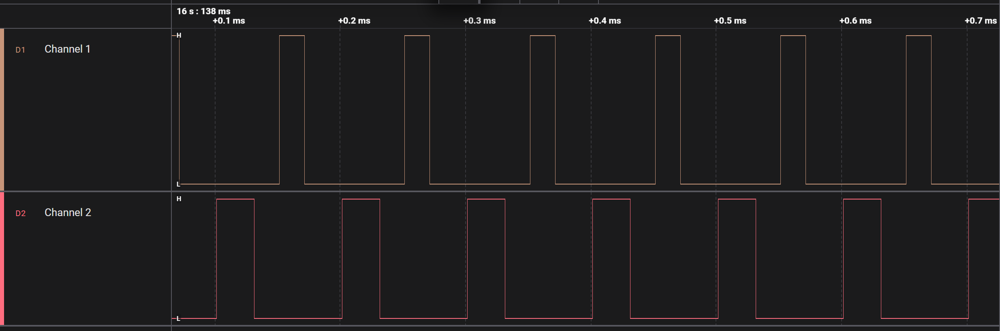

# SPWM Driver Sample Application

## Description

The SPWM Driver sample application demonstrates advanced pulse-width modulation and timing control on the supported boards for this application. It performs comprehensive SPWM testing including timer operations, PWM generation, capture functionality, and descriptor-based waveform generation to ensure precise timing control.

The sample includes multiple SPWM operations:
- **Timer operations:** Configurable timer modes with interrupt generation and callback handling.
- **Capture functionality:** Timer + capture mode for precise signal measurement and timing analysis.
- **PWM generation:** Normal PWM mode with configurable frequency and duty cycle control.
- **PWM with dead-time:** PWM_DT mode for motor control applications requiring complementary signals.
- **Pseudo-random PWM:** PWM_PR mode for electromagnetic interference reduction in power electronics.
- **Descriptor-based generation:** Advanced waveform generation using descriptor chains for complex burst patterns.

During each run, the app logs initialization status, configuration parameters, waveform generation progress, and validation results. This makes it easy for end users to confirm that SPWM setup and timing operations are working as expected.

The latest example structure uses a **common application source tree** with board-specific hardware setup kept under `hw/<BOARD>/`. For this app:
- Common application sources such as `main.c`, `spwm_sample_app.c`, and `spwm_sample_app.h` stay in the app root.
- Application defconfigs are stored under `configs/`.
- Board and hardware-specific setup is selected from `hw/<BOARD>/`, for example `hw/SL2610_RDK/`.

The application can also be exported and built as a **standalone app repository**. In that flow, keep this app in its own directory, point `SRSDK_DIR` to the SDK root, and build from the app directory itself. For the full application workflow model, see [Astra MCU SDK User Guide](../../../docs/Astra_MCU_SDK_User_Guide.md).

## Supported Boards

This application supports:
- `SL2610_RDK`

Select the defconfig that matches your target board and the desired SPWM mode, and the build system will pick the corresponding board-specific hardware setup from `hw/<BOARD>/`.

## Prerequisites
- Choose **one** setup path:
  - **CLI**: [Setup and Install SDK using CLI](../../../docs/Astra_MCU_SDK_Setup_and_Install_CLI.md)
  - **VS Code**: [Setup and Install SDK using VS Code](../../../docs/Astra_MCU_SDK_Setup_and_Install_VsCode.md)

## Test Case Selection

Before building, choose the testcase defconfig that matches both your target board and the SPWM mode you want to validate.

You can:
- Select the required defconfig directly from the application's `configs/` directory.
- Run `make list_defconfigs` from the application directory to list all supported defconfigs.

**Available defconfigs:**
- `sl2610_rdk_cm52_spwm_capture_mode_defconfig`
- `sl2610_rdk_cm52_spwm_pwm_deadtime_mode_defconfig`
- `sl2610_rdk_cm52_spwm_pwm_desc_mode_defconfig`
- `sl2610_rdk_cm52_spwm_pwm_mode_defconfig`
- `sl2610_rdk_cm52_spwm_pwm_pseudo_random_mode_defconfig`
- `sl2610_rdk_cm52_spwm_timer_mode_defconfig`

For this app, the default defconfig is:
   - `sl2610_rdk_cm52_spwm_timer_mode_defconfig`

## Building and Flashing the Example using VS Code

Use the VS Code flow described in the respective soc vscode guides and the VS Code Extension guide:
- [SL2610 Build and Flash with VS Code](../../../docs/SL2610/SL2610_Build_and_Flash_with_VSCode.md)
- [Astra MCU SDK VS Code Extension User Guide](../../../docs/Astra_MCU_SDK_VSCode_Extension_User_Guide.md)

**Build (VS Code):**
1. Open **Build and Deploy** -> **Build Configurations**.
2. Select the **spwm_sample_app** project configuration in the **Project Configuration** dropdown.
3. Select the required defconfig for the application (timer, pwm, capture, etc.).
4. Build with **Build (SDK+Project)** for the first build, or **Build (Project)** for rebuilds.

**Flash (VS Code):**
1. Use the SL2610 image-generation flow to generate the required sub-image.
2. Open **Image Flashing (SL2610)**.
3. Select **Flash Target** as **M52 Image**.
4. In **Image Path**, browse to and select the generated sub-image file, such as `sysmgr.subimg.gz`.
5. Start the flashing operation to program the image to the target.

---

## Building and Flashing the Example using CLI

Use the CLI flow described in the respective build guide:
- [SL2610 Build and Flash with CLI](../../../docs/SL2610/SL2610_Build_and_Flash_with_CLI.md)
- [Astra MCU SDK User Guide](../../../docs/Astra_MCU_SDK_User_Guide.md)

**Build (CLI):**
1. Build from the application directory itself:
   ```bash
   cd <sdk-root>/examples/driver_examples/spwm_sample_app
   export SRSDK_DIR=<sdk-root>
   make <app_defconfig> BUILD=SRSDK
   ```
2. For faster rebuilds when only app code changes, reuse the app-local installed SDK package:
   ```bash
   cd <sdk-root>/examples/driver_examples/spwm_sample_app
   export SRSDK_DIR=<sdk-root>
   make build
   ```
3. If this app has been exported to its own repository, use the same commands from that exported app directory after setting `SRSDK_DIR` to the SDK root.

**Build outputs (CLI):**
- Application binary: `<app-dir>/out/<target>/release/<target>.elf`
- App-local SDK package: `<app-dir>/install/<BOARD>/<BUILD_TYPE>/`

**Flash (CLI):**

**Flash SL2610**

1. Build the SL2610 bootloader image.
   ```
   cd <sdk-root>
   export SRSDK_DIR=<sdk-root>
   make <SL2610_Bootloader_defconfig> BOARD=<BOARD>
   make astrasdk
   ```

2. Generate the system sub-image.
   ```
   cd <sdk-root>/examples/driver_examples/spwm_sample_app
   export SRSDK_DIR=<sdk-root>
   make imagegen
   ```

3. Flash/download image to target.

   Refer: [SL2610 Platform Guide](../../../docs/SL2610/SL2610_Build_and_Flash_with_CLI.md)

---

## Running the Application using VS Code Extension

1. Press **RESET** on the board after flashing.
2. For logging output, click **SERIAL MONITOR** and connect to the UART port.
   - Connect UART bridge to the target pins for serial communication
   - The logger port may vary across OSes, try different COM ports if needed
3. For PWM waveform observation, connect a logic analyzer to the required pins.
4. SPWM sample logs appear in the logger window, including configuration status and waveform generation results.

### Sample applications logs and output

1. **Timer Application**
   - Console logs.
   ```bash
   0000000000:[0][INF]▒▒0▒J:SPWM Timer Mode Starts (group 0)
   0000000005:[0][INF]▒▒0▒J:CLKDIV[0] Setup: int_div=1 frac_div=0
   0000000011:[0][INF]▒▒0▒J:INTERRUPT Setup: group=0 intr=1
   0000000016:[0][INF]▒▒0▒J:[ISR] Callback triggered!
   0000000016:[0][INF]▒▒0▒J:[ISR] Group 0: CC0 match
   0000000016:[0][INF]▒▒0▒J:[ISR] Group 0: CC0 match
   0000000022:[0][INF]▒▒0▒J:CC0 interrupt received, counter=3034
   0000000028:[0][INF]▒▒0▒J:SPWM-Timer Sample App Completed (group 0)!
   ```

2. **Timer + Capture Application**
   - Console logs.
   ```bash
   0000000000:[0][INF]▒▒0▒K:SPWM Timer + Capture App Starts
   0000000005:[0][INF]▒▒0▒K:CLKDIV[0] Setup: int_div=1 frac_div=0
   0000000011:[0][INF]▒▒0▒K:INTERRUPT Setup: group=0 intr=1
   0000000016:[0][INF]▒▒0▒J:[ISR] Callback triggered!
   0000000016:[0][INF]▒▒0▒K:[ISR] Group 0: CC0 match
   0000000022:[0][INF]▒▒0▒K:Capture results: CC0=1108 CC1=1108
   0000000027:[0][INF]▒▒0▒K:Capture successful
   0000000031:[0][INF]▒▒0▒K:SPWM TIMER + CAPTURE Sample App Completed!
   ```

3. **PWM Sample Application**
   - Console logs.
   ```bash
   0000000000:[0][INF]▒▒0▒G:SPWM PWM-Demo Starts
   0000000004:[0][INF]▒▒0▒G:CLKDIV[0] Setup: int_div=1 frac_div=0
   0000000010:[0][INF]▒▒0▒G:SPWM Group 0 Enabled
   0000000014:[0][INF]▒▒0▒G:PWM started: Period=5000 CC0=1000
   0000000020:[0][INF]▒▒0▒G:Duty = 20.0%
   0000000023:[0][INF]▒▒0▒G:PWM Sample App Completed Successfully!
   ```

   

4. **PWM with Deadtime Application**
   - Console logs.
   ```bash
   0000000000:[0][INF]▒▒0▒G:PWM-DT App Starts
   0000000003:[0][INF]▒▒0▒G:CLKDIV[0] Setup: int_div=1 frac_div=0
   0000000010:[0][INF]▒▒0▒G:PWM-Deadtime Sample App Completed!
   ```

   

5. **PWM Pseudo Random Application**
   - Console logs.
   ```bash
   0000000000:[0][INF]▒▒0▒I:SPWM PWM Pseudo Random Mode Test Starts
   0000000005:[0][INF]▒▒0▒I:CLKDIV[0] Setup: int_div=1 frac_div=0
   0000000012:[0][INF]▒▒0▒I:INTERRUPT Setup: group=0 intr=1
   0000000017:[0][INF]▒▒0▒I:PWM Pseudo Random Mode Sample App Completed!
   ```

   

6. **PWM Ramp signal with descriptors Application**
   - Console logs.
   ```bash
   0000000000:[0][INF]▒▒0▒R:  Step 0: Period=999 CC0=200 Cycles=1 (f=100000 Hz, duty=20.00%, ~11.2µs)
   0000000008:[0][INF]▒▒0▒R:  Step 1: Period=699 CC0=140 Cycles=1 (f=142857 Hz, duty=20.00%, ~11.2µs)
   0000000017:[0][INF]▒▒0▒R:  Step 2: Period=537 CC0=107 Cycles=2 (f=185874 Hz, duty=19.89%, ~11.2µs)
   0000000026:[0][INF]▒▒0▒R:  Step 3: Period=436 CC0=87 Cycles=2 (f=228833 Hz, duty=19.91%, ~11.2µs)
   0000000035:[0][INF]▒▒0▒R:  Step 4: Period=367 CC0=73 Cycles=3 (f=271739 Hz, duty=19.84%, ~11.2µs)
   0000000044:[0][INF]▒▒0▒R:  Step 5: Period=317 CC0=63 Cycles=3 (f=314465 Hz, duty=19.81%, ~11.2µs)
   0000000053:[0][INF]▒▒0▒R:  Step 6: Period=279 CC0=56 Cycles=4 (f=357143 Hz, duty=20.00%, ~11.2µs)
   0000000062:[0][INF]▒▒0▒R:  Step 7: Period=249 CC0=50 Cycles=4 (f=400000 Hz, duty=20.00%, ~11.2µs)
   0000000071:[0][INF]▒▒0▒R:PWM ramp: 8 steps, 20 total cycles, ~90 µs burst, 58 descriptors
   0000000079:[0][INF]▒▒0▒R:CLKDIV[0] Setup: int_div=1 frac_div=0
   0000000085:[0][INF]▒▒0▒R:Initial config: ACTIVE=[Period=10 CC1=2] BUFFER=[Period=999 CC1=200]
   0000000093:[0][INF]▒▒0▒R:Building descriptor chain for configured burst time
   0000000100:[0][INF]▒▒0▒R:Descriptor chain built with 58 descriptors
   0000000107:[0][INF]▒▒0▒R:Descriptor 0 completed
   0000000108:[0][INF]▒▒0▒R:PWM-Ramp started with the configured frequency and duty cycle
   0000000116:[0][INF]▒▒0▒R:PWM-Ramp using Descriptor completed successfully!
   ```

   
