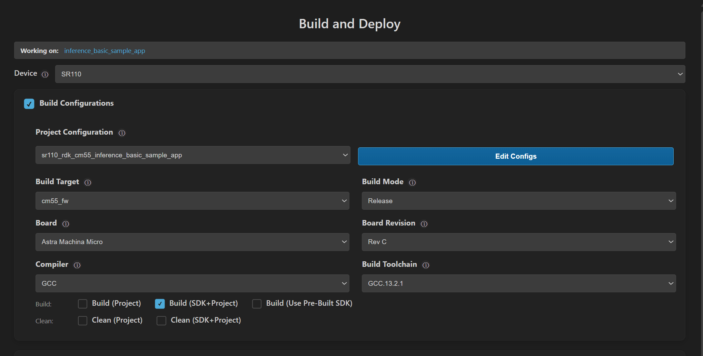

# Inference Basic Sample Application

## Description

The Inference Basic sample application estimates inference parameters of your TFLite models by running the model directly from SRAM. It reports key error metrics such as MSE, MAE, and PSNR to help evaluate model accuracy for deployment.

The latest example structure uses a **common application source tree** with board-specific hardware setup kept under `hw/<BOARD>/`. For this app:
- Common application sources such as `main.c`, `inference_basic_sample_app.cc`, and `inference_basic_sample_app.hpp` stay in the app root.
- Application defconfigs are stored under `configs/`.
- Board and hardware-specific setup is selected from `hw/<BOARD>/`, for example `hw/SR110_RDK/`.

The application can also be exported and built as a **standalone app repository**. In that flow, keep this app in its own directory, point `SRSDK_DIR` to the SDK root, and build from the app directory itself. For the full application workflow model, see [Astra MCU SDK User Guide](../../../docs/Astra_MCU_SDK_User_Guide.md).

## Supported Boards

This application supports:
- `SR110_RDK`

Select the defconfig that matches your target board, and the build system will pick the corresponding board-specific hardware setup from `hw/<BOARD>/`.

## Prerequisites
- Choose **one** setup path:
  - **CLI**: [Setup and Install SDK using CLI](../../../docs/Astra_MCU_SDK_Setup_and_Install_CLI.md)
  - **VS Code**: [Setup and Install SDK using VS Code](../../../docs/Astra_MCU_SDK_Setup_and_Install_VsCode.md)

## Project Configuration Selection

Before building, choose the project configuration (defconfig) that matches both your target board and the transfer mode you want to validate.

You can:
- Select the required defconfig directly from the application's `configs/` directory.
- Run `make list_defconfigs` from the application directory to list all supported defconfigs.

**Available defconfigs:**
- `sr110_rdk_cm55_inference_basic_sample_app_defconfig`


## Building and Flashing the Example using VS Code

Use the VS Code flow described in the SR110 guide and the VS Code Extension guide:
- [SR110 Build and Flash with VS Code](../../../docs/SR110/SR110_Build_and_Flash_with_VSCode.md)
- [Astra MCU SDK VS Code Extension User Guide](../../../docs/Astra_MCU_SDK_VSCode_Extension_User_Guide.md)

**Build (VS Code):**
1. Open **Build and Deploy** -> **Build Configurations**.
2. Select the **inference_basic_sample_app** project configuration in the **Project Configuration** dropdown.
3. Build with **Build (SDK+Project)** for the first build, or **Build (Project)** for rebuilds.



**Flash and Image Generation (VS Code):**
1. Open the Astra MCU SDK VS Code Extension and connect to the Debug IC USB port on the Astra Machina Micro Kit.
   - Refer to the [Astra MCU SDK User Guide](../../../docs/Astra_MCU_SDK_User_Guide.md) for detailed setup steps.
2. Generate firmware binaries using **Build and Deploy** -> **Image Conversion**.
   - Select the required `.axf` or `.elf` file. If the use case is built using the VS Code extension, the file path will be auto-populated.


3. Flash the application using **Build and Deploy** -> **Image Flashing**.
   - Select **SWD/JTAG** as the interface.
   - Choose the respective image bins and click **Run**.


> Note: This sample runs models from SRAM, so separate model binary conversion/flashing is not required.

---

## Building and Flashing the Example using CLI

Use the CLI flow described in the respective build guide:
- [SR110 Build and Flash with CLI](../../../docs/SR110/SR110_Build_and_Flash_with_CLI.md)
- [Astra MCU SDK User Guide](../../../docs/Astra_MCU_SDK_User_Guide.md)

**Build (CLI):**
1. Build from the application directory itself:
   ```bash
   cd <sdk-root>/examples/inference_examples/inference_basic_sample_app
   export SRSDK_DIR=<sdk-root>
   make <app_defconfig> BUILD=SRSDK
   ```
2. For faster rebuilds when only app code changes, reuse the app-local installed SDK package:
   ```bash
   cd <sdk-root>/examples/inference_examples/inference_basic_sample_app
   export SRSDK_DIR=<sdk-root>
   make build
   ```
3. If this app has been exported to its own repository, use the same commands from that exported app directory after setting `SRSDK_DIR` to the SDK root.

**Build outputs (CLI):**
- Application binary: `<app-dir>/out/<target>/release/<target>.elf`
- App-local SDK package: `<app-dir>/install/<BOARD>/<BUILD_TYPE>/`

**Flash (CLI):**
1. Activate the SDK venv (required for image generation tools):
   ```bash
   # Linux/macOS
   source <sdk-root>/.venv/bin/activate
   # Windows PowerShell
   .\.venv\Scripts\Activate.ps1
   ```
2. Generate the flash image:
   ```bash
   cd <sdk-root>/tools/srsdk_image_generator
   python srsdk_image_generator.py \
     -B0 \
     -flash_image \
     -sdk_secured \
     -spk "<sdk-root>/tools/srsdk_image_generator/Inputs/spk_rc4_1_0_secure_otpk.bin" \
     -apbl "<sdk-root>/tools/srsdk_image_generator/Inputs/sr100_b0_bootloader_ver_0x012F_ASIC.axf" \
     -m55_image "<sdk-root>/examples/inference_examples/inference_basic_sample_app/out/sr110_cm55_fw/release/sr110_cm55_fw.elf" \
     -flash_type "GD25LE128" \
     -flash_freq "67"
   ```
3. Flash the firmware image:
   ```bash
   cd <sdk-root>
   python tools/openocd/scripts/flash_xspi_tcl.py \
     --cfg_path tools/openocd/configs/sr110_m55.cfg \
     --image tools/srsdk_image_generator/Output/B0_Flash/B0_flash_full_image_GD25LE128_67Mhz_secured.bin \
     --erase-all
   ```

> Note: This sample runs models from SRAM, so separate model binary conversion/flashing is not required.

## Running the Application using VS Code Extension

1. Connect a USB cable to the Application SR110 USB port on the Astra Machina Micro board and press **RESET**.
2. For logging output, click **SERIAL MONITOR** and connect to the **DAP logger** port on J14.
   - To make it easier to identify, ensure **only J14** is plugged in (not J13).
   - The logger port is not guaranteed to be consistent across OSes. As a starting point:
     - **Windows:** try the lower-numbered J14 COM port first.
     - **Linux/macOS:** try the higher-numbered J14 port first.
   - If you do not see logs after a reset, switch to the other J14 port.

**Expected Logs**

```
SR100.Logger	warning	1767706533.876985	LOGR	0	M55	00:11:55:827:882	Changing logger interface to LOGGER_IF_UART_1_CONSOLE
SR100.Logger	info	1767706533.882348	SYS 	0	M55	00:00:00:000:024	Application drivers initialization complete without errors.
SR100.Logger	info	1767706533.884347	SYS 	0	M55	00:00:00:003:780	
SR100.Logger	info	1767706533.889291	SYS 	0	M55	00:00:00:004:967	sr110 SDK version 1.3.0
SR100.Logger	info	1767706533.891269	INFR	0	M55	00:00:00:007:184	Loading model from memory
SR100.Logger	info	1767706533.893272	INFR	0	M55	00:00:00:009:505	Arena size provided : 648000
SR100.Logger	info	1767706533.895277	INFR	0	M55	00:00:00:011:911	Memory used by the model : 645340 bytes
SR100.Logger	info	1767706533.898272	INFR	0	M55	00:00:00:014:796	Run inference 3 times
SR100.Logger	info	1767706533.899272	INFR	0	M55	00:00:00:016:897	
SR100.Logger	warning	1767706533.900269	*this message is not in proper format!:Begin inference

SR100.Logger	info	1767706533.935272	INFR	0	M55	00:00:00:062:125	model callback arg : 0
SR100.Logger	info	1767706533.939269	INFR	0	M55	00:00:00:062:140	Invoke finished
SR100.Logger	info	1767706533.94328	INFR	0	M55	00:00:00:062:171	output[0] quantization scale=0.054609, zero_point=1
SR100.Logger	info	1767706533.948315	INFR	0	M55	00:00:00:062:192	Comparing inference results vs expected results from Python
SR100.Logger	info	1767706533.951276	INFR	0	M55	00:00:00:062:209	This model has 3 output tensors
SR100.Logger	info	1767706533.95627	INFR	0	M55	00:00:00:064:364	Result for output #0
SR100.Logger	info	1767706533.957328	INFR	0	M55	00:00:00:064:378	Max Diff : 0
SR100.Logger	info	1767706533.959302	INFR	0	M55	00:00:00:064:392	MAE      : 0.000000
SR100.Logger	info	1767706533.961271	INFR	0	M55	00:00:00:064:406	MSE      : 0.000000
SR100.Logger	info	1767706533.963271	INFR	0	M55	00:00:00:064:420	RMSE     : 0.000000
SR100.Logger	info	1767706533.964287	INFR	0	M55	00:00:00:064:434	PSNR     : inf
SR100.Logger	info	1767706533.968283	INFR	0	M55	00:00:00:064:733	Result for output #1
SR100.Logger	info	1767706533.970285	INFR	0	M55	00:00:00:064:747	Max Diff : 0
SR100.Logger	info	1767706533.973285	INFR	0	M55	00:00:00:064:761	MAE      : 0.000000
SR100.Logger	info	1767706533.974285	INFR	0	M55	00:00:00:064:775	MSE      : 0.000000
SR100.Logger	info	1767706533.975286	INFR	0	M55	00:00:00:064:789	RMSE     : 0.000000
SR100.Logger	info	1767706533.977285	INFR	0	M55	00:00:00:064:803	PSNR     : inf
SR100.Logger	info	1767706533.978799	INFR	0	M55	00:00:00:066:387	Result for output #2
SR100.Logger	info	1767706533.97982	INFR	0	M55	00:00:00:066:401	Max Diff : 0
SR100.Logger	info	1767706533.982973	INFR	0	M55	00:00:00:066:415	MAE      : 0.000000
SR100.Logger	info	1767706533.985975	INFR	0	M55	00:00:00:066:429	MSE      : 0.000000
SR100.Logger	info	1767706535.960534	INFR	0	M55	00:00:00:066:443	RMSE     : 0.00000002089050:[0][INF][INFR]:model callback arg : 0
SR100.Logger	info	1767706535.961532	INFR	0	M55	00:00:02:089:065	Invoke finished
SR100.Logger	info	1767706535.963532	INFR	0	M55	00:00:02:089:186	output[0] quantization scale=0.054609, zero_point=1
SR100.Logger	info	1767706535.964532	INFR	0	M55	00:00:02:089:207	Comparing inference results vs expected results from Python
SR100.Logger	info	1767706535.967539	INFR	0	M55	00:00:02:089:225	This model has 3 output tensors
SR100.Logger	info	1767706535.98154	INFR	0	M55	00:00:02:091:378	Result for output #0
SR100.Logger	info	1767706535.983976	INFR	0	M55	00:00:02:091:393	Max Diff : 0
SR100.Logger	info	1767706535.985975	INFR	0	M55	00:00:02:091:407	MAE      : 0.000000
SR100.Logger	info	1767706535.990889	INFR	0	M55	00:00:02:091:422	MSE      : 0.000000
SR100.Logger	info	1767706535.993882	INFR	0	M55	00:00:02:091:437	RMSE     : 0.000000
SR100.Logger	info	1767706535.996883	INFR	0	M55	00:00:02:091:452	PSNR     : inf
SR100.Logger	info	1767706536.000886	INFR	0	M55	00:00:02:091:750	Result for output #1
SR100.Logger	info	1767706536.002885	INFR	0	M55	00:00:02:091:765	Max Diff : 0
SR100.Logger	info	1767706536.005884	INFR	0	M55	00:00:02:091:779	MAE      : 0.000000
SR100.Logger	info	1767706536.00931	INFR	0	M55	00:00:02:091:794	MSE      : 0.000000
SR100.Logger	info	1767706536.011309	INFR	0	M55	00:00:02:091:809	RMSE     : 0.000000
SR100.Logger	info	1767706536.01331	INFR	0	M55	00:00:02:091:824	PSNR     : inf
SR100.Logger	info	1767706536.014308	INFR	0	M55	00:00:02:093:407	Result for output #2
SR100.Logger	info	1767706536.017312	INFR	0	M55	00:00:02:093:421	Max Diff : 0
SR100.Logger	info	1767706536.019313	INFR	0	M55	00:00:02:093:435	MAE      : 0.000000
SR100.Logger	info	1767706536.021311	INFR	0	M55	00:00:02:093:450	MSE      : 0.000000
SR100.Logger	info	1767706537.983486	INFR	0	M55	00:00:02:093:465	RMSE     : 0.00000004116068:[0][INF][INFR]:model callback arg : 0
SR100.Logger	info	1767706537.98552	INFR	0	M55	00:00:04:116:084	Invoke finished
SR100.Logger	info	1767706537.988512	INFR	0	M55	00:00:04:116:202	output[0] quantization scale=0.054609, zero_point=1
SR100.Logger	info	1767706538.004512	INFR	0	M55	00:00:04:116:223	Comparing inference results vs expected results from Python
SR100.Logger	info	1767706538.006511	INFR	0	M55	00:00:04:116:241	This model has 3 output tensors
SR100.Logger	info	1767706538.00951	INFR	0	M55	00:00:04:118:394	Result for output #0
SR100.Logger	info	1767706538.012603	INFR	0	M55	00:00:04:118:409	Max Diff : 0
SR100.Logger	info	1767706538.015199	INFR	0	M55	00:00:04:118:423	MAE      : 0.000000
SR100.Logger	info	1767706538.018215	INFR	0	M55	00:00:04:118:438	MSE      : 0.000000
SR100.Logger	info	1767706538.02256	INFR	0	M55	00:00:04:118:453	RMSE     : 0.000000
SR100.Logger	info	1767706538.026023	INFR	0	M55	00:00:04:118:468	PSNR     : inf
SR100.Logger	info	1767706538.029045	INFR	0	M55	00:00:04:118:766	Result for output #1
SR100.Logger	info	1767706538.03004	INFR	0	M55	00:00:04:118:781	Max Diff : 0
SR100.Logger	info	1767706538.033077	INFR	0	M55	00:00:04:118:795	MAE      : 0.000000
SR100.Logger	info	1767706538.040037	INFR	0	M55	00:00:04:118:810	MSE      : 0.000000
SR100.Logger	info	1767706538.041401	INFR	0	M55	00:00:04:118:825	RMSE     : 0.000000
SR100.Logger	info	1767706538.042417	INFR	0	M55	00:00:04:118:840	PSNR     : inf
SR100.Logger	info	1767706538.043418	INFR	0	M55	00:00:04:120:423	Result for output #2
SR100.Logger	info	1767706538.047416	INFR	0	M55	00:00:04:120:438	Max Diff : 0
SR100.Logger	info	1767706538.051419	INFR	0	M55	00:00:04:120:452	MAE      : 0.000000
SR100.Logger	info	1767706538.056669	INFR	0	M55	00:00:04:120:467	MSE      : 0.000000
SR100.Logger	info	1767706539.985641	INFR	0	M55	00:00:04:120:482	RMSE     : 0.000000

```
