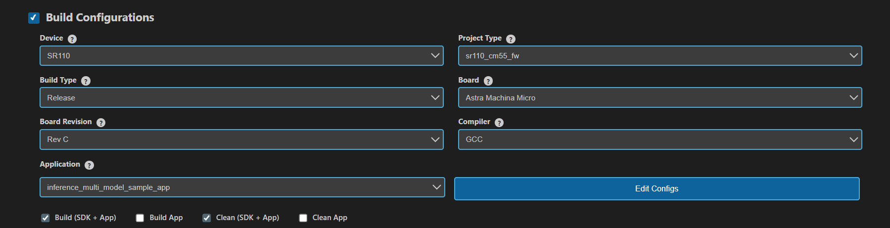

# Inference Multi-Model Sample Application

## Description

The Inference Multi-Model sample application demonstrates how to run two embedded TensorFlow Lite Micro models on SR110 using the Astra MCU SDK inference APIs.

This sample initializes two `infer_job` instances and cycles through multiple execution patterns to show synchronization and resource-sharing behavior:
- Model 1 synchronous invocation
- Model 1 asynchronous invocation followed by Model 2 asynchronous invocation
- Callback-chained execution (Model 2 queued from Model 1 callback)
- Tensor-arena lock behavior across both models

The sample also prints inference error metrics for each model output using built-in reference outputs.

The latest example structure uses a **common application source tree** with board-specific hardware setup kept under `hw/<BOARD>/`. For this app:
- Common application sources such as `main.c`, `inference_multi_model_sample_app.cc`, and `inference_multi_model_sample_app.hpp` stay in the app root.
- Application defconfigs are stored under `configs/`.
- Board and hardware-specific setup is selected from `hw/<BOARD>/`, for example `hw/SR110_RDK/`.

The application can also be exported and built as a **standalone app repository**. In that flow, keep this app in its own directory, point `SRSDK_DIR` to the SDK root, and build from the app directory itself. For the full application workflow model, see [Astra MCU SDK User Guide](../../../docs/Astra_MCU_SDK_User_Guide.md).

## Supported Boards

This application supports:
- `SR110_RDK`

Select the defconfig that matches your target board, and the build system will pick the corresponding board-specific hardware setup from `hw/<BOARD>/`.

## Prerequisites
- Choose **one** setup path:
  - **CLI**: [Setup and Install SDK using CLI](../../../docs/Astra_MCU_SDK_Setup_and_Install_CLI.md)
  - **VS Code**: [Setup and Install SDK using VS Code](../../../docs/Astra_MCU_SDK_Setup_and_Install_VsCode.md)

## Optional Configuration

You can change tensor-arena behavior in `inference_multi_model_sample_app.cc`:
- `ARENA_TYPE = SHARED_TENSOR_ARENA` (default): both models share one arena
- `ARENA_TYPE = INDEPENDENT_ARENA`: each model uses its own arena

Notes from source behavior:
- In callback-chained mode (`Option 2`), queue sizing matters. If inference queue depth is too low, deadlock can occur.
- In simultaneous locking mode (`Option 3`), behavior differs depending on shared vs independent arena mode.

## Test Case Selection

Before building, choose the testcase defconfig that matches both your target board and the transfer mode you want to validate.

You can:
- Select the required defconfig directly from the application's `configs/` directory.
- Run `make list_defconfigs` from the application directory to list all supported defconfigs.

## Building and Flashing the Example using VS Code and CLI

Use the VS Code flow described in the SR110 guide and the VS Code Extension guide:
- [SR110 Build and Flash with VS Code](../../../docs/SR110/SR110_Build_and_Flash_with_VSCode.md)
- [Astra MCU SDK VS Code Extension User Guide](../../../docs/Astra_MCU_SDK_VSCode_Extension_User_Guide.md)

**Build (VS Code):**
1. Open **Build and Deploy** -> **Build Configurations**.
2. Select **inference_multi_model_sample_app** in the **Application** dropdown.
3. Build with **Build (SDK + App)** for the first build, or **Build App** for rebuilds.



**Build (CLI):**
1. Build from the application directory itself:
   ```bash
   cd <sdk-root>/examples/inference_examples/inference_multi_model_sample_app
   export SRSDK_DIR=<sdk-root>
   make <app_defconfig> BUILD=SRSDK
   ```
2. For faster rebuilds when only app code changes, reuse the app-local installed SDK package:
   ```bash
   cd <sdk-root>/examples/inference_examples/inference_multi_model_sample_app
   export SRSDK_DIR=<sdk-root>
   make build
   ```
3. If this app has been exported to its own repository, use the same commands from that exported app directory after setting `SRSDK_DIR` to the SDK root.

**Flash (CLI):**
1. Activate the SDK venv (required for image generation tools):
   ```bash
   # Linux/macOS
   source <sdk-root>/.venv/bin/activate
   # Windows PowerShell
   .\.venv\Scripts\Activate.ps1
   ```
2. Generate the flash image:
   ```bash
   cd <sdk-root>/tools/srsdk_image_generator
   python srsdk_image_generator.py \
     -B0 \
     -flash_image \
     -sdk_secured \
     -spk "<sdk-root>/tools/srsdk_image_generator/Inputs/spk_rc4_1_0_secure_otpk.bin" \
     -apbl "<sdk-root>/tools/srsdk_image_generator/Inputs/sr100_b0_bootloader_ver_0x012F_ASIC.axf" \
     -m55_image "<sdk-root>/examples/<example_type>/<app>/out/sr110_cm55_fw/release/sr110_cm55_fw.elf" \
     -flash_type "GD25LE128" \
     -flash_freq "67"
   ```
3. Flash the firmware image:
   ```bash
   cd <sdk-root>
   python tools/openocd/scripts/flash_xspi_tcl.py \
     --cfg_path tools/openocd/configs/sr110_m55.cfg \
     --image tools/srsdk_image_generator/Output/B0_Flash/B0_flash_full_image_GD25LE128_67Mhz_secured.bin \
     --erase-all
   ```

**Flash and Image Generation (VS Code):**
1. Open the Astra MCU SDK VS Code Extension and connect to the Debug IC USB port on the Astra Machina Micro Kit.
   - Refer to the [Astra MCU SDK User Guide](../../../docs/Astra_MCU_SDK_User_Guide.md) for setup details.
2. Generate firmware binaries using **Build and Deploy** -> **Image Conversion**.
   - Select the required `.axf` or `.elf` file. If the app was built using the VS Code extension, the file path can be auto-populated.


3. Flash the application using **Build and Deploy** -> **Image Flashing**.
   - Select **SWD/JTAG** as the interface.
   - Choose the generated firmware image and click **Run**.


> Note: This sample uses models compiled into firmware (`ethosu/model1.cc` and `ethosu/model2.cc`). Separate model binary conversion/flashing is not required for default use.

## Running the Application using VS Code Extension

1. Connect a USB cable to the Application SR110 USB port on the Astra Machina Micro board and press **RESET**.
2. For logging output, click **SERIAL MONITOR** and connect to the **DAP logger** port on J14.
   - To make it easier to identify, ensure **only J14** is plugged in (not J13).
   - The logger port is not guaranteed to be consistent across OSes. As a starting point:
     - **Windows:** try the lower-numbered J14 COM port first.
     - **Linux/macOS:** try the higher-numbered J14 port first.
   - If you do not see logs after a reset, switch to the other J14 port.