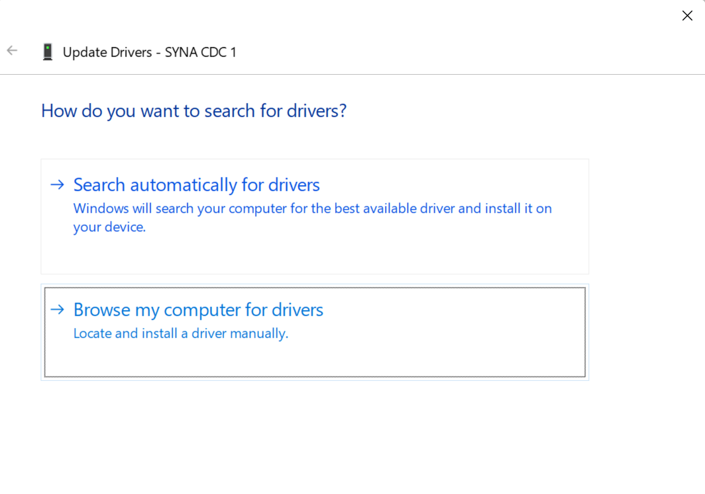

# USB CDC Image Downloader Sample App

## Description

The USB CDC Image Downloader Sample application demonstrates USB CDC communication and image data transfer on the supported boards for this application. It performs comprehensive USB CDC testing including bidirectional image frame communication, raw image data conversion, and real-time image display to ensure reliable USB-based image transfer and processing.

The sample includes multiple USB CDC operations:
- **USB CDC initialization:** Initialize USB CDC serial communication with host PC.
- **Bidirectional communication:** Support two-way USB CDC communication for image frames.
- **Image data reception:** Receive raw image data from connected device.
- **Image conversion:** Convert raw image data to viewable image files.
- **Real-time display:** Optionally display images in real-time during reception.
- **Image transmission:** Send predefined raw image files on trigger sequence.
- **Frame detection:** Detect and process image frame boundaries and headers.

During each run, the app logs initialization status, communication progress, image transfer statistics, and conversion results. This makes it easy for end users to confirm that USB CDC setup and image operations are working as expected.

The latest example structure uses a **common application source tree** with board-specific hardware setup kept under `hw/<BOARD>/`. For this app:
- Common application sources such as `main.c` and image-related files stay in the app root.
- Application defconfigs are stored under `configs/`.
- Board and hardware-specific setup is selected from `hw/<BOARD>/`, for example `hw/SR110_RDK/`.

The application can also be exported and built as a **standalone app repository**. In that flow, keep this app in its own directory, point `SRSDK_DIR` to the SDK root, and build from the app directory itself. For the full application workflow model, see [Astra MCU SDK User Guide](../../../docs/Astra_MCU_SDK_User_Guide.md).

## Supported Boards

This application supports:
- `SR110_RDK`

Select the defconfig that matches your target board, and the build system will pick the corresponding board-specific hardware setup from `hw/<BOARD>/`.

## Prerequisites
- Choose **one** setup path:
  - **CLI**: [Setup and Install SDK using CLI](../../../docs/Astra_MCU_SDK_Setup_and_Install_CLI.md)
  - **VS Code**: [Setup and Install SDK using VS Code](../../../docs/Astra_MCU_SDK_Setup_and_Install_VsCode.md)
- Install required Python packages for `detect_frame.py`:
  - `pyserial`
  - `Pillow`
  - `matplotlib`
  - `numpy`

```bash
pip install pyserial Pillow matplotlib numpy
```

## Project Configuration Selection

Before building, choose the project configuration (defconfig) that matches your target board.

You can:
- Select the required defconfig directly from the application's `configs/` directory.
- Run `make list_defconfigs` from the application directory to list all supported defconfigs.

**Available defconfigs:**
- `sr110_rdk_cm55_usb_cdc_image_downloader_sample_app_defconfig`


## Building and Flashing the Example using VS Code

Use the VS Code flow described in the SR110 guide and the VS Code Extension guide:
- [SR110 Build and Flash with VS Code](../../../docs/SR110/SR110_Build_and_Flash_with_VSCode.md)
- [Astra MCU SDK VS Code Extension User Guide](../../../docs/Astra_MCU_SDK_VSCode_Extension_User_Guide.md)

**Build (VS Code):**
1. Open **Build and Deploy** -> **Build Configurations**.
2. Select the **usb_cdc_image_downloader_sample_app** project configuration in the **Project Configuration** dropdown.
3. Build with **Build (SDK+Project)** for the first build, or **Build (Project)** for rebuilds.

**Flash (VS Code):**
1. Use **Image Conversion** to generate the flash image.
2. Use **Image Flashing** (SWD/JTAG) to flash the firmware image.

---

## Building and Flashing the Example using CLI

Use the CLI flow described in the SR110 guide:
- [SR110 Build and Flash with CLI](../../../docs/SR110/SR110_Build_and_Flash_with_CLI.md)

**Build (CLI):**
1. Build from the application directory itself:
   ```bash
   cd <sdk-root>/examples/usb_examples/usb_cdc_image_downloader_sample_app
   export SRSDK_DIR=<sdk-root>
   make <app_defconfig> BUILD=SRSDK
   ```
2. For faster rebuilds when only app code changes, reuse the app-local installed SDK package:
   ```bash
   cd <sdk-root>/examples/usb_examples/usb_cdc_image_downloader_sample_app
   export SRSDK_DIR=<sdk-root>
   make build
   ```
3. If this app has been exported to its own repository, use the same commands from that exported app directory after setting `SRSDK_DIR` to the SDK root.

**Flash (CLI):**
1. Activate the SDK venv (required for image generation tools):
   ```bash
   # Linux/macOS
   source <sdk-root>/.venv/bin/activate
   # Windows PowerShell
   .\.venv\Scripts\Activate.ps1
   ```
2. Generate the flash image:
   ```bash
   cd <sdk-root>/tools/srsdk_image_generator
   python srsdk_image_generator.py \
     -B0 \
     -flash_image \
     -sdk_secured \
     -spk "<sdk-root>/tools/srsdk_image_generator/Inputs/spk_rc4_1_0_secure_otpk.bin" \
     -apbl "<sdk-root>/tools/srsdk_image_generator/Inputs/sr100_b0_bootloader_ver_0x012F_ASIC.axf" \
     -m55_image "<sdk-root>/examples/usb_examples/usb_cdc_image_downloader_sample_app/out/sr110_cm55_fw/release/sr110_cm55_fw.elf" \
     -flash_type "GD25LE128" \
     -flash_freq "67"
   ```
3. Flash the firmware image:
   ```bash
   cd <sdk-root>
   python tools/openocd/scripts/flash_xspi_tcl.py \
     --cfg_path tools/openocd/configs/sr110_m55.cfg \
     --image tools/srsdk_image_generator/Output/B0_Flash/B0_flash_full_image_GD25LE128_67Mhz_secured.bin \
     --erase-all
   ```

---

## Running the Application using VS Code Extension

1. Connect a USB cable to the application USB port on the SR110 board and press **RESET**.
2. For logging output, click **SERIAL MONITOR** and connect to the **DAP logger** port on J14.
   - To make it easier to identify, ensure **only J14** is plugged in (not J13).
   - The logger port is not guaranteed to be consistent across OSes. As a starting point:
     - **Windows:** try the lower-numbered J14 COM port first.
     - **Linux/macOS:** try the higher-numbered J14 port first.
   - If you do not see logs after a reset, switch to the other J14 port.
3. On **Windows**, convert **SYNA CDC 1** to a serial COM port before running `detect_frame.py`:
   1. Open **Device Manager** and go to **Universal Serial Bus devices**.

      

   2. Right-click **SYNA CDC 1** and select **Update driver**.

      

   3. Select **Browse my computer for drivers**.

      

   4. Select **Let me pick from a list of available drivers on my computer**.

      

   5. Choose **USB Serial Device** and complete the installation.
      
      
   
   6. After the update, a new entry appears under **Ports (COM & LPT)** as **USB Serial Device (COMx)** (for example, `COM4`).
      
      

      - Use that `COMx` value as `<COM_PORT>` in the script command.

4. Run the downloader script on that USB CDC COM port:
   ```bash
   python detect_frame.py -c <COM_PORT> -b <BAUD_RATE> -s
   ```

5. Expected behavior after running the script:
   - The board opens an image-download window and sends an `OPEN` trigger over USB CDC.
   - The host script detects `OPEN`, sends one bundled QVGA raw frame (`sample_app_frame_qvga_01.raw` and `sample_app_frame_qvga_03.raw` alternately), and saves the transmitted payload as `<file_name>_sent.raw`.
   - The board validates checksum and then streams the image back with the image tag.
   - The script receives that frame, saves `uart_recv.raw` and `uart_recv.raw.tif` (default), and with `-s` updates the Matplotlib image window.
   - This upload/download image cycle repeats continuously while the USB CDC connection remains active.
   
   

## Expected Logs

```
0000000179:[0][INF][SYS ]:Application drivers initialization complete without errors.
0000004360:[0][INF][SYS ]:M52:: Build Date 01-04-2026 Time 16:51:54 Commit unknown
0000008410:[0][INF][SYS ]:------------------------------------------
0000011777:[0][INF][SYS ]:            Hello  ASTRA
0000015144:[0][INF][SYS ]:------------------------------------------
0000018510:[0][INF][SYS ]:System initialization done
0000021111:[0][INF][SYS ]:sr110 SDK version 1.3.0
0000023602:[0][INF][USB ]:USB device unmounted
0000025934:[0][DBG][HAPI]:------------------------------------------
0000029297:[0][DBG][HAPI]:       Host API Router task
0000032663:[0][DBG][HAPI]:------------------------------------------
0000036021:[0][INF][HAPI]:Active interface is USB
0000038481:[0][INF][USB ]:Usb CDC Image Downloader Test Task Enter
0000041754:[0][INF][GENR]:Usecase manager service started.
0000044643:[0][DBG][HAPI]:A new service was registered, service ID: 6.
0000364968:[0][INF][USB ]:USB device mounted
0009045978:[0][INF][USB ]:Starting Image Download window
0009707546:[0][INF][USB ]:IMAGE Start Pattern found. Res [320x320], Type=0x0101
0009708011:[0][INF][USB ]:IMAGE_DOWNLOAD_IN_PROCESS. Received 512 bytes
0009708100:[0][INF][USB ]:IMAGE_DOWNLOAD_IN_PROCESS. Received 1024 bytes
0009708194:[0][INF][USB ]:IMAGE_DOWNLOAD_IN_PROCESS. Received 1536 bytes
0009708274:[0][INF][USB ]:IMAGE_DOWNLOAD_IN_PROCESS. Received 2048 bytes
0009708334:[0][INF][USB ]:IMAGE_DOWNLOAD_IN_PROCESS. Received 2560 bytes
0009708393:[0][INF][USB ]:IMAGE_DOWNLOAD_IN_PROCESS. Received 3072 bytes
0009708453:[0][INF][USB ]:IMAGE_DOWNLOAD_IN_PROCESS. Received 3584 bytes
0009708513:[0][INF][USB ]:IMAGE_DOWNLOAD_IN_PROCESS. Received 4096 bytes
0009708573:[0][INF][USB ]:IMAGE_DOWNLOAD_IN_PROCESS. Received 4608 bytes
0009708632:[0][INF][USB ]:IMAGE_DOWNLOAD_IN_PROCESS. Received 5120 bytes
0009708692:[0][INF][USB ]:IMAGE_DOWNLOAD_IN_PROCESS. Received 5632 bytes
0009708752:[0][INF][USB ]:IMAGE_DOWNLOAD_IN_PROCESS. Received 6144 bytes
0009708812:[0][INF][USB ]:IMAGE_DOWNLOAD_IN_PROCESS. Received 6656 bytes
0009708871:[0][INF][USB ]:IMAGE_DOWNLOAD_IN_PROCESS. Received 7168 bytes
0009792926:[0][INF][USB ]:Starting Image Download window
0011792083:[0][INF][USB ]:Aborting, Received 0 bytes
0011793091:[0][INF][USB ]:Starting Image Download window
0013533286:[0][INF][USB ]:IMAGE Start Pattern found. Res [320x320], Type=0x0101
0013533631:[0][INF][USB ]:IMAGE_DOWNLOAD_IN_PROCESS. Received 512 bytes
0013533703:[0][INF][USB ]:IMAGE_DOWNLOAD_IN_PROCESS. Received 1024 bytes
0013533792:[0][INF][USB ]:IMAGE_DOWNLOAD_IN_PROCESS. Received 1536 bytes
0013533886:[0][INF][USB ]:IMAGE_DOWNLOAD_IN_PROCESS. Received 2048 bytes
0013533917:[0][INF][USB ]:IMAGE_DOWNLOAD_IN_PROCESS. Received 2560 bytes
0013534027:[0][INF][USB ]:IMAGE_DOWNLOAD_IN_PROCESS. Received 3072 bytes
0013534087:[0][INF][USB ]:IMAGE_DOWNLOAD_IN_PROCESS. Received 3584 bytes
0013534146:[0][INF][USB ]:IMAGE_DOWNLOAD_IN_PROCESS. Received 4096 bytes
0013534207:[0][INF][USB ]:IMAGE_DOWNLOAD_IN_PROCESS. Received 4608 bytes
0013534266:[0][INF][USB ]:IMAGE_DOWNLOAD_IN_PROCESS. Received 5120 bytes
0013534326:[0][INF][USB ]:IMAGE_DOWNLOAD_IN_PROCESS. Received 5632 bytes
0013534374:[0][INF][USB ]:IMAGE_DOWNLOAD_IN_PROCESS. Received 6144 bytes
0013534450:[0][INF][USB ]:IMAGE_DOWNLOAD_IN_PROCESS. Received 6656 bytes
0013534510:[0][INF][USB ]:IMAGE_DOWNLOAD_IN_PROCESS. Received 7168 bytes
0034253266:[0][INF][USB ]:Starting Image Download window
0034253331:[0][INF][USB ]:IMAGE Start Pattern found. Res [320x320], Type=0x0101
0034253395:[0][INF][USB ]:IMAGE_DOWNLOAD_IN_PROCESS. Received 512 bytes
0034253425:[0][INF][USB ]:IMAGE_DOWNLOAD_IN_PROCESS. Received 1006 bytes
0035253059:[0][INF][USB ]:IMAGE_DOWNLOAD_IN_PROCESS. Received 1006 bytes
0035467001:[0][INF][USB ]:IMAGE_DOWNLOAD_IN_PROCESS. Received 1024 bytes
0035467337:[0][INF][USB ]:IMAGE_DOWNLOAD_IN_PROCESS. Received 1536 bytes
0035467397:[0][INF][USB ]:IMAGE_DOWNLOAD_IN_PROCESS. Received 2048 bytes
0035467487:[0][INF][USB ]:IMAGE_DOWNLOAD_IN_PROCESS. Received 2560 bytes
0035467592:[0][INF][USB ]:IMAGE_DOWNLOAD_IN_PROCESS. Received 3072 bytes
0035467652:[0][INF][USB ]:IMAGE_DOWNLOAD_IN_PROCESS. Received 3584 bytes
0035467714:[0][INF][USB ]:IMAGE_DOWNLOAD_IN_PROCESS. Received 4096 bytes
0035467774:[0][INF][USB ]:IMAGE_DOWNLOAD_IN_PROCESS. Received 4608 bytes
0035467833:[0][INF][USB ]:IMAGE_DOWNLOAD_IN_PROCESS. Received 5120 bytes
0035467893:[0][INF][USB ]:IMAGE_DOWNLOAD_IN_PROCESS. Received 5632 bytes
0035467953:[0][INF][USB ]:IMAGE_DOWNLOAD_IN_PROCESS. Received 6144 bytes
0035468012:[0][INF][USB ]:IMAGE_DOWNLOAD_IN_PROCESS. Received 6656 bytes
0035468073:[0][INF][USB ]:IMAGE_DOWNLOAD_IN_PROCESS. Received 7168 bytes
0035468132:[0][INF][USB ]:IMAGE_DOWNLOAD_IN_PROCESS. Received 7680 bytes
0035468192:[0][INF][USB ]:IMAGE_DOWNLOAD_IN_PROCESS. Received 8192 bytes
*** Disconnected from /dev/ttyACM1 ***
```

## Features of Python Script

- **Serial Port Communication:** Opens and manages USB CDC serial connection.
- **Receive Raw Image Frames:** Detects frame tags and receives raw image payloads.
- **Image Processing and Saving:** Converts data to grayscale `.tif` output.
- **Real-time Image Display:** Optionally displays received frames.
- **Send Image Frames:** Sends predefined raw frames on trigger.
- **COM Port Listing:** Helps identify available serial ports.
