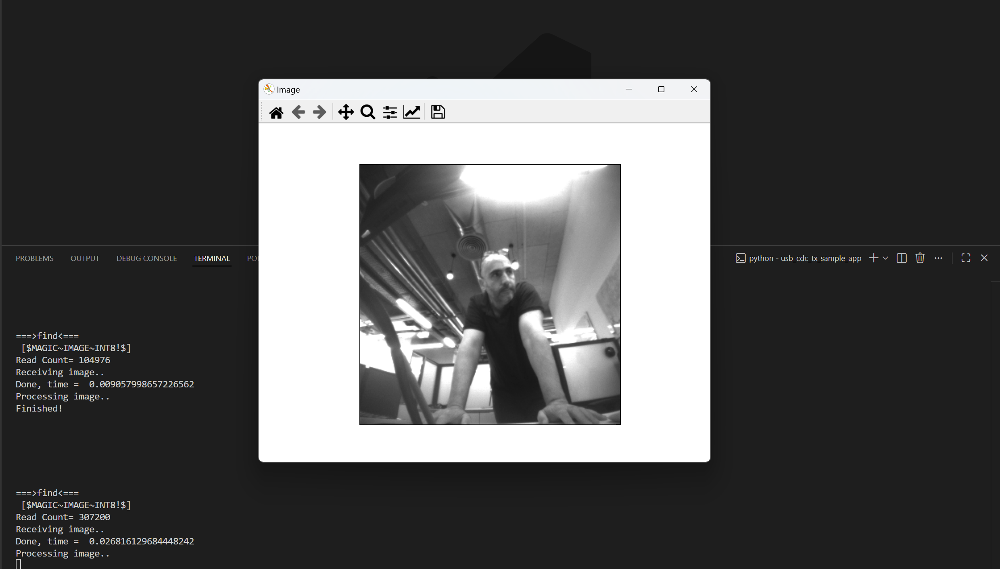

# USB CDC TX Sample App

## Description

The USB CDC TX Sample application demonstrates USB CDC communication and data transmission on the supported boards for this application. It performs comprehensive USB CDC testing including image data transmission, object detection result streaming, and host communication to ensure reliable USB-based data transfer and visualization capabilities.

The sample includes multiple USB CDC operations:
- **USB CDC initialization:** Initialize USB CDC serial communication with host PC.
- **Image data transmission:** Transmit raw image streams over USB CDC connection.
- **Object detection streaming:** Send object detection results with confidence scores.
- **Host communication:** Maintain reliable communication with Astra Machina Micro Eval Kit.
- **Data visualization:** Support bounding box visualization and confidence scoring.
- **Image conversion:** Facilitate conversion of raw image streams to viewable formats.
- **Real-time processing:** Enable real-time image and detection data transmission.

During each run, the app logs initialization status, transmission progress, detection results, and communication statistics. This makes it easy for end users to confirm that USB CDC setup and data transmission operations are working as expected.

The latest example structure uses a **common application source tree** with board-specific hardware setup kept under `hw/<BOARD>/`. For this app:
- Common application sources such as `main.c` and USB CDC transmission files stay in the app root.
- Application defconfigs are stored under `configs/`.
- Board and hardware-specific setup is selected from `hw/<BOARD>/`, for example `hw/SR110_RDK/`.

The application can also be exported and built as a **standalone app repository**. In that flow, keep this app in its own directory, point `SRSDK_DIR` to the SDK root, and build from the app directory itself. For the full application workflow model, see [Astra MCU SDK User Guide](../../../docs/Astra_MCU_SDK_User_Guide.md).

## Supported Boards

This application supports:
- `SR110_RDK`

Select the defconfig that matches your target board, and the build system will pick the corresponding board-specific hardware setup from `hw/<BOARD>/`.

## Prerequisites
- Choose **one** setup path:
  - **CLI**: [Setup and Install SDK using CLI](../../../docs/Astra_MCU_SDK_Setup_and_Install_CLI.md)
  - **VS Code**: [Setup and Install SDK using VS Code](../../../docs/Astra_MCU_SDK_Setup_and_Install_VsCode.md)
- Install required Python packages for `parser.py`:
  - `pyserial`
  - `Pillow`
  - `matplotlib`
  - `numpy`
  - `opencv-python`

```bash
pip install pyserial Pillow matplotlib numpy opencv-python
```

## Test Case Selection

Before building, choose the testcase defconfig that matches your target board.

You can:
- Select the required defconfig directly from the application's `configs/` directory.
- Run `make list_defconfigs` from the application directory to list all supported defconfigs.

**Available defconfigs:**
- `sr110_rdk_cm55_usb_cdc_tx_sample_app_defconfig`


## Building and Flashing the Example using VS Code

Use the VS Code flow described in the SR110 guide and the VS Code Extension guide:
- [SR110 Build and Flash with VS Code](../../../docs/SR110/SR110_Build_and_Flash_with_VSCode.md)
- [Astra MCU SDK VS Code Extension User Guide](../../../docs/Astra_MCU_SDK_VSCode_Extension_User_Guide.md)

**Build (VS Code):**
1. Open **Build and Deploy** -> **Build Configurations**.
2. Select the **usb_cdc_tx_sample_app** project configuration in the **Project Configuration** dropdown.
3. Build with **Build (SDK+Project)** for the first build, or **Build (Project)** for rebuilds.

**Flash (VS Code):**
1. Use **Image Conversion** to generate the flash image.
2. Use **Image Flashing** (SWD/JTAG) to flash the firmware image.

---

## Building and Flashing the Example using CLI

Use the CLI flow described in the SR110 guide:
- [SR110 Build and Flash with CLI](../../../docs/SR110/SR110_Build_and_Flash_with_CLI.md)

**Build (CLI):**
1. Build from the application directory itself:
   ```bash
   cd <sdk-root>/examples/usb_examples/usb_cdc_tx_sample_app
   export SRSDK_DIR=<sdk-root>
   make <app_defconfig> BUILD=SRSDK
   ```
2. For faster rebuilds when only app code changes, reuse the app-local installed SDK package:
   ```bash
   cd <sdk-root>/examples/usb_examples/usb_cdc_tx_sample_app
   export SRSDK_DIR=<sdk-root>
   make build
   ```
3. If this app has been exported to its own repository, use the same commands from that exported app directory after setting `SRSDK_DIR` to the SDK root.

**Flash (CLI):**
1. Activate the SDK venv (required for image generation tools):
   ```bash
   # Linux/macOS
   source <sdk-root>/.venv/bin/activate
   # Windows PowerShell
   .\.venv\Scripts\Activate.ps1
   ```
2. Generate the flash image:
   ```bash
   cd <sdk-root>/tools/srsdk_image_generator
   python srsdk_image_generator.py \
     -B0 \
     -flash_image \
     -sdk_secured \
     -spk "<sdk-root>/tools/srsdk_image_generator/Inputs/spk_rc4_1_0_secure_otpk.bin" \
     -apbl "<sdk-root>/tools/srsdk_image_generator/Inputs/sr100_b0_bootloader_ver_0x012F_ASIC.axf" \
     -m55_image "<sdk-root>/examples/usb_examples/usb_cdc_tx_sample_app/out/sr110_cm55_fw/release/sr110_cm55_fw.elf" \
     -flash_type "GD25LE128" \
     -flash_freq "67"
   ```
3. Flash the firmware image:
   ```bash
   cd <sdk-root>
   python tools/openocd/scripts/flash_xspi_tcl.py \
     --cfg_path tools/openocd/configs/sr110_m55.cfg \
     --image tools/srsdk_image_generator/Output/B0_Flash/B0_flash_full_image_GD25LE128_67Mhz_secured.bin \
     --erase-all
   ```

---

## Running the Application using VS Code Extension

1. Connect a USB cable to the application USB port on the SR110 board and press **RESET**.
2. For logging output, click **SERIAL MONITOR** and connect to the **DAP logger** port on J14.
   - To make it easier to identify, ensure **only J14** is plugged in (not J13).
   - The logger port is not guaranteed to be consistent across OSes. As a starting point:
     - **Windows:** try the lower-numbered J14 COM port first.
     - **Linux/macOS:** try the higher-numbered J14 port first.
   - If you do not see logs after a reset, switch to the other J14 port.
3. On Windows, if required, update the COM port driver in Device Manager to **USB Serial Device**.
4. Run the parser script and listen on the **USB CDC COM port** (`<COM_PORT>` must be the USB CDC virtual serial port exposed by the app, **not** the DAP/logger COM port):
   ```bash
   python parser.py -c <COM_PORT> -b <BAUDRATE> -s
   ```
5. Expected behavior after running the script:
   - The board sends preloaded grayscale sample images over USB CDC about once per second.
   - A Matplotlib viewer window opens (because of `-s`) and refreshes with each received frame, so images appear to switch/flash.
   - Each received frame is also saved locally as `uart_recv.raw` and `uart_recv.raw.tif` by default (overwritten each cycle unless `-f` is used).

   
## Features

- **List Available Connections:** Discover and display connected USB CDC serial ports.
- **Receive Image Data:** Capture raw image data streamed from the device.
- **Save Images:** Convert received raw image data into `.tif` files.
- **Real-time Image Display:** Display incoming images in a pop-up window.
- **Visualize Detections:** Overlay bounding boxes and confidence scores.
- **Customizable Settings:** Configure COM port, baud rate, and output filename via CLI options.
