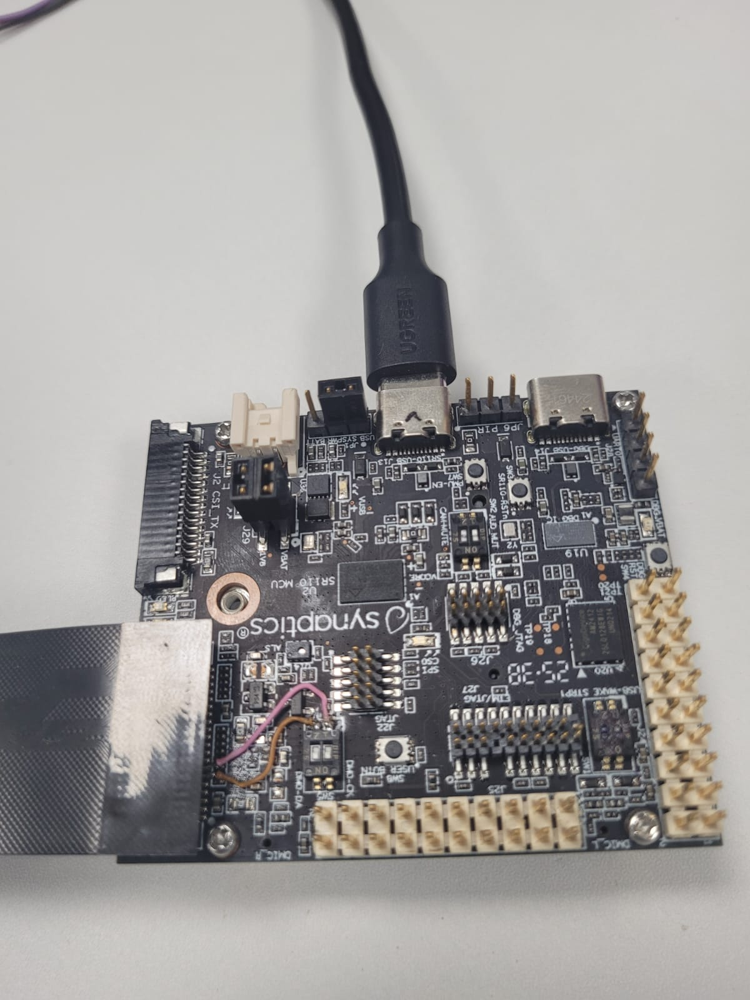
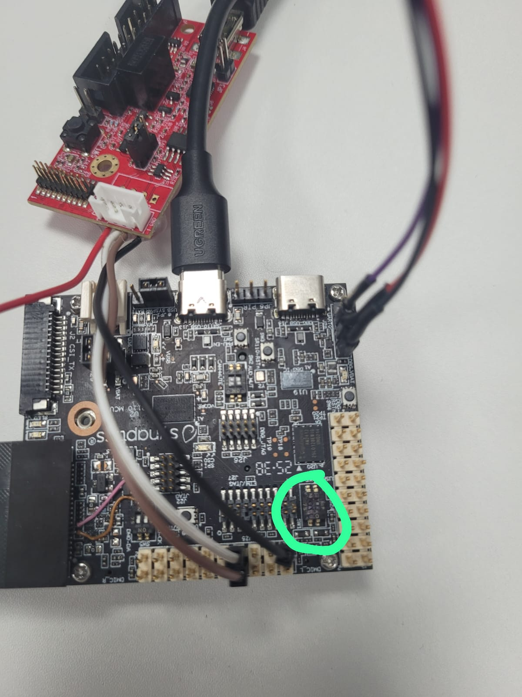
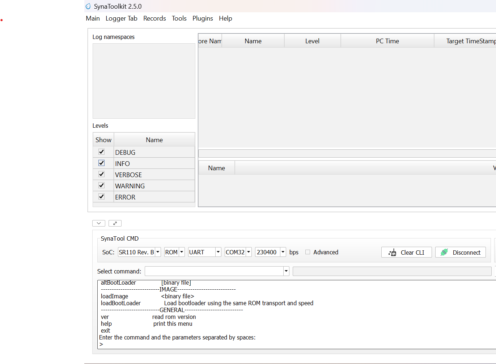
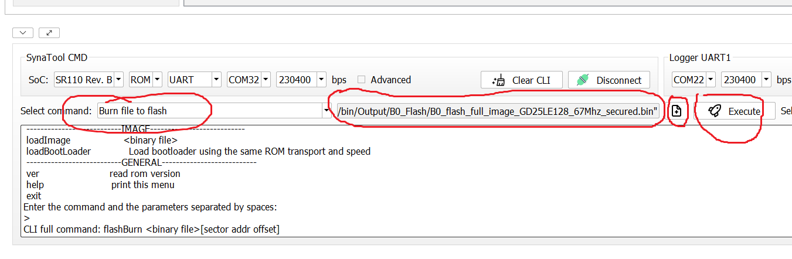
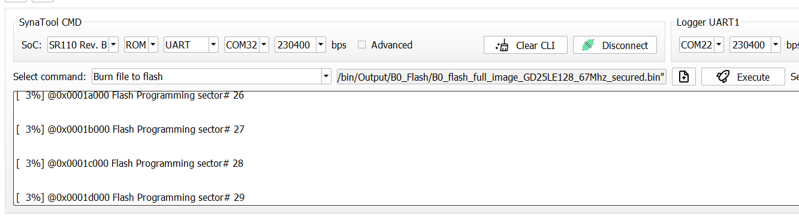
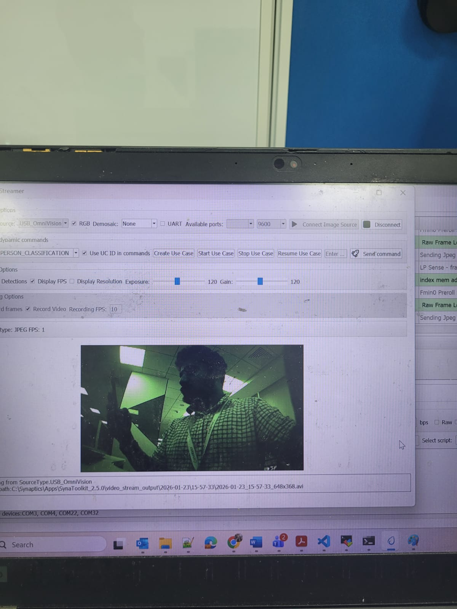

# JPEG Sample Application

## Description

The JPEG Camera sample application uses the PS5416 to capture a 648 × 368 RAW Bayer image along with a sequence of JPEG pre-roll images. The application sends the latest captured JPEG frame every 3 seconds. The JPEG images are saved in the overlayed_frames subfolder within the video_stream_output directory of the SynaToolkit folder.

## Platform Setup

### Rework Details

This rework is required because another device with I2C address `0x4C` is already present on the I2C1 bus. To avoid an address conflict, the image sensor is connected to the I2C0 interface.

**Remove R244 & R245**
    
    1. Connect SW5.2 to R244 at Samtec connector End.
    2. Connect SW5.1 to R245 at Samtec connector End.
    

### Prerequisites
- [GCC/AC6 build environment setup](../../../docs/build_env)
- [Astra MCU SDK VS Code Extension installed and configured](../../../docs/Astra_MCU_SDK_VSCode_Extension_User_Guide.pdf)
- [SynaToolkit installed and configured](../../../docs/Synatoolkit_User_Guide.pdf)
- Zadiq Driver installed and configured

### Setup and Flashing

1. **Open the Astra MCU SDK VSCode Extension and connect to the Debug IC USB port on the Astra Machina Micro Kit.**
   For detailed steps refer to the [Astra Machina Micro Eval Kit](../../../docs/Astra_MCU_SDK_Quick_Start_Guide.md).

2. **Generate Binary Files**
   - FW Binary generation
      - Navigate to **AXF/ELF TO BIN** → **Bin Conversion** in Astra MCU SDK VSCode Extension
      - Load the generated `sr110_cm55_fw.elf` or `sr110_cm55_fw.axf` file
      - Click **Run Image Generator** to create the binary files
      - Refer to [Astra MCU SDK VSCode Extension User Guide](../../../docs/Astra_MCU_SDK_VSCode_Extension_User_Guide.pdf).
   - Model Binary generation (to place the Model in Flash)
      - To generate `.bin` file for TFLite models, please refer to the [Vela compilation guide](../../../docs/Astra_MCU_SDK_vela_compilation_tflite_model.md).

3. **Flash the Application**

   **To flash the application from VS Code Extension:**

   - Navigate to **IMAGE LOADING** in the Astra MCU SDK VSCode Extension.
   - Select **SWD/JTAG** as the service type.
   - Choose the respective image bins and click **Flash Execute**.
   - Flash the generated `B0_flash_full_image_GD25LE128_67Mhz_secured.bin` file.

   Refer to the [Astra MCU SDK VSCode Extension User Guide](../../../docs/Astra_MCU_SDK_VSCode_Extension_User_Guide.pdf)
   for detailed instructions on flashing.

   **To flash the application from SynaToolKit:**

   - Change the bootstrap switch position to ROM mode (SW1: ON, SW2: ON).
     
     

   - Connect the SynaToolKit in ROM mode. Select the following from the SynaToolkit window:
     1. ROM
     2. UART
     3. Second UART0 COM port
     4. Baud rate: 230400
     5. Click **Connect**

     

   - Burn the firmware image into flash:
     1. Select the flash image.
     2. Select **Burn to File Flash** as the command and click **Execute**.

     

     

   - Once flashing is complete, power off the platform and change the bootstrap switch position to `10`
     (SW1: ON, SW2: OFF).
   - Restart the platform to boot from flash.

### Running the Application 
 
1. **Open SynaToolkit_2.5.0**

2. **Before running the application, make sure to connect a USB cable to the Application SR110 USB port on the Astra Machina Micro board and then press the reset button**
   - For logging output, connect to DAP logger port 
3. **Once the application boots it will automatically open video streamer and capture frames. The application will send the latest JPEG in every 3 secoonds**

    
   

4. **Rerun Setup**
   - To rerun the application, press the RSTN button on the SR110 RDK
