# Face Identification + Hand Gesture Detection ML Application

## Description

Face ID + Hand Gesture Detection is an advanced real-time computer vision application that integrates facial recognition and hand gesture control. It enables seamless, contactless user interaction through intelligent ML-based recognition and gesture-driven commands. Supports only HD resolution.

The latest example structure uses a **common application source tree** with board-specific hardware setup kept under `hw/<BOARD>/`. For this app:
- Common application sources such as `main.c`, `uc_fid_hgd.c`, and `uc_fid_hgd.h` stay in the app root.
- Application defconfigs are stored under `configs/`.
- Board and hardware-specific setup is selected from `hw/<BOARD>/`, for example `hw/SR110_RDK/`.

The application can also be exported and built as a **standalone app repository**. In that flow, keep this app in its own directory, point `SRSDK_DIR` to the SDK root, and build from the app directory itself. For the full application workflow model, see [Astra MCU SDK User Guide](../../../docs/Astra_MCU_SDK_User_Guide.md).

**Note**: Please reach out to Synaptic representative for FID models

## Supported Boards

This application supports:
- `SR110_RDK`

Select the defconfig that matches your target board, and the build system will pick the corresponding board-specific hardware setup from `hw/<BOARD>/`.

## Prerequisites
- Choose **one** setup path:
  - **CLI**: [Setup and Install SDK using CLI](../../../docs/Astra_MCU_SDK_Setup_and_Install_CLI.md)
  - **VS Code**: [Setup and Install SDK using VS Code](../../../docs/Astra_MCU_SDK_Setup_and_Install_VsCode.md)

## Hardware Requirements
- Astra Machina Micro kit - SR110
- OV5647 Camera Sensor

> **Note:** The OV5647 camera sensor is **not included** with the Astra Machina Micro kit and must be procured separately. For part details and procurement options, reach out to Synaptics on the OV5647 part details.

### Connecting the Sensor
1. Insert the OV5647 sensor into the **J23** port on the SR110 RDK kit.

   

2. Make sure the sensor is mounted in the correct orientation. Refer to the picture below for the correct orientation.

   

## Project Configuration Selection

Before building, choose the project configuration (defconfig) that matches both your target board and the transfer mode you want to validate.

You can:
- Select the required defconfig directly from the application's `configs/` directory.
- Run `make list_defconfigs` from the application directory to list all supported defconfigs.

**Available defconfigs:**
- `sr110_rdk_cm55_fid_hgd_defconfig`


## Building and Flashing the Example using VS Code and CLI

Use the VS Code flow described in the SR110 guide and the VS Code Extension guide:
- [SR110 Build and Flash with VS Code](../../../docs/SR110/SR110_Build_and_Flash_with_VSCode.md)
- [Astra MCU SDK VS Code Extension User Guide](../../../docs/Astra_MCU_SDK_VSCode_Extension_User_Guide.md)

**Build (VS Code):**
1. Open **Build and Deploy** → **Build Configurations**.
2. Select the **fid_hgd** project configuration in the **Project Configuration** dropdown.
3. Build with **Build (SDK+Project)** for the first build, or **Build (Project)** for rebuilds.

**Build (CLI):**
1. Build from the application directory itself:
   ```bash
   cd <sdk-root>/examples/vision_examples/uc_fid_hgd
   export SRSDK_DIR=<sdk-root>
   make <app_defconfig> BUILD=SRSDK
   ```
2. For faster rebuilds when only app code changes, reuse the app-local installed SDK package:
   ```bash
   cd <sdk-root>/examples/vision_examples/uc_fid_hgd
   export SRSDK_DIR=<sdk-root>
   make build
   ```
4. If this app has been exported to its own repository, use the same commands from that exported app directory after setting `SRSDK_DIR` to the SDK root.

**Build outputs (CLI):**
- Application binary: `<app-dir>/out/<target>/release/<target>.elf`
- App-local SDK package: `<app-dir>/install/<BOARD>/<BUILD_TYPE>/`

**Flash (VS Code):**
1. Use **Image Conversion** to generate the flash image.
2. In **Image Conversion**, open **Advanced Configurations** and edit `NVM_data.json`.
3. Set model flash offsets in `NVM_data.json`:
   - `image_offset_Model_A_offset`: `0060E000`
   - `image_offset_Model_B_offset`: `00737000`
4. Under `Advanced Options`, select the `Flash AB Partition` checkbox.
5. In **Image Flashing** (SWD/JTAG), flash the model binaries first:
   - `face_detection_hd_flash(1280x704).bin` at `0x60E000`
   - `face_embeddings_flash(112x112).bin` at `0x737000`
   - `hand_gesture_detection_flash(320x320).bin` at 0x9DC000
6. Flash the generated firmware image (`B0_flash_full_image_GD25LE128_67Mhz_secured.bin`).

**Flash (CLI):**

1. Activate the SDK venv (required for image generation tools):
   ```bash
   # Linux/macOS
   source <sdk-root>/.venv/bin/activate
   # Windows PowerShell
   .\.venv\Scripts\Activate.ps1
   ```
2. Set model flash offsets in `tools/srsdk_image_generator/Input_Config/NVM_data.json`:
   - `image_offset_Model_A_offset`: `0060E000`
   - `image_offset_Model_B_offset`: `00737000`
3. Generate the flash image:
   ```bash
   cd <sdk-root>/tools/srsdk_image_generator
   python srsdk_image_generator.py \
     -B0 \
     -flash_image \
     -sdk_secured \
     -spk "<sdk-root>/tools/srsdk_image_generator/Inputs/spk_rc4_1_0_secure_otpk.bin" \
     -apbl "<sdk-root>/tools/srsdk_image_generator/Inputs/sr100_b0_bootloader_ver_0x012F_ASIC.axf" \
     -m55_image "<sdk-root>/examples/vision_examples/uc_fid_hgd/out/sr110_cm55_fw/release/sr110_cm55_fw.elf" \
     -flash_type "GD25LE128" \
     -flash_freq "67"
   ```
4. Flash model binaries first:
   ```bash
   cd <sdk-root>
   python tools/openocd/scripts/flash_xspi_tcl.py \
     --cfg_path tools/openocd/configs/sr110_m55.cfg \
     --image examples/vision_examples/uc_fid_hgd/models/face_detection_hd_flash(1280x704).bin \
     --flash-offset 0x60E000

   python tools/openocd/scripts/flash_xspi_tcl.py \
     --cfg_path tools/openocd/configs/sr110_m55.cfg \
     --image examples/vision_examples/uc_fid_hgd/models/face_embeddings_flash(112x112).bin \
     --flash-offset 0x737000

   python tools/openocd/scripts/flash_xspi_tcl.py \
     --cfg_path tools/openocd/configs/sr110_m55.cfg \
     --image examples/vision_examples/uc_fid_hgd/models/hand_gesture_detection_flash(320x320).bin \
     --flash-offset 0x9DC000
   ```
4. Flash the firmware image:
   ```bash
   cd <sdk-root>
   python tools/openocd/scripts/flash_xspi_tcl.py \
     --cfg_path tools/openocd/configs/sr110_m55.cfg \
     --image tools/srsdk_image_generator/Output/B0_Flash/B0_flash_full_image_GD25LE128_67Mhz_secured.bin \
     --erase-all
   ```

---

## Running the Application using VS Code Extension

> **Windows note:** Ensure the USB drivers are installed for streaming. See the Zadig steps in  
> [SR110 Build and Flash with VS Code](../../../docs/SR110/SR110_Build_and_Flash_with_VSCode.md#usb-cdc-image-streaming-windows).

1. In VS Code, open **Video Streamer** from the Synaptics sidebar.

   

2. For logging output, click **SERIAL MONITOR** and connect to the **DAP logger** port on J14.
   - To make it easier to identify, ensure **only J14** is plugged in (not J13).
   - The logger port is not guaranteed to be consistent across OSes. As a starting point:
     - **Windows:** try the lower-numbered J14 COM port first.
     - **Linux/macOS:** try the higher-numbered J14 port first.
   - If you do not see logs after a reset, switch to the other J14 port.

3. In the Video Streamer dropdown, select the **J13** COM port.
   - Plug in **J13** and press **RESET** on the board.
   - **Windows:** select the newly enumerated COM port.
   - **Linux/macOS:** select the lower-numbered COM port of the two newly enumerated ports.

4. Use the Video Streamer controls:

   a. Select **FACEID+HAND_GESTURE** from the **UC ID** dropdown.  
   b. Set **RGB Demosaic** to **BayerGBRG**.  
   c. Click **Create Use Case**.  
   d. Click **Start Use Case** (a Python window opens and the video stream appears).

   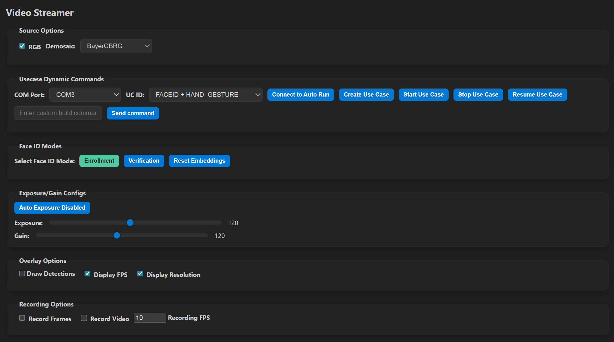

5. For logs, use the **LOGGER** tab when needed.

6. Change **FACEID Modes** as needed:
   - Enrollment
   - Verification
   - Reset Embeddings

7. Change **Visualization Modes** as needed:
   - Smart TV Gesture Control
   - 720p
   - 320x320
   - Text only

8. After starting the use case, Face Identification will begin streaming video as shown below.

   - ***Enrollmemt Mode:***
     Used to register a new user. The system captures and stores the facial 
embeddings for future recognition.

     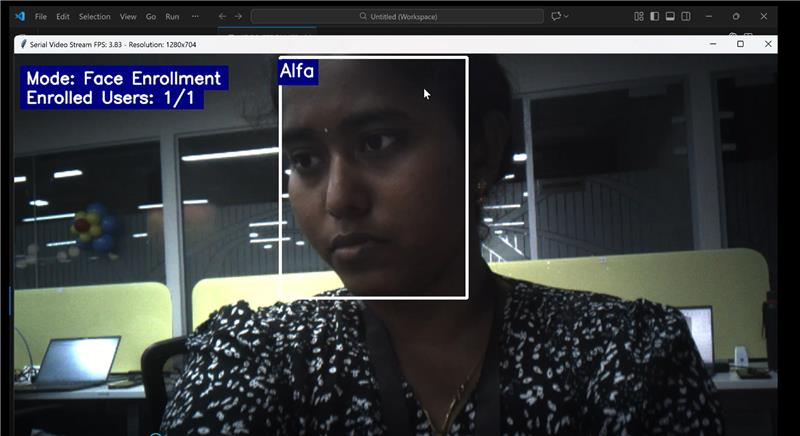

   - ***Verification Mode:***
     Used to recognize already enrolled users. Supports verification of up to three faces in sequence. When multiple faces are detected, the system selects the three largest faces for verification. After a successful match, the system automatically switches to Hand Gesture Detection (HGD) mode(This mode includes four internal modes - 720p, 320x320, Smart TV Mode, and Text Only Mode.)

     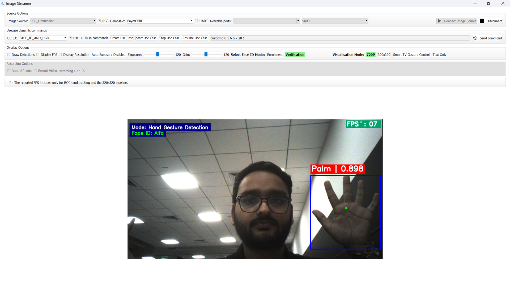

## Supported Hand Gestures

The following hand gestures are supported:

| Gesture | Description |
|---|---|
| One | One finger raised (index finger). |
| Two | Two fingers raised. |
| Three | Three fingers raised. |
| Four | Four fingers raised. |
| Five | Open palm with five fingers raised and slightly spread apart. |
| Fist | Closed fist with fingers folded inward. |
| Thumbs Up | Thumb raised upward with other fingers folded. |
| Thumbs Down | Thumb pointed downward with other fingers folded. |
| Pinch | Thumb and index finger brought close together (pinching pose). |

> **Note:** For the **Five / Palm** gesture, keep your fingers **slightly spread apart**, not pressed together. A flat palm with the fingers held tightly together may not be detected reliably.

</br>

**Gesture one**

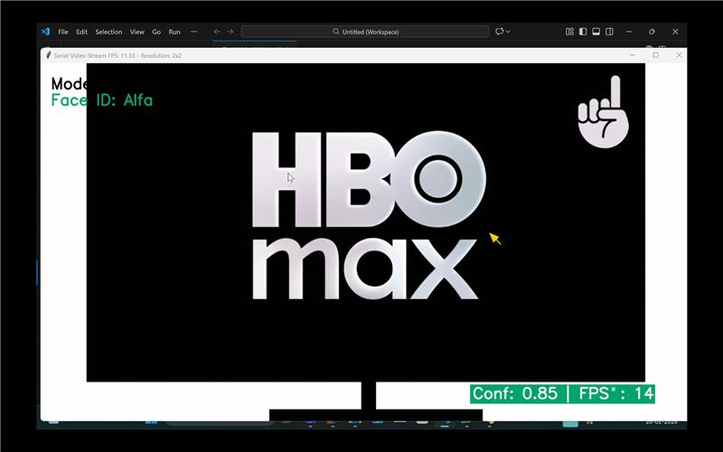

**Gesture two**

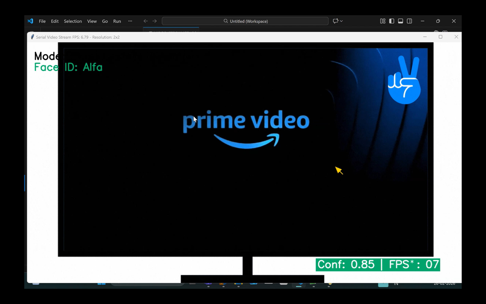

**Gesture Three**

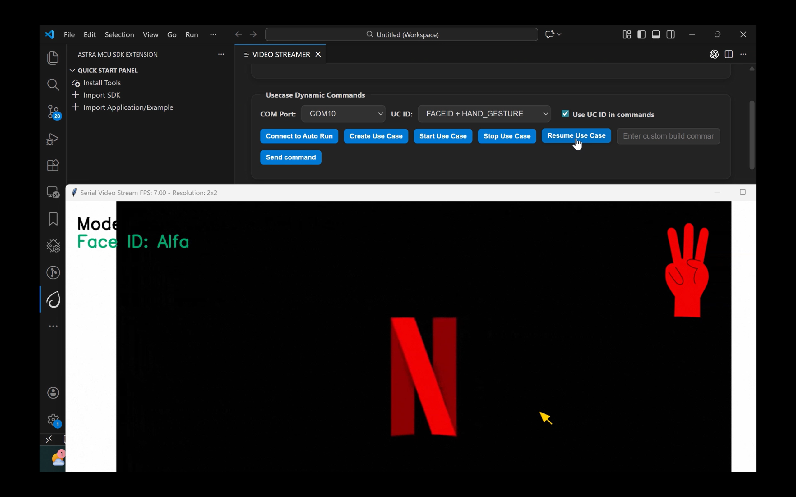

**Gesture four**

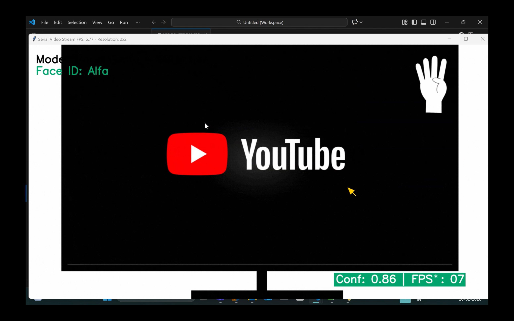

**Gesture palm**

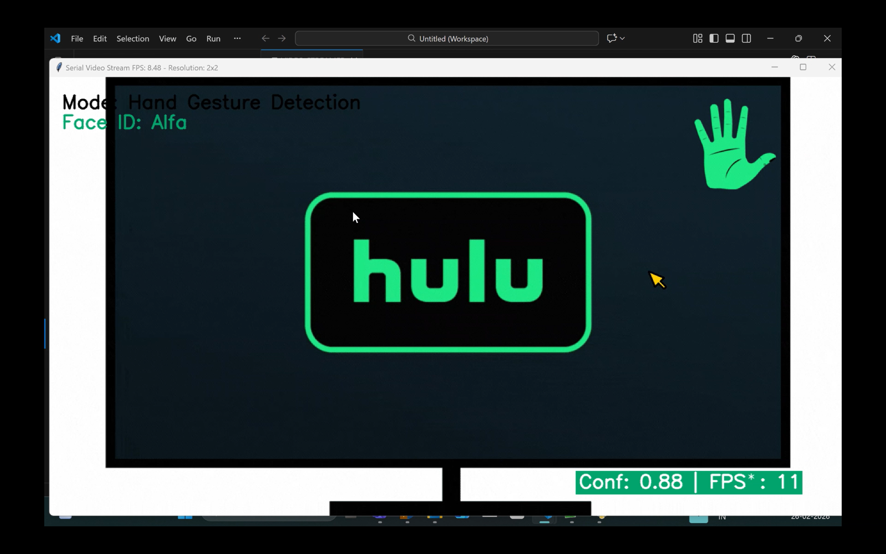

**Gesture fist**

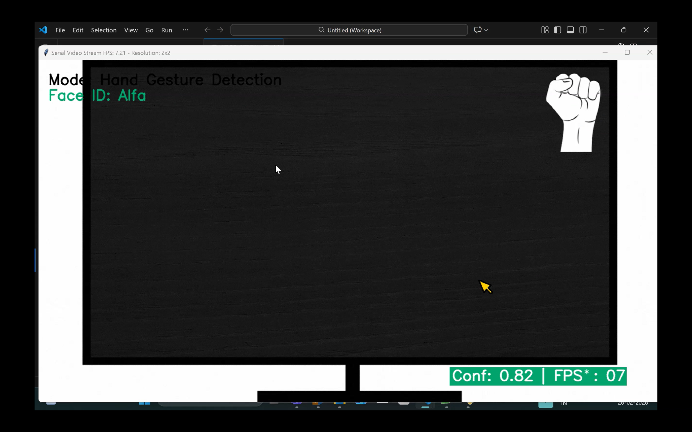

**Gesture Thumbs Up**

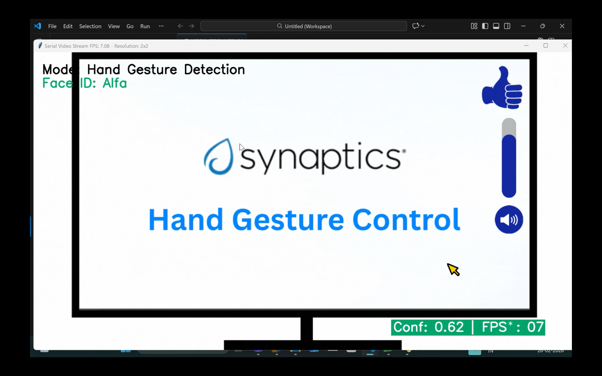

**Gesture Thumbs Down**

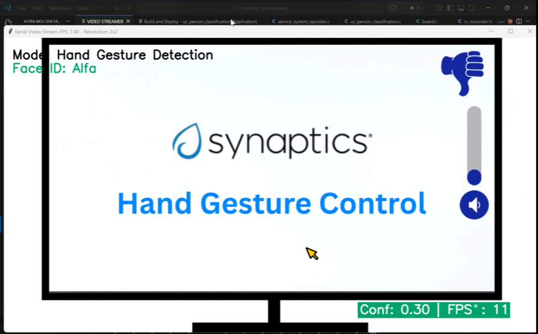

**Gesture Pinch**

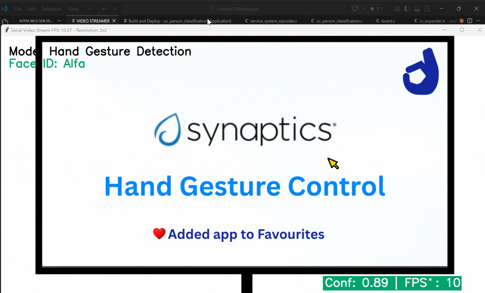
