# Hand Gesture Detection ML Application

## Description

The Hand Gesture Detection application is an ML-based computer vision solution designed for real-time gesture recognition with hand detection, single-hand tracking, and hand key-point estimation. The application detects hands in every frame, tracks one hand across frames, identifies one key point (at the center) for each hand location, and classifies the hand pose into one of the supported gesture classes. This use case supports HD resolution.

The latest example structure uses a **common application source tree** with board-specific hardware setup kept under `hw/<BOARD>/`. For this app:
- Common application sources such as `main.c`, `uc_hand_gesture_detection.c`, and `uc_hand_gesture_detection.h` stay in the app root.
- Application defconfigs are stored under `configs/`.
- Board and hardware-specific setup is selected from `hw/<BOARD>/`, for example `hw/SR110_RDK/`.

The application can also be exported and built as a **standalone app repository**. In that flow, keep this app in its own directory, point `SRSDK_DIR` to the SDK root, and build from the app directory itself. For the full application workflow model, see [Astra MCU SDK User Guide](../../../docs/Astra_MCU_SDK_User_Guide.md).

## Supported Boards

This application supports:
- `SR110_RDK`

Select the defconfig that matches your target board, and the build system will pick the corresponding board-specific hardware setup from `hw/<BOARD>/`.

## Prerequisites
- Choose **one** setup path:
  - **CLI**: [Setup and Install SDK using CLI](../../../docs/Astra_MCU_SDK_Setup_and_Install_CLI.md)
  - **VS Code**: [Setup and Install SDK using VS Code](../../../docs/Astra_MCU_SDK_Setup_and_Install_VsCode.md)

## Hardware Requirements
- Sensor Adapter (included with the Astra Machina Micro kit)
- OV5647 Camera Sensor

## Test Case Selection

Before building, choose the testcase defconfig that matches both your target board and the transfer mode you want to validate.

You can:
- Select the required defconfig directly from the application's `configs/` directory.
- Run `make list_defconfigs` from the application directory to list all supported defconfigs.

**Available defconfigs:**
- `sr110_rdk_cm55_hand_gesture_detection_defconfig`


## Building and Flashing the Example using VS Code and CLI

Use the VS Code flow described in the SR110 guide and the VS Code Extension guide:
- [SR110 Build and Flash with VS Code](../../../docs/SR110/SR110_Build_and_Flash_with_VSCode.md)
- [Astra MCU SDK VS Code Extension User Guide](../../../docs/Astra_MCU_SDK_VSCode_Extension_User_Guide.md)

**Build (VS Code):**
1. Open **Build and Deploy** -> **Build Configurations**.
2. Select the **hand_gesture_detection** project configuration in the **Project Configuration** dropdown.
3. Build with **Build (SDK+Project)** for the first build, or **Build (Project)** for rebuilds.

**Build (CLI):**
1. Build from the application directory itself:
   ```bash
   cd <sdk-root>/examples/vision_examples/uc_hand_gesture_detection
   export SRSDK_DIR=<sdk-root>
   make <app_defconfig> BUILD=SRSDK
   ```
2. For faster rebuilds when only app code changes, reuse the app-local installed SDK package:
   ```bash
   cd <sdk-root>/examples/vision_examples/uc_hand_gesture_detection
   export SRSDK_DIR=<sdk-root>
   make build
   ```
3. If this app has been exported to its own repository, use the same commands from that exported app directory after setting `SRSDK_DIR` to the SDK root.

**Build outputs (CLI):**
- Application binary: `<app-dir>/out/<target>/release/<target>.elf`
- App-local SDK package: `<app-dir>/install/<BOARD>/<BUILD_TYPE>/`

**Flash (VS Code):**
1. Use **Image Conversion** to generate the flash image.
2. In **Image Conversion**, open **Advanced Configurations** and edit `NVM_data.json`.
3. Set model flash offsets in `NVM_data.json`:
   - `image_offset_Model_A_offset`: `00607000`
   - `image_offset_Model_B_offset`: `00737000`
4. In **Image Flashing** (SWD/JTAG), flash the model binaries first:
   - `hand_gesture_detection_flash(1280x704).bin` at `0x607000`
   - `hand_gesture_detection_flash(320x320).bin` at `0x737000`
5. Flash the generated firmware image (`B0_flash_full_image_GD25LE128_67Mhz_secured.bin`).

**Flash (CLI):**

1. Activate the SDK venv (required for image generation tools):
   ```bash
   # Linux/macOS
   source <sdk-root>/.venv/bin/activate
   # Windows PowerShell
   .\.venv\Scripts\Activate.ps1
   ```
2. Generate the flash image:
   ```bash
   cd <sdk-root>/tools/srsdk_image_generator
   python srsdk_image_generator.py \
     -B0 \
     -flash_image \
     -sdk_secured \
     -spk "<sdk-root>/tools/srsdk_image_generator/Inputs/spk_rc4_1_0_secure_otpk.bin" \
     -apbl "<sdk-root>/tools/srsdk_image_generator/Inputs/sr100_b0_bootloader_ver_0x012F_ASIC.axf" \
     -m55_image "<sdk-root>/examples/vision_examples/uc_hand_gesture_detection/out/sr110_cm55_fw/release/sr110_cm55_fw.elf" \
     -flash_type "GD25LE128" \
     -flash_freq "67"
   ```
3. Flash model binaries first:
   ```bash
   cd <sdk-root>
   python tools/openocd/scripts/flash_xspi_tcl.py \
     --cfg_path tools/openocd/configs/sr110_m55.cfg \
     --image examples/vision_examples/uc_hand_gesture_detection/models/hand_gesture_detection_flash(1280x704).bin \
     --flash-offset 0x607000

   python tools/openocd/scripts/flash_xspi_tcl.py \
     --cfg_path tools/openocd/configs/sr110_m55.cfg \
     --image examples/vision_examples/uc_hand_gesture_detection/models/hand_gesture_detection_flash(320x320).bin \
     --flash-offset 0x737000
   ```
4. Flash the firmware image:
   ```bash
   cd <sdk-root>
   python tools/openocd/scripts/flash_xspi_tcl.py \
     --cfg_path tools/openocd/configs/sr110_m55.cfg \
     --image tools/srsdk_image_generator/Output/B0_Flash/B0_flash_full_image_GD25LE128_67Mhz_secured.bin \
     --erase-all
   ```

---

## Running the Application using VS Code Extension

> **Windows note:** Ensure the USB drivers are installed for streaming. See the Zadig steps in  
> [SR110 Build and Flash with VS Code](../../../docs/SR110/SR110_Build_and_Flash_with_VSCode.md#usb-cdc-image-streaming-windows).

1. In VS Code, open **Video Streamer** from the Synaptics sidebar.

   
2. For logging output, click **SERIAL MONITOR** and connect to the **DAP logger** port on J14.
   - To make it easier to identify, ensure **only J14** is plugged in (not J13).
   - The logger port is not guaranteed to be consistent across OSes. As a starting point:
     - **Windows:** try the lower-numbered J14 COM port first.
     - **Linux/macOS:** try the higher-numbered J14 port first.
   - If you do not see logs after a reset, switch to the other J14 port.

3. In the Video Streamer dropdown, select the **J13** COM port.
   - Plug in **J13** and press **RESET** on the board.
   - **Windows:** select the newly enumerated COM port.
   - **Linux/macOS:** select the lower-numbered COM port of the two newly enumerated ports.

4. Use the Video Streamer controls:

   a. Select **HAND_GESTURE_DETECTION** from the **UC ID** dropdown.  
   b. Set **RGB Demosaic** to **BayerGBRG**.  
   c. Click **Create Use Case**.  
   d. Click **Start Use Case** (a Python window opens and the video stream appears).

   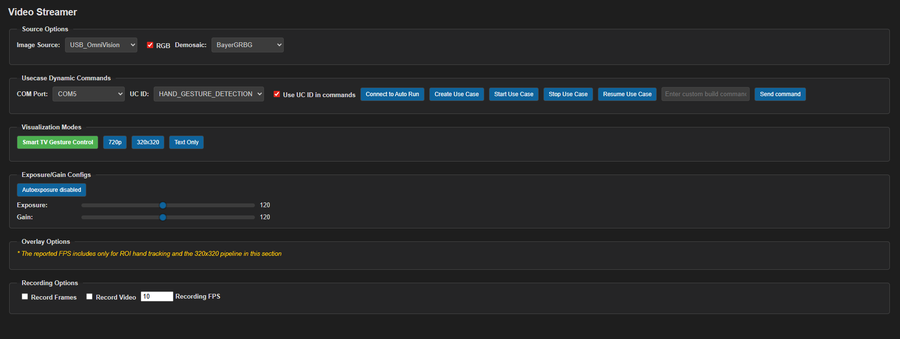

5. For logs, use the **LOGGER** tab when needed.

6. Change **Visualization Modes** as needed:
   - Smart TV Gesture Control
   - 720p
   - 320x320
   - Text only

   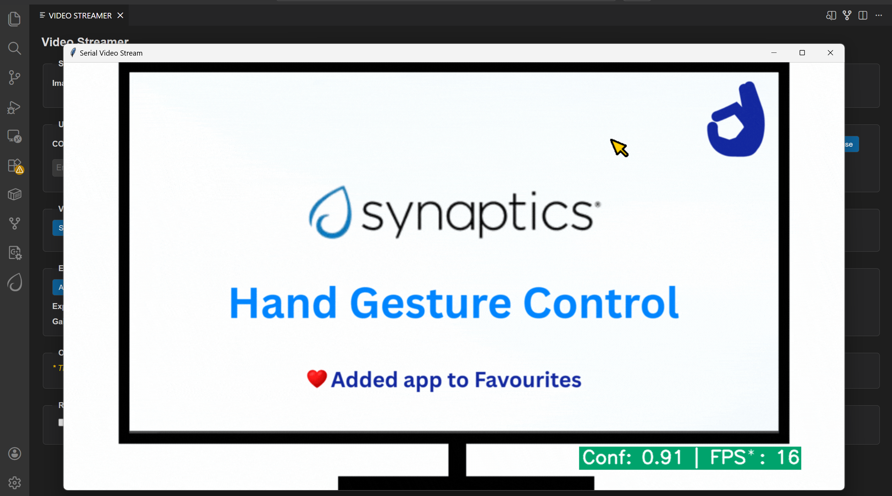

7. **Autorun use cases:** If autorun is enabled, click **Connect Image Source** to open the video stream pop-up.

## Supported Hand Gestures

The following hand gestures are supported:

| Gesture | Description |
|---|---|
| One | One finger raised (index finger). |
| Two | Two fingers raised. |
| Three | Three fingers raised. |
| Four | Four fingers raised. |
| Palm | Open palm with five fingers raised. |
| Fist | Closed fist with fingers folded inward. |
| Thumbs Up | Thumb raised upward with other fingers folded. |
| Thumbs Down | Thumb pointed downward with other fingers folded. |
| Pinch | Thumb and index finger brought close together (pinching pose). |

</br>

**Gesture one**

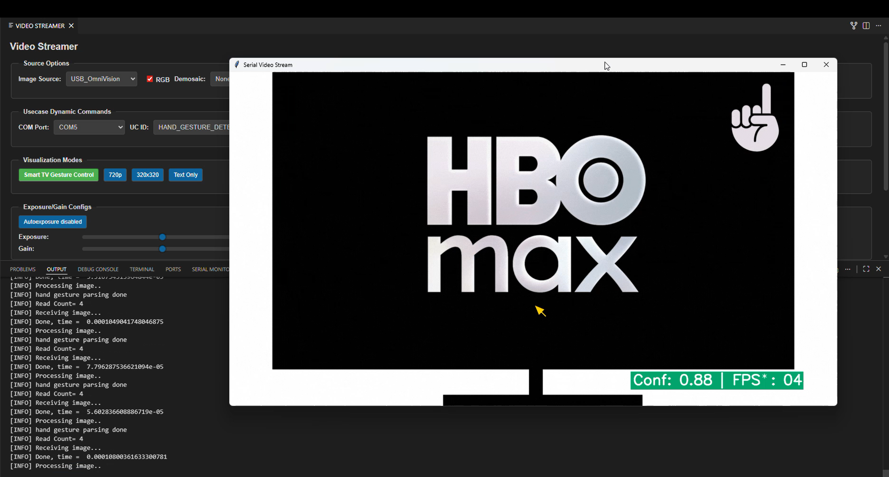

**Gesture two**

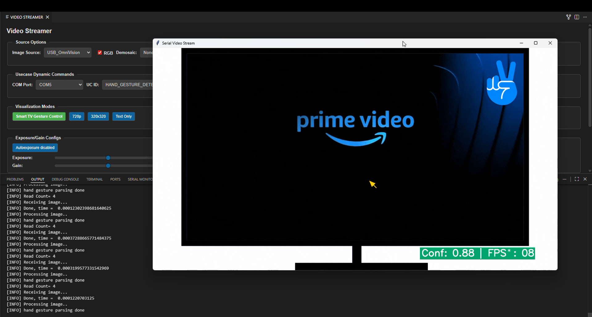

**Gesture Three**

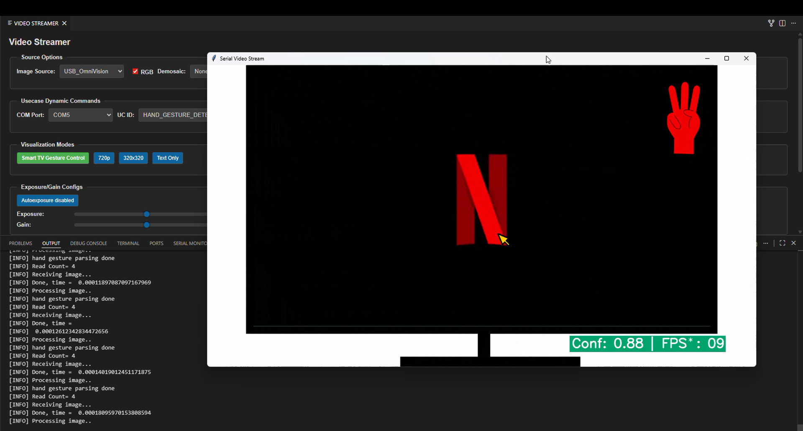

**Gesture four**

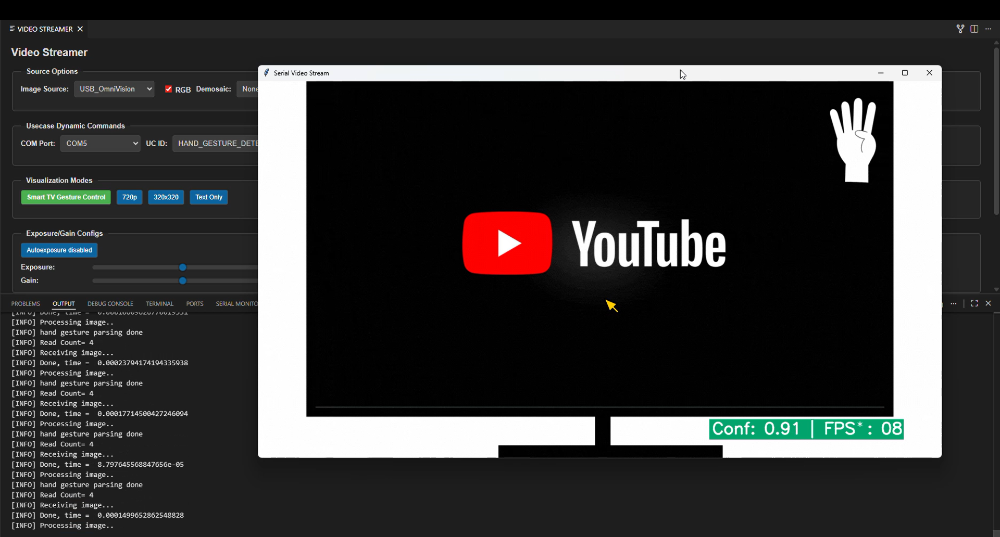

**Gesture palm**

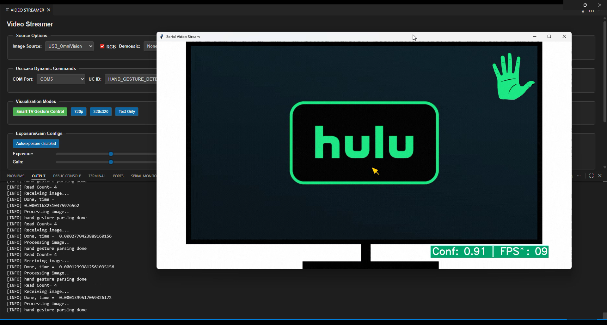

**Gesture fist**

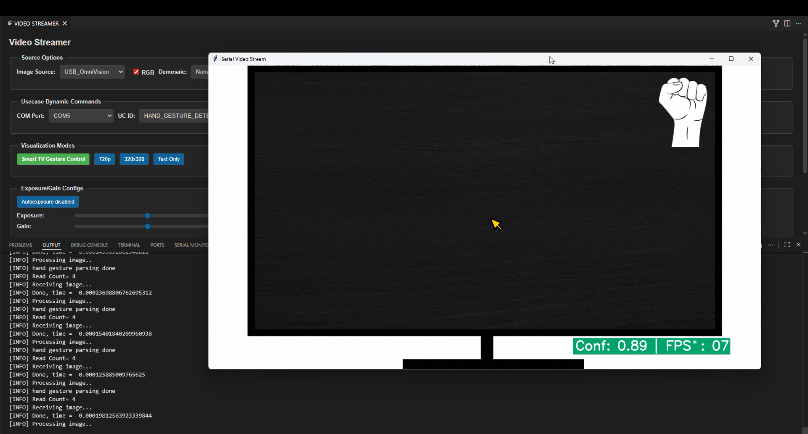

**Gesture Thumbs Up**

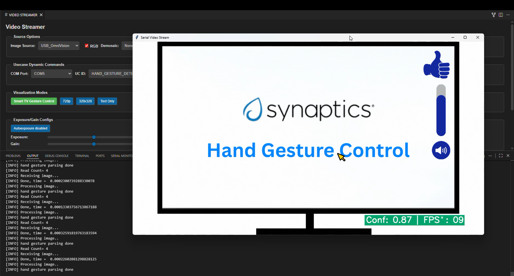

**Gesture Thumbs Down**

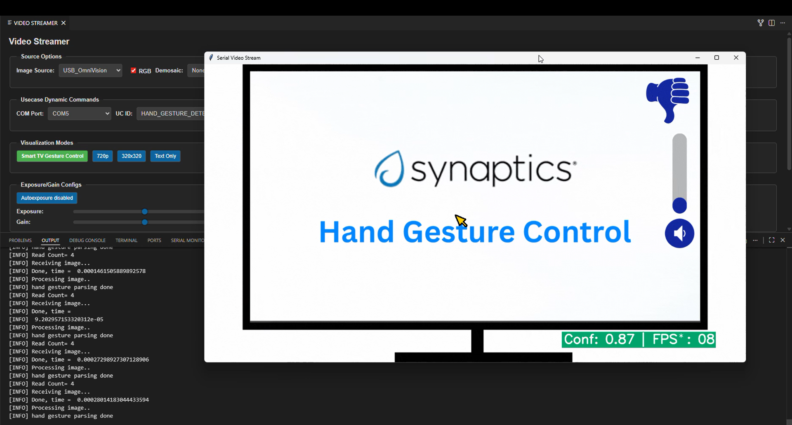

**Gesture Pinch**

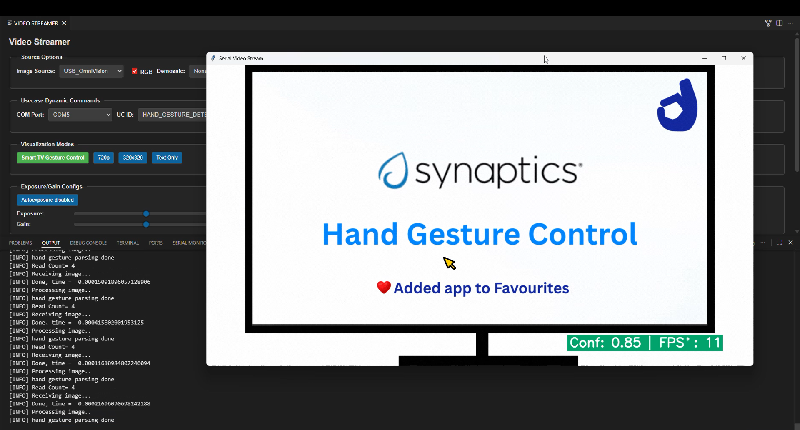
