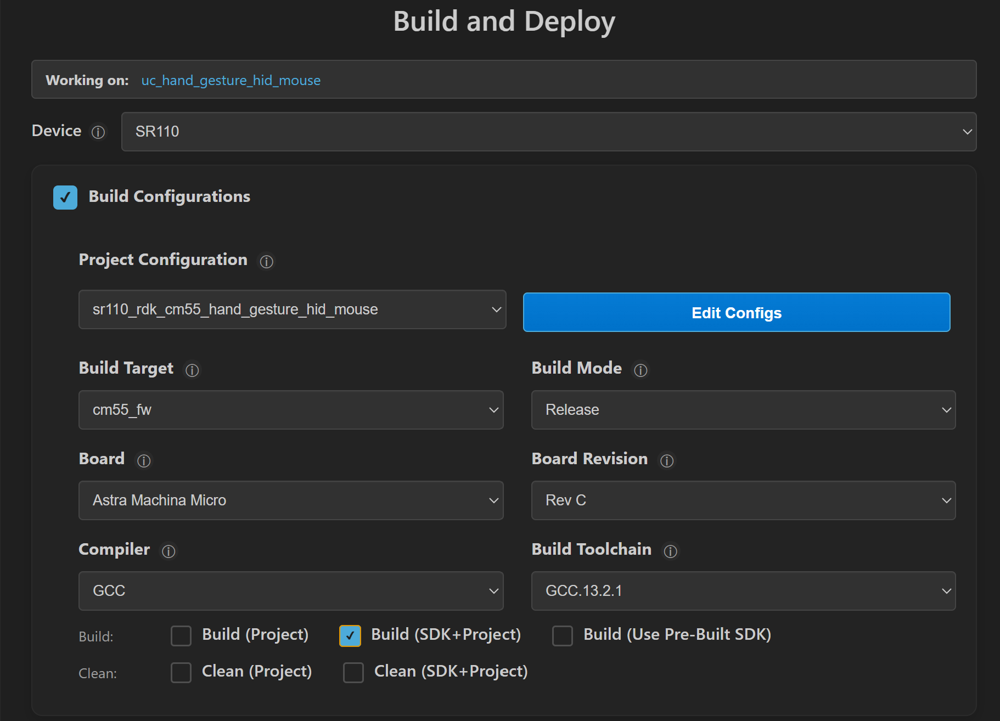
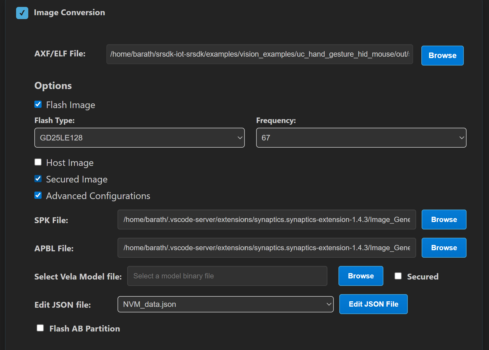
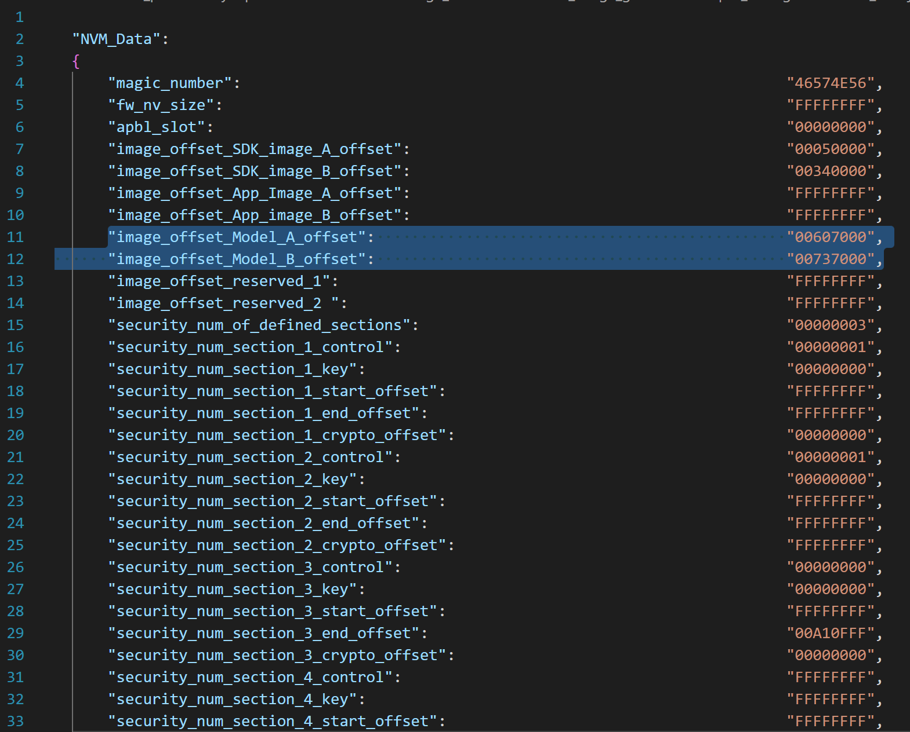
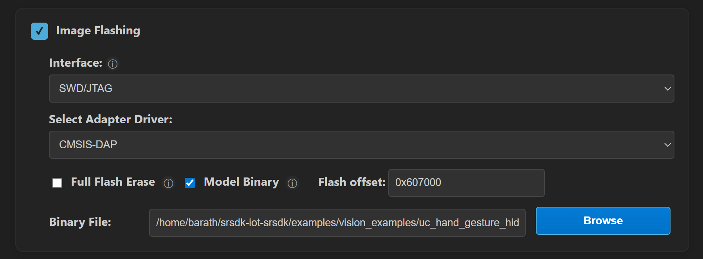
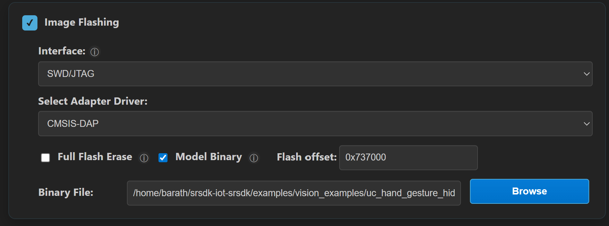
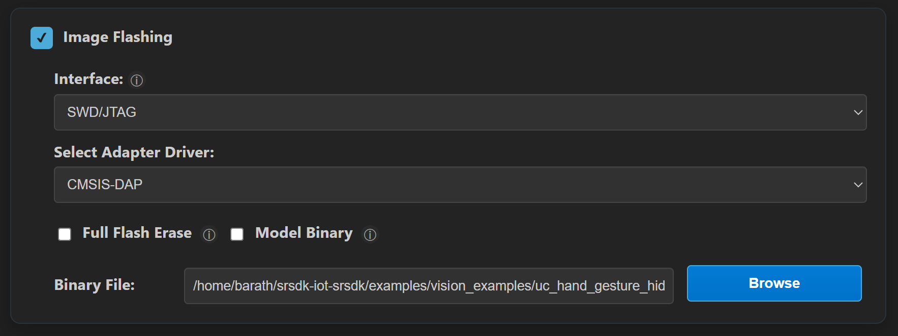

# Hand Gesture HID Mouse Application

## Description

This application extends the SR110 hand-gesture pipeline to control a host PC mouse over USB HID.
The runtime path is:

`Camera -> FE/NN/PP hand-gesture pipeline -> gesture interpreter -> USB HID mouse report`

USB runs in composite mode (`CDC + HID`) so logs remain available while cursor control is active.
Use case auto-run is enabled in the provided defconfig, so Video Streamer "create usecase" is not required.
This app intentionally does not provide Video Streamer image/metadata output paths.

## Prerequisites
- Choose **one** setup path:
  - **CLI**: [Setup and Install SDK using CLI](../../../docs/Astra_MCU_SDK_Setup_and_Install_CLI.md)
  - **VS Code**: [Setup and Install SDK using VS Code](../../../docs/Astra_MCU_SDK_Setup_and_Install_VsCode.md)

## Hardware Requirements
- SR110 Rev C
- Sensor Adapter (included with the Astra Machina Micro kit)
- OV5647 Camera Sensor

## Building and Flashing the Example using VS Code

Use the VS Code flow described in the SR110 guide and the VS Code Extension guide:
- [SR110 Build and Flash with VS Code](../../../docs/SR110/SR110_Build_and_Flash_with_VSCode.md)
- [Astra MCU SDK VS Code Extension User Guide](../../../docs/Astra_MCU_SDK_VSCode_Extension_User_Guide.md)

**Build (VS Code):**
1. Open **Build and Deploy** -> **Build Configurations**.
2. Select **hand_gesture_hid_mouse** in the **Application** dropdown.
3. Build with **Build (SDK + App)** for the first build, or **Build App** for rebuilds.

   

**Flash (VS Code):**
1. Use **Image Conversion** to generate the flash image.

   
2. In **Image Conversion**, open **Advanced Configurations** and edit `NVM_data.json`.
3. Set model flash offsets in `NVM_data.json`:
   - `image_offset_Model_A_offset`: `00607000`
   - `image_offset_Model_B_offset`: `00737000`

   
4. In **Image Flashing** (SWD/JTAG), flash the model binaries first:
   - `hand_gesture_detection_flash(1280x704).bin` at `0x607000`
   - `hand_gesture_detection_flash(320x320).bin` at `0x737000`

   

   
5. Flash the generated firmware image (`B0_flash_full_image_GD25LE128_67Mhz_secured.bin`).

   

---

## Building and Flashing the Example using CLI

Use the CLI flow described in the SR110 guide:
- [SR110 Build and Flash with CLI](../../../docs/SR110/SR110_Build_and_Flash_with_CLI.md)

**Build (CLI):**
1. From app directory, build the example:
   ```bash
   cd <sdk-root>/examples/vision_examples/uc_hand_gesture_hid_mouse
   export SRSDK_DIR=<sdk-root>
   make sr110_rdk_cm55_hand_gesture_hid_mouse_defconfig BUILD=SRSDK
   make build BUILD=SRSDK
   ```

**Flash (CLI):**
1. Activate the SDK venv (required for image generation tools):
   ```bash
   # Linux/macOS
   source <sdk-root>/.venv/bin/activate
   # Windows PowerShell
   .\.venv\Scripts\Activate.ps1
   ```
2. Generate the flash image:
   ```bash
   cd <sdk-root>/tools/srsdk_image_generator
   python srsdk_image_generator.py \
     -B0 \
     -flash_image \
     -sdk_secured \
     -spk "<sdk-root>/tools/srsdk_image_generator/B0_Input_examples/spk_rc4_1_0_secure_otpk.bin" \
     -apbl "<sdk-root>/tools/srsdk_image_generator/B0_Input_examples/sr100_b0_bootloader_ver_0x012F_ASIC.axf" \
     -m55_image "<sdk-root>/examples/out/sr110_cm55_fw/release/sr110_cm55_fw.elf" \
     -flash_type "GD25LE128" \
     -flash_freq "67"
   ```
3. Flash model binaries first:
   ```bash
   cd <sdk-root>
   python tools/openocd/scripts/flash_xspi_tcl.py \
     --cfg_path tools/openocd/configs/sr110_m55.cfg \
     --image examples/vision_examples/uc_hand_gesture_hid_mouse/models/hand_gesture_detection_flash(1280x704).bin \
     --flash-offset 0x607000

   python tools/openocd/scripts/flash_xspi_tcl.py \
     --cfg_path tools/openocd/configs/sr110_m55.cfg \
     --image examples/vision_examples/uc_hand_gesture_hid_mouse/models/hand_gesture_detection_flash(320x320).bin \
     --flash-offset 0x737000
   ```
4. Flash the firmware image:
   ```bash
   cd <sdk-root>
   python tools/openocd/scripts/flash_xspi_tcl.py \
     --cfg_path tools/openocd/configs/sr110_m55.cfg \
     --image tools/srsdk_image_generator/Output/B0_Flash/B0_flash_full_image_GD25LE128_67Mhz_secured.bin \
     --erase-all
   ```

---

## Gesture Mapping (v1)

| Gesture | HID Action |
| --- | --- |
| Palm | Cursor movement |
| Four | Left click |
| Pinch | Right click |
| Fist (short) | Double click |
| Fist (hold for 3s) | Toggle drag mode (left button hold/release) |

Notes:
- Drag mode ON: moving palm drags with left button held.
- Drag mode OFF: moving palm only moves cursor.
- No-hand and low-confidence cases are handled as safe fallback (no movement/click trigger).

## Run

1. Connect `Application SR110 USB` to host.
2. Reset the board.
3. The use case starts automatically after boot (no host command required).

## Verification Checklist

1. Host enumerates both CDC and HID mouse interfaces.
2. Logger shows normal app startup (no USB init errors).
3. No Video Streamer interaction is required to start the app.
4. Palm movement moves host cursor.
5. Four fingers performs left click.
6. Pinch gesture performs right click.
7. Fist gesture performs double click.
8. Holding fist for 3 seconds toggles drag mode ON/OFF.
9. With drag mode ON, palm movement drags (left button held).
10. With no hand in frame, cursor does not drift and no click is generated.

## Tunable Parameters

The following are app-local Kconfig parameters in this app:

- `CONFIG_APP_GM_ACTION_CONFIDENCE_THRESHOLD_X100`
- `CONFIG_APP_GM_STABLE_FRAME_COUNT`
- `CONFIG_APP_GM_CURSOR_DEADZONE`
- `CONFIG_APP_GM_CURSOR_SPEED_PERCENT`
- `CONFIG_APP_GM_CURSOR_SMOOTHING_ALPHA_X100`
- `CONFIG_APP_GM_MAX_DELTA_PER_REPORT`
- `CONFIG_APP_GM_REPORT_INTERVAL_MS`
- `CONFIG_APP_GM_CLICK_COOLDOWN_MS`
- `CONFIG_APP_GM_DOUBLE_CLICK_GAP_MS`
- `CONFIG_APP_GM_NO_HAND_TIMEOUT_MS`
