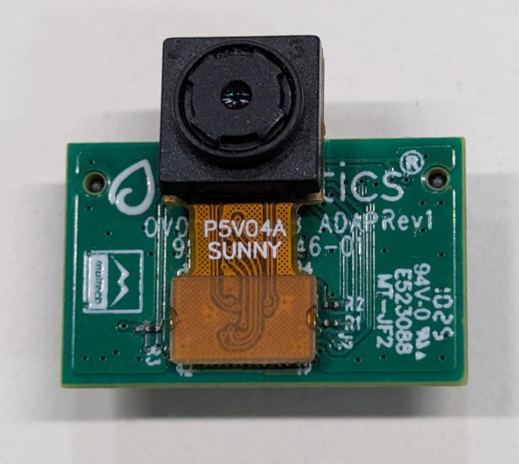
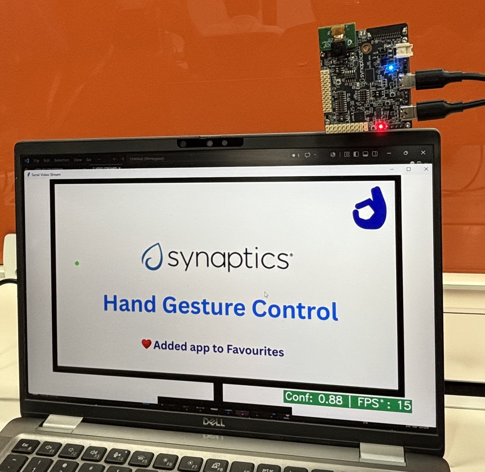

# Hand Gesture HID Mouse Application

## Description

The Hand Gesture HID Mouse application lets you control your computer's mouse using simple hand gestures in front of the camera — no physical mouse required. The camera captures your hand, the on-device hand-gesture detection model recognizes the gesture, and the board translates it into mouse actions (cursor movement, clicks, and drag) that are sent to your PC over USB.

Because the board appears to the host as a standard USB HID mouse, no drivers or host-side software need to be installed — connect the board and start moving the cursor with your hand. See the [Supported Hand Gestures](#supported-hand-gestures) table below for the gestures and the mouse actions they trigger.

The board connects in USB composite mode (CDC + HID), so the serial logger stays available for debugging while the mouse is in use. The use case starts automatically at boot, so no Video Streamer interaction is needed to run it. This application is focused on mouse control and does not stream video or metadata to the Video Streamer tool.

## Supported Boards

This application supports:
- `SR110_RDK`

Select the defconfig that matches your target board, and the build system will pick the corresponding board-specific hardware setup from hw/<BOARD>/.

## Prerequisites
- Choose **one** setup path:
  - **CLI**: [Setup and Install SDK using CLI](../../../docs/Astra_MCU_SDK_Setup_and_Install_CLI.md)
  - **VS Code**: [Setup and Install SDK using VS Code](../../../docs/Astra_MCU_SDK_Setup_and_Install_VsCode.md)

## Hardware Requirements
- Astra Machina Micro kit - SR110
- OV5647 Camera Sensor

> **Note:** The OV5647 camera sensor is **not included** with the Astra Machina Micro kit and must be procured separately. For part details and procurement options, reach out to Synaptics on the OV5647 part details.

### Connecting the Sensor
1. Insert the OV5647 sensor into the **J23** port on the SR110 RDK kit.

   

2. Make sure the sensor is mounted in the correct orientation. Refer to the picture below for the correct orientation.

   

## Project Configuration Selection

Before building, choose the project configuration (defconfig) that matches both your target board and the transfer mode you want to validate.

You can:
- Select the required defconfig directly from the application's `configs/` directory.
- Run `make list_defconfigs` from the application directory to list all supported defconfigs.

**Available defconfigs:**
- `sr110_rdk_cm55_hand_gesture_hid_mouse_defconfig`

## Building and Flashing the Example using VS Code

Use the VS Code flow described in the SR110 guide and the VS Code Extension guide:
- [SR110 Build and Flash with VS Code](../../../docs/SR110/SR110_Build_and_Flash_with_VSCode.md)
- [Astra MCU SDK VS Code Extension User Guide](../../../docs/Astra_MCU_SDK_VSCode_Extension_User_Guide.md)

**Build (VS Code):**
1. Open **Build and Deploy** -> **Build Configurations**.
2. Select **hand_gesture_hid_mouse** in the **Project Selection** dropdown.
3. Build with **Build (SDK + App)** for the first build, or **Build App** for rebuilds.

   

**Flash (VS Code):**
1. Use **Image Conversion** to generate the flash image.

   
2. In **Image Conversion**, open **Advanced Configurations** and edit `NVM_data.json`.
3. Set model flash offsets in `NVM_data.json`:
   - `image_offset_Model_A_offset`: `00607000`
   - `image_offset_Model_B_offset`: `00737000`

   
4. In **Image Flashing** (SWD/JTAG), flash the model binaries first:
   - `hand_gesture_detection_flash(1280x704).bin` at `0x607000`
   - `hand_gesture_detection_flash(320x320).bin` at `0x737000`

   

   
5. Flash the generated firmware image (`B0_flash_full_image_GD25LE128_67Mhz_secured.bin`).

   

---

## Building and Flashing the Example using CLI

Use the CLI flow described in the SR110 guide:
- [SR110 Build and Flash with CLI](../../../docs/SR110/SR110_Build_and_Flash_with_CLI.md)

**Build (CLI):**
1. From app directory, build the example:
   ```bash
   cd <sdk-root>/examples/vision_examples/uc_hand_gesture_hid_mouse
   export SRSDK_DIR=<sdk-root>
   make sr110_rdk_cm55_hand_gesture_hid_mouse_defconfig BUILD=SRSDK
   make build BUILD=SRSDK
   ```

**Flash (CLI):**
1. Activate the SDK venv (required for image generation tools):
   ```bash
   # Linux/macOS
   source <sdk-root>/.venv/bin/activate
   # Windows PowerShell
   .\.venv\Scripts\Activate.ps1
   ```
2. Generate the flash image:
   ```bash
   cd <sdk-root>/tools/srsdk_image_generator
   python srsdk_image_generator.py \
     -B0 \
     -flash_image \
     -sdk_secured \
     -spk "<sdk-root>/tools/srsdk_image_generator/B0_Input_examples/spk_rc4_1_0_secure_otpk.bin" \
     -apbl "<sdk-root>/tools/srsdk_image_generator/B0_Input_examples/sr100_b0_bootloader_ver_0x012F_ASIC.axf" \
     -m55_image "<sdk-root>/examples/out/sr110_cm55_fw/release/sr110_cm55_fw.elf" \
     -flash_type "GD25LE128" \
     -flash_freq "67"
   ```
3. Flash model binaries first:
   ```bash
   cd <sdk-root>
   python tools/openocd/scripts/flash_xspi_tcl.py \
     --cfg_path tools/openocd/configs/sr110_m55.cfg \
     --image examples/vision_examples/uc_hand_gesture_hid_mouse/models/hand_gesture_detection_flash(1280x704).bin \
     --flash-offset 0x607000

   python tools/openocd/scripts/flash_xspi_tcl.py \
     --cfg_path tools/openocd/configs/sr110_m55.cfg \
     --image examples/vision_examples/uc_hand_gesture_hid_mouse/models/hand_gesture_detection_flash(320x320).bin \
     --flash-offset 0x737000
   ```
4. Flash the firmware image:
   ```bash
   cd <sdk-root>
   python tools/openocd/scripts/flash_xspi_tcl.py \
     --cfg_path tools/openocd/configs/sr110_m55.cfg \
     --image tools/srsdk_image_generator/Output/B0_Flash/B0_flash_full_image_GD25LE128_67Mhz_secured.bin \
     --erase-all
   ```

---

## Supported Hand Gestures

This application uses a subset of the hand gestures, mapping each one to a mouse operation on the host PC:

| Gesture | Description | Mouse Action |
| --- | --- | --- |
| Palm | Open palm with five fingers raised and slightly spread apart. | Move the cursor (or drag, when drag mode is ON). |
| Four | Four fingers raised. | Left click. |
| Pinch | Thumb and index finger brought close together (pinching pose). | Right click. |
| Fist (short) | Closed fist with fingers folded inward, held briefly. | Double click. |
| Fist (hold for 3s) | Closed fist held for ~3 seconds. | Toggle drag mode (left button hold/release). |

Notes:
- For the **Palm** gesture, keep your fingers **slightly spread apart**, not pressed together. A flat palm with the fingers held tightly together may not be detected reliably, so the cursor may not move.
- Drag mode ON: moving palm drags with left button held.
- Drag mode OFF: moving palm only moves cursor.
- No-hand and low-confidence cases are handled as safe fallback (no movement/click trigger).

## Run

1. Connect `Application SR110 USB` to host.
2. Reset the board.
3. The use case starts automatically after boot (no host command required).

## Verification Checklist

1. Host enumerates both CDC and HID mouse interfaces.
2. Logger shows normal app startup (no USB init errors).
3. No Video Streamer interaction is required to start the app.
4. Palm movement moves host cursor.
5. Four fingers performs left click.
6. Pinch gesture performs right click.
7. Fist gesture performs double click.
8. Holding fist for 3 seconds toggles drag mode ON/OFF.
9. With drag mode ON, palm movement drags (left button held).
10. With no hand in frame, cursor does not drift and no click is generated.

## Tunable Parameters

This app exposes a set of app-local Kconfig parameters (under **Application Configuration → Gesture Mouse Configuration**) that let you tune how gestures are translated into mouse behavior. You can edit them through `menuconfig` or directly in the app defconfig (`configs/sr110_rdk_cm55_hand_gesture_hid_mouse_defconfig`), then rebuild.

These parameters fall into three groups: **gesture detection**, **cursor motion**, and **click/timing** behavior.

### Gesture detection

| Parameter | Default | Description |
| --- | --- | --- |
| `CONFIG_APP_GM_ACTION_CONFIDENCE_THRESHOLD_X100` | `55` | Minimum detection confidence (×100, i.e. `55` = 55%) required before a gesture triggers an action. Raise it to reduce false triggers; lower it if valid gestures are being missed. |
| `CONFIG_APP_GM_STABLE_FRAME_COUNT` | `3` | Number of consecutive frames a gesture must remain stable before it is accepted. Higher values reduce accidental triggers but add a small amount of latency. |
| `CONFIG_APP_GM_NO_HAND_TIMEOUT_MS` | `200` | Time (ms) with no hand detected after which the gesture state is reset. Prevents stale gesture state once the hand leaves the frame. |

### Cursor motion

| Parameter | Default | Description |
| --- | --- | --- |
| `CONFIG_APP_GM_CURSOR_DEADZONE` | `1` | Minimum cursor movement (pixels) below which no motion is reported. Filters out small jitter from natural hand shake. |
| `CONFIG_APP_GM_CURSOR_SPEED_PERCENT` | `180` | Cursor speed as a percentage of the raw hand-position delta. `100` = 1:1 mapping; higher values make the cursor more sensitive/faster. |
| `CONFIG_APP_GM_CURSOR_SMOOTHING_ALPHA_X100` | `45` | EMA smoothing factor (×100). `100` = no smoothing, lower values = smoother but more lagged cursor motion. |
| `CONFIG_APP_GM_MAX_DELTA_PER_REPORT` | `35` | Maximum cursor movement (pixels) allowed per HID report. Clamps large jumps caused by abrupt hand motion. |

### Click and timing behavior

| Parameter | Default | Description |
| --- | --- | --- |
| `CONFIG_APP_GM_REPORT_INTERVAL_MS` | `10` | Minimum interval (ms) between HID mouse reports, i.e. the effective mouse report rate. |
| `CONFIG_APP_GM_CLICK_COOLDOWN_MS` | `250` | Minimum time (ms) between successive clicks. Prevents unintended repeated clicks when gestures change quickly. |
| `CONFIG_APP_GM_DOUBLE_CLICK_GAP_MS` | `140` | Gap (ms) between the two presses of a double click. Must stay within the host OS double-click detection window. |
| `CONFIG_APP_GM_FIST_DRAG_HOLD_MS` | `3000` | How long (ms) a fist gesture must be held to toggle drag mode on/off. |

> **Note:** The `_X100` suffix means the value is stored as an integer scaled by 100 (since Kconfig has no native floating-point type). For example, a confidence threshold of `55` represents `0.55` (55%).
