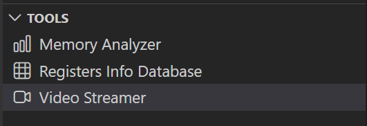

# Doorbell ML Application

## Description

The Doorbell sample application combines the `UC_JPEG_PREROLL` and `IMAGE_STITCHING` use cases to detect a person in the camera field of view and capture Full HD (FHD) images when detection occurs.

Captured images can be delivered in two modes:

| Delivery Mode | Description | Tools for Visualization |
|---|---|---|
| USB CDC (to Host PC) | Sends images via USB CDC to a host PC. | VS Code Extension |
| SPI to Controller | Sends images over SPI to another Astra Machina Micro acting as controller and receives frames for validation/logging. | Logger |

## Supported Boards

This application supports:
- `SR110_RDK`

Select the defconfig that matches your target board, and the build system will pick the corresponding board-specific hardware setup from `hw/<BOARD>/`.

## Prerequisites

- Choose **one** setup path:
  - **CLI**: [Setup and Install SDK using CLI](../../../docs/Astra_MCU_SDK_Setup_and_Install_CLI.md)
  - **VS Code**: [Setup and Install SDK using VS Code](../../../docs/Astra_MCU_SDK_Setup_and_Install_VsCode.md)

## Test Case Selection

Before building, choose the testcase defconfig that matches both your target board and the transfer mode you want to validate.

You can:
- Select the required defconfig directly from the application's `configs/` directory.
- Run `make list_defconfigs` from the application directory to list all supported defconfigs.

**Available defconfigs:**
- `sr110_rdk_cm55_doorbell_gpio_wakeup_defconfig`
- `sr110_rdk_cm55_doorbell_timer_wakeup_defconfig`

For this app, the default defconfig is:
   - `sr110_rdk_cm55_doorbell_timer_wakeup_defconfig`

## Building and Flashing the Example using VS Code and CLI

Use the VS Code flow described in the SR110 guide and the VS Code Extension guide:
- [SR110 Build and Flash with VS Code](../../../docs/SR110/SR110_Build_and_Flash_with_VSCode.md)
- [Astra MCU SDK VS Code Extension User Guide](../../../docs/Astra_MCU_SDK_VSCode_Extension_User_Guide.md)

**Build (VS Code):**
1. Open **Build and Deploy** → **Build Configurations**.
2. Select **doorbell** in the **Application** dropdown.
3. Configure wakeup mode in `uc_jpeg_preroll.c` using `CONFIG_WAKEUP_TRIGGER`:
   - `1` for timer-based wakeup
   - `2` for GPIO-based wakeup
4. Build with **Build (SDK + App)** for the first build, or **Build App** for rebuilds.

**Build (CLI):**
1. Build from the application directory itself:
   ```bash
   cd <sdk-root>/examples/vision_examples/uc_jpeg_preroll
   export SRSDK_DIR=<sdk-root>
   make <app_defconfig> BUILD=SRSDK
   ```
2. For faster rebuilds when only app code changes, reuse the app-local installed SDK package:
   ```bash
   cd <sdk-root>/examples/vision_examples/uc_jpeg_preroll
   export SRSDK_DIR=<sdk-root>
   make build
   ```
3. If this app has been exported to its own repository, use the same commands from that exported app directory after setting `SRSDK_DIR` to the SDK root.

## CLI build outputs

The build process will produce the necessary .elf or .axf files for deployment with the installed package.

**Flash and Image Generation (VS Code):**
1. Open the Astra MCU SDK VS Code Extension and connect to the Debug IC USB port on the Astra Machina Micro Kit.
   - Refer to the [Astra MCU SDK User Guide](../../../docs/Astra_MCU_SDK_User_Guide.md) for detailed setup steps.
2. Generate firmware binaries using **Build and Deploy** → **Image Conversion**.
   - Select the required `.axf` or `.elf` file. If the use case is built using the VS Code extension, the file path will be auto-populated.
3. Flash the application using **Build and Deploy** → **Image Flashing**.
   - Select **SWD/JTAG** as the interface.
   - Choose the respective image bins and click **Run**.
4. Flash model binary `door_bell_flash(384x512).bin` at offset `0x629000`.
   - Model location: `examples/vision_examples/uc_jpeg_preroll/models/`

> Note: By default, flashing a binary performs sector erase based on binary size. If **Full Flash Erase** is enabled, tool performs full erase before flashing.

**Flash (CLI):**
1. Activate the SDK venv (required for image generation tools):
   ```bash
   # Linux/macOS
   source <sdk-root>/.venv/bin/activate
   # Windows PowerShell
   .\.venv\Scripts\Activate.ps1
   ```
2. Generate flash image:
   ```bash
   cd <sdk-root>/tools/srsdk_image_generator
   python srsdk_image_generator.py \
     -B0 \
     -flash_image \
     -sdk_secured \
     -spk "<sdk-root>/tools/srsdk_image_generator/Inputs/spk_rc4_1_0_secure_otpk.bin" \
     -apbl "<sdk-root>/tools/srsdk_image_generator/Inputs/sr100_b0_bootloader_ver_0x012F_ASIC.axf" \
     -m55_image "<sdk-root>/examples/vision_examples/uc_jpeg_preroll/out/sr110_cm55_fw/release/sr110_cm55_fw.elf" \
     -flash_type "GD25LE128" \
     -flash_freq "67"
   ```
3. Flash the firmware image:
   ```bash
   cd <sdk-root>
   python tools/openocd/scripts/flash_xspi_tcl.py \
     --cfg_path tools/openocd/configs/sr110_m55.cfg \
     --image tools/srsdk_image_generator/Output/B0_Flash/B0_flash_full_image_GD25LE128_67Mhz_secured.bin \
     --erase-all
   ```
4. Flash model binary at offset `0x629000`:
   ```bash
   cd <sdk-root>
   python tools/openocd/scripts/flash_xspi_tcl.py \
     --cfg_path tools/openocd/configs/sr110_m55.cfg \
     --image <path-to-door_bell_flash(384x512).bin> \
     --flash-offset 0x629000
   ```

## Running the Application using VS Code Extension

> **Windows note:** Ensure the USB drivers are installed for streaming. See the Zadig steps in  
> [SR110 Build and Flash with VS Code](../../../docs/SR110/SR110_Build_and_Flash_with_VSCode.md#usb-cdc-image-streaming-windows).

1. In VS Code, open **Video Streamer** from the Synaptics sidebar.

   

2. For logging output, click **SERIAL MONITOR** and connect to the **DAP logger** port on J14.
   - To make it easier to identify, ensure **only J14** is plugged in (not J13).
   - The logger port is not guaranteed to be consistent across OSes. As a starting point:
     - **Windows:** try the lower-numbered J14 COM port first.
     - **Linux/macOS:** try the higher-numbered J14 port first.
   - If you do not see logs after a reset, switch to the other J14 port.
3. Doorbell application automatically connects to Video Streamer upon reset.
4. On person detection, video streamer opens with the captured frame and preroll context images.

   

## Wakeup Triggers

| Trigger | Config | Behavior |
|---|---|---|
| Timer | `CONFIG_WAKEUP_TRIGGER=1` | Device wakes every 10 seconds. |
| GPIO | `CONFIG_WAKEUP_TRIGGER=2` | Jumper from GND to UART0 RX after 10s of hibernation. |

## SPI Pre-roll Use Case

### Overview

The SPI Pre-roll feature enables `UC_JPEG_PREROLL` to capture JPEG pre-roll frames and stream them to a controller (receiver) over SPI.

- **Peripheral (Sender):** Device flashed with Doorbell use case. Captures frames, packages headers/footers, and transmits via SPI.
- **Controller (Receiver):** Device flashed with SPI sample app. Requests pre-roll frames and validates CRC.

Protocol details: [SPI Pre-roll Protocol](spi_preroll_protocol.md)

### Configurations

#### Peripheral (Sender)
Run spi preroll defconfig, for Peripheral device .

```bash
make sr110_rdk_cm55_spi_preroll_defconfig BUILD=SRSDK
```

#### Controller (Receiver)
Run SPI sample controller defconfig from examples/driver_example/spi_sample_app/ for controller device.

```bash
cd examples/driver_example/spi_sample_app/
make sr110_rdk_cm55_spi_sample_app_preroll_controllder_defconfig BUILD=SRSDK
```

### Hardware Setup

#### Controller Pins
1. Pin 11 - SPI_MSTR_CLK (GPIO_22)
2. Pin 12 - SPI_MSTR_CS (GPIO_21)
3. Pin 13 - SPI_MSTR_MISO (GPIO_24)
4. Pin 14 - SPI_MSTR_MOSI (GPIO_23)

#### Peripheral Pins
1. Pin 7 - SPI_SLV_CLK (GPIO_6)
2. Pin 8 - SPI_SLV_CS (GPIO_8)
3. Pin 9 - SPI_SLV_MISO (GPIO_7)
4. Pin 10 - SPI_SLV_MOSI (GPIO_9)

#### Connections
1. Pin 11 (SPI_MSTR_CLK) -> Pin 7 (SPI_SLV_CLK)
2. Pin 12 (SPI_MSTR_CS) -> Pin 8 (SPI_SLV_CS)
3. Pin 13 (SPI_MSTR_MISO) -> Pin 9 (SPI_SLV_MISO)
4. Pin 14 (SPI_MSTR_MOSI) -> Pin 10 (SPI_SLV_MOSI)

Connect GND between both boards for stable transfer.

**Logger note:** Logs are via UART0. Enable UART0 logger in menuconfig. It is recommended to avoid powering DAP SR110 during SPI transfer due to pin conflict in RDK.


### Test Procedure

#### Peripheral (Sender) Steps
Before flashing peripheral image, flash model binary at `0x629000`.
After reset, device enters hibernation and captures pre-roll images. On wakeup and detection event, it starts SPI peripheral transfer.


#### Controller (Receiver) Steps
Flash controller image, then reset controller only after peripheral wakes and starts transfer.


### Expected Results
Controller sends pre-roll request header. Peripheral responds with stream header, all pre-roll JPEG frames, and stream end marker over SPI. Controller validates headers, CRC, and footers; logs confirm successful frame reception.

## Adapting Pipeline for Custom Object Detection Models

This person detection pipeline can be adapted to work with custom object detection models. However, certain validation steps and potential modifications are required to ensure compatibility.

### Prerequisites for Model Compatibility

Before adapting this pipeline for another object detection model, you must verify the following:

#### 1. Model Format Requirements
- Your object detection model should be in `.tflite` format
- The model should produce similar output tensor structure (bounding boxes, confidence scores)

#### 2. Vela Compiler Compatibility Check

**Step 1: Analyze Original Model**
1. Load your `object_detection_model.tflite` file in [Netron](https://netron.app/)
2. Document the output tensors:
   - Tensor names
   - Tensor identifiers/indexes
   - Quantization parameters (scale and offset values)
   - Tensor dimensions

**Step 2: Compile with Vela**
1. Pass your model through the Vela compiler to generate `model_vela.bin` or `model_vela.tflite`
2. Analyze the Vela-compiled model in Netron using the same steps as above

**Step 3: Compare Outputs**
Compare the following between original and Vela-compiled models:
- **Output tensor indexes/identifiers**: Verify if they remain in the same order
- **Quantization parameters**: Check if scale and offset values are preserved
- **Tensor dimensions**: Ensure dimensions match your expected output format

### Pipeline Adaptation Process

#### Case 1: No Changes Required
If the Vela compilation preserves:
- ✅ Output tensor indexes in the same order
- ✅ Same quantization scale and offset values

**Result**: You can proceed with the existing pipeline without modifications.

#### Case 2: Modifications Required
If the Vela compilation changes:
- ❌ Output tensor index order
- ❌ Quantization parameters

**Required Actions**: Modify the pipeline code as described below.

### Code Modifications

If your model's output tensor indexes change after Vela compilation, you need to update the tensor parameter assignments in `uc_jpeg_preroll.c`:

#### Location: `detection_post_process` function

**Original Code:**
```c
g_box1_params = &g_all_tens_params[0];
g_box2_params = &g_all_tens_params[1];
g_cls_params  = &g_all_tens_params[2];
```

**Modified Code:**
Update the array indexes according to your Vela-compiled model's output tensor identifiers:
```c
// Example: If your model_vela output has different tensor order
g_box1_params = &g_all_tens_params[X];  // Replace X with actual index from Netron
g_box2_params = &g_all_tens_params[Y];  // Replace Y with actual index from Netron
g_cls_params  = &g_all_tens_params[Z];  // Replace Z with actual index from Netron
```
