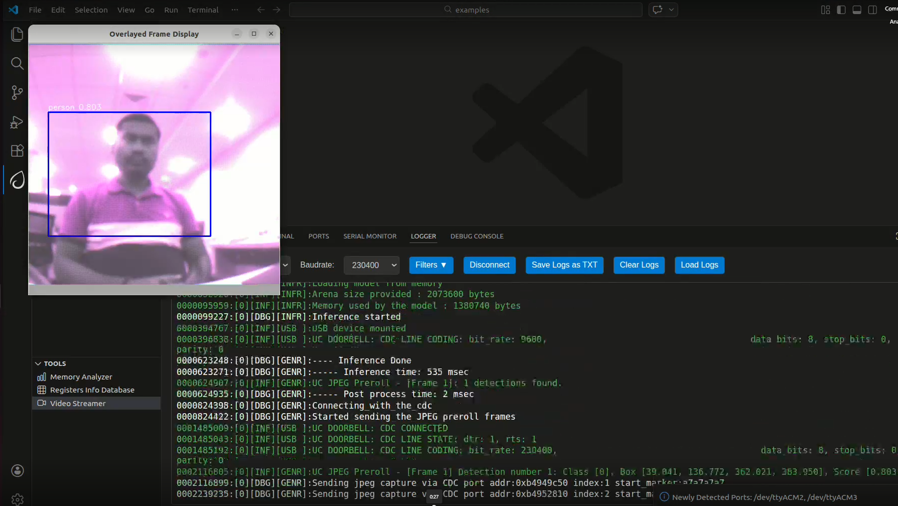

# Serial Camera Doorbell ML Application

## Description

The Serial Camera Doorbell sample application uses the K351 serial camera sensor to capture a 500x500 RAW Bayer image along with a sequence of JPEG preroll images.

It detects a person in the field of view and, on detection, automatically sends 9 JPEG preroll images to provide context before the event. The JPEG preroll images are saved in the `overlayed_frames` subfolder inside `video_stream_output` (for example, `C:\Users\<username>\video_stream_output` or `/home/<user>/video_stream_output`).

## Supported Boards

This application supports:
- `SR110_RDK`

Select the defconfig that matches your target board, and the build system will pick the corresponding board-specific hardware setup from `hw/<BOARD>/`.

## Prerequisites
- Choose **one** setup path:
  - **CLI**: [Setup and Install SDK using CLI](../../../docs/Astra_MCU_SDK_Setup_and_Install_CLI.md)
  - **VS Code**: [Setup and Install SDK using VS Code](../../../docs/Astra_MCU_SDK_Setup_and_Install_VsCode.md)

## Project Configuration Selection

Before building, choose the project configuration (defconfig) that matches both your target board and the transfer mode you want to validate.

You can:
- Select the required defconfig directly from the application's `configs/` directory.
- Run `make list_defconfigs` from the application directory to list all supported defconfigs.

**Available defconfigs:**
- `sr110_rdk_cm55_serial_camera_door_bell_gpio_wakeup_defconfig`
- `sr110_rdk_cm55_serial_camera_door_bell_timer_wakeup_defconfig`

For this app, the default defconfig is:
   - `sr110_rdk_cm55_serial_camera_door_bell_timer_wakeup_defconfig`

## Building and Flashing the Example using VS Code and CLI

Use the VS Code flow described in the SR110 guide and the VS Code Extension guide:
- [SR110 Build and Flash with VS Code](../../../docs/SR110/SR110_Build_and_Flash_with_VSCode.md)
- [Astra MCU SDK VS Code Extension User Guide](../../../docs/Astra_MCU_SDK_VSCode_Extension_User_Guide.md)

**Build (VS Code):**
1. Open **Build and Deploy** → **Build Configurations**.
2. Select **serial_camera_door_bell** in the **Application** dropdown.
3. If needed, configure wakeup in `uc_jpeg_preroll.c`:
   - `CONFIG_WAKEUP_TRIGGER = 1`: timer-based wakeup (default)
   - `CONFIG_WAKEUP_TRIGGER = 2`: GPIO-based wakeup
4. Build with **Build (SDK + App)** for the first build, or **Build App** for rebuilds.

**Build (CLI):**
1. Build from the application directory itself:
   ```bash
   cd <sdk-root>/examples/vision_examples/uc_jpeg_preroll
   export SRSDK_DIR=<sdk-root>
   make <app_defconfig> BUILD=SRSDK
   ```
2. For faster rebuilds when only app code changes, reuse the app-local installed SDK package:
   ```bash
   cd <sdk-root>/examples/vision_examples/uc_jpeg_preroll
   export SRSDK_DIR=<sdk-root>
   make build
   ```
3. If this app has been exported to its own repository, use the same commands from that exported app directory after setting `SRSDK_DIR` to the SDK root.

## CLI build outputs

The build process will produce the necessary .elf or .axf files for deployment with the installed package.

**Flash and Image Generation (VS Code):**
1. Open the Astra MCU SDK VS Code Extension and connect to the Debug IC USB port on the Astra Machina Micro Kit.
   - Refer to the [Astra MCU SDK User Guide](../../../docs/Astra_MCU_SDK_User_Guide.md) for detailed setup steps.
2. In **Image Conversion**, open **Advanced Configurations** and edit `NVM_data.json`.
3. Set the model flash offset in `NVM_data.json`:
   - `image_offset_Model_A_offset`: `00629000`
4. Generate firmware binaries using **Build and Deploy** → **Image Conversion**.
   - Select the required `.axf` or `.elf` file. If the use case is built using the VS Code extension, the file path will be auto-populated.
5. Flash the application using **Build and Deploy** → **Image Flashing**.
   - Select **SWD/JTAG** as the interface.
   - Choose the respective image bins and click **Run**.
6. Flash model binary `door_bell_flash(384x512).bin` at offset `0x629000`.
   - Model location: `examples/vision_examples/uc_jpeg_preroll/models/`

**Flash (CLI):**
1. Activate the SDK venv (required for image generation tools):
   ```bash
   # Linux/macOS
   source <sdk-root>/.venv/bin/activate
   # Windows PowerShell
   .\.venv\Scripts\Activate.ps1
   ```
2. Set the model flash offset in `tools/srsdk_image_generator/Input_Config/NVM_data.json`:
   - `image_offset_Model_A_offset`: `00629000`
3. Generate flash image:
   ```bash
   cd <sdk-root>/tools/srsdk_image_generator
   python srsdk_image_generator.py \
     -B0 \
     -flash_image \
     -sdk_secured \
     -spk "<sdk-root>/tools/srsdk_image_generator/Inputs/spk_rc4_1_0_secure_otpk.bin" \
     -apbl "<sdk-root>/tools/srsdk_image_generator/Inputs/sr100_b0_bootloader_ver_0x012F_ASIC.axf" \
     -m55_image "<sdk-root>/examples/vision_examples/uc_jpeg_preroll/out/sr110_cm55_fw/release/sr110_cm55_fw.elf" \
     -flash_type "GD25LE128" \
     -flash_freq "67"
   ```
4. Flash the firmware image:
   ```bash
   cd <sdk-root>
   python tools/openocd/scripts/flash_xspi_tcl.py \
     --cfg_path tools/openocd/configs/sr110_m55.cfg \
     --image tools/srsdk_image_generator/Output/B0_Flash/B0_flash_full_image_GD25LE128_67Mhz_secured.bin \
     --erase-all
   ```
5. Flash model binary:
   ```bash
   cd <sdk-root>
   python tools/openocd/scripts/flash_xspi_tcl.py \
     --cfg_path tools/openocd/configs/sr110_m55.cfg \
     --image <path-to-door_bell_flash(384x512).bin> \
     --flash-offset 0x629000
   ```

## Running the Application using VS Code Extension

> **Windows note:** Ensure the USB drivers are installed for streaming. See the Zadig steps in  
> [SR110 Build and Flash with VS Code](../../../docs/SR110/SR110_Build_and_Flash_with_VSCode.md#usb-cdc-image-streaming-windows).

1. In VS Code, open **Video Streamer** from the Synaptics sidebar.

   

2. For logging output, click **SERIAL MONITOR** and connect to the **DAP logger** port on J14.
   - To make it easier to identify, ensure **only J14** is plugged in (not J13).
   - The logger port is not guaranteed to be consistent across OSes. As a starting point:
     - **Windows:** try the lower-numbered J14 COM port first.
     - **Linux/macOS:** try the higher-numbered J14 port first.
   - If you do not see logs after a reset, switch to the other J14 port.
3. Serial camera doorbell application automatically connects to Video Streamer upon reset.
4. On person detection, video streamer opens with the captured frame and preroll context images saved to `video_stream_output/overlayed_frames`.

   

## Wakeup Triggers

- `CONFIG_WAKEUP_TRIGGER = 1` (Timer): device wakes up every 10 seconds.
- `CONFIG_WAKEUP_TRIGGER = 2` (GPIO): use GPIO-based wakeup as configured in `uc_jpeg_preroll.c`.
