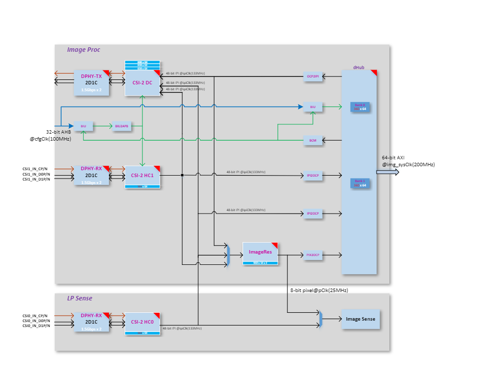
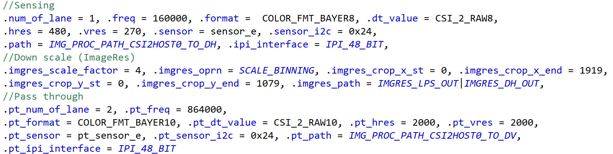

*­­\ ­­­*
         

Introduction
============

The document provides an overview of sensor integration to SRSDK
software. For choosing appropriate sensor settings, understanding of
Image Proc and Image Sense path is necessary.

Figure ‎1‑1 depicts the high-level block diagram of Sabre CSI
controllers connected to Image Proc / Image Sense path. The top block
depicts different blocks within Image Proc, second block depicts CSI
host controller feeding Image Sense pipeline. The capabilities of Image
proc / Image Sense block play a key role in choosing the sensor.

   |image0|

Figure ‑ ImageProc-high level block diagram

Sabre Capability
================

CSI Host controller
-------------------

Max number of lanes per CSI host = 2

Max data lane rate = 1500 Mbps per lane

Pixel bit depth = 8 or 10 bits.

Raw bayer / Monochrome/ RGB / YUV.

ImageProc
---------

Operating clock = 133 MHz

LP Sense
--------

   Operating clock = 25 MHz

Sensor Clock
------------

   Sabre Clock Out = 24 or 19.2 MHz

   Note: Other clock configuration possible and depends on Sabre PLL
   configuration.

Sensor Capability
=================

   To port the camera sensor, the following parameters must be checked
   and compared against CSI & LP Sense capability:

1. MIPI Clock Mode: continuous or non-continuous mode.

2. Num of lanes.

3. Pixel Depth.

4. Frame Rate.

5. Frame width and Height (include blanks).

..

   Or

   Width and Height (without blanks).

6. Sensor Clock frequency.

7. MIPI clock rate.

..

Table ‑ MIPI Clock Calculation

+----------------------------------------------------+
| PixelRate = FrameWidth \* FrameHeight \* fps       |
|                                                    |
| MIPI Bandwidth = PixelRate \* Bits_per_pixel       |
|                                                    |
| Datarate per lane = MIPI Bandwidth/number_of_lanes |
|                                                    |
| MIPIClkRate (differential) = Datarate_per_lane/2   |
+====================================================+
| **Sensor Settings provided by Vendor:**            |
|                                                    |
| FrameWidth=2560                                    |
|                                                    |
| FrameHeight=2250                                   |
|                                                    |
| FrameRate = 30                                     |
|                                                    |
| PixelDepth = 10                                    |
|                                                    |
| PixelRate = 172.80000                              |
|                                                    |
| MipiClkRate = 432.00000                            |
|                                                    |
| Datarate per lane = 172.8*10/2 = 864Mhz            |
+----------------------------------------------------+

Sensor Integration
==================

Settings Selection
------------------

   Based on the comparison below, pick up the appropriate settings from
   sensor vendor.

1. Compare Sensor’s MIPI Lane clock, lane, and bit depth capability
   against Sabre CSI host controller capability.

2. Check Sensor input clock’s requirement.

3. Sensor’s pixel rate must be lower than LP Sense clock (25Mhz) when
   CSI Host controller connected to LP sense path

4. Sensor’s MIPI Clock (MIPI Clock \*2) must be less than or equal to
   1500 Mbps per lane when CSI host controller connected to Image Proc
   path.

Sensor Addition
---------------

   Follow the below steps to add a new sensor to SRSDK.

1. Add sensor register settings folder to
      common/components/ext_drivers/img_sesnors

   a. Sensor registers folder contains source and include folder.

   b. In source folder, add sensor register file with different sensor
         resolution / MIPI clock-based settings array provided by sensor
         vendor.

   c. In include folder, expose sensor specific array or function
         prototype.

2. Enter Sensor index.

a. Add sensor index (one for passthrough and another for sensing) to
      sensors_types_e enumeration in
      common/components/ext_drivers/img_sesnors/common/include/img_Sensor_common.h

b. Add sensor related array and functions to “entry_table_setting”
      array.

..

   3. In “sr100_ext_drivers.clayer.yml”, add new sensor files for
   compilation.

Sample Application
------------------

   Sample Application (imgproc_demo_rx.c) supports pass-through and
   sensing with two different sensor configurations. Two different
   settings allow the user to perform the different operations.

1. Sensing with low resolution.

2. Pass through with higher resolution.

3. Sensing after downscaling.

4. Sensing while passthrough with low resolution.

5. Sensing after scale while passthrough with high resolution

   1. .. rubric:: Configuration
         :name: configuration

1. Add new config structure to sensor-based configuration array in
   sample application. Below structure configures Image Prop pipeline
   with Sensor parameters and Image Res parameters that depends on
   sensor frame size.

2. Select Sensor in “SENSOR_TYPE” Macro.

3. Edit HRES_MAX and VRES_MAX as per the width and height chosen for
   sensing. These 2 fields control the size of the frame being dumped to
   memory. Since Image Proc pipe writes frame width (HRES_MAX) as
   multiple of 24, align width but don’t edit other width in the
   configuration array.

..

   **typedef** **struct** \_img_config {

   // Sensing Parameters

   **int** num_of_lane; // Num of lanes

   **int** freq; // MIPI Data rate per lane

   **int** format. // Rx pixel depth

   **int** dt_value; // Tx pixel depth

   **int** hres; // Width (without blanks)

   **int** vres; // Height (without blanks)

   **int** sensor; // Sensor Index

   **int** sensor_i2c; // Sensor I2C address

   **int** path; // choose from image_proc_data_path_t

   **int** ipi_interface; // 48- or 16-bit IPI interface

   // ImageRes (Downscale) Parameters

   **int** imgres_scale_factor; // Sub-Sampling or Binning factor

   **int** imgres_oprn; // Sub-Sampling or Binning

   **int** imgres_crop_x_st; // Crop Start X

   **int** imgres_crop_x_end; // Crop End X

   **int** imgres_crop_y_st; // Crop Start Y

   **int** imgres_crop_y_end; // Crop End Y

   **int** imgres_path; // Output to ImageProc/LP Sense path/both

   // Pass through Parameters

   **int** pt_num_of_lane;

   **int** pt_freq;

   **int** pt_format;

   **int** pt_dt_value;

   **int** pt_hres;

   **int** pt_vres;

   **int** pt_sensor;

   **int** pt_sensor_i2c;

   **int** pt_path;

   **int** pt_ipi_interface;

   }img_config;

   **typedef** **enum** image_proc_data_paths{

   *IMG_PROC_PATH_CSI2HOST0_TO_DV* = 0, // CSI Host-0 to CSI Tx in pass
   through mode

   *IMG_PROC_PATH_CSI2HOST0_TO_DH*, // CSI Host-0 to memory in sensing
   mode

   *IMG_PROC_PATH_CSI2HOST0_TO_DH_DV*, // CSI Host-0 to CSI Tx and
   memory

   *IMG_PROC_PATH_CSI2HOST1_TO_DV*, // CSI Host-1 to CSI Tx in pass
   through mode

   *IMG_PROC_PATH_CSI2HOST1_TO_DH*, // CSI Host-1 to memory in sensing
   mode.

   *IMG_PROC_PATH_CSI2HOST1_TO_DH_DV*, // CSI Host-1 to CSI Tx and
   memory.

   *IMG_PROC_PATH_DHUB_TO_DV*, // CSI Host-0 to CSI Tx and memory.

   *IMG_PROC_PATH_CSI2HOST0_TO_IMGRES*, // CSI Host-0 to memory after
   down scale.

   *IMG_PROC_PATH_CSI2HOST1_TO_IMGRES*, // CSI Host-1 to memory after
   down scale.

   *IMG_PROC_PATH_CSI2HOST0_TO_IMGRES_DV*,//CSI Host-0 to memory after
   down scale and Tx(no scale)

   *IMG_PROC_PATH_CSI2HOST1_TO_IMGRES_DV*, // CSI Host-1 to memory after
   down scale and Tx (no scale).

   *IMG_PROC_PATH_INVALID_LAST*,

   }image_proc_data_path_t;

Table ‑ Image Proc Configuration Example

   |A close-up of text Description automatically generated|

SW Flow
=======

Sensor Streaming Start
----------------------

-  When the sensor operates in continuous clock mode, it sends a stop
   state signal only once i.e. before starts streaming. In such a case,
   MIPI data path must be started before sensor streaming because MIPI
   DPHY relies on stop state signal to trigger the internal calibration.

-  When the sensor operates in non-continuous clock mode, it sends a
   stop state signal at the end of frame data packets. In such case,
   MIPI data path can be started after or before sensor streaming.

   1. .. rubric:: Sample functions.
         :name: sample-functions.

..

   For verification of different use cases listed below, refer to
   imgproc_demo_rx.c

1. Sensing:

   a. Capture Frame to System memory: **vTaskMipiRxCamera**

   b. Capture Frame to memory after LP sense processing:
      **vTaskImgProcToSense**

2. Pass through: **vTaskMipiPassThrough**

3. **vTaskMipiDataPathChange**

   a. Switching between Sensing and pass through

   b. Sensing while pass through with / without Image Res (downscale) in
      path. Here incoming frame written to memory after downscaling
      while transmitting the same frame (without downscaling) to CSI Tx.

.

-  

Copyright

Copyright © <<year or year span>> Synaptics Incorporated. All Rights
Reserved.

Trademarks

Synaptics; the Synaptics logo; are trademarks or registered trademarks
of Synaptics Incorporated in the United States and/or other countries.
All other trademarks are the property of their respective owners.

Notice

This document contains information that is proprietary to Synaptics
Incorporated (“Synaptics”). The holder of this document shall treat all
information contained herein as confidential, shall use the information
only for its intended purpose, and shall not duplicate, disclose, or
disseminate any of this information in any manner unless Synaptics has
otherwise provided express, written permission.

Use of the materials may require a license of intellectual property from
a third party or from Synaptics. This document conveys no express or
implied licenses to any intellectual property rights belonging to
Synaptics or any other party. Synaptics may, from time to time and at
its sole option, update the information contained in this document
without notice.

INFORMATION CONTAINED IN THIS DOCUMENT IS PROVIDED "AS-IS,” AND
SYNAPTICS HEREBY DISCLAIMS ALL EXPRESS OR IMPLIED WARRANTIES, INCLUDING
BUT NOT LIMITED TO ANY IMPLIED WARRANTIES OF MERCHANTABILITY AND FITNESS
FOR A PARTICULAR PURPOSE, AND ANY WARRANTIES OF NON-INFRINGEMENT OF ANY
INTELLECTUAL PROPERTY RIGHTS.  IN NO EVENT SHALL SYNAPTICS BE LIABLE FOR
ANY DIRECT, INDIRECT, INCIDENTAL, SPECIAL, PUNITIVE, OR CONSEQUENTIAL
DAMAGES ARISING OUT OF OR IN CONNECTION WITH THE USE OF THE INFORMATION
CONTAINED IN THIS DOCUMENT, HOWEVER CAUSED AND BASED ON ANY THEORY OF
LIABILITY, WHETHER IN AN ACTION OF CONTRACT, NEGLIGENCE OR OTHER
TORTIOUS ACTION, AND EVEN IF SYNAPTICS WAS ADVISED OF THE POSSIBILITY OF
SUCH DAMAGE.  IF A TRIBUNAL OF COMPETENT JURISDICTION DOES NOT PERMIT
THE DISCLAIMER OF DIRECT DAMAGES OR ANY OTHER DAMAGES, SYNAPTICS’ TOTAL
CUMULATIVE LIABILITY TO ANY PARTY SHALL NOT EXCEED ONE HUNDRED U.S.
DOLLARS.

Ordering Information

For ordering information and a complete list of Synaptics' products,
contact your Synaptics sales representative. Visit our website at
www.synaptics.com to locate the Synaptics office nearest you.

Contact Us

Visit our website at `www.synaptics.com <http://www.synaptics.com>`__ to
locate the Synaptics office nearest you.

|Logo, company name Description automatically generated|

