# Installation

### Use SynaTool Kit from Release package: `<Astra MCU SDK>/tools/`

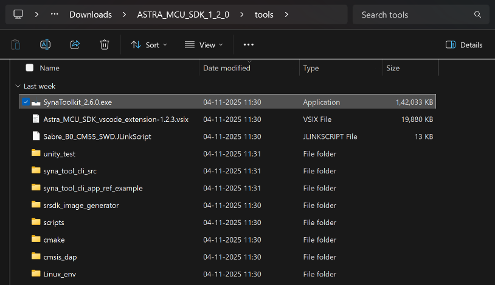

### Run SynaToolkit installer and follow the instructions:

 The default installation folder for SynaToolkit is:
 `C:\Synaptics\Apps\SynaToolkit_2.6.0`

# Menu Bar

## Main

### Load Log Records

**Purpose**: Users can load previously saved log files for analysis or
review.

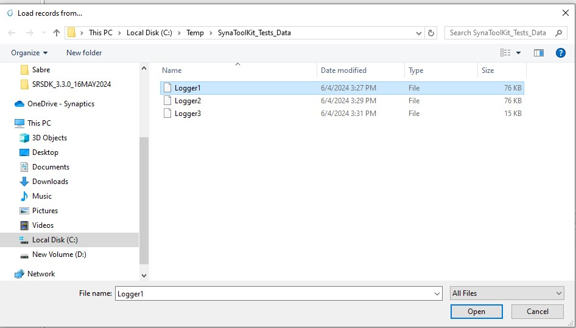

**Steps**:
- **Navigate to Load Option:**
In the main menu, locate and click the
Load log records option to initiate the file selection process.
- **Select Log File:**
The available log files such as Logger1, Logger2,
and Logger3 will be listed with details like modification date and
file size. The correct file format to load and view the logs in the
Logger Tab is ".log".
- **Open Log File:**
Click on the desired log file to select it. The
file name will appear in the \'File name\' field at the bottom of the
window.Click the Open button to load the file.
- **Result:**
Upon successful loading, the data from the selected log file will be
displayed on a new tab named after the log file (e.g., Logger1 tab for
Logger1 file).
- **Troubleshooting:**
If the log file does not load correctly, ensure the file format is
supported, and check for permissions issues or file corruption. If
problems persist, contact support.

### Save Log Records

**Purpose**: Allows users to save the current state of log records
from the active tab to a file on their computer.

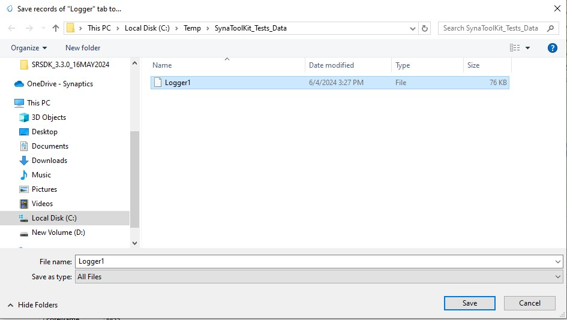

**Steps**:

1.  **Initiate Save Process**: 
    - Click on the Save Log records as JSON
    objects (or) Save Log records as TXT option located within the
    active log tab. This action will open a file saving dialog window.
     
2.  **Choose Save Location**:
    - The dialog will display the most recently used directory, but you can
    navigate to other directories if you wish to save the log file
    elsewhere.
    You can also create a new folder within the dialog, if necessary, by
    clicking on the New folder button.

3.  **Name the File**:
    - Enter a name for your log file in the \'File name\' field and append
    ".log" to the name. If you\'re overwriting an existing file, you can
    select it from the list in the dialog.

4.  **Save the File**:
    - Click the Save button to save the log file. Ensure the file extension
  and name are correct before saving.

> **Note**: Make sure that the log file is saved in a location where you
> have write permissions, to avoid any issues with file creation.

### Clear Log Records

**Purpose**: Allows users to clear all current log records displayed
in the application.

**Steps**:
- Navigate to the specific tab where log records are displayed. Select
  the option to clear logs. This will remove all data from the tab,
  ensuring it is empty for new data

- Select the option to clear logs. This will remove all data from the
  tab, ensuring it is empty for new data.

### Clear CLI Log

**Purpose**: Provides the functionality to clear the Command Line
Interface (CLI) log, removing all command histories and outputs.
**Steps**:

- Access the CLI interface within the application.

- Execute the command or select the option to clear the CLI log. This
  action will erase all entries from the CLI log view.

### Single Logger Tab Mode

**Purpose**:
Streamlines operations by performing all actions related to log files - such as saving, loading, and clearing - within a single tab, without creating new tabs.

**Mode Usage**:

- When this mode is enabled, select any \'Save\', \'Load\', or \'Clear\'
  operation related to log files.

- All actions are confined to the same tab, preventing the creation of
  additional tabs and simplifying the user interface.

### Settings

#### **a) Appearance Settings**

**Purpose**: Customize the visual elements of the application,
including fonts, table row height, and other display features.

**Steps**:

1.  Navigate to Settings and select the Appearance tab.

2.  Modify the settings as needed:

     **Font in Logger Tables**: Choose a font and size.
     **Font in Text Edit Windows**: Select preferred font and size.
     **Table Row Line Height**: Adjust to desired thickness.
      **Word Wrap**: Enable or disable word wrap.
     **Time Formatting**: Set the format
    for time display.

3.  Apply changes by clicking Apply.

4.  To revert to original settings, click Restore Defaults.

5.  To cancel changes, click Cancel.

#### **b) Search Settings**

**Purpose**: Configure default search options to enhance finding
specific logs or entries.

**Steps**:

1.  Under Settings, go to the Search tab.

2.  Set default behaviours for:

       **Open by Default**: Automatically expand search results.
       **Regex by Default**: Enable regular expression in searches.
       **Case Sensitive**: Make searches sensitive to case.
       **Wildcard by Default**: Allow wildcard characters in searches.

3.  Save the settings with Apply, revert with Restore Defaults, or
    cancel with Cancel.

#### **c) Server Settings**
- To be supported in future release.

#### **d) Advanced Settings**

**Purpose**: Fine-tune advanced operational parameters like logging
levels and performance benchmarks.

**Steps**:

1.  Access Settings and navigate to the Advanced tab.

2.  Adjust the advanced settings:

**Logging Level**: Set the verbosity of console output.

3.  Use Apply to save, Restore Defaults to revert, or Cancel to exit
    without saving.

### Quit

Close the GUI application

## Logger Tabs

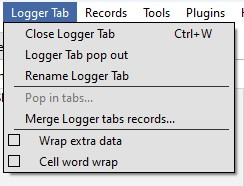

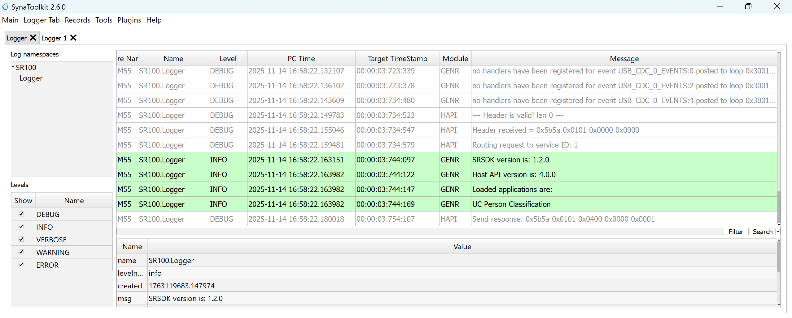

### Close Logger Tab

**Purpose**: This command allows users to close the currently opened
Logger Tab within the application.
**Steps**:

1.  **Navigate to the Logger Tab**: Identify the Logger Tab you intend
    to close.

2.  **Close the Tab**: Use the close option available on the tab,
    typically represented by an \"X\" or option from the menu.

> **Important Note**: Ensure that all necessary data within the Logger
> Tab is saved prior to closing, as closing the tab may result in the
> loss of unsaved data.

### Logger Tab Pop Out

 **Purpose**: Enhances multitasking by allowing users to detach the
 Logger Tab from the main application window and operate it as an
 independent dialog window. This can be useful for comparing logs
 side-by-side or on different monitors.

 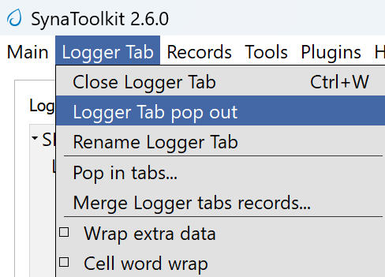

**Steps**:

1.  Locate the Logger Tab you wish to detach.

2.  Click on an option \"Pop Out\".

3.  The Logger Tab will then open in a new window, separate from the
    main application interface.

**Functionality**:
The detached Logger Tab retains all functionality and can be
interacted with as if it were docked in the main application window.
Adjust the window size and position as needed to suit your viewing
preferences.
> **Note**: To reintegrate the Logger Tab back into the main application
> window, use "Pop In".

### Pop In Tabs

**Purpose**: This operation allows users to reintegrate detached Logger Tabs back into the main application window.

**Steps**:

1.  **Locate the Detached Tab**: Find the Logger Tab window that has
    been popped out.

2.  **Reintegrate Tab**: Use the \"Pop In\" option, usually available
    through a right-click context menu or a dedicated button in the
    tab\'s title bar.

3.  **Confirm Integration**: The tab should now appear back in the main
    application window, merged with other existing tabs.

> **Note**: This feature is particularly useful for users who utilize
> multiple monitors or need to manage workspace efficiently by
> consolidating tabs.

### Rename Logger Tab

**Purpose**: This function allows users to rename an existing Logger Tab to better reflect its content or purpose.

 **Steps**:

1.  **Initiate Rename**: Right-click on the Logger Tab you wish to
    rename and select the \"Rename\" option or double-click the tab name
    if applicable.

2.  **Enter New Name**: In the dialog box that appears, type the new
    name for the tab.

3.  **Apply Changes**: Click OK to apply the new name.

4.  **Cancel Changes**: If you decide not to rename the tab, click
    Cancel to leave the tab name unchanged.

> **Note**: After renaming, ensure that the new name accurately reflects
> the tab\'s content to avoid confusion.

### Cell Word Wrap

**Purpose**: This feature ensures that text in a cell is wrapped to
fit within the column width, improving readability and keeping the
interface tidy.

**Steps**:

1.  **Access Logger Table**: Navigate to the logger table where messages
    and other details are displayed.

2.  **Adjust Column Width**: If the text in a cell exceeds the column
    width, the text will automatically wrap to the next line within the
    same cell.

3.  **Manual Adjustment**: You can also manually adjust the width of the
    columns by dragging the edges of the column header if more or less
    wrapping is desired.

> **Note**: Enabling word wrap helps in viewing longer messages without
> the need to horizontally scroll through the table, making it easier to
> read and analyse log data.

## Records

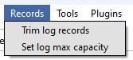

### Trim Log Records

**Purpose**: This feature allows users to trim the log to maintain
only the most recent entries, which can help in managing space and
improving log readability.
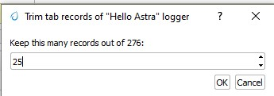

**Steps**:

1.  **Initiate Trim**: Open the log tab you want to trim and select the
    option to trim log records. This may be available in a menu or as a
    button.

2.  **Set Trim Criteria**: A dialog box will appear asking how many of
    the most recent records you wish to keep. Enter the desired number.

3.  **Confirm**: Click OK to apply the trim. The log will then only
    display the specified number of the most recent entries.

4.  **Cancel**: If you change your mind, click Cancel to exit without
    trimming the log.

### Set Log max capacity

 **Purpose**:
 This function allows setting a maximum capacity for log records. When the set number is exceeded, older entries will be automatically deleted to make room for new ones.

 

 **Steps**:

1.  **Access Capacity Settings**: From the log management settings,
    select the option to set the maximum log capacity.

2.  **Specify Capacity**: In the dialog
    box, specify the maximum number of log entries to retain. Enter 0 to
    disable this limit.

3.  **Apply Changes**: Click OK to save the setting. The log will
    automatically manage its entries to not exceed this number.

4.  **Cancel**: Click Cancel if you decide not to set or change the
    capacity.

> **Note**: Setting a maximum capacity can help in maintaining
> performance by limiting the number of log entries stored at any one
> time. Ensure you choose a limit that balances performance with the
> need for historical data.

## Tools

### Script Editor

**Purpose**:
The Script Editor facilitates the creation, editing, and management of scripts composed of supported commands for testing or operational purposes.

 

**Features**:

- **Create and Edit Scripts**: Develop new scripts or modify existing ones using supported commands from the command menu and custom commands like sleep.

- **Save and Manage Scripts**: Save modifications, delete scripts no
  longer needed, and refresh the script list to reflect recent changes.

- **Import and Export**: Transfer scripts between different systems or environments for consistency and backup.

- **Execute Scripts**: Run scripts directly against the hardware or
  software environment to automate tasks and test scenarios.

**Steps**
**1. Access the Script Editor**

- Navigate to the Script Editor from the main application menu or toolbar.

**2. Creating or Modifying Scripts**

- Click **Add Script** to start a new script, or select an existing script from the list to edit it in the script text area.

- Enter or modify the command sequence according to your testing needs.

**3. Saving and Managing Scripts**

- Click **Save Script** to preserve any new changes.

- To delete a script, select it and click **Delete Script**.

- Use **Refresh List** to update the script display after adding,editing, or deleting scripts.

**4. Importing and Exporting Scripts**

- Use **Import Scripts** to load scripts from an external file.

- Click **Export Scripts** to save the selected script externally for use on other systems or for backup.

**5. Executing Scripts**

- Select a script from the list and click **Execute Script**.\
  Ensure you are connected to the appropriate hardware or software
  environment where the script will run.

- Monitor the execution process and results directly within the
  application.

> **Note:**
> Before executing scripts---especially those that modify settings or
> operational parameters---ensure they are thoroughly tested to avoid
> unintended consequences.
>
**Steps**:

1.  **Access the Script Editor**:

    - Navigate to the Script Editor from the main application menu or toolbar.

2.  **Creating or Modifying Scripts**:

    - Click Add Script to start a new script or select an existing script from the list to edit it in the script text area below. Enter or modify the command sequence according to your testing needs.

3.  **Saving and Managing Scripts**:

    - Click Save Script to preserve any recent changes.

    - To delete a script, select it and click Delete Script.

    - Use Refresh List to update the script display after adding,
      editing, or deleting scripts.

4.  **Importing or Exporting Scripts**:

    - Use Import Scripts to load scripts from an external file.

    - Click Export Scripts to save the selected script externally for use on other systems or for backup.

5.  **Executing Scripts:**

     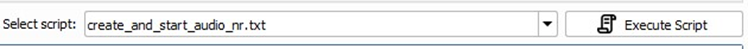

    - To run a script, select it from the list and click Execute Script.Ensure you are connected to the appropriate hardware or software environment where the script will run.

    - Monitor the execution process and results directly within the
      application.

    > **Note**: Before executing scripts, especially those that modify settings or operational parameters, ensure they are thoroughly tested to avoid unintended consequences.

### Registers Info Data Base

To be supported in future release.

### Memory Analyzer

To be supported in future release.

### Video Streamer

 The Video Streamer in Synatoolkit is used to stream the video output of the usecase being executed. There are various options that can be configured in the video streamer.

 

- **Source Options**: Facilitates the selection of **Image Source**, and **Demosaic**, option to **Connect Image Source**, and **Disconnect** from Image Source.

- **Usecase Dynamic Commands**: Facilitates the selection of **UC ID**, Buttons to **Create Use Case**, **Start Use Case**, **Stop Use Case**, **Resume Use Case**, **Send Command**, and field to **enter the build command**.

- **Overlay Options**: Facilitates selection of displaying the **Detections**, **Resolution** and **FPS**, also control of **Exposure** and **Gain**.

- **Recording Options**: Facilitates the recording of **Frames**, **Video** and **FPS**. Available Overlay options are Draw Detections, Display FPS, Display Resolution, Exposure and Gain adjustments.

> **Note: Install ffmpeg windows package to support video recording.**
> Use the below command to install ffmpeg
> ***winget install ffmpeg***

### Pin Configurator
To be supported in future release.

### Image Generator

**Prerequisite:**

1.  Install
    <https://developer.arm.com/-/media/Files/downloads/gnu/13.2.rel1/binrel/arm-gnu-toolchain-13.2.rel1-x86_64-arm-none-eabi.tar.xz>

2.  Add \"Arm GNU Toolchain arm-none-eabi\\13.2 Rel1\\bin\" to path.
    - These are steps for creating a B0 image and burning the flash using- the SynaToolKit GUI.

#### **Creating the image**

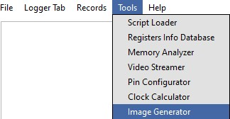

1.  By clicking the "..." in the FW 55 file option, browse the .elf/.axf file to be converted to .bin.

2.  Untick the "Host Full Image" option. Make sure the "Secured Image", "Flash Full Image", and "Flash Enable" options are checked. Choose the Flash type for your hardware.

3.  Check the "Advanced Configurations" option.

4.  By default, "Flash AB Partition" will be unticked, and the binary will be converted with single slot. If this option is selected, binary will be generated for dual slot and will be larger in size compared to single slot bin.

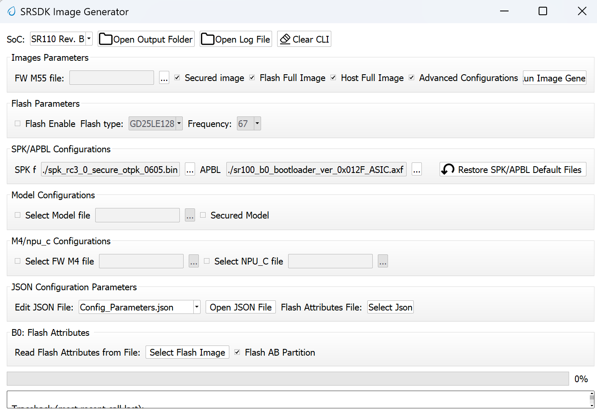

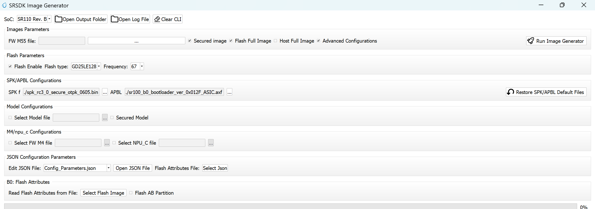

4.  Under "Model Configurations", check the "Select Model File". By
    clicking the "...", browse the .bin file. For eg: the .bin file can be found in `common\applications\sample_applications\inference\inference_basic_flash_sample_app.` [Refer this](./Astra_MCU_SDK_vela_compilation_tflite_model.md) to convert TFlite model to .bin using vela compiler.

 

5.  Click on "Run Image Generator"

 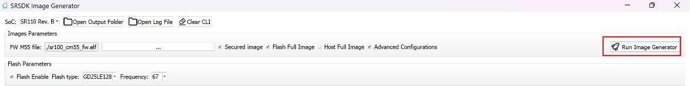

6.  The model binary will be created in  
`<path to Synatoolkit>\bin\Output\B0_Flash\Components`.

7.  The Flash binary will be created in  
`<path to Synatoolkit>\bin\Output\B0_Flash`

#### **Flashing the image**

1.  Ensure that the SR110 is properly connected to the system per the SR110 [User guide.]( ./Astra_MCU_SDK_Quick_Start_Guide.md) provides instructions on how to setup the SR110 to flash firmware.

2.  Under SynaTool CMD, select "FW" and the COM port corresponding USB connector on the SR110 from the dropdown.

3.  Click on "Connect".

 

4.  In the "Select Command" dropdown, click on "Burn file to flash".

 

5.  Follow the below steps to run inference from model burned in flash.

    a.  Select the generated model binary file in the
    `<path to Synatoolkit>\bin\Output\B0_Flash\Components`.

    b.  Once the file is selected, click on the filename and append the address 0x629000 as shown below.

    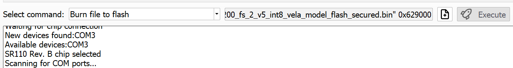

    c.  Click on "Execute"

    d.  Wait till the flashing is complete. Connect the SR110 to the system via UART1 using the UART-USB dongle to obtain the logs.

6.  Repeat steps 1 to 5 to update firmware image. Click on "+" icon and
    select the .bin file generated in `<path to Synatoolkit>\bin\Output\B0_Flash` and click on "Execute". Wait till the flashing is complete.

 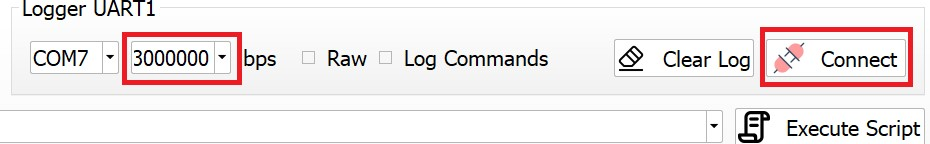

 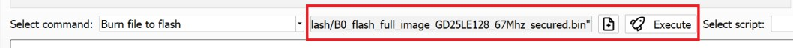

7.  Reset the platform.

#### **Command line based Image generation and flashing**

The following describes the instructions for creating a B0 .bin file
using the image generator command line tool, instructions are also
included on how to burn the image to flash.

##### **Creating Image**

| Category | Section | Details |
|:---|:---|:---|
| **Tool & Location** | **Python Script** | `srsdk_image_generator.py` |
| | **Script Location** | `<path to Synatoolkit>\srsdk_image_generator` (using python script) |
| | **Windows Executable** | `srsdk_image_generator.exe` |
| | **Executable Location** | `<path to Synatoolkit>\bin` (using executable) |
| **Input** | **Configuration File** | `fw_Update_Parameters.json` – FW update config file (Data for FW Update / Multi Image Data)    |
| **Output** | **Output Folders** | In Output folder there are two Folders: "**Flash**" and "**Host**" |
| | **"Flash" Folder** | Contains file with full image. The folder 'Components' contains all the sub images that are combined to make the full image.      |
| | **"Host" Folder** | Contains file with full image. The folder 'Components' contains all the sub images that are combined to make the full image.   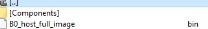    |
| **Dependencies** | **For .axf Files** | **ARM Compiler** is required. Environment Variable: **`AC6_TOOLCHAIN_6_19_0`** - `C:\Program Files\Arm\Development Studio 2022.2\sw\ARMCompiler6.19\bin` |
| | **For .elf Files** | **GCC Toolchain** is required. Environment Variable: **`GCC_TOOLCHAIN_13_2_1`** - `C:\Program Files (x86)\Arm GNU Toolchain arm-none-eabi\13.2 Rel1\bin` |
| | **Python Packages** | Need to install python packages by command: **`pip install -r requirements.txt`** |
| **Execution** | **Non Secure Flash Binary**(Example)| **Using Executable:** `.\srsdk_image_generator.exe -B0 -flash_image -sdk_non_secured -spk "C:\sabre\external_component\SPK\Archive\RC3.0\ASIC\NonSecure\spk_rc3_0_nosecure_romk_0605.bin" -apbl ".\B0_Input_examples\sr100_b0_bootloader_ver_0x0134_ASIC_Release.axf" -m55_image ".\B0_Input_examples\cm55_fw_example.axf" -flash_type GD25LE128 -flash_freq 67`     **Using Python:** `python .\srsdk_image_generator.py -B0 -flash_image -sdk_non_secured -spk "C:\sabre\external_component\SPK\Archive\RC3.0\ASIC\NonSecure\spk_rc3_0_nosecure_romk_0605.bin" -apbl ".\B0_Input_examples\sr100_b0_bootloader_ver_0x0134_ASIC_Release.axf" -m55_image ".\B0_Input_examples\cm55_fw_example.axf" -flash_type GD25LE128 -flash_freq 67`
| | **Secure Flash Binary** (Example) | **Using Executable:** `.\srsdk_image_generator.exe -B0 -flash_image -sdk_secured -spk "C:\sabre\external_component\SPK\Archive\RC3.0\ASIC\Secure\Development\spk_rc3_0_secure_otpk_0605.bin" -apbl ".\B0_Input_examples\sr100_b0_bootloader_ver_0x0134_ASIC_Release.axf" -m55_image ".\B0_Input_examples\cm55_fw_example.axf" -flash_type GD25LE128 -flash_freq 67`     **Using Python:** `python .\srsdk_image_generator.py -B0 -flash_image -sdk_secured -spk "C:\sabre\external_component\SPK\Archive\RC3.0\ASIC\Secure\Development\spk_rc3_0_secure_otpk_0605.bin" -apbl ".\B0_Input_examples\sr100_b0_bootloader_ver_0x0134_ASIC_Release.axf" -m55_image ".\B0_Input_examples\cm55_fw_example.axf" -flash_type GD25LE128 -flash_freq 67`
| | **Non Secure Host Binary** (Example) | **Using Executable:** `.\srsdk_image_generator.exe -B0 -host_image -sdk_non_secured -spk "C:\sabre\external_component\SPK\Archive\RC3.0\ASIC\NonSecure\spk_rc3_0_nosecure_romk_0605.bin" -apbl ".\B0_Input_examples\sr100_b0_bootloader_ver_0x0134_ASIC_Release.axf" -m55_image ".\B0_Input_examples\cm55_fw_example.axf"`     **Using Python:** `python .\srsdk_image_generator.py -B0 -host_image -sdk_non_secured -spk "C:\sabre\external_component\SPK\Archive\RC3.0\ASIC\NonSecure\spk_rc3_0_nosecure_romk_0605.bin" -apbl ".\B0_Input_examples\sr100_b0_bootloader_ver_0x0134_ASIC_Release.axf" -m55_image ".\B0_Input_examples\cm55_fw_example.axf'` |
| | **Secure Host Binary** (Example) | **Using Executable:** `.\srsdk_image_generator.exe -B0 -host_image -sdk_secured -spk "C:\sabre\external_component\SPK\Archive\RC3.0\ASIC\Secure\Development\spk_rc3_0_secure_otpk_0605.bin" -apbl ".\B0_Input_examples\sr100_b0_bootloader_ver_0x0134_ASIC_Release.axf" -m55_image ".\B0_Input_examples\cm55_fw_example.axf"`     **Using Python:** `python .\srsdk_image_generator.py -B0 -host_image -sdk_secured -spk "C:\sabre\external_component\SPK\Archive\RC3.0\ASIC\Secure\Development\spk_rc3_0_secure_otpk_0605.bin" -apbl ".\B0_Input_examples\sr100_b0_bootloader_ver_0x0134_ASIC_Release.axf" -m55_image ".\B0_Input_examples\cm55_fw_example.axf'`|

##### **Flashing Image**

| Category | Section | Details |
|:---|:---|:---|
| **Flashing** | **Location** | `<path to Synatoolkit>\`| |
|| **Python Script** | `synatool.py`
||**Flashing the Image** (Execution Example) | **Flash model binary after flashing the image.**  1. Run Python command: `python.exe synatool.py --fw --uart --comport <COMPORT> --baudrate 230400 --hostapi04 --b0protocol` (or `python .\synatool.py ...`) 2. Command Menu Appears:   a. `flashBurn <MODEL_BINARY> 0x629000`   b. `Exit` 3. After successful flashing, **power cycle the platform**. 4. Use Serial console Software (putty, teraterm, minicom) to watch the application running. |

## Plugins

### Plugin Manager

**Purpose**:
The Plugin Manager in SynaToolKit allows users to install, manage, and update various plugins that enhance the functionality of the main software.

 **Features**:

- **Install Plugins**: Easily add new capabilities to the toolkit by installing plugins.

- **Access Installation Directory**: View where plugins are stored on your system.

- **Refresh Plugin List**: Update the list of available and installed plugins to reflect any changes or new additions.

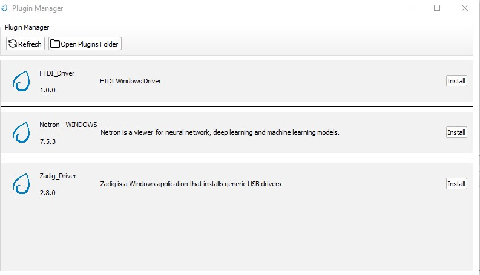

**Steps**:

1.  **Opening the Plugin Manager**:

- Navigate to the Plugin Manager from the main menu or toolbar of SynaToolKit.

2.  **Installing a Plugin**:

- Browse the list of available plugins.

- Click the Install button next to the plugin you wish to install. A progress indicator may appear to show the installation status.

3.  **Viewing Installed Plugins**:

- To view the installation directory and manage installed plugins, click Open Plugins Folder. This will open the folder in your system\'s file explorer.

4.  **Updating Plugin List**:

- If you have added plugins manually to the directory or wish to refresh the list after an installation, click the Refresh button.This ensures that the Plugin Manager displays the most current information.

> **Note**: Be sure to review the functionality and requirements of each plugin before installation to ensure compatibility with your current setup.
>
> Regular updates and management through the Plugin Manager will help maintain optimal performance and security of the software.

## Help

### About SynaToolkit

**Purpose**:
This section provides users with comprehensive information about SynaToolkit, including its version, features, and supported platforms.

**Accessing Information**:

- **Open About SynaToolkit**: Navigate to the Help menu and select About SynaToolkit. This will open a window displaying detailed
information about the toolkit.

 **Content Includes**:

- **Version Number**: Displays the current version of SynaToolkit,
  ensuring users know which version they are using.

- **License Information**: Details the licensing under which SynaToolkit
  is released, including any user obligations or rights. This version is
  released under the MIT License.

- **Release Notes**: Provides a summary of new features, improvements,
  and bug fixes in the latest release. Highlights from the latest notes
  include:

  - Support for various command types such as ROM, and FW commands.
  - Enhancements in GUI features like the Memory Analyzer and Video
    Streamer.
  - Introduction of new tools such as the Plugin Manager and Image
    Generator for B0.
  - Improvements and additions in connectivity options and simulation modes.

 **Platform Support**:
 - SynaToolkit is primarily supported on Windows.

 **Guide to Release Notes**:

- **Release Content**: Details the commands and interfaces supported by
  SynaToolkit, along with new functionalities added in the update.

- **Added Features**: Lists new tools and features introduced in the
  current version to enhance user interaction and toolkit performance.

- **Using this Information**: Use the About section to verify that your version of SynaToolkit is up to date and to understand the capabilities and limitations of your software. This is also useful for troubleshooting and when seeking support.

> **Note**: Regular updates to SynaToolkit introduce new features and improvements. Keeping abreast of this information ensures optimal use of the toolkit.

# Logger Functionality

## Logger Connect/Disconnect

 **Purpose**:
 Facilitates the connection and disconnection of the Logger tool to and from UART1 Com ports, allowing for dynamic logging of system communications.

### Connect

 **To Connect**: Select the appropriate UART1 Com port and baud rate, then click the Connect button. A new Logger tab will open for each connection, displaying incoming log data.

 **Requirements**: Ensure the correct COM port and baud rate are selected to establish a successful connection.

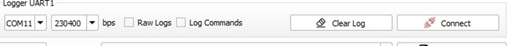

### Disconnect

**To Disconnect**: Press the Disconnect button to terminate the connection with the logger.
**Tab Persistence**: The Logger tab will remain open and accessible
even after disconnection, allowing you to review the logged data.

### Clear Log

- **Functionality**: Clears all data from the log buffer to free up
  space or prepare for new data.

- **Usage**: Click the Clear Log button to remove all existing entries
  from the log display.

### Raw Logs

- **Overview**: If enabled, the logger will display logs without parsing
  them according to the SR110 format, showing raw data as received.

- **Toggle**: Check the Raw Logs box to view unprocessed log entries.

### Log Commands

- **Functionality**: When checked, commands executed through SynaTool
  are logged, providing a transcript of actions performed during the
  session.

- **Activation**: Check the Log Commands box to include command logging
  in the session data.

> **Usage Notes**: Utilizing the Logger effectively can aid in
> troubleshooting and monitoring the system's communication with
> connected devices. Ensure that logs are saved or cleared appropriately
> to avoid loss of important data or overflow that could hinder
> performance.

## Log NameSpaces

**Purpose**:
Allows users to select different namespaces related to supported chips and cores, facilitating targeted logging sessions specific to hardware components.

**Functionality**:
Currently, the tool supports logging for the SR110 chip with core M55,
M4, with the potential to expand to other chips and cores in the
future.

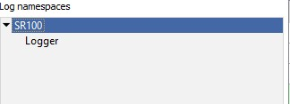

## Levels

 **Purpose**:
 Provides a customizable logging experience by allowing
 users to select which levels of log messages (such as Errors,
 Warnings, or Debug information) are visible.

**Features**:

- **Selective Visibility**: Toggle visibility of log messages by level
  to focus on relevant data, such as debugging information or errors.

- **Customize Appearance**: Modify the appearance of log messages by
  level for better readability or personal preference.

 If you focus on one of the levels with mouse and press right button
 the new windows will be popup where you can select one of options:

### Enabling/Disabling Levels

- **Access**: Right-click on any level in the levels window to access
  options.

- **Options**:

  - **Enable All**: Show all log levels.

  - **Disable All**: Hide all log levels.

  - **Edit Selected Level**: Open the level editor to change properties
    such as color and font style.

### Level Editor

 **Functionality**: Customize the visual properties of log messages for
 each level.

 **Settings**:

- **Light/Dark Mode Color Settings**: Adjust text and background colors
  for both light and dark modes.

- **Font Styles**: Change font styles including bold, italic, and
  underline.

 **Preview**: View changes in real-time within the preview pane at the
 bottom of the level editor window.

### Presets

**Purpose**:
Quickly apply predefined or custom styling presets to log
levels.

**Usage**:

- **Set as Default Preset**: Apply the selected preset as the default
  for all log levels.

- **Reset to Default**: Revert to the application\'s default preset
  settings.

**Usage Tips**:

Utilize the log namespace feature to manage logs according to specific hardware components or software modules.
Adjust log levels to streamline the debugging process, focusing only on the necessary data.Customize log appearance to differentiate between log types easily or match user preferences for an enhanced visual experience.

## Main Log Window

 **Purpose**:
 The Main Log Window is central to viewing and managing
 log data, offering a variety of tools to enhance the visibility and
 analysis of log messages.

### Log Display

 **Overview**: Displays logs with detailed information such as Core
 Name, Log Namespace, PC Time, Target Timestamp, Module, and the
 message itself.

 **Navigation**: Logs are shown in a tabulated format allowing for easy
 review and management.

### Message Details

 **Accessing Details**: Right-click on a message and select \"View
 message\" to open a detailed view of the log message.

 **Usage**: This feature is useful for examining complete log entries
 in depth.

### View Message Window

- **Functionality**: Displays the complete content of a log message.

- **Options**: Users can copy the message to the clipboard or close the
  window.

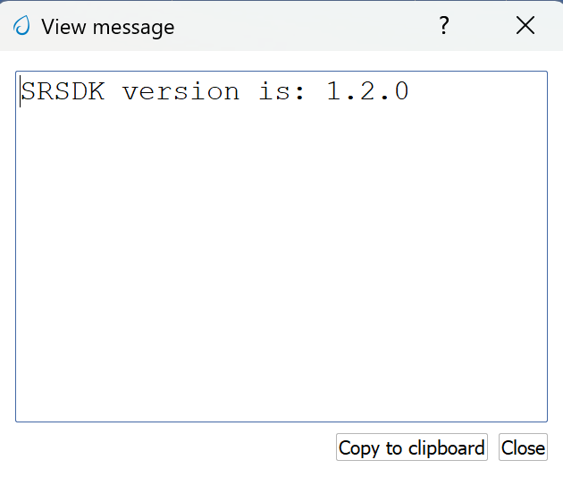

### Parsed Message Display

- **Description**: Shows a parsed view of the message, breaking down the
  log entry into its components like Name, Level, Time, and Message,
  among others.

- **Interactivity**: This detailed view helps in understanding the
  structured components of each log message.

### Filtering Logs

 **Filtering**: Enter specific criteria in the filter bar to display
 only those log entries that meet the conditions.

 **Resetting Filter**: Clear the filter by pressing the `Clear
 Filter` button to return to viewing all logs.

 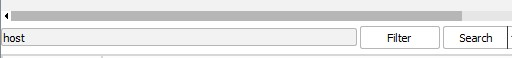

 

### Search Functionality

**Capabilities**:

- **Regex (Regular Expression)**: Use regex for complex pattern searches
  within log messages.

- **Case Sensitive**: Search the logs taking into account the case
  sensitivity.

- **Wildcard**: Use wildcard characters to search for variations of a
  string.

  

### Customize Header

- **Customization**: Right-click on any column header to customize which
  data columns are displayed.

- **Header Editor**:

  - **Adjust Visibility**: Toggle various data points like Core ID,
    Function, Thread Name, etc., to show or hide in the log view.

  - **Save/Reset**: Save the custom settings as the default or reset to
    the stock configuration.

  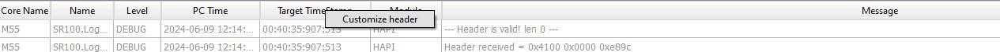

  

 **Tips for Effective Use**:

- Utilize the detailed message view to troubleshoot specific issues by
  examining the full content of relevant logs.

- Regularly clear and filter logs to maintain clarity and focus on
  relevant entries during analysis.

- Customize the log display headers to focus on information pertinent to
  your analysis needs.

# SynaTool Commands Menu

## ROM

### Host API version

**Purpose**:
This command allows users to retrieve the version number
of the host API currently being used by the system, which can be
crucial for compatibility checks and troubleshooting.

**Command**: ver

**Functionality**:

- **Description**: Executes the ver command to display the version of
  the host API.

- **Usage**: Simply type ver in the command interface and press Enter.
  The API version will be displayed, providing you with the current
  version information of the host API.

### Burn the file to flash

`flashBurn <binary file> [sector addr offset in hex]`

Usage:

`flashburn B0_flash_full_image_GD25LE128_67Mhz_secured.bin`

`flashburn Model.bin 0x100000`

### Read Flash ID

flashReadId - Display the flash type and size

`flashReadPage 0x400` - read the page that starts at address 0x400 (4th
page in this example)

### **Erase Entire flash memory**

CLI full command: flashChipErase

### Erase Flash Sector

 - CLI full command: `flashSectorErase <sector addr offset>[<Num of
 sectors>]`

 - command example: `flashSectorErase 0x1000` - erases the sector that start with address 0x1000 (2nd sector in this example)

### Use Alternative SPK/APBL Image for Burning

1. CLI full command: altSPK \<binary File\>

2. Using alternative SPK image:

   `C:/Users/scorelen/Git/sabre_tool_kit/tools/srsdk_image_generator/B0_Input_examples/spk_rc3_0_nosecure_romk_dbg_0605.bin`

3. Using alternative BootLoader image:

   `D:/Synaptics/Apps/SynaToolkit_2.1.200/bin/Output/B0_Flash/Components/1_sr100_b0_bootloader_ver_0x0128_ASIC_flash_secured.bin`

## FW

### Install the FW update

 The fwUpdateInstall command installs
 and accepts the files that were updated on the flash memory. After
 executing this command, the ROM will load the newly updated module(s)
 from the flash.

 **Parameters:**

 1. reboot (optional): Specifies whether to
 reboot the system after installation. The default value is 0 (no
 reboot). Setting this parameter to 1 will reboot the system.CLI

 2. full command: fwUpdateInstall `[reboot]`

>**Notes:** If no reboot parameter is provided, the system will not reboot by
>default.

### FW Update

 The FW Update command updates a specific module or multiple modules on
 the flash memory.

 **Steps to Use:**

1.  Use the image generator tool to build the image or multiple image
    files.

2.  Execute the CLI command fwUpdate `<binary file>`

### Burn the Flash

Choose the command, choose the file and press the "Execute" button.
The burn process should start.

### Read Flash ID

1. flashReadId - returns flash id with type and size

2. FlashType is: GIGADEVICE_GD25LQ128CD

3. FlashSize is: 128 Mbits

### Erase a flash sector

 The flashSectorErase command erases a specific sector or multiple
 sectors in the flash memory.

 **Parameters:**

` ~sector\ address~: The address of the flash sector to be erased. `

1. Num of sectors (optional): The number of consecutive sectors to be
erased starting from the specified address. If not provided, only the
specified sector will be erased.

2. CLI full command: `flashSectorErase <sector address>[<Num of
 sectors>]`

### Read a flash memory page

 The flashReadPage command reads the contents of a specified flash
 memory page.

 **Parameters:**

- page address: The address of the flash memory page to be read.

- CLI full command: `flashReadPage <page address>`

Example: **flashReadPage 0x1000**
