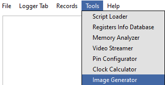

1.0 Installation
================

1. Use SynaTool Kit from Release package: <SRSDK>/tools/

..

   |image0|

2. Run SynaToolkit installer and follow the instructions:

|image1|\ |image2|

The default installation folder for SynaToolkit is:
C:\Synaptics\Apps\SynaToolkit_2.4.3

2.0 Menu Bar
============

2.1 Main
--------

|image3|

2.1.1 Load Log Records
~~~~~~~~~~~~~~~~~~~~~~

**Purpose**: Users can load previously saved log files for analysis or
review.

|image4|

**Steps**:

   **Navigate to Load Option**: In the main menu, locate and click the
   Load log records option to initiate the file selection process.

   **Select Log File:** The available log files such as Logger1,
   Logger2, and Logger3 will be listed with details like modification
   date and file size. The correct file format to load and view the logs
   in the Logger Tab is “.log“.

   **Open Log File**: Click on the desired log file to select it. The
   file name will appear in the 'File name' field at the bottom of the
   window. Click the Open button to load the file.

**Result**:

   Upon successful loading, the data from the selected log file will be
   displayed on a new tab named after the log file (e.g., Logger1 tab
   for Logger1 file).

**Troubleshooting**:

   If the log file does not load correctly, ensure the file format is
   supported, and check for permissions issues or file corruption. If
   problems persist, contact support.

2.1.2 Save Log Records
~~~~~~~~~~~~~~~~~~~~~~

**Purpose**: Allows users to save the current state of log records from
the active tab to a file on their computer.

|image5|

**Steps**:

   **Initiate Save Process**: Click on the Save Log records as JSON
   objects (or) Save Log records as TXT option located within the active
   log tab. This action will open a file saving dialog window.

   **Choose Save Location**:

   The dialog will display the most recently used directory, but you can
   navigate to other directories if you wish to save the log file
   elsewhere.

   You can also create a new folder within the dialog if necessary by
   clicking on the New folder button.

2. **Name the File**:

   -  Enter a name for your log file in the 'File name' field and append
      “.log“ to the name. If you're overwriting an existing file, you
      can select it from the list in the dialog.

3. **Save the File**:

   -  Click the Save button to save the log file. Ensure the file
      extension and name are correct before saving.

**Note**: Make sure that the log file is saved in a location where you
have write permissions, to avoid any issues with file creation.

2.1.3 Clear Log Records
~~~~~~~~~~~~~~~~~~~~~~~

**Purpose**: Allows users to clear all current log records displayed in
the application.

**Steps**:

-  Navigate to the specific tab where log records are displayed.

-  Select the option to clear logs. This will remove all data from the
   tab, ensuring it is empty for new data

2.1.4 Clear CLI Log
~~~~~~~~~~~~~~~~~~~

**Purpose**: Provides the functionality to clear the Command Line
Interface (CLI) log, removing all command histories and outputs.

**Steps**:

-  Access the CLI interface within the application.

-  Execute the command or select the option to clear the CLI log. This
   action will erase all entries from the CLI log view.

2.1.5 Developer Mode
~~~~~~~~~~~~~~~~~~~~

**Purpose**: Tailored for developers, this mode provides enhanced data
outputs, such as RX/TX data, for debugging and development.

**Mode Activation**:

-  Enable Developer Mode from the application settings.

-  Expect additional data outputs (e.g., TX:5b 41 00 00 e8 9c) which are
   essential for in-depth analysis and troubleshooting.

|image6|

2.1.6 Single Logger Tab Mode
~~~~~~~~~~~~~~~~~~~~~~~~~~~~

**Purpose**: Streamlines operations by performing all actions related to
log files—such as saving, loading, and clearing—within a single tab,
without creating new tabs.

**Mode Usage**:

-  When this mode is enabled, select any 'Save', 'Load', or 'Clear'
   operation related to log files.

-  All actions are confined to the same tab, preventing the creation of
   additional tabs and simplifying the user interface.

2.1.7 Settings
~~~~~~~~~~~~~~

a) Appearance Settings
^^^^^^^^^^^^^^^^^^^^^^

**Purpose**: Customize the visual elements of the application, including
fonts, table row height, and other display features.

|image7|

**Steps**:

1. Navigate to Settings and select the Appearance tab.

2. Modify the settings as needed:

   -  **Font in Logger Tables**: Choose a font and size.

   -  **Font in Text Edit Windows**: Select preferred font and size.

   -  **Table Row Line Height**: Adjust to desired thickness.

   -  **Word Wrap**: Enable or disable word wrap.

   -  **Time Formatting**: Set the format for time display.

3. Apply changes by clicking Apply.

4. To revert to original settings, click Restore Defaults.

5. To cancel changes, click Cancel.

b) Search Settings
^^^^^^^^^^^^^^^^^^

**Purpose**: Configure default search options to enhance finding
specific logs or entries.

|image8|

**Steps**:

1. Under Settings, go to the Search tab.

2. Set default behaviors for:

   -  **Open by Default**: Automatically expand search results.

   -  **Regex by Default**: Enable regular expression in searches.

   -  **Case Sensitive**: Make searches sensitive to case.

   -  **Wildcard by Default**: Allow wildcard characters in searches.

3. Save the settings with Apply, revert with Restore Defaults, or cancel
   with Cancel.

c) Server Settings
^^^^^^^^^^^^^^^^^^

To be supported in future release.

d) Advanced Settings
^^^^^^^^^^^^^^^^^^^^

**Purpose**: Fine-tune advanced operational parameters like logging
level.

|image9|

**Steps**:

1. Access Settings and navigate to the Advanced tab.

2. Adjust the advanced settings:

   -  **Logging Level**: Set the verbosity of console output.

3. Use Apply to save, Restore Defaults to revert, or Cancel to exit
   without saving.

2.1.8 Quit
~~~~~~~~~~

Close the GUI application

2.2 Logger Tabs
---------------

|image10|

|image11|

2.2.1 Close Logger Tab
~~~~~~~~~~~~~~~~~~~~~~

**Purpose**: This command allows users to close the currently opened
Logger Tab within the application.

**Steps**:

1. **Navigate to the Logger Tab**: Identify the Logger Tab you intend to
   close.

2. **Close the Tab**: Use the close option available on the tab,
   typically represented by an "X" or option from the menu.

**Important Note**: Ensure that all necessary data within the Logger Tab
is saved prior to closing, as closing the tab may result in the loss of
unsaved data.

2.2.2 Logger Tab Pop Out
~~~~~~~~~~~~~~~~~~~~~~~~

**Purpose**: Enhances multitasking by allowing users to detach the
Logger Tab from the main application window and operate it as an
independent dialog window. This can be useful for comparing logs
side-by-side or on different monitors.

|image12|

**Steps**:

1. Locate the Logger Tab you wish to detach.

2. Click on an option "Pop Out".

3. The Logger Tab will then open in a new window, separate from the main
   application interface.

**Functionality**:

-  The detached Logger Tab retains all functionality and can be
   interacted with as if it were docked in the main application window.

-  Adjust the window size and position as needed to suit your viewing
   preferences.

**Note**: To reintegrate the Logger Tab back into the main application
window, use “Pop In“.

|image13|

2.2.3 Pop In Tabs
~~~~~~~~~~~~~~~~~

**Purpose**: This operation allows users to reintegrate detached Logger
Tabs back into the main application window.

|image14|

**Steps**:

1. **Locate the Detached Tab**: Find the Logger Tab window that has been
   popped out.

2. **Reintegrate Tab**: Use the "Pop In" option, usually available
   through a right-click context menu or a dedicated button in the tab's
   title bar.

3. **Confirm Integration**: The tab should now appear back in the main
   application window, merged with other existing tabs.

**Note**: This feature is particularly useful for users who utilize
multiple monitors or need to manage workspace efficiently by
consolidating tabs.

2.2.4 Rename Logger Tab
~~~~~~~~~~~~~~~~~~~~~~~

**Purpose**: This function allows users to rename an existing Logger Tab
to better reflect its content or purpose.

|image15|

**Steps**:

1. **Initiate Rename**: Right-click on the Logger Tab you wish to rename
   and select the "Rename" option, or double-click the tab name if
   applicable.

2. **Enter New Name**: In the dialog box that appears, type the new name
   for the tab.

3. **Apply Changes**: Click OK to apply the new name.

4. **Cancel Changes**: If you decide not to rename the tab, click Cancel
   to leave the tab name unchanged.

**Note**: After renaming, ensure that the new name accurately reflects
the tab's content to avoid confusion.

2.2.5 Cell Word Wrap
~~~~~~~~~~~~~~~~~~~~

**Purpose**: This feature ensures that text in a cell is wrapped to fit
within the column width, improving readability and keeping the interface
tidy.

|image16|

**Steps**:

1. **Access Logger Table**: Navigate to the logger table where messages
   and other details are displayed.

2. **Adjust Column Width**: If the text in a cell exceeds the column
   width, the text will automatically wrap to the next line within the
   same cell.

3. **Manual Adjustment**: You can also manually adjust the width of the
   columns by dragging the edges of the column header if more or less
   wrapping is desired.

**Note**: Enabling word wrap helps in viewing longer messages without
the need to horizontally scroll through the table, making it easier to
read and analyze log data.

2.3 Records
-----------

|image17|

2.3.1 Trim Log Records
~~~~~~~~~~~~~~~~~~~~~~

**Purpose**: This feature allows users to trim the log to maintain only
the most recent entries, which can help in managing space and improving
log readability.

|image18|

**Steps**:

1. **Initiate Trim**: Open the log tab you want to trim and select the
   option to trim log records. This may be available in a menu or as a
   button.

2. **Set Trim Criteria**: A dialog box will appear asking how many of
   the most recent records you wish to keep. Enter the desired number.

3. **Confirm**: Click OK to apply the trim. The log will then only
   display the specified number of the most recent entries.

4. **Cancel**: If you change your mind, click Cancel to exit without
   trimming the log.

2.3.2 Set Log max capacity
~~~~~~~~~~~~~~~~~~~~~~~~~~

**Purpose**: This function allows setting a maximum capacity for log
records. When the set number is exceeded, older entries will be
automatically deleted to make room for new ones.

|image19|

**Steps**:

1. **Access Capacity Settings**: From the log management settings,
   select the option to set the maximum log capacity.

2. **Specify Capacity**: In the dialog box, specify the maximum number
   of log entries to retain. Enter 0 to disable this limit.

3. **Apply Changes**: Click OK to save the setting. The log will
   automatically manage its entries to not exceed this number.

4. **Cancel**: Click Cancel if you decide not to set or change the
   capacity.

**Note**: Setting a maximum capacity can help in maintaining performance
by limiting the number of log entries stored at any one time. Ensure you
choose a limit that balances performance with the need for historical
data.

2.4 Tools
---------

2.4.1 Script Editor
~~~~~~~~~~~~~~~~~~~

**Purpose**: The Script Editor facilitates the creation, editing, and
management of scripts composed of supported commands for testing or
operational purposes.

|image20|

**Features**:

-  **Create and Edit Scripts**: Develop new scripts or modify existing
   ones using supported commands from the command menu and custom
   commands like sleep.

-  **Save and Manage Scripts**: Save modifications, delete scripts no
   longer needed, and refresh the script list to reflect recent changes.

-  **Import and Export**: Transfer scripts between different systems or
   environments for consistency and backup.

-  **Execute Scripts**: Run scripts directly against the hardware or
   software environment to automate tasks and test scenarios.

**Steps**:

1. **Access the Script Editor**:

   -  Navigate to the Script Editor from the main application menu or
      toolbar.

2. **Creating or Modifying Scripts**:

   -  Click Add Script to start a new script or select an existing
      script from the list to edit it in the script text area below.

   -  Enter or modify the command sequence according to your testing
      needs.

3. **Saving and Managing Scripts**:

   -  Click Save Script to preserve any new changes.

   -  To delete a script, select it and click Delete Script.

   -  Use Refresh List to update the script display after adding,
      editing, or deleting scripts.

4. **Importing and Exporting Scripts**:

   -  Use Import Scripts to load scripts from an external file.

   -  Click Export Scripts to save the selected script externally for
      use on other systems or for backup.

5. **Executing Scripts**:

..

   |image21|

-  To run a script, select it from the list and click Execute Script.
   Ensure you are connected to the appropriate hardware or software
   environment where the script will run.

-  Monitor the execution process and results directly within the
   application.

**Note**: Before executing scripts, especially those that modify
settings or operational parameters, ensure they are thoroughly tested to
avoid unintended consequences

2.4.2 Registers Info Data Base
~~~~~~~~~~~~~~~~~~~~~~~~~~~~~~

To be supported in future release.

2.4.3 Memory Analyzer
~~~~~~~~~~~~~~~~~~~~~

To be supported in future release.

2.4.4 Video Streamer
~~~~~~~~~~~~~~~~~~~~

The Video Streamer in Synatoolkit is used to stream the video output of
the usecase being executed. There are various options that can be
configured in the video streamer.

|image22|

-  **Source Options**: Facilitates the selection of **Image Source**,
   and **Demosaic**, option to **Connect** **Image** **Source**, and
   **Disconnect** from Image Source.

-  **Usecase** **Dynamic** **Commands**: Facilitates the selection of
   **UC** **ID**, Buttons to **Create** **Use** **Case**, **Start**
   **Use** **Case**, **Stop Use Case**, **Resume Use Case**, **Send
   Command**, and field to **enter the build command**.

-  **Overlay Options**: Facilitates selection of displaying the
   **Detections**, **Resolution** and **FPS**, also control of
   **Exposure** and **Gain**.

-  **Recording Options**: Facilitates the recording of **Frames**,
   **Video** and **FPS**.

2.4.5 Pin Configurator
~~~~~~~~~~~~~~~~~~~~~~

To be supported in future release.

2.4.6 Image Generator
~~~~~~~~~~~~~~~~~~~~~

**Prerequisite:**

1.  Install
   https://developer.arm.com/-/media/Files/downloads/gnu/13.2.rel1/binrel/arm-gnu-toolchain-13.2.rel1-x86_64-arm-none-eabi.tar.xz

2. Add "Arm GNU Toolchain arm-none-eabi\13.2 Rel1\bin" to path.

These are steps for creating a B0 image and burning the flash using the
SynaToolKit GUI.

2.4.6.1 Creating the image
^^^^^^^^^^^^^^^^^^^^^^^^^^

|image23|

1. By clicking the “…“ in the FW 55 file option, browse the .elf/.axf
   file to be converted to .bin.

2. Untick the “Host Full Image“ option. Make sure the “Secured Image“,
   “Flash Full Image“, and “Flash Enable“ options are checked. Choose
   the Flash type for your hardware

3. Check the “Advanced Configurations“ option.

|image24|

4. Under “Model Configurations“, check the “Select Model File”. By
   clicking the “…“, browse the .bin file. For eg: the .bin file in
   SRSDK can be found in
   common\applications\sample_applications\inference\inference_basic_flash_sample_app.
   Refer ../SRSDK_How_to_compile_a_new_model_into_project.pdf to convert
   tflite model to .bin using vela compiler.

|image25|

Click on “Run Image Generator“.

|image26|

6. The Model.bin file will be created in <path to
   Synatoolkit>\bin\Output\B0_Flash\Components.

7. The Flash binary will created in <path to
   Synatoolkit>\bin\Output\B0_Flash.

2.4.6.2 Flashing the image
^^^^^^^^^^^^^^^^^^^^^^^^^^

1. Ensure that the SR110 is properly connected to the system per the
   SR110 User Guide. ..\docs\Astra_SR_MCU_Quick_Start_Guide.pdf provides
   instructions on how to setup the SR110 to flash firmware.

2. Under SynaTool CMD, select “FW“ and the COM port corresponding USB
   connector on the SR110 from the dropdown.

3. Click on “Connect”.

|image27|

4. In the “Select Command” dropdown, click on “Burn file to flash“.

|image28|

5. Follow the below steps to run inference from model burned in flash.

   1. Select the Model.bin generated in the <path to
      Synatoolkit>\bin\Output\B0_Flash\Components.

   2. Once the file is selected, click on the filename and append the
      address 0x629000 as shown below.

|image29|

   c. Click on “Execute”.

   d. Wait till the flashing is complete. Connect the SR110 to the
   system via UART1 using the UART-USB dongle to obtain the logs.

6. Repeat steps 1 to 5 to update firmware image. Click on “+“ icon and
   select the .bin file generated in <path to
   Synatoolkit>\bin\Output\B0_Flash and click on “Execute“. Wait till
   the flashing is complete.

|image30|

|image31|

7. Reset the platform

2.4.6.3 Command line based Image generation and flashing
^^^^^^^^^^^^^^^^^^^^^^^^^^^^^^^^^^^^^^^^^^^^^^^^^^^^^^^^

The following describes the instructions for creating a B0 .bin file
using the image generator command line tool, instructions are also
included on how to burn the image to flash.

2.4.6.3.1 Creating Image
''''''''''''''''''''''''

+----------------------------------+----------------------------------+
| **Location:**                    | <path to                         |
|                                  | Sy                               |
|                                  | natoolkit>\srsdk_image_generator |
|                                  | while using python script        |
|                                  |                                  |
|                                  | <path to Synatoolkit>\bin> while |
|                                  | using executable                 |
+==================================+==================================+
| **Python Script:**               | srsdk_image_generator.py         |
+----------------------------------+----------------------------------+
| **Windows Executable:**          | srsdk_image_generator.exe        |
+----------------------------------+----------------------------------+
| **Input:**                       | **Required Parameters:**         |
|                                  |                                  |
|                                  | -spk                             |
|                                  | external_component\SPK\Archi     |
|                                  | ve\RC3.0\ASIC\Secure\Developemen |
|                                  | t\spk_rc3_0_secure_otpk_0605.bin |
|                                  |                                  |
|                                  | -apbl                            |
|                                  | tools\srsdk_image_generator\B    |
|                                  | 0_Input_examples\sr100_b0_bootlo |
|                                  | ader_ver_0x0134_ASIC_Release.axf |
|                                  |                                  |
|                                  | -m55_image sr100_cm55_fw.axf     |
|                                  | (Arm Compiler Output) or         |
|                                  | sr100_cm55_fw.elf (GCC Output)   |
|                                  |                                  |
|                                  | One of Parameters below must be  |
|                                  | provided:                        |
|                                  |                                  |
|                                  | -flash_image for Flash Images    |
|                                  |                                  |
|                                  | -host_image for Host Images      |
|                                  |                                  |
|                                  | **Optional Parameters:**         |
|                                  |                                  |
|                                  | -model (model bin file)          |
|                                  |                                  |
|                                  | -flash_type MX/GD/WB (default is |
|                                  | MX)                              |
|                                  |                                  |
|                                  | -flash_freq 34/67/100/134        |
|                                  | (default is 67)                  |
|                                  |                                  |
|                                  | -Q4 (default 1, support Q4)      |
|                                  |                                  |
|                                  | -json_attr <xyz>.json (See       |
|                                  | Configuration JSON files for     |
|                                  | list of possible inputs)         |
|                                  |                                  |
|                                  | -B0 (default is B0)              |
|                                  |                                  |
|                                  | -sdk_secured/-sdk_non_secured    |
|                                  | (Specify SDK secured/non         |
|                                  | secured)                         |
|                                  |                                  |
|                                  | -model_secured/-model_non_secured|
|                                  | (Specify Model secured/non       |
|                                  | secured)                         |
|                                  |                                  |
|                                  | -v (The SRSDK Image Generator    |
|                                  | Version)                         |
|                                  |                                  |
|                                  | **Configuration JSON files:**    |
|                                  |                                  |
|                                  | flash_attributes.json - flash    |
|                                  | attributes parameters            |
|                                  |                                  |
|                                  | config_Parameters.json - General |
|                                  | addresses and memory regions     |
|                                  | definitions                      |
|                                  |                                  |
|                                  | images_Parameters.json - Image   |
|                                  | Parameters definitions for       |
|                                  | Secured and non-secured          |
|                                  | functionality                    |
|                                  |                                  |
|                                  | NVM_data.json - NVM Data         |
|                                  |                                  |
|                                  | fw_Update_Parameters.json - Data |
|                                  | for FW Update (Multi Image Data) |
+----------------------------------+----------------------------------+
| **Outputs:**                     | In Output folder there are two   |
|                                  | Folders: “Flash” and “Host”      |
|                                  |                                  |
|                                  | In “\ **Flash**\ ” folder there  |
|                                  | is file with full image. The     |
|                                  | folder 'Components' contains all |
|                                  | the sub images that are combined |
|                                  | to make the full image.          |
|                                  |                                  |
|                                  | |image40|\ |image41|             |
|                                  |                                  |
|                                  | In “\ **Host**\ ” folder there   |
|                                  | is file with full image. The     |
|                                  | folder 'Components' contains all |
|                                  | the sub images that are combined |
|                                  | to make the full image.          |
|                                  |                                  |
|                                  | |image42|\ |image43|             |
+----------------------------------+----------------------------------+
| **Dependencies:**                | For .axf, the ARM Compiler is    |
|                                  | required and for .elf GCC        |
|                                  | Toolchain is required. Below     |
|                                  | given are the environment        |
|                                  | variables and their              |
|                                  | corresponding values to be set:  |
|                                  |                                  |
|                                  | | For .axf:                      |
|                                  | | **AC6_TOOLCHAIN_6_19_0** -     |
|                                  |   C:\Program                     |
|                                  |   Files\Arm\Development Studio   |
|                                  |   2022.2\sw\ARMCompiler6.19\bin  |
|                                  |                                  |
|                                  | | For .elf:                      |
|                                  | | **GCC_TOOLCHAIN_13_2_1** -     |
|                                  |   C:\Program Files (x86)\Arm GNU |
|                                  |   Toolchain arm-none-eabi\13.2   |
|                                  |   Rel1\bin                       |
|                                  |                                  |
|                                  | In case for run                  |
|                                  | srsdk_image_generator.py need to |
|                                  | install python packages by       |
|                                  | command: **pip install -r        |
|                                  | requirements.txt**               |
+----------------------------------+----------------------------------+
| Below instructions are           |                                  |
| alternative to Syna Tool GUI for |                                  |
| Image Generation                 |                                  |
+----------------------------------+----------------------------------+
| **Execution example for non      | Using Executable:                |
| secure flash binary**            |                                  |
|                                  | .\srsdk_image_generator.exe -B0  |
|                                  | -flash_image -sdk_non_secured    |
|                                  | -spk                             |
|                                  | "C:\sabre\external_component\SP  |
|                                  | K\Archive\RC3.0\ASIC\NonSecure\s |
|                                  | pk_rc3_0_nosecure_romk_0605.bin" |
|                                  | -apbl                            |
|                                  | ".\B0                            |
|                                  | _Input_examples\sr100_b0_bootloa |
|                                  | der_ver_0x0134_ASIC_Release.axf" |
|                                  | -m55_image                       |
|                                  | ".\B0_Inp                        |
|                                  | ut_examples\cm55_fw_example.axf" |
|                                  | -flash_type GD25LE128            |
|                                  | -flash_freq 67                   |
|                                  |                                  |
|                                  | Using Python:                    |
|                                  |                                  |
|                                  | Can be used from power shell or  |
|                                  | Linux                            |
|                                  |                                  |
|                                  | python                           |
|                                  | .\srsdk_image_generator.py -B0   |
|                                  | -flash_image -sdk_non_secured    |
|                                  | -spk                             |
|                                  | "C:\sabre\external_component\SP  |
|                                  | K\Archive\RC3.0\ASIC\NonSecure\s |
|                                  | pk_rc3_0_nosecure_romk_0605.bin" |
|                                  | -apbl                            |
|                                  | ".\B0                            |
|                                  | _Input_examples\sr100_b0_bootloa |
|                                  | der_ver_0x0134_ASIC_Release.axf" |
|                                  | -m55_image                       |
|                                  | C:\                              |
|                                  | sabre\out\sr100_cm55_fw\sr100_b0 |
|                                  | _fw_hw\Release\sr100_cm55_fw.axf |
|                                  | -flash_type GD25LE128            |
|                                  | -flash_freq 67                   |
+----------------------------------+----------------------------------+
| **Execution example for secure   | Using Executable:                |
| flash binary**                   |                                  |
|                                  | .\srsdk_image_generator.exe      |
|                                  | -all_images -B0 -flash_image     |
|                                  | -sdk_secured -spk                |
|                                  | "C:\sab                          |
|                                  | re\external_component\SPK\Archiv |
|                                  | e\RC3.0\ASIC\Secure\Developement |
|                                  | \spk_rc3_0_secure_otpk_0605.bin" |
|                                  | -apbl                            |
|                                  | ".\B0                            |
|                                  | _Input_examples\sr100_b0_bootloa |
|                                  | der_ver_0x0134_ASIC_Release.axf" |
|                                  | -m55_image                       |
|                                  | ".\B0_Inp                        |
|                                  | ut_examples\cm55_fw_example.axf" |
|                                  | -flash_type GD25LE128            |
|                                  | -flash_freq 67                   |
|                                  |                                  |
|                                  | Using Python:                    |
|                                  |                                  |
|                                  | Can be used from power shell or  |
|                                  | Linux                            |
|                                  |                                  |
|                                  | python                           |
|                                  | .\srsdk_image_generator.py -B0   |
|                                  | -flash_image -sdk_secured -spk   |
|                                  | "C:\sab                          |
|                                  | re\external_component\SPK\Archiv |
|                                  | e\RC3.0\ASIC\Secure\Developement |
|                                  | \spk_rc3_0_secure_otpk_0605.bin" |
|                                  | -apbl                            |
|                                  | ".\B0                            |
|                                  | _Input_examples\sr100_b0_bootloa |
|                                  | der_ver_0x0134_ASIC_Release.axf" |
|                                  | -m55_image                       |
|                                  | C:\                              |
|                                  | sabre\out\sr100_cm55_fw\sr100_b0 |
|                                  | _fw_hw\Release\sr100_cm55_fw.axf |
|                                  | -flash_type GD25LE128            |
|                                  | -flash_freq 67                   |
+----------------------------------+----------------------------------+
| **Execution example for non      | Using Executable:                |
| secure host binary**             |                                  |
|                                  | .\srsdk_image_generator.exe -B0  |
|                                  | -host_image -sdk_non_secured     |
|                                  | -spk                             |
|                                  | "C:\sabre\external_component\SP  |
|                                  | K\Archive\RC3.0\ASIC\NonSecure\s |
|                                  | pk_rc3_0_nosecure_romk_0605.bin" |
|                                  | -apbl                            |
|                                  | ".\B0                            |
|                                  | _Input_examples\sr100_b0_bootloa |
|                                  | der_ver_0x0134_ASIC_Release.axf" |
|                                  | -m55_image                       |
|                                  | ".\B0_Inp                        |
|                                  | ut_examples\cm55_fw_example.axf" |
|                                  |                                  |
|                                  | Using Python:                    |
|                                  |                                  |
|                                  | Can be used from power shell or  |
|                                  | Linux                            |
|                                  |                                  |
|                                  | python                           |
|                                  | .\srsdk_image_generator.py -B0   |
|                                  | -host_image -sdk_non_secured     |
|                                  | -spk                             |
|                                  | "C:\sabre\external_component\SP  |
|                                  | K\Archive\RC3.0\ASIC\NonSecure\s |
|                                  | pk_rc3_0_nosecure_romk_0605.bin" |
|                                  | -apbl                            |
|                                  | ".\B0                            |
|                                  | _Input_examples\sr100_b0_bootloa |
|                                  | der_ver_0x0134_ASIC_Release.axf" |
|                                  | -m55_image                       |
|                                  | C:\s                             |
|                                  | abre\out\sr100_cm55_fw\sr100_b0_ |
|                                  | fw_hw\Release\sr100_cm55_fw.axf" |
+----------------------------------+----------------------------------+
| **Execution example for secure   | Using Executable:                |
| host binary**                    |                                  |
|                                  | .\srsdk_image_generator.exe -B0  |
|                                  | -host_image -sdk_secured -spk    |
|                                  | "C:\sab                          |
|                                  | re\external_component\SPK\Archiv |
|                                  | e\RC3.0\ASIC\Secure\Developement |
|                                  | \spk_rc3_0_secure_otpk_0605.bin" |
|                                  | -apbl                            |
|                                  | ".\B0                            |
|                                  | _Input_examples\sr100_b0_bootloa |
|                                  | der_ver_0x0134_ASIC_Release.axf" |
|                                  | -m55_image                       |
|                                  | ".\B0_Inp                        |
|                                  | ut_examples\cm55_fw_example.axf" |
|                                  |                                  |
|                                  | -B0 -host_image -sdk_secured     |
|                                  | -spk                             |
|                                  | "C:\sab                          |
|                                  | re\external_component\SPK\Archiv |
|                                  | e\RC3.0\ASIC\Secure\Developement |
|                                  | \spk_rc3_0_secure_otpk_0605.bin" |
|                                  | -apbl                            |
|                                  | ".\B0                            |
|                                  | _Input_examples\sr100_b0_bootloa |
|                                  | der_ver_0x0134_ASIC_Release.axf" |
|                                  | -m55_image                       |
|                                  | C:\                              |
|                                  | sabre\out\sr100_cm55_fw\sr100_b0 |
|                                  | _fw_hw\Release\sr100_cm55_fw.axf |
+----------------------------------+----------------------------------+
| **Execution example for for      | Using Executable:                |
| model binary generation**        |                                  |
|                                  | .\srsdk_image_generator.exe      |
|                                  | -all_images -B0 -flash_image     |
|                                  | -sdk_secured -spk                |
|                                  | "C:\sab                          |
|                                  | re\external_component\SPK\Archiv |
|                                  | e\RC3.0\ASIC\Secure\Developement |
|                                  | \spk_rc3_0_secure_otpk_0605.bin" |
|                                  | -apbl                            |
|                                  | ".\B0                            |
|                                  | _Input_examples\sr100_b0_bootloa |
|                                  | der_ver_0x0134_ASIC_Release.axf" |
|                                  | -m55_image                       |
|                                  | ".\B0_Inp                        |
|                                  | ut_examples\cm55_fw_example.axf" |
|                                  | -flash_type GD25LE128            |
|                                  | -flash_freq 67                   |
|                                  | -model_non_secured -model        |
|                                  | "<PATH>\<model_vela>.bin"        |
|                                  |                                  |
|                                  | Note: Choose the model binary    |
|                                  | generated using Vela compiler    |
|                                  | following                        |
|                                  | “SRS                             |
|                                  | DK_How_to_compile_new_model.pdf” |
|                                  |                                  |
|                                  | Using Python:                    |
|                                  |                                  |
|                                  | Can be used from power shell or  |
|                                  | Linux                            |
|                                  |                                  |
|                                  | python                           |
|                                  | .\srsdk_image_generator.py -B0   |
|                                  | -flash_image -sdk_secured -spk   |
|                                  | "C:\sab                          |
|                                  | re\external_component\SPK\Archiv |
|                                  | e\RC3.0\ASIC\Secure\Developement |
|                                  | \spk_rc3_0_secure_otpk_0605.bin" |
|                                  | -apbl                            |
|                                  | ".\B0                            |
|                                  | _Input_examples\sr100_b0_bootloa |
|                                  | der_ver_0x0134_ASIC_Release.axf" |
|                                  | -m55_image                       |
|                                  | C:\                              |
|                                  | sabre\out\sr100_cm55_fw\sr100_b0 |
|                                  | _fw_hw\Release\sr100_cm55_fw.axf |
|                                  | -flash_type GD25LE128            |
|                                  | -flash_freq 67                   |
|                                  | -model_non_secured -model        |
|                                  | "<PATH>\<model_vela>.bin"        |
+----------------------------------+----------------------------------+

2.4.6.3.2 Flashing Image
''''''''''''''''''''''''

+----------------------------------+----------------------------------+
| **Location**                     | <path to Synatoolkit>\\          |
+==================================+==================================+
| **Python Script**                | synatool.py                      |
+----------------------------------+----------------------------------+
| **Execution Example for flashing | python.exe synatool.py --fw      |
| the image**                      | --uart  --comport  <COMPORT>     |
|                                  | --baudrate 230400 --hostapi04    |
|                                  | --b0protocol                     |
|                                  |                                  |
|                                  | or                               |
|                                  |                                  |
|                                  | python .\synatool.py --fw        |
|                                  | --uart  --comport  <COMPORT>     |
|                                  | --baudrate 230400 --hostapi04    |
|                                  | --b0protocol                     |
|                                  |                                  |
|                                  | 1. Command Menu Appears          |
|                                  |                                  |
|                                  |    1. flashBurn <FLASH_BINARY>   |
|                                  |                                  |
|                                  |    2. Exit                       |
|                                  |                                  |
|                                  | 2. After successful flashing ,   |
|                                  |    power cycle the platform .    |
|                                  |                                  |
|                                  | 3. Use Serial console Software   |
|                                  |    (putty, teraterm, minicom) to |
|                                  |    watch the application         |
|                                  |    running.                      |
|                                  |                                  |
|                                  |                                  |
+----------------------------------+----------------------------------+
| **Execution Example for flashing | Flash model binary after         |
| the model binary**               | flashing the image.              |
|                                  |                                  |
|                                  | python.exe synatool.py --fw      |
|                                  | --uart  --comport  <COMPORT>     |
|                                  | --baudrate 230400 --hostapi04    |
|                                  | --b0protocol                     |
|                                  |                                  |
|                                  | or                               |
|                                  |                                  |
|                                  | python .\synatool.py --fw        |
|                                  | --uart  --comport  <COMPORT>     |
|                                  | --baudrate 230400 --hostapi04    |
|                                  | --b0protocol                     |
|                                  |                                  |
|                                  | 1. Command Menu Appears          |
|                                  |                                  |
|                                  |    1. flashBurn <MODEL_BINARY>   |
|                                  |       0x629000                   |
|                                  |                                  |
|                                  |    2. Exit                       |
|                                  |                                  |
|                                  | 2. After successful flashing ,   |
|                                  |    power cycle the platform .    |
|                                  |                                  |
|                                  |                                  |
+----------------------------------+----------------------------------+

2.5 Plugins
-----------

2.5.1 Plugin Manager
~~~~~~~~~~~~~~~~~~~~

**Purpose**: The Plugin Manager in SynaToolKit allows users to install,
manage, and update various plugins that enhance the functionality of the
main software.

**Features**:

-  **Install Plugins**: Easily add new capabilities to the toolkit by
   installing plugins.

-  **Access Installation Directory**: View where plugins are stored on
   your system.

-  **Refresh Plugin List**: Update the list of available and installed
   plugins to reflect any changes or new additions.

|image44|

**Steps**:

1. **Opening the Plugin Manager**:

   -  Navigate to the Plugin Manager from the main menu or toolbar of
      SynaToolKit.

2. **Installing a Plugin**:

   -  Browse the list of available plugins.

   -  Click the Install button next to the plugin you wish to install. A
      progress indicator may appear to show the installation status.

3. **Viewing Installed Plugins**:

   -  To view the installation directory and manage installed plugins,
      click Open Plugins Folder. This will open the folder in your
      system's file explorer.

4. **Updating Plugin List**:

   -  If you have added plugins manually to the directory or wish to
      refresh the list after an installation, click the Refresh button.
      This ensures that the Plugin Manager displays the most current
      information.

**Note**: Be sure to review the functionality and requirements of each
plugin before installation to ensure compatibility with your current
setup. Regular updates and management through the Plugin Manager will
help maintain optimal performance and security of the software.

2.6 Help
--------

2.6.1 About SynaToolkit
~~~~~~~~~~~~~~~~~~~~~~~

**Purpose**: This section provides users with comprehensive information
about SynaToolkit, including its version, features, and supported
platforms.

**Accessing Information**:

1. **Open About SynaToolkit**: Navigate to the Help menu and select
   About SynaToolkit. This will open a window displaying detailed
   information about the toolkit.

|image45|

**Content Includes**:

-  **Version Number**: Displays the current version of SynaToolkit,
   ensuring users know which version they are using.

-  **License Information**: Details the licensing under which
   SynaToolkit is released, including any user obligations or rights.
   This version is released under the MIT License.

-  **Release Notes**: Provides a summary of new features, improvements,
   and bug fixes in the latest release. Highlights from the latest notes
   include:

   -  Support for various command types such as ROM, and FW commands.

   -  Enhancements in GUI features like the Memory Analyzer and Video
      Streamer.

   -  Introduction of new tools such as the Plugin Manager and Image
      Generator for B0.

   -  Improvements and additions in connectivity options and simulation
      modes.

**Platform Support**:

-  SynaToolkit is primarily supported on Windows.

**Guide to Release Notes**:

-  **Release Content**: Details the commands and interfaces supported by
   SynaToolkit, along with new functionalities added in the update.

-  **Added Features**: Lists new tools and features introduced in the
   current version to enhance user interaction and toolkit performance.

**Using this Information**:

-  Use the About section to verify that your version of SynaToolkit is
   up to date and to understand the capabilities and limitations of your
   software. This is also useful for troubleshooting and when seeking
   support.

**Note**: Regular updates to SynaToolkit introduce new features and
improvements. Keeping abreast of this information ensures optimal use of
the toolkit.

3.0 Logger Functionality
========================

3.1 Logger Connect/Disconnect
-----------------------------

**Purpose**: Facilitates the connection and disconnection of the Logger
tool to and from UART1 Com ports, allowing for dynamic logging of system
communications.

3.1.1 Connect
~~~~~~~~~~~~~

-  **To Connect**: Select the appropriate UART1 Com port and baud rate,
   then click the Connect button. A new Logger tab will open for each
   connection, displaying incoming log data.

-  **Requirements**: Ensure the correct COM port and baud rate are
   selected to establish a successful connection.

|image46|

3.1.2 Disconnect
~~~~~~~~~~~~~~~~

-  **To Disconnect**: Press the Disconnect button to terminate the
   connection with the logger.

-  **Tab Persistence**: The Logger tab will remain open and accessible
   even after disconnection, allowing you to review the logged data.

|image47|

3.1.3 Clear Log
~~~~~~~~~~~~~~~

-  **Functionality**: Clears all data from the log buffer to free up
   space or prepare for new data.

-  **Usage**: Click the Clear Log button to remove all existing entries
   from the log display.

3.1.4 Raw Logs
~~~~~~~~~~~~~~

-  **Overview**: If enabled, the logger will display logs without
   parsing them according to the SR110 format, showing raw data as
   received.

-  **Toggle**: Check the Raw Logs box to view unprocessed log entries.

3.1.5 Log Commands
~~~~~~~~~~~~~~~~~~

-  **Functionality**: When checked, commands executed through SynaTool
   are logged, providing a transcript of actions performed during the
   session.

-  **Activation**: Check the Log Commands box to include command logging
   in the session data.

**Usage Notes**:

-  Utilizing the Logger effectively can aid in troubleshooting and
   monitoring the system’s communication with connected devices.

-  Ensure that logs are saved or cleared appropriately to avoid loss of
   important data or overflow that could hinder performance.

3.2 Log NameSpaces
------------------

**Purpose**: Allows users to select different namespaces related to
supported chips and cores, facilitating targeted logging sessions
specific to hardware components.

**Functionality**:

-  Currently, the tool supports logging for the SR110 chip with core
   M55, M4, with the potential to expand to other chips and cores in the
   future.

|image48|

3.3 Levels
----------

**Purpose**: Provides a customizable logging experience by allowing
users to select which levels of log messages (such as Errors, Warnings,
or Debug information) are visible.

**Features**:

-  **Selective Visibility**: Toggle visibility of log messages by level
   to focus on relevant data, such as debugging information or errors.

-  **Customize Appearance**: Modify the appearance of log messages by
   level for better readability or personal preference.

|image49|

If you focus on one of the level with mouse and press right button the
new windows will be popup where you can select one of options:

3.3.1 Enabling/Disabling Levels
~~~~~~~~~~~~~~~~~~~~~~~~~~~~~~~

-  **Access**: Right-click on any level in the levels window to access
   options.

-  **Options**:

   -  **Enable All**: Show all log levels.

   -  **Disable All**: Hide all log levels.

   -  **Edit Selected Level**: Open the level editor to change
      properties such as color and font style.

|image50|

3.3.2 Level Editor
~~~~~~~~~~~~~~~~~~

-  **Functionality**: Customize the visual properties of log messages
   for each level.

-  **Settings**:

   -  **Light/Dark Mode Color Settings**: Adjust text and background
      colors for both light and dark modes.

   -  **Font Styles**: Change font styles including bold, italic, and
      underline.

-  **Preview**: View changes in real-time within the preview pane at the
   bottom of the level editor window.

|image51|

3.3.3 Presets
~~~~~~~~~~~~~

-  **Purpose**: Quickly apply predefined or custom styling presets to
   log levels.

-  **Usage**:

   -  **Set as Default Preset**: Apply the selected preset as the
      default for all log levels.

   -  **Reset to Default**: Revert to the application's default preset
      settings.

**Usage Tips**:

-  Utilize the log namespace feature to manage logs according to
   specific hardware components or software modules.

-  Adjust log levels to streamline the debugging process, focusing only
   on the necessary data.

-  Customize log appearance to differentiate between log types easily or
   match user preferences for an enhanced visual experience.

|image52|

3.4 Main Log Window
-------------------

**Purpose**: The Main Log Window is central to viewing and managing log
data, offering a variety of tools to enhance the visibility and analysis
of log messages.

3.4.1 Log Display
~~~~~~~~~~~~~~~~~

-  **Overview**: Displays logs with detailed information such as Core
   Name, Log Namespace, PC Time, Target Timestamp, Module, and the
   message itself.

-  **Navigation**: Logs are shown in a tabulated format allowing for
   easy review and management.

|image53|

3.4.2 Message Details
~~~~~~~~~~~~~~~~~~~~~

-  **Accessing Details**: Right-click on a message and select "View
   message" to open a detailed view of the log message.

-  **Usage**: This feature is useful for examining complete log entries
   in depth.

|image54|

3.4.3 View Message Window
~~~~~~~~~~~~~~~~~~~~~~~~~

-  **Functionality**: Displays the complete content of a log message.

-  **Options**: Users can copy the message to the clipboard or close the
   window.

|image55|

3.4.4 Parsed Message Display
~~~~~~~~~~~~~~~~~~~~~~~~~~~~

-  **Description**: Shows a parsed view of the message, breaking down
   the log entry into its components like Name, Level, Time, and
   Message, among others.

-  **Interactivity**: This detailed view helps in understanding the
   structured components of each log message.

|image56|

3.4.5 Filtering Logs
~~~~~~~~~~~~~~~~~~~~

-  **Filtering**: Enter specific criteria in the filter bar to display
   only those log entries that meet the conditions.

-  **Resetting Filter**: Clear the filter by pressing the "Clear Filter"
   button to return to viewing all logs.

|image57|\ |image58|

3.4.6 Search Functionality
~~~~~~~~~~~~~~~~~~~~~~~~~~

-  **Capabilities**:

   -  **Regex (Regular Expression)**: Use regex for complex pattern
      searches within log messages.

   -  **Case Sensitive**: Search the logs taking into account the case
      sensitivity.

   -  **Wildcard**: Use wildcard characters to search for variations of
      a string.

|image59|

3.4.7 Customize Header
~~~~~~~~~~~~~~~~~~~~~~

-  **Customization**: Right-click on any column header to customize
   which data columns are displayed.

-  **Header Editor**:

   -  **Adjust Visibility**: Toggle various data points like Core ID,
      Function, Thread Name, etc., to show or hide in the log view.

   -  **Save/Reset**: Save the custom settings as the default or reset
      to the stock configuration.

|image60|\ |image61|

**Tips for Effective Use**:

-  Utilize the detailed message view to troubleshoot specific issues by
   examining the full content of relevant logs.

-  Regularly clear and filter logs to maintain clarity and focus on
   relevant entries during analysis.

-  Customize the log display headers to focus on information pertinent
   to your analysis needs.

4.0 SynaTool Commands Menu
==========================

4.1 ROM
-------

4.1.1 Host API version
~~~~~~~~~~~~~~~~~~~~~~

**Purpose**: This command allows users to retrieve the version number of
the host API currently being used by the system, which can be crucial
for compatibility checks and troubleshooting.

**Command**:

-  ver

**Functionality**:

-  **Description**: Executes the ver command to display the version of
   the host API.

-  **Usage**: Simply type ver in the command interface and press Enter.
   The API version will be displayed, providing you with the current
   version information of the host API.

4.1.2 Burn the file to flash
~~~~~~~~~~~~~~~~~~~~~~~~~~~~

flashBurn <binary file>[sector addr offset in hex]

Usage:

-  flashburn **B0_flash_full_image_GD25LE128_67Mhz_secured.bin**

-  flashburn **Model.bin 0x100000**

4.1.3 Read Flash ID
~~~~~~~~~~~~~~~~~~~

Display the flash type and size

flashReadId

flashReadPage 0x400 - read the page that starts at address 0x400 (4th
page in this example)

4.1.4 Erase Entire flash memory
~~~~~~~~~~~~~~~~~~~~~~~~~~~~~~~

CLI full command: flashChipErase

4.1.5 Erase Flash Sector
~~~~~~~~~~~~~~~~~~~~~~~~

CLI full command: flashSectorErase <sector addr offset>[<Num of
sectors>]

command example:

flashSectorErase 0x1000 - erases the sector that start with address
0x1000 (2nd sector in this example)

4.1.6 Use Alternative SPK/APBL Image for Burning
~~~~~~~~~~~~~~~~~~~~~~~~~~~~~~~~~~~~~~~~~~~~~~~~

CLI full command: altSPK <binary File>

Using alternative SPK image:
C:/Users/scorelen/Git/sabre_tool_kit/tools/srsdk_image_generator/B0_Input_examples/spk_rc3_0_nosecure_romk_dbg_0605.bin

Using alternative BootLoader image:
D:/Synaptics/Apps/SynaToolkit_2.1.200/bin/Output/B0_Flash/Components/1_sr100_b0_bootloader_ver_0x0128_ASIC_flash_secured.bin

4.2 FW
------

4.2.1 Install the FW update
~~~~~~~~~~~~~~~~~~~~~~~~~~~

The fwUpdateInstall command installs and accepts the files that were
updated on the flash memory. After executing this command, the ROM will
load the newly updated module(s) from the flash.

**Parameters:**

-  reboot (optional): Specifies whether to reboot the system after
   installation. The default value is 0 (no reboot). Setting this
   parameter to 1 will reboot the

system.CLI full command: fwUpdateInstall [reboot]

**Notes:**

-  If no reboot parameter is provided, the system will not reboot by
   default.

4.2.2 FW Update
~~~~~~~~~~~~~~~

The FW Update command updates a specific module or multiple modules on
the flash memory.

**Steps to Use:**

1. Use the image generator tool to build the image or multiple image
   files.

2. Execute the CLI command fwUpdate<binary file>

4.2.3 Burn the Flash
~~~~~~~~~~~~~~~~~~~~

Choose the command, choose the file and press the “Execute” button.

The burn process should start

|image62|

.. _read-flash-id-1:

4.2.4 Read Flash ID
~~~~~~~~~~~~~~~~~~~

flashReadId - returns flash id with type and size

FlashType is: GIGADEVICE_GD25LQ128CD

FlashSize is: 128 Mbits

4.2.5 Erase a flash sector
~~~~~~~~~~~~~~~~~~~~~~~~~~

The flashSectorErase command erases a specific sector or multiple
sectors in the flash memory.

**Parameters:**

-  sector address: The address of the flash sector to be erased.

-  Num of sectors (optional): The number of consecutive sectors to be
   erased starting from the specified address. If not provided, only the
   specified sector will be erased.

CLI full command: flashSectorErase <sector address>[<Num of sectors>]

4.2.6 Read a flash memory page
~~~~~~~~~~~~~~~~~~~~~~~~~~~~~~

The flashReadPage command reads the contents of a specified flash memory
page.

**Parameters:**

-  page address: The address of the flash memory page to be read.

CLI full command: flashReadPage <page address>

Example: **flashReadPage 0x1000**

.. |image1| image:: ./media/image2.png
   :width: 4.875in
   :height: 3.60417in

.. |image20| image:: ./media/image21.png
   :width: 4.875in
   :height: 3.82292in

.. |image22| image:: ./media/image23.png
   :width: 4.875in
   :height: 2.79167in

.. |image44| image:: ./media/image37.png
   :width: 4.875in
   :height: 2.78125in

.. |image60| image:: ./media/image53.png
   :width: 4.875in
   :height: 0.28125in

.. |image62| image:: ./media/image55.png
   :width: 4.875in
   :height: 0.53125in
