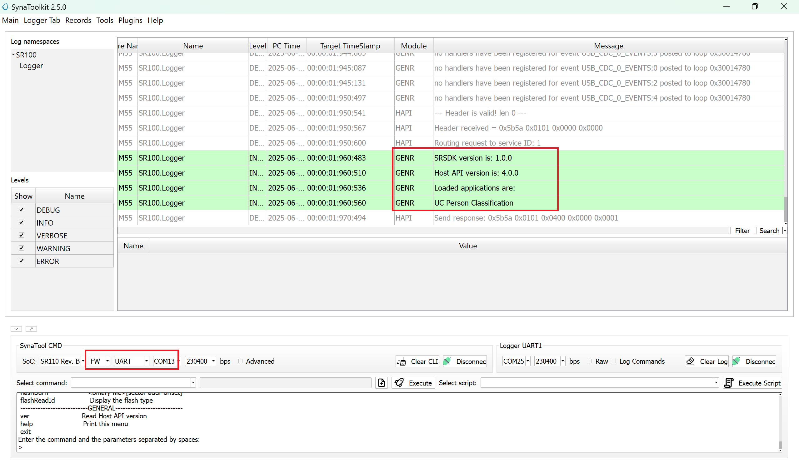
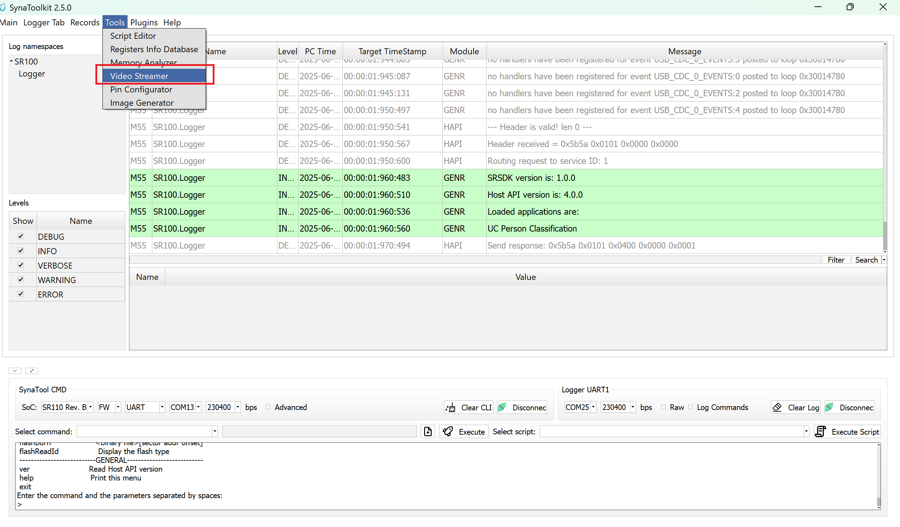
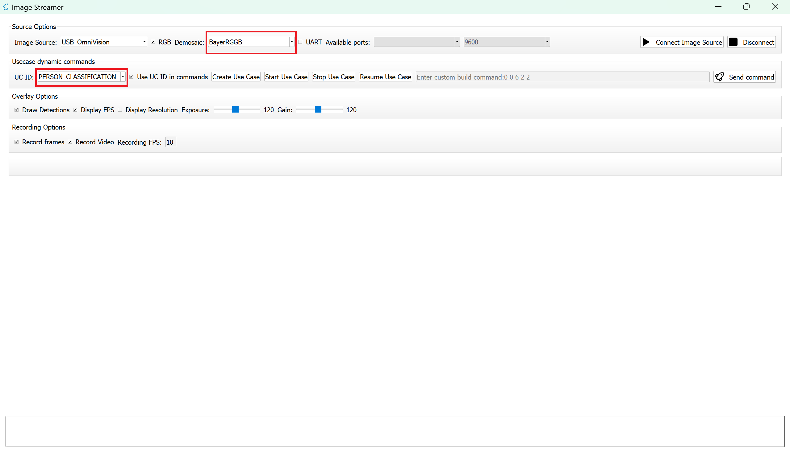
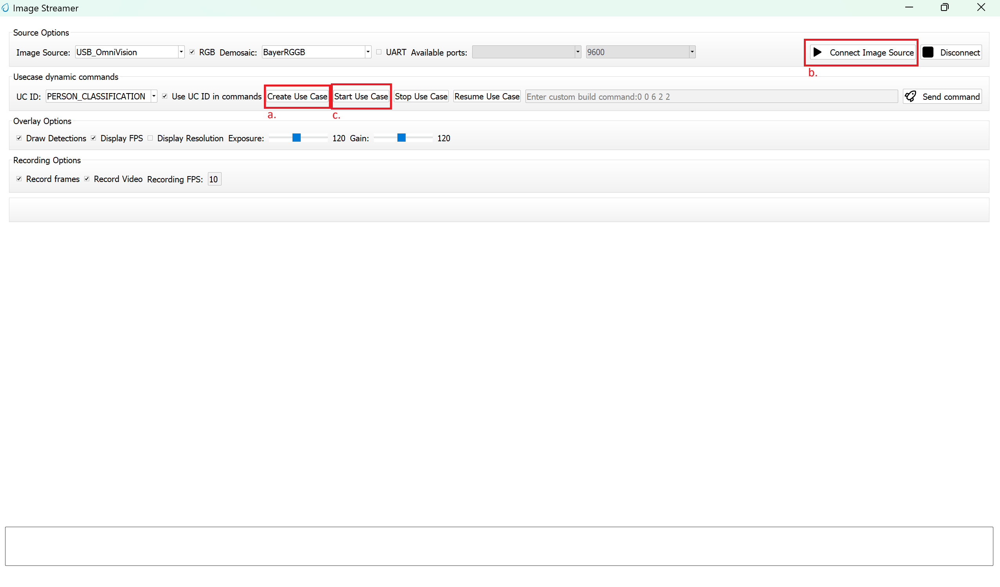
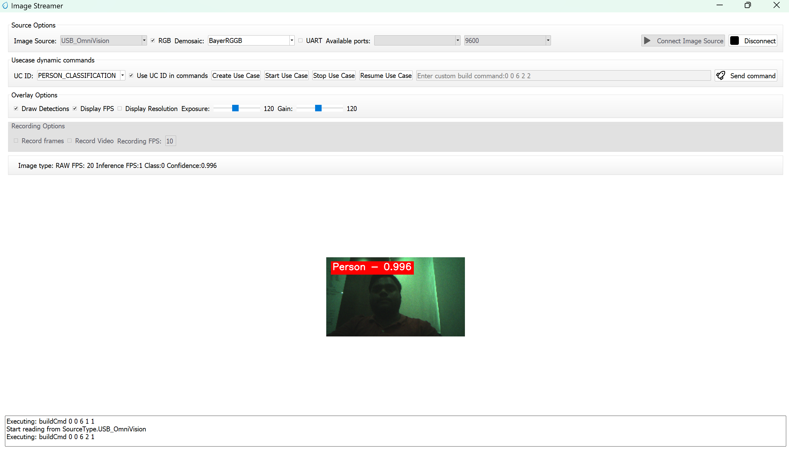

# Person Classification ML Application

## Description

The Person Classification application is a machine learning-powered computer vision solution designed to perform real-time object detection and classification. The application analyzes input from camera feeds and intelligently categorizes detected objects into two distinct classes: person and non-person. This binary classification system enables accurate identification and tracking of human presence within the camera's field of view. This example supports both WQVGA(480x270) and VGA(640x480) resolutions.

## Build Instructions

### Prerequisites
- [GCC/AC6 build environment setup](../developer_guide/build_env.rst)
- [Astra SRSDK VS Code Extension](../developer_guide/SRSDK_VSCode_Extension_Userguide.rst)
- [SynaToolkit](../subject/toolkit/toolkit.rst)

### Configuration and Build Steps

1. **Select Default Configuration**
   ```bash
   make cm55_person_classification_defconfig
   ```
   This configuration uses WQVGA resolution by default.

2. **Optional Configuration:**

   >💡Tip: Run `make menuconfig` to modify the configuration via a GUI.

   | Configuration | Menu Navigation | Action |
   |---------------|-----------------|---------|
   | **VGA Resolution** | `COMPONENTS CONFIGURATION → Off Chip Components → Display Resolution` | Change to `VGA(640x480)` |
   | **WQVGA in LP Sense** | `COMPONENTS CONFIGURATION → Drivers` | Enable `MODULE_LP_SENSE_ENABLED` |
   | **Static Image** | `COMPONENTS CONFIGURATION → Off Chip Components` | Disable `MODULE_IMAGE_SENSOR_ENABLED` |

3. **Build the Application**
   The build process will generate the required `.elf` or `.axf` files for deployment.
   ```bash
   make build or make
   ```

## Deployment and Execution

### Setup and Flashing

1. **Open the Astra SRSDK VSCode Extension and connect to the Debug IC USB port on the Astra Machina Micro Kit.**
   For detailed steps refer to the [Quick Start Kit](../quickstart/Astra_SRSDK_Quick_Start_Guide.rst).

2. **Generate Binary Files**
   - FW Binary generation
      - Navigate to **AXF/ELF TO BIN** → **Bin Conversion** in Astra SRSDK VSCode Extension
      - Load the generated `sr110_cm55_fw.elf` or `sr110_cm55_fw.axf` file
      - Click **Run Image Generator** to create the binary files
      - Refer to [Astra SRSDK VSCode Extension User Guide](../developer_guide/SRSDK_VSCode_Extension_Userguide.rst).
   - Model Binary generation (to place the Model in Flash)
      - To generate `.bin` file for TFLite models, please refer to the [Vela compilation guide](Astra_SRSDK_vela_compilation_tflite_model.md).

3. **Flash the Application**
   
   To flash the application:

   * Navigate to **IMAGE LOADING** in the Astra SRSDK VSCode Extension.
   * Select **SWD/JTAG** as the service type.
   * Choose the respective image bins and click **Flash Execute**.

   **For WQVGA resolution:**
   - Flash the generated `B0_flash_full_image_GD25LE128_67Mhz_secured.bin` file directly to the device. 
   
   > Note: Model weights is placed in SRAM.
   
   **For VGA resolution:**
   - Flash the pre-generated model binary: `person_classification_flash(448x640).bin`. Due to memory constraints, need to burn the Model weights to Flash. 
     - Location: `examples/vision_examples/uc_person_classification/models/`
     - Flash address: `0x629000`
     - **Calculation Note:** Flash address is determined by the sum of the `host_image` size and the `image_offset_SDK_image_B_offset` (parameter, which is defined within `NVM_data.json`). It's crucial that the resulting address is aligned to a sector boundary (a multiple of 4096 bytes).This calculated resulting address should then be assigned to the `image_offset_Model_A_offset` macro in your `NVM_data.json` file.
   - Flash the generated `B0_flash_full_image_GD25LE128_67Mhz_secured.bin` file

   Refer to the [Astra SRSDK VSCode Extension User Guide](../developer_guide/SRSDK_VSCode_Extension_Userguide.rst) for detailed instructions on flashing. 


4. **Device Reset**
   Reset the target device after flashing is complete.

### Note:

The placement of the model (in **SRAM** or **FLASH**) is determined by its memory requirements. Models that exceed the available **SRAM** capacity, considering factors like their weights and the necessary **tensor arena** for inference, will be stored in **FLASH**.

### Running the Application

1. **Open SynaToolkit_2.5.0**

2. **Before running the application, make sure to connect a USB cable to the Application SR110 USB port on the Astra Machina Micro board and then press the reset button**  

   - Connect to the newly enumerated COM port  
   - For logging output, connect to DAP logger port  

   

3. **The example logs will then appear in the logger window.**  

   

4. **Next, navigate to Tools → Video Streamer in SynaToolkit to run the application.**  

   

5. **Video Streamer**  
   - Configure the following settings:  
     - **UC ID**: PERSON_CLASSIFICATION
     - **RGB Demosaic**: BayerRGGB  

   

   - Click **Create Usecase**  
   - Connect the image source  
   - Click **Start Usecase** to begin real-time classification  

   

6. **After starting the use case, Person Classification will begin streaming video as shown below.**
   
     
