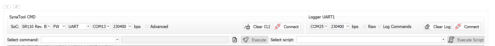
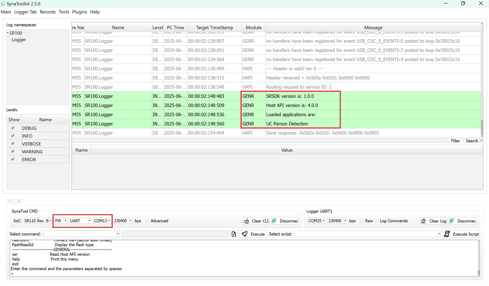
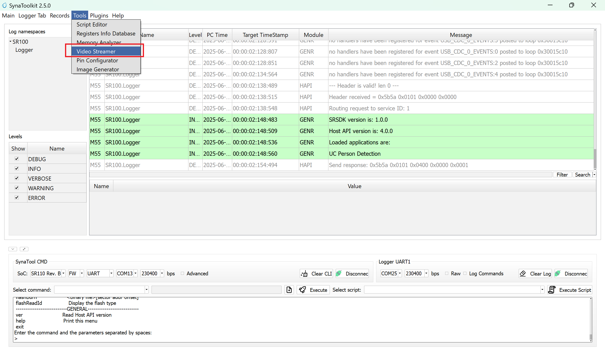
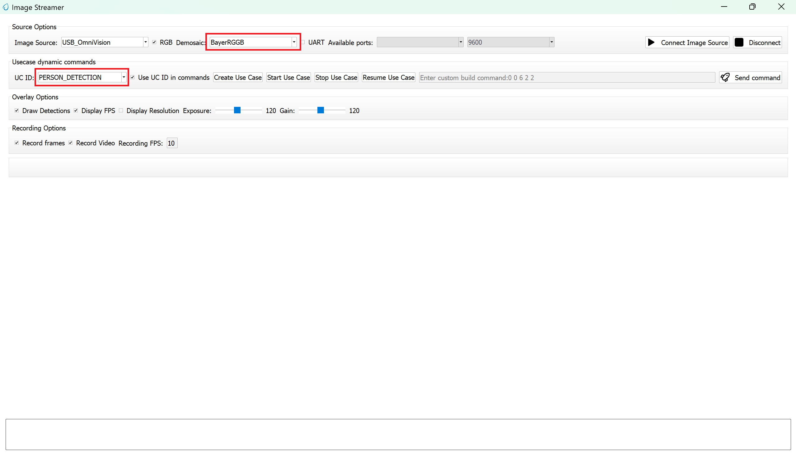
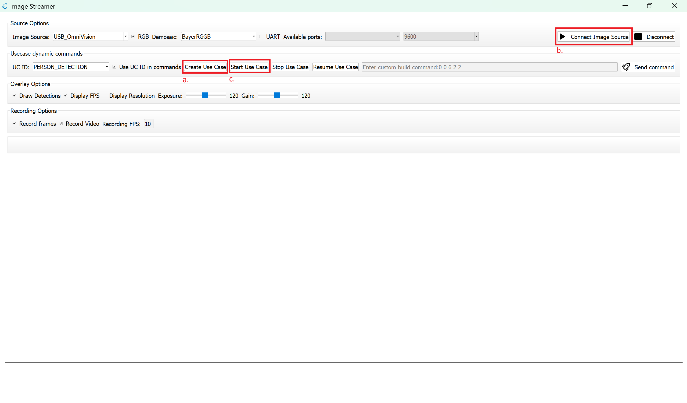
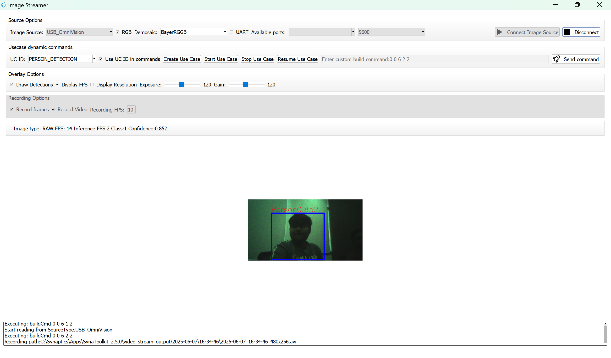

# Person Detection ML Application

## Description

The UC Person Detection application is designed to identify and locate persons within its field of view. It leverages object detection techniques to generate bounding boxes around detected individuals and assigns confidence scores to indicate the reliability of each detection. The output includes the precise location of each person in the image along with a confidence value, enabling accurate and efficient person recognition for various embedded vision applications. This example supports both WQVGA(480x270) and VGA(640x480) resolutions.

## Build Instructions

### Prerequisites
- [GCC/AC6 build environment setup](../developer_guide/build_env.rst)
- [Astra SRSDK VS Code Extension](../developer_guide/SRSDK_VSCode_Extension_Userguide.rst)
- [SynaToolkit](../subject/toolkit/toolkit.rst)


### Configuration and Build Steps

1. **Select Default Configuration**
   ```bash
   make cm55_person_detection_defconfig
   ```
   This configuration uses WQVGA resolution by default.

2. **Optional Configuration:**

   >💡Tip: Run `make menuconfig` to modify the configuration via a GUI.

   | Configuration | Menu Navigation | Action |
   |---------------|-----------------|---------|
   | **VGA Resolution** | `COMPONENTS CONFIGURATION → Off Chip Components → Display Resolution` | Change to `VGA(640x480)` |
   | **WQVGA in LP Sense** | `COMPONENTS CONFIGURATION → Drivers` | Enable `MODULE_LP_SENSE_ENABLED` |
   | **Static Image** | `COMPONENTS CONFIGURATION → Off Chip Components` | Disable `MODULE_IMAGE_SENSOR_ENABLED` |

3. **Build the Application**
   The build process will generate the required `.elf` or `.axf` files for deployment.
   ```bash
   make build or make
   ```

## Deployment and Execution

### Setup and Flashing

1. **Open the VSCode SRSDK Extension and connect to the Debug IC USB port on the Astra Machina Micro Kit.**
   For detailed steps refer to the [Quick Start Kit](../quickstart/Astra_SRSDK_Quick_Start_Guide.rst).

2. **Generate Binary Files**
   - FW Binary generation
      - Navigate to **AXF/ELF TO BIN** → **Bin Conversion** in SRSDK VSCode Extension
      - Load the generated `sr110_cm55_fw.elf` or `sr110_cm55_fw.axf` file
      - Click **Run Image Generator** to create the binary files
      - Refer to [Astra SRSDK VSCode Extension User Guide](../developer_guide/SRSDK_VSCode_Extension_Userguide.rst)
   - Model Binary generation (to place the Model in Flash)
      - To generate `.bin` file for TFLite models, please refer to the [Vela compilation guide](Astra_SRSDK_vela_compilation_tflite_model.md).

3. **Flash the Application**
   
   To flash the application:

   * Navigate to **IMAGE LOADING** in the SRSDK VSCode Extension.
   * Select **SWD/JTAG** as the service type.
   * Choose the respective image bins and click **Flash Execute**.
   
   **For WQVGA resolution:**
   - Flash the generated `B0_flash_full_image_GD25LE128_67Mhz_secured.bin` file directly to the device. Note: Model weights is placed in SRAM.
   
   **For VGA resolution:**
   - Flash the pre-generated model binary: `person_detection_flash(448x640).bin`. Due to memory constraints, need to burn the Model weights to Flash. 
     - Location: `examples/vision_examples/uc_person_detection/models/`
     - Flash address: `0x629000`
     - **Calculation Note:** Flash address is determined by the sum of the `host_image` size and the `image_offset_SDK_image_B_offset` (parameter, which is defined within `NVM_data.json`). It's crucial that the resulting address is aligned to a sector boundary (a multiple of 4096 bytes).This calculated resulting address should then be assigned to the `image_offset_Model_A_offset` macro in your `NVM_data.json` file.
   - Flash the generated `B0_flash_full_image_GD25LE128_67Mhz_secured.bin` file

   Refer to the [Astra SRSDK VSCode Extension User Guide](../developer_guide/SRSDK_VSCode_Extension_Userguide.rst) for detailed instructions on flashing. 

4. **Device Reset**
   Reset the target device after flashing is complete.

### Note:

The placement of the model (in **SRAM** or **FLASH**) is determined by its memory requirements. Models that exceed the available **SRAM** capacity, considering factors like their weights and the necessary **tensor arena** for inference, will be stored in **FLASH**.

### Running the Application

1. **Open SynaToolkit_2.5.0**

2. **Before running the application, make sure to connect a USB cable to the Application SR110 USB port on the Astra Machina Micro board and then press the reset button**

   - Connect to the newly enumerated COM port  
   - For logging output, connect to DAP logger port  

   

3. **The example logs will then appear in the logger window.**  

   

4. **Next, navigate to Tools → Video Streamer in SynaToolkit to run the application.**  

   

5. **Video Streamer**  
   - Configure the following settings:  
     - **UC ID**: PERSON_DETECTION
     - **RGB Demosaic**: BayerRGGB  

   

   - Click **Create Usecase**  
   - Connect the image source  
   - Click **Start Usecase** to begin real-time detection  

   

6. **After starting the use case, Person detection will begin streaming video as shown below.**
   


## Adapting Pipeline for Custom Object Detection Models

This person detection pipeline can be adapted to work with custom object detection models. However, certain validation steps and potential modifications are required to ensure compatibility.

### Prerequisites for Model Compatibility

Before adapting this pipeline for another object detection model, you must verify the following:

#### 1. Model Format Requirements
- Your object detection model should be in `.tflite` format
- The model should produce similar output tensor structure (bounding boxes, confidence scores)

#### 2. Vela Compiler Compatibility Check

**Step 1: Analyze Original Model**
1. Load your `object_detection_model.tflite` file in [Netron](https://netron.app/)
2. Document the output tensors:
   - Tensor names
   - Tensor identifiers/indexes  
   - Quantization parameters (scale and offset values)
   - Tensor dimensions

**Step 2: Compile with Vela**
1. Pass your model through the Vela compiler to generate `model_vela.bin` or `model_vela.tflite`
2. Analyze the Vela-compiled model in Netron using the same steps as above

**Step 3: Compare Outputs**
Compare the following between original and Vela-compiled models:
- **Output tensor indexes/identifiers**: Verify if they remain in the same order
- **Quantization parameters**: Check if scale and offset values are preserved
- **Tensor dimensions**: Ensure dimensions match your expected output format

### Pipeline Adaptation Process

#### Case 1: No Changes Required
If the Vela compilation preserves:
- ✅ Output tensor indexes in the same order
- ✅ Same quantization scale and offset values

**Result**: You can proceed with the existing pipeline without modifications.

#### Case 2: Modifications Required
If the Vela compilation changes:
- ❌ Output tensor index order
- ❌ Quantization parameters

**Required Actions**: Modify the pipeline code as described below.

### Code Modifications

If your model's output tensor indexes change after Vela compilation, you need to update the tensor parameter assignments in `uc_person_detection.c`:

#### Location: `detection_post_process` function

**Original Code:**
```c
g_box1_params = &g_all_tens_params[0];     
g_box2_params = &g_all_tens_params[1];     
g_cls_params  = &g_all_tens_params[2];
```

**Modified Code:**
Update the array indexes according to your Vela-compiled model's output tensor identifiers:
```c
// Example: If your model_vela output has different tensor order
g_box1_params = &g_all_tens_params[X];  // Replace X with actual index from Netron
g_box2_params = &g_all_tens_params[Y];  // Replace Y with actual index from Netron  
g_cls_params  = &g_all_tens_params[Z];  // Replace Z with actual index from Netron
```
