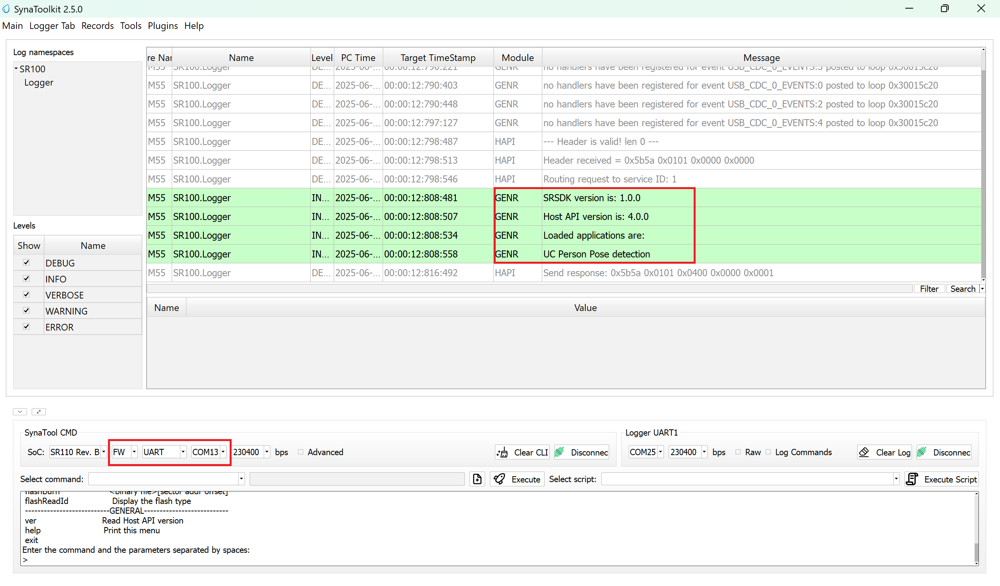
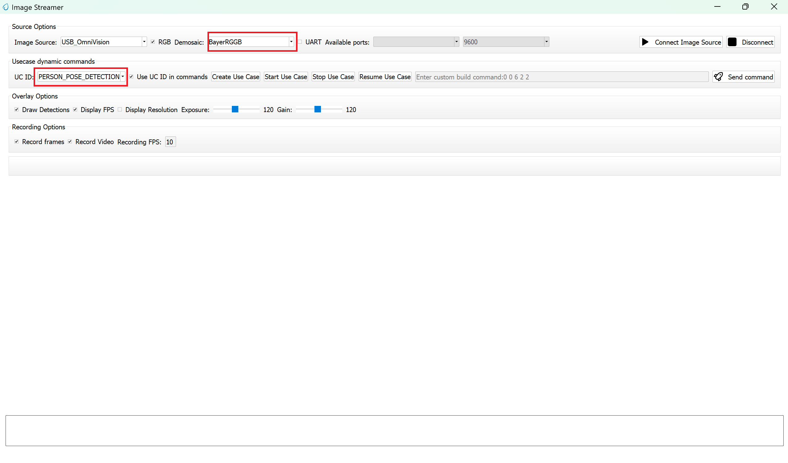

# Person Pose Detection ML Application

## Description

The UC Person Pose Detection application detects individuals in the camera's field of view by generating bounding boxes and identifying 17 keypoints for each person, corresponding to various body parts. Each keypoint is accompanied by a confidence score that indicates the reliability of the detection, enabling accurate estimation of the person's pose. This example supports both WQVGA(480x270) and VGA(640x480) resolutions.

## Build Instructions

### Prerequisites
- [GCC/AC6 build environment setup](../developer_guide/build_env.rst)
- [Astra SRSDK VS Code Extension](../developer_guide/SRSDK_VSCode_Extension_Userguide.rst)
- [SynaToolkit](../subject/toolkit/toolkit.rst)

### Configuration and Build Steps

1. **Select Default Configuration**
   ```bash
   make cm55_person_pose_detection_defconfig
   ```
   This configuration uses WQVGA resolution by default.

2. **Optional Configuration:**

   >💡Tip: Run `make menuconfig` to modify the configuration via a GUI.

   | Configuration | Menu Navigation | Action |
   |---------------|-----------------|---------|
   | **VGA Resolution** | `COMPONENTS CONFIGURATION → Off Chip Components → Display Resolution` | Change to `VGA(640x480)` |
   | **WQVGA in LP Sense** | `COMPONENTS CONFIGURATION → Drivers` | Enable `MODULE_LP_SENSE_ENABLED` |
   | **Static Image** | `COMPONENTS CONFIGURATION → Off Chip Components` | Disable `MODULE_IMAGE_SENSOR_ENABLED` |

3. **Build the Application**
   The build process will generate the required `.elf` or `.axf` files for deployment.
   ```bash
   make build or make
   ```

## Deployment and Execution

### Setup and Flashing

1. **Open the VSCode Astra SRSDK Extension and connect to the Debug IC USB port on the Astra Machina Micro Kit.**
   For detailed steps refer to the [Quick Start Kit](../quickstart/Astra_SRSDK_Quick_Start_Guide.rst).

2. **Generate Binary Files**
   - FW Binary generation
      - Navigate to **AXF/ELF TO BIN** → **Bin Conversion** in Astra SRSDK VSCode Extension
      - Load the generated `sr110_cm55_fw.elf` or `sr110_cm55_fw.axf` file
      - Click **Run Image Generator** to create the binary files
      - Refer to [Astra SRSDK VSCode Extension User Guide](../developer_guide/Astra_MCU_SDK_VSCode_Extension_Userguide.rst).
   - Model Binary generation (to place the Model in Flash)
      - To generate `.bin` file for TFLite models, please refer to the [Vela compilation guide](Astra_SRSDK_vela_compilation_tflite_model.md).

3. **Flash the Application**
   
   To flash the application:

   * Navigate to **IMAGE LOADING** in the Astra SRSDK VSCode Extension.
   * Select **SWD/JTAG** as the service type.
   * Choose the respective image bins and click **Flash Execute**.
   
   **For WQVGA resolution:**
   - Flash the generated `B0_flash_full_image_GD25LE128_67Mhz_secured.bin` file directly to the device. Note: Model weights is placed in SRAM.
   
   **For VGA resolution:**
   - Flash the pre-generated model binary: `person_pose_detection_flash(448x640).bin`. Due to memory constraints, need to burn the Model weights to Flash. 
     - Location: `examples/vision_examples/uc_person_pose_detection/models/`
     - Flash address: `0x629000`
     - **Calculation Note:** Flash address is determined by the sum of the `host_image` size and the `image_offset_SDK_image_B_offset` (parameter, which is defined within `NVM_data.json`). It's crucial that the resulting address is aligned to a sector boundary (a multiple of 4096 bytes).This calculated resulting address should then be assigned to the `image_offset_Model_A_offset` macro in your `NVM_data.json` file.
   - Flash the generated `B0_flash_full_image_GD25LE128_67Mhz_secured.bin` file

   Refer to the [Astra SRSDK VSCode Extension User Guide](../developer_guide/Astra_MCU_SDK_VSCode_Extension_Userguide.rst) for detailed instructions on flashing. 

4. **Device Reset**
   Reset the target device after flashing is complete.

### Note:

The placement of the model (in **SRAM** or **FLASH**) is determined by its memory requirements. Models that exceed the available **SRAM** capacity, considering factors like their weights and the necessary **tensor arena** for inference, will be stored in **FLASH**.

### Running the Application

1. **Open SynaToolkit_2.5.0**

2. **Before running the application, make sure to connect a USB cable to the Application SR110 USB port on the Astra Machina Micro board and then press the reset button**

   - Connect to the newly enumerated COM port  
   - For logging output, connect to DAP logger port  

   

3. **The example logs will then appear in the logger window.**  

   

4. **Next, navigate to Tools → Video Streamer in SynaToolkit to run the application.**  

   

5. **Video Streamer**  
   - Configure the following settings:  
     - **UC ID**: PERSON_POSE_DETECTION
     - **RGB Demosaic**: BayerRGGB  

   

   - Click **Create Usecase**  
   - Connect the image source  
   - Click **Start Usecase** to begin real-time pose_detection  

   

6. **After starting the use case, Person pose detection will begin streaming video as shown below.**
   
